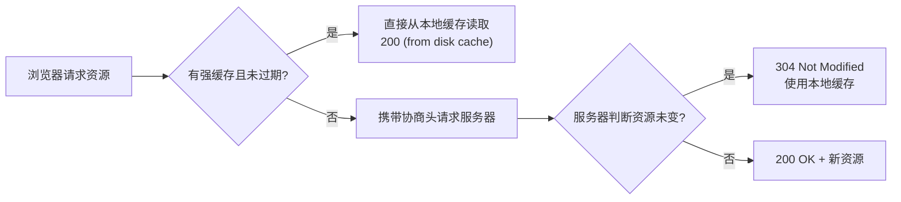
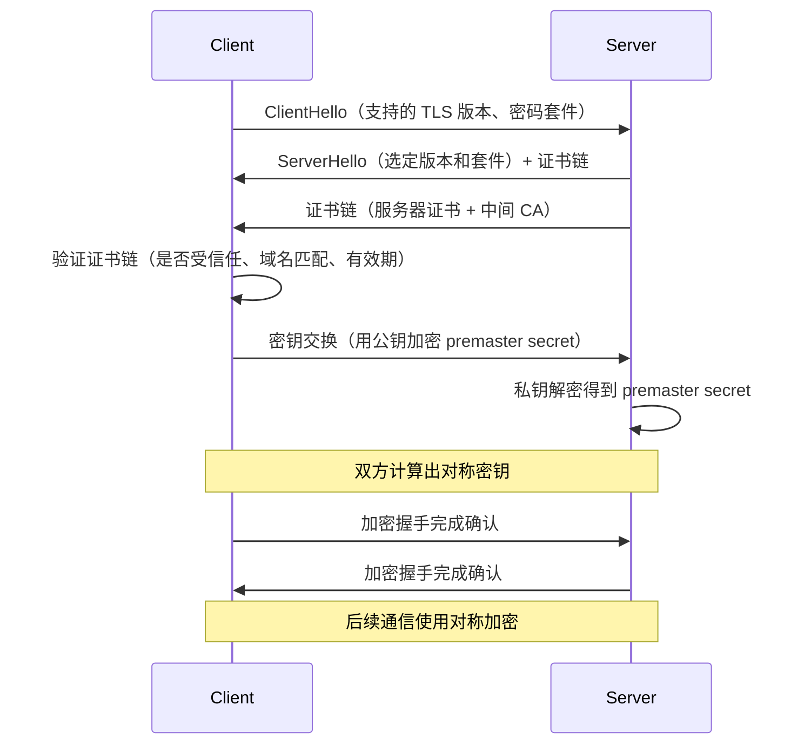
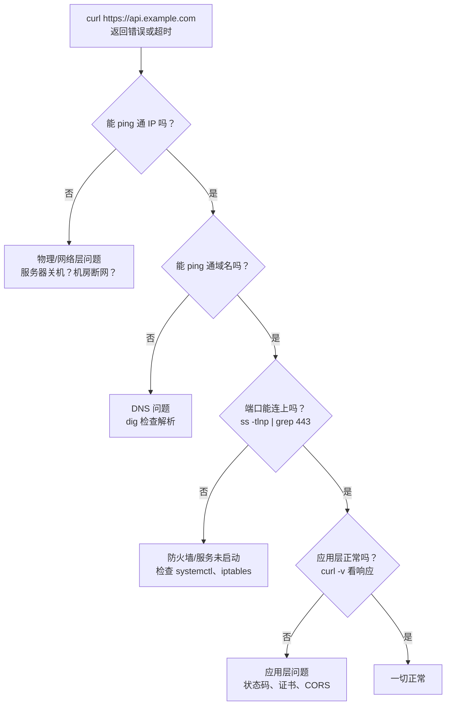
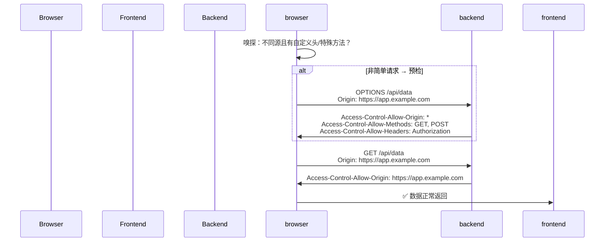

# 基础网络学习大纲

> 面向开发者的网络知识学习路径：不追求网络工程师级别的面面俱到，而是聚焦**日常开发与部署中最常用的网络知识**——DNS 解析、HTTP 协议、TLS/HTTPS、端口与防火墙、CORS、网络排障。

---

## 📌 元信息

| 项目 | 说明 |
|------|------|
| **预计学习时间** | 4 天（约 10-14 小时） |
| **目标读者** | 全栈 / 后端开发者，已掌握 Linux 基础命令 |
| **前置模块** | Linux 基础（至少会 `curl`、`ss`、`ping`） |
| **面试定位** | DNS 解析流程、HTTPS 握手、状态码、CORS 前置请求是面试高频题 |
| **实战产出** | 网络排障决策树、HTTPS 证书部署、Nginx 反代配置 |

---

## 🎯 学习目标

完成本模块学习后，你应该能够：

1. 能解释从浏览器输入 URL 到页面加载的完整网络流程
2. 知道 DNS 解析的完整链路，能排查 DNS 问题（`dig`、`nslookup`）
3. 理解 HTTP 请求/响应结构，常见状态码含义，能通过 `curl -v` 排障
4. 理解对称/非对称加密、TLS 握手流程，能配置 HTTPS 证书
5. 理解 CORS 的成因和解决方案，能答复面试追问
6. 遇到"连不上"能按分层模型系统排查

---

## 📋 前置要求

- 会用 `curl`、`ping`、`ss`、`dig` 基础命令
- 了解 IP 地址、端口号的基本概念

---

## 🧠 核心知识体系

| 领域 | 核心知识点 | 对开发者的价值 |
|------|-----------|---------------|
| **DNS** | 递归/迭代查询、A/CNAME/MX 记录、TTL、CDN 原理 | 配域名、排障"解析不了" |
| **HTTP** | 请求/响应结构、状态码、`curl -v`、缓存控制 | 调接口、排障 API 问题 |
| **HTTPS/TLS** | 对称 vs 非对称、证书链、SNI、Let's Encrypt | 配 HTTPS、理解"不安全" |
| **TCP** | 三次握手、四次挥手、TIME_WAIT、端口 | 排障"连接超时" |
| **网络排障** | 分层排查法、`traceroute`、`mtr`、tcpdump | 定位网络故障 |
| **CORS** | 跨域访问控制、预检请求、Access-Control-* 头 | 前后端联调"被拦截" |
| **负载均衡** | 四层 vs 七层、会话保持、健康检查 | 理解 Nginx/网关 |

---

## 🗺️ 学习路径（4 天）

| 天数 | 主题 | 产出 |
|------|------|------|
| **Day 1** | DNS 与 HTTP 基础 | 能解释 URL → 页面加载的全过程，会用 `dig`/`curl -v` 排障 |
| **Day 2** | HTTPS/TLS 与证书管理 | 理解 TLS 握手过程，能为站点配置 Let's Encrypt 证书 |
| **Day 3** | 网络排障实战 | 掌握分层排障法，能独立解决 80% 的"连不上"问题 |
| **Day 4** | CORS、代理与负载均衡 | 理解 CORS 预检流程，能配置 Nginx 反向代理和简单负载均衡 |

---

## 📚 文档目录规划

```text
src/deploy/network/
├── network-learning-outline.md          # 本文件
├── doc/
│   ├── 01-dns-http-basics.md            # DNS 与 HTTP 基础
│   ├── 02-https-tls-certificate.md      # HTTPS/TLS 与证书管理
│   ├── 03-network-troubleshooting.md    # 网络排障实战
│   └── 04-cors-proxy-lb.md              # CORS、代理与负载均衡
└── assets/                              # 截图、架构图、流程图
```

---

## 第 1 天：DNS 与 HTTP 基础

### 1.1 一次完整的 URL 访问
- 浏览器输入 URL 到页面加载的 7 步流程
- DNS 递归/迭代查询链路
- OSI 七层 vs TCP/IP 四层模型（开发者够用即可）

### 1.2 DNS 详解
- 记录类型：A、CNAME、MX、TXT、AAAA 各自用途
- TTL 和缓存：修改 DNS 后为什么不能立即生效
- 常用工具：`dig`、`nslookup`、`host`
- 常用的 CDN 原理（CNAME 调度到 CDN）
- 公共 DNS：114.114.114.114（国内）、223.5.5.5（阿里）、8.8.8.8（Google）
- DNS 劫持：运营商劫持的原理与解决（改用公共 DNS / DNS over HTTPS）

```bash
# 查看 DNS 解析全过程
dig +trace example.com

# 仅查询 A 记录
dig example.com A +short

# 反向查询
dig -x 8.8.8.8
```

### 1.3 HTTP 协议基础
- 请求报文结构（请求行、Header、Body）
- 响应报文结构（状态行、Header、Body）
- 核心状态码速查表（2xx/3xx/4xx/5xx）

| 状态码 | 含义 | 常见场景 |
|--------|------|---------|
| 200 OK | 请求成功 |
| 301/302 | 永久/临时重定向 | HTTP → HTTPS、域名迁移 |
| 304 Not Modified | 缓存生效 | 浏览器资源缓存 |
| 401 Unauthorized | 未认证 | 缺少 Token |
| 403 Forbidden | 无权限 | IP 被限制 |
| 404 Not Found | 资源不存在 | 路由配置错 |
| 429 Too Many Requests | 频率限制 | API 限流 |
| 500 | 服务端内部错误 | 后端异常 |
| 502 Bad Gateway | 上游不可达 | Nginx → 后端不通 |
| 503 | 服务暂时不可用 | 重启/过载 |

```bash
# 查看完整请求/响应头
curl -v https://api.example.com/health

# 只看响应头
curl -I https://example.com

# 跟随重定向
curl -L http://example.com
```

### 1.4 HTTP 缓存控制
- 强缓存 vs 协商缓存的判断逻辑
- `Cache-Control: max-age` / `no-cache` / `no-store` / `must-revalidate`
- `ETag` + `If-None-Match`、`Last-Modified` + `If-Modified-Since`
- CDN 节点缓存：`s-maxage`、`public` vs `private`



---

## 第 2 天：HTTPS/TLS 与证书管理

### 2.1 为什么需要 HTTPS
- 明文传输的风险：窃听、篡改、冒充
- 对称加密 vs 非对称加密：密钥交换方案不同
- 数字签名和证书的作用

### 2.2 TLS 1.3 握手流程

> 以下时序图展示 TLS 1.3 的 1-RTT 握手。TLS 1.2 需要 2-RTT（额外一次 Client/Server 交换），面试常追问两者的差异。TLS 1.3 的改进包括移除不安全算法、缩短握手到 1-RTT、首次连接的 0-RTT 模式。



### 2.3 证书管理实战
- 自签名证书 vs 受信任 CA 证书
- Let's Encrypt + Certbot 自动化
- 证书链文件说明（`.crt`、`.key`、`.pem`、`.p12` 区别）

```bash
# 查看证书详细信息
openssl s_client -connect example.com:443 -servername example.com

# 查看证书有效期和主题
openssl s_client -connect example.com:443 -servername example.com 2>/dev/null \
  | openssl x509 -noout -dates -subject

# 生成自签名证书
openssl req -x509 -newkey rsa:2048 -keyout key.pem -out cert.pem -days 365 -nodes
```

### 2.4 Nginx HTTPS 配置示例
```nginx
server {
    listen 443 ssl;
    server_name example.com;

    ssl_certificate     /etc/letsencrypt/live/example.com/fullchain.pem;
    ssl_certificate_key /etc/letsencrypt/live/example.com/privkey.pem;
    ssl_protocols       TLSv1.2 TLSv1.3;
    ssl_ciphers         HIGH:!aNULL:!MD5;

    # HSTS（启用后浏览器强制 HTTPS）
    add_header Strict-Transport-Security "max-age=31536000";

    location / {
        proxy_pass http://localhost:3000;
    }
}
```

---

## 第 3 天：网络排障实战

### 3.1 分层排障法



### 3.2 常见场景

**场景 1：Connection Refused**
```bash
# 服务没启动或端口不匹配
ss -tlnp | grep 3000    # 检查端口监听
systemctl status myapp   # 检查服务状态
curl localhost:3000      # 本地测试排除防火墙
```

**场景 2：Connection Timeout**
```bash
# 防火墙拦截或网络不可达
ping host               # 基础连通性
traceroute host         # 路由追踪
# 检查云服务商安全组/防火墙规则
```

**场景 3：DNS 解析异常**
```bash
dig example.com         # 查看 DNS 解析结果
nslookup example.com    # 另一种查询方式
dig +trace example.com  # 全链路追踪

# 检查 /etc/hosts 是否被覆盖
cat /etc/hosts
```

### 3.3 实用工具速查

| 工具 | 场景 | 核心用法 |
|------|------|---------|
| `curl -v` | HTTP/HTTPS 排障一哥 | 查看完整请求响应头和延迟 |
| `dig` | DNS 排障 | `dig +short example.com` |
| `ss` | 端口监听检查 | `ss -tlnp` |
| `ping` | 基础连通性 | `ping -c 5 host` |
| `traceroute` | 路由追踪 | 看哪一跳丢包 |
| `mtr` | 持续追踪+统计 | `mtr host`，比 traceroute 更直观 |
| `tcpdump` | 抓包分析（高阶） | `tcpdump -i eth0 port 443` |

---

## 第 4 天：CORS、代理与负载均衡

### 4.1 CORS 详解
- 同源策略的初衷：防止恶意网站读取另一个网站的敏感数据
- 简单请求 vs 预检请求（Preflight）



- 常见响应头：`Access-Control-Allow-Origin`、`Access-Control-Allow-Methods`、`Access-Control-Allow-Headers`、`Access-Control-Allow-Credentials`
- 凭证请求（`credentials: include`）：`Access-Control-Allow-Origin` 不能用 `*`

### 4.2 Nginx 反向代理

```nginx
# 反向代理：解决跨域、隐藏后端、负载均衡
server {
    listen 80;
    server_name api.example.com;

    location /api/ {
        proxy_pass http://backend:3000/;

        # 转发客户端真实 IP
        proxy_set_header Host $host;
        proxy_set_header X-Real-IP $remote_addr;
        proxy_set_header X-Forwarded-For $proxy_add_x_forwarded_for;

        # CORS 头（直接在 Nginx 层统一处理）
        add_header Access-Control-Allow-Origin $http_origin always;
        add_header Access-Control-Allow-Methods "GET, POST, PUT, DELETE, OPTIONS" always;
        add_header Access-Control-Allow-Headers "Authorization, Content-Type" always;

        # 预检请求直接返回 204
        if ($request_method = OPTIONS) {
            return 204;
        }
    }
}
```

### 4.3 四层负载均衡 vs 七层负载均衡

| 维度 | 四层（L4） | 七层（L7） |
|------|-----------|-----------|
| 工作层级 | TCP/UDP | HTTP/HTTPS |
| 转发依据 | IP + 端口 | URL、Header、Cookie |
| 典型工具 | HAProxy（TCP 模式）、LVS | Nginx、HAProxy（HTTP 模式） |
| 优势 | 性能高、协议无关 | 可以按请求内容路由 |
| 劣势 | 无法基于请求内容做路由 | 性能略低，需要解析 HTTP |

```nginx
# Nginx 简单负载均衡
upstream backend {
    server 10.0.0.1:3000 weight=3;
    server 10.0.0.2:3000 weight=1;
    server 10.0.0.3:3000 backup;
}

server {
    listen 80;
    location / {
        proxy_pass http://backend;
    }
}
```

---

## ✅ 完成标准

- [ ] 能用一句话说清从输入 URL 到页面加载的完整流程
- [ ] 能用 `dig` 排查 DNS 解析问题，理解 TTL 的作用 **→ 面试：DNS 递归/迭代流程**
- [ ] 能用 `curl -v` 查看完整的请求/响应头，读懂常见状态码 **→ 面试：状态码含义与排障**
- [ ] 能解释对称加密 vs 非对称加密在 TLS 中的分工 **→ 面试：HTTPS 握手过程**
- [ ] 能用 Certbot 为站点自动申请和续期 HTTPS 证书
- [ ] 遇到 "Connection refused" / "timeout" / "DNS 解析失败" 能按层排查
- [ ] 能解释 CORS 预检请求触发的条件和工作流程 **→ 面试：CORS 预检与凭证请求**
- [ ] 能配置 Nginx 反向代理（含 HTTPS、CORS 头、负载均衡）

---

## 🔗 关联模块

- Nginx 实践：[nginx/doc/01-nginx-overview-config-static.md](../nginx/doc/01-nginx-overview-config-static.md)
- Docker 网络：[docker/doc/04-network-volume-log.md](../docker/doc/04-network-volume-log.md)
- Linux 网络排障：[linux/doc/04-process-network-systemd.md](../linux/doc/04-process-network-systemd.md)
- CI/CD 中网络相关任务：[ci/doc/02-github-actions.md](../ci/doc/02-github-actions.md)

---

## 📝 学习建议

1. **工具意识 > 背协议**：你不用背 TCP 包头的 13 个字段，但要知道 `curl -v` 看什么、`dig` 查什么
2. **配合 Nginx 学习**：Day 4 的反代和负载均衡与 Nginx 模块直接重叠，可以一起学
3. **自建一个 HTTPS 站点**：用 Certbot 给你的开发环境配一个真实证书，体验一下整个流程
4. **排障能力是核心产出**：学完 Day 3 后，遇到"连不上"应该能形成分层排查的习惯，而不是靠猜
