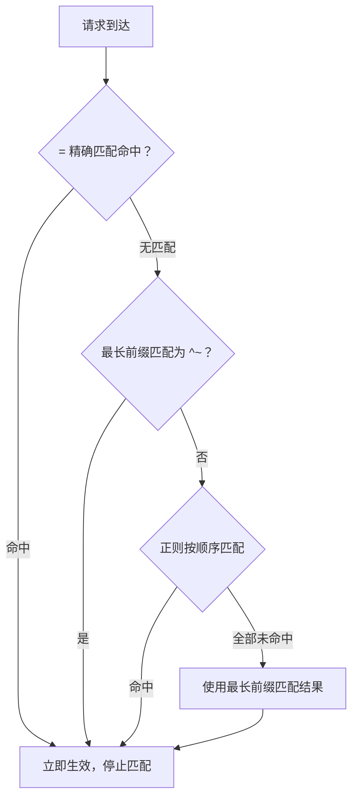
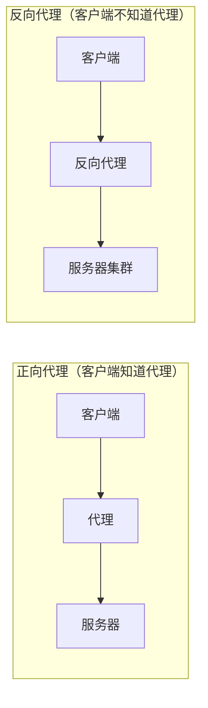

# 02 - Location 匹配 + 反向代理 + 负载均衡

> **面试核心**：掌握 Location 匹配优先级、反向代理配置、负载均衡策略。

---

## 🎯 学习目标

- 掌握 Location 匹配规则与优先级（**面试高频**）
- 理解反向代理原理，熟练配置 `proxy_pass`
- 掌握 4 种负载均衡策略及其适用场景
- 能独立配置反向代理 + 负载均衡的生产环境

---

## 1. Location 匹配规则（面试高频）

### 匹配语法

| 语法 | 含义 | 优先级 |
|------|------|--------|
| `= /path` | 精确匹配 | 最高 |
| `^~ /path` | 前缀匹配（最长前缀为 ^~ 时跳过正则） | 高 |
| `~ pattern` | 正则匹配（区分大小写） | 中 |
| `~* pattern` | 正则匹配（不区分大小写） | 中 |
| `/path` | 普通前缀匹配 | 低 |

### 匹配优先级（必须记住）

```
1. = 精确匹配     ──→  找到即停止
2. ^~ 前缀匹配    ──→  最长前缀匹配为 ^~ 时，跳过正则
3. ~ / ~* 正则    ──→  按顺序匹配，第一个匹配的生效
4. 普通前缀匹配   ──→  正则全部未命中时，使用最长前缀结果
```

**关键点**：
- `=` 匹配成功后**立即停止**；`^~` 的准确语义是「**最长前缀匹配为 `^~` 时跳过正则**」，并非「扫到 `^~` 就停」
- 正则按**配置文件中的顺序**匹配，第一个匹配的生效
- 普通前缀匹配会**继续检查正则**，除非没有正则才生效

> 📚 官方文档：[location 指令与匹配规则](https://nginx.org/en/docs/http/ngx_http_core_module.html#location)

### 示例详解

```nginx
# 1. 精确匹配 /api（优先级最高）
location = /api {
    return 200 "API Root";  # 只匹配 /api，不匹配 /api/users
}

# 2. ^~ 前缀匹配（最长前缀为 ^~ 时，不再检查正则）
location ^~ /static/ {
    root /var/www;  # 匹配 /static/xxx，不再检查正则
}

# 3. 正则匹配（区分大小写）
location ~ \.php$ {
    fastcgi_pass 127.0.0.1:9000;  # 匹配 .php 结尾的请求
}

# 4. 正则匹配（不区分大小写）
location ~* \.(jpg|css|js)$ {
    expires 30d;  # 匹配图片/CSS/JS，不区分大小写
}

# 5. 默认匹配（优先级最低）
location / {
    proxy_pass http://backend;  # 兜底匹配
}
```

### 匹配流程图



---

## 2. 反向代理（面试必问）

### 正向代理 vs 反向代理

| 类型 | 代理对象 | 典型场景 | 隐藏对象 |
|------|----------|----------|----------|
| 正向代理 | 客户端 | VPN、科学上网、访问控制 | 隐藏客户端 |
| 反向代理 | 服务器 | 负载均衡、SSL 终止、缓存 | 隐藏服务器 |



### 为什么需要反向代理

| 场景 | 说明 |
|------|------|
| **负载均衡** | 将请求分发到多个后端服务器 |
| **SSL 终止** | 在 Nginx 处理 HTTPS，后端只处理 HTTP |
| **缓存加速** | 缓存静态资源，减轻后端压力 |
| **安全防护** | 隐藏后端服务器真实 IP |
| **统一入口** | 多个服务共享一个域名 |

### proxy_pass 配置详解

#### 带 `/` 与不带 `/` 的区别（高频坑点）

```nginx
# 带 /：绝对路径，替换匹配部分
location /api/ {
    proxy_pass http://127.0.0.1:3000/;
}
# 请求 /api/users → 转发到 http://127.0.0.1:3000/users

# 不带 /：相对路径，保留原始 URI
location /api/ {
    proxy_pass http://127.0.0.1:3000;
}
# 请求 /api/users → 转发到 http://127.0.0.1:3000/api/users
```

**记忆口诀**：带 `/` 去掉前缀，不带 `/` 保留完整路径。

> 📚 官方文档：[proxy_pass](https://nginx.org/en/docs/http/ngx_http_proxy_module.html#proxy_pass)

#### 代理头信息配置

```nginx
location / {
    proxy_pass http://127.0.0.1:3000;

    # 必须设置的头信息
    proxy_set_header Host $host;                    # 原始请求的 Host
    proxy_set_header X-Real-IP $remote_addr;        # 客户端真实 IP
    proxy_set_header X-Forwarded-For $proxy_add_x_forwarded_for;  # IP 链
    proxy_set_header X-Forwarded-Proto $scheme;     # 原始协议（http/https）

    # 超时配置
    proxy_connect_timeout 60s;  # 连接超时
    proxy_send_timeout 60s;     # 发送超时
    proxy_read_timeout 60s;     # 读取超时

    # 缓冲配置
    proxy_buffering on;
    proxy_buffer_size 4k;
    proxy_buffers 8 4k;
}
```

#### X-Forwarded-For 说明


> `X-Forwarded-For` 记录客户端真实 IP，而非 Nginx IP。

#### WebSocket 代理

WebSocket 通过 HTTP `Upgrade` 握手升级协议，而 proxy 默认使用 HTTP/1.0 且不透传 `Upgrade` 头，必须显式配置：

```nginx
# http 块：映射 Connection 头（无 Upgrade 时置空/关闭，避免影响普通 keep-alive 请求）
map $http_upgrade $connection_upgrade {
    default upgrade;
    ''      close;
}

upstream backend {
    least_conn;  # WebSocket 长连接场景适合最少连接策略
    server 127.0.0.1:3000;
    server 127.0.0.1:3001;
}

server {
    listen 80;

    location /ws/ {
        proxy_pass http://backend;
        proxy_http_version 1.1;                    # WebSocket 握手需要 HTTP/1.1
        proxy_set_header Upgrade $http_upgrade;    # 透传 Upgrade 头
        proxy_set_header Connection $connection_upgrade;
        proxy_set_header Host $host;
        proxy_read_timeout 300s;  # 长连接空闲超过默认 60s 会被断开
    }
}
```

---

## 3. 负载均衡（面试常问）

### upstream 配置

```nginx
# 定义后端服务器组
upstream backend {
    server 192.168.1.101:8080;
    server 192.168.1.102:8080;
    server 192.168.1.103:8080;
}

# 使用负载均衡
server {
    listen 80;
    location / {
        proxy_pass http://backend;  # 注意：这里没有 /
    }
}
```

> 📚 官方文档：[ngx_http_upstream_module](https://nginx.org/en/docs/http/ngx_http_upstream_module.html)

### 4 种负载均衡策略

#### 1. 轮询（Round Robin）— 默认

```nginx
upstream backend {
    server 192.168.1.101:8080;
    server 192.168.1.102:8080;
}
# 请求按顺序依次分配：101 → 102 → 101 → 102 → ...
```

**适用场景**：服务器性能相近，无状态服务。

#### 2. 加权轮询（Weighted Round Robin）

```nginx
upstream backend {
    server 192.168.1.101:8080 weight=3;  # 3/4 请求
    server 192.168.1.102:8080 weight=1;  # 1/4 请求
}
```

**适用场景**：服务器性能不同，按能力分配。

#### 3. IP 哈希（IP Hash）

```nginx
upstream backend {
    ip_hash;
    server 192.168.1.101:8080;
    server 192.168.1.102:8080;
}
# 同一 IP 的请求总是分配到同一台服务器
```

**适用场景**：需要 Session 保持（如登录状态）。

**缺点**：服务器增减时，哈希会重新分配。

#### 4. 最少连接（Least Connections）

```nginx
upstream backend {
    least_conn;
    server 192.168.1.101:8080;
    server 192.168.1.102:8080;
}
# 请求分配到当前连接数最少的服务器
```

**适用场景**：请求处理时间差异大（如长连接、WebSocket，代理配置见上文 WebSocket 一节）。

### 策略对比表

| 策略 | 配置 | 特点 | 适用场景 |
|------|------|------|----------|
| 轮询 | 默认 | 依次分配 | 无状态服务 |
| 加权轮询 | `weight=N` | 按权重分配 | 服务器性能不同 |
| IP 哈希 | `ip_hash` | 同 IP 同服务器 | Session 保持 |
| 最少连接 | `least_conn` | 分配到最空闲服务器 | 请求耗时差异大 |

### 健康检查与故障转移

```nginx
upstream backend {
    server 192.168.1.101:8080 max_fails=3 fail_timeout=30s;
    server 192.168.1.102:8080 max_fails=3 fail_timeout=30s;
}
```

| 参数 | 说明 |
|------|------|
| `max_fails` | 最大失败次数（默认 1） |
| `fail_timeout` | 失败后暂停时间（默认 10s） |

**工作原理**：
- 在 `fail_timeout` 时间内失败 `max_fails` 次，标记为不可用
- `fail_timeout` 时间后，重新尝试该服务器

---

## 4. 实战：反向代理 + 负载均衡

### 需求

- 两个 Node.js 服务运行在 3001 和 3002 端口
- Nginx 做反向代理，负载均衡分发请求
- 同一客户端始终访问同一后端（Session 保持）

### 配置

```nginx
# /etc/nginx/conf.d/app.conf

upstream node_backend {
    ip_hash;  # Session 保持
    server 127.0.0.1:3001 max_fails=3 fail_timeout=30s;
    server 127.0.0.1:3002 max_fails=3 fail_timeout=30s;
}

server {
    listen 80;
    server_name app.example.com;

    # 静态资源
    location /static/ {
        alias /var/www/static/;
        expires 30d;
        add_header Cache-Control "public, immutable";
    }

    # 反向代理 + 负载均衡
    location / {
        proxy_pass http://node_backend;
        proxy_set_header Host $host;
        proxy_set_header X-Real-IP $remote_addr;
        proxy_set_header X-Forwarded-For $proxy_add_x_forwarded_for;
        proxy_set_header X-Forwarded-Proto $scheme;

        # 超时配置
        proxy_connect_timeout 60s;
        proxy_send_timeout 60s;
        proxy_read_timeout 60s;
    }
}
```

### 测试

```bash
# 检查配置
sudo nginx -t

# 重载配置
sudo nginx -s reload

# 测试负载均衡（多次请求观察分配到不同后端）
for i in {1..10}; do curl http://app.example.com/api/health; done
```

---

## 5. 常见坑点

### 1. proxy_pass 忘记设置 Host 头

```nginx
# ❌ 错误：后端收到的 Host 是 127.0.0.1:3000
location / {
    proxy_pass http://127.0.0.1:3000;
}

# ✅ 正确：后端收到的 Host 是原始请求的域名
location / {
    proxy_pass http://127.0.0.1:3000;
    proxy_set_header Host $host;
}
```

### 2. upstream 中 server 末尾加分号

```nginx
# ❌ 错误
upstream backend {
    server 192.168.1.101:8080
    server 192.168.1.102:8080
}

# ✅ 正确
upstream backend {
    server 192.168.1.101:8080;
    server 192.168.1.102:8080;
}
```

### 3. Location 末尾 `/` 不一致

```nginx
# 可能导致 301 重定向问题
location /api/ {
    proxy_pass http://backend;  # 不带 /
}
# 请求 /api 会 301 到 /api/
```

---

## ✅ 自检清单

- [ ] 能说出 Location 匹配的 4 级优先级
- [ ] 理解 `=` 和 `^~` 的区别
- [ ] 能解释正向代理与反向代理的区别
- [ ] 掌握 proxy_pass 带 `/` 与不带 `/` 的区别
- [ ] 能配置 4 种负载均衡策略
- [ ] 理解 `ip_hash` 解决 Session 问题的原理
- [ ] 能配置健康检查（max_fails、fail_timeout）

---

## 🔗 相关文档

- 上一篇：[01 - Nginx 概述 + 配置结构 + 静态资源](./01-nginx-overview-config-static.md)
- 下一篇：[03 - HTTPS + URL 重写 + 实践项目](./03-https-url-rewrite-practice.md)
- 大纲：[Nginx 学习大纲](../nginx-learning-outline.md)

---

*最后更新：2026年9月*