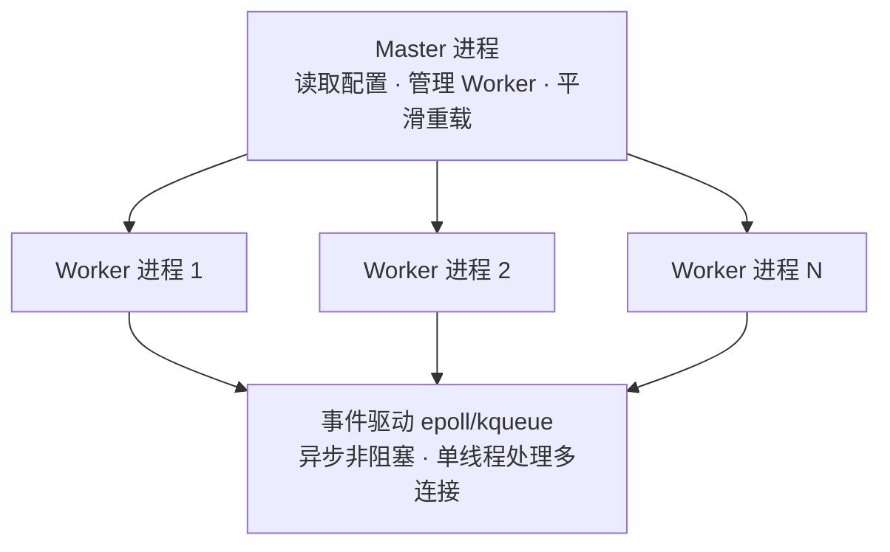

# Nginx 入门教程

> 面向后端/全栈工程师的 Nginx 快速入门 —— 掌握核心配置、反向代理、负载均衡，从容应对面试与日常开发。

---

## 🎯 学习目标

- 理解 Nginx 的架构模型与核心特性（高并发、事件驱动、Master-Worker 进程模型）
- 掌握 Nginx 配置文件结构与常用指令
- 熟练配置静态资源服务、虚拟主机、反向代理与负载均衡
- 能独立完成 HTTPS 配置、URL 重写、缓存优化等常见场景
- 面试时能清晰解释 Nginx 的工作原理、性能优势及典型应用场景

---

## 📋 前置要求

| 领域 | 要求 |
|------|------|
| Linux 基础 | 了解基本命令、文件权限、服务管理 |
| HTTP 协议 | 理解请求/响应模型、状态码、Header |
| 网络基础 | 了解 IP、端口、DNS、TCP 连接 |

---

## 🏗️ Nginx 架构图



配置文件结构：

```
┌─────────────────────────────────────────────────────────────┐
│ nginx.conf                                                  │
├─────────────────────────────────────────────────────────────┤
│ # 全局块                                                     │
│ worker_processes auto;                                      │
│                                                             │
│ # events 块                                                  │
│ events {                                                    │
│     worker_connections 10240;                               │
│ }                                                           │
│                                                             │
│ # http 块                                                    │
│ http {                                                      │
│     # server 块                                              │
│     server {                                                │
│         listen 80;                                          │
│         server_name example.com;                            │
│                                                             │
│         # location 块                                        │
│         location / {                                        │
│             proxy_pass http://backend;                      │
│         }                                                   │
│     }                                                       │
│ }                                                           │
└─────────────────────────────────────────────────────────────┘
```

---

## 🗺️ 学习路径（三天速成 + 两天进阶）

| 天数 | 内容 | 面试价值 |
|------|------|----------|
| **Day 1** | Nginx 概述 + 配置结构 + 静态资源 | 理解架构，能配置基础服务 |
| **Day 2** | Location 匹配 + 反向代理 + 负载均衡 | **面试核心**，必须掌握 |
| **Day 3** | HTTPS + URL 重写 + 实践项目 | 完成生产级配置 |
| **Day 4**（选学） | 高级优化：缓存、日志、性能调优 | 加分项 |
| **Day 5**（选学） | Docker 部署 + 常见问题排查 | 实战能力 |

建议节奏：每天 1-2 小时，3-5 天完成。

**核心文档**（Day 1-3 必学）：
- [01-nginx-overview-config-static.md](./doc/01-nginx-overview-config-static.md) — Nginx 概述 + 配置结构 + 静态资源
- [02-location-reverse-proxy-lb.md](./doc/02-location-reverse-proxy-lb.md) — Location 匹配 + 反向代理 + 负载均衡
- [03-https-url-rewrite-practice.md](./doc/03-https-url-rewrite-practice.md) — HTTPS + URL 重写 + 实践项目

**进阶文档**（Day 4-5 选学）：
- [04-advanced-optimization.md](./doc/04-advanced-optimization.md) — 缓存、日志、性能调优
- [05-docker-deploy-troubleshoot.md](./doc/05-docker-deploy-troubleshoot.md) — 容器化部署、常见错误排查

---

## 📚 核心知识点

> 本节是各篇的索引与规格声明，配置细节以正文文档为准，不在大纲中重复维护。

### 01 — Nginx 概述 + 配置结构 + 静态资源（Day 1）

📖 正文：[01-nginx-overview-config-static.md](./doc/01-nginx-overview-config-static.md)

**本篇定位**：理解架构模型，掌握配置结构，能独立搭建静态文件服务器。

**覆盖要点**：
- Master-Worker 进程模型、事件驱动为什么快
- nginx.conf 五层结构：全局块 → events → http → server → location
- 核心指令：`worker_processes` / `worker_connections` / `keepalive_timeout` / `sendfile` 三件套
- 静态资源：root vs alias、autoindex、try_files（SPA 场景）
- gzip 压缩与浏览器缓存（expires / Cache-Control / ETag）

### 02 — Location 匹配 + 反向代理 + 负载均衡（Day 2 · 面试核心）

📖 正文：[02-location-reverse-proxy-lb.md](./doc/02-location-reverse-proxy-lb.md)

**本篇定位**：面试核心篇 —— Location 优先级、反向代理、负载均衡一条龙。

**覆盖要点**：
- Location 匹配优先级：`=` 精确 > `^~`（最长前缀为 `^~` 时跳过正则）> `~` / `~*` 正则 > 普通前缀
- proxy_pass 带 `/` 与不带 `/` 的区别（高频坑点）
- 代理头信息：Host / X-Real-IP / X-Forwarded-For / X-Forwarded-Proto
- WebSocket 代理：`proxy_http_version 1.1` + Upgrade 头透传
- 4 种负载均衡策略：轮询、加权轮询、ip_hash、least_conn
- 健康检查与故障转移：`max_fails` / `fail_timeout`

### 03 — HTTPS + URL 重写 + 实践项目（Day 3）

📖 正文：[03-https-url-rewrite-practice.md](./doc/03-https-url-rewrite-practice.md)

**本篇定位**：完成生产级配置 —— HTTPS 加固、URL 重写规则、综合实战。

**覆盖要点**：
- TLS 握手流程与 ssl_* 核心指令（HTTP/2 用 `http2 on;`，nginx ≥ 1.25.1）
- Let's Encrypt 证书申请与自动续期
- HTTP → HTTPS 强制跳转：`return 301` vs `rewrite`
- HSTS 与 add_header 继承陷阱（面试加分点）
- rewrite / return 与常见重写场景（www 归一化、隐藏 .html）

### 04 — 高级优化（Day 4 · 选学）

📖 正文：[04-advanced-optimization.md](./doc/04-advanced-optimization.md)

**本篇定位**：缓存、日志、性能调优、安全加固 —— 进阶加分项。

**覆盖要点**：
- 代理缓存：proxy_cache_path / proxy_cache_valid / X-Cache-Status
- 日志：log_format、logrotate 切割、awk 实时分析
- 性能清单：进程 / 网络 / 文件缓存 / gzip
- 安全：安全头（X-XSS-Protection 已废弃，改用 CSP）、限流 limit_req、IP 黑白名单、server_tokens off

### 05 — Docker 部署与问题排查（Day 5 · 选学）

📖 正文：[05-docker-deploy-troubleshoot.md](./doc/05-docker-deploy-troubleshoot.md)

**本篇定位**：容器化部署 Nginx + 常见错误排查 —— 实战能力证明。

**覆盖要点**：
- Dockerfile 模板与 Docker Compose 编排（Nginx + Node.js）
- 容器内排查：`nginx -t` / logs / 网络连通性（nginx:alpine 无 curl，用 wget）
- 502 / 504 / 413 / 403 / 配置不生效 / 端口冲突排查路径
- 生产环境部署检查清单

---

## 🚨 常见错误排查清单

| 错误 | 原因 | 解决方案 |
|------|------|----------|
| **502 Bad Gateway** | 后端服务不可用 | 检查后端是否启动、端口是否正确 |
| **504 Gateway Timeout** | 后端响应超时 | 增大 `proxy_read_timeout` |
| **413 Request Entity Too Large** | 请求体过大 | 增大 `client_max_body_size` |
| **403 Forbidden** | 权限不足 | 检查文件权限、`user` 配置 |
| **配置不生效** | 配置错误或未重载 | `nginx -t` 检查语法、`nginx -s reload` 重载 |

> 逐项排查步骤与命令见 [03 §8-9](./doc/03-https-url-rewrite-practice.md) 与 [05 §3-4](./doc/05-docker-deploy-troubleshoot.md)。

---

## 🕹️ 实践项目：反向代理 Node.js 应用（Day 3）

完整配置与步骤见 [03 - 实战项目](./doc/03-https-url-rewrite-practice.md)。

**场景**：将一个运行在 `localhost:3000` 的 Node.js 应用通过 Nginx 对外提供服务，配置反向代理、静态资源、HTTPS。

**覆盖知识点**：
- HTTP → HTTPS 重定向与 SSL 证书配置
- 静态资源缓存优化（注意 add_header 继承陷阱）
- 反向代理头信息设置

---

## ✅ 完成标准

### Day 1-3 必须掌握
- [ ] 理解 Nginx 的 Master-Worker 进程模型与事件驱动机制
- [ ] 能独立配置静态资源服务、反向代理、负载均衡
- [ ] 能正确配置 Location 匹配规则，理解匹配优先级
- [ ] 能完成 HTTPS 配置，包括证书申请与安全加固
- [ ] 能排查 502/504/413 等常见错误

### Day 4-5 选学加分
- [ ] 能配置代理缓存和日志优化
- [ ] 能使用 Docker 部署 Nginx

### 面试能力
- [ ] 能画出 Nginx 的架构图，解释反向代理与负载均衡的原理
- [ ] 能解释 proxy_pass 带 `/` 与不带 `/` 的区别
- [ ] 能说出 4 种负载均衡策略及其适用场景

---

## 🆚 面试高频对比表

| 维度 | Nginx | Apache | Caddy |
|------|-------|--------|-------|
| **并发模型** | 事件驱动（异步非阻塞） | 进程/线程模型（同步阻塞） | 事件驱动 |
| **性能** | 高（C10K 问题解决者） | 中（高并发下性能下降） | 高 |
| **配置方式** | 集中式配置文件 | 分布式 `.htaccess` | 自动 HTTPS、简洁配置 |
| **反向代理** | 原生支持，性能优秀 | 需要 mod_proxy | 原生支持 |
| **负载均衡** | 原生支持多种策略 | 需要 mod_proxy_balancer | 原生支持 |
| **HTTPS** | 手动配置 | 手动配置 | **自动申请证书** |
| **模块化** | 编译时选择模块 | 动态加载模块 | 插件系统 |
| **适用场景** | 反向代理、负载均衡、静态资源 | 共享主机、`.htaccess` 需求 | 快速部署、自动 HTTPS |
| **代表应用** | 75%+ 的高流量网站 | 传统 LAMP 架构 | 个人项目、小型服务 |

---

## 📝 面试常见问题速查

### 基础概念
1. **Nginx 是什么？有什么优势？**
   - 高性能 HTTP/反向代理服务器，事件驱动模型，高并发低内存

2. **Nginx 的 Master-Worker 进程模型？**
   - Master 进程：管理 Worker、读取配置、平滑重启
   - Worker 进程：处理请求，多个 Worker 并发处理

3. **正向代理与反向代理的区别？**
   - 正向代理：代理客户端（VPN）
   - 反向代理：代理服务器（Nginx 代理后端应用）

### 配置实战
4. **Location 匹配优先级？**
   - `=` 精确 > `^~`（最长前缀为 `^~` 时跳过正则）> `~`/`~*` 正则 > 普通前缀

5. **proxy_pass 带 `/` 与不带 `/` 的区别？**
   - 带 `/`：绝对路径，替换匹配部分
   - 不带 `/`：相对路径，保留原始 URI

6. **负载均衡有哪些策略？**
   - 轮询、加权轮询、IP 哈希、最少连接

### 性能优化
7. **如何优化 Nginx 性能？**
   - `worker_processes auto`、增大 `worker_connections`、开启 `sendfile`、gzip 压缩、缓存

8. **502 和 504 错误的原因？**
   - 502：后端服务不可用
   - 504：后端响应超时

---

## 🔗 延伸阅读

- [Nginx 官方文档](https://nginx.org/en/docs/)
- [Nginx 中文文档](https://www.nginx.cn/doc/)
- [Nginx 配置生成器](https://www.digitalocean.com/community/tools/nginx)

---

*最后更新：2026年9月*
