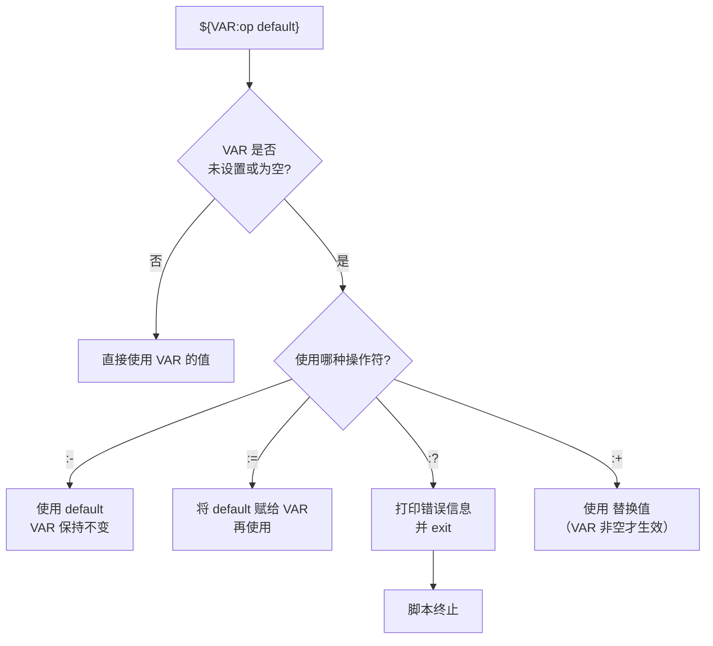

# 01 — Shell 脚本进阶

> 对应 Day 1 学习内容。目标产出：一个包含参数解析、错误处理、trap 清理的日志归档脚本。

---

## 📌 前置说明

**假设读者已掌握** [linux/doc/05-shell-scripting.md](../../linux/doc/05-shell-scripting.md) 中的全部内容：
变量定义与引用、特殊变量（`$?`/`$@`/`$#`）、`if` 条件、`for`/`while` 循环、函数定义与 `local`、数组基本操作。

本节不再重复上述基础，直接进入进阶写法。

| 项目 | 说明 |
|------|------|
| **学习产出** | 30 行以上的日志归档脚本，含 `getopts` 参数解析、`trap` 清理、多压缩策略 |
| **后续衔接** | Day 2 用 Node.js 处理复杂逻辑（JSON/API），与本日形成互补 |

---

## 1. 变量高级操作

### 1.1 参数展开（Parameter Expansion）

参数展开是 Bash 最强大的特性之一——在引用变量时直接做缺省值处理、错误检查、字符串变换。

```bash
# :- 默认值（变量为空或未设置时使用默认值，变量本身不变）
echo "${PORT:-8080}"    # 若 $PORT 未设置或为空，输出 8080

# := 赋默认值（变量为空或未设置时，同时修改变量本身）
echo "${PORT:=8080}"    # $PORT 被设为 8080，同时输出 8080

# :? 错误提示（变量为空或未设置时直接报错退出脚本）
echo "${PORT:?需要设置 PORT 环境变量}"  # 脚本在此行终止，打印错误信息

# :+ 替代值（变量已设置且非空时使用替代值，变量本身不变）
echo "${PORT:+已设置}"  # 若 $PORT 非空，输出"已设置"，否则输出空
```

这四种展开方式在脚本中的典型用法：

- `${VAR:-default}`：最常用，给变量一个安全的后备值，适合可选配置项。例如 `LOG_LEVEL="${LOG_LEVEL:-info}"`，用户未设置时默认使用 `info`。
- `${VAR:=default}`：适合需要在首次引用时自动初始化的场景，通常用在脚本开头的变量声明区。
- `${VAR:?error}`：用于必填参数校验，在函数参数检查和环境变量检查中非常常见。脚本会自动终止并打印错误信息，免去手写 `if` 判断。
- `${VAR:+alt}`：适用于条件性的日志输出或调试模式，变量非空时才打印额外信息。

> **冒号的语义**：带冒号的 `:-`/`:=`/`:?`/`:+` 同时检查"未设置"和"值为空字符串"两种情况，不带冒号的 `-`/`=`/`?`/`+` 只检查"未设置"。

决策流程如下：



### 1.2 字符串操作

```bash
str="project/src/main.ts"

echo "${#str}"               # 长度 → 19
echo "${str#*/}"             # 去最短前缀 → src/main.ts
echo "${str##*/}"            # 去最长前缀 → main.ts
echo "${str%.ts}"            # 去最短后缀 → project/src/main
echo "${str%%.*}"            # 去最长后缀 → project/src/main
echo "${str/src/dist}"       # 替换第一个 → project/dist/main.ts
echo "${str//src/dist}"      # 替换全部 → project/dist/main.ts
echo "${str/t/T}"            # 替换第一个 t → T
echo "${str//t/T}"           # 替换全部 t → projecT/src/main.Ts
```

| 语法 | 含义 | 示例（`str="a/b/c.ts"`） |
|------|------|--------------------------|
| `${#str}` | 字符串长度 | `8` |
| `${str#pattern}` | 去最短前缀 | `b/c.ts`（去掉 `a/`） |
| `${str##pattern}` | 去最长前缀 | `c.ts`（去掉 `a/b/`） |
| `${str%pattern}` | 去最短后缀 | `a/b/c`（去掉 `.ts`） |
| `${str%%pattern}` | 去最长后缀 | `a/b/c` |
| `${str/old/new}` | 替换第一个匹配 | — |
| `${str//old/new}` | 替换全部匹配 | — |

### 1.3 数组操作进阶

数组在脚本中常用于管理多个相同类型的值——服务列表、文件列表、IP 地址池等。

```bash
# 声明数组
apps=("nginx" "redis" "mysql" "postgres")

# 长度
echo "${#apps[@]}"          # 4

# 遍历（推荐：带引号保持元素完整性）
for app in "${apps[@]}"; do
  echo "服务: $app"
done

# 切片（从第 1 个元素开始取 2 个）
echo "${apps[@]:1:2}"       # redis mysql

# 追加
apps+=("mongodb")

# 将命令输出读入数组
logs=($(find /var/log -name "*.log" -type f))
```

### 1.4 关联数组（Bash 4.0+）

关联数组用字符串作为索引，适合描述键值对映射关系：

```bash
# 声明关联数组（需要 -A）
declare -A PORT_MAP

PORT_MAP["nginx"]=80
PORT_MAP["redis"]=6379
PORT_MAP["postgres"]=5432

# 遍历键
for service in "${!PORT_MAP[@]}"; do
  echo "$service → ${PORT_MAP[$service]}"
done
```

> **安全提示**：遍历普通数组时务必使用 `"${arr[@]}"`（带双引号）。不加引号时，元素中的空格会导致单词分裂。

---

## 2. 条件判断进阶

### 2.1 文件测试运算符

除了基础的 `-f`/`-d`/`-e`，以下运算符在脚本中同样高频使用：

```bash
if [ -s "$file" ]; then     # 文件存在且非空
  echo "文件非空"
fi

if [ -x "/usr/bin/curl" ]; then  # 文件可执行
  echo "curl 可用"
fi

if [ "$file1" -nt "$file2" ]; then   # file1 比 file2 新（newer than）
  echo "$file1 更新"
fi

if [ "$file1" -ot "$file2" ]; then   # file1 比 file2 旧（older than）
  echo "$file1 更旧"
fi
```

### 2.2 比较运算符总结

| 类别 | 运算符 | 含义 |
|------|--------|------|
| **字符串** | `=`, `==` | 相等（`[[ ]]` 下 `==` 支持模式匹配） |
| | `!=` | 不等 |
| | `-z` | 长度为零 |
| | `-n` | 长度非零 |
| | `<`, `>` | 字典序比较（需在 `[[ ]]` 中使用） |
| **数值** | `-eq`, `-ne` | 等于 / 不等于 |
| | `-lt`, `-le` | 小于 / 小于等于 |
| | `-gt`, `-ge` | 大于 / 大于等于 |
| **文件** | `-f`, `-d`, `-e` | 普通文件 / 目录 / 存在 |
| | `-s`, `-x`, `-w` | 非空 / 可执行 / 可写 |
| | `-nt`, `-ot` | 比...新 / 比...旧 |
| | `-L` | 符号链接 |

### 2.3 `[[ ]]` vs `[ ]`

`[[ ]]` 是 Bash 的关键字（不是命令），比 `[ ]` 更安全、功能更强：

```bash
# 1. 正则匹配（=~）
if [[ "$email" =~ ^[a-z]+@[a-z]+\.[a-z]{2,}$ ]]; then
  echo "有效邮箱"
fi

# 2. 模式匹配（== 支持 glob）
if [[ "$filename" == *.log ]]; then
  echo "日志文件"
fi

# 3. && 和 || 内部支持（无需 -a / -o）
if [[ -f "$file" && -s "$file" ]]; then
  echo "文件存在且非空"
fi

# 4. 变量为空时不会报错（无需额外加引号）
if [[ -z $var ]]; then     # 安全
  echo "空"
fi
# [ -z $var ] 如果不加引号会报错
```

| 特性 | `[ ]` | `[[ ]]` |
|------|-------|---------|
| 变量空值安全 | 需手动加引号 | 自动安全 |
| 正则匹配 `=~` | 不支持 | 支持 |
| 模式匹配 `==` | 不支持 | 支持 |
| `&&` / `||` 内部使用 | 不支持（需 `-a`/`-o`） | 支持 |
| 可移植性（sh） | 高 | 仅 Bash/Zsh |

> **建议**：新写脚本时优先使用 `[[ ]]`，除非需要兼容 `sh`。实际开发中，`[[ ]]` 的 `=~` 正则匹配能力最常用——用于验证用户输入格式（邮箱、IP 地址、日期）、判断文件名的模式是否匹配、校验参数是否为纯数字等。

### 2.4 `case` 模式匹配

```bash
case "$ENV" in
  dev|development)
    echo "开发环境"
    ;;
  staging|stg)
    echo "预发布环境"
    ;;
  prod|production)
    echo "生产环境"
    ;;
  *)  # 通配符兜底
    echo "未知环境: $ENV" >&2
    exit 1
    ;;
esac
```

`case` 的优势是比 `if-elif-else` 更清晰，尤其适合多分支匹配。`|` 分隔多个模式，`*` 匹配任意值做兜底。

---

## 3. 函数与作用域

### 3.1 `local` 变量

函数内部一定要用 `local` 声明变量，否则会污染全局命名空间：

```bash
count() {
  local i=0           # 局部变量，函数退出后销毁
  for ((i=0; i<5; i++)); do
    echo "$i"
  done
}

count
echo "$i"  # 空（local 变量已销毁）
```

### 3.2 `return` 与 `echo` 的区别

```bash
# return — 返回退出码（0-255），通过 $? 获取
is_dir_empty() {
  local dir="$1"
  local count=$(ls -A "$dir" 2>/dev/null | wc -l)
  [ "$count" -eq 0 ] && return 0 || return 1
}

is_dir_empty "/tmp/cache" && echo "目录为空"

# echo — 返回字符串输出，通过命令替换获取
get_timestamp() {
  echo "$(date +%Y%m%d_%H%M%S)"
}

now=$(get_timestamp)
echo "当前时间戳: $now"
```

| 方式 | 用途 | 获取方式 | 限制 |
|------|------|---------|------|
| `return n` | 返回状态码 | `$?` | 值域 0-255 |
| `echo` | 返回字符串 | `$()` 命令替换 | 输出内容会被捕获 |

> **关键原则**：`return` 用于表示成功/失败（0=成功，非0=失败），`echo` 用于返回数据。不要用 `echo` 输出调试信息后再用 `$()` 捕获——调试信息会被混入返回值。

### 3.3 函数库的 source 机制

将公用函数抽离到单独文件，通过 `source`（或 `.`）加载：

```bash
# lib/common.sh — 函数库
log_info()  { echo "[$(date '+%H:%M:%S')] [INFO] $*"; }
log_error() { echo "[$(date '+%H:%M:%S')] [ERROR] $*" >&2; }

# 检查命令是否存在
require_cmd() {
  if ! command -v "$1" &>/dev/null; then
    log_error "需要安装 $1"
    exit 1
  fi
}
```

```bash
#!/bin/bash
# archive.sh — 使用函数库

source "$(dirname "$0")/lib/common.sh"

require_cmd "gzip"
log_info "开始归档..."
```

> **路径技巧**：`$(dirname "$0")` 获取脚本所在目录，确保 `source` 使用相对路径也能正确加载。

---

## 4. 错误处理与清理

Shell 脚本生产中出错的最常见原因有三个：未预料到的命令失败、变量名拼写错误、管道中前段命令静默失败。本节教你三招防御性编程技巧。

### 4.1 `set -e` / `set -u` / `set -o pipefail`

这三个选项组合使用，让脚本在出错时立刻终止，而不是"带伤运行"：

```bash
#!/bin/bash
set -euo pipefail
```

| 选项 | 作用 | 说明 |
|------|------|------|
| `set -e` | 任何命令失败立即退出 | 避免后续命令在错误状态上继续执行 |
| `set -u` | 使用未定义变量时报错退出 | 防止变量名拼写错误导致静默失败 |
| `set -o pipefail` | 管道中任意命令失败都算失败 | 默认只保留最后一个命令的退出码 |

```bash
set -euo pipefail

# 以下场景若不加 pipefail 会静默成功：
grep "ERROR" /var/log/app.log | wc -l
# 如果 grep 失败（没有匹配行），wc -l 仍返回 0，整体退出码为 0
# pipefail 让这种情况也触发错误
```

### 4.2 `trap` 捕获信号

`trap` 在脚本退出、出错或收到中断信号时执行清理逻辑：

```bash
#!/bin/bash
set -euo pipefail

TMPFILE=$(mktemp)

# 脚本正常/异常退出时都删除临时文件
trap 'rm -f "$TMPFILE"' EXIT

# Ctrl+C 时额外提示
trap 'echo "收到中断信号，正在清理..."; exit 1' SIGINT

# 命令失败时打印行号
trap 'echo "[ERROR] 第 $LINENO 行出错"' ERR
```

| 信号 | 触发时机 | 使用场景 |
|------|---------|---------|
| `EXIT` | 脚本退出（无论成功/失败） | **清理临时文件** |
| `ERR` | 任何命令返回非零退出码 | 打印调试信息 |
| `SIGINT` / `INT` | Ctrl+C | 优雅终止 |
| `SIGTERM` | `kill` 命令默认信号 | 资源释放 |

### 4.3 重试机制

网络请求、服务启动等操作常需要重试：

```bash
retry() {
  local max_attempts=3 delay=2 attempt=1

  while [ "$attempt" -le "$max_attempts" ]; do
    if "$@"; then
      return 0
    fi
    if [ "$attempt" -lt "$max_attempts" ]; then
      echo "第 $attempt 次尝试失败，${delay}秒后重试..."
      sleep "$delay"
    fi
    attempt=$((attempt + 1))
  done

  echo "重试 ${max_attempts} 次后仍然失败" >&2
  return 1
}

# 使用
retry curl -sf https://api.example.com/health
```

### 4.4 实际场景：临时文件清理

```bash
#!/bin/bash
set -euo pipefail

CONFIG_TMP=$(mktemp /tmp/deploy_config.XXXXXX)
trap 'rm -f "$CONFIG_TMP"' EXIT

# 从远程拉取配置，写入临时文件
curl -sf "https://config.example.com/app.yml" > "$CONFIG_TMP"

# 校验后替换正式配置
if yq eval '.version' "$CONFIG_TMP" > /dev/null 2>&1; then
  mv "$CONFIG_TMP" "/etc/app/config.yml"
  echo "配置更新成功"
else
  echo "配置格式无效，放弃更新" >&2
  exit 1
fi

# 脚本退出时 trap 自动清理 $CONFIG_TMP（如果未被 mv）
```

---

## 5. 实战：日志归档脚本

下面是一个完整的日志归档脚本，综合运用了本节的全部知识点：

```bash
#!/bin/bash
#
# archive.sh — 日志归档脚本
# 用法: ./archive.sh -d /var/log/myapp -k 14 [-c] [-t gzip]
#
set -euo pipefail

# ===== 默认配置 =====
ARCHIVE_DIR=""
RETENTION_DAYS=7
COMPRESS="gzip"
DO_CLEANUP=false

# ===== 函数定义 =====
usage() {
  echo "用法: $0 -d <目录> -k <保留天数> [-c] [-t <压缩方式>]"
  echo "  -d  日志目录（必填）"
  echo "  -k  保留天数（默认 7）"
  echo "  -c  归档后清理源文件"
  echo "  -t  压缩方式: gzip（默认）| bzip2 | none"
  exit 1
}

log() {
  echo "[$(date '+%Y-%m-%d %H:%M:%S')] $*"
}

error() {
  echo "[$(date '+%Y-%m-%d %H:%M:%S')] [ERROR] $*" >&2
}

require_cmd() {
  if ! command -v "$1" &>/dev/null; then
    error "需要安装 $1"
    exit 1
  fi
}

# ===== 参数解析 =====
while getopts "d:k:t:ch" opt; do
  case "$opt" in
    d) ARCHIVE_DIR="$OPTARG" ;;
    k) RETENTION_DAYS="$OPTARG" ;;
    t) COMPRESS="$OPTARG" ;;
    c) DO_CLEANUP=true ;;
    h) usage ;;
    *) usage ;;
  esac
done

# ===== 参数校验 =====
if [ -z "$ARCHIVE_DIR" ]; then
  error "必须指定日志目录（-d）"
  usage
fi

if [ ! -d "$ARCHIVE_DIR" ]; then
  error "目录不存在: $ARCHIVE_DIR"
  exit 1
fi

if ! [[ "$RETENTION_DAYS" =~ ^[0-9]+$ ]]; then
  error "保留天数必须为数字"
  exit 1
fi

case "$COMPRESS" in
  gzip)  require_cmd "gzip"; EXT=".gz" ;;
  bzip2) require_cmd "bzip2"; EXT=".bz2" ;;
  none)  EXT="" ;;
  *)     error "不支持的压缩方式: $COMPRESS（可选: gzip, bzip2, none）"; exit 1 ;;
esac

# ===== trap 清理 =====
TMP_DIR=$(mktemp -d /tmp/archive_XXXXXX)
trap 'rm -rf "$TMP_DIR"; log "清理临时目录"' EXIT

# ===== 执行归档 =====
BACKUP_DIR="${ARCHIVE_DIR}/archive"
mkdir -p "$BACKUP_DIR"

log "开始归档: $ARCHIVE_DIR（保留 ${RETENTION_DAYS} 天，压缩: ${COMPRESS}）"

find "$ARCHIVE_DIR" -maxdepth 1 -name "*.log" -type f -mtime "+${RETENTION_DAYS}" | while read -r logfile; do
  base_name=$(basename "$logfile")
  timestamp=$(date +%Y%m%d_%H%M%S)
  archived_name="${base_name%.log}_${timestamp}${EXT}"

  log "处理: $logfile"

  # 复制到临时目录进行压缩（避免直接修改源文件）
  cp "$logfile" "${TMP_DIR}/${base_name}"

  case "$COMPRESS" in
    gzip)
      gzip -c "${TMP_DIR}/${base_name}" > "${TMP_DIR}/${archived_name}"
      rm -f "${TMP_DIR}/${base_name}"
      ;;
    bzip2)
      bzip2 -c "${TMP_DIR}/${base_name}" > "${TMP_DIR}/${archived_name}"
      rm -f "${TMP_DIR}/${base_name}"
      ;;
    none)
      mv "${TMP_DIR}/${base_name}" "${TMP_DIR}/${archived_name}"
      ;;
  esac

  # 移到归档目录
  mv "${TMP_DIR}/${archived_name}" "${BACKUP_DIR}/"

  # 根据 -c 参数决定是否清理源文件
  if [ "$DO_CLEANUP" = true ]; then
    rm -f "$logfile"
    log "已清理源文件: $logfile"
  else
    # 不清理时清空文件内容（保留文件本身，避免正在写的进程报错）
    : > "$logfile"
    log "已清空: $logfile"
  fi
done

log "归档完成，文件保存在: ${BACKUP_DIR}"
```

### 脚本设计要点

| 设计 | 说明 |
|------|------|
| `set -euo pipefail` | 三重防护：出错即停、未定义变量报错、管道错误传递 |
| `getopts` 参数解析 | 支持 `-d`/`-k`/`-t`/`-c`/`-h`，含参数校验 |
| `[[ =~ ]]` 正则校验 | 判断 `$RETENTION_DAYS` 是否为纯数字 |
| `case` 多分支 | 处理不同压缩方式的命令和扩展名 |
| `trap ... EXIT` | 确保临时目录在任何情况下都被清理 |
| 清空 vs 删除 | `-c` 时删除源文件；否则用 `: > file` 清空，不影响正在写入的进程 |

---

## 6. 选型说明

### Shell 脚本适合什么

- **文件批量操作**：`for` + `find` + `mv`/`gzip`，一行管道搞定。日志归档是本日的最佳实践。
- **系统管理**：服务启停、SSH 部署、进程检查——这些本身就是 Shell 命令。
- **管道文本处理**：`grep`/`awk`/`sed` 链式处理，性能极佳。

### Shell 脚本不适合什么

- **复杂业务逻辑**：多层嵌套条件、数据结构变换——代码可读性急剧下降。
- **JSON/YAML 处理**：虽然能用 `jq`，但可读性和维护性远不如 Node.js 的 `JSON.parse`。
- **HTTP API 调用**：`curl` 可以调 API，但处理响应、错误重试、并发请求都远不如 Node.js 的 `fetch`/`Promise.all`。

### 如何做决策

面对一个脚本任务，先问自己三个问题：

1. **核心操作是不是文件/进程/系统调用？** 是 → 优先 Shell。批量移动文件、启停服务、SSH 登录执行命令，没有比 Shell 更直接的工具。
2. **需不需要处理结构化数据？** JSON、YAML、CSV → 用 Node.js。Shell 虽然能用 `jq`，但一旦涉及条件判断和循环，代码很快就变成"可读不可维护"。
3. **是不是混合场景？** 比如先 SSH 拉取数据，再解析 JSON，再发 HTTP 通知。这种场景最适合 **zx**（Day 3 的内容），既能享受 Shell 管道的便捷，又能用 JS 处理复杂逻辑。

### 接下来的方向

**Day 2** 将用 Node.js 接手 Shell 力不从心的场景——JSON 处理、API 调用、定时任务。两者配合（Shell 做系统管理 + Node.js 做逻辑处理）覆盖 95% 的日常脚本需求。

> **核心观点**：Shell 是"胶水"——它擅长把命令粘在一起，但不适合写应用逻辑。遇到复杂场景，果断换 Node.js 或 zx。

---

## 🔗 下一章

[02-nodejs-scripting.md](02-nodejs-scripting.md) — 用 Node.js 接手 Shell 力不从心的场景：JSON 处理、API 调用、定时任务、CLI 工具。
