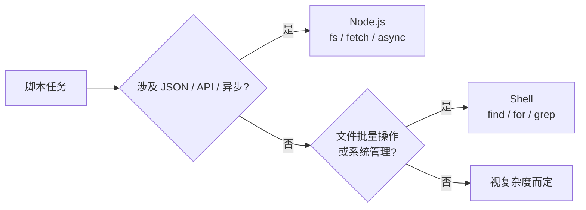
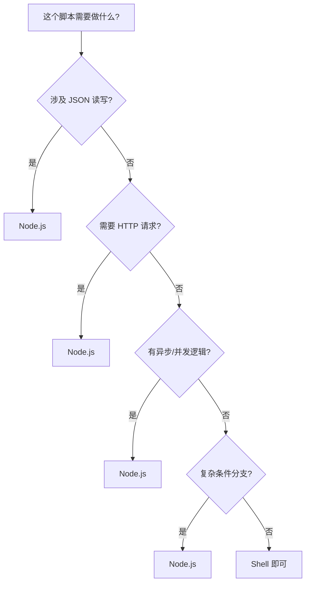

# 02 — Node.js 脚本实战

> 对应 Day 2 学习内容。目标：能用 Node.js 读写 JSON、发起 HTTP 请求、搭建 CLI 工具。

---

## 📌 前置知识

| 项目 | 说明 |
|------|------|
| **目标读者** | 已掌握 JavaScript/Node.js 基础的开发者 |
| **需要掌握** | `fs`、`path`、`fetch` 基本用法，async/await |
| **学习产出** | JSON 配置处理脚本、健康检查脚本、CLI 工具 |

---

## 1. Node.js 作为脚本引擎的优势

### 1.1 为什么选 Node.js

对于 JS 技术栈的开发者，Node.js 是脚本场景下天然的选择：

- **零构建**：直接 `node script.mjs` 运行，不需要 tsconfig、webpack、Babel
- **天然 JSON 支持**：读取/写入 `package.json`、`.json` 配置文件无需额外库
- **标准库强大**：`fs/promises`、`path`、`fetch` 均为原生模块，无需安装任何依赖
- **异步友好**：`async/await` 处理文件读写、HTTP 请求、并发任务比 Shell 优雅得多
- **npm 生态**：遇到 YAML/CSV/彩色输出/loading 动画等需求，一行 `npm install` 即可

大家日常可能习惯用 Shell 脚本处理自动化的任务，但一旦任务涉及数据格式转换（JSON ↔ YAML）、网络请求（调用 API）、或者条件分支逻辑比较复杂时，Shell 脚本的可维护性会急剧下降。Node.js 的优势恰恰体现在这些"稍微复杂一点"的场景中——它有成熟的模块系统、清晰的异常处理机制，以及团队最熟悉的 JavaScript 语法。

### 1.2 选型对比



| 场景 | Node.js | Shell | Python |
|------|---------|-------|--------|
| JSON/YAML 处理 | ★★★★★ `JSON.parse` 原生支持 | ★☆☆☆☆ 无原生能力，依赖 `jq` | ★★★★☆ `json` 标准库 |
| HTTP API 调用 | ★★★★★ `fetch` 原生，async 并发 | ★☆☆☆☆ `curl` 单次调用，组合复杂 | ★★★★☆ `requests` 需要安装 |
| 文件批量操作 | ★★★☆☆ 可做，但代码啰嗦 | ★★★★★ `for`/`find` 一行搞定 | ★★★☆☆ 可做，代码量居中 |
| 异步/并发任务 | ★★★★★ async/await/Promise.all | ★★☆☆☆ 后台进程 `&`，管理麻烦 | ★★★★☆ asyncio/threading |
| 系统管理 | ★★☆☆☆ 需要 `execa`/`child_process` | ★★★★★ `systemctl`/`ssh` 直接执行 | ★★★☆☆ `subprocess` 类似 Node.js |
| 启动速度 | ★★★☆☆ Node.js 启动约 50-100ms | ★★★★★ 毫秒级 | ★★☆☆☆ Python 启动约 100-200ms |
| 团队门槛（JS 团队） | ★★★★★ 零学习成本 | ★★★☆☆ 需要学习 Shell 语法 | ★★☆☆☆ 需另一门语言 |

> **核心原则**：需要 JSON/API/异步/复杂逻辑时选 Node.js；Shell 能搞定的事不要用 Node.js 过度设计。

---

## 2. 文件读写与 JSON 处理

Node.js 脚本最典型的应用场景就是读写配置文件。现代 Web 项目的配置越来越复杂，从 `package.json` 到各种 `*.config.js`、`*.json`、`*.yaml` 文件，脚本常常需要做"读取 → 修改 → 写回"这个循环。Node.js 的标准库提供了完整的文件操作 API，配合 JSON 原生的序列化/反序列化能力，处理这些任务信手拈来。

### 2.1 核心 API

```js
import { readFile, writeFile } from 'node:fs/promises';

// 读取 JSON 文件
const raw = await readFile('./data.json', 'utf8');   // → string
const data = JSON.parse(raw);                         // → object

// 写入 JSON 文件（格式化输出）
await writeFile('./data.json', JSON.stringify(data, null, 2));
```

关键要点：

- `readFile` 的第二个参数传 `'utf8'`，否则返回 Buffer
- `JSON.stringify(obj, null, 2)` 的第三个参数 `2` 表示缩进 2 个空格，生成人类可读的 JSON
- `writeFile` 默认覆盖写入；追加内容用 `appendFile`
- 路径处理推荐使用 `path.join()` 或 `new URL('./file', import.meta.url)`，避免硬编码绝对路径

### 2.2 实战：修改 package.json 的 version 字段

在日常开发中，我们经常需要自动升级版本号——CI 流程里打完 tag 后自动递增补丁号，或者发布前统一修改版本。用 Node.js 脚本来做这件事，比手动编辑或用 sed 去正则匹配要可靠得多。直接解析 JSON 对象，修改字段，再序列化写回，不会破坏原有的格式。相比用 sed 正则匹配，这种方式能保证输出的 JSON 始终合法。

```js
#!/usr/bin/env node
// bump-version.mjs — 自动升级版本号

import { readFile, writeFile } from 'node:fs/promises';

const pkgPath = new URL('./package.json', import.meta.url);
const pkg = JSON.parse(await readFile(pkgPath, 'utf8'));

// 将 version 按 semver 递增补丁号
const parts = pkg.version.split('.').map(Number);
parts[2] += 1;
pkg.version = parts.join('.');

await writeFile(pkgPath, JSON.stringify(pkg, null, 2) + '\n');
console.log(`版本已更新为: ${pkg.version}`);
```

### 2.3 实战：合并多个 JSON 配置文件

微服务架构下，我们经常把配置按模块拆成多个 JSON 文件（比如 `config/database.json`、`config/redis.json`、`config/app.json`），部署时需要合并成一个对象传给应用。手动复制粘贴既不优雅也容易出错。下面的脚本自动扫描 `config/` 目录下的所有 JSON 文件，以文件名作为 key 合并成一个大的配置对象，非常适合 CI 构建前生成最终配置文件。

```js
#!/usr/bin/env node
// merge-config.mjs — 合并 config/*.json 到一个对象

import { readFile, writeFile } from 'node:fs/promises';
import { readdir } from 'node:fs/promises';
import { join, dirname } from 'node:path';
import { fileURLToPath } from 'node:url';

const __dirname = dirname(fileURLToPath(import.meta.url));
const configDir = join(__dirname, 'config');
const files = (await readdir(configDir)).filter(f => f.endsWith('.json'));

const merged = {};
for (const file of files) {
  const key = file.replace('.json', '');
  const content = await readFile(join(configDir, file), 'utf8');
  merged[key] = JSON.parse(content);
}

await writeFile(
  join(__dirname, 'merged-config.json'),
  JSON.stringify(merged, null, 2)
);
console.log(`已合并 ${files.length} 个配置文件`);
```

---

## 3. CLI 参数与结构

### 3.1 简单解析：process.argv

先看最基础的方案。`process.argv` 是 Node.js 提供的原始参数数组，第一个元素是 Node.js 自身的路径，第二个是脚本路径，从第三个开始才是用户传入的参数。下面的代码演示了如何手工解析 `--key value` 风格的参数：

```js
// cli-simple.mjs
// 用法: node cli-simple.mjs deploy --env staging

const [nodePath, scriptPath, ...args] = process.argv;

if (args.length === 0) {
  console.error('用法: node cli-simple.mjs <command> [options]');
  process.exit(1);
}

const command = args[0]; // "deploy"
const options = {};
for (let i = 1; i < args.length; i += 2) {
  const key = args[i].replace('--', '');
  options[key] = args[i + 1];
}

console.log(`命令: ${command}`);
console.log(`选项:`, options);
```

适合参数简单的脚本。参数变多后推荐使用 `commander`——它能帮我们处理 `--help` 输出、参数校验、子命令注册等重复工作。

### 3.2 专业 CLI：commander

`commander` 是 Node.js 生态中最流行的 CLI 框架。它的核心思路是：声明式地定义你的 CLI 有哪些命令、哪些选项，框架自动帮你解析、校验、生成帮助文档。下面是一个完整示例：

```js
#!/usr/bin/env node
// cli.mjs — 专业的 CLI 工具

import { Command } from 'commander';

const program = new Command();

program
  .name('mycli')
  .version('1.0.0')
  .description('我的 CLI 工具箱')
  .option('--env <env>', '部署环境', 'staging')
  .option('--tag <tag>', '发布标签');

program
  .command('deploy')
  .description('部署应用到指定环境')
  .action(() => {
    const options = program.opts();
    console.log(`部署到 ${options.env} 环境`);
    if (options.tag) console.log(`标签: ${options.tag}`);
  });

program
  .command('status')
  .description('查看部署状态')
  .action(() => {
    console.log('正在检查部署状态...');
  });

program.parse();
```

```bash
# 使用示例
node cli.mjs deploy --env production --tag v2.0.0
node cli.mjs status --help
```

`commander` 的核心能力：

| 方法 | 作用 |
|------|------|
| `.version()` | 设置 `--version` 输出 |
| `.option()` | 定义 `--flag` 选项，支持默认值 |
| `.command()` | 定义子命令（`deploy`、`status` 等） |
| `.action()` | 子命令的回调函数 |
| `.parse()` | 解析 `process.argv`（必须在最后调用） |

### 3.3 完整示例：部署 CLI

结合上面学到的知识，下面是一个功能比较完整的部署 CLI。它使用 `commander` 定义子命令 `deploy`，支持三种参数：`--env`（必选，指定环境）、`--tag`（可选，指定 Git 标签）、`--no-build`（可选，跳过构建）。`.requiredOption()` 方法确保用户必须传入 `--env`，否则自动报错并显示帮助信息。

```js
#!/usr/bin/env node
// deploy-cli.mjs
// 用法: node deploy-cli.mjs deploy --env staging --tag v1.0

import { Command } from 'commander';

const program = new Command();

program
  .name('deploy')
  .version('1.0.0')
  .description('一键部署工具');

program
  .command('deploy')
  .description('部署服务')
  .requiredOption('--env <env>', '部署环境（staging/production）')
  .option('--tag <tag>', 'Git tag 或版本号')
  .option('--no-build', '跳过构建步骤')
  .action(async (options) => {
    console.log(`🔄 开始部署到 ${options.env}...`);
    if (options.tag) console.log(`📌 标签: ${options.tag}`);

    if (options.build) {
      console.log('🔨 构建中...');
      // await $`npm run build`;
    }

    console.log('🚀 部署中...');
    // await $`rsync -avz dist/ deploy@host:/app/`;

    console.log('✅ 部署完成');
  });

program.parse();
```

---

## 4. HTTP 请求与定时任务

除了读写文件，Node.js 脚本另一个核心场景是"定时访问外部服务并做处理"——比如健康检查、数据同步、定时报告。相比 Shell 脚本里用 `curl` + `grep` 来解析响应，Node.js 的 `fetch` 配合 `async/await` 让 HTTP 请求的编写和错误处理都清晰得多。再加上 `node-cron` 提供灵活的定时调度能力，完全可以替代传统的 crontab + Shell 组合。

### 4.1 使用原生 fetch

Node.js 18+ 内置 `fetch`，无需安装任何库：

```js
// GET 请求
const res = await fetch('https://api.example.com/health');
if (!res.ok) throw new Error(`HTTP ${res.status}`);
const data = await res.json();
console.log(data);

// POST 请求
const res2 = await fetch('https://api.example.com/webhook', {
  method: 'POST',
  headers: { 'Content-Type': 'application/json' },
  body: JSON.stringify({ event: 'deploy', status: 'success' }),
});

// 错误处理
async function safeFetch(url) {
  try {
    const res = await fetch(url);
    if (!res.ok) throw new Error(`状态码: ${res.status}`);
    return await res.json();
  } catch (err) {
    console.error(`请求失败: ${err.message}`);
    return null;
  }
}
```

### 4.2 实战：健康检查脚本

下面这个脚本会依次检查三个服务的健康状态，记录每个服务的响应时间和 HTTP 状态码，把结果输出到终端同时也写入日志文件。如果出现异常服务，脚本以非零退出码结束，方便 CI/CD 流水线检测到失败。

这个脚本展示了几个好习惯：用数组统一管理服务列表而不是逐个硬编码；用 `try/catch` 区分"请求成功但返回异常"和"网络错误完全不可达"两种情况；用 `appendFile` 增量写入日志而不覆盖历史记录。

```js
#!/usr/bin/env node
// health-check.mjs — 检查服务状态并记录结果

import { appendFile } from 'node:fs/promises';

const SERVICES = [
  { name: 'API 服务', url: 'https://api.example.com/health' },
  { name: '前端',    url: 'https://app.example.com/health' },
  { name: '管理后台', url: 'https://admin.example.com/health' },
];

const results = [];

for (const svc of SERVICES) {
  try {
    const start = Date.now();
    const res = await fetch(svc.url);
    const latency = Date.now() - start;
    results.push({
      name: svc.name,
      status: res.ok ? 'UP' : 'DOWN',
      httpStatus: res.status,
      latency: `${latency}ms`,
      time: new Date().toISOString(),
    });
  } catch (err) {
    results.push({
      name: svc.name,
      status: 'DOWN',
      httpStatus: 0,
      latency: 'N/A',
      time: new Date().toISOString(),
      error: err.message,
    });
  }
}

// 输出结果
for (const r of results) {
  const icon = r.status === 'UP' ? '✅' : '❌';
  console.log(`${icon} ${r.name}: ${r.status} (${r.latency})`);
}

// 记录到日志文件
const logLine = results.map(r => `${r.time}|${r.name}|${r.status}|${r.latency}`).join('\n');
await appendFile('./health.log', logLine + '\n');

// 如果有服务异常
const down = results.filter(r => r.status === 'DOWN');
if (down.length > 0) {
  console.error(`\n⚠️ ${down.length} 个服务异常，请检查！`);
  process.exit(1);
}
```

### 4.3 定时任务：node-cron

`node-cron` 是 Node.js 中最常用的定时任务库。它的核心是 `CronJob` 类：传入一个 cron 表达式和一个异步回调函数，然后调用 `.start()` 启动调度。cron 表达式由 5 或 6 个字段组成，分别表示秒（可选）、分钟、小时、日期、月份、星期。

```bash
npm install cron
```

```js
import { CronJob } from 'cron';

// 每 5 分钟执行一次
const job = new CronJob('*/5 * * * *', async () => {
  const res = await fetch('https://api.example.com/health');
  const data = await res.json();
  const status = data.status === 'ok' ? 'UP' : 'DOWN';
  console.log(`[${new Date().toISOString()}] 服务状态: ${status}`);
});

job.start();
console.log('健康检查定时任务已启动（每 5 分钟）');
```

Cron 表达式格式：

```text
* * * * * *
┬ ┬ ┬ ┬ ┬ ┬
│ │ │ │ │ └── 星期 (0-7, 0=周日)
│ │ │ │ └──── 月份 (1-12)
│ │ │ └────── 日期 (1-31)
│ │ └──────── 小时 (0-23)
│ └────────── 分钟 (0-59)
└──────────── 秒 (可选)
```

常用表达式速查：

| 表达式 | 含义 |
|--------|------|
| `*/5 * * * *` | 每 5 分钟 |
| `0 * * * *` | 每小时整点 |
| `0 3 * * *` | 每天凌晨 3 点 |
| `0 9-18 * * 1-5` | 工作日 9:00-18:00 每小时 |
| `*/30 * * * *` | 每 30 分钟 |

### 4.4 实战：定时健康检查 + 告警

将上面两部分结合起来：每 5 分钟检查一次服务健康状态，如果发现服务异常（HTTP 状态码非 2xx 或完全不可达），通过 Webhook 发送告警通知。这种模式适用于钉钉、Slack、飞书等所有支持 Webhook 的协作平台，只需把 `WEBHOOK_URL` 替换为真实的地址即可。

代码结构很清晰：`checkHealth()` 负责执行检查并触发告警，`sendAlert()` 负责发送通知，定时调度由 `CronJob` 接管。如果你需要同时监控多个服务，可以把 `CHECK_URL` 改为一个服务列表，用 `Promise.all` 并发检查。

```js
#!/usr/bin/env node
// monitor.mjs — 定时检查服务，异常时发送通知

import { CronJob } from 'cron';

const CHECK_URL = 'https://api.example.com/health';
const WEBHOOK_URL = 'https://hooks.example.com/alert'; // 钉钉/Slack/飞书 webhook

async function checkHealth() {
  const start = Date.now();
  let ok = false;

  try {
    const res = await fetch(CHECK_URL);
    ok = res.ok;
    const latency = Date.now() - start;
    console.log(`[${new Date().toISOString()}] 健康检查: ${ok ? 'UP' : 'DOWN'} (${latency}ms)`);

    if (!ok) await sendAlert(`服务异常: HTTP ${res.status}`);
  } catch (err) {
    console.error(`[${new Date().toISOString()}] 请求失败:`, err.message);
    await sendAlert(`服务不可达: ${err.message}`);
  }
}

async function sendAlert(message) {
  await fetch(WEBHOOK_URL, {
    method: 'POST',
    headers: { 'Content-Type': 'application/json' },
    body: JSON.stringify({
      msgtype: 'text',
      text: { content: `[监控告警] ${message}` },
    }),
  });
  console.log('告警已发送');
}

// 每 5 分钟检查一次
const job = new CronJob('*/5 * * * *', checkHealth);
job.start();
console.log('监控服务已启动，每 5 分钟检查一次');
```

---

## 5. 实用 npm 包一览

Node.js 脚本的强大之处很大程度来自 npm 生态。下面这些包覆盖了脚本开发中常见的高频需求——终端美化、交互式输入、格式转换、文件匹配、命令执行。每个包都只解决一个问题，组合使用可以快速搭建出体验良好的工具。

| 包名 | 用途 | 一句话说明 |
|------|------|-----------|
| `chalk` | 彩色终端输出 | `console.log(chalk.green('成功') + chalk.red('失败'))` |
| `ora` | 加载动画 | `const spinner = ora('正在部署...').start()` |
| `inquirer` | 交互式提示 | `const { name } = await inquirer.prompt([...])` |
| `js-yaml` | YAML 读写 | `yaml.load(str)` / `yaml.dump(obj)` |
| `csv-parse` / `csv-stringify` | CSV 解析与生成 | 处理 Excel 导出、数据迁移 |
| `globby` | 文件模式匹配 | `const files = await globby(['**/*.log', '!node_modules'])` |
| `execa` | 执行 Shell 命令 | `const { stdout } = await execa('git', ['log', '--oneline'])` |

### 5.1 chalk + ora：提升 CLI 体验

终端脚本最容易犯的问题是"输出一团乱麻"。`chalk` 可以用颜色区分信息等级（绿色表示成功、红色表示错误、黄色表示警告），`ora` 则在耗时操作（如部署、构建、上传）中显示一个旋转的 loading 动画，让用户知道脚本没有卡死。两个包搭配使用效果很好：开始任务时 `ora().start()`，完成后用 `.succeed()` 或 `.fail()` 配合 `chalk` 的彩色文字收尾。

```js
import ora from 'ora';
import chalk from 'chalk';

async function deploy() {
  const spinner = ora('正在部署...').start();

  try {
    // 模拟部署步骤
    await new Promise(r => setTimeout(r, 2000));
    spinner.succeed(chalk.green('部署成功'));
  } catch (err) {
    spinner.fail(chalk.red(`部署失败: ${err.message}`));
    process.exit(1);
  }
}
```

### 5.2 inquirer：交互式 CLI

有时候脚本需要用户在运行过程中做出选择——比如确认是否真的要部署到生产环境，或者从多个环境中选择一个。`inquirer` 提供了一系列交互式提示类型：`list`（单选列表）、`confirm`（确认/取消）、`input`（文本输入）、`checkbox`（多选）。脚本可以根据用户的选择决定后续流程，这在编写团队共享工具时特别有用。

```js
import inquirer from 'inquirer';

const answers = await inquirer.prompt([
  {
    type: 'list',
    name: 'env',
    message: '选择部署环境:',
    choices: ['dev', 'staging', 'production'],
  },
  {
    type: 'confirm',
    name: 'confirm',
    message: '确认部署?',
    default: false,
  },
]);

if (answers.confirm) {
  console.log(`开始部署到 ${answers.env}...`);
}
```

### 5.3 execa：替代 child_process

Node.js 内置的 `child_process` API 设计老旧，使用起来颇为繁琐——`exec` 有 shell 注入风险，`spawn` 需要手动处理流，跨平台兼容性也有坑。`execa` 是对它的现代化封装：自动处理引号转义、支持 pipe 链式调用、返回 Promise 且包含 `stdout`/`stderr` 属性。如果你需要在 Node.js 脚本中执行 Shell 命令，优先用 `execa` 而不是原生 API。

```js
import { execa } from 'execa';

// 比 child_process.exec 更安全（避免 shell 注入）
const { stdout, stderr } = await execa('git', ['log', '--oneline', '-5']);
console.log('最近 5 次提交:\n', stdout);

// 管道支持 — execa v6+ 使用 pipe 函数
const { stdout: fileCount } = await execa('find', ['.', '-name', '*.js'])
  .pipe('wc', ['-l']);
console.log(`JS 文件行数: ${fileCount}`);
```

### 5.4 js-yaml + csv：格式转换

在实际项目中，配置文件的格式并不总是 JSON。Kubernetes 和 Docker Compose 用 YAML，数据迁移和报表导出用 CSV。`js-yaml` 提供 `yaml.load()` 和 `yaml.dump()` 两个核心方法，在 JSON 和 YAML 之间无缝转换。`csv-parse` 和 `csv-stringify` 则处理 CSV 的解析与生成，支持自定义分隔符、转义字符和列映射。

下面的示例展示了三个最常见的跨格式转换操作：YAML 转 JSON（比如读取 Kubernetes 配置再传给 Node.js 应用）、CSV 转 JSON（数据迁移）、JSON 转 CSV（生成报表）。

```js
import yaml from 'js-yaml';
import { parse } from 'csv-parse/sync';
import { stringify } from 'csv-stringify/sync';

// YAML → JSON
const config = yaml.load(await readFile('./config.yaml', 'utf8'));
await writeFile('./config.json', JSON.stringify(config, null, 2));

// CSV → JSON
const records = parse(await readFile('./data.csv', 'utf8'), {
  columns: true,  // 第一行作为字段名
  skip_empty_lines: true,
});
console.log(records); // [{ col1: 'val1', col2: 'val2' }, ...]

// JSON → CSV
const csv = stringify(records, { header: true });
await writeFile('./output.csv', csv);
```

---

## 6. 选型说明

学完上面的内容，你可能会想"那我以后所有脚本都用 Node.js 写算了"。实际上这是一个常见的误区。Node.js 不是 Shell 的替代品，而是互补者。选对工具的关键是识别任务的"特征"：是否涉及 JSON/API/异步/复杂逻辑？是 → Node.js；是否涉及文件批量操作/管道过滤/系统管理？是 → Shell。

下面用流程图和速查表帮你快速决策。

### 什么时候用 Node.js



### 决策速查表

| 场景 | 推荐 | 理由 |
|------|------|------|
| 读取/合并/修改 JSON/YAML 配置文件 | Node.js | `JSON.parse` / `js-yaml`，一行代码搞定 |
| 调用 REST API、Webhook、健康检查 | Node.js | `fetch` + async/await 比 `curl` + 返回值解析方便得多 |
| 定时任务（备份、监控、报告） | Node.js | `node-cron` 比 crontab + Shell 脚本更可控，可以写条件逻辑 |
| 多子命令的 CLI 工具 | Node.js | `commander` 提供的 `--help`、参数校验、子命令是 Shell 难以替代的 |
| 批量重命名/移动/删除文件 | Shell | `for f in *.log; do ...` 一行顶十行 |
| 管道过滤 + 文本统计 | Shell | `grep` | `awk` | `sort` | `uniq -c` 效率极高 |
| 服务启停、进程管理 | Shell | `systemctl` / `pm2` / `kill` 本身就是 Shell 命令 |
| 既要用 Shell 命令又要 JS 逻辑 | `zx` | 在 JS 中直接 ``` $`command` ```，无需转义 |

### 反模式举例

下面用两个具体的反模式来说明"选错工具"的后果。第一个是 Shell 强行解析 JSON——用 `grep` 和 `cut` 提取字段，一旦 JSON 格式稍微变化（比如多了空格、键的顺序变了），脚本就无声地返回错误结果。第二个是 Node.js 做简单文件遍历——明明 `ls` 一行就能完成的事，却写了一个完整的异步文件遍历函数。

这两个例子揭示了同一个原则：**选工具不是技术能力的体现，而是工程判断的体现。**

```bash
# ❌ 反模式：用 Shell 解析 JSON
version=$(grep '"version"' package.json | cut -d'"' -f4)
# 如果 JSON 格式变了（例如多了空格、双引号不在一行），脚本就坏了

# ✅ 正确做法：用 Node.js 处理 JSON
node -e "const p=require('./package.json'); console.log(p.version)"
```

```js
// ❌ 反模式：用 Node.js 做简单文件遍历
import { readdir } from 'fs/promises';
const files = await readdir('.');
for (const f of files) {
  if (f.endsWith('.log')) console.log(f);
}

// ✅ 正确做法：Shell 一行搞定
// ls *.log
```

> **核心原则**：JSON/API/异步/复杂逻辑 → Node.js；文件操作/管道/系统管理 → Shell。不要为了"统一技术栈"而用 Node.js 去做 `for` 循环遍历文件——那不是代码质量的问题，是工具选型的问题。

---

## 📝 小结

| 知识点 | 核心要点 |
|--------|---------|
| **零构建运行** | `node script.mjs`，无需任何配置 |
| **JSON 处理** | `JSON.parse` 读，`JSON.stringify(obj, null, 2)` 写 |
| **CLI 框架** | 简单场景 `process.argv`，复杂场景 `commander` |
| **HTTP 请求** | 原生 `fetch`，注意 `res.ok` 错误检查 |
| **定时任务** | `node-cron`，`*/5 * * * *` 表示每 5 分钟 |
| **实用生态** | `chalk` / `ora` 提升体验，`execa` 替代 `child_process` |
| **选型原则** | JSON/API/异步 → Node.js；文件/管道/系统 → Shell |

---

## 🔗 下一章

[03-zx-shell-node-mix.md](03-zx-shell-node-mix.md) — 用 zx 在同一个脚本中混用 Shell 命令和 JS 逻辑，免去引号转义和 execSync 的痛苦。
