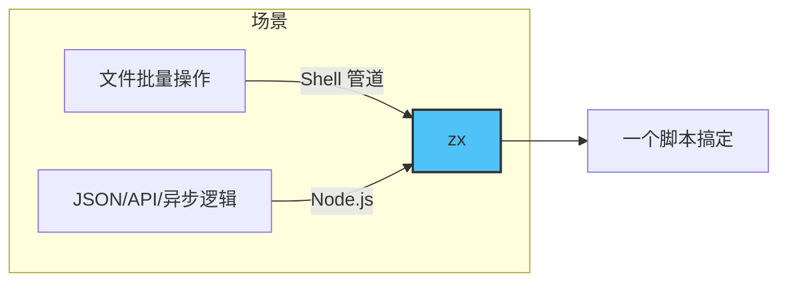
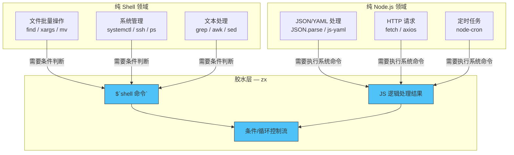
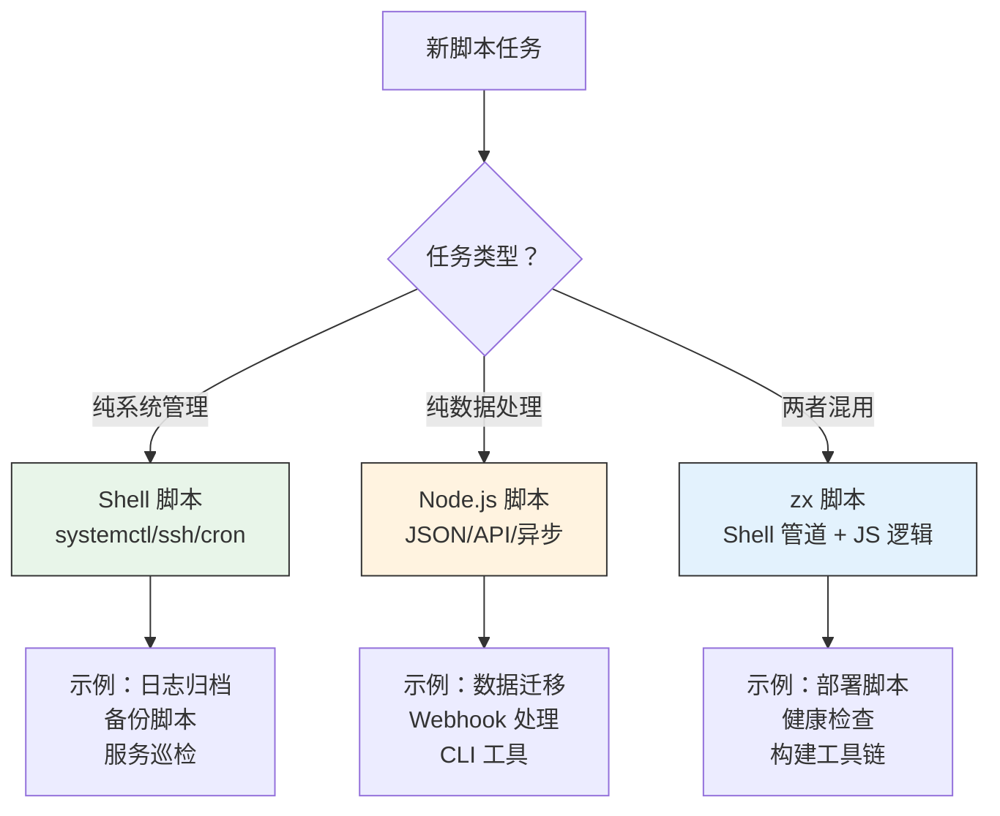

# 03 — zx：Shell × Node.js 最佳结合

> **Day 3** — 学习时间约 3-4 小时
>
> 目标产出：能用 zx 在一个脚本中混用 Shell 命令和 JS 逻辑

---

## 1. 为什么要用 zx

### Shell 写复杂逻辑的痛点

Shell 是一门"胶水语言"，它的强项是把一个个命令用管道串起来。但一旦遇到复杂逻辑，Shell 的短板就暴露无遗：

- **条件嵌套**：`if` 里的 `[]` 括号、空格、逻辑运算符，写两层以上就难以维护
- **JSON 处理**：Shell 没有原生 JSON 能力，依赖 `jq`——又多了一个工具依赖
- **引号转义地狱**：在 Shell 字符串里嵌套变量、特殊字符、SSH 命令，转义规则让人头皮发麻

```bash
# 在 SSH 远程执行中嵌入变量——引号灾难
ssh user@host "cd /app && echo \"Branch: ${BRANCH}\" && \
  if [ \"$(git status --porcelain)\" != \"\" ]; then \
    echo '有未提交的修改' >&2; \
  fi"
```

### Node.js 执行 Shell 的痛点

Node.js 用 `child_process` 模块执行 Shell 命令同样不省心：

- **引号转义**：`execSync('ssh user@host "echo \\"$HOME\\""')`——双引号加反斜杠，可读性为零
- **`stdout` 解析**：`execSync` 返回的是 `Buffer`，得手动 `.toString().trim()`
- **Pipe 组合困难**：用 Node.js 组合 `grep | awk | sort` 需要手动创建子进程管道链，代码量翻倍

```js
const { execSync } = require('child_process');

// 引号转义——反斜杠地狱
const result = execSync(
  `ssh user@host "df -h | grep '/data' | awk '{print $$5}'"`
).toString().trim();
```

### zx 的解决思路

zx（Google 开源）的核心思想极其简单：**在 JavaScript 中直接用 `` ` `` 模板字符串执行 Shell 命令**，模板字符串天然支持变量插值，无需任何转义。

```js
// zx —— 无需转义，变量直接嵌入
let result = await $`ssh user@host "df -h | grep '/data' | awk '{print $5}'"`;
```

zx 不是一门新语言，而是一个 **Node.js 脚本运行器**，它提供了：

- `` await $`command` `` —— 在 JS 中写 Shell，花括号语法自然嵌入变量
- 内置 `cd()`、`question()`、`fetch()`、`sleep()` 等常用 API
- 自动捕获 stdout/stderr/exitCode，直接作为 JS 对象用

这种能力让它成为 Shell 和 Node.js 之间的"胶水层"：



更准确地说，zx 在整个技术栈中的定位是这样的：



---

## 2. 安装与基础用法

### 安装

全局安装即可：

```bash
npm install -g zx
```

验证安装：

```bash
zx --version
# 输出类似：8.x.x
```

### Shebang

创建 `.mjs` 脚本文件，首行加上 zx 的 shebang：

```js
#!/usr/bin/env zx

// 脚本内容...
```

然后**用 `zx` 执行**，或者加上执行权限后直接运行：

```bash
zx script.mjs
# 或者
chmod +x script.mjs && ./script.mjs
```

> ⚠️ `#!/usr/bin/env zx` shebang 要求依赖系统 `$PATH` 能找到 zx。如果使用 `npx zx` 或未全局安装，直接用 `zx script.mjs` 即可。

### `$` 命令 —— 核心中的核心

zx 最核心的 API 就是全局函数 `$`，它接受一个模板字符串，将其作为 Shell 命令执行：

```js
#!/usr/bin/env zx

// 执行一个 Shell 命令
await $`echo "Hello from zx"`;
```

**模板字符串天然支持变量插值**——这是 zx 最大的优势：

```js
let project = "my-app";
let version = "1.0.0";

// Shell 命令中的变量直接写 JS 变量，无需转义
await $`docker build -t ${project}:${version} .`;
```

对比原生 Node.js 的写法：

```js
// Node.js child_process —— 需要拼接字符串
execSync(`docker build -t ${project}:${version} .`);

// 如果命令中有空格、特殊字符，还得用 JSON.stringify 或数组传参
execFileSync('docker', ['build', '-t', `${project}:${version}`, '.']);
```

### 输出处理

`` await $`command` `` 返回一个 `ProcessOutput` 对象，包含：

```js
let result = await $`echo "Hello"`;
// 或
let { stdout, stderr, exitCode } = await $`echo "Hello"`;

console.log(stdout);    // "Hello\n" —— 标准输出（字符串）
console.log(stderr);    // "" —— 标准错误（字符串）
console.log(exitCode);  // 0 —— 退出码
```

**常见模式：获取命令输出并清理**：

```js
let branch = (await $`git branch --show-current`).stdout.trim();
let files  = (await $`ls`).stdout.trim().split('\n');
```

**当你在模板字符串中嵌入一个 `ProcessOutput` 时，zx 会自动取其 stdout 字符串**：

```js
let files = await $`ls`;
await $`echo ${files}`;  // 等价于 echo "ls 的输出"
```

### 内置 API

zx 提供了多个开箱即用的全局函数和模块：

| API | 作用 | 示例 |
| --- | ------ | ------ |
| `$` | 执行 Shell 命令 | `await $\`npm test\`` |
| `cd(path)` | 切换工作目录（仅限于 zx 脚本内部） | `cd('/app')` |
| `question(prompt)` | 交互式输入 | `let name = await question('Name: ')` |
| `sleep(ms)` | 等待指定毫秒数 | `await sleep(3000)` |
| `retry(count, callback)` | 自动重试 | `await retry(3, () => $\`curl ...\``) |
| `fs` | `fs-extra` 模块（增强版 fs） | `await fs.readJSON('pkg.json')` |
| `path` / `os` / `chalk` | Node.js 内置模块 + chalk | `path.join(...)` |
| `argv` | CLI 参数对象 | `argv.env` 对应 `--env` |

**`argv` 使用示例**：

```js
#!/usr/bin/env zx

// 执行：./deploy.mjs --env staging --branch main
console.log(argv.env);     // "staging"
console.log(argv.branch);  // "main"
console.log(argv._);       // 位置参数数组
```

**`question()` 交互输入**：

```js
let confirm = await question('确认部署到生产环境？(y/n) ');
if (confirm.toLowerCase() !== 'y') {
  console.log('已取消');
  process.exit(0);
}
```

**`retry()` 重试机制**：

```js
await retry(3, async () => {
  let res = await fetch('https://api.example.com/health');
  if (!res.ok) throw new Error('服务未就绪');
});
```

---

## 3. 核心模式：Shell 管道 + JS 逻辑

zx 的核心价值在于**用 Shell 管道处理数据采集，用 JS 逻辑做数据处理**。这两种能力互补，几乎没有重叠。

### 模式一：Shell 采集 → JS 处理

```js
#!/usr/bin/env zx

// Shell 采集：获取磁盘信息
let df = (await $`df -h / | tail -1`).stdout.trim();
// df 输出示例："/dev/sda1   100G   45G   55G  45% /"

// JS 处理：解析成结构化数据
let [filesystem, size, used, avail, usePercent, mounted] = df.split(/\s+/);
console.log(`磁盘使用率: ${usePercent}`);

if (parseInt(usePercent) > 80) {
  console.error('⚠️  磁盘使用率超过 80%，需要清理');
}
```

### 模式二：JS 条件 → Shell 执行

```js
#!/usr/bin/env zx

let branch = (await $`git branch --show-current`).stdout.trim();
let hasLockFile = (await $`ls package-lock.json 2>/dev/null`).exitCode === 0;

if (branch === 'main' && hasLockFile) {
  await $`npm ci`;
  await $`npm test`;
} else {
  console.log(`当前分支: ${branch}，跳过 ci`);
}
```

### 模式三：Shell 循环 → JS 处理结果

```js
#!/usr/bin/env zx

// 找出所有超过 100MB 的文件
let files = (await $`find /var/log -type f -size +100M`).stdout.trim().split('\n');

if (files.length === 0) {
  console.log('没有大文件，一切正常');
  process.exit(0);
}

// JS 逻辑逐个处理
for (let f of files) {
  let size = (await $`du -sh ${f}`).stdout.trim().split('\t')[0];
  console.log(`${f} (${size})`);
}

let confirm = await question(`确认清理以上 ${files.length} 个文件？(y/n) `);
if (confirm.toLowerCase() === 'y') {
  for (let f of files) {
    await $`rm ${f}`;
    console.log(`已删除: ${f}`);
  }
}
```

### 模式四：并行 Shell 执行

zx 的 `$` 返回 Promise，因此可以并行发 Shell 命令：

```js
let [nodeVersion, npmVersion, gitLog] = await Promise.all([
  $`node --version`,
  $`npm --version`,
  $`git log --oneline -3`,
]);

console.log(`Node: ${nodeVersion.stdout.trim()}`);
console.log(`npm: ${npmVersion.stdout.trim()}`);
console.log(`最近提交:\n${gitLog.stdout}`);
```

---

## 4. 完整部署脚本

下面用 zx 实现一个多环境部署脚本，涵盖参数解析、远程 SSH 部署、健康检查：

```js
#!/usr/bin/env zx

// ============================================
// deploy.mjs — 多环境部署脚本（zx 版）
// 用法：./deploy.mjs --env staging --tag v1.2.3
// ============================================

// ---------- 参数解析 ----------
let env   = argv.env   || 'staging';
let tag   = argv.tag   || 'latest';
let debug = argv.debug || false;

const VALID_ENVS = ['staging', 'production'];

if (!VALID_ENVS.includes(env)) {
  console.error(`❌ 无效环境: ${env}，可选: ${VALID_ENVS.join(', ')}`);
  process.exit(1);
}

// ---------- 配置 ----------
const CONFIG = {
  staging: {
    host: 'staging.example.com',
    appDir: '/app/myapp',
    service: 'myapp-staging',
  },
  production: {
    host: 'prod.example.com',
    appDir: '/app/myapp',
    service: 'myapp',
  },
};

let { host, appDir, service } = CONFIG[env];

// ---------- 确认 ----------
console.log(`🚀 准备部署到 ${env}`);
console.log(`   目标: ${host}`);
console.log(`   版本: ${tag}`);

if (env === 'production') {
  let confirm = await question('⚠️  生产环境，确认继续？(输入项目名确认): ');
  if (confirm !== 'myapp') {
    console.log('已取消');
    process.exit(0);
  }
}

// ---------- 部署流程 ----------
try {
  // 1. 更新代码
  console.log('\n📦 拉取代码...');
  await $`ssh ${host} "cd ${appDir} && git fetch --tags && git checkout ${tag}"`;

  // 2. 安装依赖
  console.log('\n📦 安装依赖...');
  await $`ssh ${host} "cd ${appDir} && npm ci --omit=dev"`;

  // 3. 构建
  console.log('\n🔨 构建...');
  await $`ssh ${host} "cd ${appDir} && npm run build"`;

  // 4. 重启服务
  console.log('\n🔄 重启服务...');
  await $`ssh ${host} "sudo systemctl restart ${service}"`;

  // 5. 健康检查（最多等待 30 秒）
  console.log('\n🏥 健康检查...');
  await retry(6, async () => {
    await sleep(5000);
    let status = await $`ssh ${host} "systemctl is-active ${service}"`;
    if (status.stdout.trim() !== 'active') {
      throw new Error(`服务状态异常: ${status.stdout.trim()}`);
    }
    console.log(`  服务状态: ${status.stdout.trim()}`);
  });

  // 6. 验证 HTTP 端口
  console.log('\n🌐 验证端口监听...');
  let port = env === 'production' ? 443 : 8080;
  let listening = await $`ssh ${host} "ss -tlnp | grep ${port}"`;
  if (listening.exitCode !== 0) {
    throw new Error(`端口 ${port} 未监听`);
  }
  console.log(`  端口 ${port} 正常监听`);

  console.log(`\n✅ ${env} 部署完成（版本: ${tag}）`);
} catch (err) {
  console.error(`\n❌ 部署失败: ${err.message}`);

  if (debug) {
    console.error('\n🔍 调试信息:');
    console.error(err.stderr || err.stack);
  }

  // 回滚：重启旧版本
  console.log('\n⏮ 执行回滚...');
  await $`ssh ${host} "cd ${appDir} && git checkout previous-tag && sudo systemctl restart ${service}"`;

  process.exit(1);
}
```

这个脚本展示了 zx 的核心优势：

- **参数解析**：`argv.env` / `argv.tag` 零配置获取 CLI 参数
- **条件逻辑**：JS 的 `if/else`、数组判断、流程控制——都是 JS 开发者熟悉的方式
- **SSH 远程执行**：`` await $`ssh ${host} "..."` `` 无需任何转义
- **重试机制**：`retry()` + `sleep()` 组合实现健康检查轮询
- **错误处理**：`try/catch` + 回滚逻辑，比 Shell 的 `trap` 更直观
- **调试支持**：`--debug` 开关控制是否打印详细错误

---

## 5. zx 的边界与限制

### 5.1 `ProcessOutput` 对象 vs 纯字符串

`` await $`command` `` 的返回值是 `ProcessOutput` 对象，不是纯字符串。这一点容易踩坑：

```js
let result = await $`echo "hello"`;

// ❌ 将 ProcessOutput 拼入字符串时，toString() 返回的是 stdout
console.log(`输出: ${result}`);  // 能工作，但语义不清晰

// ✅ 显式取 .stdout 更清晰
console.log(`输出: ${result.stdout}`);

// ❌ 容易忽略的陷阱：传入另一个 $ 命令时
let files = await $`ls`;
let lines = files.stdout.trim().split('\n');  // ✅ 正确
let lines = files.trim().split('\n');         // ❌ ProcessOutput 没有 trim()
```

**经验法则**：需要字符串内容时，始终用 `result.stdout`，不要依赖隐式转换。

### 5.2 无法覆盖 Shell 内置命令

zx 的 `$` 幕后在子 Shell 中执行命令，因此 **Shell 内置命令**（不是独立二进制）的行为受限制：

| 内置命令 | 是否可用 | 说明 |
| -------- | --------- | ------ |
| `cd` | ❌ | `cd()` 函数仅影响后续 `$` 的工作目录，不会改变父进程 cwd |
| `source` / `.` | ❌ | 无法在当前 shell 环境加载脚本 |
| `export` | ❌ | 环境变量设置不会影响后续 `$` 调用 |
| `trap` | ❌ | 信号处理在子 shell 中不生效 |
| `alias` | ❌ | 别名不跨子 shell |

```js
// ❌ 以下写法不生效
await $`cd /app && npm install`;      // ✅ cd 和 npm 在同一个 $ 内，ok
await $`cd /app`;
await $`npm install`;                 // ❌ 第二个 $ 不在 /app 目录下
```

**解决方法**：要么把相关命令写在一个 `` $`...` `` 里，要么使用 `cd()` 函数：

```js
cd('/app');              // ✅ 只影响后续 $ 命令
await $`npm install`;    // ✅ 在 /app 下执行
await $`npm run build`;  // ✅ 同样在 /app 下
```

### 5.3 超时控制

zx 没有原生超时机制，这对于长时间运行的脚本（如大型构建、数据迁移）不够友好：

```js
// ❌ 如果构建卡住，zx 会一直等
await $`npm run build`;

// ✅ 自行实现超时
let build = $`npm run build`;
let timeout = new Promise((_, reject) =>
  setTimeout(() => reject(new Error('构建超时')), 5 * 60 * 1000)
);
await Promise.race([build, timeout]);
```

### 5.4 调试建议

zx 提供了 `--verbose` 标志，会打印实际执行的 Shell 命令，非常有用：

```bash
# 查看每个 $ 命令实际执行了什么
zx --verbose deploy.mjs --env staging
```

输出示例：

```text
echo 'hello'
git branch --show-current
ssh staging.example.com "cd /app && git pull"
```

这比在 Shell 脚本里加 `set -x` 更友好——输出结果会高亮，且不会把 JS 逻辑的执行也打印出来。

### 5.5 性能考虑

- `$` 每次调用都会 fork 子进程，高频循环中性能开销明显
- 批量操作（如处理 1000 个文件）应尽量在同一个 `$` 中用 Shell 循环，而不是 `for file of files` 逐个调 `$`
- 轻量级操作可以直接用 Node.js 的 `fs` 模块替代 Shell 命令

```js
// ❌ 逐个调 $（性能差）
for (let f of files) {
  await $`stat ${f}`;
}

// ✅ 批量用 Shell 做（性能好）
await $`for f in ${files}; do stat "$f"; done`;

// ✅ 或者用 Node.js fs 做
let { statSync } = require('fs');
for (let f of files) {
  statSync(f);
}
```

---

## 6. 选型说明

选择了 zx 并不意味着放弃 Shell 或 Node.js，而是**根据场景选择最趁手的工具**：



### 选型矩阵

| 场景 | 推荐工具 | 为什么 |
| ----- | -------- | ------ |
| 文件批量操作（重命名/清理/归档） | Shell | `find` + `for` + `mv`/`rm` 一行搞定，无需 zx |
| 系统管理（服务启停/SSH/Ping） | Shell | `systemctl`/`ssh` 本身就是 Shell 命令，直接写最直接 |
| JSON/YAML 处理 | Node.js | `JSON.parse` / `js-yaml` 比 `jq` + Shell 更可控 |
| HTTP API 调用 + 数据处理 | Node.js | `fetch` + `async/await`，天然异步处理 |
| **部署脚本**（SSH + 条件判断 + 重试） | **zx** | **需要 Shell 命令采集状态，JS 逻辑做判断决策** |
| **构建工具链**（编译 + 测试 + 通知） | **zx** | **需要 `npm`/`docker` 命令 + 条件分支 + 错误处理** |
| CLI 工具（多子命令 + 参数补全） | Node.js + zx | `commander` 做 CLI 框架，zx 执行 Shell 操作 |

### 一句话总结

> **纯粹的系统管理交给 Shell，纯粹的复杂逻辑交给 Node.js，两者混用需要中间层的地方用 zx。**

zx 不是替代品，而是"桥梁"——它让两种语言在同一个脚本里各司其职，互不干扰。

---

## 总结

Day 3 的内容可以概括为三条原则：

1. **用 Shell 管道采集数据**（`Git`、`SSH`、`df`、`ss`）—— 这些场景 Shell 一行比 Node.js 二十行简洁
2. **用 JS 逻辑处理结果**（`trim`、`split`、正则、条件判断、`try/catch`）—— JS 对复杂逻辑的支撑远强于 Shell
3. **zx 是胶水层**——它把前两者粘在一起，让它们各司其职

掌握了 zx，你的脚本工具箱就多了一个"混用模式"——这也是现代 DevOps 工程中最常用的脚本范式之一。第 4 天我们将综合 Day 1-Day 3 的能力，完成几个完整的实战项目。

---

## 🔗 下一章

[04-practical-toolbox.md](04-practical-toolbox.md) — 综合 Shell / Node.js / zx 完成 3 个生产级实战脚本：健康检查、数据库备份、发布 CLI。
