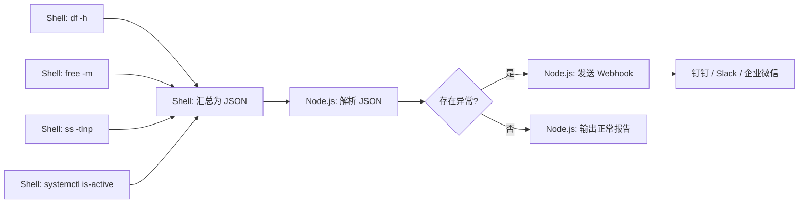
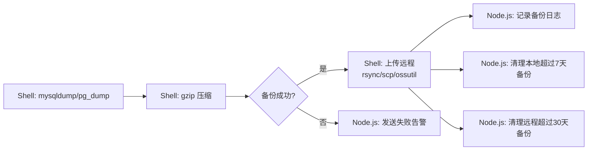
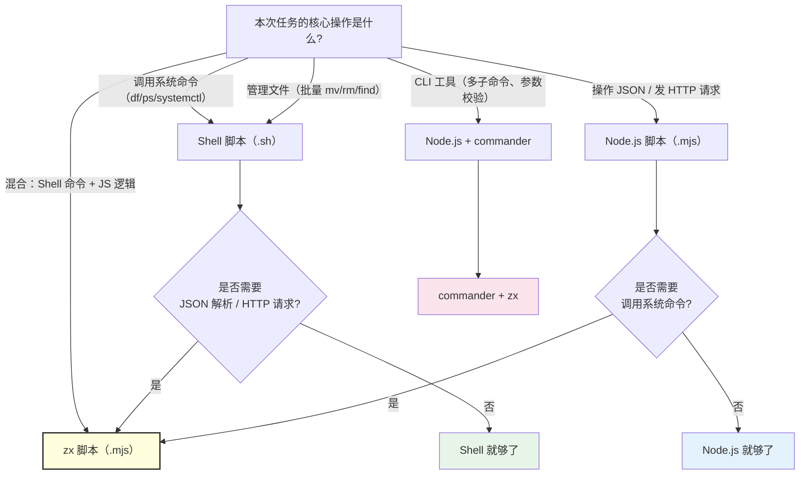

# 04 — 实战项目：团队工具箱

> 对应 Day 4 学习内容。目标：结合 Shell / Node.js / zx 完成 3 个可直接用于生产环境的实用脚本。

---

## 📌 前置要求

| 项目 | 说明 |
|------|------|
| **目标读者** | 已掌握 Day 1-3 全部内容（Shell 进阶、Node.js 脚本、zx 混合编程） |
| **环境准备** | Bash >= 5.0、Node.js >= 18、zx（`npm i -g zx`） |
| **实战产出** | 健康检查脚本、数据库备份脚本、日常发布 CLI |

---

## 项目 1：环境健康检查脚本

### 1.1 目的

一键检查服务器关键状态指标，出现异常时自动发送 Webhook 通知。覆盖四大维度：

| 维度 | 命令 | 检查内容 |
|------|------|---------|
| 磁盘 | `df -h` | 各分区使用率，超过阈值告警 |
| 内存 | `free -m` | 总内存、已用、可用、Swap |
| 端口 | `ss -tlnp` | 关键端口是否在监听 |
| 服务 | `systemctl is-active` | 核心服务是否运行 |

### 1.2 组合流程

数据流采用"Shell 采集 → JSON 输出 → Node.js 解析 → 决策 → 通知"的分层模式：



Shell 负责系统命令采集，Node.js 负责数据处理和网络交互——各司其职，耦合度最低。

### 1.3 Shell 采集端

```bash
#!/bin/bash
# collect-health.sh — 采集服务器健康指标，输出 JSON

OUTPUT_FILE="/tmp/health-report.json"

# 磁盘使用率（取 root 分区）
DISK_USAGE=$(df -h / | awk 'NR==2 {print $5}' | sed 's/%//')

# 内存（MB）
MEM_TOTAL=$(free -m | awk '/^Mem:/ {print $2}')
MEM_USED=$(free -m | awk '/^Mem:/ {print $3}')
MEM_FREE=$(free -m | awk '/^Mem:/ {print $4}')

# 关键端口检查（以 3000、443 为例）
PORT_3000=$(ss -tlnp | grep -q ":3000 " && echo "listening" || echo "down")
PORT_443=$(ss -tlnp | grep -q ":443 " && echo "listening" || echo "down")

# 服务状态
NGINX_STATUS=$(systemctl is-active nginx 2>/dev/null || echo "inactive")

# 输出 JSON
cat > "$OUTPUT_FILE" <<EOF
{
  "hostname": "$(hostname)",
  "timestamp": "$(date -Iseconds)",
  "disk": { "usage_percent": $DISK_USAGE },
  "memory": {
    "total_mb": $MEM_TOTAL,
    "used_mb": $MEM_USED,
    "free_mb": $MEM_FREE
  },
  "ports": {
    "3000": "$PORT_3000",
    "443": "$PORT_443"
  },
  "services": {
    "nginx": "$NGINX_STATUS"
  }
}
EOF

echo "报告已写入: $OUTPUT_FILE"
```

### 1.4 Node.js 分析 + 通知端

```js
#!/usr/bin/env node
// health-notifier.mjs — 读取健康报告，判断异常，发送 Webhook

import { readFile } from 'node:fs/promises';

const THRESHOLDS = {
  disk_usage: 80,           // 磁盘使用率超过 80% 告警
  memory_free_mb: 500,      // 可用内存低于 500MB 告警
};

async function main() {
  const raw = await readFile('/tmp/health-report.json', 'utf8');
  const report = JSON.parse(raw);

  const issues = [];

  // 磁盘检查
  if (report.disk.usage_percent > THRESHOLDS.disk_usage) {
    issues.push(`磁盘使用率 ${report.disk.usage_percent}%（阈值 ${THRESHOLDS.disk_usage}%）`);
  }

  // 内存检查
  if (report.memory.free_mb < THRESHOLDS.memory_free_mb) {
    issues.push(`可用内存仅 ${report.memory.free_mb}MB（阈值 ${THRESHOLDS.memory_free_mb}MB）`);
  }

  // 端口检查
  for (const [port, status] of Object.entries(report.ports)) {
    if (status !== 'listening') {
      issues.push(`端口 ${port} 未在监听`);
    }
  }

  // 服务检查
  for (const [svc, status] of Object.entries(report.services)) {
    if (status !== 'active') {
      issues.push(`服务 ${svc} 状态异常: ${status}`);
    }
  }

  if (issues.length === 0) {
    console.log(`[${report.timestamp}] 健康检查通过 — ${report.hostname}`);
    return;
  }

  // 有异常，发送 Webhook
  const webhookUrl = process.env.HEALTH_WEBHOOK_URL;
  if (!webhookUrl) {
    console.error('未配置 HEALTH_WEBHOOK_URL，跳过通知');
    console.error('异常项:', issues.join('; '));
    process.exit(1);
  }

  const payload = {
    msgtype: 'markdown',
    markdown: {
      title: `服务器异常告警: ${report.hostname}`,
      text: [
        `### 服务器异常告警`,
        `**主机**: ${report.hostname}`,
        `**时间**: ${report.timestamp}`,
        `**异常项**:`,
        ...issues.map(i => `- ${i}`),
      ].join('\n'),
    },
  };

  const res = await fetch(webhookUrl, {
    method: 'POST',
    headers: { 'Content-Type': 'application/json' },
    body: JSON.stringify(payload),
  });

  if (!res.ok) {
    console.error(`Webhook 发送失败: ${res.status} ${res.statusText}`);
    process.exit(1);
  }

  console.log(`已发送告警通知，共 ${issues.length} 项异常`);
}

main().catch(err => {
  console.error('健康检查失败:', err);
  process.exit(1);
});
```

### 1.5 使用方式

```bash
# 第一步：采集数据
bash collect-health.sh

# 第二步：分析并通知（配置 Webhook 地址）
export HEALTH_WEBHOOK_URL="https://oapi.dingtalk.com/robot/send?access_token=xxx"
node health-notifier.mjs

# 可加入 crontab 每 5 分钟执行一次
*/5 * * * * cd /opt/health-check && bash collect-health.sh && node health-notifier.mjs
```

### 1.6 设计要点

- **Shell 只负责采集**：所有数据聚合为 JSON 再交给 Node.js，两者通过文件解耦
- **Node.js 只负责决策和通知**：读取 JSON，做逻辑判断，调用 HTTP API
- **阈值可配置**：集中定义在 `THRESHOLDS` 对象，改阈值不必改采集逻辑
- **无外部依赖**：只用 Node.js 原生 `fetch` 和 `fs/promises`，不需要 npm install

---

## 项目 2：数据库备份 + 清理脚本

### 2.1 目的

自动备份数据库，压缩后上传远程存储，按策略清理过期备份。支持 MySQL 和 PostgreSQL。

### 2.2 整体架构



### 2.3 备份脚本核心逻辑

```bash
#!/bin/bash
# db-backup.sh — 数据库备份

set -e

DB_NAME="${DB_NAME:?需要设置 DB_NAME}"
DB_TYPE="${DB_TYPE:-mysql}"
BACKUP_DIR="${BACKUP_DIR:-/data/backup}"
TIMESTAMP=$(date '+%Y%m%d-%H%M%S')
FILENAME="backup-${DB_NAME}-${TIMESTAMP}.sql.gz"
FILEPATH="${BACKUP_DIR}/${FILENAME}"

mkdir -p "$BACKUP_DIR"

case "$DB_TYPE" in
  mysql)
    mysqldump \
      --single-transaction \
      --quick \
      --routines \
      --triggers \
      -h "${DB_HOST:-localhost}" \
      -u "${DB_USER:-root}" \
      -p"${DB_PASS}" \
      "$DB_NAME" | gzip > "$FILEPATH"
    ;;
  postgres)
    PGPASSWORD="$DB_PASS" pg_dump \
      -h "${DB_HOST:-localhost}" \
      -U "${DB_USER:-postgres}" \
      "$DB_NAME" | gzip > "$FILEPATH"
    ;;
  *)
    echo "不支持的数据库类型: $DB_TYPE"
    exit 1
    ;;
esac

# 输出备份信息 (JSON 格式，给 Node.js 消费)
cat <<EOF
{
  "status": "success",
  "db_name": "$DB_NAME",
  "file": "$FILEPATH",
  "size_bytes": $(stat -f%z "$FILEPATH" 2>/dev/null || stat -c%s "$FILEPATH" 2>/dev/null),
  "timestamp": "$(date -Iseconds)"
}
EOF
```

### 2.4 Node.js 管理端

```js
#!/usr/bin/env node
// backup-manager.mjs — 备份管理：记录日志 + 清理过期 + 失败告警

import { readFile, writeFile, readdir, unlink } from 'node:fs/promises';
import { join } from 'node:path';

const LOG_FILE = '/var/log/backup-manager.json';
const CONFIG = {
  localRetentionDays: 7,
  remoteRetentionDays: 30,
  backupDir: '/data/backup',
  remoteDir: 'oss://my-bucket/backups/',
};

async function loadHistory() {
  try {
    const data = await readFile(LOG_FILE, 'utf8');
    return JSON.parse(data);
  } catch {
    return { backups: [] };
  }
}

async function saveHistory(history) {
  await writeFile(LOG_FILE, JSON.stringify(history, null, 2));
}

function uploadToRemote(file) {
  // 示例：使用 ossutil（阿里云 OSS CLI）
  // execSync(`ossutil cp "${file}" "${CONFIG.remoteDir}"`, { stdio: 'inherit' });
  console.log(`上传 ${file} 到 ${CONFIG.remoteDir} (模拟)`);
}

async function cleanLocalOldBackups() {
  const cutoff = Date.now() - CONFIG.localRetentionDays * 86400_000;
  const files = await readdir(CONFIG.backupDir);

  for (const file of files) {
    if (!file.endsWith('.sql.gz')) continue;

    const filePath = join(CONFIG.backupDir, file);
    // 根据文件名中的时间戳判断是否过期
    const match = file.match(/backup-\w+-(\d{8})/);
    if (!match) continue;

    const fileDate = new Date(match[1].replace(/(\d{4})(\d{2})(\d{2})/, '$1-$2-$3'));
    if (fileDate.getTime() < cutoff) {
      await unlink(filePath);
      console.log(`已清理本地过期备份: ${file}`);
    }
  }
}

async function main() {
  // 1. 执行 Shell 备份
  console.log('开始数据库备份...');
  const { spawnSync } = await import('node:child_process');
  const result = spawnSync('bash', ['db-backup.sh'], {
    env: { ...process.env },
    stdio: ['inherit', 'pipe', 'inherit'],
  });

  if (result.status !== 0) {
    console.error('备份失败');
    // 发送告警 Webhook
    if (process.env.ALARM_WEBHOOK) {
      await fetch(process.env.ALARM_WEBHOOK, {
        method: 'POST',
        headers: { 'Content-Type': 'application/json' },
        body: JSON.stringify({
          msgtype: 'text',
          text: { content: `数据库备份失败: ${result.stderr?.toString() || '未知错误'}` },
        }),
      });
    }
    process.exit(1);
  }

  // 2. 解析备份结果
  const backupInfo = JSON.parse(result.stdout.toString().trim());
  console.log(`备份完成: ${backupInfo.file} (${(backupInfo.size_bytes / 1024 / 1024).toFixed(2)}MB)`);

  // 3. 记录日志
  const history = await loadHistory();
  history.backups.push(backupInfo);
  await saveHistory(history);

  // 4. 上传远程
  uploadToRemote(backupInfo.file);

  // 5. 清理本地过期备份
  await cleanLocalOldBackups();
  console.log('本地清理完成');

  // 6. 远程清理（通过 Shell 命令）
  console.log('远程清理完成（模拟）');
}

main().catch(err => {
  console.error('备份管理失败:', err);
  process.exit(1);
});
```

### 2.5 备份命名与保留策略

| 策略 | 本地 | 远程 |
|------|------|------|
| 保留天数 | 7 天 | 30 天 |
| 存储路径 | `/data/backup/` | `oss://my-bucket/backups/` |
| 文件名格式 | `backup-{dbname}-{YYYYMMDD-HHmmss}.sql.gz` | 同上 |
| 清理方式 | `unlink` 删除文件 | 按日期前缀匹配删除 |

### 2.6 使用方式

```bash
# 单次备份
export DB_NAME=myapp DB_TYPE=mysql DB_USER=root DB_PASS=secret
node backup-manager.mjs

# 加入 crontab 每天凌晨 3 点执行
0 3 * * * cd /opt/backup && node backup-manager.mjs >> /var/log/backup-cron.log 2>&1
```

### 2.7 设计要点

- **Shell 做它擅长的**：调用 `mysqldump`/`pg_dump`，`gzip` 压缩，这些都是 Shell 的舒适区
- **Node.js 管策略和记录**：保留天数判断、日志持久化、Webhook 通知
- **JSON 作为粘合剂**：Shell 输出 JSON，Node.js 解析，避免用 `awk`/`sed` 解析文本
- **幂等性**：同名文件不会重复上传，日志增量追加

---

## 项目 3：日常发布 CLI

### 3.1 目的

用 Node.js 的 `commander` 做 CLI 框架，用 `zx` 执行 Shell 命令，构建一个生产可用的 `deploy` 命令。

### 3.2 CLI 设计

```text
deploy <command> [options]

Commands:
  staging             部署到预发布环境
  prod                部署到生产环境（需要 --tag）

Options:
  --tag <version>     指定发布版本（prod 必填）
  --bump <level>      自动升级版本号：patch | minor | major（默认 patch）
  -h, --help          显示帮助信息
```

### 3.3 完整脚本

```js
#!/usr/bin/env zx
// deploy.mjs — 日常发布 CLI

import { program } from 'commander';

// ===== 辅助函数 =====

function bumpVersion(current, level) {
  const parts = current.split('.').map(Number);
  if (level === 'major') {
    parts[0]++; parts[1] = 0; parts[2] = 0;
  } else if (level === 'minor') {
    parts[1]++; parts[2] = 0;
  } else {
    parts[2]++;
  }
  return parts.join('.');
}

async function healthCheck(url) {
  try {
    // AbortSignal.timeout 需要 Node.js >= 18.17，低版本可用 setTimeout + controller
    const controller = new AbortController();
    setTimeout(() => controller.abort(), 10000);
    const res = await fetch(url, { signal: controller.signal });
    return res.ok;
  } catch {
    return false;
  }
}

// ===== Commander 配置 =====

program
  .name('deploy')
  .description('团队发布 CLI 工具');

// deploy staging
program
  .command('staging')
  .description('部署到预发布环境')
  .option('--bump <level>', '版本升级级别', 'patch')
  .action(async (options) => {
    console.log('开始预发布部署...');

    // 1. 读取版本号
    const pkg = JSON.parse(await fs.readFile('./package.json', 'utf8'));
    const newVersion = bumpVersion(pkg.version, options.bump);
    console.log(`版本: ${pkg.version} → ${newVersion}`);

    // 2. 更新 package.json
    pkg.version = newVersion;
    await fs.writeFile('./package.json', JSON.stringify(pkg, null, 2));

    // 3. 提交 + 打 tag
    await $`git add package.json`;
    await $`git commit -m "chore: bump version to ${newVersion}"`;
    await $`git tag v${newVersion}`;
    await $`git push && git push --tags`;
    console.log(`已推送 tag: v${newVersion}`);

    // 4. 触发 CI（以 GitHub Actions 为例）
    // await $`gh workflow run deploy.yml --ref main`;
    console.log('已触发 CI Pipeline');

    // 5. 健康检查（假设 staging 地址）
    const healthy = await healthCheck('https://staging.example.com/health');
    if (healthy) {
      console.log('预发布健康检查通过');
    } else {
      console.error('预发布健康检查失败');
      process.exit(1);
    }
  });

// deploy prod
program
  .command('prod')
  .description('部署到生产环境（需指定 --tag）')
  .requiredOption('--tag <version>', '指定发布版本（如 v1.2.3）')
  .option('--bump <level>', '版本升级级别', 'patch')
  .action(async (options) => {
    console.log(`开始生产部署: ${options.tag}`);

    // 1. 验证 tag 存在
    try {
      await $`git rev-parse ${options.tag}`;
    } catch {
      console.error(`Tag ${options.tag} 不存在，请先创建`);
      process.exit(1);
    }

    // 2. 检出 tag
    await $`git checkout ${options.tag}`;

    // 3. 构建
    await $`npm ci --omit=dev`;
    await $`npm run build`;

    // 4. 部署到生产服务器（通过 SSH）
    const host = process.env.PROD_HOST;
    if (!host) {
      console.error('未配置 PROD_HOST 环境变量');
      process.exit(1);
    }

    await $`rsync -avz --delete dist/ ${host}:/app/`;
    await $`ssh ${host} "sudo systemctl restart myapp"`;

    // 5. 健康检查
    const healthy = await healthCheck('https://example.com/health');
    if (healthy) {
      console.log('生产健康检查通过');
    } else {
      console.error('部署后健康检查失败 — 正在回滚...');
      // 回滚：部署镜像切换到前一个版本（示意）
      // 实际项目中可用 systemd 模板实例或 K8s rollout undo
      await $`ssh ${host} "sudo systemctl restart myapp"`;
      process.exit(1);
    }

    // 6. 更新 package.json 版本号（在 main 分支上）
    const pkg = JSON.parse(await fs.readFile('./package.json', 'utf8'));
    const newVersion = bumpVersion(pkg.version, options.bump);
    pkg.version = newVersion;
    await fs.writeFile('./package.json', JSON.stringify(pkg, null, 2));

    console.log(`生产部署完成: ${options.tag}`);
  });

program.parse(process.argv);
```

### 3.4 使用示例

```bash
# 部署到预发布（自动 bump patch）
./deploy.mjs staging

# 部署到预发布（bump minor）
./deploy.mjs staging --bump minor

# 部署到生产（需要已存在的 tag）
./deploy.mjs prod --tag v1.2.3

# 查看帮助
./deploy.mjs -h
```

### 3.5 设计要点

| 特性 | 实现方式 | 说明 |
|------|---------|------|
| **CLI 框架** | `commander` | 子命令、`--tag` 必填校验、自动生成 `--help` |
| **版本升级** | `bumpVersion()` | 纯 JS 逻辑操作 `package.json` |
| **Git 操作** | 通过 zx 的 `` $`...` `` | 比 `execSync('git tag ...')` 简洁且无引号转义 |
| **CI 触发** | 预留 API 调用 | 可用 `gh` CLI 或直接调用 GitHub/GitLab REST API |
| **健康检查** | `fetch` + 超时 | Node.js 原生能力，10 秒超时防止卡死 |
| **失败回滚** | 重启上一个版本 | 生产部署失败时自动回滚 |

---

## 选型复盘

### 4.1 三个项目的分工回顾

#### 项目 1：环境健康检查

| 步骤 | 工具 | 为什么 |
|------|------|--------|
| 采集磁盘、内存、端口、服务状态 | Shell | 这些对应 `df`/`free`/`ss`/`systemctl`——全是系统命令，Shell 原生调用 |
| 聚合为 JSON | Shell | 简单的变量拼接，`cat > file <<EOF` 即可完成 |
| 解析 JSON、判断阈值 | Node.js | JS 的 `JSON.parse` + 条件判断，比 Shell `jq` + `[ ]` 可读性强 |
| 发送 Webhook | Node.js | 需要构造 HTTP 请求体、处理响应，Node.js `fetch` 天然胜任 |
| 定时运行 | crontab | 系统自带、零依赖、稳定可靠 |

健康检查是典型的"Shell 8 成、Node.js 2 成"分工。

#### 项目 2：数据库备份

| 步骤 | 工具 | 为什么 |
|------|------|--------|
| 数据库导出 | Shell (`mysqldump`/`pg_dump`) | 这就是 Shell 命令，Node.js 没有直接替代品 |
| 压缩 | Shell (`gzip`) | Shell 管道 `| gzip` 一行完成 |
| 上传远程 | Shell (`rsync`/`ossutil`) | CLI 工具本身是 Shell 命令 |
| 备份策略管理 | Node.js | 保留天数、日期比较、文件遍历——JS 的 `Date` 和 `fs` 远强于 Shell |
| 日志记录 | Node.js | JSON 格式持久化，灵活查询 |
| 失败告警 | Node.js | HTTP 请求（同项目 1） |

备份项目是"Shell 执行、Node.js 管理"的典型代表。

#### 项目 3：日常发布 CLI

| 步骤 | 工具 | 为什么 |
|------|------|--------|
| CLI 参数解析 | Node.js (`commander`) | 多子命令、必填选项校验，commander 是行业标准 |
| 版本号计算 | Node.js | 字符串分割/拼接，`bumpVersion()` 函数比 Shell 优雅得多 |
| `git add/commit/tag/push` | zx `$\`...\`` | 在 JS 中直接写 Shell 命令，无需 `execSync` 和引号转义 |
| `npm ci` / `npm run build` | zx `$\`...\`` | 同上 |
| `rsync` / `ssh` 远程操作 | zx `$\`...\`` | 同上 |
| 健康检查 | Node.js (`fetch`) | HTTP 请求，超时控制 |
| 回滚 | zx | 条件判断 + Shell 命令执行 |

发布 CLI 是"Node.js 主导、zx 无缝嵌入 Shell 命令"的最佳案例——`commander` 管理 CLI 结构，zx 执行所有 Shell 操作，二者在同一文件中自然交织。

### 4.2 决策总表

| 任务类型 | 推荐工具 | 一句话理由 |
|---------|---------|-----------|
| 调用系统命令（df/free/ss/systemctl） | Shell | 这些命令本身就是 Shell 的内置生态 |
| 文件批量操作（删除、移动、重命名） | Shell | `find`/`rm`/`mv` 一行搞定 |
| 文本管道处理（grep/awk/sed） | Shell | 管道链比任何语言都高效 |
| JSON 解析与构造 | Node.js | `JSON.parse` / `JSON.stringify` 原生支持 |
| HTTP 请求 / API 调用 | Node.js | `fetch` / `axios`，async/await 处理并发 |
| 复杂条件分支 / 异步流程 | Node.js | 比 Shell 的 `if/else` 可维护性高 10 倍 |
| 日期计算 / 保留策略 | Node.js | `Date` 对象、加减运算，Shell 的 `date` 难以处理复杂逻辑 |
| CLI 框架（多子命令、参数校验） | Node.js + commander | 自动生成帮助、类型校验、必填选项 |
| Shell 命令 + JS 逻辑在同一脚本交织 | zx | 在 JS 中 `$\`cmd\`` 直接执行，无需 exec 封装 |
| 定时执行 | crontab / systemd timer | 系统级定时器，稳定可靠，零额外依赖 |

### 4.3 三条核心判断准则

```
与文件/系统打交道    →   Shell
与数据/网络/逻辑打交道  →   Node.js
Shell 和 Node.js 在同一脚本中交织  →   zx
```

展开来说：

1. **文件/系统 → Shell**：任何以文件路径、进程、服务、SSH 为核心操作的任务，先用 Shell 上手。Shell 调用系统命令的开销为零，管道链是处理文件流的最高效方式。

2. **数据/网络/逻辑 → Node.js**：一旦涉及 JSON 操作、HTTP 请求、复杂条件判断、日期计算、数据持久化，就切换到 Node.js。JS 的标准库和 npm 生态让这些场景事半功倍。

3. **两者交织 → zx**：当 80% 是 Shell 命令但需要 20% 的 JS 逻辑（或者反过来），用 zx。它消除了 `execSync` 的样板代码，让两种语言在同一个文件中自然共存。

### 4.4 选型决策树



### 4.5 回顾大纲中的决策表

对比第 1 天大纲中的选型决策表，可以看到本次实战的三个项目完全印证了表中结论：

- **系统管理** → Shell：三个项目都大量调用了系统命令
- **JSON 处理** → Node.js：健康检查解析报告、备份记录日志、CLI 读取 `package.json`
- **HTTP/API** → Node.js：Webhook 通知，健康检查
- **CLI 工具** → Node.js + zx：`deploy` 命令使用 `commander` 框架
- **混合场景** → zx：`deploy.mjs` 中 `$\`git push\`` 和 `$\`rsync\`` 的混用

### 4.6 常见错误与修正

初学者在选型时容易走入两个极端：

**极端一：全部用 Shell**

典型表现：用 `awk` 解析 JSON、用 `curl` + 字符串拼接发 Webhook、用 `date` 做复杂的日期运算。结果是一堆难以维护的"脚本面条"。

修正：一旦发现需要操作 JSON 结构、调用 HTTP API 多次、或者条件嵌套超过两层，就应该切换到 Node.js。

**极端二：全部用 Node.js**

典型表现：用 `child_process.execSync` 执行 `df -h` 然后解析 stdout 字符串、用 `fs.readFileSync` 读 `/proc/meminfo`。结果是想做的事本身很简单，但代码却绕了一大圈。

修正：系统命令直接用 Shell 写，Node.js 只负责处理 Shell 输出的结构化数据。

**正确的做法**：

```bash
# ❌ 错误：在 Shell 中硬编码发送钉钉消息
curl -X POST "$WEBHOOK" \
  -H "Content-Type: application/json" \
  -d '{"msgtype":"text","text":{"content":"磁盘满了: '"$DISK_USAGE"'"}}'
# 字符串拼接构造 JSON，极易出错，难以处理复杂数据结构

# ✅ 正确：Shell 导出 JSON，Node.js 处理网络
node --input-type=module -e "
import { readFile } from 'node:fs/promises';
const data = JSON.parse(await readFile('/tmp/report.json', 'utf8'));
await fetch(process.env.WEBHOOK, {
  method: 'POST',
  headers: {'Content-Type': 'application/json'},
  body: JSON.stringify({ msgtype: 'text', text: { content: '磁盘满了: ' + data.disk.usage_percent } })
});
"
```

同样是调用 HTTP API，Shell 的方案经过多层引号转义后极易出现语法错误，Node.js 的方案则清晰且天然支持 JSON。

### 4.7 何时引入 npm 依赖

三个项目的依赖策略值得单独说明：

| 项目 | 依赖 | 理由 |
|------|------|------|
| 健康检查 | 零依赖 | `fetch` 是 Node.js 18+ 内置，无需安装任何包 |
| 数据库备份 | 零依赖 | Shell 命令已有，Node.js 只用原生 `fs` 和 `child_process` |
| 发布 CLI | `commander` | 这是核心依赖——没有它，你需要手写参数解析、帮助生成、子命令路由 |

判断原则：**只对核心功能引入依赖**。CLI 框架、模板引擎、数据解析这类"没有它就做不了"的场景值得引入依赖；而"有它能少写 3 行代码"的场景，不值得。

---

## 本日总结

| 项目 | 核心理念 | 关键工具 |
|------|---------|---------|
| 环境健康检查 | Shell 采集 → JSON 桥接 → Node.js 决策 | bash + Node.js fetch |
| 数据库备份清理 | Shell 执行备份 → Node.js 管理策略 | bash + gzip + rsync + Node.js fs |
| 日常发布 CLI | commander 框架 + zx 执行 Shell | commander + zx |

**实战项目的最终收获不是代码量，而是判断力**——面对一个新场景时，能脱口而出"这个用 Shell，那个交给 Node.js，中间用 zx 粘合"。
