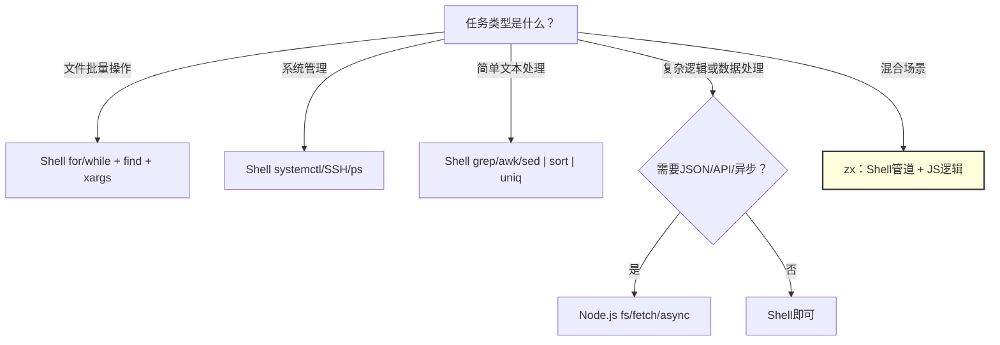

# Shell + Node.js 脚本学习大纲

> 面向 JS 技术栈开发者的脚本学习路径：不单独学 Python，而是用 **Shell（管道/系统管理）** 配合 **Node.js（复杂逻辑/JSON/API）** 覆盖日常 95% 的脚本场景。

---

## 📌 元信息

| 项目 | 说明 |
|------|------|
| **预计学习时间** | 4 天（约 12-16 小时） |
| **目标读者** | JS/Node.js 开发者，已掌握 Linux 基础命令和 Shell 脚本基础 |
| **前置模块** | [Shell 脚本基础](../linux/doc/05-shell-scripting.md)（已掌握变量、条件、循环、函数） |
| **面试定位** | 不单独设面试章节，选型原则即为面试答案——能说清"什么时候用什么"比背参数更重要 |
| **实战产出** | 日志归档脚本、CLI 工具、部署脚本、数据库备份脚本、健康检查脚本 |

---

## 🎯 学习目标

完成本模块学习后，你应该能够：

1. 能写 30 行以上的 Bash 脚本完成文件批量操作和自动化任务
2. 会用 Node.js 写脚本处理 JSON/CSV/YAML、调用 API、定时任务
3. 会使用 `zx` 在 Node.js 中自然地混写 Shell 命令
4. 遇到场景能判断"用 Shell 还是用 Node.js"
5. 能把常用的部署/备份/监控任务写成可复用的脚本

---

## 📋 前置要求

- 已掌握 Linux 基础命令（对应 [linux/doc](../linux/doc/) Day 1-3 内容）
- 已掌握 JavaScript/Node.js 基础
- 环境准备：
  ```bash
  # Shell — macOS/Linux 自带 Bash（建议 >= 5.0）
  bash --version

  # Node.js >= 18
  node --version

  # zx（可选，推荐）
  npm install -g zx
  ```

---

## 🧠 核心知识体系

| 领域 | 用什么工具 | 典型场景 |
|------|-----------|---------|
| **文件批量操作** | Shell（`for`、`find`、`xargs`） | 批量重命名、清理日志、按日期归档 |
| **文本处理** | Shell（`grep`、`awk`、`sed`） | 日志分析、格式转换 |
| **系统管理** | Shell（`systemctl`、SSH、进程管理） | 服务启停、部署、备份 |
| **JSON/YAML 处理** | Node.js（`JSON.parse`、`js-yaml`） | 编辑 `package.json`、生成配置 |
| **HTTP/API 调用** | Node.js（`fetch`、`axios`） | 调用 Webhook、健康检查、数据拉取 |
| **定时任务** | Node.js（`node-cron`） | 定时备份、监控报告 |
| **文件监听** | Node.js（`chokidar`） | 自动重启、文件变更触发 |
| **CLI 工具** | Node.js（`commander`、`zx`） | 团队工具、脚手架 |
| **混合脚本** | zx | 兼具 Shell 的便利和 Node.js 的能力 |

---

## 🗺️ 学习路径（4 天）

| 天数 | 主题 | 产出 |
|------|------|------|
| **Day 1** | Shell 脚本进阶 | 变量、条件、循环、函数、参数解析；写一个日志归档脚本 |
| **Day 2** | Node.js 脚本入门 | 用 `fs`/`path`/`fetch` 写脚本；处理 JSON/CSV/API；搭建 CLI |
| **Day 3** | zx：Shell × Node.js 最佳结合 | Shell 管道 + Node.js 逻辑；写一个完整的部署脚本 |
| **Day 4** | 实战项目：团队工具箱 | 结合前三天的能力完成 2-3 个实用脚本 |

---

## 📚 文档目录规划

```text
src/deploy/script/
├── script-learning-outline.md           # 本文件
├── doc/
│   ├── 01-shell-advanced.md             # Shell 脚本进阶
│   ├── 02-nodejs-scripting.md           # Node.js 脚本实战
│   ├── 03-zx-shell-node-mix.md          # zx：Shell × Node.js
│   └── 04-practical-toolbox.md          # 实战项目：团队工具箱
└── assets/                              # 截图、架构图、流程图
```

---

## 第 1 天：Shell 脚本进阶

> 承接 [linux/doc/05-shell-scripting.md](../linux/doc/05-shell-scripting.md)。**假设已掌握**：变量定义与引用、`if` 条件、`for`/`while` 循环、函数定义与 `local`、`$?`/`$@`/`$#`。本节不再重复基础，直接进入进阶写法。

### 1.1 变量与参数进阶
- 默认值：`${VAR:-default}`、`${VAR:=default}`、`${VAR:?error msg}`
- 字符串操作：`${#VAR}`、`${VAR#prefix}`、`${VAR%suffix}`、`${VAR//old/new}`
- 数组操作：声明、遍历、切片

### 1.2 条件与循环
- `if [ -f file ]` / `[ -d dir ]` / `[ -z str ]` 文件类型判断
- `for f in *.log`、`while read line`、`seq` 遍历

### 1.3 函数与错误处理
- 带 return 的函数、局部变量 `local`
- `trap` 清理、重试机制

### 1.4 实战：日志归档脚本

```bash
#!/bin/bash
# 功能：将 7 天前的日志压缩归档到 backup/，保留最近 7 天日志
set -e
LOG_DIR="/var/log/myapp"
BACKUP_DIR="/backup/logs"
DAYS=7

mkdir -p "$BACKUP_DIR"
find "$LOG_DIR" -name "*.log" -mtime +$DAYS | while read f; do
  gzip "$f"
  mv "${f}.gz" "$BACKUP_DIR/"
  echo "[$(date)] 归档: $f"
done
```

---

## 第 2 天：Node.js 脚本实战

### 2.1 Node.js 作为脚本引擎的优势
- 零构建、直接 `node script.mjs`
- 天然 JSON 支持（读 `package.json`、写 `.json` 配置）
- `fetch` 原生支持、`fs/promises` 异步友好
- npm 生态：`yaml`、`csv-parse`、`ora`、`chalk`

### 2.2 文件读写与 JSON 处理
```js
import { readFile, writeFile } from 'node:fs/promises';
const pkg = JSON.parse(await readFile('./package.json', 'utf8'));
pkg.version = '2.0.0';
await writeFile('./package.json', JSON.stringify(pkg, null, 2));
```

### 2.3 CLI 参数与结构
- `process.argv` 简单解析
- `commander`/`yargs`：子命令、--flag、--help

### 2.4 HTTP 请求与定时任务
```js
import { CronJob } from 'cron';

const job = new CronJob('0 3 * * *', async () => {
  const res = await fetch('https://api.example.com/health');
  const data = await res.json();
  // 处理结果...
});
job.start();
```

---

## 第 3 天：zx：Shell × Node.js 最佳结合

### 3.1 为什么需要 zx
- Shell 不适合作复杂逻辑判断
- Node.js 写 Shell 命令很啰嗦（`execSync`、引号转义）
- zx 让两种语言在同一文件中自然共存

### 3.2 zx 核心语法

```js
#!/usr/bin/env zx

let branch = await $`git branch --show-current`;   // Shell
let pkg = JSON.parse(await fs.readFile('package.json')); // Node

if (branch.trim() === 'main') {
  await $`docker build -t myapp .`;                 // Shell 条件执行
  await $`docker push myapp:latest`;
}

let ips = (await $`ss -tlnp | grep 3000 | awk '{print $4}'`).toString();
// ↘ 结果是字符串，可直接用 JS 逻辑处理
```

### 3.3 完整部署脚本（zx 版）

```js
#!/usr/bin/env zx

const ENV = argv.env || 'staging';
const HOST = argv.host;

if (!HOST) { console.error('需要 --host 参数'); process.exit(1); }

await $`ssh $HOST "cd /app && git pull"`;
await $`ssh $HOST "cd /app && npm ci --omit=dev"`;
await $`ssh $HOST "cd /app && npm run build"`;
await $`ssh $HOST "sudo systemctl restart myapp"`;

let status = await $`ssh $HOST "systemctl is-active myapp"`;
console.log(`部署完成，状态: ${status.stdout.trim()}`);
```

---

## 第 4 天：实战项目 — 团队工具箱

### 项目 1：环境健康检查脚本
- 检查：磁盘使用率、内存、端口监听、服务状态
- 异常时发送 Webhook 通知
- 技术栈：Shell（采集数据）+ Node.js（格式化 + 发通知）

### 项目 2：数据库备份 + 清理脚本
- 备份数据库 → 压缩 → 上传到 S3/OSS
- 保留最近 7 天本地备份，30 天远程备份
- 技术栈：Shell（`mysqldump`/`pg_dump`）+ Node.js（上传 + 清理）

### 项目 3：日常发布 CLI
- `deploy staging`、`deploy prod --tag v1.2.3`
- 自动更新版本号、打 tag、推送到 CI
- 技术栈：Node.js + zx（`commander` 做 CLI 框架）

### 验收清单

完成实战项目后，应能验证以下结果：

- [ ] 健康检查脚本能正确采集磁盘、内存、端口、服务状态，异常时发送 Webhook
- [ ] 数据库备份脚本能成功备份 → 压缩 → 上传远程，本地保留 7 天、远程 30 天
- [ ] `deploy` CLI 支持子命令和环境参数，能自动升级版本号并打 Git tag
- [ ] 遇到新场景能判断用 Shell / Node.js / zx

---

## 📝 选型决策：什么时候用什么



### 文本决策表

| 场景 | 推荐工具 | 理由 |
|------|---------|------|
| 文件批量操作（重命名、清理、归档） | Shell | `for` + `find` + `mv`/`rm` 最直接，一行搞定 |
| 日志/文本分析（过滤、统计、提取） | Shell | `grep`/`awk`/`sed` 管道链，秒级处理大文件 |
| 系统管理（服务启停、SSH 部署） | Shell | `systemctl`、`ssh` 本身就是 Shell 命令 |
| 复杂逻辑（条件嵌套、异步流程） | Node.js | 比 Shell 的 `if/else/case` 好维护 10 倍 |
| JSON/YAML 处理 | Node.js | `JSON.parse` / `js-yaml` / `toml`，天然支持 |
| HTTP API 调用 | Node.js | `fetch` 原生，`async/await` 处理并发请求 |
| 定时任务（备份、监控报告） | Node.js | `node-cron` 比 crontab + Shell 更可控 |
| 混合场景（既要 Shell 命令又要 JS 逻辑） | zx | 在 JS 中直接 ``` $`command` ```，无需 exec 转义 |
| CLI 工具（多子命令、参数解析） | Node.js + zx | `commander`/`yargs` 做框架，zx 执行 Shell |

---

## ✅ 完成标准

- [ ] 能写 30 行以上的 Bash 脚本（含函数、循环、条件、参数）
- [ ] 能用 Node.js 脚本读写 JSON、发起 HTTP 请求
- [ ] 能用 zx 在一个脚本中混用 Shell 命令和 JS 逻辑
- [ ] 遇到新场景能判断用 Shell 还是 Node.js
- [ ] 能写一个完整的部署/备份/健康检查脚本

---

## 🔗 关联模块

- Linux 基础：[linux/doc/05-shell-scripting.md](../linux/doc/05-shell-scripting.md)
- Docker 部署：[docker/doc/05-production-deploy.md](../docker/doc/05-production-deploy.md)
- CI/CD：[ci/doc/02-github-actions.md](../ci/doc/02-github-actions.md)
