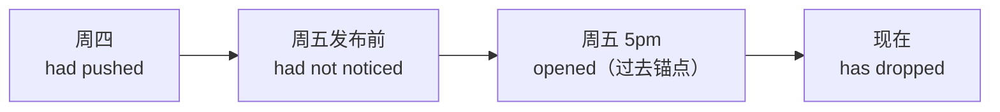

# 第 4 讲：完成时态专攻

> **第一册 · Unit 01 · Lesson 04** ｜ 预计用时 70 分钟
> 学完本讲你能：用时间轴攻克 have done / had done；会判断「影响延续至今」与「过去的过去」，修复 G1 / G2 类错误。

---

## 1. 课文精读

**Friday, 5 p.m.**

> Friday, 5 p.m. The release has just gone out, and my phone has already buzzed three times. A user says the app has crashed twice since the update. By the time I opened my laptop, the team had already collected the logs. Someone had pushed a broken flag on Thursday — nobody had noticed it before the release. We have fixed similar bugs before, so we followed the old playbook: revert first, ask questions later. Now the crash rate has dropped to zero. My butler has not slept since Monday — it keeps sending reports every hour. Automation has saved us again, and this time nobody had to work late.

**参考译文**

> 周五下午五点。发布刚发出去，我的手机已经震了三次。一位用户说自更新以来应用已经崩溃了两次。等我打开笔记本时，团队已经收集好日志了。有人周四就推送了一个坏掉的开关——在发布之前没人注意到它。我们以前修过类似的 bug，所以照老剧本办事：先回滚，再问问题。现在崩溃率已经降到零。我的管家从周一起就没睡过——它每小时都在持续发送报告。自动化又救了我们一次，这次没人需要加班。

**关键句解析**

| 句子 | 拆解 |
|------|------|
| The release **has just gone** out. | just / already / yet 是现在完成的标志 — 过去动作 + 现在的结果（手机在震） |
| **By the time** I opened my laptop, the team **had** already **collected** the logs. | opened 是**过去锚点**；收集日志发生在锚点之前 → 过去的过去 → had done |
| We **have fixed** similar bugs **before**. | before 不带具体过去时间 = 「经验」→ 现在完成；对照 followed（过去的做法用一般过去） |

---

## 2. 词汇与词组

> 本讲精讲 6 词 + 词群 5 词，共 11 词。

| 单词/词组 | 音标 | 释义 | 课文例句 | 拓展搭配 |
|-----------|------|------|----------|----------|
| crash | /kræʃ/ | v. 崩溃 / n. 崩溃 | the app has crashed twice | crash rate 崩溃率；system crash |
| update | /ˈʌpdeɪt/ | n. 更新 / v. 更新 | since the update | software update；update the docs |
| flag | /flæɡ/ | n. 功能开关 / 旗标 | a broken flag | feature flag 功能开关 |
| revert | /rɪˈvɜːrt/ | v. 回滚 | revert first, ask questions later | revert a commit |
| playbook | /ˈpleɪbʊk/ | n. 剧本；既定方案 | we followed the old playbook | incident playbook 应急手册 |
| rate | /reɪt/ | n. 比率 | the crash rate has dropped | success rate 成功率 |

### 2.1 高频拓展词群

| 词 | 课文句 | 高频搭配 |
|----|--------|---------|
| push | Someone **had pushed** a broken flag. | push code；push for + 推动 |
| drop | the crash rate **has dropped** to zero | drop to + 数字；drop a feature |
| notice | nobody **had noticed** it | notice the difference |
| follow | we **followed** the old playbook | follow the steps；as follows 如下 |
| collect | the team **had collected** the logs | collect data / collect logs |

---

## 3. 语法点拆解

### 3.1 现在完成：have / has + 过去分词

| 用法 | 判断标准 | 课文句 |
|------|---------|--------|
| 影响延续到现在 | 过去的动作，**现在的结果**看得见 | The release has just gone out.（手机在震） |
| 经验 | 到目前为止「做过几次」 | We have fixed similar bugs before. |
| 持续 | 动作/状态从过去延续到现在 | My butler has not slept since Monday. |

> 时间标志：just / already / yet / ever / never / since + 时间点 / for + 时间段 / so far。

### 3.2 过去完成：had + 过去分词 = 过去的过去

> 判决规则：**过去完成必须有一个「过去的锚点」**。没有锚点，两个过去的动作按顺序用一般过去即可。
> ❌ I had eaten breakfast yesterday.（没有第二个过去参照）→ ✅ I ate breakfast yesterday.

### 3.3 since vs for

| 词 | 后接 | 例 |
|----|------|-----|
| since | 时间**点**（起点） | since Monday / since the update |
| for | 时间**段**（长度） | for three days / for an hour |

💡 课文句标注：`has crashed ... since the update`（since + 点）；`By the time I opened, ... had collected`（锚点 + 过去的过去）。

---

## 4. 输出

1. **复述**：用时间轴顺序复述这次事故（周四埋雷 → 周五发布 → 崩溃 → 回滚 → 归零），至少 1 句 had done
2. **仿写（核心）**：写一次你的线上事故 — 3 句：2 句过去完成 + 1 句现在完成。参考起点：
   - By the time I saw the alert, the on-call engineer had already restarted the service.
   - Someone had changed the config on Tuesday.
   - The incident has taught us to add a canary step.
3. **自检**：每个 had done 旁边写出它的「过去锚点」— 写不出来的就是滥用。

---

## 5. 配套练习

- 题目：[exercises/01-句子工程/L04-练习.md](../../exercises/01-句子工程/L04-练习.md)（基础层必做，强化层选做，答案在文末）
- 错题记录：

| 题号 | 错因 | 回流安排 |
|------|------|---------|
|      |      |         |

---

## 6. 本讲小结

- [ ] 能说出现在完成的两大标志（影响延续 / since·for·already）
- [ ] 能用「锚点」判断过去完成是否成立
- [ ] since / for 选择零失误
- [ ] 事故仿写 3 句：had done ×2 + have done ×1，锚点清晰
- [ ] 基础层练习正确率 ≥ 80%

---

🔗 下一讲：[L05 将来表达法与主将从现](05-将来表达法与主将从现.md)
