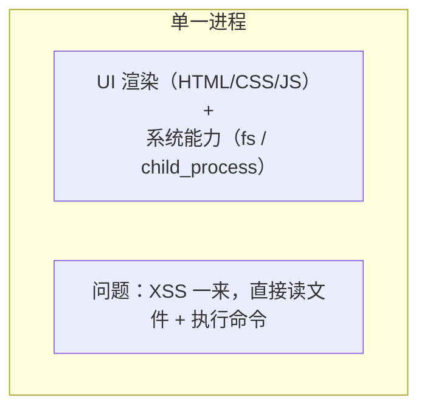
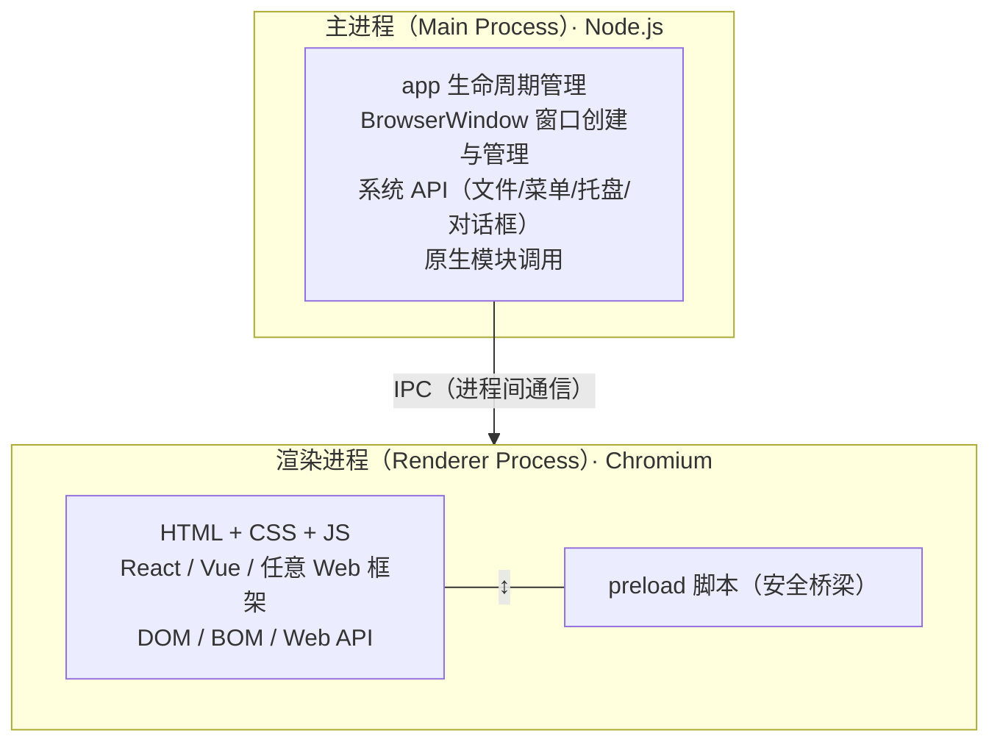
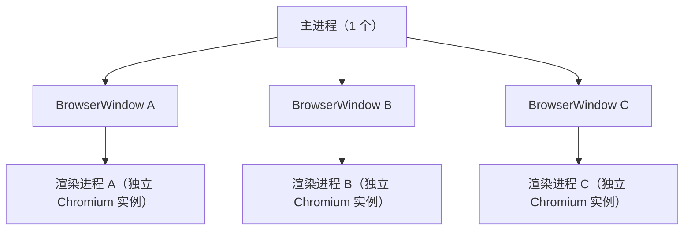
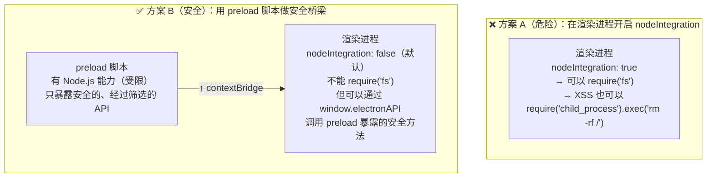
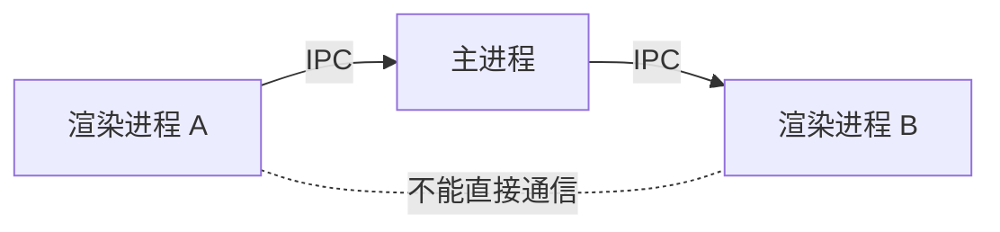

# 02 — 主进程与渲染进程：双进程架构全景

> 对应大纲：核心层 | 预计时间：1 天
> 面试可答：Electron 采用双进程架构——主进程运行 Node.js，负责窗口管理和系统 API 调用；渲染进程运行 Chromium，负责 UI 渲染。两者通过 IPC 通信，preload 脚本是安全的桥梁。这种设计既保证了 Web 技术栈的开发效率，又通过进程隔离实现了安全边界。

---

## 1. 为什么需要双进程？

在理解双进程架构之前，先想想如果只有一个进程会怎样。

### 1.1 单进程的问题

假设所有代码都在一个进程中运行：



- **安全问题**：Web 页面中的 XSS 漏洞可以直接访问文件系统、执行系统命令。在浏览器中，XSS 最多偷 Cookie；在这种架构中，XSS 可以删文件。
- **稳定性问题**：渲染进程中的死循环或内存泄漏会拖垮整个应用，包括系统能力部分。
- **权限问题**：Web 代码和系统代码混在一起，无法做细粒度的权限控制。

### 1.2 双进程的解决方案

Electron 借鉴了 Chromium 的多进程架构，将职责拆分到不同的进程中：



- **主进程**拥有 Node.js 和 Electron 的全部能力，但**不能操作 DOM**
- **渲染进程**拥有完整的 Web 能力（DOM / CSS / Web API），但**默认不能访问 Node.js**
- 两者通过 **IPC（Inter-Process Communication）** 通信
- **preload 脚本**运行在渲染进程中，但拥有有限的 Node.js 能力，是连接两个世界的桥梁

---

## 2. 主进程（Main Process）

### 2.1 核心特征

| 特征 | 说明 |
|------|------|
| **数量** | 整个应用只有**一个**主进程 |
| **运行环境** | Node.js（完整能力） |
| **入口文件** | `package.json` 中的 `"main"` 字段指定 |
| **能做什么** | 创建窗口、管理系统托盘、注册全局快捷键、读写文件、调用原生模块 |
| **不能做什么** | 不能操作 DOM（没有 `document`、`window` 对象） |
| **生命周期** | 应用启动时创建，应用退出时销毁 |

### 2.2 主进程的核心职责

**① 应用生命周期管理**

```typescript
import { app } from 'electron';

// 应用初始化完成
app.whenReady().then(() => {
  createWindow();
});

// 所有窗口关闭（macOS 除外，macOS 关窗口不退出应用）
app.on('window-all-closed', () => {
  if (process.platform !== 'darwin') {
    app.quit();
  }
});

// macOS: 点击 Dock 图标时重建窗口
app.on('activate', () => {
  if (BrowserWindow.getAllWindows().length === 0) {
    createWindow();
  }
});
```

**② 窗口创建与管理**

```typescript
import { BrowserWindow } from 'electron';

const win = new BrowserWindow({
  width: 800,
  height: 600,
  webPreferences: {
    preload: path.join(__dirname, 'preload.js'),
    contextIsolation: true,   // 关闭 JS 上下文隔离是安全隐患
    sandbox: true,            // 启用沙箱
  },
});

win.loadFile('index.html');
// 或加载远程 URL
// win.loadURL('https://example.com');
```

**③ 系统 API 调用**

主进程可以调用所有 Electron 和 Node.js 的系统 API：

```typescript
import { dialog, Notification, shell } from 'electron';
import fs from 'node:fs';
import path from 'node:path';

// 打开系统对话框
const result = await dialog.showOpenDialog({
  properties: ['openFile'],
  filters: [{ name: 'Markdown', extensions: ['md'] }],
});

// 发送系统通知
new Notification({ title: '提醒', body: '文件保存成功' }).show();

// 用默认浏览器打开 URL
shell.openExternal('https://electronjs.org');

// 读写文件
const content = fs.readFileSync(path.join(app.getPath('userData'), 'config.json'), 'utf-8');
```

### 2.3 主进程能访问的 API 模块

| API | 归属 | 用途 |
|-----|------|------|
| `app` | Electron | 应用生命周期 |
| `BrowserWindow` | Electron | 窗口创建与管理 |
| `dialog` | Electron | 系统对话框（打开/保存/消息） |
| `Menu` | Electron | 应用菜单和上下文菜单 |
| `Tray` | Electron | 系统托盘 |
| `globalShortcut` | Electron | 全局快捷键 |
| `ipcMain` | Electron | IPC 通信（主进程端） |
| `clipboard` | Electron | 剪贴板操作 |
| `shell` | Electron | 打开外部 URL / 文件管理器 |
| `nativeTheme` | Electron | 系统主题（暗色/亮色） |
| `fs` / `path` / `os` | Node.js | 文件系统、路径、系统信息 |
| `child_process` | Node.js | 子进程 |
| `crypto` / `http` | Node.js | 加密、网络 |
| 任意 npm 包 | npm | `better-sqlite3`、`sharp` 等 |

---

## 3. 渲染进程（Renderer Process）

### 3.1 核心特征

| 特征 | 说明 |
|------|------|
| **数量** | 每个 `BrowserWindow` 对应**一个**渲染进程 |
| **运行环境** | Chromium（完整的浏览器环境） |
| **能做什么** | DOM 操作、CSS 渲染、Web API、前端框架（React/Vue/Svelte） |
| **默认不能做** | 不能访问 Node.js API（没有 `require('fs')`） |
| **生命周期** | 窗口创建时启动，窗口关闭时销毁 |

### 3.2 渲染进程就是浏览器

这一点怎么强调都不为过——**渲染进程中的代码跟你在浏览器中写的 Web 代码完全一样**。

```html
<!-- 这是渲染进程的 HTML，跟浏览器里写的没有任何区别 -->
<!DOCTYPE html>
<html>
  <head>
    <meta charset="UTF-8" />
    <title>My App</title>
    <style>
      body {
        font-family: -apple-system, BlinkMacSystemFont, sans-serif;
        padding: 20px;
      }
    </style>
  </head>
  <body>
    <h1 id="title">Hello Electron</h1>
    <button id="btn">读取文件</button>
    <pre id="content"></pre>

    <script>
      // 这里的 JS 就是标准的浏览器 JS
      // 可以用 DOM API、Fetch、Web Workers、Canvas……
      document.getElementById('title').textContent = 'Hello from Renderer!';

      // 但不能这样：
      // const fs = require('fs');  ❌ 报错！渲染进程默认没有 Node.js

      // 要读文件，需要通过 preload 暴露的安全 API
      document.getElementById('btn').addEventListener('click', async () => {
        const content = await window.electronAPI.readFile('/path/to/file');
        document.getElementById('content').textContent = content;
      });
    </script>
  </body>
</html>
```

### 3.3 渲染进程中可用的 API

| API 类别 | 示例 | 说明 |
|----------|------|------|
| DOM API | `document.querySelector` | 标准 DOM 操作 |
| Web API | `fetch`、`WebSocket`、`localStorage` | 浏览器标准 API |
| CSS | Grid、Flexbox、动画、变量 | 完整的 CSS 能力 |
| Canvas / WebGL | `<canvas>`、Three.js | 图形渲染 |
| Web Workers | `new Worker()` | 多线程计算 |
| Web Audio | `AudioContext` | 音频处理 |
| 前端框架 | React、Vue、Svelte、Angular | 任意 Web 框架 |

### 3.4 多窗口 = 多渲染进程



- 每个窗口是独立的渲染进程，拥有独立的 JS 上下文
- 窗口 A 的变量和函数，窗口 B **无法直接访问**
- 窗口间通信必须通过主进程中转（IPC），这在第 09 篇会详细讲

---

## 4. preload 脚本：安全的桥梁

### 4.1 为什么需要 preload？

问题来了：渲染进程默认不能访问 Node.js，那它怎么读文件、怎么调系统 API？

两种方案：



### 4.2 preload 脚本的执行环境

preload 脚本是一个特殊的"混合环境"：

| 特征 | 说明 |
|------|------|
| 运行在渲染进程中 | 跟渲染进程共享同一个 Chromium 实例 |
| 有部分 Node.js 能力 | 可以 `require('electron')`、`require('path')` 等 |
| 可以访问 DOM | 但**不应该**直接操作 DOM（职责分离） |
| 通过 `contextBridge` 暴露 API | 这是它唯一对外的出口 |

### 4.3 完整的 preload 示例

```typescript
// src/preload.ts
import { contextBridge, ipcRenderer } from 'electron';

// 在 window.electronAPI 上暴露安全的方法
contextBridge.exposeInMainWorld('electronAPI', {
  // 渲染进程 → 主进程：读取文件
  readFile: (filePath: string) => ipcRenderer.invoke('read-file', filePath),

  // 渲染进程 → 主进程：保存文件
  saveFile: (filePath: string, content: string) =>
    ipcRenderer.invoke('save-file', filePath, content),

  // 主进程 → 渲染进程：监听来自主进程的消息
  onMenuAction: (callback: (action: string) => void) => {
    ipcRenderer.on('menu-action', (_event, action) => callback(action));
  },

  // 获取系统信息
  getPlatform: () => process.platform,
  getVersion: () => process.versions.electron,
});
```

对应的 TypeScript 类型声明（建议放在 `src/renderer/types.d.ts`）：

```typescript
interface ElectronAPI {
  readFile: (filePath: string) => Promise<string>;
  saveFile: (filePath: string, content: string) => Promise<void>;
  onMenuAction: (callback: (action: string) => void) => void;
  getPlatform: () => string;
  getVersion: () => string;
}

declare global {
  interface Window {
    electronAPI: ElectronAPI;
  }
}
```

渲染进程中使用：

```typescript
// 渲染进程中使用暴露的安全 API
const content = await window.electronAPI.readFile('/path/to/file.md');
console.log(content);

// 按钮点击时保存文件
document.getElementById('save-btn')?.addEventListener('click', async () => {
  const text = document.getElementById('editor')?.value ?? '';
  await window.electronAPI.saveFile('/path/to/file.md', text);
  alert('保存成功！');
});
```

---

## 5. 三者的协作关系

### 5.1 完整通信链路

一个典型的"渲染进程请求主进程读取文件"的流程：

```mermaid
sequenceDiagram
    participant R as 渲染进程
    participant P as preload 脚本
    participant M as 主进程
    R->>P: window.electronAPI.readFile('/a.md')
    P->>M: ipcRenderer.invoke('read-file', '/a.md')
    Note over M: ipcMain.handle('read-file', handler)
    Note over M: fs.readFileSync('/a.md')
    M-->>P: 返回文件内容
    P-->>R: 返回 Promise&lt;string&gt;
    Note over R: 显示文件内容
```

### 5.2 三层架构总结

| 层 | 运行环境 | 核心职责 | 能访问的 API |
|----|---------|---------|-------------|
| **主进程** | Node.js | 窗口管理、系统能力、业务逻辑 | Electron API + Node.js API + npm |
| **preload** | 渲染进程（受限 Node.js） | 安全桥梁，筛选并暴露 API | `contextBridge` + `ipcRenderer` + 部分 Node.js |
| **渲染进程** | Chromium | UI 渲染、用户交互 | DOM + Web API + `window.electronAPI`（preload 暴露的） |

---

## 6. 与浏览器多进程架构的类比

如果你熟悉 Chrome 浏览器的架构，Electron 的双进程模型很容易理解：

| Chrome 浏览器 | Electron | 类比 |
|--------------|----------|------|
| **浏览器主进程** | **主进程** | 管理窗口、标签页、系统资源 |
| **渲染进程**（每个 Tab 一个） | **渲染进程**（每个窗口一个） | 运行网页代码、渲染页面 |
| **GPU 进程** | GPU 进程（自动管理） | 图形加速 |
| **扩展进程** | **preload 脚本** | 在渲染进程中注入额外能力 |

关键区别：
- Chrome 的标签页之间天然隔离（不同域的页面不能互相访问）
- Electron 的渲染进程默认也没有 Node.js 能力，需要 preload 显式暴露
- Chrome 扩展有 `content_scripts` 注入能力，类似 Electron 的 preload

---

## 7. 常见误解澄清

### 误解 1："preload 就是主进程的一部分"

**错。** preload 脚本运行在**渲染进程**中，只是它拥有部分 Node.js 能力。它不是主进程，不能调用 `app`、`BrowserWindow` 等主进程专属 API。

```
主进程：app, BrowserWindow, dialog, Menu, fs, child_process ...
preload：contextBridge, ipcRenderer, path, process ...
渲染进程：document, window, fetch, localStorage ... + window.electronAPI
```

### 误解 2："渲染进程不能访问任何 Node.js API"

**不完全准确。** 默认情况下确实不能，但可以通过以下方式开启（不推荐）：

```typescript
// ❌ 危险：在渲染进程开启 Node.js
new BrowserWindow({
  webPreferences: {
    nodeIntegration: true,      // 渲染进程可以直接 require
    contextIsolation: false,    // 关闭上下文隔离
  },
});
```

这样做会让渲染进程中的 XSS 漏洞变成 RCE（远程代码执行），第 05 篇（安全基础）会详细讲为什么**永远不能**这样做。

### 误解 3："每个 BrowserWindow 都是独立的应用"

**不完全准确。** 每个窗口有独立的渲染进程，但它们**共享同一个主进程**。窗口间通信需要通过主进程中转。



### 误解 4："主进程和渲染进程是父子关系"

**不准确。** 虽然主进程创建了 BrowserWindow（进而启动了渲染进程），但两者是**协作关系**而非父子关系。主进程不能直接修改渲染进程的 DOM，渲染进程也不能直接调用主进程的方法——一切通过 IPC。

---

## 8. 实际代码演示：主进程与渲染进程的完整交互

下面是一个最小化的完整示例，展示主进程、preload、渲染进程三者如何协作：

### 8.1 主进程 `src/main.ts`

```typescript
import { app, BrowserWindow, ipcMain } from 'electron';
import path from 'node:path';
import fs from 'node:fs';

const createWindow = () => {
  const win = new BrowserWindow({
    width: 600,
    height: 400,
    webPreferences: {
      preload: path.join(__dirname, 'preload.js'),
      contextIsolation: true,
      sandbox: true,
    },
  });

  win.loadFile(path.join(__dirname, 'renderer', 'index.html'));
};

// 注册 IPC 处理器：接收渲染进程的请求
ipcMain.handle('read-file', async (_event, filePath: string) => {
  try {
    return fs.readFileSync(filePath, 'utf-8');
  } catch (err) {
    throw new Error(`读取失败: ${(err as Error).message}`);
  }
});

ipcMain.handle('get-app-info', () => ({
  name: app.getName(),
  version: app.getVersion(),
  electronVersion: process.versions.electron,
  nodeVersion: process.versions.node,
  chromeVersion: process.versions.chrome,
  platform: process.platform,
}));

app.whenReady().then(createWindow);

app.on('window-all-closed', () => {
  if (process.platform !== 'darwin') app.quit();
});

app.on('activate', () => {
  if (BrowserWindow.getAllWindows().length === 0) createWindow();
});
```

### 8.2 preload 脚本 `src/preload.ts`

```typescript
import { contextBridge, ipcRenderer } from 'electron';

contextBridge.exposeInMainWorld('electronAPI', {
  readFile: (filePath: string) => ipcRenderer.invoke('read-file', filePath),
  getAppInfo: () => ipcRenderer.invoke('get-app-info'),
});
```

### 8.3 渲染进程 `src/renderer/index.html`

```html
<!DOCTYPE html>
<html>
  <head>
    <meta charset="UTF-8" />
    <title>双进程演示</title>
    <style>
      body { font-family: -apple-system, sans-serif; padding: 20px; }
      .info { background: #f5f5f5; padding: 12px; border-radius: 6px; }
      button { padding: 8px 16px; cursor: pointer; }
    </style>
  </head>
  <body>
    <h1>Electron 双进程架构演示</h1>

    <h2>系统信息（通过 IPC 从主进程获取）</h2>
    <div class="info" id="app-info">加载中...</div>

    <h2>读取文件</h2>
    <button id="read-btn">读取 package.json</button>
    <pre id="file-content"></pre>

    <script>
      // 页面加载后获取系统信息
      window.electronAPI.getAppInfo().then((info) => {
        document.getElementById('app-info').innerHTML = `
          <p><strong>应用名:</strong> ${info.name}</p>
          <p><strong>Electron:</strong> ${info.electronVersion}</p>
          <p><strong>Node.js:</strong> ${info.nodeVersion}</p>
          <p><strong>Chromium:</strong> ${info.chromeVersion}</p>
          <p><strong>平台:</strong> ${info.platform}</p>
        `;
      });

      // 按钮点击时读取文件
      document.getElementById('read-btn').addEventListener('click', async () => {
        try {
          const content = await window.electronAPI.readFile('package.json');
          document.getElementById('file-content').textContent = content;
        } catch (err) {
          document.getElementById('file-content').textContent = '读取失败: ' + err.message;
        }
      });
    </script>
  </body>
</html>
```

运行效果：
1. 窗口中显示 Electron 版本、Node.js 版本、Chromium 版本（通过 IPC 从主进程获取）
2. 点击按钮后，渲染进程通过 IPC 请求主进程读取 `package.json`，主进程读取后返回内容，渲染进程显示

---

## ✏️ 练习

### 练习 1：绘制双进程架构图

**要求**：
1. 用自己的方式（纸笔或绘图工具）画出 Electron 的双进程架构图
2. 标注主进程、渲染进程、preload 脚本各自的运行环境和能访问的 API
3. 用箭头标注 IPC 通信的方向

**验收标准**：能清楚地画出"preload 在渲染进程中运行但有 Node.js 能力"这个关键点。

### 练习 2：验证进程隔离

**要求**：
1. 在渲染进程的 `<script>` 中尝试 `require('fs')`，观察报错信息
2. 在 preload 脚本中尝试 `document.querySelector('body')`，观察结果（提示：preload 可以访问 DOM，但不应该这样做）
3. 在主进程中尝试 `document.querySelector('body')`，观察报错信息

**预期结果**：
- 渲染进程 `require('fs')` → 报错（`require is not defined`）
- preload `document.querySelector` → 能工作（但不应该这样做）
- 主进程 `document.querySelector` → 报错（`document is not defined`）

### 练习 3：扩展 IPC 通信

**要求**：
1. 给主进程添加一个新的 IPC 处理器 `get-system-path`，返回 `app.getPath('userData')` 的值
2. 在 preload 中暴露 `getSystemPath` 方法
3. 在渲染进程中显示用户数据目录的路径

**提示**：

```typescript
// 主进程
ipcMain.handle('get-system-path', () => app.getPath('userData'));

// preload
getSystemPath: () => ipcRenderer.invoke('get-system-path'),

// 渲染进程
const userDataPath = await window.electronAPI.getSystemPath();
```

**验收标准**：渲染进程中显示类似 `/Users/你的用户名/Library/Application Support/hello-electron` 的路径。

---

## 📝 面试回答模板

> **问：Electron 的双进程架构是怎样的？**
>
> Electron 采用双进程架构：主进程和渲染进程。主进程运行 Node.js，是整个应用的控制中心，负责窗口管理、系统 API 调用、应用生命周期管理。渲染进程运行 Chromium，每个 BrowserWindow 对应一个渲染进程，负责 UI 渲染，就是普通的 HTML/CSS/JS。两者通过 IPC（进程间通信）交互，渲染进程不能直接访问 Node.js API。preload 脚本是安全的桥梁——它运行在渲染进程中，但拥有部分 Node.js 能力，通过 contextBridge 向渲染进程暴露经过筛选的安全 API。

> **问：preload 脚本是什么？为什么需要它？**
>
> preload 脚本是 Electron 安全模型的核心设计。它运行在渲染进程中，但拥有部分 Node.js 能力。它的作用是在"不能碰 Node.js 的渲染进程"和"拥有全部能力的主进程"之间架一座安全的桥。通过 `contextBridge.exposeInMainWorld`，preload 可以向渲染进程暴露一组精心设计的安全方法，而不是直接把 Node.js 的全部能力开放给 Web 页面。这样即使渲染进程有 XSS 漏洞，攻击者也只能调用 preload 暴露的有限 API，而不能直接 `require('child_process').exec()`。

> **问：为什么不能在渲染进程开启 nodeIntegration？**
>
> 因为渲染进程运行的是 Web 页面，Web 页面天然面临 XSS 风险。如果开启了 `nodeIntegration: true`，XSS 漏洞就不再是"偷 Cookie"的级别，而是可以 `require('child_process').exec('rm -rf /')`——直接执行任意系统命令。这就是 XSS → RCE（远程代码执行）攻击链。正确做法是保持 `nodeIntegration: false`（默认值），通过 preload + contextBridge 暴露有限的、经过安全审查的 API。
