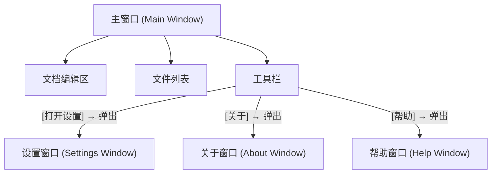
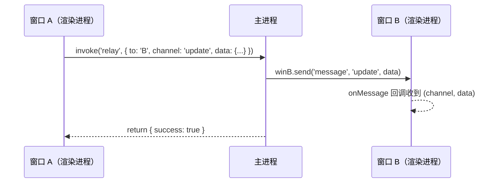
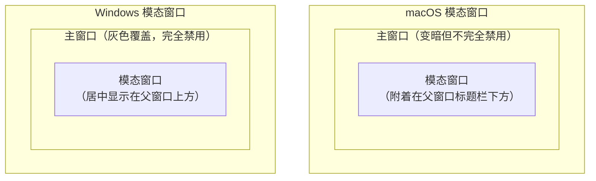

# 09 — 多窗口管理与窗口间通信

> 对应大纲：应用层 | 预计时间：1 天
> 面试可答：Electron 的多窗口架构中，每个 BrowserWindow 对应独立的渲染进程。窗口间通信的推荐方案是通过主进程中转（A 窗口 → IPC → 主进程 → IPC → B 窗口）。模态窗口通过 `parent` 配置实现父子关系。窗口状态（位置、大小）通过 `electron-window-state` 持久化保存。`BrowserView` 已被废弃，推荐使用 `WebContentsView`（Electron 30+）来嵌入独立的 Web 内容区域。

---

## 1. 多窗口架构

### 1.1 典型的多窗口应用结构



### 1.2 窗口管理器模式

```typescript
// src/window-manager.ts
import { BrowserWindow, BrowserWindowConstructorOptions } from 'electron';
import path from 'node:path';

interface WindowConfig {
  id: string;
  options: BrowserWindowConstructorOptions;
  url: string;
}

class WindowManager {
  private windows: Map<string, BrowserWindow> = new Map();

  create(config: WindowConfig): BrowserWindow {
    if (this.windows.has(config.id)) {
      const existing = this.windows.get(config.id)!;
      existing.focus();
      return existing;
    }

    const win = new BrowserWindow(config.options);
    win.loadFile(config.url);

    win.on('closed', () => {
      this.windows.delete(config.id);
    });

    this.windows.set(config.id, win);
    return win;
  }

  get(id: string): BrowserWindow | undefined {
    const win = this.windows.get(id);
    if (win && !win.isDestroyed()) return win;
    this.windows.delete(id);
    return undefined;
  }

  getAll(): BrowserWindow[] {
    return Array.from(this.windows.values()).filter((w) => !w.isDestroyed());
  }

  closeAll(): void {
    this.windows.forEach((win) => {
      if (!win.isDestroyed()) win.close();
    });
  }

  sendTo(id: string, channel: string, ...args: unknown[]): void {
    const win = this.get(id);
    if (win) {
      win.webContents.send(channel, ...args);
    }
  }

  broadcast(channel: string, ...args: unknown[]): void {
    this.getAll().forEach((win) => {
      win.webContents.send(channel, ...args);
    });
  }
}

export const windowManager = new WindowManager();
```

### 1.3 使用窗口管理器

```typescript
// src/main.ts
import { windowManager } from './window-manager';

app.whenReady().then(() => {
  // 创建主窗口
  windowManager.create({
    id: 'main',
    options: {
      width: 1024,
      height: 768,
      webPreferences: {
        preload: path.join(__dirname, 'preload.js'),
        contextIsolation: true,
        sandbox: true,
      },
    },
    url: 'index.html',
  });

  // 创建设置窗口（需要时再创建）
  ipcMain.on('open-settings', () => {
    windowManager.create({
      id: 'settings',
      options: {
        width: 600,
        height: 400,
        parent: windowManager.get('main'),  // 设置父窗口
        modal: true,                         // 模态窗口
        webPreferences: {
          preload: path.join(__dirname, 'preload.js'),
          contextIsolation: true,
          sandbox: true,
        },
      },
      url: 'settings.html',
    });
  });
});
```

---

## 2. 窗口间通信

### 2.1 方案对比

| 方案 | 复杂度 | 适用场景 | 限制 |
|------|--------|---------|------|
| **主进程中转** | 低 | 通用场景（推荐） | 需要主进程参与 |
| **BroadcastChannel** | 低 | 同源页面间 | 需要同源 |
| **SharedWorker** | 高 | 复杂状态共享 | 兼容性差 |

### 2.2 方案一：主进程中转（推荐）

这是最常用、最可靠的方案：



> 注意：所有窗口间消息统一经 `'message'` 这一个 IPC channel 传输，业务 channel 名（如 `'update'`）作为第一个参数携带。这样 preload 只需注册一个 `onMessage` 监听器即可接收所有窗口间消息。

**主进程：中继处理器**

```typescript
// src/main.ts
ipcMain.handle('relay', (_event, payload: {
  to: string;
  channel: string;
  data: unknown;
}) => {
  const { to, channel, data } = payload;
  // 统一经 'message' channel 发送，业务 channel 名作为第一个参数
  // 与 preload 中 onMessage 监听的 channel 保持一致
  windowManager.sendTo(to, 'message', channel, data);
  return { success: true };
});

// 广播给所有窗口
ipcMain.handle('broadcast', (_event, channel: string, data: unknown) => {
  windowManager.broadcast('message', channel, data);
  return { success: true };
});
```

**preload：暴露中继方法**

```typescript
// src/preload.ts
contextBridge.exposeInMainWorld('electronAPI', {
  relay: (to: string, channel: string, data: unknown) =>
    ipcRenderer.invoke('relay', { to, channel, data }),
  broadcast: (channel: string, data: unknown) =>
    ipcRenderer.invoke('broadcast', channel, data),
  onMessage: (callback: (channel: string, data: unknown) => void) => {
    const handler = (_event: Electron.IpcRendererEvent, channel: string, data: unknown) => {
      callback(channel, data);
    };
    ipcRenderer.on('message', handler);
    return () => ipcRenderer.removeListener('message', handler);
  },
});
```

**渲染进程：发送消息**

```typescript
// 窗口 A：通知所有窗口主题变化
await window.electronAPI.broadcast('theme-changed', { theme: 'dark' });

// 窗口 A：只通知设置窗口
await window.electronAPI.relay('settings', 'config-updated', { fontSize: 16 });
```

### 2.3 方案二：BroadcastChannel（同源页面）

如果多个窗口加载的是同一个源的页面，可以使用浏览器原生的 `BroadcastChannel`：

```typescript
// 窗口 A
const bc = new BroadcastChannel('app-channel');
bc.postMessage({ type: 'theme-changed', theme: 'dark' });

// 窗口 B
const bc = new BroadcastChannel('app-channel');
bc.onmessage = (event) => {
  if (event.data.type === 'theme-changed') {
    applyTheme(event.data.theme);
  }
};
```

> **限制**：`BroadcastChannel` 要求页面同源（相同的 protocol + host + port）。加载本地文件时，所有窗口都是 `file://` 协议，可以通信。但如果一个窗口加载 `localhost:5173`，另一个加载 `localhost:3000`，它们不同源。

---

## 3. 模态窗口与父子窗口

### 3.1 模态窗口

模态窗口会阻塞父窗口的交互——父窗口变灰，用户必须先关闭模态窗口才能操作父窗口。

```typescript
const settingsWin = new BrowserWindow({
  width: 500,
  height: 400,
  parent: mainWindow,    // 设置父窗口
  modal: true,           // 启用模态
  show: false,           // 先隐藏
  resizable: false,
  webPreferences: {
    preload: path.join(__dirname, 'preload.js'),
    contextIsolation: true,
    sandbox: true,
  },
});

settingsWin.loadFile('settings.html');

settingsWin.once('ready-to-show', () => {
  settingsWin.show();
});
```

### 3.2 父子窗口（非模态）

非模态的父子窗口不会阻塞父窗口，但会保持层级关系——子窗口始终在父窗口上方。

```typescript
const helpWin = new BrowserWindow({
  width: 400,
  height: 300,
  parent: mainWindow,  // 设置父窗口
  modal: false,        // 非模态
  show: false,
  webPreferences: {
    preload: path.join(__dirname, 'preload.js'),
    contextIsolation: true,
    sandbox: true,
  },
});

helpWin.loadFile('help.html');
helpWin.once('ready-to-show', () => helpWin.show());
```

### 3.3 macOS vs Windows 的差异



| 特性 | macOS | Windows |
|------|-------|---------|
| 模态窗口位置 | 附着在父窗口标题栏下方 | 居中在父窗口上方 |
| 父窗口状态 | 变暗但仍可见 | 灰色覆盖，完全不可交互 |
| sheet 式模态 | `parent` + `modal: true` 时自动以 sheet 形式从标题栏滑出（可用 `setSheetOffset()` 调整滑出位置） | 不支持 sheet，居中显示 |

---

## 4. 窗口状态持久化

### 4.1 使用 electron-window-state

```bash
npm install electron-window-state
```

```typescript
import windowStateKeeper from 'electron-window-state';

function createMainWindow() {
  // 恢复上次的窗口状态
  const mainWindowState = windowStateKeeper({
    defaultWidth: 1024,
    defaultHeight: 768,
  });

  const win = new BrowserWindow({
    x: mainWindowState.x,
    y: mainWindowState.y,
    width: mainWindowState.width,
    height: mainWindowState.height,
    webPreferences: {
      preload: path.join(__dirname, 'preload.js'),
      contextIsolation: true,
      sandbox: true,
    },
  });

  // 自动管理窗口状态（保存位置和大小）
  mainWindowState.manage(win);

  win.loadFile('index.html');

  return win;
}
```

### 4.2 手动实现窗口状态持久化

如果不想引入第三方库，可以手动实现：

```typescript
import Store from 'electron-store';

interface WindowState {
  x?: number;
  y?: number;
  width: number;
  height: number;
  isMaximized: boolean;
}

const store = new Store<{ windowState: WindowState }>({
  defaults: {
    windowState: {
      width: 1024,
      height: 768,
      isMaximized: false,
    },
  },
});

function createMainWindow() {
  const { x, y, width, height, isMaximized } = store.get('windowState');

  const win = new BrowserWindow({
    x,
    y,
    width,
    height,
    show: false,
    webPreferences: {
      preload: path.join(__dirname, 'preload.js'),
      contextIsolation: true,
      sandbox: true,
    },
  });

  if (isMaximized) {
    win.maximize();
  }

  win.once('ready-to-show', () => win.show());

  // 保存窗口状态
  const saveState = () => {
    if (win.isDestroyed()) return;

    // 最大化时保存非最大化的 bounds
    if (!win.isMaximized()) {
      const bounds = win.getBounds();
      store.set('windowState', {
        x: bounds.x,
        y: bounds.y,
        width: bounds.width,
        height: bounds.height,
        isMaximized: false,
      });
    } else {
      store.set('windowState.isMaximized', true);
    }
  };

  win.on('resize', saveState);
  win.on('move', saveState);
  win.on('close', saveState);

  return win;
}
```

---

## 5. BrowserView vs WebContentsView

### 5.1 BrowserView（已废弃）

`BrowserView` 在 Electron 30+ 中已被标记为废弃（deprecated）。

```typescript
// ❌ 已废弃
import { BrowserView } from 'electron';
const view = new BrowserView();
win.setBrowserView(view);
view.setBounds({ x: 0, y: 100, width: 800, height: 600 });
view.webContents.loadURL('https://example.com');
```

### 5.2 WebContentsView（推荐）

`WebContentsView` 是 `BrowserView` 的替代品，API 更清晰，和 `BaseWindow` 配合使用：

```typescript
import { BaseWindow, WebContentsView } from 'electron';

const win = new BaseWindow({ width: 1024, height: 768 });

// 创建侧边栏
const sidebar = new WebContentsView();
win.contentView.addChildView(sidebar);
sidebar.setBounds({ x: 0, y: 0, width: 250, height: 768 });
sidebar.webContents.loadFile('sidebar.html');

// 创建主内容区
const mainContent = new WebContentsView();
win.contentView.addChildView(mainContent);
mainContent.setBounds({ x: 250, y: 0, width: 774, height: 768 });
mainContent.webContents.loadFile('main.html');

// 窗口大小变化时重新布局
win.on('resize', () => {
  const [width, height] = win.getContentSize();
  sidebar.setBounds({ x: 0, y: 0, width: 250, height });
  mainContent.setBounds({ x: 250, y: 0, width: width - 250, height });
});
```

### 5.3 对比

| 特性 | BrowserView | WebContentsView |
|------|-------------|-----------------|
| 状态 | 已废弃（Electron 30+） | 推荐使用 |
| 父容器 | `BrowserWindow.setBrowserView()` | `BaseWindow.contentView.addChildView()` |
| 多视图 | 支持（但 API 不直观） | 原生支持，层级管理清晰 |
| 布局 | `setBounds()` | `setBounds()` |
| 适用场景 | 嵌入独立 Web 内容 | 多面板布局、嵌入 Web 内容 |

---

## 6. 实战：主窗口 + 设置窗口 + 关于窗口

### 6.1 完整的多窗口实现

```typescript
// src/main.ts
import { app, BrowserWindow, ipcMain } from 'electron';
import path from 'node:path';

let mainWindow: BrowserWindow | null = null;
let settingsWindow: BrowserWindow | null = null;
let aboutWindow: BrowserWindow | null = null;

function createMainWindow() {
  mainWindow = new BrowserWindow({
    width: 1024,
    height: 768,
    show: false,
    webPreferences: {
      preload: path.join(__dirname, 'preload.js'),
      contextIsolation: true,
      sandbox: true,
    },
  });

  mainWindow.loadFile('index.html');
  mainWindow.once('ready-to-show', () => mainWindow!.show());

  mainWindow.on('closed', () => {
    mainWindow = null;
  });

  return mainWindow;
}

function createSettingsWindow() {
  if (settingsWindow) {
    settingsWindow.focus();
    return settingsWindow;
  }

  settingsWindow = new BrowserWindow({
    width: 500,
    height: 400,
    parent: mainWindow ?? undefined,
    modal: true,
    show: false,
    resizable: false,
    webPreferences: {
      preload: path.join(__dirname, 'preload.js'),
      contextIsolation: true,
      sandbox: true,
    },
  });

  settingsWindow.loadFile('settings.html');
  settingsWindow.once('ready-to-show', () => settingsWindow!.show());
  settingsWindow.on('closed', () => {
    settingsWindow = null;
  });

  return settingsWindow;
}

function createAboutWindow() {
  if (aboutWindow) {
    aboutWindow.focus();
    return aboutWindow;
  }

  aboutWindow = new BrowserWindow({
    width: 350,
    height: 250,
    parent: mainWindow ?? undefined,
    modal: false,
    show: false,
    resizable: false,
    minimizable: false,
    maximizable: false,
    webPreferences: {
      preload: path.join(__dirname, 'preload.js'),
      contextIsolation: true,
      sandbox: true,
    },
  });

  aboutWindow.loadFile('about.html');
  aboutWindow.once('ready-to-show', () => aboutWindow!.show());
  aboutWindow.on('closed', () => {
    aboutWindow = null;
  });

  return aboutWindow;
}

// IPC：从渲染进程打开窗口
ipcMain.on('open-settings', createSettingsWindow);
ipcMain.on('open-about', createAboutWindow);

// macOS：关闭所有窗口不退出
app.on('window-all-closed', () => {
  if (process.platform !== 'darwin') app.quit();
});

// macOS：点击 Dock 图标重新创建主窗口
app.on('activate', () => {
  if (BrowserWindow.getAllWindows().length === 0) {
    createMainWindow();
  }
});

app.whenReady().then(createMainWindow);
```

---

## ✏️ 练习

### 练习 1：实现窗口管理器

**要求**：
1. 实现一个 `WindowManager` 类，管理多个窗口的创建、获取、关闭
2. 支持 `sendTo(id, channel, data)` 向特定窗口发消息
3. 支持 `broadcast(channel, data)` 向所有窗口广播消息

**验收标准**：创建 3 个窗口，能通过管理器向任意窗口发送消息。

### 练习 2：实现主窗口 + 设置窗口

**要求**：
1. 主窗口包含一个"打开设置"按钮
2. 点击后弹出模态设置窗口
3. 设置窗口修改主题后，通知主窗口切换

**验收标准**：设置窗口切换深色主题 → 关闭设置窗口 → 主窗口已切换为深色主题。

### 练习 3：窗口状态持久化

**要求**：
1. 使用 `electron-window-state` 或手动实现
2. 保存窗口的位置、大小、是否最大化
3. 下次启动恢复到上次状态

**验收标准**：调整窗口 → 关闭重开 → 窗口恢复到上次的位置和大小。

### 练习 4：BroadcastChannel 通信

**要求**：
1. 创建两个同源窗口
2. 使用 `BroadcastChannel` 实现窗口间消息传递
3. 在一个窗口输入文字，另一个窗口实时显示

**验收标准**：窗口 A 输入 "hello"，窗口 B 同步显示 "hello"。

---

## 📝 面试回答模板

> **问：Electron 的多窗口架构是怎样的？**
>
> 每个 `BrowserWindow` 对应一个独立的渲染进程，拥有独立的 JavaScript 上下文和 DOM。窗口间不能直接通信，需要通过主进程中转——窗口 A 通过 IPC 发消息给主进程，主进程再通过 `targetWindow.webContents.send()` 转发给窗口 B。我通常会封装一个 `WindowManager` 类来管理窗口的生命周期，支持按 ID 获取窗口、向特定窗口发消息、广播给所有窗口。窗口状态（位置、大小）通过 `electron-window-state` 持久化保存。

> **问：BrowserView 和 WebContentsView 有什么区别？**
>
> `BrowserView` 是早期的嵌入式视图方案，已被废弃。`WebContentsView` 是替代品，和 `BaseWindow` 配合使用。两者的核心功能相同——在窗口中嵌入独立的 Web 内容区域，可以有自己的 URL 和 JavaScript 上下文。`WebContentsView` 的 API 更清晰，通过 `addChildView` 管理层级关系，支持多个视图叠加。典型应用场景是多面板布局（如侧边栏 + 主内容区），每个面板可以加载不同的页面。

> **问：Electron 中如何实现窗口间的实时通信？**
>
> 最常用的方案是主进程中转——窗口 A 通过 IPC 发消息给主进程，主进程再转发给窗口 B。这个方案可靠、通用，支持跨源通信。如果多个窗口加载的是同源页面，也可以用浏览器原生的 `BroadcastChannel`，它不需要主进程参与，延迟更低。另外，如果只需要同步状态而不需要消息通信，可以在主进程中维护状态，各窗口通过 IPC 按需读取。
