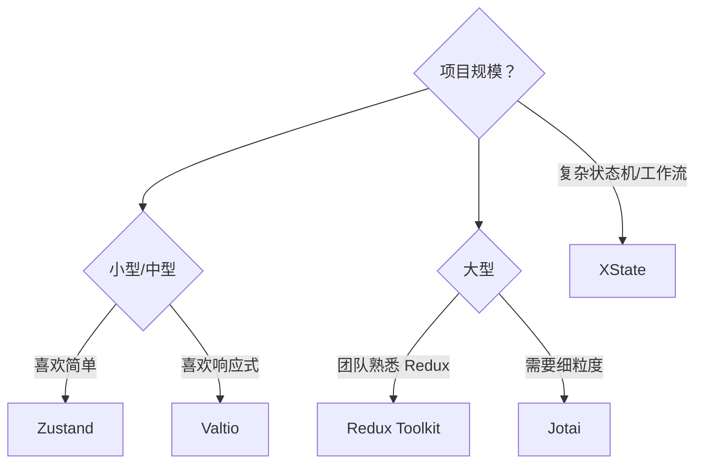
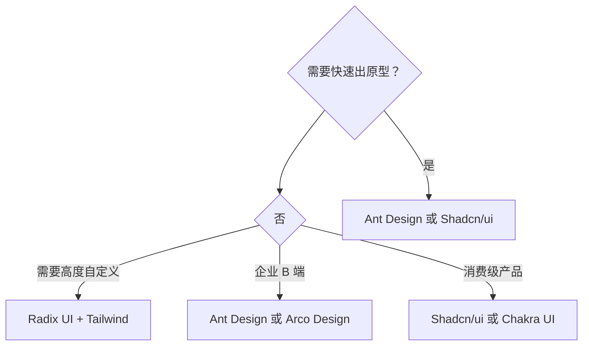
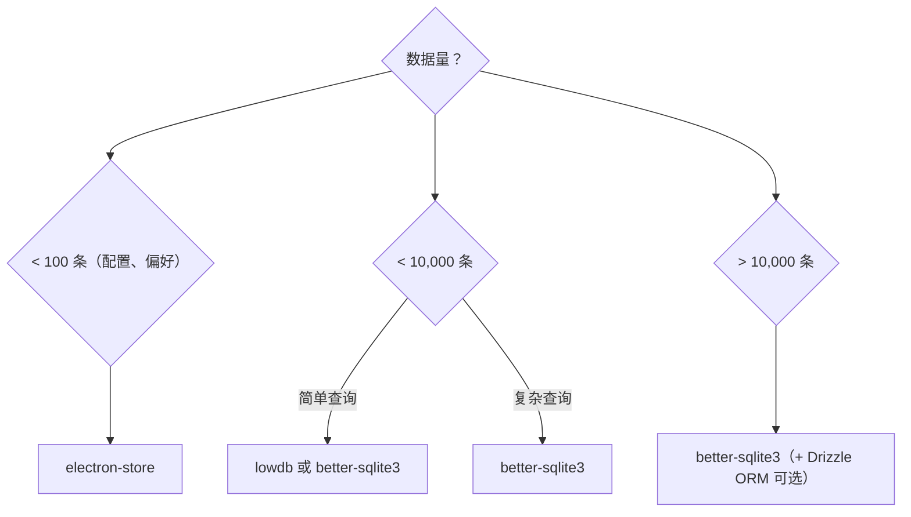
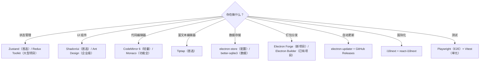

# 14 — 常用第三方库与生态精选

> 对应大纲：生态速查 | 预计时间：0.5 天（速查工具，按需阅读）

本篇是 Electron 生态的速查手册，按场景分类整理常用第三方库。不需要从头读到尾——根据你的需求直接跳到对应章节。

---

## 1. 状态管理

| 库 | Stars | 大小 | 特点 | 适用场景 |
|----|-------|------|------|---------|
| **Zustand** | 50k+ | ~1KB | 极简 API，无 Provider，支持中间件 | 中小型项目首选 |
| **Jotai** | 18k+ | ~2KB | 原子化状态，按需订阅 | 细粒度状态管理 |
| **Redux Toolkit** | 10k+ | ~11KB | 官方推荐的 Redux 封装 | 大型项目、团队协作 |
| **Valtio** | 10k+ | ~2KB | Proxy 响应式，写法最自然 | 喜欢直接修改对象的开发者 |
| **XState** | 28k+ | ~15KB | 状态机模型，适合复杂流程 | 复杂业务逻辑、工作流 |

**选型决策树**：



---

## 2. UI 框架

### 2.1 组件库

| 库 | Stars | 风格 | 特点 |
|----|-------|------|------|
| **Ant Design** | 93k+ | 企业级 | 组件最全，中文文档好，适合 B 端 |
| **Arco Design** | 3k+ | 企业级 | 字节出品，Ant Design 的替代方案 |
| **Radix UI** | 16k+ | 无样式 | 无样式的原语组件，完全自定义 |
| **Shadcn/ui** | 80k+ | Tailwind | 基于 Radix + Tailwind，复制粘贴式引入 |
| **Chakra UI** | 38k+ | 现代 | 开箱即用，主题系统好 |

### 2.2 CSS 方案

| 库 | Stars | 特点 |
|----|-------|------|
| **Tailwind CSS** | 85k+ | 原子化 CSS，开发效率高 |
| **CSS Modules** | 内置 | 局部作用域，零依赖 |
| **Styled Components** | 40k+ | CSS-in-JS，运行时 |
| **Vanilla Extract** | 9k+ | 零运行时 CSS-in-JS |

### 2.3 选型建议



---

## 3. 富文本 / 代码编辑器

| 库 | Stars | 类型 | 特点 |
|----|-------|------|------|
| **CodeMirror 6** | 10k+ | 代码编辑器 | 模块化、性能好、支持语言扩展 |
| **Monaco Editor** | 42k+ | 代码编辑器 | VS Code 同款，功能最强 |
| **Tiptap** | 28k+ | 富文本编辑器 | 基于 ProseMirror，扩展性极强 |
| **Plate** | 12k+ | 富文本编辑器 | 基于 Slate + React，开箱即用 |
| **Lexical** | 20k+ | 富文本编辑器 | Meta 出品，性能好 |

**选型建议**：

- 写代码编辑器（类 VS Code）→ **Monaco Editor**（功能全但体积大）或 **CodeMirror 6**（轻量可扩展）
- 写富文本编辑器（类 Notion）→ **Tiptap**（扩展性最好）或 **Plate**（React 生态最好）

---

## 4. 数据库

| 库 | Stars | 类型 | 特点 | 适用场景 |
|----|-------|------|------|---------|
| **better-sqlite3** | 5k+ | SQLite | 同步 API，性能极好 | 结构化数据、大量数据 |
| **electron-store** | 4k+ | JSON 文件 | 简单 KV 存储 | 配置、偏好设置 |
| **lowdb** | 22k+ | JSON 文件 | 轻量，支持 Lodash 查询 | 小项目、原型 |
| **Dexie** | 11k+ | IndexedDB | 浏览器端数据库，Promise API | 渲染进程本地存储 |
| **Drizzle ORM** | 28k+ | ORM | TypeScript 优先，支持 SQLite | 需要 ORM 的项目 |

**选型决策树**：



---

## 5. 打包工具

| 工具 | 维护方 | 特点 |
|------|--------|------|
| **Electron Forge** | Electron 官方 | Vite/Webpack 深度集成，插件生态 |
| **Electron Builder** | 社区 | 功能丰富，配置灵活，文档详尽 |

详见 [11 — 调试、构建与打包分发](file:///Volumes/jiangzhi-ssd/code/personal/kb-vault/src/front/cross-platform/electron/doc/11-调试、构建与打包分发.md)。

---

## 6. 自动更新

| 库 | 维护方 | 特点 |
|----|--------|------|
| **electron-updater** | Electron Builder | 功能最全，支持增量更新 |
| **update-electron-app** | Electron 官方 | 基于 electron-updater，配置更简单 |
| **electron-forge/publisher** | Electron Forge | Forge 内置的发布和更新方案 |

### 更新源对比

| 更新源 | 优点 | 缺点 |
|--------|------|------|
| GitHub Releases | 免费、简单 | 国内访问可能慢 |
| S3 / OSS | 全球 CDN、可控 | 需要付费 |
| 自建服务器 | 完全可控 | 需要维护服务器 |

---

## 7. 原生能力

| 库 | Stars | 用途 | 原生模块 |
|----|-------|------|:---:|
| **node-pty** | 4k+ | 伪终端（终端模拟器） | ✅ |
| **sharp** | 30k+ | 图片处理（缩放、裁剪、格式转换） | ✅ |
| **ffi-napi** | 3k+ | 调用 C/C++ 动态库（注意：维护频率低，新项目可评估 node-ffi-rs 等替代） | ✅ |
| **keytar** | 2k+ | 系统密钥链（安全存储密码）⚠️ 已于 2022-12 归档停止维护，新项目推荐 Electron 内置的 `safeStorage` 模块 | ✅ |
| **robotjs** | 3k+ | 键鼠模拟（自动化测试）⚠️ 长期无维护，与新版 Electron 兼容性差，JS/TS 场景现役推荐 nut.js | ✅ |
| **screenshot-desktop** | 500+ | 屏幕截图 | ❌ |
| **open** | 3k+ | 用默认应用打开文件/URL | ❌ |

---

## 8. 国际化（i18n）

| 库 | Stars | 特点 |
|----|-------|------|
| **i18next** | 8k+ | 最成熟的 i18n 框架，插件丰富 |
| **react-intl** | 14k+ | FormatJS 出品，ICU 消息格式 |
| **typesafe-i18n** | 2k+ | TypeScript 类型安全，轻量 |

**推荐方案**：`i18next` + `react-i18next` + `i18next-electron-fs-backend`（从文件系统加载语言包）。

```typescript
import i18n from 'i18next';
import { initReactI18next } from 'react-i18next';

i18n.use(initReactI18next).init({
  resources: {
    en: { translation: { welcome: 'Welcome' } },
    zh: { translation: { welcome: '欢迎' } },
  },
  lng: 'zh',
  fallbackLng: 'en',
});
```

---

## 9. 测试

| 库 | Stars | 用途 |
|----|-------|------|
| **Playwright** | 70k+ | E2E 测试（支持 Electron） |
| **Vitest** | 14k+ | 单元测试（Vite 生态） |
| **Jest** | 44k+ | 单元测试（通用） |
| **Spectron**（已废弃） | — | 原 Electron 测试工具，用 Playwright 替代 |

**Playwright 测试 Electron**：

```typescript
import { _electron as electron } from 'playwright';
import { test, expect } from '@playwright/test';

test('应用启动并显示标题', async () => {
  const app = await electron.launch({ args: ['.'] });
  const window = await app.firstWindow();
  await expect(window).toHaveTitle('My App');
  await app.close();
});
```

---

## 10. 选库总决策树



---

## ✏️ 练习

### 练习 1：搭建技术栈

**要求**：
1. 为你的 Electron 项目选择状态管理方案（推荐 Zustand）
2. 选择 UI 框架（推荐 Shadcn/ui 或 Ant Design）
3. 配置 i18n 国际化（至少支持中英文）

**验收标准**：项目中成功引入所选技术栈，可以正常运行。

### 练习 2：集成 Playwright 测试

**要求**：
1. 安装 Playwright
2. 编写一个 E2E 测试：启动应用 → 点击按钮 → 验证结果
3. 运行测试并确认通过

**验收标准**：`npx playwright test` 通过。

---

## 📝 面试回答模板

> **问：Electron 项目的技术栈怎么选？**
>
> 状态管理推荐 Zustand——极简 API、无 Provider 包裹、支持中间件，适合大多数项目。UI 框架推荐 Shadcn/ui（基于 Radix + Tailwind，按需引入组件源码）或 Ant Design（组件最全，适合企业级）。编辑器场景选 CodeMirror 6（代码）或 Tiptap（富文本）。数据存储用 electron-store（配置类）或 better-sqlite3（结构化数据）。打包选 Electron Forge（官方）或 Electron Builder（社区）。测试用 Playwright，原生支持 Electron 的 E2E 测试。

> **问：Electron 中如何做 E2E 测试？**
>
> 推荐 Playwright——它原生支持 Electron 应用的 E2E 测试。通过 `_electron.launch({ args: ['.'] })` 启动应用，获取 BrowserWindow 实例，然后用 Playwright 的标准 API 操作 UI 元素和断言。比已废弃的 Spectron 更稳定、API 更现代。可以结合 CI/CD 在 GitHub Actions 中运行，支持截图对比和视频录制。

> **问：Electron 中如何实现国际化？**
>
> 推荐 i18next + react-i18next 的组合。i18next 是最成熟的 i18n 框架，支持复数、插值、命名空间等特性。在 Electron 中，语言包可以打包在应用资源中，也可以放在 userData 目录下方便用户自定义翻译。通过 `app.getLocale()` 获取系统语言，自动选择对应的语言包。渲染进程中用 `useTranslation` hook 翻译 UI 文本，主进程中通过 IPC 获取当前语言设置。
