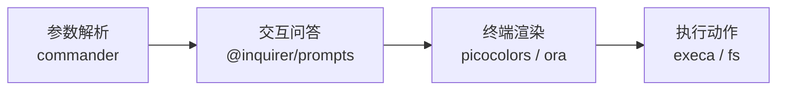

# CLI 库全景与选型

> 对应大纲模块 1 | 预计时间：0.5 天
> 面试可答：JS 写 CLI 分四层——参数解析、交互问答、终端渲染、执行动作，每层选对库就能拼出生产级工具。

---

## 学习目标

完成本篇后，你应该能够：

- 说出 CLI 工具的四层职责划分，并给每层报出主流库
- 在 commander / cac / yargs 之间不纠结地做选型，并说清理由
- 用 @inquirer/prompts 或 @clack/prompts 写出交互问答
- 判断"该用 ink 了"还是"inquirer 就够了"

---

## 核心概念

### 1. 心智模型：CLI 的四层职责



任何 CLI 工具都是这四层的组合：**解析参数 → 缺什么问什么 → 过程有反馈 → 干真活**。选库就是给每层挑人。

### 2. 第一层：参数解析

| 库 | 风格 | 选它当 |
| -- | ---- | ------ |
| **commander** | 面向对象，链式声明命令/选项 | 默认选择，使用最广、资料最多 |
| cac | 极简，一个 `cli` 实例链到底 | 小工具，嫌 commander 啰嗦 |
| yargs | 配置对象 + 中间件 | 老项目维护，新项目不推荐 |

三种写法干同一件事（`my-cli build --watch src`）：

```ts
// commander：声明式，自动生成 help
import { Command } from 'commander'

const program = new Command()
program
  .name('my-cli')
  .command('build [dir]')
  .option('-w, --watch')
  .action((dir, opts) => {
    console.log(dir, opts.watch)
  })
program.parse()
```

```ts
// cac：更短，vue-cli 系
import { cac } from 'cac'

const cli = cac('my-cli')
cli.command('build [dir]').option('-w, --watch').action((dir, opts) => {
  console.log(dir, opts.watch)
})
cli.parse()
```

```ts
// yargs：配置对象，功能全但 API 老
import yargs from 'yargs'

yargs(process.argv.slice(2)).command(
  'build [dir]',
  '构建',
  y => y.positional('dir').default('dir', '.').boolean('watch'),
  argv => console.log(argv.dir, argv.watch),
).parse()
```

> 💡 **判断依据不是功能，是维护预期**：三个库都够用，选团队最熟的。新项目闭眼 commander。

### 3. 第二层：交互问答

```ts
// @inquirer/prompts：按需导入，每个 prompt 是一个 await 函数
import { input, select, confirm, checkbox } from '@inquirer/prompts'

const name = await input({ message: '项目名？' })
const tpl = await select({
  message: '模板？',
  choices: [
    { value: 'react', name: 'React + Vite' },
    { value: 'vue', name: 'Vue + Vite' },
  ],
})
const ok = await confirm({ message: '开始生成？' })
const extras = await checkbox({
  message: '要哪些额外配置？',
  choices: [{ value: 'eslint' }, { value: 'docker' }],
})
```

```ts
// @clack/prompts：更新一代，自带 spin/log 任务组，create-astro 在用
import * as p from '@clack/prompts'

const name = await p.text({ message: '项目名？' })
const tpl = await p.select({ message: '模板？', options: [{ value: 'react', label: 'React + Vite' }] })
p.intro('开始生成')
p.outro('完成！')
```

选型：

- **@inquirer/prompts**：单问题细粒度控制（每个 prompt 独立函数），生态最成熟
- **@clack/prompts**：要"成套的漂亮输出"（intro/outro/task 流水线）时更省事
- 问答多、想一次问完再干活 → 两者都行；**输出有仪式感诉求 → @clack**

### 4. 第三层：终端渲染

```ts
import pc from 'picocolors'   // 颜色，比 chalk 小一个量级
import ora from 'ora'         // spinner

console.log(pc.green('✔ 成功'), pc.dim('（细节信息）'))

const spinner = ora('下载模板中...').start()
// ... 干活
spinner.succeed('模板就绪')   // 或 spinner.fail('失败')
```

进阶：多任务进度用 **listr2**（`new Listr([{ title, task }])`），能显示嵌套任务树和实时状态，发布工具类 CLI 常用。

### 5. 第四层：执行动作

```ts
import { execa } from 'execa'    // 子进程，Promise 化，安全转义
import { globby } from 'globby'  // 文件匹配

await execa('git', ['init'], { cwd: projectName })     // 数组传参，不要拼字符串
const files = await globby(['**/*.ts', '!node_modules'])
```

写一次性运维/发布脚本不想起项目 → **zx**（JS 版 bash）：

```ts
// script.mjs，直接 bun script.mjs
import { $ } from 'zx'
await $`pnpm build && git tag v1.0.0`
```

### 6. 终端 UI 框架：ink 的使用时机

ink 让你用 React 组件渲染终端界面，状态驱动、组件复用心智直接迁移：

```tsx
import React from 'react'
import { render, Text, Box } from 'ink'

const App = () => (
  <Box flexDirection="column">
    <Text color="green">✔ 构建完成</Text>
  </Box>
)
render(<App />)
```

**判断标准**：

| 界面形态 | 方案 |
| -------- | ---- |
| 问几个问题 → 执行 → 退出 | @inquirer/prompts（别用 ink，杀鸡用牛刀） |
| 持续交互界面（实时过滤列表、进度面板、聊天输入） | ink |
| 只需要 spinner + 分步日志 | ora / @clack |

---

## 常见踩坑点

- **CI 里交互问答挂死** → CI 没有 TTY，入口处 `process.env.CI` 判断，要求参数全显式传
- **用户取消（Esc / Ctrl+C）直接崩栈** → @inquirer/prompts 取消时抛 `AbortError`（而不是静默退出），不接住会打出丑陋的报错栈：

  ```ts
  try {
    const name = await input({ message: '项目名？' })
  } catch (err) {
    if (err instanceof Error && err.name === 'AbortError') {
      process.exit(0)   // 用户主动取消，安静退出
    }
    throw err
  }
  ```

- **颜色在管道里变成乱码字符** → picocolors 自动检测 TTY 并降级，别自己手动开关
- **`execa` 拼字符串执行** → `execa('sh', ['-c', cmd])` 有注入风险，数组传参才是默认正确姿势
- **Windows 路径炸了** → 永远 `path.join` / `path.resolve`，终端输出分隔符用 `path.sep`

---

## 面试高频问题

1. 为什么 CLI 工具链要分层选库，而不是一个大而全的框架？
2. ink 的原理是什么？为什么它可以用 React？
3. 如何让一个 CLI 在 CI 和交互终端两种环境下都表现正确？

## 面试回答模板

> **问：为什么 CLI 工具链要分层选库？**
> **答：** CLI 的四层职责（解析、交互、渲染、执行）各自独立演化，专精库更新快、包体小。大而全框架一旦某层不满足需求，替换成本远高于一开始分层组合。commander + @inquirer + picocolors + ora 就是四层各选最优的组合。

> **问：ink 的原理？**
> **答：** ink 把 React 的 reconciler 换成了自定义的终端渲染器——组件树 diff 的结果不是 DOM 操作，而是写入 stdout 的字符流（光标控制、清行重绘）。所以 hooks、组件复用全部可用，只是渲染目标从浏览器变成了终端。

---

## 练习

1. **选型题**：要写一个"批量给 50 个仓库改 CI 配置"的内部工具，从四层各选一个库并说明理由。
   - 提示：仓库列表从哪来（globby/接口）？要不要确认步骤（confirm）？50 个任务怎么展示进度（listr2/ora）？
2. **对比题**：把同一个 select 问答分别用 @inquirer/prompts 和 @clack/prompts 实现，对比代码量和输出观感。
3. **阅读题**：读 pnpm 或 turbo 源码里的命令注册部分，判断它们用了哪层哪个库。

**预期效果**：练习 1 能写出一段 5 句话的选型说明；练习 3 能认出真实项目里的分层结构。

---

## 本模块完成标准

- [ ] 能默写四层职责及各层默认选型
- [ ] 跑通第 2 篇的脚手架实战，理解每个库在四层中的位置
- [ ] 能向同事讲清"什么时候用 ink"
