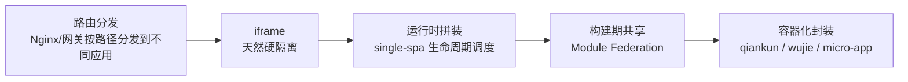
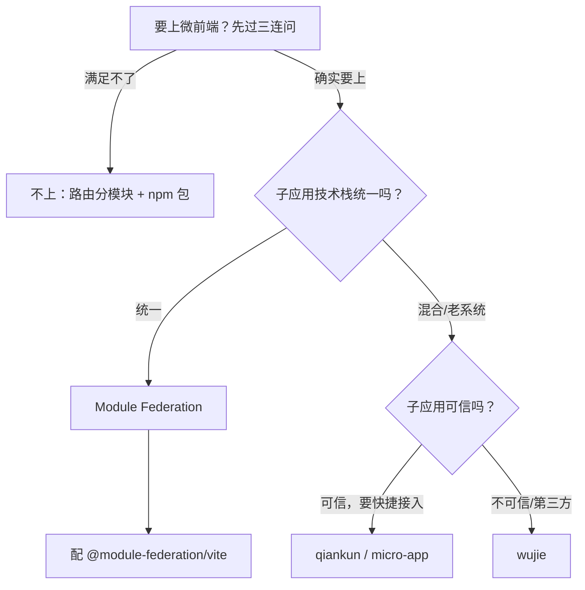

# 微前端全景与选型

> 对应大纲模块 1 | 预计时间：0.5 天
> 面试可答：微前端是"多团队独立交付"的组织问题的技术答案；技术栈统一能不用就不用。

---

## 学习目标

完成本篇后，你应该能够：

- 说清微前端解决的是什么问题（组织问题，不是技术问题）
- 按决策树在 Module Federation / qiankun / wujie / micro-app 里做选型
- 列出"不该上微前端"的信号，能在评审里劝住过度设计

---

## 核心概念

### 1. 微前端解决什么问题

把一个大前端应用拆成多个**独立开发、独立部署**的子应用，运行时拼在一个壳里。

它的本质是**组织扩展问题**：单应用发布频率被多团队互相阻塞、代码归属不清时，用运行时拆分换取团队自治。**技术统一的小团队用它，是负收益。**

**真实适用信号**（满足越多越值得上）：

- 多团队并行开发同一门户/工作台，发布互不阻塞
- 子应用技术栈不同（React 老系统 + Vue 新模块）或无法重构合并
- 需要灰度/按需加载"插件式"功能模块

**不建议上的信号**：

- 团队小、技术栈统一 → 路由分模块 + npm 包共享就够了
- 只是"想要架构先进" → 微前端的复杂度（样式冲突、沙箱逃逸、公共依赖版本地狱）常年超过收益

### 2. 实现原理谱系

- **路由分发**：最朴素，每个子应用独立域名/路径，壳只是个导航。隔离彻底、体验割裂（跳转白屏）
- **iframe**：硬隔离（JS/CSS/路由全隔离），但路由不同步、弹窗出不来、性能差。wujie 把它的隔离优势捡回来用了
- **single-spa**：约定子应用导出 `bootstrap/mount/unmount` 生命周期，由调度器按路由挂载卸载。只管调度不管隔离
- **Module Federation**：构建期声明"我导出什么/我要什么"，运行时按需加载远程模块并共享依赖。粒度最细（模块级而非应用级）
- **qiankun / wujie / micro-app**：在 single-spa 或 Web Component 之上补齐沙箱、样式隔离、HTML 入口解析，开箱即用

### 3. 四方案对比

| 方案 | 原理 | 隔离能力 | 上手成本 | 适用 |
| ---- | ---- | ------- | ------- | ---- |
| **Module Federation** | 构建期声明"导出/导入"模块，运行时按需加载共享 | 弱（共享运行时，无沙箱） | 中 | 技术栈统一、追求性能与依赖共享 |
| **qiankun** | 基于 single-spa，HTML 入口 + Proxy 沙箱 | 强（JS 沙箱 + 样式隔离） | 低 | React/Vue 混合、老系统接入 |
| **wujie** | iframe（JS 隔离）+ Web Component（渲染） | 最强（iframe 级 JS 隔离） | 低 | 强隔离诉求（第三方/不可信子应用） |
| **micro-app** | Web Component 封装 | 较强 | 低 | 像"用组件一样用子应用" |

> 💡 2026 视角：**技术栈统一的新项目优先 Module Federation**（`@module-federation/vite` 官方插件，MF 2.0；Rolldown 已把 MF 列为原生能力方向）；**存量多栈系统选 qiankun 或 wujie**——注意 qiankun npm 上的 2.x 已多年停滞，3.0 处于 RC 阶段，选型前确认实际维护状态。一次只选一个，别混。

### 4. 选型决策树

三连问：**独立部署是刚需吗？多团队归属冲突是现实吗？子应用无法重构合并吗？** 三个都答"是"再往下走。

### 5. 四大核心问题（所有方案都要面对）

| 问题 | 对策 |
| ---- | ---- |
| **样式冲突** | 子应用样式加前缀/命名空间（postcss-prefix）、CSS Modules；qiankun 开 `strictStyleIsolation`（Shadow DOM，代价大需评估） |
| **JS 全局污染** | qiankun/wujie 沙箱自动处理；MF 方案靠约定（不用 window 存状态） |
| **公共依赖重复** | MF 用 `shared` 声明单例；qiankun 场景尽量 externals + CDN 共享 |
| **应用间通信** | 首选 URL 参数；qiankun 用 `initGlobalState`（共享事件总线）；避免大对象频繁同步 |
| **路由** | 主应用管"前缀分发"，子应用管自己前缀内的路由；history 模式注意各应用 base 配置 |

---

## 常见踩坑点

- **选型先看"人"再看技术**：团队没有专人维护基座，选再好的方案也会腐化；MF 需要构建配置纪律，qiankun/wujie 需要子应用改造配合
- **Shadow DOM（strictStyleIsolation）直接开** → 组件库事件委托（绑在 document 上）会失效，先小范围验证再全量
- **微前端上了就回不去** → 拆出去的子应用共享依赖一旦分叉，重新合并的成本极高；上线前想好退出策略

---

## 面试高频问题

1. 微前端和 iframe 的取舍？wujie 为什么"既用 iframe 又解决 iframe 的缺点"？
2. qiankun 的 JS 沙箱是怎么实现的？
3. Module Federation 和运行时拼装方案的粒度差异？

## 面试回答模板

> **问：微前端和 iframe 的取舍？**
> **答：** iframe 隔离最彻底（JS/CSS/路由/存储全隔离），但路由不同步、弹窗困在 iframe 内、每次进子应用都是完整加载。所以"强隔离、低交互"场景（第三方嵌入）用 iframe；"需要融合体验"的场景用 qiankun/wujie/MF 这类运行时拼装方案。wujie 的思路是杂交：用 iframe 隔离 JS（跑在 iframe 的 window 里），但渲染时把 DOM 搬到主应用容器（Web Component 包裹），隔离和体验各拿一半。

> **问：qiankun 的 JS 沙箱原理？**
> **答：** Proxy 沙箱——给每个子应用 `new Proxy(fakeWindow)` 作为其 window，子应用对全局的读写都落在 fakeWindow 上，卸载时整个 fakeWindow 丢弃，天然不污染主应用。不支持 Proxy 的老浏览器降级为快照沙箱（激活时拍 window 快照、卸载时还原 diff）。配合 `with(fakeWindow)` 包裹执行子应用代码实现作用域劫持。

---

## 练习

1. **决策演练**：假设你们公司有 1 个 React 主站 + 1 个三年前的 Vue 后台 + 新收购团队的 Angular 应用，要合并成一个运营门户。用决策树走一遍，给出选型和理由。
2. **劝退演练**：同事提议"我们 5 人团队的新项目用微前端，方便以后扩展"，写出 3 条反驳理由。
3. **阅读题**：读 wujie 的 README 架构图，说出它和 qiankun 在"JS 跑在哪"上的本质区别。

**预期效果**：练习 1 输出一段 100 字的选型结论；练习 3 能说出 "iframe window vs Proxy fakeWindow"。

---

## 本模块完成标准

- [ ] 能默写四方案对比表与决策树
- [ ] 能在评审中给出"上/不上"的判断和三条理由
- [ ] 完成练习 3 的原理对比
