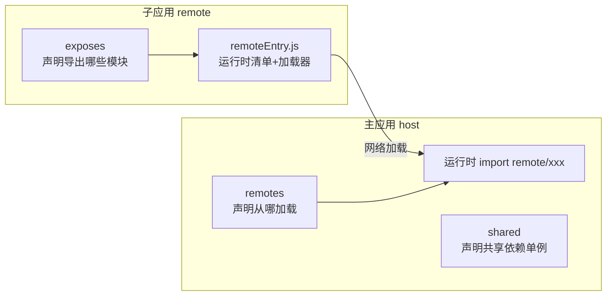

# Module Federation 实战

> 对应大纲模块 2 | 预计时间：1 天
> 面试可答：MF 在构建期声明"导出/导入/共享"，运行时按需加载远程模块；`shared` 单例是防依赖双份的关键。
> 前置阅读：[01-微前端全景与选型](01-微前端全景与选型.md)

---

## 学习目标

完成本篇后，你应该能够：

- 用 `@module-federation/vite` 搭出"主应用加载远程组件"的最小可运行双应用
- 说清 `remoteEntry.js`、`exposes`、`remotes`、`shared` 四个概念的关系
- 处理共享依赖版本不一致、类型提示缺失两大高频问题

---

## 核心概念

### 1. 心智模型

MF 的角色是**模块级的 import/export**，跨越了应用边界：



- **exposes**（子应用）：把哪些模块暴露出去
- **remotes**（主应用）：远程应用的 remoteEntry 地址
- **remoteEntry.js**：子应用构建产物里的"清单 + 加载器"，主应用靠它按需拉取模块
- **shared**：双方共享的依赖（react 等），运行时协商用一份，避免双份 bundle

### 2. 最小接入（两个 Vite 应用）

```bash
bun add @module-federation/vite   # 主/子应用都装
```

```ts
// 子应用（提供方）vite.config.ts
import { defineConfig } from 'vite'
import react from '@vitejs/plugin-react'
import { federation } from '@module-federation/vite'

export default defineConfig({
  plugins: [
    react(),
    federation({
      name: 'remote',
      filename: 'remoteEntry.js',
      exposes: {
        './Button': './src/components/Button.tsx',
      },
      shared: { react: { singleton: true }, 'react-dom': { singleton: true } },
    }),
  ],
})
```

```ts
// 主应用（消费方）vite.config.ts
federation({
  name: 'host',
  remotes: {
    // 格式："本地引用名@remoteEntry 地址"——@ 前须与子应用 name 一致
    // 也可用对象形式：{ name: 'remote', entry: 'https://...', type: 'module' }
    remote: 'remote@https://remote.example.com/assets/remoteEntry.js',
    // 本地联调可以直接指向子应用 dev server：
    // remote: 'remote@http://localhost:5174/assets/remoteEntry.js',
  },
  shared: { react: { singleton: true }, 'react-dom': { singleton: true } },
})
```

```tsx
// 主应用里像 import 本地模块一样用（配 lazy + Suspense）
const RemoteButton = React.lazy(() => import('remote/Button'))

<Suspense fallback="加载中...">
  <RemoteButton />
</Suspense>
```

> ⚠️ 修改 federation 配置后**必须重启 dev server**（和 env 文件同级别的重启要求）。

### 3. shared 规则速查

```ts
shared: {
  react: {
    singleton: true,        // 全局只允许一份实例（React 双份会直接炸 hooks）
    requiredVersion: '^19', // 版本不符给警告/报错
    // strictVersion: true,  // 严格模式：不符直接 throw，按需开
  },
}
```

| 配置 | 效果 | 建议 |
| ---- | ---- | ---- |
| `singleton: true` | 运行时只留一份，谁都别带私货 | react/状态库必开 |
| `requiredVersion` | 声明可接受的版本范围 | 和主应用锁同大版本 |
| 不配置 shared | 每个应用带自己的依赖 | 体积翻倍，仅用于彻底无关的库 |

### 4. 两大高频问题

**① 版本不一致白屏**

- 现象：主子应用 react 大版本不同，运行时 hooks 报错或白屏
- 处理：`singleton: true` + 双方 `requiredVersion` 锁同大版本；CI 里加依赖版本一致性检查（读双方 lockfile 比对）

**② 主应用没有类型提示**

远程模块默认是运行时加载，TS 不知道 `remote/Button` 长什么样。MF 2.0 的 dts 能力：子应用构建时产出类型声明，主应用消费：

```ts
// 子应用 vite.config.ts —— 构建时生成类型产物
federation({
  // ...其余配置
  dts: { generateTypes: true },
})
```

```jsonc
// 主应用 tsconfig.json —— compilerOptions.paths 指向类型产物目录
{
  "compilerOptions": {
    "paths": {
      "remote/*": ["./@mf-types/remote/*"]
    }
  }
}
```

```ts
// 主应用 vite.config.ts —— 消费远端类型
federation({
  // ...其余配置
  dts: { consumeTypes: true },
})
```

> 参考：[Module Federation 官方文档 - Vite 集成](https://module-federation.io/practice/vue-vite.html)（以官方最新配置为准）。

### 5. 什么时候别用 MF

- 需要 JS 沙箱（子应用不可信）→ MF 是共享运行时，没有隔离能力 → 换 wujie/qiankun
- 子应用要支持 SSR → MF 的 SSR 支持复杂度高，先评估必要性
- 只是想复用几个组件 → 发 npm 包更简单，MF 是给"独立部署"诉求用的

---

## 常见踩坑点

- **改了 exposes/remotes 不生效** → federation 配置不走 Vite 热重载，手动重启 dev server
- **remoteEntry 404** → `filename` 的路径相对子应用 `base`；确认主应用 remotes 地址能直接在浏览器打开
- **动态导入变量拼接失败** → `import(\`remote/${name}\`)` 不行，remotes 键必须是字面量；需要动态性就在映射函数里 switch
- **主应用 build 报循环依赖** → 主子共享了会相互 import 的模块；shared 只放真正的"底层"依赖（react、日期库），别把业务模块放进去
- **子应用独立打开白屏** → exposes 只产出模块，不产出页面；子应用要保留自己的应用入口（独立可跑是排障生命线）

---

## 面试高频问题

1. Module Federation 的加载时序？remoteEntry 里有什么？
2. shared 的 singleton 是怎么做到"运行时只留一份"的？
3. MF 方案如何做样式与 JS 隔离？做不了时怎么办？

## 面试回答模板

> **问：MF 的加载时序？**
> **答：** 主应用执行 `import('remote/Button')` → 先请求 remotes 配置里的 remoteEntry.js（它包含容器初始化逻辑和 exposes 模块清单）→ 运行时初始化容器、协商 shared 依赖版本（谁已加载且版本兼容就用谁的）→ 按 manifest 拉取 Button 模块对应 chunk → 返回模块给消费方。全程按需，不用的 exposes 模块不会下载。

> **问：singleton 怎么工作？**
> **答：** 运行时维护一个共享作用域（share scope）。子应用的 remoteEntry 加载时，把自己的 shared 依赖注册进去；消费方解析 import 时先查 share scope——主应用已提供兼容版本的 react，就直接复用那份实例，子应用 bundle 里的 react 副本不初始化。所以"谁先加载用谁的"，版本协商失败才加载自己的备份。

---

## 练习

1. **跑通双应用**：本地起两个 Vite 应用（host 5173 / remote 5174），完成远程 Button 加载，然后故意把子应用 react 降到 18 观察报错，再修复。
2. **动态模块表**：主应用加载 `remote/Button` 和 `remote/Card` 两个模块，用对象映射 + `React.lazy` 实现按配置文件决定加载哪个。
3. **体积对比**：分别用"shared 配置"和"不配 shared"构建，对比产物体积差异，记录数据。

**预期效果**：练习 1 完成"炸 → 修"闭环，理解 singleton 的意义；练习 3 有一组真实的体积对比数字。

---

## 本模块完成标准

- [ ] 双应用联调跑通，能说出 remoteEntry 的作用
- [ ] 能解释 shared 协商机制（面试模板第一条不看答案复述）
- [ ] 知道 MF 的三个边界：无沙箱、SSR 复杂、纯复用场景别用
