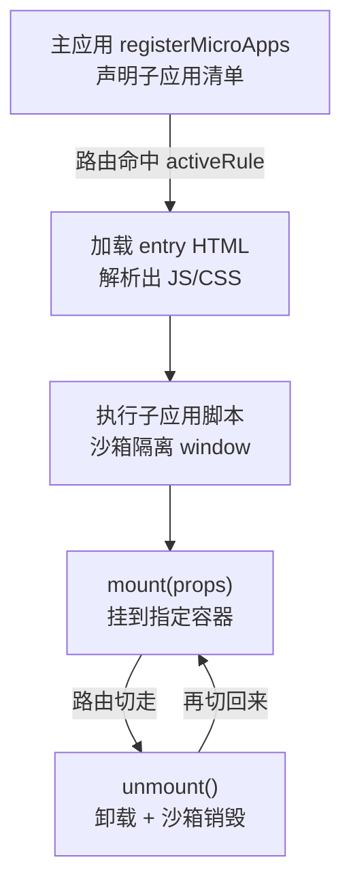

# qiankun 实战

> 对应大纲模块 3 | 预计时间：1 天
> 面试可答：qiankun = single-spa 调度 + HTML 入口解析 + Proxy 沙箱；子应用导出三个生命周期是接入的全部成本。
> 前置阅读：[01-微前端全景与选型](01-微前端全景与选型.md)
> ⚠️ 选型提醒：npm 上的 qiankun 2.x 已多年停滞，3.0 处于 RC 阶段——生产采用前确认最新维护状态，本篇以 2.x 稳定 API 为准。官方文档：[qiankun.umijs.org](https://qiankun.umijs.org/zh/)

---

## 学习目标

完成本篇后，你应该能够：

- 完成主应用注册 + 子应用改造的最小可运行接入
- 说清 Proxy 沙箱与快照沙箱的原理和适用条件
- 用 `initGlobalState` 做跨应用通信，用样式方案避免互相污染

---

## 核心概念

### 1. 心智模型



qiankun 接管的四件事：**按路由加载子应用 → 隔离 JS（沙箱）→ 处理样式 → 管理挂载/卸载生命周期**。子应用只需要导出三个生命周期函数。

### 2. 主应用接入（完整代码）

```bash
bun add qiankun
```

```ts
// src/micro/index.ts
import { registerMicroApps, start, initGlobalState } from 'qiankun'

// ① 注册子应用清单（也可用 loadMicroApp 手动加载）
registerMicroApps(
  [
    {
      name: 'vue-app',
      entry: '//localhost:7101',        // 子应用地址（HTML 入口）
      container: '#subapp-container',   // 主应用里的挂载容器
      activeRule: '/vue-app',           // 路由前缀命中即激活
      props: { token: 'xxx' },          // 下发给子应用的数据
    },
  ],
  {
    // ② 生命周期钩子（可选）：加载前/挂载后/卸载后的统一处理
    beforeLoad: app => console.log('before load', app.name),
  },
)

// ③ 启动
start({
  sandbox: true,          // JS 沙箱（默认开）
  prefetch: true,         // 空闲时预加载其他子应用资源
})

// ④ 全局状态（可选）：主应用可写，子应用可订阅
export const { onGlobalStateChange, setGlobalState } = initGlobalState({
  user: null,
})
```

```tsx
// 主应用组件：容器 + 登录态下发
export const MicroLayout = () => (
  <div>
    <header>主应用导航</header>
    {/* 子应用会挂载到这个容器 */}
    <div id="subapp-container" />
  </div>
)
```

### 3. 子应用改造（React 为例）

子应用的全部改造成本 = **导出三个生命周期 + 独立运行兜底**：

```tsx
// src/main.tsx
import { createRoot } from 'react-dom/client'
import App from './App'

let root: ReturnType<typeof createRoot> | null = null

// ① qiankun 要求的三个生命周期
export async function bootstrap() {}

export async function mount(props: { container?: HTMLElement }) {
  const container = props.container?.querySelector('#root') ?? document.querySelector('#root')!
  root = createRoot(container)
  root.render(<App />)
}

export async function unmount() {
  root?.unmount()
  root = null
}

// ② 独立运行兜底：不走 qiankun 时自己挂载（本地开发 & 排障生命线）
if (!window.__POWERED_BY_QIANKUN__) {
  createRoot(document.querySelector('#root')!).render(<App />)
}
```

```ts
// ③ webpack/vite 的 publicPath 改造：qiankun 环境下资源前缀对齐主应用
// Vite 子应用 vite.config.ts
export default defineConfig({
  base: '/vue-app/',   // 与主应用 activeRule 一致
  server: {
    origin: 'http://localhost:7101',   // Vite 要求完整 origin（含协议），构建产物资源引用带完整来源
  },
})
```

> ⚠️ **Vite 子应用兼容警示（最著名的坑）**：qiankun 2.x 沙箱用 `fetch` 拿到子应用 JS **文本**再 `eval` 执行，而 Vite dev 模式给的是原生 `<script type="module">`（ESM import 语句在 eval 环境无法解析）——**dev 模式直接照抄必挂**。可选路径：
>
> 1. dev 阶段接 [`vite-plugin-qiankun`](https://github.com/tengmaoqing/vite-plugin-qiankun)（改写产出让 dev 模式可被沙箱执行）
> 2. 生产构建用 lib/UMD 格式（`build.lib` + `build.rollupOptions.output.format: 'umd'`）
> 3. 或者干脆接受 qiankun + Vite 的别扭，Vite 子应用换 wujie/micro-app（原生支持 ESM）

Vue 子应用同理：`export async function mount(props) { app.mount(props.container.querySelector('#app')) }` + `unmount` 里 `app.unmount()`。

### 4. JS 沙箱原理

| 沙箱 | 实现 | 适用 |
| ---- | ---- | ---- |
| **Proxy 沙箱**（默认） | 每个子应用一个 `new Proxy(fakeWindow)`，全局读写落在 fakeWindow 上，卸载即销毁 | 现代浏览器，多实例 |
| **快照沙箱**（降级） | 激活时拍 window 快照，卸载时 diff 还原 | 不支持 Proxy 的老浏览器（IE） |

> 关键点：子应用代码里 `window.xxx = ...` 写的是 fakeWindow，主应用真 window 不受影响。**但沙箱拦不住的事件**：`document` 上的操作（qiankun 会劫持部分 DOM API）、`localStorage`（同源共享，需要 key 加应用前缀约定）、定时器/请求未清理。

### 5. 样式隔离

| 方案 | 配置 | 代价 |
| ---- | ---- | ---- |
| 约定前缀 | 子应用所有样式包一层 `.vue-app`（postcss-prefix 插件自动化） | 改造成本低，**推荐** |
| strictStyleIsolation | `start({ strictStyleIsolation: true })` → Shadow DOM | 弹窗挂 body 后样式全丢、组件库事件委托失效 |
| experimentalStyleIsolation | 运行时给选择器加作用域后缀 | 动态创建的 `<style>` 可能漏处理 |

### 6. 应用间通信

```ts
// 主应用：初始化共享状态
const actions = initGlobalState({ user: null })
actions.setGlobalState({ user: { name: 'belos' } })
```

```ts
// 子应用：监听 + 修改
export async function mount(props) {
  props.onGlobalStateChange((state) => {
    console.log('全局状态变了', state)
  })
  // 子应用只能修改主应用初始化 state 中已存在的一级属性（浅检查），
  // 新增一级属性无效且会有 warn；主应用则可以自由增改
  props.setGlobalState({ user: { name: 'new' } })
}
```

> 💡 优先级排序：**URL 参数 > initGlobalState > 自定义事件总线**。URL 能传的就别上状态共享——通信越多，耦合越重。

---

## 常见踩坑点

- **子应用资源 404** → entry 是 HTML 抓取，相对路径资源会解析到主应用域名下；配好子应用 `base` + `origin`（webpack 用 publicPath 动态注入）
- **切换路由后子应用挂了再回来白屏** → `unmount` 没正确销毁实例（React `root.unmount()`、Vue `app.unmount()`），或全局事件/定时器没清理
- **`window.__POWERED_BY_QIANKUN__` 类型报错** → 在 `env.d.ts` 里补全局声明 `interface Window { __POWERED_BY_QIANKUN__?: boolean }`
- **弹窗/Modal 样式丢失或事件失效** → 开了 Shadow DOM；改用约定前缀方案 + 弹窗容器仍在子应用树内
- **多子应用同时激活** → `activeRule` 用了相同前缀或没有 `exact` 语义；检查路由匹配顺序

---

## 面试高频问题

1. qiankun 如何加载子应用？为什么要用 HTML 入口而不是 JS 入口？
2. Proxy 沙箱的边界在哪？哪些全局操作拦不住？
3. qiankun 和 iframe 的隔离粒度差异？

## 面试回答模板

> **问：为什么要用 HTML 入口？**
> **答：** JS 入口要求子应用构建产物格式强约定（UMD），且主应用要拼脚本顺序；HTML 入口把子应用当"一个页面"抓下来，qiankun 解析 HTML 拿到资源清单后 fetch 执行——子应用保持标准 SPA 构建产物，接入成本降到"导出三个生命周期"。代价是运行时解析 HTML 的开销和多一次请求。

> **问：沙箱拦不住什么？**
> **答：** 三类：① `document` 级操作（qiankun 劫持了部分如 `document.createElement`，但事件监听泄漏仍要子应用自觉清理）；② 同源共享的存储（localStorage/Cookie，需约定前缀）；③ 未清理的定时器、事件监听、进行中的请求——沙箱只隔离"引用"，不回收"副作用"。所以 unmount 里的清理逻辑是子应用的硬义务。

---

## 练习

1. **最小接入**：主应用（React）+ 子应用（React 或 Vue）按本篇代码跑通路由切换，验证：切走再切回、直接刷新子应用路由、独立打开子应用三条路径都正常。
2. **通信演练**：主应用登录后把 user 通过 `initGlobalState` 下发，子应用头部显示用户名；再改用 URL 参数实现同一功能，对比两者耦合度。
3. **沙箱验证**：子应用 `mount` 里执行 `window.test = 'from sub'`，主应用读取 `window.test` 确认是 `undefined`；再把子应用换成 `document.body.appendChild` 一个节点，观察卸载后是否残留。

**预期效果**：练习 1 完成"三条路径"全绿；练习 3 亲眼看到沙箱的拦与不拦。

---

## 本模块完成标准

- [ ] 双应用接入跑通，独立运行兜底有效
- [ ] 能不看答案讲清 Proxy 沙箱原理与三个拦不住的场景
- [ ] 通信方案能按"URL 优先"给出设计建议
