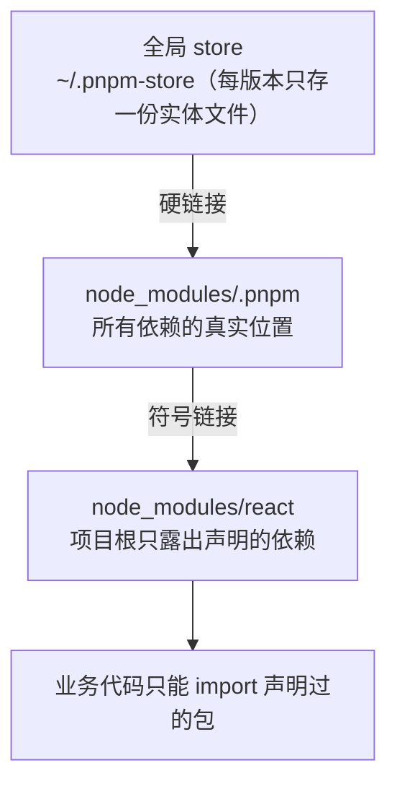

# pnpm workspace — 从零搭一个多包仓库

> 对应大纲模块 1 | 预计时间：0.5 天
> 面试可答：pnpm 用 store 硬链接 + 符号链接的 node_modules 结构，天然杜绝幽灵依赖；workspace: 与 catalog: 协议解决多包互引与版本统一。
> 前置阅读：[../readme.md](../readme.md)（速查版）｜参考：[pnpm.io](https://pnpm.io/workspaces)

---

## 学习目标

完成本篇后，你应该能够：

- 从零搭出 apps/packages 结构的 workspace，包之间用 `workspace:` + `catalog:` 正确互引
- 用 `--filter` 精确控制"装/跑/构建"的作用范围
- 说出 pnpm 的 node_modules 结构与 npm/yarn 扁平化的本质区别

---

## 核心概念

### 1. 先懂 pnpm：为什么它天生适合 monorepo

pnpm 的 node_modules 不是扁平化拷贝，而是**全局 store + 符号链接**：



两个直接收益：

- **省磁盘**：10 个项目用 react 19，磁盘上只有一份
- **严格隔离**：你没声明的包**找不到**（npm/yarn 扁平化下所有依赖都浮在根 node_modules，叫"幽灵依赖"）——monorepo 里几十个包共享依赖树，幽灵依赖会把版本关系搅成一锅粥，pnpm 把这类问题扼杀在安装期

### 2. 从零搭 workspace

```bash
mkdir my-monorepo && cd my-monorepo && git init
pnpm init
mkdir apps/web apps/admin packages/ui packages/utils
```

```yaml
# pnpm-workspace.yaml（仓库根目录，workspace 的唯一标志）
packages:
  - 'apps/*'
  - 'packages/*'

# pnpm 11：构建脚本批准改写在这里（不再读 package.json 的 pnpm 字段）
allowBuilds:
  - esbuild
  - '@parcel/watcher'
```

每个包就是普通 package.json，**包间互引**：

```jsonc
// apps/web/package.json
{
  "name": "@acme/web",
  "dependencies": {
    "@acme/ui": "workspace:*",       // 本地包，软链接即时生效
    "react": "catalog:",             // 版本统一走 catalog
    "zod": "^4.0.0"
  }
}
```

```yaml
# pnpm-workspace.yaml 声明 catalog（版本单一来源）
catalog:
  react: ^19.2.0
  typescript: ^5.9.0
```

`workspace:` 协议语义速查：

| 写法 | 含义 |
| ---- | ---- |
| `workspace:*` | 任何本地版本都接受（最常用） |
| `workspace:^` | 本地接受任意；**发包时**替换为 `^当前版本号` |
| `workspace:^1.2.0` | 本地版本须 ≥1.2.0 才链接 |

### 3. --filter：作用范围控制

```bash
# 按包名（package.json 的 name，不是目录名）
pnpm --filter @acme/web dev
pnpm --filter @acme/ui build

# 按目录
pnpm --filter ./apps/web test

# 多包 + 排除
pnpm --filter @acme/web --filter @acme/admin lint
pnpm --filter '!@acme/ui' build

# Git 变更驱动（CI 利器）：受本次改动影响的所有包（含依赖它的下游）
pnpm --filter ...[origin/main] build

# 依赖关系遍历：web 及它的全部上游依赖
pnpm --filter @acme/web... build
```

> 💡 `--filter ...[origin/main]` 是 CI 增量构建的原材料："只测受影响的包"一行搞定，比在 CI 脚本里手写 diff 逻辑可靠。

### 4. 常用命令全景

```bash
pnpm install                    # 全 workspace 安装（一次装完所有包）
pnpm -r run build               # 递归：所有包按拓扑序执行 build
pnpm -r --parallel run dev      # 并行跑所有包的 dev
pnpm add zod --filter @acme/web # 给指定包装依赖
pnpm add zod -r                 # 所有包都装
pnpm add -D eslint -w           # 根目录装 devDependency（-w 必须显式）
pnpm update -r --latest         # 全仓升级
```

---

## 常见踩坑点

- **根目录装依赖报错或装错位置** → pnpm 默认把根当普通成员；装"全仓共用"的工具必须 `-w`（workspace root）
- **pnpm 11 构建脚本被静默跳过** → esbuild 这类带 postinstall 的包需要批准；写在 `pnpm-workspace.yaml` 的 `allowBuilds`（pnpm 11 已不读 package.json 的 `pnpm` 字段）
- **幽灵依赖在 CI 挂掉本地却好好的** → 本地曾经用 npm/yarn 装过留下扁平 node_modules；删干净重装，让 pnpm 的严格结构生效
- **`workspace:*` 发布到 npm 后无法安装** → 忘了用 `pnpm publish` 发布（它会替换 `workspace:` 协议为真实版本），用了 `npm publish` 就会把 `workspace:*` 原样发出去
- **循环依赖** → a 引 b、b 引 a，pnpm 软链层面不报错，构建时才炸；设计期保证依赖方向单向（utils ← ui ← apps）

---

## 面试高频问题

1. pnpm 的 node_modules 结构和 npm 的扁平化有什么区别？各带来什么收益？
2. `workspace:*` 和 `workspace:^` 的区别？发包时发生了什么？
3. 幽灵依赖是什么？为什么扁平化结构必然产生它？

## 面试回答模板

> **问：pnpm 与 npm 的 node_modules 结构差异？**
> **答：** npm/yarn 扁平化：把所有依赖（含依赖的依赖）尽量提升到根 node_modules，副作用是幽灵依赖和重复拷贝。pnpm 两层结构：全局 store 按内容寻址存一份实体文件 → `node_modules/.pnpm` 硬链接它们 → 根 node_modules 只放符号链接、且只露出 package.json 声明的直接依赖。收益三连：磁盘省（硬链接共享）、装得快（store 复用）、依赖严格（幽灵依赖直接 import 不到），代价是少数工具假设扁平结构需要 shim 处理。

> **问：发包时 workspace 协议发生了什么？**
> **答：** `pnpm publish` 打包前会把 manifest 里的 `workspace:*` / `workspace:^` 替换成真实版本号（`*` → 当前版本、`^` → `^当前版本`），再发布；用 `npm publish` 则原样带出去，用户安装后 pnpm 无法解析 workspace 协议直接报错。所以 monorepo 里发包入口必须统一收敛到 `pnpm publish`（通常配 changesets 一起管）。

---

## 练习

1. **搭骨架**：按本文从零搭出 apps/web + packages/ui 的 workspace，web 里 import ui 的组件并在 dev 下热更新验证（改 ui 代码，web 即时生效——软链接的直接证据）。
2. **幽灵依赖实验**：在 web 里不声明直接 `import 'lodash'`（ui 声明过它），观察 pnpm 下的报错；再 `pnpm install --shamefully-hoist` 对比"npm 行为模拟"下的结果。
3. **filter 演练**：给 web、ui 各提交一次改动，用 `pnpm --filter ...[origin/main] build` 验证只构建受影响包。

**预期效果**：练习 1 见证"跨包热更新"；练习 2 能解释报错信息里 pnpm 在防什么。

---

## 本模块完成标准

- [ ] workspace 骨架搭通，跨包改动热更新生效
- [ ] 能默写 workspace: 三种写法语义与 catalog 用法
- [ ] 能不看答案讲清 pnpm 两层 node_modules 结构
