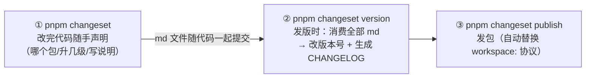

# Turborepo 任务编排 + changesets 发版

> 对应大纲模块 2 | 预计时间：1 天
> 面试可答：Turborepo = 依赖图调度 + 输入哈希缓存（输入没变直接吐上次产物）；changesets = 声明式版本管理三步走。
> 前置阅读：[01-pnpm-workspace上手](01-pnpm-workspace上手.md)｜参考：[turborepo.dev](https://turborepo.dev/docs) · [changesets](https://github.com/changesets/changesets)

---

## 学习目标

完成本篇后，你应该能够：

- 写出正确的 `turbo.json` 任务管道，并解释"缓存命中"到底校验了什么
- 用 `--filter ...[origin/main]` 做 CI 增量构建，配远程缓存让全团队共享产物
- 用 changesets 走通"改代码 → 攒变更 → 发版"的完整循环，理解 fixed 模式

---

## 核心概念

### 1. Turborepo 的定位：不装依赖、只管调度和缓存

```
pnpm 负责"依赖装到哪"（见 doc/01）
turborepo 负责"任务怎么跑"：按依赖图排序 + 跳过没变化的任务
```

核心公式：**任务 = f(输入)**。输入（源码 + 依赖清单 + 配置 + 环境变量）的哈希没变 → 直接复用上次输出。monorepo 里几十个包互相依赖，人工保证"先建上游再建下游、只建改动过的"不现实，这就是 Turborepo 存在的理由。

### 2. turbo.json 完整走读

```jsonc
{
  "$schema": "https://turbo.build/schema.json",
  "tasks": {
    "build": {
      "dependsOn": ["^build"],        // 先跑"所有直接上游包"的 build
      "outputs": ["dist/**"]          // 声明产物目录 → 缓存它们
    },
    "lint": {
      // 无 dependsOn：所有包的 lint 可并行，互不等待
    },
    "test": {
      "dependsOn": ["build"],         // 等本包（不含上游）的 build 完成
      "outputs": ["coverage/**"]
    },
    "dev": {
      "cache": false,                 // dev server 是长驻进程，不缓存
      "persistent": true              // 永不结束的任务要声明，否则 turbo 等它
    }
  }
}
```

`dependsOn` 三种写法的区别（高频混淆点）：

| 写法 | 含义 |
| ---- | ---- |
| `"^build"` | **上游包**的 build（ui 建完才建 web） |
| `"build"` | **本包**自己的 build 任务先跑 |
| `"^lint"` | 上游的 lint 也算前置（常用于类型检查链） |

### 3. 缓存命中机制：hash 什么

一次任务执行前，Turborepo 对以下输入取哈希：

- 该包的源码（git 追踪的文件）
- 依赖的 lockfile 片段（`pnpm-lock.yaml` 中相关部分）
- 环境变量：envMode 默认 **strict**——参与哈希 = 任务 `env` / 全局 `globalEnv` 的声明 + **框架推断通配符**（Vite 项目的 `VITE_*`、Next 的 `NEXT_PUBLIC_*` 自动覆盖）；`PATH`/`HOME` 等系统变量只透传给进程、不计哈希

```jsonc
// VITE_* 前缀变量被框架推断自动接管；要显式写进 env 的是无前缀业务变量
{
  "tasks": {
    "build": {
      "dependsOn": ["^build"],
      "outputs": ["dist/**"],
      "env": ["API_BASE_URL", "FEATURE_FLAGS"]
    }
  }
}
```

命中 → 复制 outputs + 重放日志（标 `>>> FULL TURBO`）；未命中 → 真跑并记录。**本地与 CI 各自缓存，配远程缓存则团队共享**（`npx turbo login && npx turbo link`，或自托管）。参考：[turborepo.dev - Environment Variables](https://turborepo.dev/docs/guides)

### 4. CI 增量构建

```yaml
# GitHub Actions 片段
- uses: actions/checkout@v4
  with:
    fetch-depth: 0          # 必须！filter 依赖完整 git 历史
- run: pnpm install --frozen-lockfile
- run: pnpm turbo build test --filter ...[origin/main]
```

`--filter ...[origin/main]` 的语义：受"当前分支相对 main 的改动"影响的包**及其下游**。效果：只改了 ui → build+test 范围是 ui 和 web，admin 完全跳过。

### 5. changesets：发版三步走

```bash
pnpm add -Dw @changesets/cli
pnpm changeset init       # 生成 .changeset/config.json
```



**版本策略**（`.changeset/config.json`）：

| 模式 | 配置 | 适用 |
| ---- | ---- | ---- |
| 独立版本（默认） | 不配 | 各包节奏不同 |
| 统一版本 | `fixed: [["@acme/*"]]` | 组件库全家桶，用户希望版本可预测 |

**pre 模式**（beta/RC 通道）：`pnpm changeset pre enter beta` 进入，期间所有版本带 `-beta.N` 后缀递增，`pnpm changeset pre exit` 退出并汇总正式版——大版本发布前灰度的标准玩法。

CI 自动化（可选）：官方 [changesets/action](https://github.com/changesets/action) 监听 main 分支——有待消费的 changeset md 就开 "Version Packages" PR；PR 合并自动 version + publish。

---

## 常见踩坑点

- **缓存"命中"但产物是旧的** → 无前缀业务环境变量没进 `env` 字段（`VITE_*` 有框架推断兜底，自定义变量没有），或 `outputs` 没覆盖全部产物目录（漏写的目录不缓存也不校验）
- **CI filter 全量跑了/什么都没跑** → `checkout` 少了 `fetch-depth: 0`，git 历史不全，filter 计算失真
- **dev 任务卡住 turbo** → 长驻进程没声明 `persistent: true`，turbo 一直等它退出
- **changeset md 忘了提交** → 发版时 version 什么都没消费，版本号纹丝不动；把 `.changeset/` 目录纳入 review 检查项
- **patch 改成了 minor** → changeset 交互里选错级别没有撤销；养成习惯：发版前 `pnpm changeset status` 预览

---

## 面试高频问题

1. Turborepo 的缓存怎么判断"可以跳过"？哪些输入参与哈希？
2. monorepo 里如何只构建受影响的包？依赖图从哪来？
3. changesets 相对手动 `npm version` 的优势？

## 面试回答模板

> **问：Turborepo 缓存机制？**
> **答：** 任务执行前对输入集合取哈希：包内源码、lockfile 相关片段、依赖包的文件指纹、任务定义本身；环境变量按 strict 模式白名单制——`env`/`globalEnv` 声明 + 框架推断通配符（Vite 的 `VITE_*` 自动覆盖），系统变量透传不计数。哈希与历史记录一致 → 不执行任务，直接从缓存（本地目录或远程服务）恢复 outputs 并重放日志。要点是"输入必须声明完整"——无前缀业务变量漏声明就会假命中，outputs 漏声明则缓存不全，这是 Turborepo 第一高频事故。

> **问：changesets 优势？**
> **答：** 把"发版决策"从发版时刻拆散到日常开发：每次改动顺手声明 semver 级别和 changelog（一个 md 文件随 PR 走），发版时统一消费——版本号、CHANGELOG、包间依赖的版本联动一次完成。对比手动 `npm version` 的优势：① 多包 semver 联动（ui 升 minor，依赖它的 web 自动 patch）不用人肉维护；② changelog 与 PR 一一对应可追溯；③ pre 模式天然支持 RC 通道。

---

## 练习

1. **缓存实验**：搭三包链（utils → ui → web），`turbo build` 连跑两次观察 `FULL TURBO`；然后改 utils 一行代码再跑，验证 ui、web 因 `^build` 连锁重建，而无关包跳过。
2. **env 坑复现**：build 脚本里 echo 一个**无前缀**环境变量（如 `API_BASE_URL`）进产物——`VITE_*` 前缀变量有框架推断兜底、造不出这个坑——不声明 `env` 时改值重跑观察假命中，声明后复跑观察失效。亲手造一次"假缓存"。
3. **发版演练**：给三包仓库配 changesets（fixed 统一版本），走完 add → version → （publish 到 Verdaccio 私服或 dry-run），检查 CHANGELOG 与版本联动是否正确。

**预期效果**：练习 2 造出一次假命中并知道怎么防；练习 3 走通三包版本联动。

---

## 本模块完成标准

- [ ] 能默写 dependsOn 三种写法区别与缓存哈希的输入集合
- [ ] CI 里跑通 `--filter ...[origin/main]` 增量构建（fetch-depth: 0）
- [ ] changesets 三步走完一遍，说清 fixed 与 pre 模式
