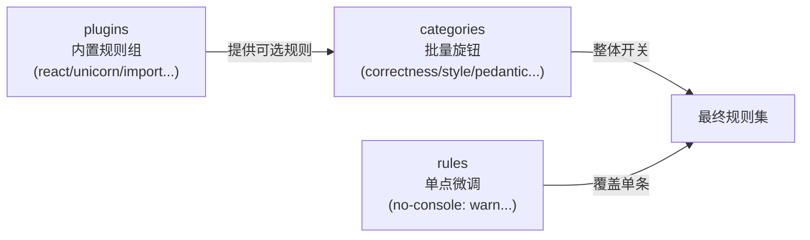

# oxlint — 规则体系与插件编写

> 对应大纲模块 1 | 预计时间：0.5 天
> 面试可答：oxlint 是 Rust 单 pass 重写的 ESLint 兼容子集——categories 批量开、rules 单点调、不够再写 JS 插件。
> 前置阅读：[../readme.md](../readme.md)（速查版）｜参考：[oxc.rs](https://oxc.rs/docs/guide/usage/linter)

---

## 学习目标

完成本篇后，你应该能够：

- 用 categories + rules 两级旋钮为一个项目配出"告警噪音可控"的 lint 基线
- 写出一个能跑的 oxlint JS 插件规则，并用真实代码验证它
- 说出 oxlint 的能力边界（type-aware 短板），并给出双跑方案

---

## 核心概念

### 1. 心智模型：两级规则旋钮



- **plugins**：决定"哪些规则组可用"（相当于 ESLint 里装插件）
- **categories**：决定"每组默认开多严"（correctness / suspicious / style / pedantic...）
- **rules**：对具体规则单点覆盖，优先级最高

**基线策略**：从 `correctness: error` 起步（其余全 off），被某个真实问题烦到了，再把对应类别开到 warn。**永远不要一上来全开**——pedantic 类规则会产生几百条噪音，团队会直接禁用 lint。

### 2. 完整配置走读

```jsonc
// .oxlintrc.json
{
  // 内置规则组（相当于 ESLint 插件，选项目用到的）
  "plugins": ["typescript", "react", "unicorn", "import", "node", "vitest"],

  // 类别批量开关
  "categories": {
    "correctness": "error",    // 默认基线：真 bug 级
    "suspicious": "warn",      // 可疑写法
    "style": "off"             // 风格类交给 oxfmt，不开
  },

  // 单点覆盖
  "rules": {
    "no-console": "warn",
    "eqeqeq": "error",
    "no-unused-vars": ["error", { "argsIgnorePattern": "^_" }]   // _ 开头的参数豁免
  },

  "settings": {
    "react": { "version": "detect" }
  },

  // 按路径差异化
  "overrides": [
    {
      "files": ["*.test.ts", "*.spec.ts", "**/scripts/**"],
      "rules": { "no-console": "off" }
    }
  ],

  "ignorePatterns": ["coverage", "dist", "node_modules"]
}
```

### 3. 屏蔽注释体系

```ts
// oxlint-disable-next-line no-console
console.log('只豁免这一行')

/* oxlint-disable no-console -- 本文件是构建脚本 */
console.log('豁免整个文件')
/* oxlint-enable no-console */

console.log('debug') // oxlint-disable-line no-console
```

> 与 ESLint 的 `eslint-disable-*` 注释互不冲突，oxlint 两者都认。**规则：disable 注释必须带规则名**（无差别屏蔽会让整条规则形同虚设），且尽量用 `-- 理由` 说明原因。

### 4. JS 插件：写一条自定义规则

内置规则组覆盖 90% 场景，团队特有约定（比如"禁止直接 import 私有包"）写 JS 插件。

**第 1 步：规则文件**——visitor 语法与 ESLint 一致（ESTree 节点类型）：

```js
// .oxlint/plugins/no-direct-store-import.js
export default {
  name: 'team-rules',
  rules: {
    'no-direct-store-import': {
      create(context) {
        return {
          ImportDeclaration(node) {
            const source = node.source.value
            if (typeof source === 'string' && source.startsWith('@/store/')) {
              context.report({
                node,
                message: '禁止直接 import store，请使用 useStore() hook（见团队规范 #store）',
              })
            }
          },
        }
      },
    },
  },
}
```

**第 2 步：挂载 + 启用**：

```jsonc
// .oxlintrc.json
{
  "jsPlugins": ["./.oxlint/plugins/no-direct-store-import.js"],
  "rules": {
    "team-rules/no-direct-store-import": "error"
  }
}
```

**第 3 步：验证规则**——建一个 fixture 文件故意触发，跑 `bunx oxlint` 确认报错文案与位置正确；再建一个"合法写法"fixture 确认不误报。**规则必须配正反两个用例**，否则它自己就是隐患。

常用 visitor 入口速查：

| 节点类型 | 命中时机 |
| -------- | -------- |
| `ImportDeclaration` | 每条 import 语句 |
| `CallExpression` | 每次函数调用（`node.callee` 判断调用谁） |
| `MemberExpression` | 每次属性访问（`a.b`） |
| `JSXAttribute` | JSX 属性 |
| `Identifier` | 标识符引用 |

### 5. 能力边界：type-aware 规则（tsgolint）

ESLint 生态里最强的规则依赖**类型信息**（如 `@typescript-eslint/no-floating-promises`——能知道一个表达式是不是 Promise）。oxlint 的类型感知引擎 **tsgolint** 正在以独立包 `oxlint-tsgolint` 的形态落地（oxlint 1.85+ 的可选依赖，按需安装接入，以官方文档为准）——接入后"何时撤掉 ESLint"就有了明确抓手。

判断你需不需要它：

- 不需要：`no-unused-vars`、`eqeqeq`、import 规则、React hooks 规则——oxlint 全覆盖
- 需要：floating promises、unbound method、严格 null 检查类规则

**双跑方案**（过渡期标准做法）：

```jsonc
// package.json
{
  "scripts": {
    "lint": "oxlint && eslint --cache .",
    "lint:fix": "oxlint --fix && eslint --cache --fix ."
  }
}
```

ESLint 配置里**只留 type-aware 规则**（关掉与 oxlint 重复的规则组），这样 ESLint 跑得也不慢。等 tsgolint 成熟后逐步撤掉 ESLint。

### 6. 从 ESLint 迁移的标准路径

1. `bunx oxlint` 跑一遍，看告警量（通常几百条，多为 style 类）
2. 对照老 `.eslintrc` 逐条映射规则到 categories/rules（大部分直接对号入座）
3. 加 `.oxlintrc.json` 的 `ignorePatterns` 与老 `.eslintignore` 对齐
4. CI 与提交前钩子切到 oxlint，老 ESLint 配置归档进 `_migrate/` 目录留档，一个月后删

---

## 常见踩坑点

- **jsPlugins 路径不生效** → 路径相对 `.oxlintrc.json` 所在目录解析；Windows 下也用正斜杠写
- **插件规则没触发** → 忘了在 `rules` 里给 `team-rules/xxx` 设等级——jsPlugins 只是"注册"，不是"启用"
- **开 pedantic 后告警爆炸** → 类别旋钮回退，改用 rules 单点开其中几条
- **CI 与本地结果不一致** → oxlint 版本没锁死；devDependencies 固定版本，别用 `latest`

---

## 面试高频问题

1. oxlint 为什么比 ESLint 快一到两个数量级？
2. 从 ESLint 迁移到 oxlint，最大的风险是什么？

## 面试回答模板

> **问：oxlint 为什么快？**
> **答：** 三个原因：① Rust 实现加单次解析复用——一遍 parse 出 AST 后所有规则共享，不像 ESLint 每条规则独立遍历；② 无 JS 插件运行时——内置规则编译在二进制里，省掉 JS 函数调用和规则懒加载开销；③ 并行化——文件级多线程分发。代价是 JS 插件生态和 type-aware 能力弱于 ESLint，所以定位是"快规则层"，深度类型规则仍需 ESLint 补位。

> **问：迁移最大风险？**
> **答：** 规则集不等价的"安全错觉"——团队以为 oxlint = ESLint 关掉一样，实际差异集中在 type-aware 规则。正确姿势是先盘点现有 ESLint 配置里哪些规则依赖类型信息，需要就保留双跑，把 oxlint 定位为快速第一层，而不是全量替换。

---

## 练习

1. **写一条团队规则**：实现 `no-dayjs-import`——禁止直接 `import dayjs`，必须 `import { dayjs } from '@/lib/date'`（统一时区配置入口）。配正反两个 fixture 验证。
2. **基线配置**：给你当前的项目写一份 `.oxlintrc.json`：correctness error + suspicious warn，测试文件豁免 no-console，`_` 前缀参数豁免 unused。
3. **双跑演练**：找一个有 `no-floating-promises` 需求的仓库，配置"oxlint 快层 + ESLint type-aware 层"的双跑脚本，对比两层的耗时。

**预期效果**：练习 1 完成正反 fixture 闭环；练习 3 有一组真实的耗时对比数据（通常 oxlint < 1s、ESLint 层 10s+）。

---

## 本模块完成标准

- [ ] 能默写 categories / rules / plugins 三者关系
- [ ] 完成一条带正反 fixture 的自定义规则
- [ ] 能向同事讲清"什么时候必须保留 ESLint"
