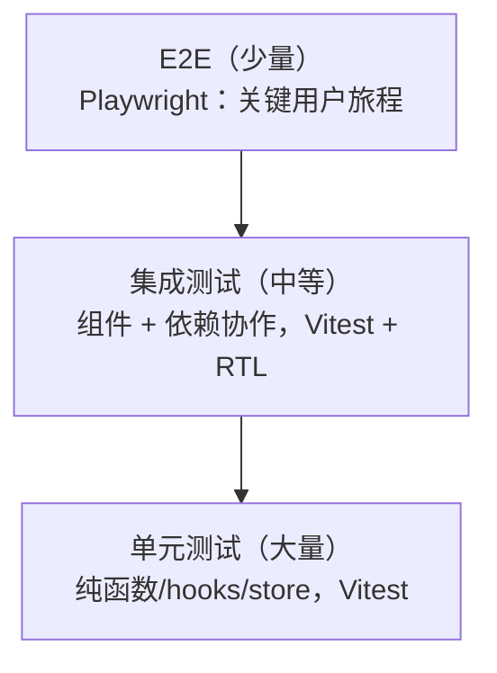

# 组件测试与测试策略

> 对应大纲模块 2 | 预计时间：1 天
> 面试可答：组件测试像用户一样操作（role 查询 → 交互 → 断言可见结果）；测试金字塔的比例决定回归信心。
> 前置阅读：[01-Vitest核心与Mock](01-Vitest核心与Mock.md)

---

## 学习目标

完成本篇后，你应该能够：

- 用 Testing Library 按"查询优先级"写组件测试，并解释为什么 role 查询最优先
- 为一个真实组件规划"测什么 / 不测什么"，说清取舍依据
- 正确看待覆盖率数字，搭建 CI 测试流水线

---

## 核心概念

### 1. 环境选择：jsdom vs 真实浏览器

| 环境 | 机制 | 适合 |
| ---- | ---- | ---- |
| jsdom（默认可选） | JS 模拟 DOM，无真实渲染 | 绝大多数组件逻辑测试，快 |
| browser mode | 真实浏览器跑测试（`browser.instances` 配置，Vitest 4 已稳定） | Web Component、canvas、真布局/多标签页 |

**默认 jsdom，遇到 jsdom 缺能力（如 canvas、getBoundingClientRect 返回 0）再对具体文件切 browser mode**，不要全量上——browser 慢一个量级。

### 2. Testing Library 心法：像用户一样测

```tsx
import { render, screen } from '@testing-library/react'
import userEvent from '@testing-library/user-event'
import { Counter } from './Counter'

test('点击加一按钮后显示 1', async () => {
  render(<Counter />)
  const btn = screen.getByRole('button', { name: /加一/i })   // ① 按角色找到它
  await userEvent.click(btn)                                   // ② 像用户一样操作
  expect(screen.getByText('1')).toBeInTheDocument()            // ③ 断言用户能看到的结果
})
```

**查询优先级**（从上到下，越往下越像"实现细节"）：

| 优先级 | 查询 | 为什么 |
| ------ | ---- | ------ |
| 1 | `getByRole`（+ name） | 对应可访问性树——测试通过 = 无障碍没坏 |
| 2 | `getByLabelText` | 表单场景，同样绑定可访问性 |
| 3 | `getByText` / `getByPlaceholderText` | 用户视角的可见内容 |
| 4 | `getByTestId` | 兜底：无语义可查时才用（加 `data-testid`） |

**getBy / queryBy / findBy 前缀语义**：`getBy` 找不到就抛错（断言存在）；`queryBy` 找不到返回 null（断言不存在：`expect(screen.queryByText('error')).toBeNull()`）；`findBy` 异步等待出现（配合懒加载/toast）。

**userEvent 优于 fireEvent**：userEvent 会走完整事件链（keydown → keypress → input → change），fireEvent 只触发单个事件——真实用户敲键盘是前者。

### 3. 测什么 / 不测什么

| 值得测 | 不值得测 |
| ------ | ------- |
| 组件的行为契约（点击/输入后输出什么） | 内部 state 值、class 名、实现细节 |
| 边界与异常路径（空列表、加载失败 UI） | 第三方库本身（mock 掉即可） |
| 状态流转（表单校验、提交禁用） | 纯样式（交给视觉回归工具，别用快照硬扛） |
| 跨组件协作（父传子、context 注入） | getter/setter 一行代码 |

**mock 边界铁律**：mock 网络（fetch/hook）、时间、随机数——**不 mock 被测组件的内部逻辑**。测试断言打在"用户可见的结果"上，内部怎么实现随便重构。

### 4. 测试策略：金字塔怎么摆



- **单元**：数量最多、跑最快，逻辑函数全覆盖三件套（正常/边界/异常）
- **集成**：组件级测试本质是集成测试（组件 + store + hook 协作）——**回归信心主要来自这里**，别把精力全砸在纯函数上
- **E2E**：只保"冒烟级"关键路径（登录、下单），多了维护成本失控

### 5. 覆盖率的正确态度

覆盖率是**"没测到的警报"**，不是"测好了的证明"：

- 100% 覆盖 + 零断言 = 无效测试（`expect(true).toBe(true)` 也算覆盖）
- 实用阈值：全局 70% 起步，**核心业务模块单独设高阈值**（如支付、权限 90%+）
- 看"变化覆盖率"（本次 PR 改动的代码测了吗）比看全局总数更有意义

```ts
// vitest.config.ts
test: {
  coverage: {
    provider: 'v8',
    reporter: ['text', 'html', 'lcov'],
    include: ['src/**'],
    thresholds: { global: { lines: 70 }, 'src/payments/**': { lines: 90 } },
  },
}
```

### 6. bun test 边界

纯 Node 工具/脚本项目（无 DOM、无组件、不依赖 Vite 插件生态）直接用 `bun test`——零配置、API 兼容 Jest、与仓库 demo 约定（Bun 优先）一致。**组件测试、需要 alias/自动导入等 Vite 生态的项目选 Vitest。** 一个仓库两种测试并存也没问题（src/utils 用 bun test，src/components 用 vitest），但要分开脚本与 CI 步骤。

### 7. CI 接线

```yaml
# GitHub Actions 片段
- run: pnpm vitest run --coverage     # 跑一遍 + 覆盖率（非 watch）
- run: pnpm tsc --noEmit              # 类型检查不放进 vitest（职责分离）
```

> PR 卡点建议：测试跑过 + 覆盖率不降（coverage reporter 出 lcov 后用 coverage-check 类 action 比对基线）。

---

## 常见踩坑点

- **act/状态更新警告刷屏** → 用 userEvent（内部包了 act）而不是手动 dispatch；数据获取用 `findBy*` 等待而不是 mock 立即 resolve 后同步断言
- **多个元素匹配同一查询抛错** → `getByRole('button')` 匹配到一串；加 `name` 收窄或用 `getAllBy...`
- **jsdom 缺 API 导致误判组件有 bug** → canvas/布局类问题切 browser mode，别在 jsdom 里死磕
- **快照测试泛滥** → snapshot 只适合"结构稳定的叶子组件"，大组件快照人人盲点 `update snapshot`；行为断言为主
- **测试互相污染** → localStorage/document 上的残留；`beforeEach` 清理，或用 RTL 的 `cleanup`（RTL + Vitest 全局开 cleanup 默认生效）

---

## 面试高频问题

1. 为什么 Testing Library 推荐用 getByRole 而不是 getByTestId？
2. 组件测试的 mock 边界怎么划？
3. 单元/集成/E2E 的比例怎么定？覆盖率目标怎么设？

## 面试回答模板

> **问：为什么 role 查询最优先？**
> **答：** getByRole 查询的是可访问性树（ARIA role + accessible name），意味着"测试通过"同时证明了"屏幕阅读器能用"——测试与无障碍一鱼两吃。反例是 getByTestId：它是给机器看的实现细节，重构时最容易失联，且完全不代表用户视角。所以默认 role，语义真空才降级 testid。

> **问：mock 边界怎么划？**
> **答：** 划在"被测单元的边界"上：单元外的世界（网络、时间、随机、第三方）都替换，边界内（组件逻辑、状态流转）保持真实。操作判断：mock 它之后断言还打在被测代码上吗？打了 → 合理；断言打在 mock 身上或把内部函数也 mock 了 → 测试已经失效，测的是 mock 自己。这个铁律的推论是：可以随意重构被测代码内部实现，测试不应红——红了说明测试耦合了实现。

---

## 练习

1. **行为测试**：为表单组件（邮箱 + 密码 + 提交）写测试：非法邮箱时提交禁用、合法时请求发出（mock 网络 hook）、成功跳转。全部用 role/label 查询。
2. **查询降级演练**：故意写一个只有 `data-testid` 的组件，先只能用 testid 测；再补上 aria-label 后改写为 role 查询——体会差异。
3. **策略设计**：给你当前的项目画金字塔：列出 5 个最值得写集成测试的场景 + 3 条 E2E 冒烟路径，说明为什么不是更多。

**预期效果**：练习 2 让"可访问性 = 测试质量"从口号变成手感；练习 3 输出一份可以拿去评审的测试计划。

---

## 本模块完成标准

- [ ] 能默写查询优先级表与 getBy/queryBy/findBy 语义
- [ ] 完成一个纯行为断言的表单组件测试（练习 1）
- [ ] 能向同事讲清"mock 边界铁律"及其推论
