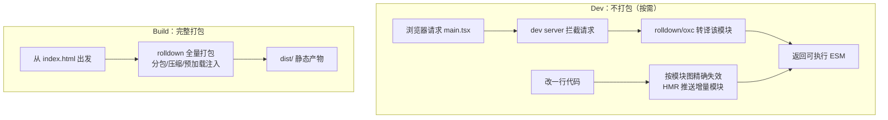

# Vite 核心工作流

> 对应大纲模块 1 | 预计时间：1 天
> 面试可答：Vite dev 快是因为"不打包"——源码按原生 ESM 按需编译，依赖只预构建一次；生产仍走完整打包。
> 前置阅读：[../readme.md](../readme.md)（速查版）｜参考：[vite.dev](https://vite.dev/guide/)

---

## 学习目标

完成本篇后，你应该能够：

- 说清 dev 与 build 两条工作流的本质差异，能画出 dev 请求处理链路
- 熟练处理日常四件事：别名、代理、环境变量、静态资源
- 解释"为什么改一行代码 HMR 毫秒级"，而不是背结论

---

## 核心概念

### 1. 为什么 dev 快：两条工作流对比



**关键洞察**：传统打包器（webpack）dev 模式也要先把整个依赖图打完才能开页面——项目越大越慢。Vite 的 dev 把"打包"拆成两半：

- **源码**：浏览器原生支持 ESM，请求哪个模块就转译哪个（转译单文件毫秒级），不关心全图
- **依赖**（node_modules 里的包，多为 CJS/多文件）：启动时**预构建**一次，打成单文件缓存在 `node_modules/.vite`，后续请求直接复用

所以冷启动时间 ≈ 预构建时间（与依赖数量相关，与业务代码量无关），这就是"秒开"的来源。

### 2. 入口是 index.html

与 webpack 以 JS 为入口不同，Vite 以 `index.html` 为入口，`<script type="module" src="/src/main.tsx">` 就是依赖图的起点。**dev 和 build 都从 HTML 出发**——多入口（MPA）就是多份 HTML 配 `build.rollupOptions.input`。

### 3. 日常四件事

**① 别名**（TS 侧必须同步，否则运行时对、编辑器红）：

```ts
// vite.config.ts
resolve: { alias: { '@': path.resolve(__dirname, 'src') } }
```

```jsonc
// tsconfig.json —— compilerOptions.paths 与上面保持一致
{ "compilerOptions": { "paths": { "@/*": ["./src/*"] } } }
```

> 💡 Vite 8 起可配 `resolve.tsconfigPaths: true` 直接消费 tsconfig 的 paths，省掉双配置；有 tsconfig 表达不了的映射再用 alias 显式覆盖。以 [官方文档](https://vite.dev/config/shared-options.html#resolve-tsconfigpaths) 为准。

**② 代理**（本地跨域的标准解法，只对 dev 生效）：

```ts
server: {
  proxy: {
    '/api': { target: 'http://localhost:3000', changeOrigin: true },
    '/ws': { target: 'ws://localhost:3000', ws: true },   // WebSocket 代理
  },
}
```

**③ 环境变量**：

```bash
# .env（所有模式）→ .env.development（dev）→ .env.production（build）
# 优先级：.env.{mode}.local > .env.{mode} > .env.local > .env
VITE_API_BASE=https://dev.example.com
```

```ts
const base = import.meta.env.VITE_API_BASE   // 只有 VITE_ 前缀的会注入客户端
// import.meta.env.MODE / DEV / PROD / SSR 内置可用
```

```ts
// src/vite-env.d.ts —— 类型提示
/// <reference types="vite/client" />
interface ImportMetaEnv {
  readonly VITE_API_BASE: string
}
```

**④ 静态资源**：

| 方式 | 行为 |
| ---- | ---- |
| `import logo from './logo.png'` | 返回 URL；小于 assetsInlineLimit（默认 4KB）内联为 base64 |
| `import txt from './a.txt?raw'` | `?raw` 后缀：以字符串引入原始内容 |
| `import url from './a.png?url'` | `?url` 后缀：强制返回 URL |
| `public/` 目录 | 原样拷贝到产物根，代码里以 `/` 绝对路径引用，**不经打包处理**（不放需哈希的资源） |

### 4. 生产构建与分包

```ts
build: {
  target: 'es2020',
  rollupOptions: {
    output: {
      // Vite 8：advancedChunks（manualChunks 已移除）
      advancedChunks: {
        groups: [
          { name: 'react', test: /[\\/]node_modules[\\/](react|react-dom|scheduler)[\\/]/ },
          { name: 'vendor', test: /[\\/]node_modules[\\/]/ },
        ],
      },
    },
  },
}
```

分包的意义：业务代码频繁变更、三方库稳定——拆开后三方库的浏览器缓存长期命中。Vite 同时自动生成 `modulepreload` 声明，把入口依赖的 chunk 提前预加载。

---

## 常见踩坑点

- **dev 能跑，build 挂** → dev 不打包所以"懒"出的问题只在 build 暴露：循环依赖、CJS/ESM 混用、TS 类型错误（build 默认不做类型检查，要靠 `tsc --noEmit` 或 vite-plugin-checker 单独跑）
- **预构建缓存腐败** → 升级依赖/改 optimizeDeps 后行为诡异，删 `node_modules/.vite` 重启
- **改 .env 不生效** → env 变更不会热更新也不会自动重启，手动重启 dev server
- **代理没生效** → 浏览器直接请求了绝对地址（如 fetch 完整 URL），代理只拦"同源相对路径"
- **public/ 里的文件 import 不到** → public 就是"不参与打包"的纯静态目录，要用它就写绝对路径 `/favicon.ico`

---

## 面试高频问题

1. Vite dev 为什么快？和 webpack dev 的本质区别？
2. 依赖预构建解决了什么问题？
3. HMR 的原理？为什么改一行代码能毫秒级生效？

## 面试回答模板

> **问：Vite dev 为什么快？**
> **答：** 核心是 dev 阶段"不打包"。webpack dev 必须从 entry 递归打包完整依赖图才能服务页面，耗时随项目规模线性增长。Vite dev 利用浏览器原生 ESM：业务源码按请求逐个转译（rolldown/oxc 单文件毫秒级），node_modules 依赖启动时预构建一次进缓存。冷启动只与依赖数量相关、与业务代码量无关，且源码变更时只需精确失效受影响模块，不用重打包。

> **问：HMR 原理？**
> **答：** dev server 持有完整模块依赖图。文件变化时先重转译该模块，沿依赖图反向找到受影响的"边界"——若模块（或框架插件）声明了 `import.meta.hot.accept`，就把新模块推给浏览器原地替换并重新执行接受回调，组件状态由框架插件（如 react fast refresh）额外保留；找不到接受边界才降级为整页刷新。所以 HMR 速度 ≈ 单模块转译时间 + 网络一跳，与项目大小无关。

---

## 练习

1. **多环境**：为项目配 dev/test/prod 三份 env（不同 API 地址），在页面上展示当前 `import.meta.env.MODE` 与 API 地址，切换 `--mode` 验证。
2. **代理抓包**：起一个本地后端（或 json-server），配 `/api` 代理，在浏览器 Network 里确认请求 URL 是同源、响应来自后端。
3. **分包验证**：给一个含 react + lodash 的项目配 advancedChunks，build 后在 dist 里找出 react chunk，再改一行业务代码重新 build，对比 hash——三方 chunk hash 不变（缓存命中），业务 chunk 变了。

**预期效果**：练习 3 亲眼看到"分包 = 缓存策略"，比背八股有效。

---

## 本模块完成标准

- [ ] 能画出 dev 两条链路（按需转译 / HMR）与 build 链路
- [ ] 日常四件事（别名/代理/env/资源）不查文档配完
- [ ] 完成练习 3 并能解释 hash 不变的原因
