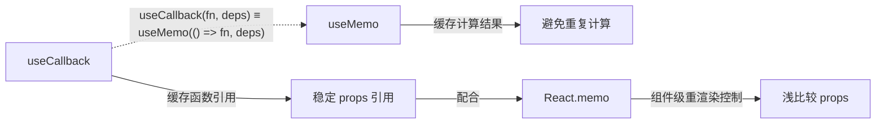

# 02 - useRef 与记忆化 Hooks

> 对应大纲模块 2 | 预计时间：1 天
> 面试可答：`useRef` 持久化引用且不触发重渲染，`useMemo` 缓存计算结果，`useCallback` 缓存函数引用。

---

## 学习目标

- 掌握 `useRef` 操作 DOM 和作为实例变量的用法
- 理解 `useMemo` 与 `useCallback` 的区别和适用场景
- 掌握 `React.memo` 与 `useCallback` 的配合优化
- 面试时能解释记忆化 Hooks 的原理和何时该/不该使用

---

## 核心概念

### 1. useRef — 持久化引用

`useRef` 返回一个可变的 ref 对象（`{ current: T }`），在组件的整个生命周期中保持稳定。

```tsx
import { useRef } from 'react';

function TextInputWithFocus() {
  const inputRef = useRef<HTMLInputElement>(null);

  const handleClick = () => {
    inputRef.current?.focus(); // 操作 DOM
  };

  return (
    <>
      <input ref={inputRef} type="text" />
      <button onClick={handleClick}>聚焦</button>
    </>
  );
}
```

**核心要点**：
- `useRef(initialValue)` 返回 `{ current: initialValue }`
- 修改 `.current` **不会触发重渲染**
- 组件卸载前，ref 对象始终是同一个引用

### 2. useRef 操作 DOM

最常见的用法：获取 DOM 元素的引用。

```tsx
function VideoPlayer({ src }: { src: string }) {
  const videoRef = useRef<HTMLVideoElement>(null);

  const play = () => videoRef.current?.play();
  const pause = () => videoRef.current?.pause();

  return (
    <div>
      <video ref={videoRef} src={src} />
      <button onClick={play}>播放</button>
      <button onClick={pause}>暂停</button>
    </div>
  );
}
```

**注意类型**：`useRef<HTMLVideoElement>(null)`，初始值为 `null`（DOM 元素挂载后才有值）。

### 3. useRef 作为实例变量

除了操作 DOM，`useRef` 还常用于保存**不需要触发渲染的可变值**。

#### 保存定时器 ID

```tsx
import { useState, useEffect, useRef } from 'react';

function Stopwatch() {
  const [time, setTime] = useState<number>(0);
  const timerRef = useRef<ReturnType<typeof setInterval> | null>(null);

  const start = () => {
    if (timerRef.current !== null) return; // 防止重复启动
    timerRef.current = setInterval(() => {
      setTime(prev => prev + 1);
    }, 1000);
  };

  const stop = () => {
    if (timerRef.current !== null) {
      clearInterval(timerRef.current);
      timerRef.current = null;
    }
  };

  // 组件卸载时清理
  useEffect(() => {
    return () => {
      if (timerRef.current !== null) {
        clearInterval(timerRef.current);
      }
    };
  }, []);

  return (
    <div>
      <p>{time} 秒</p>
      <button onClick={start}>开始</button>
      <button onClick={stop}>停止</button>
    </div>
  );
}
```

#### 获取上一次的值

```tsx
function usePrevious<T>(value: T): T | undefined {
  const ref = useRef<T | undefined>(undefined);

  useEffect(() => {
    ref.current = value;
  }, [value]); // 每次 value 变化时更新 ref

  return ref.current; // 返回更新前的值
}

// 使用
function Counter() {
  const [count, setCount] = useState<number>(0);
  const prevCount = usePrevious(count);

  return (
    <p>
      当前：{count}，上一次：{prevCount}
    </p>
  );
}
```

**原理**：`useEffect` 在渲染**之后**执行，所以 `ref.current` 保存的是上一次渲染的值。

### 4. useState vs useRef 对比

| 维度 | useState | useRef |
|------|----------|--------|
| 触发重渲染 | 是 | 否 |
| 读取方式 | `state` | `ref.current` |
| 更新方式 | `setState(newValue)` | `ref.current = newValue` |
| 适用场景 | 需要反映在 UI 上的值 | 不需要渲染的可变值 |

**面试回答**：如果值变化需要反映在界面上，用 `useState`；如果只是保存一个引用（DOM 节点、定时器 ID、上一次的值），不需要触发渲染，用 `useRef`。

---

## useMemo — 缓存计算结果

### 5. 基本用法

`useMemo` 缓存一个**计算结果**，只在依赖变化时重新计算。

```tsx
import { useMemo } from 'react';

function TodoList({ todos, filter }: { todos: Todo[]; filter: string }) {
  // 只在 todos 或 filter 变化时重新过滤
  const visibleTodos = useMemo(
    () => filterTodos(todos, filter),
    [todos, filter]
  );

  return <List items={visibleTodos} />;
}
```

**没有 useMemo 的问题**：每次渲染都会执行 `filterTodos`，即使 `todos` 和 `filter` 没有变化。

### 6. useMemo 缓存引用类型

`useMemo` 的另一个重要用途：**稳定引用**，避免子组件不必要的重渲染。

```tsx
function Parent() {
  const [count, setCount] = useState<number>(0);

  // ❌ 问题：每次渲染都创建新对象，子组件即使被 memo 也会重渲染
  // const style = { color: 'red', fontSize: 16 };

  // ✅ 正确：缓存对象引用
  const style = useMemo(() => ({ color: 'red', fontSize: 16 }), []);

  return (
    <>
      <button onClick={() => setCount(prev => prev + 1)}>count: {count}</button>
      <MemoizedChild style={style} />
    </>
  );
}

const MemoizedChild = React.memo(({ style }: { style: object }) => {
  console.log('Child rendered');
  return <p style={style}>子组件</p>;
});
```

---

## useCallback — 缓存函数引用

### 7. 基本用法

`useCallback` 缓存一个**函数引用**，只在依赖变化时创建新函数。

```tsx
import { useCallback } from 'react';

function Parent() {
  const [count, setCount] = useState<number>(0);

  // ❌ 问题：每次渲染创建新函数
  // const handleClick = () => console.log('clicked');

  // ✅ 正确：缓存函数引用
  const handleClick = useCallback(() => {
    console.log('clicked');
  }, []);

  return <MemoizedChild onClick={handleClick} />;
}

const MemoizedChild = React.memo(({ onClick }: { onClick: () => void }) => {
  console.log('Child rendered');
  return <button onClick={onClick}>点击</button>;
});
```

**本质**：`useCallback(fn, deps)` 等价于 `useMemo(() => fn, deps)`。

### 8. 依赖捕获

`useCallback` 的回调可以捕获最新的 state/props：

```tsx
// 模拟消息 API
const api = { send: (roomId: string, msg: string) => console.log(`[${roomId}] ${msg}`) };

function Chat({ roomId }: { roomId: string }) {
  const [message, setMessage] = useState<string>('');

  const sendMessage = useCallback(() => {
    // message 和 roomId 都是最新值（来自当前渲染的闭包）
    api.send(roomId, message);
    setMessage('');
  }, [roomId, message]); // 依赖变化时才创建新函数

  return (
    <div>
      <input value={message} onChange={e => setMessage(e.target.value)} />
      <button onClick={sendMessage}>发送</button>
    </div>
  );
}
```

---

## React.memo — 组件级优化

### 9. 基本用法

`React.memo` 是一个高阶组件，对 props 进行**浅比较**，如果 props 没变就跳过重渲染。

```tsx
const ExpensiveComponent = React.memo(({ data, onClick }: Props) => {
  console.log('ExpensiveComponent rendered');
  // 假设这里有大量计算或复杂 DOM
  return <div onClick={onClick}>{data.name}</div>;
});
```

### 10. React.memo + useCallback 配合

`React.memo` 的效果依赖于 props 的引用稳定性。如果父组件每次渲染都创建新的函数/对象 prop，memo 就失效了。

```tsx
function Parent() {
  const [count, setCount] = useState<number>(0);

  // 稳定引用：配合 memo 使用
  const handleClick = useCallback(() => {
    console.log('clicked');
  }, []);

  const config = useMemo(() => ({ theme: 'dark' }), []);

  return (
    <>
      <p>count: {count}</p>
      <button onClick={() => setCount(prev => prev + 1)}>+1</button>
      <MemoizedChild onClick={handleClick} config={config} />
    </>
  );
}

const MemoizedChild = React.memo(
  ({ onClick, config }: { onClick: () => void; config: object }) => {
    console.log('MemoizedChild rendered');
    return <button onClick={onClick}>子组件</button>;
  }
);
```

**效果**：点击 +1 按钮时，`MemoizedChild` 不会重渲染（因为 `onClick` 和 `config` 引用不变）。

---

## 何时该/不该使用记忆化

### 应该使用

| 场景 | 使用 |
|------|------|
| 昂贵的计算（大数组过滤/排序） | `useMemo` |
| 子组件被 `React.memo` 包裹，需要稳定 props | `useCallback` / `useMemo` |
| 作为其他 Hook 的依赖（避免 effect 频繁触发） | `useCallback` / `useMemo` |
| DOM 引用、定时器 ID 等可变值 | `useRef` |

### 不应该使用

| 场景 | 原因 |
|------|------|
| 简单计算（加减乘除） | 记忆化本身有开销，得不偿失 |
| 返回值作为子组件的 children | children 是 JSX 引用，天然稳定 |
| 没有被 memo 的子组件 | 即使 props 稳定，子组件也会重渲染 |

**面试回答**：不要滥用 `useMemo` 和 `useCallback`。React 官方说"过早优化是万恶之源"。只有当性能确实有问题、或者需要稳定引用作为 effect 依赖时，才需要记忆化。

---

## 记忆化 Hooks 关系总览



**核心关系**：
- `useCallback(fn, deps)` ≡ `useMemo(() => fn, deps)`
- `React.memo` 需要 `useCallback`/`useMemo` 来保证 props 引用稳定

---

## useLayoutEffect 简介

在练习 2 中会用到 `useLayoutEffect`，这里先做一个简要说明：

| 维度 | useEffect | useLayoutEffect |
|------|-----------|-----------------|
| 执行时机 | 浏览器绘制**后**（异步） | DOM 变更后、浏览器绘制**前**（同步） |
| 是否阻塞渲染 | 否 | 是 |
| 适用场景 | 数据请求、订阅、日志 | 读取 DOM 布局、避免闪烁 |

```tsx
import { useLayoutEffect, useRef, useState } from 'react';

function MeasureBox() {
  const ref = useRef<HTMLDivElement>(null);
  const [height, setHeight] = useState(0);

  // useLayoutEffect 在浏览器绘制前执行，用户不会看到中间态
  useLayoutEffect(() => {
    if (ref.current) {
      setHeight(ref.current.getBoundingClientRect().height);
    }
  }, []);

  return <div ref={ref}>高度：{height}px</div>;
}
```

**面试回答**：`useLayoutEffect` 和 `useEffect` 的签名完全相同，区别在于执行时机。如果需要在浏览器绘制前同步读取 DOM 布局信息（如元素尺寸、位置），用 `useLayoutEffect`；其他情况用 `useEffect`。

---

## React Compiler 与记忆化的未来

> **注意**：React 19 引入了 React Compiler（原名 React Forget），它能**自动**在编译时分析组件代码，自动插入 `useMemo`、`useCallback`、`React.memo` 等优化。

### 这意味着什么？

| 场景 | React 18 及之前 | React 19+（有 Compiler） |
|------|----------------|------------------------|
| 缓存计算结果 | 手动写 `useMemo` | **自动缓存**，无需手写 |
| 稳定函数引用 | 手动写 `useCallback` | **自动稳定**，无需手写 |
| 跳过子组件重渲染 | 手动 `React.memo` | **自动跳过**，无需手写 |
| 对象/数组 prop 稳定性 | 手动 `useMemo` | **自动处理** |

### 现在还需要学这些 Hooks 吗？

**需要**，原因有三：

1. **React Compiler 是可选的**：需要配置 Babel 插件（`babel-plugin-react-compiler`），并非所有项目都会启用
2. **存量项目大量存在**：React 18 及之前的项目仍需手动优化，这些知识在面试中是高频考点
3. **理解原理才能用好工具**：即使 Compiler 自动处理了，理解 `useMemo`/`useCallback` 的工作原理有助于排查性能问题和理解 Compiler 的优化策略

### 实际建议

- **新项目（React 19+）**：优先依赖 Compiler，只在 Compiler 无法覆盖的场景手动优化
- **存量项目（React 18-）**：继续手动使用 `useMemo`/`useCallback`/`React.memo`
- **面试**：必须掌握手动用法，同时可以提一句"React Compiler 可以自动处理这些优化"作为加分项

---

## 常见踩坑点

### 1. useRef.current 在渲染期间读取

```tsx
// ❌ 问题：第一次渲染时 ref.current 还是 null
const ref = useRef<HTMLDivElement>(null);
console.log(ref.current.offsetWidth); // ❌ null.offsetWidth

// ✅ 正确：在 useEffect 或事件处理中读取
useEffect(() => {
  if (ref.current) {
    console.log(ref.current.offsetWidth);
  }
}, []);
```

### 2. useMemo/useCallback 忘记依赖

```tsx
// ❌ 错误：id 变化但 result 不更新
const result = useMemo(() => fetchItem(id), []); // 缺少 id

// ✅ 正确
const result = useMemo(() => fetchItem(id), [id]);
```

### 3. useRef 存值 vs useState 的选择困惑

```tsx
// ❌ 误解：用 useRef 存需要显示在界面上的值
const countRef = useRef(0);
countRef.current++;
return <p>{countRef.current}</p>; // 不会更新！修改 ref 不触发重渲染

// ✅ 正确：需要显示的值用 useState
const [count, setCount] = useState(0);
```

### 4. React.memo 的自定义比较函数

```tsx
const MemoizedChild = React.memo(
  ({ user }: { user: User }) => <p>{user.name}</p>,
  (prevProps, nextProps) => {
    // 自定义比较：只比较 name
    return prevProps.user.name === nextProps.user.name;
  }
);
```

**注意**：自定义比较函数返回 `true` 表示**跳过**重渲染（props "相等"），和 `shouldComponentUpdate` 相反。

---

## 面试高频问题

### Q1：useRef 和 useState 有什么区别？

**答**：`useState` 管理响应式状态，更新时触发重渲染；`useRef` 持久化可变引用，修改 `.current` 不触发重渲染。`useRef` 常用于操作 DOM、保存定时器 ID、缓存不需要渲染的值。

### Q2：useMemo 和 useCallback 有什么区别？

**答**：`useMemo` 缓存**计算结果**（返回值），`useCallback` 缓存**函数引用**（返回函数）。`useCallback(fn, deps)` 本质上等价于 `useMemo(() => fn, deps)`。需要缓存计算结果用 `useMemo`，需要稳定函数引用（配合 `React.memo`）用 `useCallback`。

### Q3：什么时候不该用 useMemo？

**答**：简单计算（如加减）不需要 `useMemo`，因为记忆化本身有比较依赖的开销。React 官方建议只在**计算确实昂贵**或**需要引用稳定性**时使用。

### Q4：React.memo 和 useMemo 的区别？

**答**：`React.memo` 是**组件级**优化，对 props 浅比较来决定是否跳过重渲染。`useMemo` 是**值级**优化，缓存一个计算结果。`React.memo` 包裹组件，`useMemo` 用在 Hook 调用中。

---

## 面试回答模板

> **问：介绍一下 useRef？**
>
> `useRef` 返回一个 `{ current }` 可变对象，在组件整个生命周期保持稳定引用。两个核心用途：(1) 获取 DOM 元素引用，通过 `ref` 属性绑定到 JSX 元素；(2) 保存不需要触发渲染的可变值，比如定时器 ID、上一次的 state 等。和 `useState` 的区别是：修改 `useRef.current` 不会触发重渲染。

> **问：useMemo 和 useCallback 什么时候用？**
>
> `useMemo` 缓存计算结果，适合昂贵的数组操作；`useCallback` 缓存函数引用，适合传递给 `React.memo` 子组件的回调。但不要滥用——简单计算不需要记忆化，没有 `React.memo` 的子组件也不需要 `useCallback`。核心原则：**只在有明确性能需求或引用稳定性需求时使用**。

---

## 练习

### 练习 1：带防抖的搜索输入框

**要求**：输入框打字时，延迟 500ms 才触发搜索（防抖）

**提示**：`useDebounce` 内部用 `useState` + `useEffect` + `setTimeout` 实现，清理函数确保每次输入都重置定时器

**预期效果**：快速连续输入时不会触发搜索，停止输入 500ms 后才在控制台打印搜索关键词

```tsx
function useDebounce<T>(value: T, delay: number): T {
  const [debouncedValue, setDebouncedValue] = useState<T>(value);

  useEffect(() => {
    const timer = setTimeout(() => {
      setDebouncedValue(value);
    }, delay);

    return () => clearTimeout(timer); // value 变化时清除上一个定时器
  }, [value, delay]);

  return debouncedValue;
}

function SearchBox() {
  const [query, setQuery] = useState<string>('');
  const debouncedQuery = useDebounce(query, 500);

  useEffect(() => {
    if (debouncedQuery) {
      console.log(`搜索：${debouncedQuery}`);
      // fetch(`/api/search?q=${debouncedQuery}`)
    }
  }, [debouncedQuery]); // 只在防抖后的值变化时执行

  return (
    <input
      value={query}
      onChange={e => setQuery(e.target.value)}
      placeholder="输入搜索关键词..."
    />
  );
}
```

**关键点**：
- `useDebounce` 内部用 `useState` + `useEffect` + `setTimeout` 实现
- 清理函数确保每次输入都重置定时器
- `debouncedQuery` 作为 effect 的依赖，只在稳定后触发搜索

### 练习 2：测量 DOM 元素尺寸

**要求**：用 `useRef` + `useLayoutEffect` 获取元素的实际宽高

**提示**：`useRef` 获取 DOM 引用，`useLayoutEffect` 在浏览器绘制前同步读取 `getBoundingClientRect()`

**预期效果**：页面显示元素的实际宽高（单位 px），元素尺寸变化时数字自动更新

```tsx
function useElementSize<T extends HTMLElement>() {
  const ref = useRef<T>(null);
  const [size, setSize] = useState<{ width: number; height: number }>({
    width: 0,
    height: 0,
  });

  useLayoutEffect(() => {
    const el = ref.current;
    if (!el) return;

    // 首次同步测量（避免闪烁）
    const { width, height } = el.getBoundingClientRect();
    setSize({ width, height });

    // 监听后续尺寸变化
    const observer = new ResizeObserver(entries => {
      const entry = entries[0];
      if (entry) {
        const { width, height } = entry.contentRect;
        setSize({ width, height });
      }
    });

    observer.observe(el);

    return () => observer.disconnect();
  }, []);

  return { ref, size };
}

// 使用
function App() {
  const { ref, size } = useElementSize<HTMLDivElement>();

  return (
    <div ref={ref} style={{ padding: 20, border: '1px solid #ccc' }}>
      <p>
        尺寸：{size.width} x {size.height}
      </p>
    </div>
  );
}
```

**为什么用 `useLayoutEffect` + `ResizeObserver`？**
- `useLayoutEffect` 在浏览器绘制前同步执行首次测量，避免闪烁
- `ResizeObserver` 监听元素后续的尺寸变化（窗口缩放、内容增减等），确保 `size` 始终最新
- 清理函数中 `disconnect()` 防止内存泄漏

---

## 本模块完成标准

- [ ] 能用 `useRef` 操作 DOM 和保存可变值
- [ ] 理解 `useMemo` 缓存计算结果的使用场景
- [ ] 理解 `useCallback` 稳定函数引用的使用场景
- [ ] 掌握 `React.memo` 与 `useCallback` 的配合模式
- [ ] 面试时能解释何时该/不该使用记忆化
