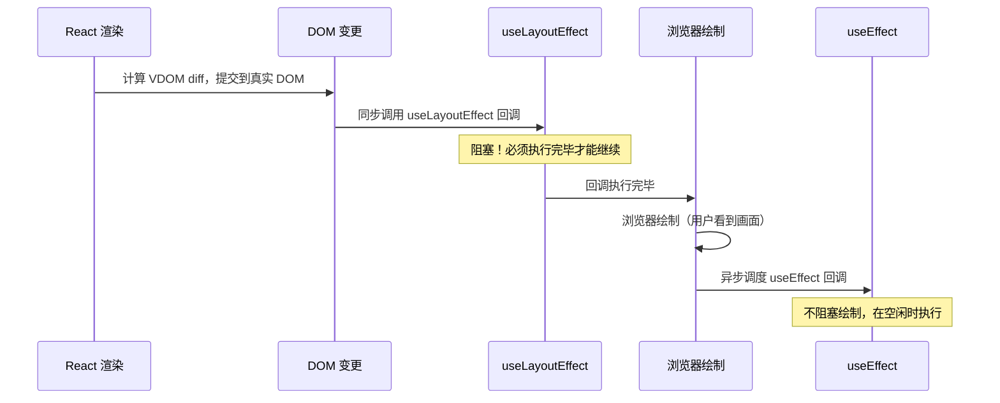

# 05 - 进阶 Hooks

> 对应大纲模块 5 | 预计时间：1 天
> 面试可答：`useLayoutEffect` 在 DOM 变更后同步执行（浏览器绘制前），适合读取布局；`useTransition` 标记低优先级更新避免阻塞 UI。

---

## 学习目标

- 深入理解 `useLayoutEffect` 与 `useEffect` 的执行时序差异及性能影响
- 掌握 `useTransition` 标记低优先级更新，优化大列表交互体验
- 掌握 `useDeferredValue` 延迟非紧急值的更新
- 了解 `useImperativeHandle`、`useId`、`useSyncExternalStore` 的适用场景
- 面试时能解释 React 18 并发特性的设计动机

---

## 核心概念

### 1. useLayoutEffect vs useEffect

模块 2 中已简要介绍过 `useLayoutEffect`，本篇深入其**执行时序**和**性能影响**。

#### 执行时机差异

- **useEffect**：在浏览器**绘制后**异步执行，不阻塞渲染
- **useLayoutEffect**：在 DOM 变更后、浏览器**绘制前**同步执行，会阻塞渲染



**关键区别**：如果在 `useEffect` 中读取 DOM 尺寸再 `setState`，用户会先看到一帧"错误"画面（闪烁），然后才看到正确值。`useLayoutEffect` 在绘制前同步完成，用户只看到最终结果。

#### 适用场景对比

| 维度 | useEffect | useLayoutEffect |
|------|-----------|-----------------|
| 执行时机 | 浏览器绘制**后**（异步） | DOM 变更后、绘制**前**（同步） |
| 是否阻塞渲染 | 否 | 是 |
| 数据请求 | ✅ 适合 | ❌ 不适合（阻塞绘制） |
| 订阅/事件监听 | ✅ 适合 | ❌ 不必要 |
| 读取 DOM 布局（尺寸/位置） | ⚠️ 可能闪烁 | ✅ 适合 |
| 同步修改 DOM 样式 | ⚠️ 可能闪烁 | ✅ 适合 |
| 日志/埋点 | ✅ 适合 | ❌ 不必要 |

#### 代码示例：测量 DOM 尺寸避免闪烁

```tsx
import { useLayoutEffect, useEffect, useRef, useState } from 'react';

// ❌ 用 useEffect：用户可能看到一帧 width=0 的画面
function MeasureBoxBad() {
  const ref = useRef<HTMLDivElement>(null);
  const [width, setWidth] = useState(0);

  useEffect(() => {
    if (ref.current) {
      setWidth(ref.current.getBoundingClientRect().width);
    }
  }, []);

  return <div ref={ref}>宽度：{width}px</div>;
}

// ✅ 用 useLayoutEffect：绘制前同步完成测量，用户直接看到正确值
function MeasureBoxGood() {
  const ref = useRef<HTMLDivElement>(null);
  const [width, setWidth] = useState(0);

  useLayoutEffect(() => {
    if (ref.current) {
      setWidth(ref.current.getBoundingClientRect().width);
    }
  }, []);

  return <div ref={ref}>宽度：{width}px</div>;
}
```

**面试回答**：什么时候用 `useLayoutEffect`？当需要在浏览器绘制前**同步读取或修改 DOM 布局**时使用——典型场景是测量元素尺寸/位置后设置状态（如 Tooltip 定位、动态宽度）。如果用 `useEffect`，用户可能看到一帧中间态（闪烁）。其他场景（数据请求、订阅、日志）一律用 `useEffect`，因为 `useLayoutEffect` 会阻塞绘制。

### 2. useTransition（React 18 并发特性）

#### 紧急更新 vs 过渡更新

React 18 引入了**并发渲染**，将状态更新分为两类：

| 类型 | 说明 | 示例 |
|------|------|------|
| **紧急更新**（Urgent） | 用户期望立即看到反馈 | 输入框显示当前输入值 |
| **过渡更新**（Transition） | 可以延迟，不阻塞交互 | 根据输入过滤 10000 条列表 |

`useTransition` 让你把某些更新标记为**过渡更新**，React 会优先处理紧急更新，过渡更新可被打断和重启。

#### API

```tsx
const [isPending, startTransition] = useTransition();
```

- `startTransition(fn)`：将 `fn` 内的 `setState` 标记为过渡更新
- `isPending`：过渡更新是否正在进行中（用于显示 loading）

#### 代码示例：大列表过滤

```tsx
import { useState, useTransition } from 'react';

// 生成 10000 条模拟数据
const ITEMS: string[] = Array.from({ length: 10000 }, (_, i) => `Item ${i + 1}`);

function FilterableList() {
  const [query, setQuery] = useState('');
  const [filteredList, setFilteredList] = useState<string[]>(ITEMS);
  const [isPending, startTransition] = useTransition();

  const handleChange = (e: React.ChangeEvent<HTMLInputElement>) => {
    const value = e.target.value;

    // 紧急更新：输入框立即响应
    setQuery(value);

    // 过渡更新：列表过滤可以延迟，不阻塞输入
    startTransition(() => {
      const filtered = ITEMS.filter(item =>
        item.toLowerCase().includes(value.toLowerCase())
      );
      setFilteredList(filtered);
    });
  };

  return (
    <div>
      <input
        value={query}
        onChange={handleChange}
        placeholder="输入关键词过滤..."
        style={{ width: '100%', padding: 8, fontSize: 16 }}
      />

      {isPending && <p style={{ color: '#999' }}>过滤中...</p>}

      <ul style={{ opacity: isPending ? 0.5 : 1 }}>
        {filteredList.map(item => (
          <li key={item}>{item}</li>
        ))}
      </ul>
    </div>
  );
}
```

**效果**：输入框始终流畅响应（紧急更新），列表过滤在后台进行（过渡更新），过滤期间显示半透明 + "过滤中..."提示。

#### 与 setTimeout 的区别

```tsx
// ❌ setTimeout：延迟执行，但一旦开始就不能打断
const handleChange = (value: string) => {
  setQuery(value);
  setTimeout(() => {
    setFilteredList(ITEMS.filter(/* ... */)); // 不可打断，必须执行完
  }, 0);
};

// ✅ startTransition：标记为低优先级，可被新的紧急更新打断
const handleChange = (value: string) => {
  setQuery(value);
  startTransition(() => {
    setFilteredList(ITEMS.filter(/* ... */)); // 可被打断，重新执行
  });
};
```

| 维度 | setTimeout | startTransition |
|------|-----------|-----------------|
| 可被打断 | ❌ 一旦执行不可中断 | ✅ 可被新的紧急更新打断 |
| 延迟方式 | 固定延迟（即使 UI 空闲） | 由 React 调度（空闲时立即执行） |
| isPending 状态 | ❌ 需手动管理 | ✅ 内置 |
| 连续输入时 | 每次都会执行（需手动 debounce） | 自动丢弃过时的过渡更新 |

**面试常问**：在 React 18 中，`startTransition` 内的 `setState` 必须是**同步的**，不能包裹 `async/await` 或 `setTimeout`——否则 React 无法追踪该更新为过渡更新。

> **React 19 更新**：React 19 的 `useTransition` 已支持 async 函数——`startTransition(async () => { const data = await fetchData(); setList(data); })` 是合法的，React 会追踪整个异步流程为过渡更新。但在 React 18 项目中仍需遵循"同步 setState"的约束。

### 3. useDeferredValue（React 18 并发特性）

`useDeferredValue` 接收一个值，返回该值的**延迟版本**。当有更紧急的更新时，延迟版本会"落后"于原始值，等紧急更新处理完后再追上。

#### 代码示例：搜索输入 + 大列表

```tsx
import { useState, useDeferredValue, useMemo } from 'react';

const ITEMS: string[] = Array.from({ length: 10000 }, (_, i) => `Item ${i + 1}`);

function SearchList() {
  const [query, setQuery] = useState('');

  // deferredQuery 在紧急更新（输入）处理完后才更新
  const deferredQuery = useDeferredValue(query);

  // 判断是否正在"追赶"（延迟值尚未同步）
  const isStale = query !== deferredQuery;

  const filteredList = useMemo(
    () => ITEMS.filter(item =>
      item.toLowerCase().includes(deferredQuery.toLowerCase())
    ),
    [deferredQuery]
  );

  return (
    <div>
      <input
        value={query}
        onChange={e => setQuery(e.target.value)}
        placeholder="搜索..."
        style={{ width: '100%', padding: 8, fontSize: 16 }}
      />

      <ul style={{ opacity: isStale ? 0.5 : 1 }}>
        {filteredList.map(item => (
          <li key={item}>{item}</li>
        ))}
      </ul>
    </div>
  );
}
```

#### useDeferredValue vs useTransition 对比

| 维度 | useTransition | useDeferredValue |
|------|--------------|-----------------|
| 控制对象 | 状态**更新过程** | 一个**值** |
| 使用位置 | 在 `setState` 调用处包裹 | 在消费值的地方调用 |
| 适用场景 | 你能控制 `setState` 的调用 | 值来自 props 或外部，你无法控制更新 |
| isPending | ✅ 内置 | ❌ 需手动比较（`value !== deferredValue`） |
| 典型用法 | `startTransition(() => setState(...))` | `const deferred = useDeferredValue(value)` |

**选择建议**：

```
能控制 setState 调用 → useTransition（更精确，有 isPending）
不能控制（值来自 props / 第三方库） → useDeferredValue（在消费侧延迟）
```

**面试回答**：`useTransition` 是在"产生更新"时标记优先级，`useDeferredValue` 是在"消费值"时延迟响应。如果你拥有 `setState` 的调用权，用 `useTransition`；如果值是从 props 传入的（你无法控制父组件何时更新），用 `useDeferredValue`。

### 4. 扩展阅读

#### useImperativeHandle + forwardRef

默认情况下父组件通过 `ref` 只能拿到 DOM 节点。`useImperativeHandle` 可以自定义暴露给父组件的实例方法：

```tsx
import { forwardRef, useImperativeHandle, useRef } from 'react';

interface PlayerHandle {
  play: () => void;
  pause: () => void;
}

const VideoPlayer = forwardRef<PlayerHandle, { src: string }>((props, ref) => {
  const videoRef = useRef<HTMLVideoElement>(null);

  useImperativeHandle(ref, () => ({
    play: () => videoRef.current?.play(),
    pause: () => videoRef.current?.pause(),
  }), []);

  return <video ref={videoRef} src={props.src} />;
});
```

一句话：只暴露 `play`/`pause` 方法，隐藏内部 DOM 结构，实现**封装**。

#### useId

生成在 SSR 和 CSR 中都稳定且唯一的 ID，避免服务端/客户端 hydration 不匹配：

```tsx
import { useId } from 'react';

function EmailField() {
  const id = useId();
  return (
    <>
      <label htmlFor={id}>邮箱</label>
      <input id={id} type="email" />
    </>
  );
}
```

一句话：替代手动维护的全局计数器，SSR 安全。

#### useSyncExternalStore

订阅 React 外部的数据源（如浏览器 API、第三方状态库），保证并发模式下不会出现撕裂（tearing）：

```tsx
import { useSyncExternalStore } from 'react';

function useOnlineStatus(): boolean {
  return useSyncExternalStore(
    (callback) => {
      window.addEventListener('online', callback);
      window.addEventListener('offline', callback);
      return () => {
        window.removeEventListener('online', callback);
        window.removeEventListener('offline', callback);
      };
    },
    () => navigator.onLine,       // getSnapshot（客户端）
    () => true                     // getServerSnapshot（SSR）
  );
}
```

一句话：让外部数据源（非 React state）也能安全参与并发渲染。

---

## 常见踩坑点

### 1. useLayoutEffect 中执行耗时操作阻塞渲染

```tsx
// ❌ 问题：耗时计算在绘制前同步执行，页面卡死
useLayoutEffect(() => {
  // 对 10 万条数据排序（耗时 200ms+）
  const sorted = hugeArray.sort((a, b) => a.value - b.value);
  setSortedData(sorted);
}, [hugeArray]);

// ✅ 正确：耗时计算放 useEffect（不阻塞绘制），或用 useTransition 标记
useEffect(() => {
  const sorted = hugeArray.sort((a, b) => a.value - b.value);
  setSortedData(sorted);
}, [hugeArray]);
```

`useLayoutEffect` 只适合**轻量同步操作**（读取 `getBoundingClientRect`、设置 `style`），耗时逻辑会阻塞浏览器绘制。

### 2. useTransition 与异步操作（React 18）

```tsx
// ❌ React 18 中的问题：await 之后的 setState 不再被 React 追踪为过渡更新
startTransition(async () => {
  const data = await fetchData(); // 异步！
  setList(data); // React 18 中这个更新不是过渡更新
});

// ✅ React 18 正确写法：异步操作放外面，只把同步 setState 包在 startTransition 内
const data = await fetchData();
startTransition(() => {
  setList(data); // 同步 setState，正确标记为过渡更新
});

// ✅ React 19：startTransition 原生支持 async，整个异步流程都是过渡更新
startTransition(async () => {
  const data = await fetchData();
  setList(data); // React 19 中正确追踪为过渡更新
});
```

### 3. useDeferredValue 首次渲染不延迟

```tsx
function List({ query }: { query: string }) {
  const deferredQuery = useDeferredValue(query);

  // ⚠️ 首次渲染时 deferredQuery === query（不会延迟）
  // 只有后续更新时才会出现"落后"
  // 不要依赖 isStale 在首次渲染时做特殊处理
  const isStale = query !== deferredQuery; // 首次渲染永远为 false
}
```

这是设计如此——首次渲染没有"更紧急的更新"需要优先处理，所以延迟值直接等于原始值。

### 4. 滥用 useLayoutEffect

```tsx
// ❌ 问题：数据请求不需要在绘制前完成
useLayoutEffect(() => {
  fetch('/api/data').then(res => res.json()).then(setData);
}, []);

// ❌ 问题：日志记录不需要阻塞渲染
useLayoutEffect(() => {
  console.log('组件已挂载');
  trackPageView();
}, []);

// ✅ 正确：这些场景用 useEffect 即可
useEffect(() => {
  fetch('/api/data').then(res => res.json()).then(setData);
}, []);

useEffect(() => {
  trackPageView();
}, []);
```

**原则**：只有"需要在用户看到画面之前同步完成的 DOM 读取/修改"才用 `useLayoutEffect`，其他一律 `useEffect`。

---

## 面试高频问题

### Q1：useLayoutEffect 和 useEffect 的区别？什么时候用哪个？

**答**：两者签名完全相同，区别在执行时机。`useEffect` 在浏览器绘制后异步执行，不阻塞渲染；`useLayoutEffect` 在 DOM 变更后、浏览器绘制前同步执行，会阻塞渲染。需要在绘制前同步读取/修改 DOM 布局时用 `useLayoutEffect`（如测量元素尺寸、Tooltip 定位），其他场景（数据请求、订阅、日志）用 `useEffect`。滥用 `useLayoutEffect` 会导致页面卡顿。

### Q2：useTransition 解决了什么问题？和 setTimeout 有什么区别？

**答**：`useTransition` 解决"大计算量更新阻塞用户交互"的问题。比如输入框每次 onChange 都触发 10000 条列表的过滤，如果同步执行，输入框会卡顿。`startTransition` 将列表更新标记为低优先级，React 优先处理输入框的紧急更新，列表更新在空闲时执行。与 `setTimeout` 的区别：(1) `startTransition` 的更新可被新的紧急更新打断，`setTimeout` 一旦执行不可中断；(2) `startTransition` 由 React 调度器决定执行时机，`setTimeout` 是固定延迟；(3) `useTransition` 内置 `isPending` 状态。

### Q3：useDeferredValue 和 useTransition 怎么选？

**答**：核心区别是控制点不同。`useTransition` 在"产生更新"时标记优先级（包裹 `setState` 调用），适合你能控制状态更新的场景。`useDeferredValue` 在"消费值"时延迟响应，适合值来自 props 或外部、你无法控制更新时机的场景。如果你拥有 `setState` 的调用权，优先用 `useTransition`（有 `isPending`，更精确）；否则用 `useDeferredValue`。

### Q4：React 18 的并发特性（Concurrent Features）有哪些？

**答**：React 18 的并发特性包括：(1) `useTransition` / `startTransition`——标记低优先级更新，避免阻塞紧急交互；(2) `useDeferredValue`——延迟一个值的更新，让 UI 先响应紧急更新；(3) Suspense 增强——支持服务端流式渲染（Streaming SSR）；(4) 自动批处理（Automatic Batching）——在 setTimeout、Promise 回调中的多次 setState 也会合并为一次渲染。设计动机是让 React 能区分更新的优先级，紧急更新（用户输入）不被低优先级更新（大列表渲染）阻塞，从而保持 UI 响应。

---

## 面试回答模板

> **问：useLayoutEffect 和 useEffect 的区别？**
>
> 两者 API 签名完全相同，区别在执行时机。React 渲染流程是：计算 VDOM → 提交 DOM 变更 → 执行 `useLayoutEffect`（同步）→ 浏览器绘制 → 执行 `useEffect`（异步）。
>
> `useLayoutEffect` 在绘制前同步执行，会阻塞渲染；`useEffect` 在绘制后异步执行，不阻塞。所以需要在用户看到画面之前同步读取或修改 DOM 布局时用 `useLayoutEffect`，典型场景是测量元素尺寸后定位 Tooltip——如果用 `useEffect`，用户会先看到一帧错误位置（闪烁）。
>
> 但 `useLayoutEffect` 不能滥用，数据请求、日志、订阅等不涉及布局的场景一律用 `useEffect`，否则会阻塞绘制导致页面卡顿。
>
> **追问：SSR 中 useLayoutEffect 会怎样？**
>
> SSR 时 `useLayoutEffect` 不会执行（服务端没有 DOM），React 会在控制台输出警告。如果需要 SSR 兼容，可以用 `useIsomorphicLayoutEffect` 模式：服务端用 `useEffect`，客户端用 `useLayoutEffect`。

> **问：介绍一下 React 18 的并发特性？**
>
> React 18 的核心升级是并发渲染（Concurrent Rendering），让 React 能同时准备多个版本的 UI，并按优先级处理更新。
>
> 主要 API：`useTransition` 将状态更新标记为低优先级（过渡更新），紧急更新（如输入框）不被阻塞；`useDeferredValue` 延迟一个值的更新，适合无法控制 setState 调用权的场景（如值来自 props）。
>
> 与 `setTimeout` / `debounce` 的本质区别：并发更新是**可打断**的——如果用户继续输入，React 会丢弃过时的过渡更新，重新执行最新的。而 `setTimeout` 一旦触发就必须执行完。
>
> 设计动机：传统 React 渲染是同步不可中断的，一旦开始渲染 10000 个列表项，用户输入就得等渲染完才能响应。并发特性让 React 能"边渲染边响应用户"，保持 UI 流畅。

---

## 练习

### 练习 1：useLayoutEffect 实现 Tooltip 定位 Hook

**要求**：实现 `useTooltipPosition` Hook，测量触发元素的位置，计算 tooltip 的绝对定位坐标，确保 tooltip 出现时不会闪烁

**提示**：用 `useRef` 获取触发元素引用，`useLayoutEffect` 中调用 `getBoundingClientRect()` 读取位置，计算 tooltip 应出现在元素正上方居中

**预期效果**：hover 按钮时 tooltip 直接出现在正确位置（无闪烁），tooltip 显示在触发元素正上方、水平居中

```tsx
import { useLayoutEffect, useRef, useState, useCallback } from 'react';

interface Position {
  top: number;
  left: number;
}

function useTooltipPosition<T extends HTMLElement>() {
  const triggerRef = useRef<T>(null);
  const tooltipRef = useRef<HTMLDivElement>(null);
  const [position, setPosition] = useState<Position>({ top: 0, left: 0 });
  const [visible, setVisible] = useState(false);

  // 在绘制前同步计算位置，避免闪烁
  useLayoutEffect(() => {
    if (!visible || !triggerRef.current || !tooltipRef.current) return;

    const triggerRect = triggerRef.current.getBoundingClientRect();
    const tooltipRect = tooltipRef.current.getBoundingClientRect();

    setPosition({
      // tooltip 出现在触发元素正上方，间距 8px
      top: triggerRect.top - tooltipRect.height - 8,
      // 水平居中
      left: triggerRect.left + (triggerRect.width - tooltipRect.width) / 2,
    });
  }, [visible]);

  const show = useCallback(() => setVisible(true), []);
  const hide = useCallback(() => setVisible(false), []);

  return { triggerRef, tooltipRef, position, visible, show, hide };
}

// 使用示例
function TooltipDemo() {
  const { triggerRef, tooltipRef, position, visible, show, hide } =
    useTooltipPosition<HTMLButtonElement>();

  return (
    <div style={{ padding: 100, textAlign: 'center' }}>
      <button
        ref={triggerRef}
        onMouseEnter={show}
        onMouseLeave={hide}
      >
        悬停显示 Tooltip
      </button>

      {visible && (
        <div
          ref={tooltipRef}
          style={{
            position: 'fixed',
            top: position.top,
            left: position.left,
            background: '#333',
            color: '#fff',
            padding: '6px 12px',
            borderRadius: 4,
            fontSize: 14,
            whiteSpace: 'nowrap',
          }}
        >
          这是一段提示文字
        </div>
      )}
    </div>
  );
}
```

### 练习 2：useTransition 实现大数据量列表实时过滤

**要求**：生成 10000 条数据，输入框实时过滤，要求输入框不卡顿，过滤期间显示 loading 状态

**提示**：输入框的 `setState` 是紧急更新（直接调用），列表过滤的 `setState` 包在 `startTransition` 内；用 `isPending` 控制 loading 样式

**预期效果**：快速输入时输入框始终流畅，列表区域在过滤期间显示半透明 + "过滤中..."，过滤完成后恢复正常

```tsx
import { useState, useTransition } from 'react';

// 生成 10000 条模拟数据
const ALL_ITEMS: string[] = Array.from(
  { length: 10000 },
  (_, i) => `商品 ${i + 1} - ${['手机', '电脑', '耳机', '平板', '手表'][i % 5]}`
);

function BigListFilter() {
  const [query, setQuery] = useState('');
  const [items, setItems] = useState<string[]>(ALL_ITEMS);
  const [isPending, startTransition] = useTransition();

  const handleChange = (e: React.ChangeEvent<HTMLInputElement>) => {
    const value = e.target.value;

    // 紧急更新：输入框立即响应，不等待过滤完成
    setQuery(value);

    // 过渡更新：过滤 10000 条数据，可被打断
    startTransition(() => {
      if (!value) {
        setItems(ALL_ITEMS);
        return;
      }
      const filtered = ALL_ITEMS.filter(item =>
        item.toLowerCase().includes(value.toLowerCase())
      );
      setItems(filtered);
    });
  };

  return (
    <div style={{ maxWidth: 600, margin: '0 auto' }}>
      <h2>商品搜索（10000 条数据）</h2>

      <input
        value={query}
        onChange={handleChange}
        placeholder="输入关键词过滤..."
        style={{ width: '100%', padding: 10, fontSize: 16, boxSizing: 'border-box' }}
      />

      <div style={{ margin: '8px 0', color: '#666', fontSize: 14 }}>
        {isPending ? '过滤中...' : `共 ${items.length} 条结果`}
      </div>

      <ul
        style={{
          listStyle: 'none',
          padding: 0,
          maxHeight: 400,
          overflow: 'auto',
          opacity: isPending ? 0.5 : 1,
          transition: 'opacity 0.2s',
        }}
      >
        {items.map(item => (
          <li
            key={item}
            style={{ padding: '8px 12px', borderBottom: '1px solid #eee' }}
          >
            {item}
          </li>
        ))}
      </ul>
    </div>
  );
}
```

---

## 本模块完成标准

- [ ] 能解释 useLayoutEffect 和 useEffect 的执行时机差异
- [ ] 能用 useTransition 优化大列表渲染性能
- [ ] 理解 useDeferredValue 的适用场景
- [ ] 面试时能解释 React 18 并发特性的设计动机
