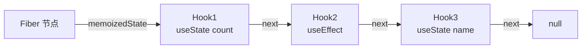
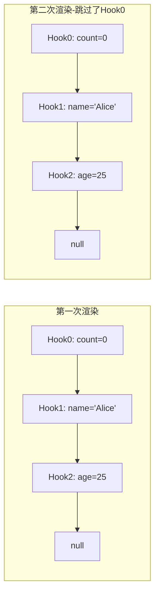

# 06 - Hooks 原理与规则

> 对应大纲模块 6 | 预计时间：1 天
> 面试可答：Hooks 基于链表存储，每次渲染按顺序调用，所以不能在条件/循环中使用。

---

## 学习目标

- 理解 Hooks 底层数据结构（Fiber + 链表）
- 掌握 Hooks 调用顺序限制的根本原因
- 熟悉 `eslint-plugin-react-hooks` 的两条规则
- 理解每次渲染都是独立闭包的机制
- 能排查闭包陷阱、依赖遗漏、无限循环等常见 Bug
- 面试时能解释 Hooks 底层机制

---

## 核心概念

### 1. Hooks 底层数据结构：链表

每个函数组件对应一个 **Fiber 节点**，Fiber 节点上的 `memoizedState` 字段存储了该组件所有 Hooks 的**链表**。



每个 Hook 对象的结构：

```tsx
// React 源码中 Hook 对象的简化结构
interface Hook {
  memoizedState: any;   // 当前状态值（useState 的值 / useEffect 的 effect 对象）
  baseState: any;       // 基础状态（用于并发模式下的中断恢复）
  queue: UpdateQueue;   // 更新队列（存储待处理的 setState 调用）
  next: Hook | null;    // 指向下一个 Hook（链表指针）
}
```

**React 内部如何存储 useState（伪代码）**：

```tsx
// 简化的 React 内部实现
let hookIndex = 0;
let hooks: Array<{ memoizedState: any; queue: Array<(prev: any) => any> }> = [];

function useState<T>(initialValue: T): [T, (value: T | ((prev: T) => T)) => void] {
  const currentIndex = hookIndex;

  // 首次渲染：创建 Hook 节点
  if (hooks[currentIndex] === undefined) {
    hooks[currentIndex] = { memoizedState: initialValue, queue: [] };
  }

  const hook = hooks[currentIndex];

  // 处理队列中的更新
  hook.queue.forEach(action => {
    hook.memoizedState =
      typeof action === 'function'
        ? (action as (prev: T) => T)(hook.memoizedState)
        : action;
  });
  hook.queue = [];

  const setState = (value: T | ((prev: T) => T)) => {
    hook.queue.push(value as any);
    render(); // 触发重渲染
  };

  hookIndex++; // 移动到下一个 Hook
  return [hook.memoizedState, setState];
}

function render() {
  hookIndex = 0; // 重置索引，从头遍历链表
  // 重新执行组件函数...
}
```

**面试回答**：Hooks 不是用"名字"来标识的，而是用**调用顺序**（链表中的位置）来标识。这就是为什么 Hooks 必须按固定顺序调用。

### 2. 为什么 Hooks 有调用顺序限制

每次渲染时，React 按顺序遍历链表来匹配 Hook。如果调用顺序变了，链表匹配就**错位**了。

```tsx
import { useState } from 'react';

// ❌ 条件调用导致状态错位
function BadExample({ showExtra }: { showExtra: boolean }) {
  const [name, setName] = useState<string>('Alice');

  // 当 showExtra 为 true 时，多了一个 Hook 调用
  if (showExtra) {
    const [extra, setExtra] = useState<string>('extra'); // 位置不固定！
  }

  const [age, setAge] = useState<number>(25);

  return <div>{name} - {age}</div>;
}
```

**错位过程**：

```
第一次渲染（showExtra = false）：
  链表：Hook0(name) → Hook1(age) → null
  调用：useState('Alice')  → 匹配 Hook0 ✅
        useState(25)       → 匹配 Hook1 ✅

第二次渲染（showExtra = true）：
  链表：Hook0(name) → Hook1(age) → null（链表结构不变）
  调用：useState('Alice')  → 匹配 Hook0 ✅
        useState('extra')  → 匹配 Hook1 ❌ 拿到了 age 的状态！
        useState(25)       → 匹配 Hook2 ❌ 不存在，报错！
```

**对比 Class 组件**：

| 特性 | 函数组件（Hooks） | Class 组件 |
|------|------------------|-----------|
| 状态标识方式 | 调用顺序（链表位置） | 名字（`this.state.xxx`） |
| 条件使用 | ❌ 不允许 | ✅ 随意条件访问 |
| 原因 | 链表按序匹配 | 对象按 key 查找 |

```tsx
// Class 组件：按名字访问，不依赖顺序
class GoodClass extends React.Component {
  state = { name: 'Alice', age: 25 };

  render() {
    // 可以随意条件访问，因为是通过 key 查找
    const info = this.props.showExtra
      ? { ...this.state, extra: 'data' }
      : this.state;
    return <div>{info.name}</div>;
  }
}
```

**面试常问**：为什么 React 团队选择链表而不是 Map（按名字存储）？因为链表内存开销小、无需开发者手动命名，且强制顺序调用反而让代码更可预测。代价是需要 ESLint 规则来约束开发者。

### 3. 为什么不能在条件语句/循环中调用 Hooks

#### 错误示例

```tsx
import { useState, useEffect } from 'react';

// ❌ 在条件语句中调用
function BadConditional({ loggedIn }: { loggedIn: boolean }) {
  if (loggedIn) {
    const [user, setUser] = useState<string>(''); // 条件调用！
  }

  const [count, setCount] = useState<number>(0); // 顺序可能错位
  return <div>{count}</div>;
}

// ❌ 在循环中调用
function BadLoop({ items }: { items: string[] }) {
  for (const item of items) {
    const [value, setValue] = useState<string>(item); // 循环调用！
  }
  return <div />;
}

// ❌ 在嵌套函数中调用
function BadNested() {
  const handleClick = () => {
    const [visible, setVisible] = useState<boolean>(false); // 嵌套调用！
  };
  return <button onClick={handleClick}>点击</button>;
}
```

#### 正确示例

```tsx
import { useState, useEffect } from 'react';

// ✅ 条件逻辑放在 Hook 内部
function GoodConditional({ loggedIn }: { loggedIn: boolean }) {
  const [user, setUser] = useState<string>(''); // 始终调用
  const [count, setCount] = useState<number>(0); // 顺序固定

  // 条件逻辑放在 effect 或事件处理中
  useEffect(() => {
    if (loggedIn) {
      setUser('Alice');
    }
  }, [loggedIn]);

  return <div>{user} - {count}</div>;
}

// ✅ 循环 → 抽取为子组件
function GoodLoop({ items }: { items: string[] }) {
  return (
    <div>
      {items.map(item => (
        <ItemComponent key={item} initialValue={item} />
      ))}
    </div>
  );
}

function ItemComponent({ initialValue }: { initialValue: string }) {
  const [value, setValue] = useState<string>(initialValue); // 每个组件有自己的 Hook 链表
  return <span>{value}</span>;
}
```

#### 用链表图解释"少调用一个 Hook 后面全乱了"



```
第一次渲染（正常）：
  useState(0)      → Hook0 → count = 0 ✅
  useState('Alice') → Hook1 → name = 'Alice' ✅
  useState(25)     → Hook2 → age = 25 ✅

第二次渲染（条件跳过了第一个 useState）：
  useState('Alice') → Hook0 → 拿到 count 的值 0 ❌（期望 'Alice'）
  useState(25)      → Hook1 → 拿到 name 的值 'Alice' ❌（期望 25）
  （没有第三次调用）→ Hook2 → 永远不会被访问 ❌
```

**替代方案总结**：把条件逻辑放在 Hook **内部**（effect 里、事件处理里），而不是把 Hook 放在条件里。

### 4. eslint-plugin-react-hooks 的两条规则

React 官方提供了 ESLint 插件来强制执行 Hooks 规则：

| 规则 | 说明 |
|------|------|
| `rules-of-hooks` | 只在顶层调用 Hooks（不在条件/循环/嵌套函数中） |
| `exhaustive-deps` | useEffect/useMemo/useCallback 的依赖数组必须完整 |

#### 配置示例

```json
// .eslintrc.json
{
  "plugins": ["react-hooks"],
  "rules": {
    "react-hooks/rules-of-hooks": "error",
    "react-hooks/exhaustive-deps": "warn"
  }
}
```

如果使用 ESLint flat config（`eslint.config.js`）：

```tsx
// eslint.config.js
import reactHooks from 'eslint-plugin-react-hooks';

export default [
  {
    plugins: { 'react-hooks': reactHooks },
    rules: {
      'react-hooks/rules-of-hooks': 'error',
      'react-hooks/exhaustive-deps': 'warn',
    },
  },
];
```

#### 常见报错信息及修复

**报错 1**：`React Hook "useState" is called conditionally.`

```tsx
// ❌ 触发报错
function App({ flag }: { flag: boolean }) {
  if (flag) {
    const [value, setValue] = useState(''); // 报错！
  }
}

// ✅ 修复：移到顶层
function App({ flag }: { flag: boolean }) {
  const [value, setValue] = useState('');
}
```

**报错 2**：`React Hook "useEffect" has a missing dependency: 'userId'`

```tsx
// ❌ 触发警告
function App({ userId }: { userId: string }) {
  useEffect(() => {
    fetchUser(userId); // 使用了 userId 但没声明依赖
  }, []);
}

// ✅ 修复：补全依赖
function App({ userId }: { userId: string }) {
  useEffect(() => {
    fetchUser(userId);
  }, [userId]);
}
```

**报错 3**：`React Hook "useCallback" is called in a nested function.`

```tsx
// ❌ 触发报错
function App() {
  const setup = () => {
    const handler = useCallback(() => {}, []); // 报错！
  };
}

// ✅ 修复：移到组件顶层
function App() {
  const handler = useCallback(() => {}, []);
}
```

**面试常问**：`exhaustive-deps` 设为 `warn` 还是 `error`？推荐 `warn`——有些场景确实需要"故意"省略依赖（如只想在挂载时执行一次），此时可以加 `// eslint-disable-next-line` 注释并写明原因。

### 5. 渲染机制：每次渲染都是独立的闭包

**核心思想**：每次渲染时，所有 state/props 都是该次渲染的"快照"。事件处理函数捕获的是**创建时**的 state，而不是最新的 state。

```tsx
import { useState } from 'react';

function ClosureDemo() {
  const [count, setCount] = useState<number>(0);

  const handleClick = () => {
    // 这个 count 是本次渲染时的快照
    setTimeout(() => {
      console.log(`3 秒后打印：${count}`); // 捕获的是点击时的 count
    }, 3000);
  };

  return (
    <div>
      <p>当前 count：{count}</p>
      <button onClick={() => setCount(prev => prev + 1)}>+1</button>
      <button onClick={handleClick}>3 秒后打印 count</button>
    </div>
  );
}
```

**执行过程**：

```
1. 页面显示 count = 0
2. 点击"3 秒后打印 count"→ 闭包捕获 count = 0
3. 立即点击 +1 三次 → count 变为 3，页面更新
4. 3 秒后 → 打印 0（不是 3！因为闭包捕获的是步骤 2 时的快照）
```

#### 解决方案一：函数式更新

```tsx
import { useState } from 'react';

function FunctionalUpdate() {
  const [count, setCount] = useState<number>(0);

  const handleClick = () => {
    setTimeout(() => {
      // ✅ 函数式更新：拿到的是最新的 state
      setCount(prev => {
        console.log(`3 秒后的最新值：${prev}`);
        return prev + 1;
      });
    }, 3000);
  };

  return (
    <div>
      <p>count：{count}</p>
      <button onClick={() => setCount(prev => prev + 1)}>+1</button>
      <button onClick={handleClick}>3 秒后 +1 并打印</button>
    </div>
  );
}
```

#### 解决方案二：useRef 保存最新值

```tsx
import { useState, useRef, useEffect } from 'react';

function RefSolution() {
  const [count, setCount] = useState<number>(0);
  const countRef = useRef<number>(count);

  // 每次渲染后同步最新值到 ref
  useEffect(() => {
    countRef.current = count;
  }, [count]);

  const handleClick = () => {
    setTimeout(() => {
      // ✅ ref.current 始终是最新值
      console.log(`3 秒后的最新值：${countRef.current}`);
    }, 3000);
  };

  return (
    <div>
      <p>count：{count}</p>
      <button onClick={() => setCount(prev => prev + 1)}>+1</button>
      <button onClick={handleClick}>3 秒后打印</button>
    </div>
  );
}
```

**面试回答**：闭包不是 Bug，而是 JavaScript 的正常行为。React 每次渲染产生新的函数作用域，事件处理函数捕获的是定义时的变量。需要最新值时，用函数式更新（`setState(prev => ...)`）或 `useRef`。

---

## 常见 Bug 排查清单

### Bug 1：闭包陷阱 — effect 中拿到过期的 state

**症状**：`setInterval` 或 `setTimeout` 中读取的 state 永远是初始值。

```tsx
// ❌ 问题代码
function Timer() {
  const [count, setCount] = useState<number>(0);

  useEffect(() => {
    const timer = setInterval(() => {
      console.log(count); // 永远打印 0
      setCount(count + 1); // 永远设为 1
    }, 1000);
    return () => clearInterval(timer);
  }, []); // 空依赖：effect 只在挂载时执行，闭包捕获 count = 0

  return <p>{count}</p>;
}
```

**原因**：空依赖数组使 effect 只在挂载时执行一次，闭包捕获的 `count` 永远是初始值 `0`。

**修复**：

```tsx
// ✅ 方案一：函数式更新
useEffect(() => {
  const timer = setInterval(() => {
    setCount(prev => prev + 1); // 基于最新状态
  }, 1000);
  return () => clearInterval(timer);
}, []);

// ✅ 方案二：useRef 保存最新值
const countRef = useRef(count);
useEffect(() => { countRef.current = count; }, [count]);

useEffect(() => {
  const timer = setInterval(() => {
    console.log(countRef.current); // 始终是最新值
  }, 1000);
  return () => clearInterval(timer);
}, []);
```

### Bug 2：依赖数组遗漏 — effect 不响应变化

**症状**：props 或 state 变了，但 effect 没有重新执行。

```tsx
// ❌ 问题代码
function SearchResults({ query }: { query: string }) {
  const [results, setResults] = useState<string[]>([]);

  useEffect(() => {
    fetch(`/api/search?q=${query}`)
      .then(res => res.json())
      .then(setResults);
  }, []); // 缺少 query 依赖！只在挂载时请求一次

  return <ul>{results.map(r => <li key={r}>{r}</li>)}</ul>;
}
```

**原因**：依赖数组为空，effect 只在挂载时执行。`query` 变化后不会重新请求。

**修复**：

```tsx
// ✅ 补全依赖
useEffect(() => {
  fetch(`/api/search?q=${query}`)
    .then(res => res.json())
    .then(setResults);
}, [query]); // query 变化时重新请求
```

### Bug 3：无限循环 — effect 中 setState 且依赖是对象

**症状**：页面卡死，控制台疯狂输出，浏览器提示 "Too many re-renders"。

```tsx
// ❌ 问题代码
function InfiniteLoop() {
  const [data, setData] = useState<{ items: string[] }>({ items: [] });

  useEffect(() => {
    // 每次渲染都创建新对象 → 引用变化 → 触发 effect → setState → 重渲染 → 循环
    setData({ items: ['a', 'b', 'c'] });
  }, [data]); // data 每次都是新引用！

  return <div>{data.items.length}</div>;
}
```

**原因**：`setData({ items: [...] })` 每次创建新对象，引用永远不等于上一次，导致 effect 无限执行。

**修复**：

```tsx
// ✅ 方案一：稳定依赖（用基本类型）
const [items, setItems] = useState<string[]>([]);

useEffect(() => {
  setItems(['a', 'b', 'c']);
}, []); // 只在挂载时执行一次

// ✅ 方案二：useMemo 稳定引用
const options = useMemo(() => ({ items: ['a', 'b', 'c'] }), []);

useEffect(() => {
  setData(options);
}, [options]); // 引用稳定，只执行一次
```

### Bug 4：StrictMode 双执行 — mount → unmount → mount

**症状**：开发环境下 `useEffect` 执行了两次，`console.log` 打印两遍。

```tsx
// 开发环境 + StrictMode 下的执行顺序
function App() {
  useEffect(() => {
    console.log('effect 执行'); // 打印两次！
    return () => console.log('cleanup 执行'); // 打印一次
  }, []);

  return <div>Hello</div>;
}

// 控制台输出：
// effect 执行
// cleanup 执行
// effect 执行
```

**原因**：这不是 Bug，而是 React 18 `<StrictMode>` 的**设计行为**。它故意执行 mount → unmount → mount 来帮你发现 effect 中缺少清理函数的问题。

**修复**：无需修复。确保 effect 有正确的清理函数即可。生产环境不会双执行。

```tsx
// ✅ 正确：有清理函数，双执行也不会有副作用
useEffect(() => {
  const controller = new AbortController();

  fetch('/api/data', { signal: controller.signal })
    .then(res => res.json())
    .then(setData)
    .catch(err => {
      if (err.name !== 'AbortError') console.error(err);
    });

  return () => controller.abort(); // 清理：取消请求
}, []);
```

### Bug 5：effect 中的异步 — 不能直接 async

**症状**：TypeScript 报错 `Type '() => Promise<void>' is not assignable to type 'EffectCallback'`，或运行时 cleanup 函数变成 Promise。

```tsx
// ❌ 问题代码
useEffect(async () => {
  const data = await fetch('/api/data').then(res => res.json());
  setData(data);
  // 返回值是 Promise，不是 cleanup 函数！
}, []);
```

**原因**：`useEffect` 的回调如果返回函数，React 会把它当作 cleanup。`async` 函数返回 Promise，不是 cleanup 函数。

**修复**：

```tsx
// ✅ 包装成内部函数
useEffect(() => {
  let cancelled = false;

  const fetchData = async () => {
    const res = await fetch('/api/data');
    const data = await res.json();
    if (!cancelled) {
      setData(data);
    }
  };

  fetchData();

  return () => { cancelled = true; }; // 正确的 cleanup
}, []);
```

---

## 面试高频问题

### Q1：Hooks 的底层实现原理是什么？

**答**：每个函数组件对应一个 Fiber 节点，Fiber 的 `memoizedState` 字段存储 Hooks 链表。每个 Hook 对象包含 `memoizedState`（当前值）、`queue`（更新队列）、`next`（下一个 Hook 指针）。每次渲染时，React 按调用顺序遍历链表，通过位置（而非名字）匹配 Hook。调用 `setState` 会将更新推入对应 Hook 的 queue，然后触发重渲染，渲染时依次处理队列中的更新。

### Q2：为什么 Hooks 不能在条件语句中调用？

**答**：因为 Hooks 通过**调用顺序**（链表位置）来标识，而不是通过名字。如果在条件语句中调用，不同渲染之间 Hook 的调用顺序可能不同，导致链表匹配错位——后面的 Hook 会拿到前面 Hook 的状态。React 用 ESLint 规则 `rules-of-hooks` 强制约束这一点。对比 Class 组件用 `this.state.xxx` 按名字访问，不存在这个问题。

### Q3：什么是闭包陷阱？怎么解决？

**答**：闭包陷阱是指在 `useEffect`、`setTimeout`、`setInterval` 等回调中，捕获的 state 是创建时的快照值而非最新值。典型场景：空依赖的 effect 中用 `setInterval`，`count` 永远是初始值。解决方案：(1) 函数式更新 `setState(prev => prev + 1)`；(2) 用 `useRef` 保存最新值；(3) 将 state 加入依赖数组（但会重置定时器）。

### Q4：React StrictMode 下 useEffect 为什么执行两次？

**答**：React 18 的 StrictMode 在开发环境下故意执行 mount → cleanup → mount 流程，目的是帮助开发者发现 effect 中缺少清理函数的问题（如未取消的订阅、未清除的定时器）。这不是 Bug，生产环境不会双执行。正确的做法是确保每个 effect 都有对应的 cleanup 函数。

### Q5：useState 的 setState 是同步还是异步的？

**答**：在 React 18 中，所有场景下的 `setState` 都是**异步批量更新**的（Automatic Batching）。在事件处理函数、`setTimeout`、Promise 回调中多次调用 `setState`，React 会合并为一次重渲染。如果需要立即获取更新后的 DOM，可以用 `flushSync`（不推荐频繁使用）。React 17 及以前，只有在合成事件和生命周期中是批量的，`setTimeout` 中是同步的。

---

## 面试回答模板

> **问：介绍一下 Hooks 的底层原理？**
>
> 每个函数组件在 React 内部对应一个 Fiber 节点。Fiber 节点的 `memoizedState` 字段指向一个链表，链表的每个节点就是一个 Hook。每个 Hook 对象存储了当前状态值（`memoizedState`）、更新队列（`queue`）和指向下一个 Hook 的指针（`next`）。
>
> 每次渲染时，React 重新执行组件函数，按调用顺序遍历链表。第一个 `useState` 匹配链表第一个节点，第二个匹配第二个，以此类推。调用 `setState` 时，更新被推入对应 Hook 的 queue，然后调度一次重渲染。渲染时 React 处理队列中的所有更新，计算出新的 `memoizedState`。
>
> 正因为是按顺序匹配，所以 Hooks 不能在条件语句或循环中调用——否则不同渲染之间调用顺序不一致，链表匹配就会错位。

> **问：为什么不能在条件语句中调用 Hooks？**
>
> 因为 Hooks 用调用顺序（链表位置）来标识，而不是用名字。如果在 `if` 中调用 `useState`，当条件为 false 时这个 Hook 不会被调用，后面的所有 Hook 都会向前错位一位，导致状态混乱甚至报错。
>
> **追问：那如果确实需要条件逻辑怎么办？**
>
> 三种方案：(1) 把条件逻辑放在 Hook 内部——比如 `useEffect` 里判断条件再执行副作用；(2) 给 Hook 传参数控制行为——比如 `useFetch(enabled ? url : '')`，Hook 内部判断空 URL 则不请求；(3) 抽取为子组件——把条件渲染的部分拆成独立组件，每个组件有自己的 Hook 链表，互不影响。

---

## 练习

### 练习 1：手写一个极简版 useState（模拟链表存储）

**要求**：用数组模拟 Hooks 链表，实现 `myUseState(initialValue)` 返回 `[state, setState]`，实现 `render()` 函数模拟重渲染（重置索引）。验证连续调用两个 `myUseState`，各自独立。

**提示**：用一个全局数组存储每个 Hook 的状态，用一个全局索引记录当前是第几个 Hook。每次 `render()` 时重置索引为 0。

**预期效果**：调用两次 `myUseState`，分别修改各自的 state，互不影响。

```tsx
// 极简版 useState 实现（纯 TS，不依赖 React）

// 模拟 Fiber 节点上的 Hooks 链表（用数组代替）
let hooks: Array<{ memoizedState: any; queue: Array<any> }> = [];
let hookIndex = 0; // 当前 Hook 的索引

// 模拟组件函数
let componentFn: (() => void) | null = null;

function myUseState<T>(initialValue: T): [T, (newValue: T | ((prev: T) => T)) => void] {
  const currentIndex = hookIndex;

  // 首次渲染：初始化 Hook 节点
  if (hooks[currentIndex] === undefined) {
    hooks[currentIndex] = { memoizedState: initialValue, queue: [] };
  }

  const hook = hooks[currentIndex];

  // 处理队列中所有待执行的更新
  while (hook.queue.length > 0) {
    const action = hook.queue.shift();
    if (typeof action === 'function') {
      hook.memoizedState = action(hook.memoizedState);
    } else {
      hook.memoizedState = action;
    }
  }

  // setState：将更新推入队列，然后触发重渲染
  const setState = (newValue: T | ((prev: T) => T)) => {
    hook.queue.push(newValue);
    render(); // 触发重渲染
  };

  hookIndex++; // 移动到下一个 Hook 位置
  return [hook.memoizedState, setState];
}

function render() {
  hookIndex = 0; // 重置索引，从头遍历
  console.log('--- 重新渲染 ---');
  if (componentFn) {
    componentFn();
  }
}

// ===== 验证 =====

function MyComponent() {
  const [count, setCount] = myUseState<number>(0);
  const [name, setName] = myUseState<string>('Alice');

  console.log(`count = ${count}, name = ${name}`);

  // 暴露 setter 供外部调用
  (globalThis as any).__setCount = setCount;
  (globalThis as any).__setName = setName;
}

// 注册组件并首次渲染
componentFn = MyComponent;
render();
// 输出：count = 0, name = Alice

// 修改 count，name 不受影响
(globalThis as any).__setCount(1);
// 输出：count = 1, name = Alice

// 用函数式更新
(globalThis as any).__setCount((prev: number) => prev + 10);
// 输出：count = 11, name = Alice

// 修改 name，count 不受影响
(globalThis as any).__setName('Bob');
// 输出：count = 11, name = Bob
```

**关键点**：
- 数组索引模拟了链表的位置匹配
- `hookIndex` 在每次 `render()` 时重置为 0，保证顺序一致
- 如果在组件中条件调用 `myUseState`，索引就会错位——这就是 Hooks 规则的根本原因

### 练习 2：Bug 排查练习

**要求**：找出以下 3 段代码中的 Bug 并修复。

**提示**：分别对应闭包陷阱、依赖遗漏、无限循环三种经典问题。

**预期效果**：修复后代码行为正确，无死循环、无过期值。

#### Bug A：定时器中的过期值

```tsx
// ❌ 有 Bug 的代码
function Counter() {
  const [count, setCount] = useState<number>(0);

  useEffect(() => {
    const timer = setInterval(() => {
      setCount(count + 1); // Bug：count 永远是 0
    }, 1000);
    return () => clearInterval(timer);
  }, []);

  return <p>{count}</p>;
}
```

```tsx
// ✅ 修复：使用函数式更新
function Counter() {
  const [count, setCount] = useState<number>(0);

  useEffect(() => {
    const timer = setInterval(() => {
      setCount(prev => prev + 1); // 基于最新状态
    }, 1000);
    return () => clearInterval(timer);
  }, []);

  return <p>{count}</p>;
}
```

#### Bug B：搜索不响应输入变化

```tsx
// ❌ 有 Bug 的代码
function Search({ keyword }: { keyword: string }) {
  const [results, setResults] = useState<string[]>([]);

  useEffect(() => {
    fetch(`/api/search?q=${keyword}`)
      .then(res => res.json())
      .then(data => setResults(data));
  }, []); // Bug：缺少 keyword 依赖

  return <ul>{results.map(r => <li key={r}>{r}</li>)}</ul>;
}
```

```tsx
// ✅ 修复：补全依赖数组
function Search({ keyword }: { keyword: string }) {
  const [results, setResults] = useState<string[]>([]);

  useEffect(() => {
    fetch(`/api/search?q=${keyword}`)
      .then(res => res.json())
      .then(data => setResults(data));
  }, [keyword]); // keyword 变化时重新请求

  return <ul>{results.map(r => <li key={r}>{r}</li>)}</ul>;
}
```

#### Bug C：无限循环

```tsx
// ❌ 有 Bug 的代码
function UserProfile() {
  const [user, setUser] = useState<{ name: string }>({ name: '' });

  useEffect(() => {
    setUser({ name: 'Alice' }); // Bug：每次创建新对象 → 触发重渲染 → 无限循环
  }, [user]);

  return <p>{user.name}</p>;
}
```

```tsx
// ✅ 修复：只在挂载时执行一次
function UserProfile() {
  const [user, setUser] = useState<{ name: string }>({ name: '' });

  useEffect(() => {
    setUser({ name: 'Alice' });
  }, []); // 空依赖：只在挂载时设置一次

  return <p>{user.name}</p>;
}
```

---

## 本模块完成标准

- [ ] 能画出 Hooks 链表存储结构（Fiber → Hook1 → Hook2 → Hook3 → null）
- [ ] 能解释为什么 Hooks 有调用顺序限制（链表按序匹配，条件调用导致错位）
- [ ] 能排查闭包陷阱、依赖遗漏、无限循环等常见 Bug
- [ ] 面试时能解释 Hooks 底层机制（Fiber + 链表 + 调用顺序）
