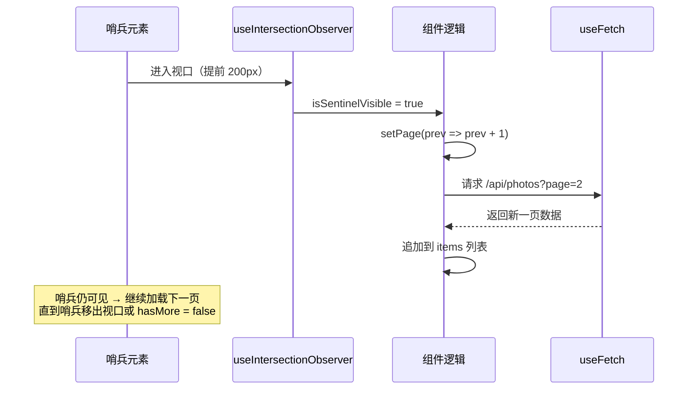

# 07 - 实战整合：自定义 Hooks 工具库

> 对应大纲模块 7 | 预计时间：2 天
> 面试可答：自定义 Hooks 是 React 逻辑复用的最佳实践，替代了 HOC 和 Render Props。

---

## 学习目标

- 掌握 Hooks 工具库的项目结构与设计原则
- 实现 5 个生产级 Hook：`useLocalStorage`、`useClickOutside`、`useEventListener`、`useMediaQuery`、`useIntersectionObserver`
- 能用 `renderHook` + `act` 为自定义 Hook 编写单元测试
- 理解 Hook 库的导出设计与版本管理
- 面试时能完整阐述自定义 Hook 的设计思路与取舍

> **与模块 4 的衔接**：模块 4 已经实现了 `useToggle`、`useDebounce`、`useFetch` 三个 Hook，本篇在此基础上补充 5 个更贴近生产场景的实用 Hook，并把它们整合为一个**可维护、可测试、可发布**的 Hooks 工具库。

---

## 工具库设计

### 1. 项目结构

一个可维护的 Hook 库，最基本的特点是**一个文件一个 Hook**：

```
react-hooks-kit/
├── src/
│   ├── useToggle.ts                  # 模块 4 已实现
│   ├── useDebounce.ts                # 模块 4 已实现
│   ├── useFetch.ts                   # 模块 4 已实现
│   ├── useLocalStorage.ts            # 状态持久化
│   ├── useClickOutside.ts            # 点击外部检测
│   ├── useEventListener.ts           # 事件监听（自动清理）
│   ├── useMediaQuery.ts              # 响应式断点
│   ├── useIntersectionObserver.ts    # 视口观察（懒加载/曝光）
│   ├── __tests__/
│   │   ├── useLocalStorage.test.ts
│   │   └── useClickOutside.test.ts
│   └── index.ts                      # 统一导出入口
├── package.json
└── tsconfig.json
```

**为什么一个文件一个 Hook？**

| 好处 | 说明 |
|------|------|
| 独立演进 | 修改某个 Hook 不影响其他文件，git diff 清晰 |
| 易于定位 | 按文件名即可找到实现，新人上手成本低 |
| Tree-shaking 友好 | 打包工具可以只引入用到的 Hook，减小产物体积 |
| 测试对应明确 | `useXxx.ts` ↔ `useXxx.test.ts`，一一对应 |

### 2. 设计原则回顾

模块 4 讲过的三条设计原则，在工具库层面更加重要：

#### 原则一：单一职责

```tsx
// ❌ 一个 Hook 既管存储又管网络请求，职责混乱
function useUserPreferences() {
  const [theme, setTheme] = useState('light');
  const [userData, setUserData] = useState(null);

  useEffect(() => {
    fetch('/api/preferences').then(/* ... */); // 请求逻辑
    localStorage.setItem('theme', theme);       // 存储逻辑
  }, [theme]);

  return { theme, setTheme, userData };
}

// ✅ 拆成两个独立 Hook，各自可单独复用
const [theme, setTheme] = useLocalStorage('theme', 'light');
const { data: userData } = useFetch('/api/preferences');
```

#### 原则二：可组合

小 Hook 组合成大功能，而不是造一个"大而全"的 Hook：

```tsx
// ✅ useEventListener + useDebounce 组合出"窗口尺寸防抖监听"
function useWindowSize(debounceDelay = 200) {
  const [size, setSize] = useState({
    width: window.innerWidth,
    height: window.innerHeight,
  });

  useEventListener('resize', () => {
    setSize({ width: window.innerWidth, height: window.innerHeight });
  });

  return useDebounce(size, debounceDelay);
}
```

#### 原则三：返回值稳定

返回的函数引用必须稳定，否则使用方组件的 `memo` 优化会全部失效：

```tsx
// ❌ 每次渲染返回新函数，传给子组件会破坏 React.memo
function useCounter() {
  const [count, setCount] = useState(0);
  const increment = () => setCount(prev => prev + 1); // 每次渲染新引用
  return { count, increment };
}

// ✅ 用 useCallback 稳定引用
function useCounter() {
  const [count, setCount] = useState(0);
  const increment = useCallback(() => setCount(prev => prev + 1), []);
  return { count, increment };
}
```

### 3. 统一导出 index.ts

所有 Hook 通过 `index.ts` 统一导出，使用方只需从包名引入：

```tsx
// src/index.ts

// 状态类
export { useToggle } from './useToggle';
export { useLocalStorage } from './useLocalStorage';
export { useDebounce } from './useDebounce';

// 事件类
export { useClickOutside } from './useClickOutside';
export { useEventListener } from './useEventListener';

// 环境感知类
export { useMediaQuery } from './useMediaQuery';
export { useIntersectionObserver } from './useIntersectionObserver';

// 数据请求类
export { useFetch } from './useFetch';

// 同时导出类型，方便使用方引用
export type { UseIntersectionObserverOptions } from './useIntersectionObserver';
```

```tsx
// 使用方：一行引入，按需使用
import { useLocalStorage, useClickOutside } from 'react-hooks-kit';
```

配套的 `package.json` 关键字段（支持 ESM tree-shaking 和类型提示）：

```json
{
  "name": "react-hooks-kit",
  "version": "1.0.0",
  "main": "dist/index.cjs.js",
  "module": "dist/index.esm.js",
  "types": "dist/index.d.ts",
  "sideEffects": false
}
```

- `module` 指向 ESM 产物，打包工具优先使用，配合 `sideEffects: false` 实现 tree-shaking
- `types` 指向类型声明文件，使用方获得完整的 TS 提示

---

## 核心 Hook 实现

### 4. useLocalStorage — 同步 localStorage

**用途**：让组件状态自动持久化到 localStorage，刷新页面后状态不丢失。典型场景：主题偏好、表单草稿、折叠面板的展开状态。

**实现要点**：
- 泛型支持任意可 JSON 序列化的类型
- 惰性初始化（只在首次渲染时读取 localStorage）
- 写入时同步到 localStorage
- JSON 序列化/反序列化错误兜底
- SSR 安全（`typeof window !== 'undefined'`）

```tsx
import { useState, useCallback, useEffect } from 'react';

function useLocalStorage<T>(key: string, initialValue: T) {
  // 惰性初始化：只在首次渲染时读取 localStorage
  const [storedValue, setStoredValue] = useState<T>(() => {
    // SSR 安全：服务端没有 window，直接返回默认值
    if (typeof window === 'undefined') {
      return initialValue;
    }

    try {
      const item = window.localStorage.getItem(key);
      // 有存储值则解析返回，否则用默认值
      return item !== null ? (JSON.parse(item) as T) : initialValue;
    } catch (error) {
      // 反序列化失败（如数据损坏、手动写入了非 JSON 字符串）时兜底
      console.warn(`读取 localStorage "${key}" 失败，使用默认值：`, error);
      return initialValue;
    }
  });

  // 用法与 useState 一致：支持传值，也支持函数式更新
  const setValue = useCallback((value: T | ((prev: T) => T)) => {
    setStoredValue(prev => (value instanceof Function ? value(prev) : value));
  }, []);

  // 值变化后统一同步到 localStorage
  useEffect(() => {
    if (typeof window === 'undefined') {
      return;
    }

    try {
      window.localStorage.setItem(key, JSON.stringify(storedValue));
    } catch (error) {
      // 写入失败（如存储配额超限、隐私模式限制写入）时兜底
      console.warn(`写入 localStorage "${key}" 失败：`, error);
    }
  }, [key, storedValue]);

  return [storedValue, setValue] as const;
}
```

> **为什么不在 `setValue` 里直接写 localStorage？** 因为要支持函数式更新，就必须在 `setState` 的更新函数里拿到 `prev`，而更新函数应该是**纯函数**（StrictMode 下可能被调用两次）。把写入逻辑统一放在 `useEffect` 中，更新函数保持纯净，写入逻辑也只有一处。

**使用示例**：

```tsx
function SettingsPanel() {
  // 刷新页面后，字号和用户名都会自动恢复
  const [fontSize, setFontSize] = useLocalStorage<number>('settings:fontSize', 16);
  const [username, setUsername] = useLocalStorage<string>('settings:username', '');

  return (
    <div style={{ fontSize }}>
      <input
        value={username}
        onChange={e => setUsername(e.target.value)}
        placeholder="输入用户名（自动保存）"
      />
      <button onClick={() => setFontSize(prev => prev + 2)}>字号 +2</button>
      <button onClick={() => setFontSize(prev => Math.max(12, prev - 2))}>字号 -2</button>
      <p>当前字号：{fontSize}px</p>
    </div>
  );
}
```

### 5. useClickOutside — 点击外部关闭

**用途**：点击元素外部时触发回调。典型场景：下拉菜单、弹窗、Popover 的关闭逻辑。

**实现要点**：
- 接收 ref（指向目标元素）和 callback
- `useEffect` 绑定 `mousedown` / `touchstart`（同时覆盖鼠标和触摸）
- 清理函数移除监听，防止内存泄漏

```tsx
import { useEffect, useRef, RefObject } from 'react';

function useClickOutside(
  ref: RefObject<HTMLElement | null>,
  callback: (event: MouseEvent | TouchEvent) => void
) {
  // 用 ref 保存最新的 callback，避免因 callback 变化导致监听器反复解绑/重绑
  const callbackRef = useRef(callback);

  useEffect(() => {
    callbackRef.current = callback;
  });

  useEffect(() => {
    const handler = (event: MouseEvent | TouchEvent) => {
      const el = ref.current;
      // 点击目标不在元素内部 → 视为"点击外部"
      if (el && !el.contains(event.target as Node)) {
        callbackRef.current(event);
      }
    };

    // mousedown 覆盖鼠标，touchstart 覆盖移动端触摸
    document.addEventListener('mousedown', handler);
    document.addEventListener('touchstart', handler);

    // 卸载时移除监听
    return () => {
      document.removeEventListener('mousedown', handler);
      document.removeEventListener('touchstart', handler);
    };
  }, [ref]);
}
```

> **为什么监听 `mousedown` 而不是 `click`？** `click` 在鼠标抬起时才触发——如果用户在菜单内按下、拖到菜单外松开，`click` 的目标是菜单外部，会误触发关闭。`mousedown` 在按下瞬间触发，行为更符合直觉。

**使用示例 — 下拉菜单**：

```tsx
function Dropdown() {
  const [isOpen, setIsOpen] = useState(false);
  const menuRef = useRef<HTMLDivElement>(null);

  // 点击菜单区域外部时关闭
  useClickOutside(menuRef, () => setIsOpen(false));

  return (
    <div ref={menuRef} style={{ position: 'relative', display: 'inline-block' }}>
      <button onClick={() => setIsOpen(prev => !prev)}>
        {isOpen ? '收起菜单' : '展开菜单'}
      </button>

      {isOpen && (
        <ul
          style={{
            position: 'absolute',
            top: '100%',
            left: 0,
            margin: 0,
            padding: 8,
            listStyle: 'none',
            border: '1px solid #ccc',
            background: '#fff',
          }}
        >
          <li style={{ padding: '4px 8px' }}>菜单项 1</li>
          <li style={{ padding: '4px 8px' }}>菜单项 2</li>
          <li style={{ padding: '4px 8px' }}>菜单项 3</li>
        </ul>
      )}
    </div>
  );
}
```

### 6. useEventListener — 事件监听自动清理

**用途**：把 `addEventListener` + `removeEventListener` 的样板代码收敛成一个 Hook，组件卸载时自动解绑，杜绝"忘记移除监听器"导致的内存泄漏。

**实现要点**：
- 泛型 + 函数重载：支持 Window / Document / HTMLElement 事件，事件对象类型自动推导
- 用 `useRef` 保存最新 handler，避免 effect 频繁重新绑定
- 支持自定义 target（默认 `window`）

```tsx
import { useEffect, useRef, RefObject } from 'react';

// 重载 1：默认绑定到 window
function useEventListener<K extends keyof WindowEventMap>(
  eventName: K,
  handler: (event: WindowEventMap[K]) => void
): void;

// 重载 2：绑定到 document
function useEventListener<K extends keyof DocumentEventMap>(
  eventName: K,
  handler: (event: DocumentEventMap[K]) => void,
  target: RefObject<Document>
): void;

// 重载 3：绑定到任意 HTMLElement（事件类型自动推导）
function useEventListener<
  K extends keyof HTMLElementEventMap,
  T extends HTMLElement,
>(
  eventName: K,
  handler: (event: HTMLElementEventMap[K]) => void,
  target: RefObject<T | null>
): void;

// 实现签名（不对外暴露）
function useEventListener(
  eventName: string,
  handler: (event: Event) => void,
  target?: RefObject<EventTarget | null>
): void {
  // 关键技巧：用 ref 始终保存最新的 handler
  const handlerRef = useRef(handler);

  useEffect(() => {
    handlerRef.current = handler;
  }, [handler]);

  useEffect(() => {
    // 传了 target 就用 target.current，否则默认 window
    const el: EventTarget = target?.current ?? window;

    // 事件触发时转发给最新的 handler
    const listener = (event: Event) => handlerRef.current(event);

    el.addEventListener(eventName, listener);

    // 卸载或依赖变化时自动移除监听
    return () => {
      el.removeEventListener(eventName, listener);
    };
  }, [eventName, target]);
}
```

**为什么用 `useRef` 保存 handler？** 对比两种写法：

```tsx
// ❌ handler 放进依赖数组：组件每次渲染都生成新的内联函数，
//    导致每次渲染都解绑 + 重绑监听器
useEffect(() => {
  window.addEventListener(eventName, handler);
  return () => window.removeEventListener(eventName, handler);
}, [eventName, handler]); // handler 每次渲染都是新引用

// ✅ ref 保存最新 handler：effect 只依赖 eventName 和 target，监听器只绑定一次，
//    同时事件触发时永远调用最新的闭包（不会读到过期的 state）
```

> 这正是社区 `useEvent` RFC 的核心思路：**监听器绑定一次，handler 永远取最新**。

**使用示例**：

```tsx
// 场景 1：监听 window 滚动（默认 target 为 window）
function ScrollTracker() {
  const [scrollY, setScrollY] = useState(0);

  useEventListener('scroll', () => {
    setScrollY(window.scrollY);
  });

  return <p>当前滚动位置：{scrollY}px</p>;
}

// 场景 2：监听 input 的按键事件（自定义 target，事件类型自动推导为 KeyboardEvent）
function KeyPressInput() {
  const inputRef = useRef<HTMLInputElement>(null);
  const [lastKey, setLastKey] = useState('');

  useEventListener('keydown', event => setLastKey(event.key), inputRef);

  return (
    <>
      <input ref={inputRef} placeholder="按下任意键..." />
      <p>最后按下的键：{lastKey}</p>
    </>
  );
}
```

### 7. useMediaQuery — 响应式断点

**用途**：用 CSS 媒体查询语法在 JS 中判断当前视口是否匹配某个断点，返回 boolean。典型场景：响应式布局切换、移动端/桌面端渲染不同组件。

**实现要点**：
- 基于 `window.matchMedia`
- 监听 `change` 事件，断点跨越时自动更新
- 返回 boolean

```tsx
import { useState, useEffect } from 'react';

function useMediaQuery(query: string): boolean {
  // 惰性初始化：用当前匹配结果作为初始值，避免首帧闪烁
  const [matches, setMatches] = useState<boolean>(() => {
    if (typeof window === 'undefined') {
      return false; // SSR 兜底
    }
    return window.matchMedia(query).matches;
  });

  useEffect(() => {
    const mql = window.matchMedia(query);

    // 挂载后立即同步一次（防止 query 变化或 SSR 导致的状态不一致）
    setMatches(mql.matches);

    // 断点跨越时触发 change 事件
    const handler = (event: MediaQueryListEvent) => setMatches(event.matches);

    mql.addEventListener('change', handler);
    return () => mql.removeEventListener('change', handler);
  }, [query]);

  return matches;
}
```

**使用示例 — 响应式布局切换**：

```tsx
function ArticleLayout() {
  const isDesktop = useMediaQuery('(min-width: 1024px)');
  const isMobile = useMediaQuery('(max-width: 768px)');

  // 移动端：单列布局
  if (isMobile) {
    return (
      <div>
        <main>文章正文</main>
        <aside>侧边栏（移到正文下方）</aside>
      </div>
    );
  }

  // 桌面端 / 平板：双列布局
  return (
    <div style={{ display: 'flex', gap: 24 }}>
      <aside style={{ width: isDesktop ? 280 : 200 }}>侧边栏</aside>
      <main style={{ flex: 1 }}>文章正文</main>
    </div>
  );
}
```

### 8. useIntersectionObserver — 懒加载/曝光检测

**用途**：检测元素是否进入视口。典型场景：图片懒加载、无限滚动的"哨兵"元素、广告/内容的曝光埋点。

**实现要点**：
- 接收 ref + options（`threshold`、`rootMargin`）
- 返回 `isIntersecting` 状态
- 支持 `once` 选项：只触发一次后断开观察（懒加载、曝光埋点场景）

```tsx
import { useState, useEffect, RefObject } from 'react';

export interface UseIntersectionObserverOptions {
  threshold?: number | number[]; // 可见比例阈值，0~1
  rootMargin?: string;           // 视口外扩/内缩，如 '100px' 表示提前 100px 触发
  root?: Element | null;         // 观察的根元素，默认视口
  once?: boolean;                // 只在首次进入视口时触发，之后断开观察
}

function useIntersectionObserver(
  ref: RefObject<Element | null>,
  options: UseIntersectionObserverOptions = {}
): boolean {
  const { threshold = 0, rootMargin = '0px', root = null, once = false } = options;
  const [isIntersecting, setIsIntersecting] = useState(false);

  useEffect(() => {
    const el = ref.current;
    if (!el) return;

    // 极老浏览器不支持 IntersectionObserver 时，降级为直接可见
    if (typeof IntersectionObserver === 'undefined') {
      setIsIntersecting(true);
      return;
    }

    const observer = new IntersectionObserver(
      ([entry]) => {
        setIsIntersecting(entry.isIntersecting);

        // once 模式：首次进入视口后断开观察，节省性能
        if (once && entry.isIntersecting) {
          observer.disconnect();
        }
      },
      { threshold, rootMargin, root }
    );

    observer.observe(el);

    // 卸载时断开观察
    return () => observer.disconnect();
  }, [ref, threshold, rootMargin, root, once]);

  return isIntersecting;
}
```

**使用示例 — 图片懒加载**：

```tsx
function LazyImage({ src, alt }: { src: string; alt: string }) {
  const containerRef = useRef<HTMLDivElement>(null);

  // 元素进入视口（提前 100px 预载）后才加载真实图片
  const isVisible = useIntersectionObserver(containerRef, {
    rootMargin: '100px',
    once: true, // 加载过一次就不再观察
  });

  return (
    <div
      ref={containerRef}
      style={{
        width: '100%',
        height: 240,
        background: '#f0f0f0',
        display: 'flex',
        alignItems: 'center',
        justifyContent: 'center',
      }}
    >
      {isVisible ? (
        
      ) : (
        <span style={{ color: '#999' }}>图片占位，滚动到此处自动加载...</span>
      )}
    </div>
  );
}
```

---

## 单元测试

### 9. 测试工具：renderHook + act

自定义 Hook 不渲染任何 UI，无法直接用 `render` 测试。`@testing-library/react` 提供了 `renderHook`：在隔离环境中渲染 Hook，通过 `result.current` 拿到返回值；所有会触发状态更新的操作都要包在 `act` 里，确保 React 完成渲染后再断言。

```tsx
import { renderHook, act } from '@testing-library/react';

const { result, rerender, unmount } = renderHook(
  ({ value }) => useDebounce(value, 500),
  { initialProps: { value: 'a' } } // 通过 initialProps 传参
);

result.current;            // Hook 的返回值
rerender({ value: 'ab' }); // 用新 props 重新渲染
unmount();                 // 卸载（测试清理逻辑）
```

### 10. useLocalStorage 测试

```tsx
// __tests__/useLocalStorage.test.ts
import { renderHook, act } from '@testing-library/react';
import { useLocalStorage } from '../useLocalStorage';

// 每个测试前清空 localStorage，保证用例之间互不影响
beforeEach(() => {
  window.localStorage.clear();
});

test('localStorage 为空时返回默认值', () => {
  const { result } = renderHook(() => useLocalStorage('name', '默认值'));

  expect(result.current[0]).toBe('默认值');
});

test('能读取 localStorage 中已有的值', () => {
  window.localStorage.setItem('name', JSON.stringify('Alice'));

  const { result } = renderHook(() => useLocalStorage('name', '默认值'));

  expect(result.current[0]).toBe('Alice');
});

test('setValue 后状态更新并同步到 localStorage', () => {
  const { result } = renderHook(() => useLocalStorage('count', 0));

  act(() => {
    result.current[1](42);
  });

  expect(result.current[0]).toBe(42);
  expect(JSON.parse(window.localStorage.getItem('count')!)).toBe(42);
});

test('支持函数式更新', () => {
  const { result } = renderHook(() => useLocalStorage('count', 0));

  act(() => {
    result.current[1](prev => prev + 1);
  });

  expect(result.current[0]).toBe(1);
  expect(JSON.parse(window.localStorage.getItem('count')!)).toBe(1);
});

test('存储对象类型时序列化和反序列化正常', () => {
  const initial = { theme: 'dark', fontSize: 14 };

  const { result } = renderHook(() => useLocalStorage('settings', initial));

  act(() => {
    result.current[1](prev => ({ ...prev, fontSize: 16 }));
  });

  expect(result.current[0]).toEqual({ theme: 'dark', fontSize: 16 });
  expect(JSON.parse(window.localStorage.getItem('settings')!)).toEqual({
    theme: 'dark',
    fontSize: 16,
  });
});

test('数据损坏时回退到默认值，而不是抛出异常', () => {
  window.localStorage.setItem('broken', '{这不是合法的 JSON');
  // 屏蔽预期的 console.warn 输出，保持测试日志干净
  const warnSpy = jest.spyOn(console, 'warn').mockImplementation(() => {});

  const { result } = renderHook(() => useLocalStorage('broken', 'fallback'));

  expect(result.current[0]).toBe('fallback');
  expect(warnSpy).toHaveBeenCalled();

  warnSpy.mockRestore();
});
```

### 11. useClickOutside 测试

DOM 事件类 Hook 的测试思路：手动创建 DOM 元素 → 渲染 Hook → 用 `fireEvent` 模拟事件 → 断言回调是否触发。

```tsx
// __tests__/useClickOutside.test.ts
import { renderHook, fireEvent } from '@testing-library/react';
import { useClickOutside } from '../useClickOutside';

test('点击元素外部时触发回调', () => {
  const callback = jest.fn();
  const el = document.createElement('div');
  document.body.appendChild(el);
  const ref = { current: el };

  renderHook(() => useClickOutside(ref, callback));

  fireEvent.mouseDown(document.body); // 点击外部

  expect(callback).toHaveBeenCalledTimes(1);

  document.body.removeChild(el);
});

test('点击元素内部时不触发回调', () => {
  const callback = jest.fn();
  const el = document.createElement('div');
  document.body.appendChild(el);
  const ref = { current: el };

  renderHook(() => useClickOutside(ref, callback));

  fireEvent.mouseDown(el); // 点击内部

  expect(callback).not.toHaveBeenCalled();

  document.body.removeChild(el);
});

test('同时支持触摸事件', () => {
  const callback = jest.fn();
  const el = document.createElement('div');
  document.body.appendChild(el);
  const ref = { current: el };

  renderHook(() => useClickOutside(ref, callback));

  fireEvent.touchStart(document.body);

  expect(callback).toHaveBeenCalledTimes(1);

  document.body.removeChild(el);
});

test('卸载后移除监听器，不再触发回调', () => {
  const callback = jest.fn();
  const el = document.createElement('div');
  document.body.appendChild(el);
  const ref = { current: el };

  const { unmount } = renderHook(() => useClickOutside(ref, callback));

  unmount();
  fireEvent.mouseDown(document.body);

  expect(callback).not.toHaveBeenCalled();

  document.body.removeChild(el);
});
```

### 12. 如何 mock localStorage 和 DOM 事件

**mock localStorage**：`jest-environment-jsdom`（jsdom ≥ 11.12）已内置 `localStorage`，测试中直接 `window.localStorage.clear()` 即可。如果 jsdom 版本过旧，可以在测试 setup 文件中手动 polyfill：

```tsx
// test/setup.ts
const createLocalStorageMock = () => {
  let store: Record<string, string> = {};

  return {
    getItem: (key: string): string | null => store[key] ?? null,
    setItem: (key: string, value: string): void => {
      store[key] = String(value);
    },
    removeItem: (key: string): void => {
      delete store[key];
    },
    clear: (): void => {
      store = {};
    },
  };
};

Object.defineProperty(window, 'localStorage', {
  value: createLocalStorageMock(),
  writable: true,
});
```

**mock DOM 事件**：两种方式，推荐第一种：

```tsx
// 方式一：@testing-library/react 的 fireEvent（模拟真实事件冒泡，推荐）
fireEvent.mouseDown(document.body);
fireEvent.touchStart(el);
fireEvent.keyDown(input, { key: 'Enter' });

// 方式二：原生 dispatchEvent（需要精确控制事件属性时）
el.dispatchEvent(new MouseEvent('mousedown', { bubbles: true }));
```

> 测试框架用 Vitest 也完全一样——`renderHook`、`act`、`fireEvent` 的 API 与 Jest 版本一致，只需把 `jest.fn()` 换成 `vi.fn()`。

---

## 面试高频问题

### Q1：如何设计一个高质量的自定义 Hook 库？

**答**：我会从五个层面考虑：(1) **单一职责**——一个 Hook 只解决一个问题，`useLocalStorage` 只管持久化，不掺请求逻辑；(2) **可组合**——小 Hook 能自由组合成大功能，比如 `useEventListener` + `useDebounce` 组合出窗口尺寸防抖监听；(3) **返回值稳定**——返回的函数用 `useCallback` 包裹，避免破坏使用方的 `memo` 优化；(4) **类型安全**——用泛型和函数重载让事件类型、存储值类型自动推导，使用方零注解；(5) **工程化**——一个文件一个 Hook、统一 `index.ts` 导出、`sideEffects: false` 支持 tree-shaking、每个 Hook 配 `renderHook` 单元测试。

### Q2：自定义 Hook 如何做版本管理和向后兼容？

**答**：遵循 semver 语义化版本：(1) **patch/minor 版本绝不改变已有参数和返回值的结构**，新增能力通过可选的 options 参数扩展（如给 `useIntersectionObserver` 新增 `once` 选项，老调用方完全不受影响）；(2) 废弃的 API 先标 `@deprecated` 并保留至少一个大版本，给使用方迁移时间；(3) 破坏性变更只放在 major 版本，并在 CHANGELOG 中写清迁移方式（用 changesets 这类工具自动生成）；(4) TypeScript 层面可以用函数重载同时保留新旧签名。

### Q3：useEventListener 为什么用 useRef 保存 handler？

**答**：如果直接把 handler 放进 effect 的依赖数组，使用方传入的内联箭头函数每次渲染都是新引用，effect 就会每次渲染都执行"解绑 + 重绑"，既浪费性能，也可能在解绑和重绑的间隙丢事件。用 `useRef` 保存最新 handler、每次渲染更新 `ref.current`，effect 就只依赖 `eventName` 和 `target`，监听器只绑定一次；事件触发时通过 ref 调用，永远拿到最新闭包里的 state，不会读到过期值。这也是社区 `useEvent` RFC 的核心思路。

### Q4：自定义 Hook 和工具函数的边界在哪里？

**答**：判断标准是**是否用到 React 的 Hooks（状态和副作用）**。纯计算逻辑（格式化日期、深拷贝、URL 拼接）应该是工具函数——它不依赖渲染生命周期，随处可调、易于测试。只有逻辑涉及 `useState`、`useEffect`、订阅、定时器、DOM 监听等需要跟随组件生命周期的部分，才应该封装成自定义 Hook。反例是把 `formatDate` 硬包成 `useFormatDate`——它内部没有任何 Hook，徒增调用限制（Hook 不能条件调用、不能在组件外调用），没有任何收益。

---

## 面试回答模板

> **问：你封装过哪些自定义 Hook？怎么设计的？**
>
> 我在项目中沉淀过一个 Hooks 工具库，大概 8 个 Hook，按职责分三类：**状态增强类**（`useToggle`、`useLocalStorage`、`useDebounce`/`useThrottle`）、**事件交互类**（`useClickOutside`、`useEventListener`）、**环境感知类**（`useMediaQuery`、`useIntersectionObserver`、`useFetch`）。
>
> 设计上遵循三条原则：单一职责（一个 Hook 只做一件事）、可组合（小 Hook 组合成大功能，比如 `useEventListener` + `useDebounce` 组合出窗口尺寸监听）、返回值引用稳定（函数用 `useCallback` 包裹）。
>
> 工程上，一个文件一个 Hook，`index.ts` 统一导出并配 `sideEffects: false` 支持 tree-shaking，每个 Hook 用 `renderHook` + `act` 写单元测试。
>
> 举一个具体的设计取舍：`useEventListener` 用 `useRef` 保存最新 handler 而不是把 handler 放进依赖数组，这样监听器只绑定一次，同时事件触发时永远调用最新闭包，不会读到过期 state。

> **问：自定义 Hook 相比 HOC 和 Render Props 的优势？**
>
> 四个优势：(1) **没有额外组件层级**——HOC 每包一层就多一层组件嵌套，多个 HOC 组合形成"嵌套地狱"，自定义 Hook 是扁平的函数调用；(2) **props 来源透明**——HOC 注入的 props 从 JSX 上看不出来源，命名冲突也难排查，Hook 的返回值就在眼前；(3) **TypeScript 类型推导自然**——泛型 Hook 的返回值类型自动推导，HOC 的 props 合并类型很难写；(4) **组合自由**——Hook 之间可以互相调用、传参组合，HOC 链式组合的顺序和传参都很笨重。
>
> **追问：有没有 HOC 比自定义 Hook 更合适的场景？**
>
> 有，主要三种：(1) **需要包装渲染结构本身**——比如给第三方组件外面套一层统一的 wrapper、注入 props 到无法修改源码的组件内部，HOC 在组件层面包装更直接；(2) **逻辑作用于"组件粒度"而非函数内部**——比如 `withErrorBoundary` 这类需要拦截子树渲染错误的场景（错误边界本身必须是 class 组件）；(3) **需要兼容 class 组件的项目**——自定义 Hook 只能在函数组件里调用，HOC 对两种组件都适用。另外自定义 Hook 不能条件调用、不能在组件外调用，HOC 没有这个限制。所以准确的说法是：自定义 Hook 是函数组件时代逻辑复用的首选，HOC 在组件级包装场景仍有不可替代的价值。

---

## 练习

### 练习 1：实现 useThrottle（节流值）

**要求**：实现 `useThrottle<T>(value, interval)`，与模块 4 的 `useDebounce` 形成对比——防抖是"停下来才更新"，节流是"固定间隔更新一次"

**提示**：用 `useRef` 记录上次更新时间；距上次更新超过 `interval` 就立即更新（leading），否则用 `setTimeout` 在窗口结束时更新（trailing），保证最后一次值不丢失

**预期效果**：持续高频变化的值（如鼠标坐标），每 `interval` 毫秒最多更新一次

```tsx
import { useState, useEffect, useRef } from 'react';

function useThrottle<T>(value: T, interval: number): T {
  const [throttledValue, setThrottledValue] = useState<T>(value);
  // 初始为 0，保证第一次变化立即生效（leading）
  const lastUpdated = useRef<number>(0);

  useEffect(() => {
    const now = Date.now();

    if (now >= lastUpdated.current + interval) {
      // 距上次更新已超过节流窗口：立即更新
      lastUpdated.current = now;
      setThrottledValue(value);
    } else {
      // 还在节流窗口内：窗口结束时更新一次（trailing）
      const remaining = interval - (now - lastUpdated.current);
      const timer = setTimeout(() => {
        lastUpdated.current = Date.now();
        setThrottledValue(value);
      }, remaining);

      // value 再次变化时清除旧定时器，只保留最后一次的 trailing 更新
      return () => clearTimeout(timer);
    }
  }, [value, interval]);

  return throttledValue;
}
```

**useDebounce vs useThrottle 对比**：

| 维度 | useDebounce | useThrottle |
|------|-------------|-------------|
| 触发规则 | 停止变化 delay 毫秒后才更新 | 固定间隔更新一次 |
| 连续输入 "abcde" | 只在最后触发 1 次 | 过程中触发多次 |
| 典型场景 | 搜索联想、表单校验 | 滚动位置、拖拽坐标、mousemove |

**使用示例**（组合本篇的 `useEventListener`）：

```tsx
function MouseTracker() {
  const [position, setPosition] = useState({ x: 0, y: 0 });

  useEventListener('mousemove', event => {
    setPosition({ x: event.clientX, y: event.clientY });
  });

  // 每 200ms 最多更新一次，避免高频渲染
  const throttledPosition = useThrottle(position, 200);

  return (
    <p>
      原始坐标：({position.x}, {position.y})
      ｜节流后：({throttledPosition.x}, {throttledPosition.y})
    </p>
  );
}
```

### 练习 2：useIntersectionObserver + useFetch 实现无限滚动列表

**要求**：列表底部放一个"哨兵"元素，用 `useIntersectionObserver` 检测它进入视口，自动请求下一页并追加到列表，直到没有更多数据

**提示**：哨兵可见且不在加载中时 `setPage(prev => prev + 1)`；`useFetch` 返回新页数据后追加到 `items`；用 `rootMargin` 提前预载

**预期效果**：滚动到列表底部自动加载下一页，加载中显示 loading，数据耗尽显示"没有更多了"

```tsx
import { useState, useEffect, useRef } from 'react';

interface Photo {
  id: number;
  title: string;
}

interface PageResponse {
  list: Photo[];
  hasMore: boolean;
}

function InfinitePhotoList() {
  const [page, setPage] = useState(1);
  const [items, setItems] = useState<Photo[]>([]);
  const [hasMore, setHasMore] = useState(true);

  // 模块 4 的 useFetch：page 变化时自动请求对应页
  const { data, loading, error } = useFetch<PageResponse>(
    `/api/photos?page=${page}&size=20`
  );

  // 新一页数据返回后追加到列表
  useEffect(() => {
    if (data) {
      setItems(prev => [...prev, ...data.list]);
      setHasMore(data.hasMore);
    }
  }, [data]);

  // 列表底部的"哨兵"元素
  const sentinelRef = useRef<HTMLDivElement>(null);
  const isSentinelVisible = useIntersectionObserver(sentinelRef, {
    rootMargin: '200px', // 提前 200px 开始加载，用户无感知
  });

  // 哨兵可见 + 还有更多 + 不在加载中 → 加载下一页
  useEffect(() => {
    if (isSentinelVisible && hasMore && !loading) {
      setPage(prev => prev + 1);
    }
  }, [isSentinelVisible, hasMore, loading]);

  return (
    <div style={{ maxWidth: 480, margin: '0 auto' }}>
      <ul style={{ listStyle: 'none', padding: 0 }}>
        {items.map(item => (
          <li
            key={item.id}
            style={{ padding: '12px 0', borderBottom: '1px solid #eee' }}
          >
            {item.title}
          </li>
        ))}
      </ul>

      {loading && <p style={{ textAlign: 'center' }}>加载中...</p>}
      {error && <p style={{ color: 'red' }}>加载失败：{error}</p>}
      {!hasMore && <p style={{ textAlign: 'center', color: '#999' }}>— 没有更多了 —</p>}

      {/* 哨兵：1px 高的占位元素，进入视口即触发加载 */}
      <div ref={sentinelRef} style={{ height: 1 }} />
    </div>
  );
}
```

**数据流**：



**关键点**：
- 哨兵是一个 1px 高的空 `div`，只负责触发观察，不承担渲染
- `loading` 作为加载条件之一，防止一次进入视口重复发起请求
- 生产环境还需考虑：按 `id` 去重（防止接口重复数据）、请求失败的重试按钮、长列表的虚拟化（`react-window`）

---

## 本模块完成标准

- [ ] 能独立封装 5 个以上生产级自定义 Hook
- [ ] 能为自定义 Hook 编写单元测试
- [ ] 理解 Hook 库的设计原则和项目结构
- [ ] 面试时能展示自定义 Hook 的设计思路和取舍
