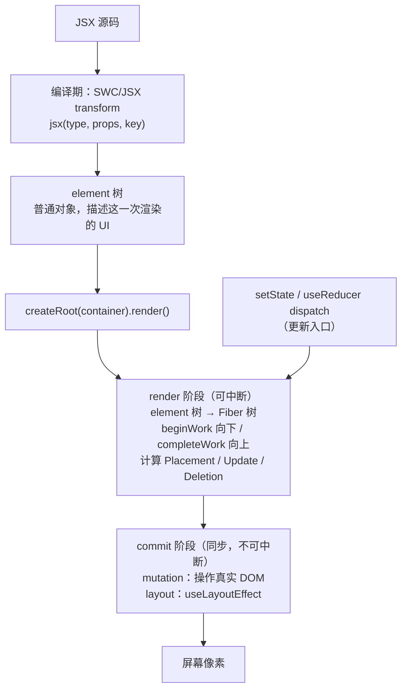
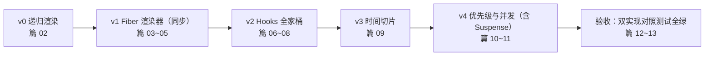

# 01 - 全景与项目启动

> 对应大纲篇 01（认知层 · 精讲） | 预计时间：60 分钟
> 面试可答：React 渲染 = **render 阶段**（可中断，计算差异）+ **commit 阶段**（同步，提交 DOM）；Fiber 重写的动机是可中断渲染与优先级调度。
> 前置：[React Hooks 系列](../../hooks/readme.md) 或等价使用经验；技术栈规范见 [agents.md §5.6](../../../../../agents.md)

---

## 1. 本篇定位

一句话：**建立「从 JSX 到屏幕」的完整全景图，划定 mini-react 的功能边界，并搭好全部 13 篇共用的工程脚手架。**

本篇不写一行渲染器代码——但接下来 12 篇的每一个实现决策，都由本篇的全景图和边界决定。读完你将带着三样东西离开：

1. 一张能脱稿画出的「从 `<App/>` 到像素」链路图
2. 一份 mini-react 的里程碑表（v0 → v4，每篇文档对应一个提交点）
3. 一个跑通的脚手架 + 官方 React 对照组 Demo（篇 12 双实现对照的基准）

---

## 2. 从 `<App/>` 到像素：完整渲染链路



三个关键认知，后面每一篇都在展开其中一段：

| 认知                 | 一句话                                                                               | 展开篇目  |
| -------------------- | ------------------------------------------------------------------------------------ | --------- |
| **编译期 vs 运行期** | JSX 是语法糖，编译产物是 `jsx()` 调用；运行期 React 拿到的只是对象树                 | 篇 02     |
| **两阶段**           | render 阶段算差异（纯 JS 计算，可中断），commit 阶段落 DOM（有副作用，同步不可中断） | 篇 03、05 |
| **更新入口**         | 所有更新（setState/dispatch/Context 变更）最终都汇入 render 阶段的重新调度           | 篇 06、10 |

> 💡 为什么 commit 不可中断？mutation 进行到一半时，DOM 处于「半更新」状态，用户此刻正在看屏幕——JS 没有任何回滚手段。而 render 阶段只操作 JS 对象（Fiber 树），随时可以扔掉重来。这是「可中断」的物理边界。

---

## 3. ⚖️ 对比板块：React 为什么需要 Fiber

> 全系列对比板块共 2 处，这是第 1 处（另见篇 12 差距清单）。回答的是「Fiber 和谁比、为什么重写」。

### 3.1 Stack Reconciler 的死穴

React 16（2017）之前，diff 是一次**同步递归**：

```tsx
// Stack Reconciler 的心智模型：递归整棵树，不可打断
const renderElement = (element: Element): Node => {
  const node = createNode(element)
  element.children.forEach((child) => {
    node.appendChild(renderElement(child)) // 递归深入，调用栈只增不减
  })
  return node
}
```

树有多深，调用栈就有多深，中途**没有任何合法的暂停点**—— JS 单线程里，这次递归就是一整个不可分割的长任务。树一大（几千节点），用户输入、动画帧全部排队，掉帧不可避免。

### 3.2 三种渲染模型对比

| 维度     | Stack Reconciler（React ≤15） | Fiber（React 16+）                     | 细粒度响应式（Vue / Solid）    |
| -------- | ----------------------------- | -------------------------------------- | ------------------------------ |
| 树的形态 | 普通对象树                    | **链表**（child / sibling / return）   | 组件树 + 依赖图                |
| 遍历方式 | 递归，调用栈驱动              | **循环**（workLoop），指针驱动         | 依赖收集，精确触发             |
| 可中断   | ❌                            | ✅ 每完成一个 fiber 检查 `shouldYield` | 天然小更新，无需中断           |
| 优先级   | ❌ 一视同仁                   | ✅ lane 分级，高优先级插队             | 隐式（依赖即优先级）           |
| 更新粒度 | 整树 diff                     | 整树可恢复地 diff                      | 组件级（Vue）到属性级（Solid） |
| 心智模型 | UI = f(state)                 | UI = f(state)（不变，换来并发能力）    | 数据即依赖，框架「跟踪」你     |

一句话总结：**Fiber 把「一次做完的递归」改写成「可以随时停下、随时继续的循环」，中断的粒度是一个 fiber 节点。** 这是后面篇 03 的全部主题。

### 3.3 面试追问：为什么 React 不像 Vue 那样做精确依赖更新？

官方立场（[React 团队对 UI = f(state) 哲学的阐述](https://react.dev/learn/thinking-in-react)）：React 有意选择「每次从头渲染 + 运行时 diff」，换来三样东西——

1. **心智模型简单**：组件是纯函数，UI 永远是当前 state 的投影，不需要思考「谁依赖谁」
2. **并发能力**：正因为渲染可以「扔掉重来」，才有 Transition/Suspense 这类并发特性（篇 10、11）
3. **React Compiler 补短板**：依赖追踪容易漏（手动 memo 化心智负担），React 19 起由编译器自动 memo 化（[React Compiler v1.0](https://react.dev/blog/2025/10/07/react-compiler-1)）

代价就是需要 VDOM diff 和 Fiber 这套运行时机制。这是设计取舍，不是技术优劣——面试时答「取舍」比答「谁更好」得分高。

---

## 4. mini-react 的边界与里程碑

### 4.1 功能边界

| ✅ 做（教学主线）                                                     | ❌ 不做（差距清单，篇 12/13 索引）      |
| --------------------------------------------------------------------- | --------------------------------------- |
| JSX（兼容 automatic runtime 编译产物）                                | SSR / 选择性 Hydration / RSC            |
| 函数组件 + 全套核心 Hooks（state 系 / effect 系 / memo 系 / Context） | 完整合成事件系统（用原生事件简化）      |
| 同层 Diff + key 复用                                                  | 完整 64 位 lane 模型（只做简化档位）    |
| 时间切片 + 简化版优先级 + useTransition / useDeferredValue            | Offscreen / Activity / View Transitions |
| Suspense 简化版（fallback + 恢复渲染）                                | React Compiler / DevTools 协议          |

> 💡 边界即承诺：范围内每项都**亲手实现**；范围外每项都在篇 13 给出真实源码入口。不确定属于哪边 → 查这张表。

### 4.2 里程碑



### 4.3 验收场景

最终交付物是一个带**输入过滤 + 大列表 + 异步加载**的 Demo 页面：`import react` 与 `import mini-react` **仅换 import 即可运行，行为一致**。篇 01 的对照组 Demo 就是这个 Demo 的官方 React 版雏形。

---

## 5. 工程脚手架

技术栈遵循仓库规范：Bun + TypeScript（strict）+ Vite + oxlint + oxfmt。教学项目根目录即本目录（`src/front/react/mini-react/`）：

```
mini-react/
├── readme.md          # 大纲（已有）
├── doc/               # 13 篇文档（已有）
├── playground/        # 对照组 Demo：官方 react 版（本篇产出，篇 12 复用）
└── src/               # mini-react 源码，随篇递增
    ├── jsx/           # 篇 02
    ├── fiber/         # 篇 03
    ├── reconcile/     # 篇 04
    ├── commit/        # 篇 05
    ├── hooks/         # 篇 06~08
    ├── scheduler/     # 篇 09~10
    ├── suspense/      # 篇 11
    ├── __tests__/     # 篇 12
    └── index.ts
```

### 5.1 初始化

```bash
# 在 mini-react/ 目录下
bun init -y
bun add react react-dom
bun add -d typescript vite @vitejs/plugin-react oxlint oxfmt @types/react @types/react-dom
```

> ⚠️ **实测**：React 包**不含** TypeScript 类型声明，漏装 `@types/react` / `@types/react-dom` 时，strict 模式下 `tsc --noEmit` 会连环报 `TS7016`（implicit any）。

### 5.2 配置文件

**`package.json`**（版本范围已按 **2026-09-28** 的 npm latest 实跑校验：`bun install` + `tsc --noEmit` + `oxlint` + `vite build` + `oxfmt` 全绿；React 稳定版为 [19.3](https://react.dev/blog/2026/09/09/react-19-3)，复验命令链见注脚）：

```json
{
  "name": "mini-react",
  "type": "module",
  "scripts": {
    "dev": "vite",
    "build": "vite build",
    "lint": "oxlint",
    "format": "oxfmt ."
  },
  "dependencies": {
    "react": "^19.3.0",
    "react-dom": "^19.3.0"
  },
  "devDependencies": {
    "@types/react": "^19.3.0",
    "@types/react-dom": "^19.3.0",
    "@vitejs/plugin-react": "^6.1.0",
    "oxfmt": "^0.71.0",
    "oxlint": "^1.86.0",
    "typescript": "^7.0.0",
    "vite": "^8.3.0"
  }
}
```

> 💡 `root` 只在 `vite.config.ts` 里指定一次，scripts 不再传位置参数（CLI 位置参数会覆盖 config，写两处容易让读者误以为需要同时维护）。

**`tsconfig.json`**（`jsx: "react-jsx"` 即 automatic runtime——篇 02 会手写它调用的 `jsx()`）：

```json
{
  "compilerOptions": {
    "target": "ES2022",
    "module": "ESNext",
    "moduleResolution": "bundler",
    "lib": ["ES2022", "DOM", "DOM.Iterable"],
    "jsx": "react-jsx",
    "strict": true,
    "noUncheckedIndexedAccess": true,
    "skipLibCheck": true,
    "noEmit": true,
    "types": ["vite/client"]
  },
  "include": ["src", "playground"]
}
```

**`vite.config.ts`**：

```ts
import { defineConfig } from 'vite'
import react from '@vitejs/plugin-react'

export default defineConfig({
  root: 'playground',
  plugins: [react()]
})
```

**`.oxlintrc.json`**（浏览器环境，区别于 Node 项目的参考配置）：

```json
{
  "$schema": "./node_modules/oxlint/configuration_schema.json",
  "plugins": ["import", "promise", "typescript"],
  "env": {
    "browser": true,
    "node": true,
    "es2024": true
  },
  "categories": {
    "correctness": "error",
    "suspicious": "warn",
    "perf": "warn"
  },
  "rules": {
    "eqeqeq": "error",
    "no-debugger": "error",
    "no-unused-vars": "error"
  },
  "ignorePatterns": ["node_modules", "dist"]
}
```

**`.oxfmtrc.jsonc`**：直接复制 [仓库参考配置](../../../../artificial-intelligence/agent/agent-fullstack/projects/02-customer-service/.oxfmtrc.jsonc)（单引号、无分号、2 空格、行宽 80）。

### 5.3 对照组 Demo（官方 React 版）

**`playground/index.html`**：

```html
<!doctype html>
<html lang="zh-CN">
  <head>
    <meta charset="UTF-8" />
    <meta name="viewport" content="width=device-width, initial-scale=1.0" />
    <title>mini-react playground</title>
  </head>
  <body>
    <div id="root"></div>
    <script type="module" src="/main.tsx"></script>
  </body>
</html>
```

**`playground/main.tsx`**——这个 Demo 会跟随里程碑长大（篇 10 加大列表、篇 11 加异步加载），**始终只用官方 react 渲染**，作为行为基准：

```tsx
import { useState } from 'react'
import { createRoot } from 'react-dom/client'

type Todo = { id: number; text: string; done: boolean }

const initialTodos: Todo[] = [
  { id: 1, text: '读懂 Fiber 链路', done: true },
  { id: 2, text: '实现 useState', done: false },
  { id: 3, text: '时间切片跑通万级列表', done: false }
]

function TodoApp() {
  const [todos, setTodos] = useState<Todo[]>(initialTodos)
  const [keyword, setKeyword] = useState('')

  const visible = todos.filter((t) => t.text.includes(keyword))

  return (
    <main>
      <h1>mini-react 对照组</h1>
      <input
        value={keyword}
        placeholder="过滤待办…"
        onChange={(e) => setKeyword(e.target.value)}
      />
      <button
        onClick={() =>
          setTodos((prev) => prev.map((t) => ({ ...t, done: !t.done })))
        }>
        全部取反
      </button>
      <ul>
        {visible.map((t) => (
          <li key={t.id}>
            <label>
              <input type="checkbox" checked={t.done} readOnly /> {t.text}
            </label>
          </li>
        ))}
      </ul>
    </main>
  )
}

createRoot(document.getElementById('root')!).render(<TodoApp />)
```

> ⚠️ 注意这个 Demo 里埋的两个后续「考点」：`key={t.id}`（篇 04 的 diff 复用）和过滤输入（篇 10 的优先级场景）。现在不用管，到对应篇目会回头看它。

### 5.4 验证

```bash
bun run dev      # 浏览器打开，Demo 正常交互
bun run lint     # oxlint 0 error
bun run format   # oxfmt 通过
```

---

## 6. 练习：跑通对照组基准

**要求**：完成 5.1~5.4 的脚手架搭建并跑通对照组 Demo；打开 Chrome DevTools → Performance，录制「在输入框连续输入 4 个字符」的过程，观察每次按键触发的渲染活动。

**提示**：Performance 面板勾选「Screenshots」和「Timings」，重点关注每次 keydown 之后主线程上发生的任务；如果装了 React DevTools，切到 Profiler 页签录制同一次输入，能看到一次「commit」被记录。

**预期效果**：本地 `bun run dev` 交互正常、lint/format 全绿；能指着 Performance 录制结果说出「按键 → 触发更新 → （黑盒：React 内部 render + commit）→ DOM 变化 → 绘制」这条链——其中「黑盒」部分就是接下来 11 篇要打开的部分，篇 03 起你会把这里的每一格变成自己写的代码。

---

## 7. 面试问答

**Q1：一次 `setState` 之后，React 内部发生了什么？**

> `setState` 创建 Update 对象入队，从所在 fiber 向上标记到根，调度一次以根为起点的 render 阶段；render 阶段沿 Fiber 树 beginWork/completeWork 计算出带副作用的 workInProgress 树（可中断）；进入 commit 阶段同步提交：mutation 改 DOM、layout 跑 `useLayoutEffect`，最后异步跑 passive effects（`useEffect`）。 _（追问见 Q1-1）_
>
> **Q1-1：为什么 render 可中断、commit 不可中断？**
> render 只操作 JS 对象（Fiber 树），中断后可以丢弃或继续；commit 操作真实 DOM，半提交状态对用户可见且无法回滚，必须一次做完。

**Q2：React 16 为什么用 Fiber 重写 Reconciler？**

> Stack Reconciler 是同步递归，树大时成为不可分割的长任务，阻塞输入与渲染帧。Fiber 把树链表化（child/sibling/return），用循环 + `shouldYield` 把大任务切成 fiber 粒度的工作单元，做到可中断、可恢复、可按优先级插队——这是并发特性（Transition/Suspense）的结构基础。 _（追问见 Q2-1）_
>
> **Q2-1：可中断的「粒度」是什么？在代码的哪个位置检查？**
> 粒度是一个 fiber 节点的处理（beginWork 或 completeUnitOfWork 的一次迭代）；workLoop 每处理完一个单元检查一次 `shouldYield`（时间片耗尽就让出，篇 09 实现）。

**Q3：React 和 Vue 的更新机制有什么本质区别？**

> React 是「从头渲染 + 运行时 diff」：state 变化后重跑组件函数，由 Reconciler 对比新旧树算最小更新，换取 UI = f(state) 的纯函数心智模型与并发渲染能力；Vue 是依赖收集的细粒度更新，数据变化直接定向通知订阅者，天然更新更小但心智上多一层「框架在跟踪我」。React 用 React Compiler 在编译期补依赖追踪的短板（19.x 起 v1.0 稳定）。

---

## 8. 本篇自检

- [ ] 脚手架 `bun run dev / lint / format` 全部通过
- [ ] 对照组 Demo 交互正常，`package.json` 中 React ≥ 19
- [ ] 能脱稿画出「从 JSX 到像素」链路图，并标出唯一不可中断的阶段
- [ ] 三道面试问答（含 Q1-1、Q2-1 追问）能脱稿回答

---

## 9. 参考资料

> 💡 **版本复验命令链**（版本漂移时重跑即可）：`bun install && bunx tsc --noEmit && bunx oxlint && bunx vite build && bunx oxfmt .`——2026-09-28 于 vite 8.3.1 / TS 7.0.2 / oxlint 1.86.0 / oxfmt 0.71.0 实测通过。

- [React 官方文档 · Thinking in React](https://react.dev/learn/thinking-in-react) —— UI = f(state) 哲学的官方阐述
- [React Blog](https://react.dev/blog) ｜ [React 19.3 发布公告（2026-09-09，本系列版本断言基准）](https://react.dev/blog/2026/09/09/react-19-3)
- [React Compiler v1.0（2025-10-07）](https://react.dev/blog/2025/10/07/react-compiler-1) —— §3.3 编译期补短板的出处
- [Build Your Own React（Didact）](https://pomb.us/build-your-own-react/) —— 主线节奏参照
- 下一篇：[02 - JSX 与 createElement](./02-JSX与createElement.md)
