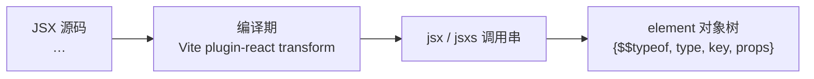
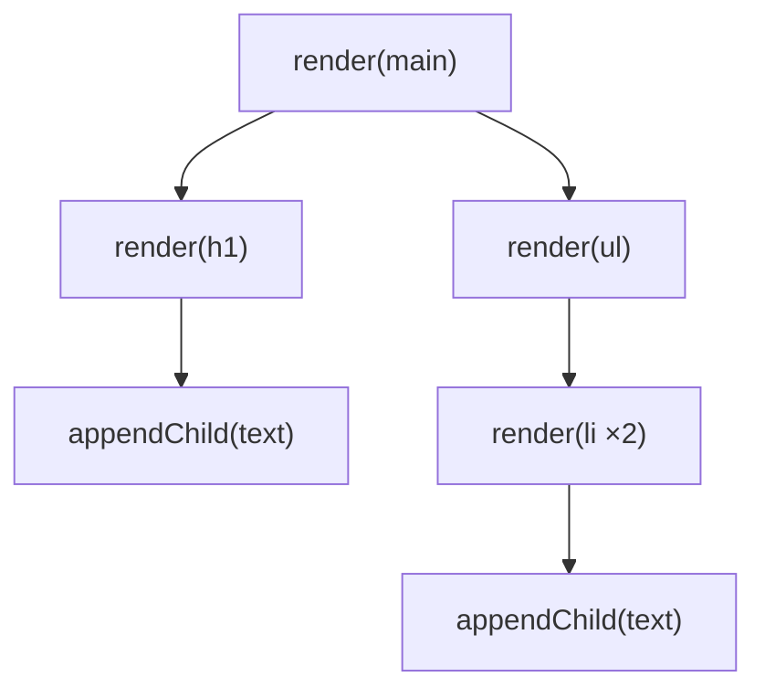

# 02 - JSX 与 createElement

> 对应大纲篇 02（核心层 · 精讲） | 预计时间：75 分钟
> 面试可答：JSX 是语法糖，编译产物是描述 UI 的对象树；虚拟 DOM 是「用对象描述 UI、diff 后最小化操作真实 DOM」。
> 前置：[01 - 全景与项目启动](./01-全景与项目启动.md)；技术栈规范见 [agents.md §5.6](../../../../../agents.md)

---

## 1. 本篇定位

一句话：**看透 JSX 的编译产物，写出第一版渲染器（v0 递归版）——一个明知会被篇 03 重构的演进起点。**

本篇落地 `src/jsx/` 模块（真实保留），并给出递归 render v0（**只存在于本篇文档中**）：

| 产出                                    | 位置               | 状态                                       |
| --------------------------------------- | ------------------ | ------------------------------------------ |
| Element 类型 + createElement + jsx/jsxs | `src/jsx/index.ts` | ✅ 进入 src/，长期保留                     |
| 递归 render v0                          | 仅本篇 §5          | ⚠️ 不进 src/，篇 03 被 fiber workLoop 替代 |

> ⚠️ **「最新形态」约定**：`src/` 始终只保留最新实现。v0 递归版本完成使命后即从仓库消失，本篇文档是它唯一的存档处——这是有意的演进教学：先体会递归的顺滑，再在篇 03 亲手拆掉它。

---

## 2. JSX 的编译产物：automatic runtime

浏览器不认识 JSX。Vite + `@vitejs/plugin-react` 在编译期把它转成 **`jsx()` 函数调用**（automatic runtime）：

```tsx
// 你写的 JSX
const page = (
  <div className="page">
    <h1>标题</h1>
    <p>正文</p>
  </div>
)
```

```ts
// Vite 编译产物（简化示意）：JSX 不见了，只剩函数调用
import { jsx as _jsx, jsxs as _jsxs } from 'react/jsx-runtime'

const page = _jsxs('div', {
  className: 'page',
  children: [_jsx('h1', { children: '标题' }), _jsx('p', { children: '正文' })]
})
```

编译链路一图流：



### 2.1 真实源码：jsx-runtime 的出口链

版本基线 **React 19.3**（2026-09-09 发布）。三个文件串成出口链，路径均已对 `facebook/react` main 分支实核：

1. `packages/react/jsx-runtime.js`：一行出口——`export {Fragment, jsx, jsxs, jsxDEV} from './src/jsx/ReactJSX'`
2. `packages/react/src/jsx/ReactJSX.js`：按 `__DEV__` 把 `jsx` 分派到生产实现 `jsxProd`
3. `packages/react/src/jsx/ReactJSXElement.js`：`jsxProd(type, config, maybeKey)` 的真身

`jsxProd` 只做三件事：

| #   | 行为         | 说明                                                                                                           |
| --- | ------------ | -------------------------------------------------------------------------------------------------------------- |
| 1   | 确定 key     | 优先第三参数 `maybeKey`，其次 `config.key`，统一 `'' + key` 转字符串                                           |
| 2   | 确定 props   | `config` 里没有 key 时**直接复用 config 当 props**（编译器保证每次传新对象，安全）；否则新建对象剔除 key       |
| 3   | 返回 element | `{ $$typeof, type, key, props }`——`$$typeof: Symbol.for('react.transitional.element')` 是虚拟 DOM 节点的身份证 |

> 💡 `jsx` 与 `jsxs` 的区别只在 children 是不是**静态数组**（编译器按 children 数量选用），生产行为完全一致；`jsxDEV` 多一个 `isStaticChildren` 参数，只用于开发期警告。所以本系列统一讲 `jsx(type, props, key)`。

---

## 3. 手写 createElement 与 jsx

`src/jsx/index.ts` 全量落地——两种形态同场竞技（完整源码，与仓库文件逐字一致）：

```ts
// JSX 运行时：createElement（经典形态）与 jsx/jsxs（automatic runtime 形态）
// 真实源码对照：packages/react/src/jsx/ReactJSXElement.js
// （React 19 起 element 符号升级为 transitional，协议同源即指此符号）
export const REACT_ELEMENT_TYPE = Symbol.for('react.transitional.element')

// 元素协议符号：memo / context / provider / suspense 的身份标识（篇 06~11 接入）。
// 符号值对齐 ReactSymbols.js（memo/context/suspense）；REACT_PROVIDER_TYPE 为
// 教学版自拟——19 main 移除 provider 符号（<Context> 直用）
export const REACT_MEMO_TYPE = Symbol.for('react.memo')
export const REACT_CONTEXT_TYPE = Symbol.for('react.context')
export const REACT_PROVIDER_TYPE = Symbol.for('react.provider')
export const REACT_SUSPENSE_TYPE = Symbol.for('react.suspense')

export type Key = string | number | null

export type Props = Record<string, unknown>

// 虚拟 DOM 节点：用普通对象描述「这一次渲染的 UI」
export type ReactElement = {
  $$typeof: symbol
  type: ElementType
  key: Key
  props: Props
}

// 节点子项的原语形态（单行声明：保证 .ts 与文档 md 内嵌块的 oxfmt 结果一致）
export type ChildPrimitive = string | number | boolean | null | undefined

// 组件可以返回的渲染结果（false / undefined 渲染为空，由 reconcile 消化）
export type ReactNode = ReactElement | ChildPrimitive

// 函数组件：接收 props 返回渲染结果（篇 06）。
// P 默认 Props，与 @types/react 的 ComponentType<P> 同款泛型设计；
// ElementType 里取 never 参数形态——函数参数逆变使任意 props 签名的
// 组件都可赋值（等价 React 类型里的 ComponentType<any>，但不裸奔 any）
export type ComponentType<P = Props> = (props: P) => ReactNode

// memo 包裹的组件壳（篇 08）：beginWork 按 $$typeof 识别后剥壳渲染
export type MemoType = {
  $$typeof: typeof REACT_MEMO_TYPE
  type: ComponentType
}

// Context 与 Provider（篇 08）：<Ctx.Provider value={…}> 编译产物的 type
// 就是 Provider 对象，Provider.context 反查 context 本体（真实源码
// createContext 的 Provider 也是独立对象，字段名做了教学化简化——
// 教学版沿用 19.3 前的独立 Provider 包装形态；main 已是
// context.Provider = context）
export type Context<T> = {
  $$typeof: typeof REACT_CONTEXT_TYPE
  defaultValue: T
  currentValue: T
  Provider: ProviderType<T>
}

export type ProviderType<T> = {
  $$typeof: typeof REACT_PROVIDER_TYPE
  context: Context<T>
}

// useContext 的依赖登记条目：真实源码是 fiber.dependencies 上的单链表节点
// （ReactInternalTypes.js 的 ContextDependency），教学版用数组同构
export type ContextDependency<T> = {
  context: Context<T>
  memoizedValue: T
}

// 非宿主元素形态合集：ComponentType<never> 靠参数逆变收编任意 props
// 签名的组件（等价 React 类型里的 ComponentType<any>）
export type NonHostElement =
  ComponentType<never> | MemoType | ProviderType<unknown> | SuspenseType

// 元素 type 的完整形态：宿主标签 / 函数组件 / memo / Provider（篇 06 起扩展）
export type ElementType = string | NonHostElement

// jsx(type, config, maybeKey)：automatic runtime 的编译产物入口
// 真实源码同款行为：key 优先取第三个参数，其次取 config.key；
// config 里没有 key 时直接把 config 当 props 复用（编译器每次传新对象，安全）
export const jsx = (
  type: ElementType,
  config: Props,
  maybeKey?: Key
): ReactElement => {
  let key: Key = null
  if (maybeKey !== undefined) {
    key = String(maybeKey)
  } else if (config.key !== undefined) {
    key = String(config.key)
  }
  let props: Props
  if (!('key' in config)) {
    props = config
  } else {
    // 把 key 从 props 里剔除（key 是定位符，不是属性）
    props = {}
    for (const propName of Object.keys(config)) {
      if (propName !== 'key') {
        props[propName] = config[propName]
      }
    }
  }
  return { $$typeof: REACT_ELEMENT_TYPE, type, key, props }
}

// jsxs：children 为静态数组的形态（编译器按 children 数量选 jsx 或 jsxs）
export const jsxs = (
  type: ElementType,
  config: Props,
  maybeKey?: Key
): ReactElement => {
  return jsx(type, config, maybeKey)
}

// createElement(type, config, ...children)：经典 runtime 手写形态
// 与 jsx 的差异：children 以 rest 参数传入、props 必须新建（config 可能被复用）
export const createElement = (
  type: ElementType,
  config: Props | null,
  ...children: unknown[]
): ReactElement => {
  const props: Props = {}
  let key: Key = null
  if (config !== null) {
    for (const propName of Object.keys(config)) {
      if (propName !== 'key' && propName !== 'ref') {
        props[propName] = config[propName]
      }
    }
    if (config.key !== undefined) {
      key = String(config.key)
    }
  }
  // 单个 child 直接挂值，多个 child 收成数组——这就是 children 形态的来源
  props.children = children.length === 1 ? children[0] : children
  return { $$typeof: REACT_ELEMENT_TYPE, type, key, props }
}
```

两种形态的差异对照：

| 维度         | `createElement(type, config, ...children)` | `jsx(type, config, maybeKey)`   |
| ------------ | ------------------------------------------ | ------------------------------- |
| 调用方       | 人类手写（classic runtime）                | 编译器生成（automatic runtime） |
| children     | rest 参数，单个直接挂值、多个收数组        | 编译器放进 `config.children`    |
| key          | 从 `config.key` 提取                       | 第三参数优先，其次 `config.key` |
| props 对象   | 必须**新建**（config 可能被调用方复用）    | 无 key 时可直接**复用 config**  |
| 完成后的形态 | 同一个 `ReactElement` 对象                 | 同一个 `ReactElement` 对象      |

> 💡 「为什么 jsx 敢复用 config 而 createElement 不敢」：两者的调用契约不同。`jsx` 是编译器目标，编译器每次都构造新对象字面量；`createElement` 可能被人手动调用且传入复用的对象——真实源码 `ReactJSXElement.js` 中两条路径正是这么分别处理的。

---

## 4. children 的多种形态

children 是虚拟 DOM 里最「不讲武德」的字段——什么都能塞。编译器/`createElement` 产出的形态归纳为四类：

| 写法                         | `props.children` 的值 | 渲染结果                             |
| ---------------------------- | --------------------- | ------------------------------------ |
| `<div>文本</div>`            | `'文本'`（字符串）    | 文本节点                             |
| `<div>{count}</div>`         | 数字（表达式求值）    | 转字符串的文本节点                   |
| `<div><span/></div>`         | 单个 element 对象     | 一个子节点                           |
| `<div>{list.map(...)}</div>` | element 数组          | 一组子节点（篇 04 数组 diff 的主角） |

两个容易忽略的角落：

```tsx
// 1. 单元素和多元素只差一个数组壳——createElement 的收拢逻辑
createElement('p', null, 'hello')        // props.children = 'hello'
createElement('p', null, 'a', 'b')       // props.children = ['a', 'b']

// 2. 条件渲染产生的 false / undefined 也是一种「形态」：渲染为空
<div>{isShow && <span/>}</div>           // isShow 为 false → children 是 false
```

> 💡 形态的**消化**发生在 render 阶段：单个 element 走单节点复用判定，数组走两轮循环 diff（篇 04），文本走文本路径。本篇先记住「children 有几种长相」，篇 04 讲「怎么比」。

---

## 5. 递归 render v0：element 树直接生成 DOM

> ⚠️ **本节代码是 v0 教学产物，不进 `src/`**。它将在篇 03 被重构为 fiber workLoop——先跟着写一遍，体会它的顺滑，也体会它的天花板。

思路直给：拿到 element 树，递归地「创建 DOM → 拼属性 → 递归 children → 挂到父级」：

```ts
// ⚠️ v0 递归 render——只活在本篇文档中（篇 03 起 src/ 用 fiber workLoop 替代）
import { createElement, type ReactElement } from '../src'

// JSX 属性名 → HTML 属性名：class / for 是 JS 保留字，JSX 用 className / htmlFor
const ATTR_ALIASES: Record<string, string> = {
  className: 'class',
  htmlFor: 'for'
}

const render = (element: unknown, container: Element): void => {
  // 形态一/二：文本
  if (typeof element === 'string' || typeof element === 'number') {
    container.appendChild(document.createTextNode(String(element)))
    return
  }
  // false / undefined / null：渲染为空
  if (element === null || typeof element !== 'object') {
    return
  }
  const el = element as ReactElement
  const dom = document.createElement(el.type)
  for (const key of Object.keys(el.props)) {
    if (key === 'children') {
      continue
    }
    if (key.startsWith('on') && typeof el.props[key] === 'function') {
      dom.addEventListener(
        key.slice(2).toLowerCase(),
        el.props[key] as EventListener
      )
    } else {
      // JSX 属性名 → HTML 属性名：class / for 是 JS 保留字，JSX 用别名
      dom.setAttribute(ATTR_ALIASES[key] ?? key, String(el.props[key]))
    }
  }
  // children 三种形态：数组逐个递归，单个直接递归
  const children = el.props.children
  if (Array.isArray(children)) {
    for (const child of children) {
      render(child, dom)
    }
  } else {
    render(children, dom)
  }
  container.appendChild(dom)
}

// 用法：手写 createElement（不用 JSX，编译器还没指向 mini-react，篇 12 做切换）
const app = createElement(
  'main',
  { className: 'page' },
  createElement('h1', null, 'mini-react v0'),
  createElement(
    'ul',
    null,
    createElement('li', { key: 1 }, '递归渲染'),
    createElement('li', { key: 2 }, '下一站：Fiber')
  )
)

render(app, document.getElementById('root')!)
```

递归的执行模型：



三个伏笔，篇 03、04 逐一引爆：

1. **调用栈即遍历状态**：递归有多深，栈就有多深，中途没有任何合法暂停点——这正是篇 01 §3.1 说的 Stack Reconciler 死穴
2. **每次全量重建**：改一个字也要从根重新 createElement + 重新创建全部 DOM，没有任何「复用」概念
3. **没有副作用记录**：渲染完就完了，不知道哪些节点是新增/修改/删除的——更新无从谈起

---

## 6. 练习：手写 createElement + 递归渲染嵌套页面

**要求**：不装任何第三方渲染依赖、不写 JSX（编译器切换留到篇 12），在临时入口里用本篇的 `createElement` 手写一棵三层以上的元素树（含文本、属性、key 列表各至少一处），用 §5 的 v0 render 渲染到页面；`console.log` 打印 element 树的形状。

**提示**：临时入口建议放 `playground/mini.html` + `playground/mini-main.tsx`（vite dev server 直接访问 `/mini.html`；⚠️ 不要动对照组 `main.tsx`）。打印树形状时重点看 `props.children`：什么时候是字符串、什么时候是数组，和 §4 表格对一遍。v0 的 `render` 直接从 §5 抄。

**预期效果**：页面上看到嵌套结构；`console` 里能指出「单元素形态在 createElement 里被收拢成非数组值」「列表被收成数组」；能脱稿说出「JSX → jsx() → element 树 → render → DOM」每一步的产物是什么。最后看一眼 §5 的三个伏笔——它们就是你下一篇要解决的问题。

---

## 7. 面试问答

**Q1：JSX 的本质是什么？浏览器能直接运行吗？**

> JSX 是语法糖，浏览器不能直接运行。编译期被转换成 `jsx(type, props, key)` 调用（automatic runtime），运行期得到的只是 `{ $$typeof, type, key, props }` 普通对象树——即虚拟 DOM。框架再对这棵对象树做 diff，把最小化操作提交到真实 DOM。 _（追问见 Q1-1）_
>
> **Q1-1：classic runtime 和 automatic runtime 有什么区别？**
> 转换目标不同：classic 转成 `React.createElement(type, config, ...children)`，需要手动引入 React 作用域；automatic 转成 `react/jsx-runtime` 的 `jsx/jsxs`，编译器自动引入、children 放进 props、key 走第三个参数，且 config 无 key 时可直接复用省一次拷贝。React 17 起 automatic 成为默认。

**Q2：为什么需要虚拟 DOM？直接操作 DOM 不是更快吗？**

> 虚拟 DOM 的卖点不是「比手写 DOM 操作快」，而是「把 UI 声明为数据，由框架 diff 出最小 DOM 操作」。组件化规模下手写优化不可维护；对象树 diff 把昂贵的 DOM 读写压缩成少量提交，同时这棵树可序列化（SSR）、可中断重建（Fiber 并发）——它是 React 整个架构的地基。 _（追问见 Q2-1）_
>
> **Q2-1：虚拟 DOM 一定比直接改 DOM 快吗？**
> 不一定。精确手写单个节点的更新必然快过「重建对象树 + diff + 提交」。虚拟 DOM 提供的是可维护心智模型下的性能下限保障；这是篇 01 对比板块讲过的设计取舍，不是绝对性能竞赛。

---

## 8. 本篇自检

- [ ] 能默写 `jsx(type, config, maybeKey)` 的产物结构，并指出 key 的两个来源
- [ ] 能口述 createElement 与 jsx 的三点差异（children 传参 / props 新建 vs 复用 / key 位置）
- [ ] children 的四种形态与「渲染为空」的边界（false/undefined）能对表复述
- [ ] v0 递归 render 在临时入口跑通嵌套页面，并能说出它必须被篇 03 重构的三个伏笔

---

## 9. 参考资料

- [ReactJSXElement.js（facebook/react main 分支）](https://github.com/facebook/react/blob/main/packages/react/src/jsx/ReactJSXElement.js) —— jsxProd / createElement / ReactElement 的真身
- [React 官方文档 · createElement](https://react.dev/reference/react/createElement) —— classic runtime 的官方参考
- [Build Your Own React（Didact）](https://pomb.us/build-your-own-react/) —— §5 v0 递归 render 的节奏参照
- 上一篇：[01 - 全景与项目启动](./01-全景与项目启动.md) ｜ 下一篇：[03 - Fiber 架构与双缓存树](./03-Fiber架构与双缓存树.md)
