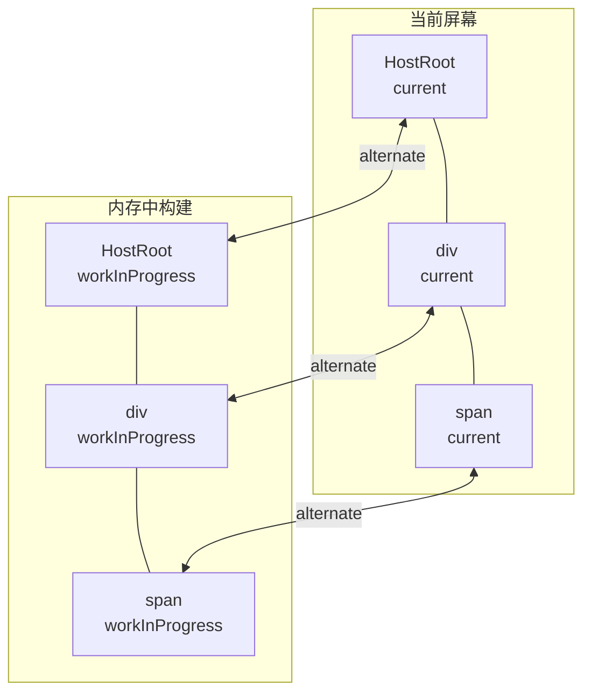
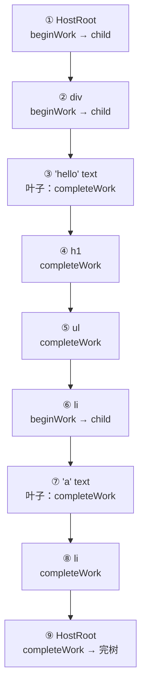

# 03 - Fiber 架构与双缓存树

> 对应大纲篇 03（核心层 · 精讲） | 预计时间：90 分钟
> 面试可答：Fiber 是链表化的虚拟 DOM 节点 + 工作单元；双缓存让「正在构建的树」和「正在显示的树」互不干扰。
> 前置：[02 - JSX 与 createElement](./02-JSX与createElement.md)（element 树与 v0 递归 render）

---

## 1. 本篇定位

一句话：**把篇 02 的递归渲染重构为可中断结构的 fiber 循环——本系列最核心的一次重构，Fiber 体系的地基篇。**

重构完成后，`src/` 就是最新形态：篇 02 的 v0 递归 render **不再保留**（它只存在于篇 02 文档中）。本篇边界：

| ✅ 本篇做                         | ❌ 本篇不做（对应篇目）                          |
| --------------------------------- | ------------------------------------------------ |
| Fiber 数据结构 + 双缓存           | children 的 diff 策略（篇 04，本篇直接全量新建） |
| performUnitOfWork + 同步 workLoop | 时间切片 / shouldYield（篇 09，先占位注释）      |
| commitRoot 入口骨架               | mutation 的 DOM 操作细节（篇 05）                |
| 宿主元素（div/span/text）         | 函数组件（篇 06）、全部 Hooks                    |

---

## 2. 递归为什么不可中断 → 链表化

v0 递归的死穴（篇 01 §3.1、篇 02 §5 铺垫过）：**「下一步做什么」藏在调用栈里**。栈帧是 JS 引擎的私有领地，你的代码无法在两帧之间插手——想暂停？没有合法挂点。

Fiber 的解法分两步：

1. **把「下一步」显式化**：给每个节点三个指针——`child`（第一个孩子）、`sibling`（右兄弟）、`return`（父节点）。树的形态不变，「怎么走下一步」从调用栈搬到了对象字段上
2. **把递归改写成循环**：栈帧驱动变指针驱动，循环体每跑完一圈都是一个合法的暂停点

```mermaid
flowchart LR
    subgraph element 树（篇 02）
        A1["div"] --- A2["h1"]
        A1 --- A3["ul"]
        A3 --- A4["li"]
    end
    subgraph fiber 链表（本篇）
        B1["div fiber"] -->|child| B2["h1 fiber"]
        B2 -->|sibling| B3["ul fiber"]
        B3 -->|child| B4["li fiber"]
        B2 -.->|return| B1
        B3 -.->|return| B1
        B4 -.->|return| B3
    end
```

> 💡 「做完一个单元看一眼该不该让路」：workLoop 每处理完一个 fiber，检查一次 `shouldYield`（时间片耗尽就跳出循环，把控制权还给浏览器）——这句话就是时间切片的全部。本篇的 workLoop 是同步版，检查点先占位，篇 09 补上实现。

---

## 3. Fiber 字段设计

Fiber 是「虚拟 DOM 节点 + 工作单元 + 状态宿主」三合一。先落 `src/fiber/index.ts`（完整源码，与仓库文件逐字一致）：

```ts
// Fiber 数据结构与工厂函数
// 真实源码对照：packages/react-reconciler/src/ReactFiber.js 与 ReactInternalTypes.js
import type {
  ContextDependency,
  ElementType,
  Key,
  Props,
  ReactElement
} from '../jsx'

// WorkTag 简化版：数值与真实源码对齐（ReactWorkTags.js）
// FunctionComponent=0：函数组件 / memo / Provider 共用（篇 06 启用）
export const FunctionComponent = 0
export const HostRoot = 3
export const HostComponent = 5
export const HostText = 6

export type WorkTag =
  | typeof FunctionComponent
  | typeof HostRoot
  | typeof HostComponent
  | typeof HostText

// NoFlags 与 reconcile/ 中其余 flags 常量配套，数值对齐 ReactFiberFlags.js
export const NoFlags = 0

export type { Key, Props } from '../jsx'

export type FiberRoot = {
  containerInfo: Element
  current: Fiber
}

// createRoot 返回的根容器：与 react-dom/client 的 Root 同款 API
export type ReactRoot = {
  render: (element: ReactElement) => void
}

// Fiber：链表化的工作单元。字段与真实源码 ReactInternalTypes.js 同名对齐
export type Fiber = {
  tag: WorkTag
  // 宿主标签 / 函数组件 / memo / Provider；HostText 没有标签，为 null
  type: ElementType | null
  key: Key
  // HostComponent 存 DOM 节点；HostRoot 存 FiberRoot；函数组件无 DOM
  stateNode: Node | FiberRoot | null
  return: Fiber | null
  child: Fiber | null
  sibling: Fiber | null
  index: number
  // 待提交的 props；HostText 直接存文本字符串
  pendingProps: Props | string
  memoizedProps: Props | string | null
  // 篇 06：hooks 链表的挂载点（链表头）
  memoizedState: unknown
  // 篇 08：useContext 的依赖登记（真实源码 fiber.dependencies 同名字段）
  dependencies: ContextDependency<unknown>[] | null
  flags: number
  deletions: Fiber[] | null
  alternate: Fiber | null
}
```

字段速查表（真实源码字段名逐一对齐 `ReactInternalTypes.js` 的 `Fiber` 类型）：

| 字段                       | 一句话职责                                                                                | 与本系列后续篇目的关系         |
| -------------------------- | ----------------------------------------------------------------------------------------- | ------------------------------ |
| `tag`                      | 节点种类（HostRoot=3 / HostComponent=5 / HostText=6，数值与真实 `ReactWorkTags.js` 对齐） | 篇 06 加 FunctionComponent=0   |
| `type`                     | 标签名；HostText 为 null                                                                  | ——                             |
| `key`                      | 同级复用的身份标识                                                                        | 篇 04 diff 三策略之一          |
| `stateNode`                | 真实 DOM（宿主）/ FiberRoot（根）/ **null（函数组件）**                                   | 篇 05 commit 的跳过与穿透      |
| `child / sibling / return` | 链表三指针                                                                                | 本篇主角                       |
| `index`                    | 在同级中的位置                                                                            | 篇 04 lastPlacedIndex 移动判定 |
| `pendingProps`             | 这一次渲染的新 props                                                                      | beginWork 用                   |
| `memoizedProps`            | 上一次已提交的 props                                                                      | 篇 04/05 的 props diff 基准    |
| `memoizedState`            | 状态挂载点（本批恒为 null）                                                               | 篇 06 hooks 链表               |
| `flags`                    | 副作用位标记                                                                              | 篇 04 标记、篇 05 消费         |
| `deletions`                | 待删除的子 fiber 数组                                                                     | 篇 04 收集、篇 05 执行         |
| `alternate`                | 双缓存互指                                                                                | 本篇 §4                        |

> ⚠️ **命名断言**：副作用标记字段叫 `flags`，不叫旧教材里的 `effectTag`（React 已弃用旧名）；「删除」在真实源码里叫 `ChildDeletion` 且**标在父节点上**，配合父节点的 `deletions` 数组——篇 04 展开为什么这样设计。

---

## 4. 双缓存：current 树与 workInProgress 树

同一棵 UI 在任何时刻存在两份 fiber 树：

- **current 树**：对应当前屏幕——`root.current` 指向它，commit 的基准
- **workInProgress 树**：正在内存里构建的下一棵树——render 阶段的操作对象
- 两棵树通过 `alternate` 字段**成对互指**；commit 完成后 `root.current = finishedWork` 交换角色



为什么必须两棵树：render 阶段**随时可中断**，中断时屏幕上必须始终是完整可显示的旧树；新树在内存里慢慢搭，搭完一次性转正。单树方案（边遍历边改）会出现「半成品树被用户看到」的中间态。

`createWorkInProgress` 是双缓存的引擎——能复用就复用 alternate，不能才克隆（`src/fiber/index.ts` 后半）：

```ts
export const createFiber = (
  tag: WorkTag,
  pendingProps: Props | string,
  key: Key
): Fiber => ({
  tag,
  type: null,
  key,
  stateNode: null,
  return: null,
  child: null,
  sibling: null,
  index: 0,
  pendingProps,
  memoizedProps: null,
  memoizedState: null,
  dependencies: null,
  flags: NoFlags,
  deletions: null,
  alternate: null
})

export const createFiberFromElement = (element: {
  type: ElementType
  key: Key
  props: Props
}): Fiber => {
  // 宿主标签走 HostComponent；函数组件 / memo / Provider 共用 FunctionComponent
  // （真实源码按 type 形态分派到 createFiberFromElement / createFiberFromMemo 等）
  const tag =
    typeof element.type === 'string' ? HostComponent : FunctionComponent
  const fiber = createFiber(tag, element.props, element.key)
  fiber.type = element.type
  return fiber
}

export const createFiberFromText = (text: string): Fiber => {
  return createFiber(HostText, text, null)
}

// createWorkInProgress：双缓存的核心。复用 alternate 或克隆 current
// 真实源码同款签名：createWorkInProgress(current, pendingProps)
export const createWorkInProgress = (
  current: Fiber,
  pendingProps: Props | string
): Fiber => {
  let wip = current.alternate
  if (wip === null) {
    wip = createFiber(current.tag, pendingProps, current.key)
    wip.type = current.type
    wip.stateNode = current.stateNode
    wip.alternate = current
    current.alternate = wip
  } else {
    // 复用已有骨架：只刷新「这一次渲染」的字段
    wip.pendingProps = pendingProps
    wip.type = current.type
    wip.flags = NoFlags
    wip.deletions = null
    wip.child = null
    wip.sibling = null
    wip.index = 0
    // context 依赖登记以上一次已提交的记录为基准带到本次渲染
    // （真实源码 beginWork 时同样从 current 克隆 dependencies）
    wip.dependencies = current.dependencies
  }
  return wip
}

// 容器 fiber：每个 createRoot 一个，stateNode 指向 FiberRoot
export const createHostRootFiber = (): Fiber => {
  return createFiber(HostRoot, {}, null)
}
```

> 💡 `stateNode` 在克隆/复用时直接继承——DOM 节点本身是「当前展示的实物」，两棵树共享同一份 DOM 引用。复用分支把 `flags` 清回 `NoFlags`：上一轮的副作用标记不能带进新一轮。交换时机有讲究：真实源码在 **mutation 之后、layout 之前**执行 `root.current = finishedWork`（篇 05 解释为什么卡在这个缝里）。

---

## 5. performUnitOfWork：向下、向右、向上

递归的两种语义被拆成两个函数：

- **beginWork**：向下（「进入」节点，比较 children，返回 child）
- **completeWork**：处理「完成」的节点（本篇先只做宿主节点的 DOM 创建/拼装，diff 判定在篇 04 补进 reconcile）

`src/fiber/beginWork.ts` 全量落地：

```ts
// render 阶段的工作单元：beginWork 向下，completeWork 向上
// 真实源码对照：ReactFiberBeginWork.js / ReactFiberCompleteWork.js
import type { Fiber, Props } from './index'
import {
  createWorkInProgress,
  FunctionComponent,
  HostComponent,
  HostRoot,
  HostText
} from './index'
import type {
  ComponentType,
  Context,
  ElementType,
  MemoType,
  ProviderType
} from '../jsx'
import { REACT_MEMO_TYPE, REACT_PROVIDER_TYPE } from '../jsx'
import { reconcileChildren, Update } from '../reconcile'
import { propagateContextChange, renderWithHooks } from '../hooks'

// beginWork：处理「进入」一个 fiber——比较 children，返回下一个工作单元
export const beginWork = (workInProgress: Fiber): Fiber | null => {
  switch (workInProgress.tag) {
    case HostRoot:
      return beginHostRoot(workInProgress)
    case HostComponent:
      return beginHostComponent(workInProgress)
    case FunctionComponent:
      return beginFunctionComponent(workInProgress)
    case HostText:
    default:
      // 文本节点是叶子：没有 children 可比较
      return null
  }
}

const beginHostRoot = (workInProgress: Fiber): Fiber | null => {
  const props = workInProgress.pendingProps as Props
  reconcileChildren(workInProgress, props.children)
  return workInProgress.child
}

const beginHostComponent = (workInProgress: Fiber): Fiber | null => {
  const props = workInProgress.pendingProps as Props
  reconcileChildren(workInProgress, props.children)
  return workInProgress.child
}

// 类型守卫：memo / Provider 都是「对象形态」的元素 type（符号见 jsx/index.ts）
const isMemoType = (type: ElementType | null): type is MemoType => {
  return (
    typeof type === 'object' &&
    type !== null &&
    type.$$typeof === REACT_MEMO_TYPE
  )
}

const isProviderType = (
  type: ElementType | null
): type is ProviderType<unknown> => {
  return (
    typeof type === 'object' &&
    type !== null &&
    type.$$typeof === REACT_PROVIDER_TYPE
  )
}

// 函数组件 fiber 没有 stateNode：beginWork 直接调用组件函数取 children
// （真实源码走 renderWithHooks → finishRenderingHooks 的完整管线）
const beginFunctionComponent = (workInProgress: Fiber): Fiber | null => {
  const type = workInProgress.type
  if (isProviderType(type)) {
    return beginProvider(workInProgress, type.context)
  }
  const props = workInProgress.pendingProps as Props
  // memo 是组件的「浅比较壳」：props 未变且 context 未变就 bailout，
  // 组件函数一次都不调用（篇 08）
  if (isMemoType(type) && workInProgress.alternate !== null) {
    const current = workInProgress.alternate
    const prevProps = current.memoizedProps
    if (
      typeof prevProps === 'object' &&
      prevProps !== null &&
      !hasPropsChanged(prevProps as Props, props) &&
      !hasContextChanged(workInProgress)
    ) {
      return bailoutOnAlreadyFinishedWork(workInProgress)
    }
  }
  const Component = (isMemoType(type) ? type.type : type) as ComponentType
  const children = renderWithHooks(workInProgress, Component, props)
  reconcileChildren(workInProgress, children)
  // memo 的浅比较基准：记录本次渲染的 props（真实源码同款回写位置）
  workInProgress.memoizedProps = workInProgress.pendingProps
  return workInProgress.child
}

// Provider（篇 08）：先把 value 写进 context（children 随后渲染即可读到新值），
// 变更时沿旧树标记依赖 fiber——context 更新的「树上标记」
const beginProvider = (
  workInProgress: Fiber,
  context: Context<unknown>
): Fiber | null => {
  const props = workInProgress.pendingProps as Props
  const newValue = props.value
  if (!Object.is(context.currentValue, newValue)) {
    context.currentValue = newValue
    const current = workInProgress.alternate
    propagateContextChange(current !== null ? current.child : null, context)
  }
  reconcileChildren(workInProgress, props.children)
  workInProgress.memoizedProps = workInProgress.pendingProps
  return workInProgress.child
}

// memo 放行检查之一：本 fiber 登记过的 context 是否有值变更
// （变更标记由 Provider 的 propagateContextChange 写入 memoizedValue）
const hasContextChanged = (fiber: Fiber): boolean => {
  const deps = fiber.dependencies
  if (deps === null) {
    return false
  }
  return deps.some((dep) => dep.context.currentValue !== dep.memoizedValue)
}

// bailout：props 浅比较相等且 context 未变 → 跳过重渲。
// 真实 React 按 childLanes/subtreeFlags 惰性逐层克隆；教学版二选一：
// 子树干净就整棵克隆（零重渲），子树里有 context 变更标记就只克隆一层、
// 让循环继续深入走到被标记的 fiber
const bailoutOnAlreadyFinishedWork = (workInProgress: Fiber): Fiber | null => {
  workInProgress.memoizedProps = workInProgress.pendingProps
  const current = workInProgress.alternate
  if (current === null || current.child === null) {
    return null
  }
  if (subtreeHasContextChange(current.child)) {
    const child = createWorkInProgress(
      current.child,
      current.child.pendingProps
    )
    child.return = workInProgress
    workInProgress.child = child
    return child
  }
  workInProgress.child = cloneFinishedSubtree(current.child, workInProgress)
  return null
}

const subtreeHasContextChange = (start: Fiber): boolean => {
  if (hasContextChanged(start)) {
    return true
  }
  if (start.child !== null && subtreeHasContextChange(start.child)) {
    return true
  }
  return start.sibling !== null && subtreeHasContextChange(start.sibling)
}

// 整棵克隆已完成的子树：fiber 骨架复用（alternate 互指），flags 已由
// createWorkInProgress 清空——commit 对它不做任何 DOM 操作
const cloneFinishedSubtree = (current: Fiber, returnFiber: Fiber): Fiber => {
  const wip = createWorkInProgress(current, current.pendingProps)
  wip.return = returnFiber
  wip.index = current.index
  wip.memoizedProps = current.memoizedProps
  wip.sibling =
    current.sibling !== null
      ? cloneFinishedSubtree(current.sibling, returnFiber)
      : null
  wip.child =
    current.child !== null ? cloneFinishedSubtree(current.child, wip) : null
  return wip
}

// completeWork：处理「完成」一个 fiber——只负责宿主节点：
// 挂载时创建 DOM 并自底向上拼装子树；更新时只 diff props、标记 Update，
// 真正动手改 DOM 留给 commit 阶段（渲染阶段保持可中断的纯计算）。
// 函数组件 fiber 没有 DOM 输出，走 default 分支直接跳过
export const completeWork = (workInProgress: Fiber): void => {
  const current = workInProgress.alternate
  switch (workInProgress.tag) {
    case HostComponent: {
      const props = workInProgress.pendingProps as Props
      if (current !== null && workInProgress.stateNode !== null) {
        const oldProps = current.memoizedProps
        if (
          typeof oldProps === 'object' &&
          oldProps !== null &&
          hasPropsChanged(oldProps as Props, props)
        ) {
          workInProgress.flags |= Update
        }
      } else {
        // 首挂载：创建实例，并把已完成的子节点 DOM 拼进自己
        // （HostComponent 的 type 一定是标签名字符串）
        const type = workInProgress.type
        if (typeof type === 'string') {
          const instance = document.createElement(type)
          updateProps(instance, {}, props)
          appendAllChildren(instance, workInProgress)
          workInProgress.stateNode = instance
        }
      }
      workInProgress.memoizedProps = props
      break
    }
    case HostText: {
      const text = workInProgress.pendingProps as string
      if (current !== null && current.memoizedProps !== text) {
        workInProgress.flags |= Update
      }
      if (workInProgress.stateNode === null) {
        workInProgress.stateNode = document.createTextNode(text)
      }
      workInProgress.memoizedProps = text
      break
    }
    default:
      break
  }
}

const hasPropsChanged = (oldProps: Props, newProps: Props): boolean => {
  // children 每轮渲染都是新数组引用，其变化由 reconcile 层 diff 处理——
  // 两个循环都跳过 children 键，不参与浅比较（否则 memo bailout 永远失效）
  for (const key of Object.keys(newProps)) {
    if (key !== 'children' && oldProps[key] !== newProps[key]) {
      return true
    }
  }
  for (const key of Object.keys(oldProps)) {
    if (key !== 'children' && !(key in newProps)) {
      return true
    }
  }
  return false
}

// 真实源码同款：appendAllChildren 把已完成子树的 DOM 摘下来挂进父实例。
// 所以首挂载时只有最顶层的节点需要 Placement（见 reconcile 的 mountChildFibers）。
// 注意 else-if：宿主 fiber 的 DOM 内部已在各自的 completeWork 拼装完毕，
// 追加后不再下钻（appendChild 是移动语义，重复下钻会把子孙 DOM 拽出来）；
// 只有函数组件这类「没有自己 DOM」的 fiber 才向下找宿主节点
const appendAllChildren = (parent: Node, workInProgress: Fiber): void => {
  let node = workInProgress.child
  while (node !== null) {
    if (node.tag === HostComponent || node.tag === HostText) {
      const dom = node.stateNode
      if (dom instanceof Node) {
        parent.appendChild(dom)
      }
    } else if (node.child !== null) {
      // 函数组件 / Provider / memo：向下穿透找第一层宿主 DOM
      node = node.child
      continue
    }
    if (node === workInProgress) {
      return
    }
    while (node.sibling === null) {
      if (node.return === null || node.return === workInProgress) {
        return
      }
      node = node.return
    }
    node = node.sibling
  }
}

// props 写入（含原生事件简化绑定）。export 供 commit 阶段复用
export const updateProps = (
  dom: HTMLElement,
  oldProps: Props,
  newProps: Props
): void => {
  for (const key of Object.keys(oldProps)) {
    if (key === 'children' || key === 'key' || key === 'ref') {
      continue
    }
    if (key in newProps && oldProps[key] === newProps[key]) {
      continue
    }
    removeProp(dom, key, oldProps[key])
  }
  for (const key of Object.keys(newProps)) {
    if (key === 'children' || key === 'key' || key === 'ref') {
      continue
    }
    if (key in oldProps && oldProps[key] === newProps[key]) {
      continue
    }
    setProp(dom, key, newProps[key])
  }
}

// JSX 属性名 → HTML 属性名：class / for 是 JS 保留字，JSX 用 className / htmlFor
const ATTR_ALIASES: Record<string, string> = {
  className: 'class',
  htmlFor: 'for'
}

const setProp = (dom: HTMLElement, key: string, value: unknown): void => {
  if (key.startsWith('on') && typeof value === 'function') {
    // 原生事件简化：onClick → addEventListener('click')（合成事件不在本系列范围）
    dom.addEventListener(key.slice(2).toLowerCase(), value as EventListener)
    return
  }
  if (key === 'style' && typeof value === 'object' && value !== null) {
    Object.assign(dom.style, value)
    return
  }
  if (typeof value === 'boolean') {
    const target = dom as unknown as Record<string, unknown>
    target[key] = value
    return
  }
  dom.setAttribute(ATTR_ALIASES[key] ?? key, String(value))
}

const removeProp = (dom: HTMLElement, key: string, oldValue: unknown): void => {
  if (key.startsWith('on') && typeof oldValue === 'function') {
    dom.removeEventListener(
      key.slice(2).toLowerCase(),
      oldValue as EventListener
    )
    return
  }
  if (key === 'style') {
    dom.removeAttribute('style')
    return
  }
  if (typeof oldValue === 'boolean') {
    const target = dom as unknown as Record<string, unknown>
    target[key] = false
    return
  }
  // 与 setProp 同一套别名：set 写的是 class，remove 就必须删 class，
  // 否则 removeAttribute('className') 落空、旧类名永久残留
  dom.removeAttribute(ATTR_ALIASES[key] ?? key)
}
```

> ⚠️ **「最新形态」约定**：上面 beginWork 代码是篇 06/08 接线后的最新形态——本篇的主角只有宿主节点的 beginWork/completeWork 与 appendAllChildren，函数组件分支、Provider 与 memo bailout 分别在篇 06、篇 08 逐段展开。

然后是遍历循环本体 `src/fiber/workLoop.ts`：

```ts
// workLoop 与渲染入口：performUnitOfWork / workLoopSync / createRoot / commitRoot
// 真实源码对照：packages/react-reconciler/src/ReactFiberWorkLoop.js
import type { Fiber, FiberRoot, ReactRoot } from './index'
import { createHostRootFiber, createWorkInProgress } from './index'
import { beginWork, completeWork } from './beginWork'
import { commitMutation } from '../commit'
import { flushLayoutEffects, schedulePassiveEffects } from '../hooks'
import type { ReactElement } from '../jsx'

let workInProgress: Fiber | null = null
let workInProgressRoot: FiberRoot | null = null

// performUnitOfWork：一个可中断的「工作单元」。
// beginWork 向下（返回 child）；到叶子后 completeWork 沿 sibling 向右、
// 向 return 向上回溯——用循环替代了 v0 递归的调用栈
export const performUnitOfWork = (fiber: Fiber): Fiber | null => {
  const next = beginWork(fiber)
  if (next !== null) {
    return next
  }
  let current: Fiber | null = fiber
  while (current !== null) {
    completeWork(current)
    if (current.sibling !== null) {
      return current.sibling
    }
    current = current.return
  }
  return null
}

// 同步 workLoop（v1）：一口气跑完。篇 09 在这里插入 shouldYield 变成时间切片
const workLoopSync = (): void => {
  while (workInProgress !== null) {
    workInProgress = performUnitOfWork(workInProgress)
  }
}

// 更新调度入口（篇 06）：dispatch 入队后从这里触发根级重渲。
// 微任务级批量合并——同一次事件里多次 setState 只排一次微任务、
// 只跑一次 render + commit（React 18+ 自动 batching 的最简形态）
let isRenderScheduled = false
export const scheduleRootRender = (root: FiberRoot): void => {
  if (isRenderScheduled) {
    return
  }
  isRenderScheduled = true
  queueMicrotask(() => {
    isRenderScheduled = false
    renderRoot(root)
  })
}

const renderRoot = (root: FiberRoot): void => {
  workInProgressRoot = root
  workInProgress = createWorkInProgress(root.current, root.current.pendingProps)
  workLoopSync()
  commitRoot()
}

// commitRoot 入口骨架：只负责「调 mutation + 交换双缓存 + 收尾 effects」，
// 具体 DOM 操作在 src/commit。真实源码里这一层串联三大子阶段
const commitRoot = (): void => {
  const root = workInProgressRoot
  const finishedWork = root !== null ? root.current.alternate : null
  if (root === null || finishedWork === null) {
    return
  }
  commitMutation(finishedWork, root)
  // 双缓存交换：workInProgress 树转正为 current 树。
  // 真实源码这一行在 mutation 之后、layout 之前执行
  root.current = finishedWork
  // layout effects：同步执行——DOM 已更新、浏览器尚未绘制（篇 07）
  flushLayoutEffects()
  // passive effects：异步 flush（本批用微任务最简实现，篇 09 挂到真调度器）
  schedulePassiveEffects()
  workInProgressRoot = null
  workInProgress = null
}

// createRoot(container).render(element)：与 react-dom/client 同款 API
export const createRoot = (container: Element): ReactRoot => {
  const root: FiberRoot = {
    containerInfo: container,
    current: createHostRootFiber()
  }
  root.current.stateNode = root
  return {
    render(element: ReactElement): void {
      // 要渲染的 element 挂在 HostRoot 的 pendingProps.children 上
      // （真实 React 走 updateContainer → 更新队列，简化为直接赋值）
      root.current.pendingProps = { children: element }
      renderRoot(root)
    }
  }
}
```

遍历顺序演示（以下图树为例，编号即 performUnitOfWork 的调用次序）：



> 💡 内层 `while` 回溯（向上 + 向右）就是递归「栈展开」的显式化：v0 里这靠函数返回自然发生，现在靠 `return` / `sibling` 指针手动走。走到 HostRoot 都没有 sibling，返回 null，workLoop 退出——整棵树完成。

---

## 6. 源码对照：mini vs 真实

| mini-react                                     | 真实源码（19.x main，已实核路径）             | 差距说明                                                                        |
| ---------------------------------------------- | --------------------------------------------- | ------------------------------------------------------------------------------- |
| `fiber/index.ts` 的 Fiber 类型                 | `ReactInternalTypes.js` 的 `Fiber`            | 真实版多 lanes/subtreeFlags/调试字段；核心字段同名同义                          |
| `createWorkInProgress` / `createHostRootFiber` | `ReactFiber.js` 同名导出                      | 真实版 FiberNode 带 mode/lanes 构造参数                                         |
| `beginWork` 只处理 3 个 tag                    | `ReactFiberBeginWork.js` 处理 25+ tag         | 真实版按 tag 分派到 beginWork 系列 + mountChildFibers/reconcileChildFibers 选择 |
| `completeWork` 只做宿主节点                    | `ReactFiberCompleteWork.js` 的 `completeWork` | 真实版含 appendAllChildren 同款逻辑 + 各类组件的 stateNode 组装                 |
| `workLoopSync`                                 | `ReactFiberWorkLoop.js` 的 `workLoopSync`     | 真实版配合 Scheduler；篇 09 对齐                                                |

阅读建议：先读本篇自己的代码建立心智模型，再按 `ReactFiber.js → ReactInternalTypes.js → ReactFiberBeginWork.js` 的顺序进真实源码——字段对得上，恐惧感减半。

---

## 7. 练习：把 02 的递归 render 重构为 fiber workLoop

**要求**：`src/` 下的 `fiber/`、`reconcile/`、`commit/` 三个模块即本篇代码——把它们亲手抄齐（或对照校对），然后在临时入口（`playground/mini.html`，同篇 02 约定）用 `createRoot().render()` 渲染**与篇 02 练习相同的嵌套页面**，DOM 结果必须一致。

**提示**：在 `performUnitOfWork` 首行打 debugger 断点，观察每次暂停时 `fiber.tag` / `fiber.type` 的变化顺序——对照 §5 的编号图逐步走一遍；再观察 `completeWork` 被调用的时机（总是从最深的叶子开始）。

**预期效果**：渲染结果与 v0 一致但机制完全不同；能指着断点说出「beginWork 向下、completeWork 向右向上」在代码里的落点；能解释 `workLoopSync` 为什么暂时打不断（循环 + 同步，篇 09 加 `shouldYield` 后 render 阶段才真正可中断）。

---

## 8. 面试问答

**Q1：Fiber 是什么？为什么需要它？**

> Fiber 是 React 16 起的核心数据结构：把虚拟 DOM 节点链表化（child/sibling/return 三指针），每个节点就是一个工作单元。它让「一次做完的递归渲染」变成「可以随时停下、随时继续的循环」，从而支持可中断渲染与优先级调度——这是并发特性（Transition/Suspense）的结构基础。 _（追问见 Q1-1）_
>
> **Q1-1：链表化为什么就能中断？中断后怎么恢复？**
> 递归的遍历状态存在调用栈里，外部无法保存/插手；链表化后遍历状态只剩一个指针（下一个工作单元），循环每完成一个单元都是合法暂停点。恢复时把指针放回循环即可——配合双缓存，被中断的 workInProgress 树留在内存里，下一帧继续搭。

**Q2：双缓存机制是什么？alternate 怎么工作？**

> 同一棵 UI 始终有两棵 fiber 树：current 树对应当前屏幕，workInProgress 树在内存构建，两棵树按节点 alternate 互指、共享 stateNode（DOM 实物只有一份）。render 阶段搭 workInProgress，搭完 commit 转正（`root.current = finishedWork`），两棵树角色互换。好处：中断期间屏幕永远显示完整的旧树，新树不影响线上。 _（追问见 Q2-1）_
>
> **Q2-1：为什么 commit 后要交换 current？不交换行不行？**
> 不交换的话，下一次更新的「旧树基准」就没了——diff 需要拿 current 树做复用判定（篇 04）。交换的本质是「刚提交的 workInProgress 下一轮变成 current」，复用 alternate 骨架还能省掉整树重建的内存分配。

**Q3：beginWork 和 completeWork 各做什么？**

> beginWork 处理「进入」节点：比较 children 生成/复用子 fiber（本篇先全量新建，篇 04 才是真正的 diff），返回下一个工作单元；completeWork 处理「完成」节点：本篇负责宿主节点的 DOM 创建与自底向上拼装（appendAllChildren）、更新路径的 props diff 标记。合起来：beginWork 生成树、completeWork 补齐每层的输出，副作用只标记不执行，留给 commit（篇 05）。

---

## 9. 本篇自检

- [ ] 能画出 element 树 → fiber 链表的 child/sibling/return 指针图
- [ ] 篇 03 版字段表共 14 个字段（`child / sibling / return` 合为一行），后续篇目扩展至 16 个（`dependencies`、`lanes`），且知道为什么用 flags 不用 effectTag
- [ ] 能脱稿讲双缓存：两棵树、alternate 互指、commit 后交换、为什么必须两棵
- [ ] performUnitOfWork 的「向下 / 向右 / 向上」在断点里走通一次
- [ ] 知道本篇 workLoop 是同步版，时间切片的检查点在哪（篇 09）

---

## 10. 参考资料

- [ReactFiber.js（facebook/react main）](https://github.com/facebook/react/blob/main/packages/react-reconciler/src/ReactFiber.js) —— FiberNode / createWorkInProgress / createHostRootFiber
- [ReactInternalTypes.js](https://github.com/facebook/react/blob/main/packages/react-reconciler/src/ReactInternalTypes.js) —— Fiber 类型的字段定义（本篇字段表的对齐基准）
- [ReactFiberBeginWork.js](https://github.com/facebook/react/blob/main/packages/react-reconciler/src/ReactFiberBeginWork.js) —— 真实 beginWork 的按 tag 分派
- [ReactFiberCompleteWork.js](https://github.com/facebook/react/blob/main/packages/react-reconciler/src/ReactFiberCompleteWork.js) —— 真实 completeWork 与 appendAllChildren
- [Build Your Own React（Didact）](https://pomb.us/build-your-own-react/) —— fiber 遍历结构的节奏参照
- 上一篇：[02 - JSX 与 createElement](./02-JSX与createElement.md) ｜ 下一篇：[04 - Reconciliation 与 Diff 算法](./04-Reconciliation与Diff算法.md)
