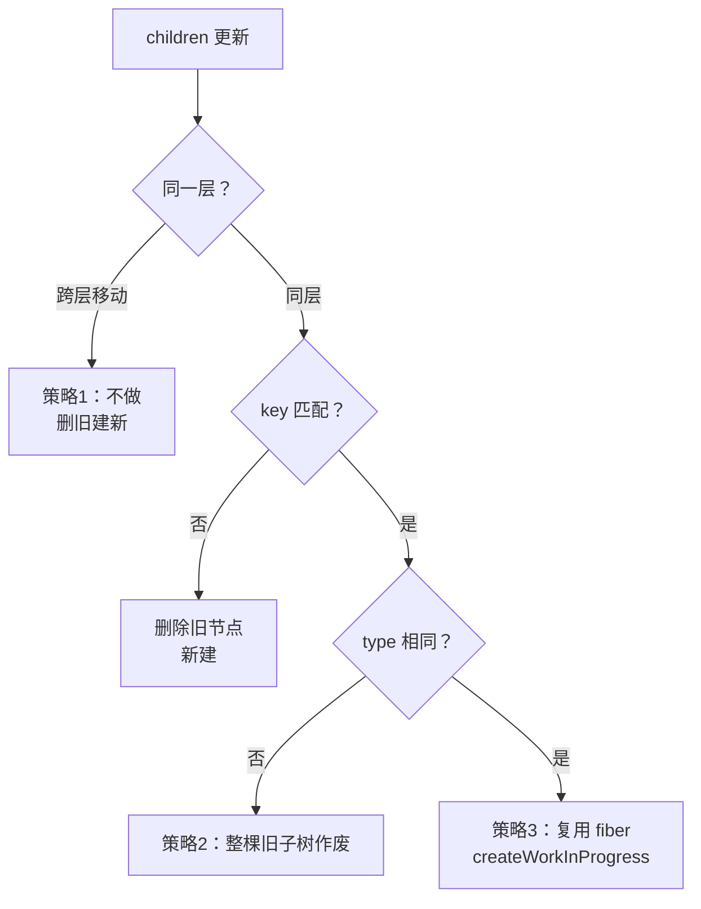

# 04 - Reconciliation 与 Diff 算法

> 对应大纲篇 04（核心层 · 精讲） | 预计时间：90 分钟
> 面试可答：Diff 三大策略——同层比较、type 不同即重建、key 标识同级复用；O(n) 的来源。
> 前置：[03 - Fiber 架构与双缓存树](./03-Fiber架构与双缓存树.md)（Fiber 结构与 workLoop）

---

## 1. 本篇定位

一句话：**在 beginWork 的「比较 children」环节装上真正的 diff——复用判定、flags 标记、待删收集，一次配齐。**

篇 03 的 `reconcileChildren` 目前只是个「全量新建」的空壳，本篇把它填实。产出集中在 `src/reconcile/index.ts`（下文分段展示，拼起来即完整文件）：

| 能力                                         | 落点                                                      |
| -------------------------------------------- | --------------------------------------------------------- |
| 三种 children 形态的分派（单元素/数组/文本） | `reconcileChildFibersImpl`                                |
| 同级复用判定（key + type）                   | `reconcileSingleElement` / `updateSlot` / `updateFromMap` |
| flags：Placement / Update / ChildDeletion    | 常量 + `placeChild` / `deleteChild`                       |
| 待删节点收集                                 | `deletions` 数组                                          |
| mount 与 update 双入口                       | `mountChildFibers` / `reconcileChildFibers`               |

---

## 2. Diff 三大策略与 O(n)

把「两棵树完全比对」从 O(n³) 压到 O(n)，靠三条**假设剪枝**：

| #   | 策略                 | 一句话                                       | 实现                                               |
| --- | -------------------- | -------------------------------------------- | -------------------------------------------------- |
| 1   | **同层比较**         | 只比同一层，跨层移动视为「删旧建新」         | reconcile 永远只在 `returnFiber` 的孩子层操作      |
| 2   | **type 不同即重建**  | `div` 变 `span`：整棵旧子树作废，不尝试复用  | `child.type === element.type` 判定，失败即删       |
| 3   | **key 标识同级复用** | key 相同视为「同一个节点搬家」，可跨位置复用 | key 匹配 + type 匹配 → `createWorkInProgress` 复用 |



> 💡 为什么不做跨层移动优化：DOM 树的层级结构在实践中极少跨层平移（组件边界就是层），为小概率场景引入跨层配对的复杂度与开销不值——这是工程取舍，不是能力上限。

---

## 3. reconcileChildren：三种 children 形态的分派

先看入口与工厂（`src/reconcile/index.ts` 第 1 段）：

```ts
// Reconciliation：children 的 diff 与副作用标记
// 真实源码对照：packages/react-reconciler/src/ReactChildFiber.js
// （真实源码把所有逻辑包在 createChildReconciler 工厂里，这里保持同构）
import {
  createFiberFromElement,
  createFiberFromText,
  createWorkInProgress,
  HostText
} from '../fiber'
import type { Fiber } from '../fiber'
import { REACT_ELEMENT_TYPE } from '../jsx'
import type { Key, ReactElement } from '../jsx'

// flags 常量：数值与真实源码对齐（ReactFiberFlags.js）
// 注意：真实源码已用 flags 取代旧名 effectTag；删除标记叫 ChildDeletion，
// 标在父节点上，具体待删节点收进父节点的 deletions 数组
export const Placement = 0b0010
export const Update = 0b0100
export const ChildDeletion = 0b10000

const isReactElement = (value: unknown): value is ReactElement => {
  return (
    typeof value === 'object' &&
    value !== null &&
    (value as { $$typeof?: symbol }).$$typeof === REACT_ELEMENT_TYPE
  )
}

type Reconciler = (
  returnFiber: Fiber,
  currentFirstChild: Fiber | null,
  newChild: unknown
) => Fiber | null

// 真实源码同款：mountChildFibers（首挂载）不追踪副作用，reconcileChildFibers
// （更新）才标记 Placement / ChildDeletion。差异只是 shouldTrackSideEffects
export const createChildReconciler = (
  shouldTrackSideEffects: boolean
): Reconciler => {
```

关键设计一：**工厂 + 布尔开关**。真实源码 `ReactChildFiber.js` 导出的两个入口就是这么来的——`reconcileChildFibers = createChildReconciler(true)`、`mountChildFibers = createChildReconciler(false)`。

为什么要两个入口？首挂载时没有旧树可比、没有节点可删，标记 Placement 反而是浪费（挂载树由 completeWork 的 appendAllChildren 自底向上拼装，篇 03 已见）；更新时才需要精确记录「动了谁」。

关键设计二：**选择权在 returnFiber 身上**——它有 alternate（更新）就走副作用追踪，没有（首挂载）就不标。看文件尾部的统一入口（第 4 段，先提前展示）：

```ts
export const reconcileChildFibers = createChildReconciler(true)
export const mountChildFibers = createChildReconciler(false)

// beginWork 的统一入口：有 alternate（更新）走副作用追踪，首挂载不标 flags。
// 与真实源码一致：区分点在 returnFiber 是否有 alternate，而非全局开关
export const reconcileChildren = (
  workInProgress: Fiber,
  newChild: unknown
): void => {
  const current = workInProgress.alternate
  const currentFirstChild = current !== null ? current.child : null
  const reconciler = current === null ? mountChildFibers : reconcileChildFibers
  workInProgress.child = reconciler(workInProgress, currentFirstChild, newChild)
}
```

分派主体（第 4 段前半）：children 的四种形态在这里各回各家——

```ts
  const reconcileChildFibersImpl = (
    returnFiber: Fiber,
    currentFirstChild: Fiber | null,
    newChild: unknown
  ): Fiber | null => {
    if (typeof newChild === 'string' || typeof newChild === 'number') {
      const fiber = updateTextNode(
        returnFiber,
        currentFirstChild,
        String(newChild)
      )
      if (shouldTrackSideEffects && fiber.alternate === null) {
        fiber.flags |= Placement
      }
      return fiber
    }
    if (isReactElement(newChild)) {
      const fiber = reconcileSingleElement(
        returnFiber,
        currentFirstChild,
        newChild
      )
      if (shouldTrackSideEffects && fiber.alternate === null) {
        fiber.flags |= Placement
      }
      return fiber
    }
    if (Array.isArray(newChild)) {
      return reconcileChildrenArray(returnFiber, currentFirstChild, newChild)
    }
    // undefined / false / true 等渲染为空
    return null
  }

  return reconcileChildFibersImpl
}
```

> 💡 `fiber.alternate === null` 时标 Placement：这是「复用判定」的最终裁决——复用成功的节点（`createWorkInProgress` 的产物）alternate 非空，无需挂载标记；判定失败的产物是新 fiber，commit 时需要插入 DOM。

---

## 4. 单元素与文本路径

第 2 段源码——单元素的复用判定是三大策略最直接的落点：

```ts
const deleteChild = (returnFiber: Fiber, childToDelete: Fiber): void => {
  if (!shouldTrackSideEffects) {
    // 首挂载没有旧节点可删
    return
  }
  if (returnFiber.deletions === null) {
    returnFiber.deletions = [childToDelete]
    returnFiber.flags |= ChildDeletion
  } else {
    returnFiber.deletions.push(childToDelete)
  }
}

const deleteRemainingChildren = (
  returnFiber: Fiber,
  currentFirstChild: Fiber | null
): null => {
  let child = currentFirstChild
  while (child !== null) {
    deleteChild(returnFiber, child)
    child = child.sibling
  }
  return null
}

// 复用旧 fiber 的统一入口是 createWorkInProgress：
// 双缓存骨架（alternate 互指）在那里建立，这里只负责接回 return 指针

// 单元素路径：key 对上就复用，type 变了整棵旧子树重建
const reconcileSingleElement = (
  returnFiber: Fiber,
  currentFirstChild: Fiber | null,
  element: ReactElement
): Fiber => {
  let child = currentFirstChild
  while (child !== null) {
    if (child.key === element.key) {
      if (child.type === element.type) {
        // 复用：右侧剩余旧节点全部删除
        deleteRemainingChildren(returnFiber, child.sibling)
        const existing = createWorkInProgress(child, element.props)
        existing.return = returnFiber
        return existing
      }
      // key 相同但 type 不同：整棵旧子树作废
      deleteRemainingChildren(returnFiber, child)
      break
    }
    // key 不同：删掉当前，继续向右找
    deleteChild(returnFiber, child)
    child = child.sibling
  }
  const created = createFiberFromElement(element)
  created.return = returnFiber
  return created
}

// 文本路径：旧节点是文本就复用（内容比对留到 completeWork），否则新建
const updateTextNode = (
  returnFiber: Fiber,
  oldFiber: Fiber | null,
  text: string
): Fiber => {
  if (oldFiber === null || oldFiber.tag !== HostText) {
    const created = createFiberFromText(text)
    created.return = returnFiber
    return created
  }
  const existing = createWorkInProgress(oldFiber, text)
  existing.return = returnFiber
  return existing
}

// 元素更新：type 相同复用，type 不同新建（旧的留给删除路径处理）
const updateElement = (
  returnFiber: Fiber,
  oldFiber: Fiber | null,
  element: ReactElement
): Fiber => {
  if (oldFiber !== null && oldFiber.type === element.type) {
    const existing = createWorkInProgress(oldFiber, element.props)
    existing.return = returnFiber
    return existing
  }
  const created = createFiberFromElement(element)
  created.return = returnFiber
  return created
}
```

单元素路径的判定矩阵（`reconcileSingleElement` 的循环体）：

| 旧节点 key | 旧节点 type | 动作                                              |
| ---------- | ----------- | ------------------------------------------------- |
| 相同       | 相同        | ✅ 复用（`createWorkInProgress`），右侧剩余全删   |
| 相同       | 不同        | 整棵旧子树删除（`deleteRemainingChildren`），新建 |
| 不同       | ——          | 删掉这一个，向右继续找；找不到就新建              |

文本路径注意两点：文本节点**没有 key**（隐式 null），旧节点是 `HostText` 才可复用；文本内容本身不在这里比——篇 03 的 `completeWork` 已按 `memoizedProps !== text` 标了 Update。

---

## 5. 数组 diff：两轮循环

数组 children 是 diff 的主战场。算法分两轮（第 3 段源码）：

```ts
// 第一轮按位置对齐：key 匹配才更新，否则返回 null 让位给第二轮
const updateSlot = (
  returnFiber: Fiber,
  oldFiber: Fiber | null,
  newChild: unknown
): Fiber | null => {
  const key = oldFiber !== null ? oldFiber.key : null
  if (typeof newChild === 'string' || typeof newChild === 'number') {
    // 文本节点隐式 key 为 null：旧位置有 key 就对不上
    if (key !== null) {
      return null
    }
    return updateTextNode(returnFiber, oldFiber, String(newChild))
  }
  if (isReactElement(newChild)) {
    if (newChild.key === key) {
      return updateElement(returnFiber, oldFiber, newChild)
    }
    return null
  }
  return null
}

// 第二轮按 Map 匹配：剩余新子项按 key 找复用。
// 无 key 节点（文本 / 条件渲染的 null 之外的默认元素）以 index 作为
// Map 键——真实源码 mapRemainingChildren / updateFromMap 同款兜底，
// 否则同级多个 null key 节点会在 Map 里互相覆盖、待删节点丢失
const updateFromMap = (
  returnFiber: Fiber,
  existingChildren: Map<Key, Fiber>,
  newIdx: number,
  newChild: unknown
): Fiber | null => {
  if (isReactElement(newChild)) {
    const keyToUse = newChild.key !== null ? newChild.key : newIdx
    const matched = existingChildren.get(keyToUse) ?? null
    if (matched !== null) {
      existingChildren.delete(keyToUse)
    }
    return updateElement(returnFiber, matched, newChild)
  }
  if (typeof newChild === 'string' || typeof newChild === 'number') {
    const matched = existingChildren.get(newIdx) ?? null
    if (matched !== null) {
      existingChildren.delete(newIdx)
    }
    return updateTextNode(returnFiber, matched, String(newChild))
  }
  return null
}

// 移动判定核心：lastPlacedIndex 记录「最后一个不需要动的旧节点位置」，
// 复用节点的旧 index 比它小 → 要从后面挪到前面 → 标 Placement
const placeChild = (
  newFiber: Fiber,
  lastPlacedIndex: number,
  newIndex: number
): number => {
  newFiber.index = newIndex
  if (!shouldTrackSideEffects) {
    // 首挂载：DOM 树由 completeWork 自底向上拼装，不需要 Placement
    return lastPlacedIndex
  }
  if (newFiber.alternate !== null) {
    const oldIndex = newFiber.alternate.index
    if (oldIndex < lastPlacedIndex) {
      newFiber.flags |= Placement
      return lastPlacedIndex
    }
    return oldIndex
  }
  // 全新节点：插入
  newFiber.flags |= Placement
  return lastPlacedIndex
}

// 数组 diff：两轮循环（真实源码同款结构）
const reconcileChildrenArray = (
  returnFiber: Fiber,
  currentFirstChild: Fiber | null,
  newChildren: unknown[]
): Fiber | null => {
  let resultingFirstChild: Fiber | null = null
  let previousNewFiber: Fiber | null = null
  let oldFiber = currentFirstChild
  let lastPlacedIndex = 0
  let newIdx = 0

  // 第一轮：按位置对齐，key 对得上就更新，对不上立即停下
  for (; oldFiber !== null && newIdx < newChildren.length; newIdx++) {
    const newChild = newChildren[newIdx]
    const newFiber = updateSlot(returnFiber, oldFiber, newChild)
    if (newFiber === null) {
      break
    }
    if (newFiber.alternate === null) {
      // 这个位置没法复用旧节点：旧的被替换，删除
      deleteChild(returnFiber, oldFiber)
    }
    lastPlacedIndex = placeChild(newFiber, lastPlacedIndex, newIdx)
    if (previousNewFiber === null) {
      resultingFirstChild = newFiber
    } else {
      previousNewFiber.sibling = newFiber
    }
    previousNewFiber = newFiber
    oldFiber = oldFiber.sibling
  }

  if (newIdx < newChildren.length) {
    // 第二轮：剩余旧节点收进 Map，剩余新子项按 key 找复用
    // （无 key 节点以 index 入表，见 updateFromMap 注释）
    const existingChildren = new Map<Key, Fiber>()
    for (let scan = oldFiber; scan !== null; scan = scan.sibling) {
      existingChildren.set(scan.key !== null ? scan.key : scan.index, scan)
    }
    for (; newIdx < newChildren.length; newIdx++) {
      const newChild = newChildren[newIdx]
      const newFiber = updateFromMap(
        returnFiber,
        existingChildren,
        newIdx,
        newChild
      )
      if (newFiber !== null) {
        lastPlacedIndex = placeChild(newFiber, lastPlacedIndex, newIdx)
        if (previousNewFiber === null) {
          resultingFirstChild = newFiber
        } else {
          previousNewFiber.sibling = newFiber
        }
        previousNewFiber = newFiber
      }
    }
    // 剩余没被复用的旧节点统一删除
    for (const leftover of existingChildren.values()) {
      deleteChild(returnFiber, leftover)
    }
  } else {
    // 新子项先耗尽：剩余旧子树整体删除
    deleteRemainingChildren(returnFiber, oldFiber)
  }

  if (previousNewFiber === null) {
    return null
  }
  // 复用节点可能带着上一轮的旧 sibling 链，切干净
  previousNewFiber.sibling = null
  return resultingFirstChild
}
```

### 5.1 移动判定演算：lastPlacedIndex

以旧列表 `[A, B, C, D]` 更新为 `[C, A, D, B]`（key 用字母本身）为例，第一轮 key 全对不上立即进第二轮，逐项走 `placeChild`：

| 新位置 | 节点 | 旧 index | lastPlacedIndex（处理前） | 判定             | 处理后 lastPlacedIndex |
| ------ | ---- | -------- | ------------------------- | ---------------- | ---------------------- |
| 0      | C    | 2        | 0                         | 2 ≥ 0，原地      | 2                      |
| 1      | A    | 0        | 2                         | 0 < 2 → **移动** | 2                      |
| 2      | D    | 3        | 2                         | 3 ≥ 2，原地      | 3                      |
| 3      | B    | 1        | 3                         | 1 < 3 → **移动** | 3                      |

结果：只有 A、B 标 Placement，C、D 原地不动。lastPlacedIndex 的语义是「目前最靠右的不用动的旧节点位置」——凡是旧位置在它左边的复用节点，都意味着要从后面挪到前面去。

### 5.2 两轮的分工

| 轮次   | 匹配方式                                         | 何时结束                                                     |
| ------ | ------------------------------------------------ | ------------------------------------------------------------ |
| 第一轮 | **按位置**：`new[i]` 对 `old[i]`，key 相等才处理 | key 对不上立即 break（后面的位置已经乱了，位置对齐失去意义） |
| 第二轮 | **按 key**：剩余旧节点进 Map，剩余新子项查表复用 | 新子项耗尽                                                   |

第二轮结束后，Map 里剩下的就是没被任何新子项认领的旧节点——统一 `deleteChild`。这就是「插入 / 删除 / 移动」三种用例在实现层的落点：插入 = Map 查不到 → 新建 + Placement；删除 = Map 剩余 → deletions；移动 = 查到但旧 index < lastPlacedIndex → Placement。

---

## 6. index 作 key 的失效场景：实现层解释

写法：`list.map((item, i) => <li key={i}>)`。看一次「头部插入」在实现层发生了什么：

旧列表 `[A, B, C]`（key 分别是 0/1/2），头部插入 X 后新列表 `[X, A, B, C]`（key 变成 0/1/2/3）：

| 新位置 | 新节点(key) | 旧节点(key) | 判定                                                 |
| ------ | ----------- | ----------- | ---------------------------------------------------- |
| 0      | X(0)        | A(0)        | key 0 对上、type 同 → **复用 A 的 fiber/DOM 渲染 X** |
| 1      | A(1)        | B(1)        | **复用 B 渲染 A**                                    |
| 2      | B(2)        | C(2)        | **复用 C 渲染 B**                                    |
| 3      | C(3)        | 无          | 新建 C                                               |

- ❌ **index 作 key**：所有位置「key 对得上、type 也对得上」，diff 认为四个节点全部原地复用、零移动——实际是每个节点的**内容**都被更新了一遍（性能差），更要命的是节点身份错位：篇 06 接入 Hooks 后，A 组件的 state 会挂在「key=1 的 fiber」上，插入后变成 B 的 state——**状态串位**
- ✅ **稳定 key**（如 `item.id`）：X 在 Map 里查不到 → 新建 + Placement 插入；A/B/C 按 key 原地复用、零内容更新

> 💡 一句话：key 的意义是「跨渲染的节点身份证」，index 不是身份——它是位置，位置会撒谎。输入框、复选框这类「带内部状态」的节点用 index 作 key，bug 一定现形。

---

## 7. 练习：带 key 的列表 diff，三用例验证复用

**要求**：在临时入口渲染一个列表（3~5 项，`key={item.id}`），用 `root.render(新element树)` 触发更新（当前没有 state，篇 06 才有），依次构造三个用例：**移动**（中间项挪到最前）、**插入**（头部新增一项）、**删除**（中间移除一项）。每次更新后断言：DOM 顺序正确、被复用节点的 DOM 引用不变（渲染前把 `li.dataset.ticker = Date.now()` 写进去，或保存 `li` 元素引用做 `===` 比对）。

**提示**：在 `reconcileChildrenArray` 的 `placeChild` 内加一条 `console.log(新key, 旧index, lastPlacedIndex)`，对照 §5.1 的演算表逐行核对「谁被标了 Placement」；删除用例重点看 `returnFiber.deletions` 数组与 `ChildDeletion` 标记（DOM 真正摘除在篇 05）。

**预期效果**：三个用例全绿；能指着日志说出移动用例中「哪两个节点被标 Placement、为什么其余没有」；能复述 index 作 key 时头部插入为什么「零移动、全错位」。

---

## 8. 面试问答

**Q1：React 的 Diff 算法是什么？为什么是 O(n)？**

> Diff 比较新旧 fiber 树的同层 children，产出 Placement/Update/ChildDeletion 副作用标记。完全比对是 O(n³)，React 靠三大策略剪枝到 O(n)：同层比较（不跨层移动）、type 不同即重建（不跨类型复用）、key 标识同级复用。实践中组件树的跨层/跨类型变化极少，三条假设换来线性成本。 _（追问见 Q1-1）_
>
> **Q1-1：为什么不对「跨层移动」做优化？**
> DOM 层级在实践中极少跨层平移，跨层配对需要全局索引与更复杂的比较协议，收益低、复杂度高、可能破坏子树状态的确定性——删除重建反而语义最清晰。这是性能与复杂度的工程取舍。

**Q2：key 在 Diff 里到底起什么作用？**

> key 是节点跨渲染的身份标识。同层比对时，key 相同 + type 相同 → 复用旧 fiber（连带 DOM 与组件状态）；只有 key 相同但 type 不同才整棵重建。它把「按位置对齐」升级成「按身份对齐」，让列表更新从全量替换变成最小化移动。 _（追问见 Q2-1）_
>
> **Q2-1：index 作 key 为什么有问题？从实现层说说。**
> index 是位置不是身份。头部插入时每个位置的 key「恰好对上」，diff 走复用路径：零移动标记，但每个节点的 props/内容被错误地更新成别的节点的内容；等篇 06 有组件状态后，状态挂在「位置对应的 fiber」上，会直接串位。稳定业务 id 则让新节点被识别为插入、旧节点原地复用。

**Q3：删除一个节点为什么要把标记打在父节点上？**

> 真实源码（ReactChildFiber.js 的 deleteChild）把待删子节点 push 进父 fiber 的 `deletions` 数组、在父 fiber 上标 `ChildDeletion`。因为「复用判定」发生在父层的 children 循环里，此时天然持有父节点引用；打在子节点身上则需要向上冒泡合并标记。commit 阶段（篇 05）看到父节点有 ChildDeletion，遍历 deletions 逐个摘除 DOM。

---

## 9. 本篇自检

- [ ] 三大策略能各配一个「失效/触发」例子
- [ ] 单元素路径的 key/type 判定矩阵能脱稿写出
- [ ] 能用 lastPlacedIndex 演算一个「移动」用例（ABCD → CABD 类）
- [ ] 两轮循环各自负责什么、什么条件下 break / 走 Map
- [ ] index 作 key 的失效原因能从「复用判定」层讲清，而不是背结论

---

## 10. 参考资料

- [ReactChildFiber.js（facebook/react main）](https://github.com/facebook/react/blob/main/packages/react-reconciler/src/ReactChildFiber.js) —— createChildReconciler / reconcileSingleElement / reconcileChildrenArray / deleteChild
- [ReactFiberFlags.js](https://github.com/facebook/react/blob/main/packages/react-reconciler/src/ReactFiberFlags.js) —— Placement/Update/ChildDeletion 等位标记定义
- [React 官方文档（legacy）· Reconciliation](https://legacy.reactjs.org/docs/reconciliation.html) —— 三大策略的官方表述
- 上一篇：[03 - Fiber 架构与双缓存树](./03-Fiber架构与双缓存树.md) ｜ 下一篇：[05 - Commit 阶段与 DOM 提交](./05-Commit阶段与DOM提交.md)
