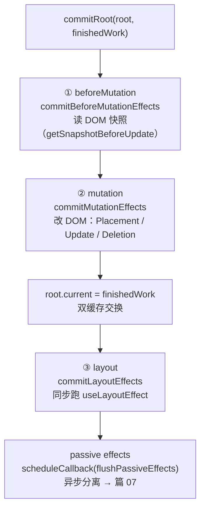

# 05 - Commit 阶段与 DOM 提交

> 对应大纲篇 05（基础层 · 精讲） | 预计时间：75 分钟
> 面试可答：commit 同步执行分三段——beforeMutation 读快照、mutation 改 DOM、layout 跑 useLayoutEffect；render 可中断但 commit 不可。
> 前置：[04 - Reconciliation 与 Diff 算法](./04-Reconciliation与Diff算法.md)（flags 与 deletions 的来源）

---

## 1. 本篇定位

一句话：**把篇 04 算好的 flags 真正落到 DOM——打通「更新 → 屏幕」的完整闭环，v1 同步渲染器在本篇交付完毕。**

| 产出                                                   | 位置                                                  |
| ------------------------------------------------------ | ----------------------------------------------------- |
| mutation 实现（Placement/Update/Deletion 的 DOM 操作） | `src/commit/index.ts`                                 |
| commitRoot 入口 + 双缓存交换                           | `src/fiber/workLoop.ts`（篇 03 已落地，本篇补讲结构） |

---

## 2. commitRoot 全景：真实源码的三大子阶段

commit 是「把内存里的成果一次性推上屏幕」的阶段。真实源码（`ReactFiberWorkLoop.js`）里，**历史上独立的 `commitRootImpl` 已并入当前的 `commitRoot` 函数**（19.x main 分支实核，写作基准 2026-09）——它内部按顺序串联三大子阶段：



三个关键事实（均已在真实源码实核）：

1. **子阶段的执行体都在另一个文件**：`commitBeforeMutationEffects` / `commitMutationEffects` / `commitLayoutEffects` 由 `ReactFiberCommitWork.js` 实现并导出，`ReactFiberWorkLoop.js` 只负责串联——「骨架与肌肉分离」
2. **双缓存交换卡在 mutation 与 layout 之间**：源码注释原话是「必须在 mutation 之后（unmount 期间旧树仍是 current）、layout 之前（layout 期间新树已是 current）」——篇 03 那行 `root.current = finishedWork` 的依据
3. **passive effects（useEffect）不进 commit 的同步段**：commitRoot 里用 `scheduleCallback(NormalSchedulerPriority, () => flushPassiveEffects())` 把它排成异步任务——这是篇 07 的主线，本篇只需记住「结构上分离」

> ⚠️ **render 可中断、commit 不可中断**（篇 01 埋的问题，现在能从结构上回答）：commit 一旦开始就一口气跑完三大子阶段，中途没有让出点——mutation 进行到一半的 DOM 是用户正在看的，JS 没有任何回滚手段。

---

## 3. mutation：按 flags 分派 DOM 操作

`src/commit/index.ts` 全量落地（完整源码，与仓库文件逐字一致）：

```ts
// commit 阶段：把 render 阶段算好的 flags 落成真实 DOM 操作（mutation）
// 真实源码对照：packages/react-reconciler/src/ReactFiberCommitWork.js
// 与 ReactFiberWorkLoop.js 的 commitMutationEffects
import type { Fiber, FiberRoot } from '../fiber'
import { FunctionComponent, HostComponent, HostRoot, HostText } from '../fiber'
import type { Props } from '../jsx'
import { ChildDeletion, Placement, Update } from '../reconcile'
import { collectFiberEffects, runUnmountEffects } from '../hooks'
import { updateProps } from '../fiber/beginWork'

// commitMutation：遍历 finishedWork 树，按 flags 分派 DOM 操作。
// 教学版递归全树；真实源码用 subtreeFlags 剪枝（flags 都没有的子树整棵跳过）
export const commitMutation = (finishedWork: Fiber, root: FiberRoot): void => {
  const walk = (fiber: Fiber): void => {
    if ((fiber.flags & ChildDeletion) !== 0 && fiber.deletions !== null) {
      for (const deleted of fiber.deletions) {
        commitDeletion(deleted)
      }
      fiber.deletions = null
    }
    if ((fiber.flags & Placement) !== 0) {
      commitPlacement(fiber, root)
    }
    if ((fiber.flags & Update) !== 0) {
      commitUpdate(fiber)
    }
    // 函数组件：把本次渲染待执行的 effect 分拣进 layout / passive 两个队列
    // （layout 由 commitRoot 同步 flush，passive 由微任务异步 flush——篇 07）
    if (fiber.tag === FunctionComponent) {
      collectFiberEffects(fiber)
    }
    if (fiber.child !== null) {
      walk(fiber.child)
    }
    if (fiber.sibling !== null) {
      walk(fiber.sibling)
    }
  }
  walk(finishedWork)
}
```

遍历策略对照：

| 维度                  | mini-react（教学版）    | 真实源码                                                                                                    |
| --------------------- | ----------------------- | ----------------------------------------------------------------------------------------------------------- |
| 遍历方式              | 自顶向下递归全树        | 自顶向下遍历，但按 **subtreeFlags** 剪枝——子树完全没有 flags 就整棵跳过                                     |
| 遍历结构来源          | 直接走 child/sibling 链 | React 18 起同样用 fiber 链 + subtreeFlags；更早版本用「effect list 链表」（firstEffect/lastEffect，已移除） |
| 同节点多 flags 的顺序 | 先删 → 再插 → 后改      | 相同顺序（Deletion 必须最先，避免锚点失效）                                                                 |

> 💡 为什么「先删后插」：一个节点被删除后，它旁边要插入的锚点（sibling 的 DOM）可能恰好是被删的那个；先删后插配合「右侧第一个存活兄弟」做锚点，顺序就安全了。effect list 是历史方案——面试如果被问「effect 列表」，可以说明 18+ 已被 subtreeFlags 取代（这也是篇 05 大纲里「父先子后 vs effect 列表顺序的坑」的时代背景）。

---

## 4. Placement：找宿主父级与锚点

第 2 段源码——插入的关键是两个查找：向上找**能挂的父级**，向右找**锚点**：

```ts
// 自宿主向上找第一个有 DOM 的父级：HostComponent 用自己的 DOM，
// HostRoot 用容器。函数组件 fiber 没有 stateNode，会被自然跳过（篇 06 接入）
const getHostParentFiber = (fiber: Fiber): Fiber => {
  let parent = fiber.return
  while (parent !== null) {
    if (parent.tag === HostComponent || parent.tag === HostRoot) {
      return parent
    }
    parent = parent.return
  }
  throw new Error('commitPlacement: 找不到宿主父节点')
}

const toNode = (fiber: Fiber): Node | null => {
  const stateNode = fiber.stateNode
  return stateNode instanceof Node ? stateNode : null
}

const commitPlacement = (fiber: Fiber, root: FiberRoot): void => {
  const parentFiber = getHostParentFiber(fiber)
  const parentDOM =
    parentFiber.tag === HostComponent ? toNode(parentFiber) : root.containerInfo
  if (parentDOM === null) {
    return
  }
  // 锚点：右侧第一个已有 DOM 的兄弟；没有就 append 到末尾
  let anchor: Node | null = null
  let sibling = fiber.sibling
  while (sibling !== null) {
    const dom = toNode(sibling)
    if (dom !== null) {
      anchor = dom
      break
    }
    sibling = sibling.sibling
  }
  // 函数组件 fiber 自己没有 DOM：向下找第一层宿主节点再挂
  // （真实源码同款：insertOrAppendPlacementNode 递归穿透函数组件）
  insertOrAppendPlacementNode(fiber, anchor, parentDOM)
}

// 真实源码 insertOrAppendPlacementNode 同款：宿主 fiber 直接挂 DOM；
// 函数组件 fiber 沿 child / sibling 下钻，把子树的宿主 DOM 逐个挂进父级
const insertOrAppendPlacementNode = (
  fiber: Fiber,
  before: Node | null,
  parentDOM: Node
): void => {
  const dom = toNode(fiber)
  if (dom !== null) {
    if (before !== null) {
      parentDOM.insertBefore(dom, before)
    } else {
      parentDOM.appendChild(dom)
    }
    return
  }
  const child = fiber.child
  if (child !== null) {
    insertOrAppendPlacementNode(child, before, parentDOM)
    let sibling = child.sibling
    while (sibling !== null) {
      insertOrAppendPlacementNode(sibling, before, parentDOM)
      sibling = sibling.sibling
    }
  }
}
```

两个查找各自解决一个边界：

- **向上找父级**：待插节点的直接父级可能是函数组件 fiber（无 stateNode）——篇 06 之后这会是常态而不是例外，所以必须沿 `return` 向上找到第一个 HostComponent/HostRoot
- **向右找锚点**：用 `insertBefore(node, anchor)` 保序；锚点不存在（右侧没有已挂载的兄弟）才 `appendChild` 兜底

> 💡 回忆篇 03：首挂载时只有最顶层 fiber 带 Placement（appendAllChildren 已把子树 DOM 拼好），所以 `commitPlacement` 在 mount 时通常只执行一次、目标就是容器；update 时才高频执行。

---

## 5. Update 与 Deletion：改和删，以及函数组件占位

第 3 段源码：

```ts
const commitUpdate = (fiber: Fiber): void => {
  if (fiber.tag === HostText) {
    const dom = fiber.stateNode
    if (dom instanceof Text) {
      dom.nodeValue = fiber.pendingProps as string
    }
    return
  }
  if (fiber.tag === HostComponent) {
    const dom = fiber.stateNode
    if (dom instanceof HTMLElement) {
      const newProps = fiber.pendingProps as Props
      const oldProps = fiber.memoizedProps
      updateProps(
        dom,
        typeof oldProps === 'object' && oldProps !== null
          ? (oldProps as Props)
          : {},
        newProps
      )
    }
  }
  // 其他 tag（函数组件等）：输出走 fiber 链上的子树，无需在此提交 DOM
}

// 删除：先跑被删子树的 unmount effect 清理（篇 07），再从被删 fiber 向下
// 找第一层有 DOM 的节点摘除。函数组件 fiber 没有 stateNode——不能停也不能删，
// 向下穿透；真实 React 会在删除前先跑完子树的 cleanup（组件卸载语义）
const commitDeletion = (fiber: Fiber): void => {
  runUnmountEffects(fiber)
  let node: Fiber | null = fiber
  while (node !== null) {
    const dom = toNode(node)
    if (dom !== null) {
      dom.parentNode?.removeChild(dom)
      return
    }
    node = node.child
  }
}
```

### 5.1 函数组件 fiber 无 stateNode：三处占位

函数组件的输出是「children 的渲染结果」而不是 DOM，所以它自己的 fiber 上没有 stateNode。本批函数组件还不存在（篇 06 接入），但 commit 的三个函数已经为它留好了位置：

| commit 函数          | 遇到无 stateNode 的 fiber           | 篇 06 要补的                                    |
| -------------------- | ----------------------------------- | ----------------------------------------------- |
| `getHostParentFiber` | 沿 `return` 向上**自然跳过**        | 无需改动                                        |
| `commitUpdate`       | switch 不命中任何分支，**直接跳过** | 在这里调用函数组件取新 children、diff 后提交    |
| `commitDeletion`     | **向下穿透**找到第一层宿主 DOM 摘除 | 摘除前先跑 unmount 副作用（清理 effect/清 ref） |

> 💡 这张表就是篇 06 的「施工图纸」：commit 层不因函数组件改动结构，只往占位处填逻辑——好的架构 allows 增量演进，值得在面试里当设计案例讲。

---

## 6. 对照真实源码：mini vs ReactFiberWorkLoop

| mini-react                              | 真实源码（19.x main，已实核）                                                    | 差距说明                                                       |
| --------------------------------------- | -------------------------------------------------------------------------------- | -------------------------------------------------------------- |
| `commitRoot` 调 mutation + 交换 current | `commitRoot` 串联三大子阶段（历史 `commitRootImpl` 已并入）                      | 真实版含 lane 收尾（markRootFinished）与 Profiling             |
| `commitMutation` 递归全树               | `commitMutationEffects`（ReactFiberCommitWork.js）+ subtreeFlags 剪枝            | 真实版按 tag 分派、处理 ContentReset/Hoistable 等              |
| 无 beforeMutation / layout              | `commitBeforeMutationEffects` / `commitLayoutEffects`                            | layout 与 useLayoutEffect 绑定，本系列篇 07 补                 |
| 无 passive                              | `scheduleCallback` 异步排 `flushPassiveEffects`                                  | 篇 07 主线                                                     |
| layout 同步执行（未来版）               | 当前 main 把 layout 也拆进 `pendingEffectsStatus` 状态机（`flushLayoutEffects`） | 演进方向：把「不可中断的段」切得更小，本系列教学版保持同步执行 |

> 💡 读真实源码的建议顺序：先在 `ReactFiberWorkLoop.js` 里找 `function commitRoot`，把三大子阶段的调用骨架抄一遍，再进 `ReactFiberCommitWork.js` 看 `commitMutationEffectsOnFiber` 的按 tag 分派——骨架先行，不会被肌肉淹没。

---

## 7. 练习：完整提交闭环（计数器页面）

**要求**：在临时入口（`playground/mini.html`，前两篇的约定不变）用 `createElement` 写一个计数器页面：计数文本 + 「+1」按钮。当前还没有 state（篇 06 才有 `useState`）——用一个模块级变量 `count` 保存，点击按钮时 `count += 1` 并重新调 `root.render(新树)`。页面里再加一个「随机插入/删除一项」的按钮，让三种 flags 都被触发过：文本变化（Update）、新增节点（Placement）、移除节点（Deletion）。

**提示**：在 `commitMutation` 的 `walk` 首行打 debugger 断点，观察每个 fiber 的 `flags` 数值与 `Placement / Update / ChildDeletion` 的对应关系（2 / 4 / 16，位掩码可以 `flags & Placement` 单独验证）。想验证「commit 不可中断」：断点停在 `commitPlacement` 里时看屏幕——DOM 要么没变要么全变，永远看不到「插了一半」的中间态；再用一个 `while (Date.now() - start < 2000)` 卡死主线程模拟长任务，确认界面冻结期间也不会出现半成品。

**预期效果**：计数器完整闭环；能指着代码说出每个 flags 对应的 DOM API（`insertBefore` / `appendChild` / `nodeValue` / `updateProps` / `removeChild`）；能解释 v1 为什么「想断也断不了」——同步 workLoop + 同步 commit，篇 09 切片后 render 可断、commit 依然不可断。

---

## 8. 面试问答

**Q1：commit 阶段做了什么？三个子阶段各司何职？**

> commitRoot 同步串联三段：beforeMutation 读 DOM 快照（`getSnapshotBeforeUpdate`，commit 改 DOM 前最后的机会）；mutation 按 flags 分派真实 DOM 操作（Placement 插入、Update 改属性、Deletion 摘除）；layout 同步执行 `useLayoutEffect`（DOM 已更新、浏览器尚未绘制，适合测量布局）。layout 之后 passive effects（`useEffect`）由调度器异步执行。 _（追问见 Q1-1）_
>
> **Q1-1：`root.current = finishedWork` 为什么卡在 mutation 之后、layout 之前？**
> mutation 期间可能触发旧组件的卸载逻辑，此时屏幕语义还是「旧树」，current 必须仍指向旧树；而 layout 阶段的 `useLayoutEffect` 里读到的 DOM 与 `ref` 必须已经是「新树」的。真实源码注释明确写了这个时序约束——早一步晚一步都有组件读到错位的树。

**Q2：为什么 render 可中断、commit 不可中断？**

> render 阶段只操作 JS 对象（fiber 树），中断时丢弃或续上 workInProgress 都不影响屏幕；commit 操作真实 DOM，mutation 进行到一半的界面用户正在看，且 JS 无法回滚 DOM——必须一口气完成。所以时间切片只切 render，commit 是「不可打断的提交原语」。 _（追问见 Q2-1）_
>
> **Q2-1：如果 mutation 执行到一半抛了异常怎么办？**
> DOM 会停留在半更新状态且无法回滚——这是真实 React 也存在的硬约束。React 的策略是在 render 阶段尽量拦截错误（error boundary 捕获后重渲），让错误尽量不流进 commit；一旦 commit 抛错，只能按 error boundary 的卸载/重建路径尽力恢复，不存在「回滚到半个 commit 之前」的机制。这也是「commit 要小而快」的原因之一。

**Q3：函数组件的 fiber 没有 stateNode，commit 怎么处理？**

> 三处各司其职：找父级 DOM 时沿 return 向上跳过（宿主父级总能找到）；Update 分派时函数组件分支为空、直接跳过（本批无函数组件）；删除时向下穿透找到第一层真实 DOM 摘除。篇 06 接入函数组件后，Update 分支将承担「调用函数取 children → 递归 diff」的提交工作，删除分支补上 unmount 副作用——结构不变，只填占位。

---

## 9. 本篇自检

- [ ] 能画出 commitRoot 的子阶段流程图，标出双缓存交换的确切位置
- [ ] Placement 的「向上找父级 / 向右找锚点」两个查找能说清边界
- [ ] commitMutation 里「先删后插再改」的顺序理由能讲出来
- [ ] 函数组件无 stateNode 的三处占位表能默写，且知道篇 06 各补什么
- [ ] 计数器闭环跑通，三种 flags 都亲眼见过数值

---

## 10. 参考资料

- [ReactFiberWorkLoop.js（facebook/react main）](https://github.com/facebook/react/blob/main/packages/react-reconciler/src/ReactFiberWorkLoop.js) —— commitRoot 三大子阶段的串联与 passive 调度
- [ReactFiberCommitWork.js](https://github.com/facebook/react/blob/main/packages/react-reconciler/src/ReactFiberCommitWork.js) —— commitBeforeMutationEffects / commitMutationEffects / commitLayoutEffects 的实现
- [React 官方文档 · useLayoutEffect](https://react.dev/reference/react/useLayoutEffect) —— layout 阶段时机的官方阐述（篇 07 深入）
- [React 19.3 发布公告（2026-09-09，本系列版本断言基准）](https://react.dev/blog/2026/09/09/react-19-3)
- 上一篇：[04 - Reconciliation 与 Diff 算法](./04-Reconciliation与Diff算法.md) ｜ 下一篇：06 - 函数组件与 Hooks 链表（写作中，发布后回链）
