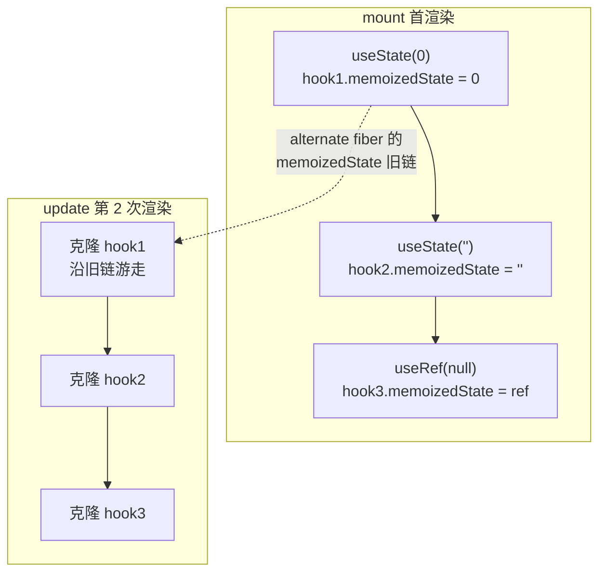
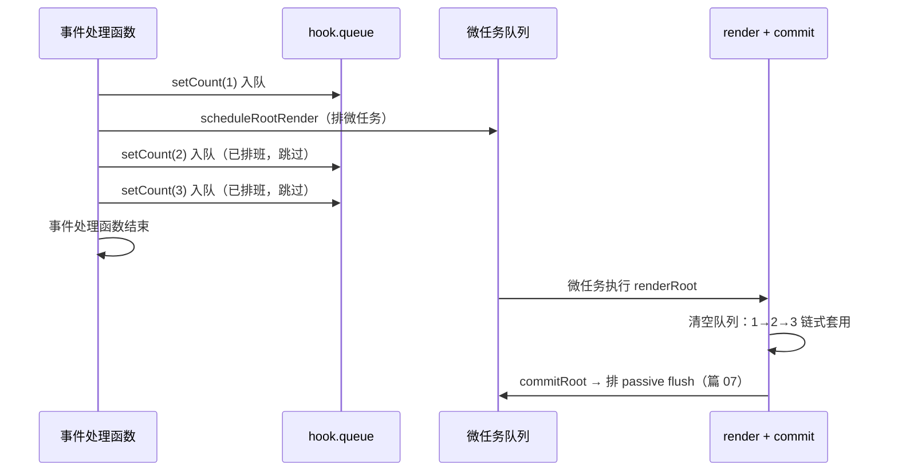

# 06 - 函数组件与 Hooks 链表

> 对应大纲篇 06（应用层 · 精讲） | 预计时间：90 分钟
> 面试可答：Hooks 存在 Fiber 的 memoizedState 链表上，按调用顺序索引——这就是「不能放条件/循环里」的根本原因。
> 前置：[05 - Commit 阶段与 DOM 提交](./05-Commit阶段与DOM提交.md)（函数组件的三处 commit 占位）；技术栈规范见 [agents.md §5.6](../../../../../agents.md)

---

## 1. 本篇定位

一句话：**让 fiber 树上长出函数组件，把「调用一个函数」变成「装配一条 hooks 链表」，并接通 setState → 入队 → 调度重渲的更新闭环。**

从此 mini-react 可以写真实业务组件。本篇产出与接线点：

| 产出                                | 位置                     | 说明                                                   |
| ----------------------------------- | ------------------------ | ------------------------------------------------------ |
| hooks 链表基建 + useState + useRef  | `src/hooks/index.ts`     | 本篇主讲；同文件还有 07/08 的 effect/memo/Context 段   |
| beginWork 的 FunctionComponent 分支 | `src/fiber/beginWork.ts` | 篇 05 预告的「施工图纸」在本篇填实                     |
| `scheduleRootRender` 更新调度入口   | `src/fiber/workLoop.ts`  | 微任务级批量合并（React 18+ 自动 batching 的最简形态） |

篇 05 留的三处占位，本篇逐一兑现：函数组件 fiber 的 `Update` 分支不需要动（children 走 fiber 链，DOM 操作仍发生在宿主节点上）；`getHostParentFiber` 原样复用；`commitDeletion` 的 unmount 副作用在篇 07 接线。真正的新工作在 **render 阶段**：beginWork 遇到函数组件 fiber 时，调用组件函数、装配 hooks、diff 输出。

---

## 2. 函数组件渲染：无 stateNode 的 fiber

先解决「函数组件长什么样」。`createFiberFromElement` 已按 type 形态分派（接线改动，见篇 03 的同步说明）：type 是字符串走 `HostComponent`，函数走 `FunctionComponent`。它没有 `stateNode`，beginWork 时唯一要做的就是**调用这个函数拿 children**（`src/fiber/beginWork.ts`，本篇新增段）：

```ts
// beginWork：处理「进入」一个 fiber——比较 children，返回下一个工作单元
export const beginWork = (workInProgress: Fiber): Fiber | null => {
  switch (workInProgress.tag) {
    case HostRoot:
      return beginHostRoot(workInProgress)
    case HostComponent:
      return beginHostComponent(workInProgress)
    case FunctionComponent:
      return beginFunctionComponent(workInProgress)
    case HostText:
    default:
      // 文本节点是叶子：没有 children 可比较
      return null
  }
}

const beginHostRoot = (workInProgress: Fiber): Fiber | null => {
  const props = workInProgress.pendingProps as Props
  reconcileChildren(workInProgress, props.children)
  return workInProgress.child
}

const beginHostComponent = (workInProgress: Fiber): Fiber | null => {
  const props = workInProgress.pendingProps as Props
  reconcileChildren(workInProgress, props.children)
  return workInProgress.child
}

// 类型守卫：memo / Provider 都是「对象形态」的元素 type（符号见 jsx/index.ts）
const isMemoType = (type: ElementType | null): type is MemoType => {
  return (
    typeof type === 'object' &&
    type !== null &&
    type.$$typeof === REACT_MEMO_TYPE
  )
}

const isProviderType = (
  type: ElementType | null
): type is ProviderType<unknown> => {
  return (
    typeof type === 'object' &&
    type !== null &&
    type.$$typeof === REACT_PROVIDER_TYPE
  )
}

// 函数组件 fiber 没有 stateNode：beginWork 直接调用组件函数取 children
// （真实源码走 renderWithHooks → finishRenderingHooks 的完整管线）
const beginFunctionComponent = (workInProgress: Fiber): Fiber | null => {
  const type = workInProgress.type
  if (isProviderType(type)) {
    return beginProvider(workInProgress, type.context)
  }
  const props = workInProgress.pendingProps as Props
  // memo 是组件的「浅比较壳」：props 未变且 context 未变就 bailout，
  // 组件函数一次都不调用（篇 08）
  if (isMemoType(type) && workInProgress.alternate !== null) {
    const current = workInProgress.alternate
    const prevProps = current.memoizedProps
    if (
      typeof prevProps === 'object' &&
      prevProps !== null &&
      !hasPropsChanged(prevProps as Props, props) &&
      !hasContextChanged(workInProgress)
    ) {
      return bailoutOnAlreadyFinishedWork(workInProgress)
    }
  }
  const Component = (isMemoType(type) ? type.type : type) as ComponentType
  const children = renderWithHooks(workInProgress, Component, props)
  reconcileChildren(workInProgress, children)
  // memo 的浅比较基准：记录本次渲染的 props（真实源码同款回写位置）
  workInProgress.memoizedProps = workInProgress.pendingProps
  return workInProgress.child
}
```

三个要点：

1. **调用函数 = 渲染**：`renderWithHooks` 内部执行 `Component(props)`，返回的 element 交给 `reconcileChildren`——函数组件的「输出」就是普通 children，后面的 diff/commit 管线完全复用篇 04/05
2. **无 stateNode 的连锁反应**：commit 的 `getHostParentFiber` 向上跳过、`commitDeletion` 向下穿透——篇 05 的设计在本篇生效
3. memo/Provider 的分支本篇只埋伏笔，篇 08 展开（bailout、`hasContextChanged`、`beginProvider` 都在篇 08 讲）

---

## 3. hooks 链表：按调用顺序索引

现在回答本篇的核心问题：**useState 的状态存在哪里？** 答案是 fiber 的 `memoizedState` 字段——它是一条链表，每个 hook 调用对应一个节点。先落基建（`src/hooks/index.ts`，下文分段展示，拼起来即完整文件）：

```ts
// ─── 公共类型 ───────────────────────────────────────────────
export type SetStateAction<S> = S | ((prev: S) => S)
export type Dispatch<A> = (action: A) => void

// ─── hooks 链表基建（篇 06） ────────────────────────────────
// Hook：链表节点。真实源码 Hook 类型还有 baseState/baseQueue（跳过的更新
// 的恢复基线），教学版省略；queue 为 null 表示非 state 类 hook
type Hook = {
  memoizedState: unknown
  queue: UpdateQueue | null
  next: Hook | null
}

// update 的循环链表节点：last 指向队尾，last.next 即队首（真实源码同款结构）
type Update = {
  action: unknown
  next: Update | null
}

type UpdateQueue = {
  last: Update | null
}

type InternalDispatch = (action: unknown) => void

// 当前正在渲染的函数组件 fiber：hook 的挂载目标（renderWithHooks 置位/清空）
let currentlyRenderingFiber: Fiber | null = null
// 正在装配的 hook 游标：mount 时指向链尾，update 时指向新克隆的链尾
let workInProgressHook: Hook | null = null
// update 路径在 current 旧链上的游标（与 workInProgressHook 同步前进）
let currentHook: Hook | null = null
// 本次渲染走 mount 还是 update 路径
// （真实源码按 current.memoizedState 是否有旧链来换 dispatcher 表）
let isUpdatingHooks = false

// mountWorkInProgressHook：新建节点接到链尾；首个 hook 挂上 fiber.memoizedState
// （链表头——真实源码同款挂载点，这就是「hooks 存在 fiber 上」的字面落点）
const mountWorkInProgressHook = (): Hook => {
  const hook: Hook = { memoizedState: null, queue: null, next: null }
  const fiber = currentlyRenderingFiber
  if (workInProgressHook === null) {
    if (fiber !== null) {
      fiber.memoizedState = hook
    }
  } else {
    workInProgressHook.next = hook
  }
  workInProgressHook = hook
  return hook
}

// updateWorkInProgressHook：沿 current fiber 的旧链游走，把节点浅克隆到
// 本次渲染的链上。queue 按引用共享——旧渲染创建的 dispatch 入队依然有效。
// 真实源码同款：current 树只读、workInProgress 树重建，双缓存哲学的延续
const updateWorkInProgressHook = (): Hook => {
  const fiber = currentlyRenderingFiber
  let nextCurrentHook: Hook | null
  if (currentHook === null) {
    nextCurrentHook =
      fiber !== null ? (fiber.alternate?.memoizedState as Hook | null) : null
  } else {
    nextCurrentHook = currentHook.next
  }
  if (nextCurrentHook === null) {
    // 典型成因：本次渲染比上次多调用了一个 hook（条件/循环里调用 hook）
    throw new Error(
      '本次渲染的 hook 数量多于上一次：检查是否在条件/循环中调用了 hook'
    )
  }
  currentHook = nextCurrentHook
  const hook: Hook = {
    memoizedState: currentHook.memoizedState,
    queue: currentHook.queue,
    next: null
  }
  if (workInProgressHook === null) {
    if (fiber !== null) {
      fiber.memoizedState = hook
    }
  } else {
    workInProgressHook.next = hook
  }
  workInProgressHook = hook
  return hook
}
```

链表没有名字、没有 key，**唯一的索引就是调用顺序**——这正是 Hooks 规则的来源：



- **mount 路径**：`mountWorkInProgressHook` 逐个新建节点接链，链头挂上 `fiber.memoizedState`
- **update 路径**：`updateWorkInProgressHook` 沿 **current fiber 的旧链**游走，逐节点浅克隆到本次渲染的链上——current 树只读、wip 树重建，和篇 03 的双缓存是同一个哲学。第 2 个节点克隆时读的是 `currentHook.next`：**调用顺序就是链表游标**，多调、少调、换序都会错位
- `queue` 按引用共享：第一次渲染创建的 dispatch 闭包持有这个 queue 对象，之后每次克隆都指向它——所以「旧」dispatch 入队永远有效

组件函数的执行被包在 `renderWithHooks` 里（同文件尾部，真实源码同名函数）：

```ts
// ─── 函数组件渲染入口（篇 06） ──────────────────────────────
// renderWithHooks：置位链表游标 → 按 current 链有无 hooks 选 mount/update
// 路径 → 调用组件函数取 children → 清场。真实源码同名函数（ReactFiberHooks.js）
export const renderWithHooks = (
  fiber: Fiber,
  Component: ComponentType,
  props: Props
): unknown => {
  currentlyRenderingFiber = fiber
  currentHook = null
  workInProgressHook = null
  const current = fiber.alternate
  isUpdatingHooks = current !== null && current.memoizedState !== null
  const children = Component(props)
  currentlyRenderingFiber = null
  workInProgressHook = null
  currentHook = null
  isUpdatingHooks = false
  return children
}
```

> 💡 `isUpdatingHooks` 的判定是 `current.memoizedState !== null`：上次渲染有 hook 链就走 update。组件从「零 hooks」到「首次加 hook」能自然走 mount——真实源码用两张 dispatcher 表（`HooksDispatcherOnMount` / `HooksDispatcherOnUpdate`）做同一件事，教学版用布尔分支同构。

---

## 4. useState：入队 → 找根 → 调度

useState 的全部行为可以拆成两半：**渲染时消费队列**，**dispatch 时生产队列**。先看生产端（`src/hooks/index.ts`）：

```ts
// ─── 更新入队与调度（篇 06） ────────────────────────────────
// dispatch 工厂：循环链表入队 → 从所在 fiber 向上找到 HostRoot → 调度重渲
// （reducer 的套用不在入队时做——下一轮渲染清空队列时才逐个执行，真实源码同款惰性）
const createDispatch = (
  fiber: Fiber | null,
  queue: UpdateQueue
): InternalDispatch => {
  return (action) => {
    const update: Update = { action, next: null }
    const last = queue.last
    if (last === null) {
      update.next = update
    } else {
      update.next = last.next
      last.next = update
    }
    queue.last = update
    const root = markUpdateFromFiberToRoot(fiber)
    if (root !== null) {
      scheduleRootRender(root)
    }
  }
}

// 从触发更新的 fiber 沿 return 向上找 HostRoot（stateNode 持有 FiberRoot）
const markUpdateFromFiberToRoot = (fiber: Fiber | null): FiberRoot | null => {
  let node = fiber
  while (node !== null) {
    if (node.tag === HostRoot && node.stateNode !== null) {
      return node.stateNode as FiberRoot
    }
    node = node.return
  }
  return null
}
```

循环链表是真实源码同款结构：`last` 指向队尾，`last.next` 就是队首——入队 O(1)，消费时从队首走到队尾即可。然后是消费端与 useState 本体：

```ts
// ─── state 系（篇 06 / 篇 08） ──────────────────────────────
// useState 的底层 reducer：函数式更新在这里收拢（真实源码同款 basicStateReducer）
const basicStateReducer = <S>(state: S, action: SetStateAction<S>): S => {
  return typeof action === 'function'
    ? (action as (prev: S) => S)(state)
    : action
}

// mount / update 两条路径共用的核心：
// mount 时只建 hook + 空 queue（reducer 在下一轮清空队列时才需要）；
// update 时先清空 update 队列（按入队顺序逐个套用），再基于新 state 建 dispatch
const mountStateImpl = (initialState: unknown): [unknown, InternalDispatch] => {
  const hook = mountWorkInProgressHook()
  hook.memoizedState = initialState
  hook.queue = { last: null }
  return [initialState, createDispatch(currentlyRenderingFiber, hook.queue)]
}

const updateReducerImpl = <S, A>(
  reducer: (state: S, action: A) => S
): [S, Dispatch<A>] => {
  const hook = updateWorkInProgressHook()
  const queue = hook.queue as UpdateQueue
  let newState = hook.memoizedState as S
  const last = queue.last
  if (last !== null) {
    let update: Update | null = last.next
    while (update !== null) {
      newState = reducer(newState, update.action as A)
      if (update === last) {
        break
      }
      update = update.next
    }
    queue.last = null
  }
  hook.memoizedState = newState
  const dispatch = createDispatch(currentlyRenderingFiber, queue)
  return [newState, dispatch as Dispatch<A>]
}

export const useState = <S>(
  initialState: S | (() => S)
): [S, Dispatch<SetStateAction<S>>] => {
  if (isUpdatingHooks) {
    return updateReducerImpl<S, SetStateAction<S>>(basicStateReducer)
  }
  const initial =
    typeof initialState === 'function'
      ? (initialState as () => S)()
      : initialState
  const [state, dispatch] = mountStateImpl(initial)
  return [state as S, dispatch as Dispatch<SetStateAction<S>>]
}
```

这条实现里藏着两个面试高频点的答案：

- **函数式更新为什么总能拿到最新值**：`setCount(prev => prev + 1)` 的 `prev` 是 `basicStateReducer` 在**消费队列时**传入的中间态——队列里三个函数式更新会链式套用，每次都以上一个的输出为输入
- **闭包旧值的实现层解释**：组件函数每次渲染都重新执行，`const [count] = useState()` 拿到的是**这一次渲染的 memoizedState 快照**；渲染后发生的更新只进了 queue，老闭包里的 `count` 永远是旧值（§6 练习复现）

> 💡 `useReducer` 也已经在这里了（篇 08 展开）：它就是 `updateReducerImpl` 的另一个入口，useState 把 reducer 换成 `basicStateReducer`——**useState 是 useReducer 的特例**，真实源码正是这个结构。

---

## 5. 批量更新：微任务级合并

dispatch 的最后一行调用 `scheduleRootRender`——它在 `src/fiber/workLoop.ts`（本篇新增）：

```ts
// 更新调度入口（篇 06）：dispatch 入队后从这里触发根级重渲。
// 微任务级批量合并——同一次事件里多次 setState 只排一次微任务、
// 只跑一次 render + commit（React 18+ 自动 batching 的最简形态）
let isRenderScheduled = false
export const scheduleRootRender = (root: FiberRoot): void => {
  if (isRenderScheduled) {
    return
  }
  isRenderScheduled = true
  queueMicrotask(() => {
    isRenderScheduled = false
    renderRoot(root)
  })
}
```

一次事件里连发三个 setState 的时序：



`isRenderScheduled` 是一把「已排班」闸门：同步代码里第一个 setState 排微任务，后续 setState 只入队不重复排班。于是**多次 setState 只触发一次 render + commit**——这就是 React 18+ 自动 batching 的最小实现。真实 React 的合并发生在更完整的调度体系里（lane 标记 + `ensureRootIsScheduled`，篇 10 对齐），但「同一次事件只渲一次」的语义一致。

> ⚠️ `renderRoot` / `commitRoot` 本身没有加锁：调度入口保证了它们不会被重入（微任务串行执行），这是教学版依赖的隐式约定，篇 09 换真调度器时会显式化。

---

## 6. useRef：跨渲染持久化的最小样本

```ts
// ─── useRef（篇 06） ────────────────────────────────────────
// 跨渲染持久化的最小样本：ref 对象在 mount 时创建一次，
// update 克隆只复制引用——两次渲染拿到的是同一个对象
export const useRef = <T>(initialValue: T): { current: T } => {
  if (isUpdatingHooks) {
    const hook = updateWorkInProgressHook()
    return hook.memoizedState as { current: T }
  }
  const hook = mountWorkInProgressHook()
  const ref = { current: initialValue }
  hook.memoizedState = ref
  return ref
}
```

useRef 只有三行核心逻辑：mount 时把 `{ current }` 挂上链表；update 克隆时**按引用复制**——所以两次渲染拿到的是同一个对象，改 `ref.current` 不会触发重渲（它不是 state，只是 fiber 上的一个口袋）。理解了它，就理解了「变量存在 fiber 上」这句话的字面含义。

---

## 7. 源码对照：mini vs ReactFiberHooks.js

真实源码集中在 `packages/react-reconciler/src/ReactFiberHooks.js`（19.x main 实核）：

| mini-react                                             | 真实源码                                   | 差距说明                                                         |
| ------------------------------------------------------ | ------------------------------------------ | ---------------------------------------------------------------- |
| `currentlyRenderingFiber` 等模块状态                   | `ReactCurrentDispatcher` + 模块级游标变量  | 真实源码用两张 dispatcher 表按 mount/update 换指向               |
| `mountWorkInProgressHook` / `updateWorkInProgressHook` | 同名函数                                   | 真实 Hook 类型多 `baseState` / `baseQueue`（跳过更新的恢复基线） |
| `createDispatch` 的循环链表入队                        | `dispatchSetStateInternal` 同款环形入队    | 真实版有 eagerState 急切计算优化（省一次调度）                   |
| `basicStateReducer`                                    | 同名函数（`useState` 的底层 reducer）      | 完全同构                                                         |
| `updateReducerImpl` 清空队列                           | `updateReducerImpl`（19.x 新拆出的实现体） | 真实版处理 baseQueue 分片与优先级跳过（篇 10）                   |
| `scheduleRootRender` 微任务合并                        | `ensureRootIsScheduled` + Scheduler 任务池 | 篇 09/10 对齐                                                    |

阅读建议：先搜 `function renderWithHooks`，对照本篇 §3 看「换 dispatcher → 调函数 → 清场」三步；再搜 `basicStateReducer`——你会发现函数式更新的全部秘密只有一行 `typeof action === 'function'`。

---

## 8. 练习：useState + useRef，复现并修复「闭包旧值」

**要求**：在临时入口（`playground/mini.html`，前几篇约定不变，组件代码放 `playground/mini-main.tsx`，⚠️ 不要动对照组 `main.tsx`）用 mini-react 写一个计数器组件：`useState` 管计数、`useRef` 记「渲染次数」，页面展示两个值；再加一个「3 秒后提醒」按钮——点击时用 `setTimeout` 打印**按钮按下那一刻闭包里的 count**。先点击按钮后立刻连点三次「+1」，观察提醒打出的是旧值；再把更新改成函数式 `setCount(prev => prev + 1)`、提醒改读 `ref.current`，验证两条修复路径。

**提示**：入口写法参考篇 05 练习，import 换成 `import { createRoot, useState, useRef, createElement } from '../src/index'`（编译器还没指向 mini-react，用 `createElement` 写节点，篇 12 做切换）。在 `renderWithHooks` 首行打断点，观察同一组件两次渲染时 `fiber.alternate.memoizedState` 与本次新链的对应关系——`updateWorkInProgressHook` 的游标就是「调用顺序索引」本体。

**预期效果**：能复现「提醒打出旧值」并在实现层解释（闭包捕获的是当次渲染的 memoizedState 快照，更新只进 queue）；能说出两条修复路径各自成立的原理（函数式更新消费队列时取中间态；ref 是跨渲染同一对象）；能对着 `updateWorkInProgressHook` 解释「hook 不能放条件/循环里」为什么是链表结构的必然。

---

## 9. 面试问答

**Q1：为什么 Hooks 不能写在条件语句或循环里？**

> 因为 hook 的存储是 fiber.memoizedState 上的一条链表，没有名字、没有 key，唯一的索引是调用顺序。mount 时每个 hook 调用按序接链；update 时沿旧链游走、逐节点克隆——第 N 次调用的 hook 必须对上链表第 N 个节点。放进条件里，两次渲染的调用序列不同，游标错位后拿到的状态和队列全是别的 hook 的。 _（追问见 Q1-1）_
>
> **Q1-1：既然按顺序索引，为什么用链表而不是数组？**
> 数组也能按索引对齐，但链表支持「update 时逐节点克隆到 workInProgress 链」——与双缓存的 current 只读 / wip 重建哲学一致，队列等有状态字段还能跨克隆共享引用（旧 dispatch 持续有效）。真实源码用链表还有历史连续性：fiber 本身就是链表体系，hook 链挂在同一个节点上不需要额外容器。

**Q2：setState 之后到屏幕变化，mini-react 里发生了什么？**

> dispatch 先把 update 用循环链表入队（队尾 last、队首 last.next），然后沿 return 向上找到 HostRoot（stateNode 持有 FiberRoot），调用 `scheduleRootRender` 排一个微任务；微任务里从根重新 render——组件函数重跑、hooks 按序克隆并清空队列、diff 出新的 flags——commit 落 DOM。同一次事件里的多次 setState 因为「已排班」闸门只触发一次渲染。 _（追问见 Q2-1）_
>
> **Q2-1：函数式更新 `setCount(prev => prev + 1)` 的 prev 从哪来？**
> 来自 `basicStateReducer` 消费队列时的中间态：清空队列时逐个套用 reducer，每个函数式更新都以上一个 update 的输出作为 prev。所以连续多个函数式更新等价于链式累加，不依赖渲染闭包里的旧值。

**Q3：React 18 的自动 batching 和 17 有什么区别？**

> 17 只在 React 的事件处理函数内批量（合成事件批），promise 回调、setTimeout 里的多次 setState 每次都触发渲染；18 起更新统一走调度入口，任何上下文里的多次 setState 都按「一次事件 = 一次渲染」合并，甚至 await 之后的连续 setState 也会合并到同一个微任务批次。mini-react 的 `scheduleRootRender` 用微任务 + 排班闸门模拟的就是这个语义。

---

## 10. 本篇自检

- [ ] 能说出 hooks 链表的挂载点（fiber.memoizedState）与索引方式（调用顺序）
- [ ] mount / update 两条路径在代码里的落点能指出来，update 克隆为什么按引用共享 queue
- [ ] 能画出「三次 setState 一次渲染」的入队与消费时序
- [ ] 闭包旧值用例复现并修复过，能用 memoizedState 快照与 queue 的关系解释
- [ ] 知道 `useState` 是 `useReducer` 换了个 reducer 的特例（篇 08 展开）

---

## 11. 参考资料

- [ReactFiberHooks.js（facebook/react main）](https://github.com/facebook/react/blob/main/packages/react-reconciler/src/ReactFiberHooks.js) —— renderWithHooks / mountWorkInProgressHook / basicStateReducer / updateReducerImpl
- [React 官方文档 · useState](https://react.dev/reference/react/useState) ｜ [useRef](https://react.dev/reference/react/useRef)
- [React 官方文档 · Automatic Batching（React 18 升级指南）](https://react.dev/blog/2022/03/29/react-v18#new-feature-automatic-batching)
- [Build Your Own React（Didact）](https://pomb.us/build-your-own-react/) —— hooks 章节的节奏参照
- [React 19.3 发布公告（2026-09-09，本系列版本断言基准）](https://react.dev/blog/2026/09/09/react-19-3)
- 上一篇：[05 - Commit 阶段与 DOM 提交](./05-Commit阶段与DOM提交.md) ｜ 下一篇：[07 - useEffect 与副作用系统](./07-useEffect与副作用系统.md)
