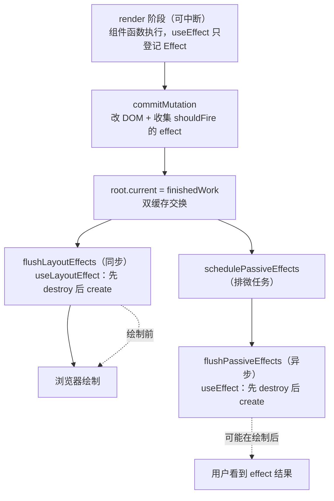

# 07 - useEffect 与副作用系统

> 对应大纲篇 07（应用层 · 精讲） | 预计时间：90 分钟
> 面试可答：useEffect 在 commit 后异步（passive）执行，useLayoutEffect 在 layout 阶段同步执行——时机差异是「会不会闪烁」的根源。
> 前置：[06 - 函数组件与 Hooks 链表](./06-函数组件与Hooks链表.md)（hooks 链表与更新调度）

---

## 1. 本篇定位

一句话：**在 hooks 链表上挂出 Effect 对象，用「layout 同步 / passive 异步」两条 flush 管道实现 useEffect 与 useLayoutEffect，并补齐 cleanup 的全部时机。**

| 产出                                      | 位置                    | 说明                                           |
| ----------------------------------------- | ----------------------- | ---------------------------------------------- |
| effect 系 Hooks + 两条 flush 队列         | `src/hooks/index.ts`    | 本篇主讲段                                     |
| commitRoot 挂 layout flush + passive 调度 | `src/fiber/workLoop.ts` | 篇 05 预告的「passive effects 分离」在本篇接线 |
| mutation 收集 effect + 删除时 unmount     | `src/commit/index.ts`   | 篇 05 占位的最后一处                           |

本篇继续沿用「代码即作业」：`src/hooks/index.ts` 的 effect 段在本篇分段讲完。

---

## 2. Effect 对象与两条 flush 队列

每个 effect 类 hook 调用（`useEffect(...)` / `useLayoutEffect(...)`）对应一个 Effect 对象，挂在 hook 的 `memoizedState` 上、随链表克隆跨渲染复用（`src/hooks/index.ts`，本篇起为 effect 段）：

```ts
// ─── effect 系（篇 07） ─────────────────────────────────────
// effect 种类位：思路对齐真实源码 ReactFiberFlags 的 Passive/Layout，
// 数值简化（真实源码还有 HasEffect / Insertion 位）
export const EffectPassive = 0b0001
export const EffectLayout = 0b0010

// Effect 实例：同一个 hook 的 effect 对象跨渲染复用。真实源码把有状态的
// destroy 收在 inst（EffectInstance）字段里，教学版直接放 destroy 字段
export type Effect = {
  tag: number
  create: () => void | (() => void)
  destroy: (() => void) | null
  deps: unknown[] | null
  // 待执行标记：mount 恒为 true；update 时依赖变了才置 true
  shouldFire: boolean
}

type PendingEffect = {
  effect: Effect
}

// 两个待 flush 队列：layout 同步、passive 异步（commit 时由 collectFiberEffects 填充）
const pendingLayoutEffects: PendingEffect[] = []
const pendingPassiveEffects: PendingEffect[] = []
```

三个字段的分工值得背下来：

| 字段         | 职责                                                                                              |
| ------------ | ------------------------------------------------------------------------------------------------- |
| `deps`       | 上一次执行的依赖数组，下一轮渲染用来比较                                                          |
| `destroy`    | 上一次 create 返回的清理函数——**flush 时先跑它再跑新 create**（真实源码放 `inst` 字段，职责相同） |
| `shouldFire` | 「这轮 commit 要不要执行我」的待办标记：mount 恒 true；update 时依赖变了才 true                   |

useEffect 和 useLayoutEffect **共用同一套 Effect 对象**，只差 `tag` 位——这就是「同管道不同时机」的实现前提。

---

## 3. 依赖比较：浅比较 + Object.is

```ts
// 依赖浅比较：逐项 Object.is，长度不同直接不等（真实源码 areHookInputsEqual 同款）。
// nextDeps 为 null（没写依赖数组）视为永不相等——effect 每次渲染都执行
const areHookInputsEqual = (
  nextDeps: unknown[] | null,
  prevDeps: unknown[] | null
): boolean => {
  if (
    nextDeps === null ||
    prevDeps === null ||
    nextDeps.length !== prevDeps.length
  ) {
    return false
  }
  for (let i = 0; i < nextDeps.length; i++) {
    if (!Object.is(nextDeps[i], prevDeps[i])) {
      return false
    }
  }
  return true
}
```

三个语义边界，面试常拿来做追问：

| 场景            | `Object.is` 判定 | 说明                                                           |
| --------------- | ---------------- | -------------------------------------------------------------- |
| `NaN` vs `NaN`  | 相等             | `===` 会误判为「变了」，`Object.is` 修正                       |
| `+0` vs `-0`    | 不等             | `===` 的另一个反例（实践影响小，但能证明为何不用 `===`）       |
| 依赖是对象/函数 | 按引用比         | 每次渲染新建的对象字面量恒「变」——这就是依赖数组里放对象的老坑 |

不传 deps（`undefined`）时规范化为 `null`，走「永不相等」分支——每次渲染后都执行。

---

## 4. mount / update 两条路径

```ts
const mountEffectImpl = (
  tag: number,
  create: () => void | (() => void),
  deps: unknown[] | null
): void => {
  const hook = mountWorkInProgressHook()
  hook.memoizedState = { tag, create, destroy: null, deps, shouldFire: true }
}

const updateEffectImpl = (
  create: () => void | (() => void),
  deps: unknown[] | null
): void => {
  const hook = updateWorkInProgressHook()
  const effect = hook.memoizedState as Effect
  if (areHookInputsEqual(deps, effect.deps)) {
    return
  }
  effect.create = create
  effect.deps = deps
  // destroy 还挂着上一次的清理函数——flush 时先跑它、再跑新 create
  effect.shouldFire = true
}

// effect 对象的判定依据：shouldFire 字段为 effect 独有
// （state 值 / ref / memo 缓存不会长这样——教学版约定）
const isEffect = (value: unknown): value is Effect => {
  return typeof value === 'object' && value !== null && 'shouldFire' in value
}

export const useEffect = (
  create: () => void | (() => void),
  deps?: unknown[]
): void => {
  const list = deps === undefined ? null : deps
  if (isUpdatingHooks) {
    updateEffectImpl(create, list)
    return
  }
  mountEffectImpl(EffectPassive, create, list)
}

export const useLayoutEffect = (
  create: () => void | (() => void),
  deps?: unknown[]
): void => {
  const list = deps === undefined ? null : deps
  if (isUpdatingHooks) {
    updateEffectImpl(create, list)
    return
  }
  mountEffectImpl(EffectLayout, create, list)
}
```

注意 update 路径的「跳过」逻辑：依赖没变时**什么都不做**——effect 对象上还留着上一轮的 create/destroy，`shouldFire` 保持 false，本轮 flush 不会碰它。真实源码的 `updateEffectImpl` 依赖不变时会把不带 `HookHasEffect` 位的旧 effect 挂回链上，语义一致：**没有标记 = 不执行**。

---

## 5. commit 收集与两条 flush 管道

effect 的执行时机由 commit 阶段编排。先看收集：`commitMutation` 遍历到函数组件 fiber 时，把 `shouldFire` 的 effect 分拣进两个队列（`src/commit/index.ts`，本篇接线段）：

```ts
export const commitMutation = (finishedWork: Fiber, root: FiberRoot): void => {
  const walk = (fiber: Fiber): void => {
    if ((fiber.flags & ChildDeletion) !== 0 && fiber.deletions !== null) {
      for (const deleted of fiber.deletions) {
        commitDeletion(deleted)
      }
      fiber.deletions = null
    }
    if ((fiber.flags & Placement) !== 0) {
      commitPlacement(fiber, root)
    }
    if ((fiber.flags & Update) !== 0) {
      commitUpdate(fiber)
    }
    // 函数组件：把本次渲染待执行的 effect 分拣进 layout / passive 两个队列
    // （layout 由 commitRoot 同步 flush，passive 由微任务异步 flush——篇 07）
    if (fiber.tag === FunctionComponent) {
      collectFiberEffects(fiber)
    }
    if (fiber.child !== null) {
      walk(fiber.child)
    }
    if (fiber.sibling !== null) {
      walk(fiber.sibling)
    }
  }
  walk(finishedWork)
}
```

分拣与 flush 的本体都在 `src/hooks/index.ts`：

```ts
// commitMutation 遍历到函数组件 fiber 时调用：把待执行的 effect 分拣进
// layout / passive 两个队列（真实源码在 commit 阶段按 fiber flags 收集）
export const collectFiberEffects = (fiber: Fiber): void => {
  let hook = fiber.memoizedState as Hook | null
  while (hook !== null) {
    const effect = hook.memoizedState
    if (isEffect(effect) && effect.shouldFire) {
      const list =
        (effect.tag & EffectLayout) !== 0
          ? pendingLayoutEffects
          : pendingPassiveEffects
      list.push({ effect })
    }
    hook = hook.next
  }
}

// 两阶段 flush：先把整组 destroy 跑完（unmount 段），再跑 create（mount 段）。
// 真实源码 flushPassiveEffects 内部也是 commitPassiveUnmountEffects →
// commitPassiveMountEffects 的两段式顺序
const flushEffectList = (list: PendingEffect[]): void => {
  const effects = list.splice(0, list.length)
  if (effects.length === 0) {
    return
  }
  for (const { effect } of effects) {
    if (effect.destroy !== null) {
      effect.destroy()
      effect.destroy = null
    }
  }
  for (const { effect } of effects) {
    const cleanup = effect.create()
    effect.destroy = typeof cleanup === 'function' ? cleanup : null
    effect.shouldFire = false
  }
}

// layout flush：commitRoot 在双缓存交换后同步调用（DOM 已更新、浏览器未绘制）
export const flushLayoutEffects = (): void => {
  flushEffectList(pendingLayoutEffects)
}

// passive flush：真实 React 由 Scheduler 排到 commit 之后异步执行；
// 本批用微任务最简实现，篇 09 换成真调度器
let passiveScheduled = false
export const schedulePassiveEffects = (): void => {
  if (passiveScheduled) {
    return
  }
  passiveScheduled = true
  queueMicrotask(() => {
    passiveScheduled = false
    flushEffectList(pendingPassiveEffects)
  })
}
```

最后是编排点——`src/fiber/workLoop.ts` 的 `commitRoot`（篇 05 的骨架在 mutation 之后补上两行）：

```ts
const commitRoot = (): void => {
  const root = workInProgressRoot
  const finishedWork = root !== null ? root.current.alternate : null
  if (root === null || finishedWork === null) {
    return
  }
  commitMutation(finishedWork, root)
  // 双缓存交换：workInProgress 树转正为 current 树。
  // 真实源码这一行在 mutation 之后、layout 之前执行
  root.current = finishedWork
  // layout effects：同步执行——DOM 已更新、浏览器尚未绘制（篇 07）
  flushLayoutEffects()
  // passive effects：异步 flush（本批用微任务最简实现，篇 09 挂到真调度器）
  schedulePassiveEffects()
  workInProgressRoot = null
  workInProgress = null
}
```

完整时序一张图：



两条管道的差异只有一个：**flushLayoutEffects 在 commitRoot 里同步调用**（浏览器绘制前必然完成），**passive 排进微任务**（绘制后才执行）。这就是「会不会闪烁」的机制根源——§7 展开。

> ⚠️ 真实 React 的 passive flush 用 `scheduleCallback(NormalSchedulerPriority, flushPassiveEffects)` 排进 Scheduler（`ReactFiberWorkLoop.js` 实核，`commitRoot` 内），可被高优先级更新插队；教学版微任务最简实现，篇 09 换真调度器。

---

## 6. cleanup 的三个时机

「先全部 destroy、再全部 create」的两阶段顺序保证了跨组件的清理安全性。cleanup 会在三种时机执行：

| 时机                   | 触发条件                            | 实现落点                                                              |
| ---------------------- | ----------------------------------- | --------------------------------------------------------------------- |
| **依赖变更**           | update 时 `areHookInputsEqual` 不等 | 旧 `destroy` 已挂在 effect 上，flush 的 unmount 段执行，再跑新 create |
| **组件卸载**           | fiber 被删除（ChildDeletion）       | `commitDeletion` → `runUnmountEffects` 同步逐个跑 destroy             |
| **无依赖的每次渲染后** | deps 为 `null`                      | 「永不相等」分支 → 每轮 flush 先 destroy 再 create                    |

卸载路径是篇 05 占位的最后一处（`src/commit/index.ts`）：

```ts
// 删除：先跑被删子树的 unmount effect 清理（篇 07），再从被删 fiber 向下
// 找第一层有 DOM 的节点摘除。函数组件 fiber 没有 stateNode——不能停也不能删，
// 向下穿透；真实 React 会在删除前先跑完子树的 cleanup（组件卸载语义）
const commitDeletion = (fiber: Fiber): void => {
  runUnmountEffects(fiber)
  let node: Fiber | null = fiber
  while (node !== null) {
    const dom = toNode(node)
    if (dom !== null) {
      dom.parentNode?.removeChild(dom)
      return
    }
    node = node.child
  }
}
```

`runUnmountEffects` 沿被删子树向下走，函数组件的 effect 逐个跑 destroy 并清位（`src/hooks/index.ts`）：

```ts
// 删除子树的 unmount 清理：沿 fiber 向下走，函数组件的 effect 逐个跑 destroy。
// 真实 React 把 passive destroy 排进 passive flush 的 unmount 段、layout destroy
// 放在 mutation 阶段；教学版统一在删除时同步执行，语义一致
export const runUnmountEffects = (fiber: Fiber): void => {
  const walk = (node: Fiber): void => {
    if (node.tag === FunctionComponent) {
      let hook = node.memoizedState as Hook | null
      while (hook !== null) {
        const effect = hook.memoizedState
        if (isEffect(effect) && effect.destroy !== null) {
          effect.destroy()
          effect.destroy = null
          effect.shouldFire = false
        }
        hook = hook.next
      }
    }
    if (node.child !== null) {
      walk(node.child)
    }
    if (node.sibling !== null) {
      walk(node.sibling)
    }
  }
  walk(fiber)
}
```

---

## 7. useLayoutEffect：同管道，不同时机

现在能精确回答两者的区别了：

| 维度         | useEffect（passive）        | useLayoutEffect（layout）                |
| ------------ | --------------------------- | ---------------------------------------- |
| 执行位置     | commitRoot 排微任务，绘制后 | commitRoot 内同步，绘制前                |
| 能否阻塞绘制 | ❌                          | ✅（所以必须写得足够快）                 |
| 读 DOM 布局  | 可能读到「旧一帧」的中间态  | DOM 已更新、未绘制，读到的是本次提交结果 |
| 典型用途     | 订阅、日志、大多数副作用    | 测量布局、防闪烁的定位修正               |

**「布局测量防闪烁」的机制**：假设一个 tooltip 组件要在渲染后测量自身尺寸再定位。用 useEffect——微任务 flush 前**浏览器可能已经绘制了一帧**（passive 与绘制无同步屏障），用户看到「先出现在错误位置、再跳到正确位置」的闪烁；用 useLayoutEffect——它在 commitRoot 里同步执行，执行完之前 renderRoot 都没返回，浏览器还没机会绘制，用户只会看到最终位置。

> 💡 代价与纪律：layout effect 会阻塞绘制，滥用会让每次提交变卡。官方默认建议永远是 useEffect（[useLayoutEffect 参考](https://react.dev/reference/react/useLayoutEffect)），只有「测量后必须改布局」才用 layout。

---

## 8. StrictMode 双执行：实现层为什么会成立

mini-react 不实现 StrictMode（它只是开发期行为），但原理值得在实现层过一遍：

- **行为**：开发模式 + StrictMode 下，组件 mount 后 React 会**立刻再 unmount 一次、重新 mount**——effect 跑两遍：`create → destroy → create`
- **实现层为什么成立**：effect 的 create/destroy 是「登记 → 先 destroy 后 create」的两段式——把 mount 阶段收集到的 effect 额外走一次 unmount 段再走一次 mount 段即可，管线完全复用
- **它检测什么**：effect 的 destroy 是否把上次 create 的副作用清理干净。若 cleanup 写漏（比如忘了 `clearTimeout`），双执行会让 bug 显形（定时器翻倍、订阅重复）
- **为什么是设计而不是 bug**：生产环境只跑一遍，双执行是用开发期的冗余暴露「不可重入」的副作用；[StrictMode 参考](https://react.dev/reference/react/StrictMode)明确这是 dev-only 行为

> 💡 写完本篇练习后可以自检一遍：把你所有 cleanup 逻辑在脑子里「跑两次」，如果结果不对，说明 cleanup 不幂等——这正是 StrictMode 想抓的。

---

## 9. 源码对照：pushEffect 与 flushPassiveEffects

真实源码（19.x main，均已实核）：

| mini-react                             | ReactFiberHooks.js / ReactFiberWorkLoop.js                                                      | 差距说明                                                            |
| -------------------------------------- | ----------------------------------------------------------------------------------------------- | ------------------------------------------------------------------- |
| `mountEffectImpl` / `updateEffectImpl` | 同名函数                                                                                        | 真实版 effect 挂在 fiber.updateQueue 的环形链上（`pushEffectImpl`） |
| `Effect.tag` 位                        | `HookPassive` / `HookLayout` / `HookHasEffect`（来自 ReactFiberFlags）                          | 真实版多 HasEffect 位表达「依赖变了要重跑」                         |
| `areHookInputsEqual`                   | 同名函数                                                                                        | 完全同构（逐项 Object.is）                                          |
| `flushEffectList` 两段式               | `commitPassiveUnmountEffects` → `commitPassiveMountEffects`                                     | 真实版按 fiber 遍历、passive 与 layout 分开遍历                     |
| `schedulePassiveEffects` 微任务        | `scheduleCallback(NormalSchedulerPriority, flushPassiveEffects)`（WorkLoop 内 commitRoot 调用） | 真实版是 Scheduler 任务，可插队可过期（篇 09）                      |

阅读路线：`ReactFiberHooks.js` 搜 `function mountEffectImpl`，看它如何 `pushEffect`（收集到 updateQueue）；再到 `ReactFiberWorkLoop.js` 搜 `function flushPassiveEffects`——一个负责登记，一个负责异步消费，与本篇 §5 的分工一致。

---

## 10. 练习：布局测量防闪烁用例

**要求**：在临时入口（同篇 06 约定）写一个 tooltip 组件：固定渲染在 `(0, 0)` 附近，mount 后测量自身尺寸（`getBoundingClientRect`）并按「目标按钮右下方」重新定位。分别用 useEffect 和 useLayoutEffect 各实现一版，用一个按钮控制 tooltip 反复挂载/卸载，对比两版视觉表现。

**提示**：定位修改直接写 `dom.style.left/top`——`setProp` 已支持 style 对象。想放大差异，在测量逻辑前加一段 `const start = Date.now(); while (Date.now() - start < 50) {}` 模拟慢测量：layout 版把「白屏/错位窗口」卡在绘制前（整体变慢但不闪），effect 版则会先绘制错位帧再跳变。可在 `flushLayoutEffects` 与 passive flush 回调里各打一条 `console.log`，对照 Performance 面板的绘制时间点验证「layout 在绘制前、passive 在绘制后」。

**预期效果**：两版视觉差异肉眼可见，且能指着代码说出差异的全部来源——只有 `EffectPassive` / `EffectLayout` 一个 tag 位和 `commitRoot` 里同步/微任务一次调度之差；能解释为什么 cleanup 必须在 create 之前整组跑完（§6 两阶段顺序）。

---

## 11. 面试问答

**Q1：useEffect 和 useLayoutEffect 的执行时机有什么区别？**

> 两者都在 commit 之后执行，差异在同步与异步：useLayoutEffect 在 layout 阶段同步执行——DOM 已更新、浏览器尚未绘制，执行完之前不会出帧；useEffect 被调度器排到 commit 之后异步执行（passive），通常发生在绘制后。前者适合测量布局并同步修正（防闪烁），后者是默认选择。 _（追问见 Q1-1）_
>
> **Q1-1：为什么 React 不干脆把所有 effect 都同步执行？**
> 同步意味着阻塞绘制。多数副作用（订阅、日志、数据请求）不需要在绘制前完成，同步执行会把它们变成每次提交的固定开销，拉长首帧与更新的呈现时间。React 把「必须绘制前完成」的少数场景留给 useLayoutEffect，其余让出主线程——这也是 passive 效果可被高优先级更新插队（并发渲染）的前提。

**Q2：cleanup 函数什么时候执行？为什么「先全部 destroy 再全部 create」？**

> 三个时机：依赖数组变化时，本轮 flush 里先跑旧 cleanup 再跑新 effect；组件卸载时，删除子树前逐个跑 cleanup；不写依赖数组时每次渲染后都先 cleanup 再执行。两阶段顺序保证清理与建立不交叉——如果按组件逐个「destroy→create」，A 的 create 可能依赖 B 的 cleanup 之后的干净状态，交叉执行会引入顺序耦合；整组分两段与真实源码 commitPassiveUnmountEffects → commitPassiveMountEffects 的顺序一致。 _（追问见 Q2-1）_
>
> **Q2-1：cleanup 里读到的 state 是新的还是旧的？**
> 旧的。cleanup 和 effect 一样是当次渲染的闭包，捕获的是**那次渲染的 props/state 快照**。这通常是正确语义（清理的正是那次渲染建立的副作用），若需要最新值应该在依赖数组里声明或改用 ref——本质和篇 06 的闭包旧值是同一个机制。

**Q3：useEffect 的闭包陷阱是什么？怎么修？**

> effect 闭包捕获的是当次渲染的快照，若依赖数组没把「真正用到的值」声明进去，后续渲染不会重跑 effect，闭包里永远是首次渲染的旧值——定时器回调、事件订阅里最容易现形。修法三种：补全依赖让 effect 重跑；函数式更新让回调消费队列中间态而不依赖闭包值；用 useRef 存跨渲染可变的最新值。mini-react 里这三种分别对应 queue 消费、`basicStateReducer` 与链表克隆按引用复制——机制篇 06 都写过。 _（追问见 Q3-1）_
>
> **Q3-1：StrictMode 下 effect 跑两遍是不是 bug？**
> 不是。开发模式 StrictMode 会 mount → unmount → mount，故意让 effect 经历 create → destroy → create，用来暴露「cleanup 没清理干净」的副作用（订阅重复、定时器叠加）。实现层就是复用两段式 flush 多跑一轮 unmount + mount，生产环境只执行一遍。

---

## 12. 本篇自检

- [ ] Effect 对象的 deps / destroy / shouldFire 三字段职责能脱稿讲
- [ ] 能画出 commit → layout（同步）→ 绘制 → passive（微任务）的时序图
- [ ] cleanup 的三个时机与实现落点（flush unmount 段 / commitDeletion / 永不相等分支）能对上
- [ ] `Object.is` 与 `===` 的两个差异场景能举例
- [ ] 防闪烁用例跑出差异，且能定位到「一个 tag 位 + 一次调度方式」的根源

---

## 13. 参考资料

- [ReactFiberHooks.js（facebook/react main）](https://github.com/facebook/react/blob/main/packages/react-reconciler/src/ReactFiberHooks.js) —— mountEffectImpl / updateEffectImpl / pushEffectImpl / areHookInputsEqual
- [ReactFiberWorkLoop.js（facebook/react main）](https://github.com/facebook/react/blob/main/packages/react-reconciler/src/ReactFiberWorkLoop.js) —— commitRoot 内 `scheduleCallback(NormalSchedulerPriority, flushPassiveEffects)` 与 `flushPassiveEffects`
- [React 官方文档 · useEffect](https://react.dev/reference/react/useEffect) ｜ [useLayoutEffect](https://react.dev/reference/react/useLayoutEffect) ｜ [StrictMode](https://react.dev/reference/react/StrictMode)
- [React 官方文档 · You Might Not Need an Effect](https://react.dev/learn/you-might-not-need-an-effect) —— effect 使用边界的官方阐述
- [React 19.3 发布公告（2026-09-09，本系列版本断言基准）](https://react.dev/blog/2026/09/09/react-19-3)
- 上一篇：[06 - 函数组件与 Hooks 链表](./06-函数组件与Hooks链表.md) ｜ 下一篇：[08 - 记忆化与状态管理 Hooks](./08-记忆化与状态管理Hooks.md)
