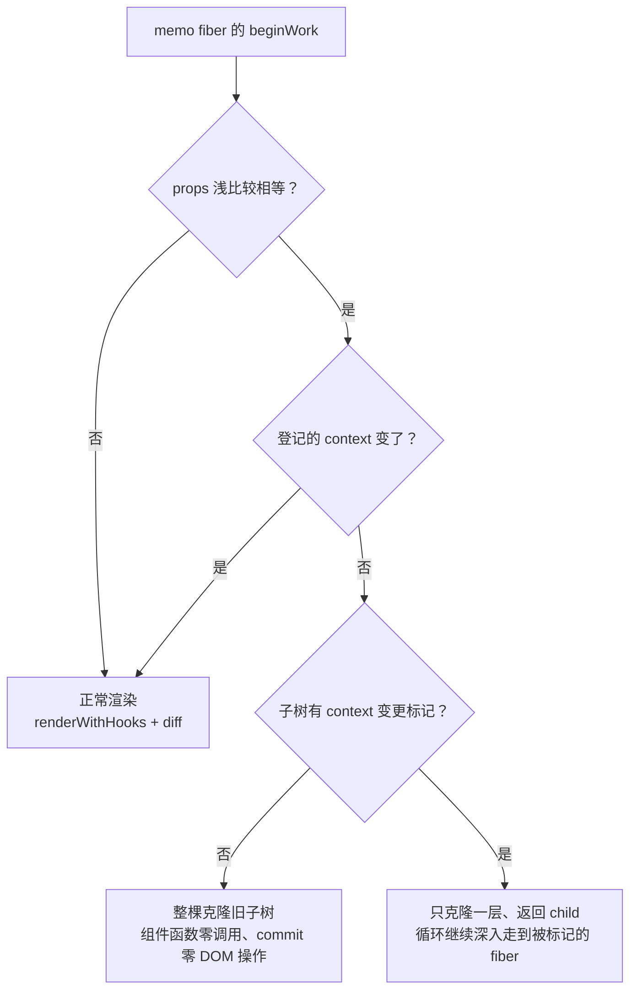

# 08 - 记忆化与状态管理 Hooks

> 对应大纲篇 08（应用层 · 精讲） | 预计时间：90 分钟
> 面试可答：useMemo/useCallback 缓存的是 fiber 链表节点上的旧值，依赖不变直接复用；Context 更新走 fiber.dependencies 登记 + propagateContextChange 树上标记（eager context propagation，React 18 起），不是精确依赖收集、也不是全树暴力重渲。
> 前置：[07 - useEffect 与副作用系统](./07-useEffect与副作用系统.md)（两条 flush 管道）；工具库签名对照见 [React Hooks 系列](../../hooks/readme.md)

---

## 1. 本篇定位

一句话：**补齐 memo 系与 Context——useMemo/useCallback 是「带依赖的缓存 hook」，useReducer 收拢 state 系，memo/bailout 与 propagateContextChange 把「最小化重渲」落到实现层。Hooks 全家桶在本篇收官（v2 里程碑交付）。**

| 产出                                                | 位置                     | 说明                               |
| --------------------------------------------------- | ------------------------ | ---------------------------------- |
| useMemo / useCallback / useReducer                  | `src/hooks/index.ts`     | 篇 06 已铺好共用实现，本篇只讲差异 |
| createContext / useContext / propagateContextChange | `src/hooks/index.ts`     | 依赖登记 + 树上标记（简化版）      |
| memo + bailout（整棵复用旧子树）                    | `src/fiber/beginWork.ts` | 篇 06 埋的两个伏笔在本篇引爆       |

---

## 2. useMemo / useCallback：带依赖的缓存 hook

两者的缓存形态完全一致：`[值, 依赖]` 二元组挂在 hook 的 memoizedState 上，依赖不变直接复用旧值（`src/hooks/index.ts`）：

```ts
// ─── memo 系（篇 08） ───────────────────────────────────────
// useMemo / useCallback 的缓存形态：[值, 依赖] 二元组挂在 hook.memoizedState
// 上，依赖不变直接复用旧值——本质是「带依赖的缓存 hook」
export const useMemo = <T>(factory: () => T, deps: unknown[]): T => {
  if (isUpdatingHooks) {
    const hook = updateWorkInProgressHook()
    const cache = hook.memoizedState as [T, unknown[]]
    if (areHookInputsEqual(deps, cache[1])) {
      return cache[0]
    }
    const value = factory()
    hook.memoizedState = [value, deps]
    return value
  }
  const hook = mountWorkInProgressHook()
  const value = factory()
  hook.memoizedState = [value, deps]
  return value
}

export const useCallback = <T extends (...args: never[]) => unknown>(
  callback: T,
  deps: unknown[]
): T => {
  if (isUpdatingHooks) {
    const hook = updateWorkInProgressHook()
    const cache = hook.memoizedState as [T, unknown[]]
    if (areHookInputsEqual(deps, cache[1])) {
      return cache[0]
    }
    hook.memoizedState = [callback, deps]
    return callback
  }
  const hook = mountWorkInProgressHook()
  hook.memoizedState = [callback, deps]
  return callback
}
```

两个实现细节就是面试答案：

| 细节                                 | 一句话解释                                                               |
| ------------------------------------ | ------------------------------------------------------------------------ |
| 缓存的不是「计算结果」而是**旧引用** | `useMemo` 存值、`useCallback` 存函数——同一个 `[值, deps]` 元组，仅此而已 |
| 依赖比较复用 `areHookInputsEqual`    | 与 effect 同一套浅比较——所以「依赖数组里放对象字面量」的坑也完全相同     |
| 没有依赖兜底的重算                   | 依赖变了就重算并覆盖 `hook.memoizedState`，下一轮渲染从新值起步          |

> 💡 「useMemo 缓存的是 fiber 链表节点上的旧值」——这句话在实现层就是 `hook.memoizedState` 这个二元组。面试被问「useMemo 的值存在哪」，答到这里就是白板级。

---

## 3. useReducer：update 队列的完全体，useState 的特例

篇 06 已把共用实现全部写出（`mountStateImpl` / `updateReducerImpl`），本篇只剩入口：

```ts
// useReducer（篇 08）：update 队列与循环 dispatch；useState 是它的特例——
// reducer 换成 basicStateReducer 即可（两个入口共用上面同一套实现）
export const useReducer = <S, A>(
  reducer: (state: S, action: A) => S,
  initialArg: S,
  init?: (arg: S) => S
): [S, Dispatch<A>] => {
  if (isUpdatingHooks) {
    return updateReducerImpl<S, A>(reducer)
  }
  const initialState = init !== undefined ? init(initialArg) : initialArg
  const [state, dispatch] = mountStateImpl(initialState)
  return [state as S, dispatch as Dispatch<A>]
}
```

对比两句话讲清「特例」关系：

|             | useReducer                              | useState                                      |
| ----------- | --------------------------------------- | --------------------------------------------- |
| reducer     | 用户传入                                | `basicStateReducer`（函数式更新 or 直接替换） |
| update 队列 | 同一套循环链表                          | 同一套循环链表                                |
| 消费方式    | 清空队列时逐个 `reducer(state, action)` | 同左                                          |

`dispatch` 在两次渲染之间持续有效的原因也在篇 06：queue 按引用共享，dispatch 闭包持有的是 queue 而不是某次渲染的 hook 副本。

---

## 4. Context：依赖登记 + 树上标记（简化版）

### 4.1 createContext 与 useContext

先立数据形态——`<Ctx.Provider value={…}>` 编译产物的 `type` 就是一个 Provider 对象，反查 context 本体（真实源码同款形态）：

```ts
// ─── Context（篇 08） ───────────────────────────────────────
// 简化版 propagateContextChange 的过期哨兵：memoizedValue 被置换成它即「待重渲」
const kStaleContextValue = Symbol('mini-react.stale-context')

// createContext：<Ctx.Provider value={…}> 编译产物的 type 就是 Provider 对象，
// Provider.context 反查 context 本体（教学版沿用 19.3 前的独立 Provider
// 包装形态；main 已是 context.Provider = context）
export const createContext = <T>(defaultValue: T): Context<T> => {
  const provider = {} as ProviderType<T>
  const context: Context<T> = {
    $$typeof: REACT_CONTEXT_TYPE,
    defaultValue,
    currentValue: defaultValue,
    Provider: provider
  }
  provider.$$typeof = REACT_PROVIDER_TYPE
  provider.context = context
  return context
}

// useContext：读 context 的 fiber 在 dependencies 上登记依赖（数组版同构于
// 真实源码的单链表），memoizedValue 记住本次读到的值——
// memo 的放行检查与 propagateContextChange 都基于这条登记
export const useContext = <T>(context: Context<T>): T => {
  const fiber = currentlyRenderingFiber
  if (fiber !== null) {
    const deps = fiber.dependencies ?? []
    let dep: ContextDependency<unknown> | undefined
    for (const existing of deps) {
      if (existing.context === context) {
        dep = existing
        break
      }
    }
    if (dep === undefined) {
      deps.push({ context, memoizedValue: context.currentValue })
    } else {
      dep.memoizedValue = context.currentValue
    }
    fiber.dependencies = deps
  }
  return context.currentValue
}
```

`useContext` 做了两件事：**读值**（`context.currentValue`）和**登记**（fiber.dependencies 记一条 `{ context, memoizedValue }`）。登记是后面一切更新的锚点——真实源码的 `fiber.dependencies` 就挂这条单链表（`ReactInternalTypes.js` 实核，字段同名）。

### 4.2 Provider 与 propagateContextChange

beginWork 侧的 Provider 分支（`src/fiber/beginWork.ts`，篇 06 展示 switch 时跳过的部分）：

```ts
// Provider（篇 08）：先把 value 写进 context（children 随后渲染即可读到新值），
// 变更时沿旧树标记依赖 fiber——context 更新的「树上标记」
const beginProvider = (
  workInProgress: Fiber,
  context: Context<unknown>
): Fiber | null => {
  const props = workInProgress.pendingProps as Props
  const newValue = props.value
  if (!Object.is(context.currentValue, newValue)) {
    context.currentValue = newValue
    const current = workInProgress.alternate
    propagateContextChange(current !== null ? current.child : null, context)
  }
  reconcileChildren(workInProgress, props.children)
  workInProgress.memoizedProps = workInProgress.pendingProps
  return workInProgress.child
}
```

与简化版 propagateContextChange（`src/hooks/index.ts`）：

```ts
// 简化版 propagateContextChange（对照 ReactFiberNewContext.js 的同名函数）：
// value 变更后从 Provider 的旧子树向下扫，把登记了该 context 的 fiber 的
// memoizedValue 置为过期——下游 memo 的放行检查因此失败、强制重渲。
// 真实 React（18 起 eager context propagation）用 lane 位在树上标记，
// 同为「树上标记」，不是 Vue 式的精确依赖收集
export const propagateContextChange = (
  start: Fiber | null,
  context: Context<unknown>
): void => {
  const walk = (fiber: Fiber): void => {
    const deps = fiber.dependencies
    if (deps !== null) {
      for (const dep of deps) {
        if (dep.context === context) {
          dep.memoizedValue = kStaleContextValue
        }
      }
    }
    if (fiber.child !== null) {
      walk(fiber.child)
    }
    if (fiber.sibling !== null) {
      walk(fiber.sibling)
    }
  }
  if (start !== null) {
    walk(start)
  }
}
```

执行顺序是理解这段的关键：Provider 的 beginWork **先写值、再标记、后 diff children**——下游组件 beginWork 时 `_currentValue` 已是新值，`useContext` 读到的必然是最新值；被标记的 fiber 则带着「过期」记录进入重渲。

### 4.3 简化版 vs 真实模型：勿写成 Vue 式精确收集

⚠️ 成文口径（大纲已定稿）：mini-react 是**简化版**，与真实模型的对应关系如下——

| 维度             | mini-react（简化）                                | 真实 React（18+ eager context propagation）                              |
| ---------------- | ------------------------------------------------- | ------------------------------------------------------------------------ |
| 依赖记录         | `fiber.dependencies` 数组 + `memoizedValue`       | `fiber.dependencies` 单链表（`ContextDependency`，字段同名）             |
| 变更通知         | 从 Provider 沿旧树向下扫，置 `memoizedValue` 过期 | `propagateContextChange` 从 Provider 沿树向下给依赖 fiber 打 **lane 位** |
| 标记的消费者     | memo 的 bailout 检查（§5 `hasContextChanged`）    | 同位置：`checkScheduledUpdateOrContext`——bailout 前先看 lane             |
| 更新粒度         | 整树重渲（标记只负责「绕过 memo 跳过」）          | 只有依赖 fiber 及其祖先的路径被调度，非依赖子树可完全跳过                |
| 是否精确依赖收集 | ❌ 不是                                           | ❌ 也不是——它是**树上标记**（多标不少标），代价 O(子树) 换 bailout 放行  |

> 💡 面试红线：Context 更新**既不是** Vue 式「数据 → 订阅者」的精确触发，**也不是**「全树无脑重渲」——它是折中：渲染仍以根为单位（UI = f(state) 的心智模型不变），但通过树上标记让 memo 化的非依赖子树得以跳过。说成任何一种极端都会丢分。

---

## 5. React.memo 与稳定引用：bailout 的实现层

### 5.1 bailout 判定

篇 06 的 `beginFunctionComponent` 里埋了 memo 分支：props 浅比较相等 **且** context 没变，才允许跳过。context 检查就是 §4 登记的消费者（`src/fiber/beginWork.ts`）：

```ts
// memo 放行检查之一：本 fiber 登记过的 context 是否有值变更
// （变更标记由 Provider 的 propagateContextChange 写入 memoizedValue）
const hasContextChanged = (fiber: Fiber): boolean => {
  const deps = fiber.dependencies
  if (deps === null) {
    return false
  }
  return deps.some((dep) => dep.context.currentValue !== dep.memoizedValue)
}

// bailout：props 浅比较相等且 context 未变 → 跳过重渲。
// 真实 React 按 childLanes/subtreeFlags 惰性逐层克隆；教学版二选一：
// 子树干净就整棵克隆（零重渲），子树里有 context 变更标记就只克隆一层、
// 让循环继续深入走到被标记的 fiber
const bailoutOnAlreadyFinishedWork = (workInProgress: Fiber): Fiber | null => {
  workInProgress.memoizedProps = workInProgress.pendingProps
  const current = workInProgress.alternate
  if (current === null || current.child === null) {
    return null
  }
  if (subtreeHasContextChange(current.child)) {
    const child = createWorkInProgress(
      current.child,
      current.child.pendingProps
    )
    child.return = workInProgress
    workInProgress.child = child
    return child
  }
  workInProgress.child = cloneFinishedSubtree(current.child, workInProgress)
  return null
}

const subtreeHasContextChange = (start: Fiber): boolean => {
  if (hasContextChanged(start)) {
    return true
  }
  if (start.child !== null && subtreeHasContextChange(start.child)) {
    return true
  }
  return start.sibling !== null && subtreeHasContextChange(start.sibling)
}

// 整棵克隆已完成的子树：fiber 骨架复用（alternate 互指），flags 已由
// createWorkInProgress 清空——commit 对它不做任何 DOM 操作
const cloneFinishedSubtree = (current: Fiber, returnFiber: Fiber): Fiber => {
  const wip = createWorkInProgress(current, current.pendingProps)
  wip.return = returnFiber
  wip.index = current.index
  wip.memoizedProps = current.memoizedProps
  wip.sibling =
    current.sibling !== null
      ? cloneFinishedSubtree(current.sibling, returnFiber)
      : null
  wip.child =
    current.child !== null ? cloneFinishedSubtree(current.child, wip) : null
  return wip
}
```

bailout 的两条岔路：



「子树有标记就只克隆一层」是 context 标记能穿透 memo 的机关：被 `propagateContextChange` 标过的 fiber 藏在 memo 子树里，bailout 没有一刀切，而是放循环继续深入——这正是真实 React 用 `childLanes` 做的事。

### 5.2 用自研 useCallback 验证 memo

memo 的 props 比较是**浅比较**：内联箭头函数/对象字面量每次渲染都是新引用，浅比较恒不等，memo 形同虚设。用 §2 的 `useCallback` 固定引用即可让 bailout 真正生效（完整用例见 §6 练习）：

```tsx
// ❌ 内联函数：每次渲染新引用 → memo 每次都重渲
<li onClick={(e) => pick(item.id)}>{item.text}</li>

// ✅ useCallback 固定引用 + item.id 作参数 → 引用稳定 → bailout 生效
const handleClick = useCallback((id: number) => pick(id), [pick])
<li onClick={() => handleClick(item.id)}>{item.text}</li>
```

---

## 6. 练习：用自研 Hooks 重写 hooks 系列工具库

**要求**：用 mini-react 重写 [hooks 系列模块 4](../../hooks/readme.md) 的三个自定义 Hook——`useToggle` / `useDebounce` / `useFetch`，**签名与行为与原版一致**，在一个组件里组合成「防抖搜索页」。放临时入口（`playground/mini.html`，同篇 06 约定）跑通；对照 [hooks 系列](../../hooks/readme.md) 的官方 React 版确认行为一致。

**提示**：重写版**只换 import，不改逻辑**——这正是篇 01 验收场景的预演：

```tsx
// 官方 React 版（hooks 系列）：import { useState, useCallback, useEffect, useReducer } from 'react'
// mini-react 重写版：仅下面这一行不同
import { useState, useCallback, useEffect, useReducer } from '../src/index'

// 1. useToggle —— 布尔开关（useState + useCallback 稳定引用）
function useToggle(initialValue = false) {
  const [value, setValue] = useState<boolean>(initialValue)
  const toggle = useCallback(() => setValue((prev) => !prev), [])
  const setTrue = useCallback(() => setValue(true), [])
  const setFalse = useCallback(() => setValue(false), [])
  return [value, toggle, setTrue, setFalse] as const
}

// 2. useDebounce —— 防抖值（useEffect + cleanup 重置定时器）
function useDebounce<T>(value: T, delay: number): T {
  const [debouncedValue, setDebouncedValue] = useState<T>(value)
  useEffect(() => {
    const timer = setTimeout(() => setDebouncedValue(value), delay)
    return () => clearTimeout(timer)
  }, [value, delay])
  return debouncedValue
}

// 3. useFetch —— 请求生命周期（useReducer + 竞态 cancelled 标志）
interface FetchState<T> {
  data: T | null
  loading: boolean
  error: string | null
}
type FetchAction<T> =
  | { type: 'loading' }
  | { type: 'success'; payload: T }
  | { type: 'error'; payload: string }

function useFetch<T = unknown>(url: string): FetchState<T> {
  const [state, dispatch] = useReducer(
    (s: FetchState<T>, a: FetchAction<T>): FetchState<T> => {
      switch (a.type) {
        case 'loading':
          return { data: null, loading: true, error: null }
        case 'success':
          return { data: a.payload, loading: false, error: null }
        case 'error':
          return { data: null, loading: false, error: a.payload }
      }
    },
    { data: null, loading: true, error: null }
  )
  useEffect(() => {
    if (!url) {
      dispatch({ type: 'success', payload: null as T })
      return
    }
    let cancelled = false
    fetch(url)
      .then((res) => {
        if (!res.ok) throw new Error(`HTTP ${res.status}`)
        return res.json()
      })
      .then((data) => {
        if (!cancelled) dispatch({ type: 'success', payload: data })
      })
      .catch((err: unknown) => {
        if (!cancelled) {
          dispatch({
            type: 'error',
            payload: err instanceof Error ? err.message : '请求失败'
          })
        }
      })
    return () => {
      cancelled = true
    }
  }, [url])
  return state
}
```

组合搜索页时留意三件事：`useDebounce` 的 cleanup 在 **passive flush 的 unmount 段**执行（篇 07 §6）；`useToggle` 的返回函数靠 `useCallback` 稳定引用——如果把它包进 `memo(…)` 组件的 props，用篇 06 的断点观察 bailout 是否生效；`useFetch` 的竞态防护依赖 effect 重跑顺序，可在 `flushEffectList` 打日志核对「先 cleanup 旧请求、再 create 新请求」。

**预期效果**：三个 Hook 在 mini-react 下行为与官方 React 版一致（同一份测试用例两种 import 都能过）；能说出每处「原版语义」分别由 mini-react 的哪个机制兜底（batching → `scheduleRootRender`；cleanup → `flushEffectList`；稳定引用 → `useCallback` 的 `[callback, deps]` 缓存）。至此 v2「Hooks 全家桶」里程碑交付，篇 09 起进入调度与并发。

---

## 7. 面试问答

**Q1：useMemo 和 useCallback 有什么区别？什么时候该用？**

> 缓存机制完全相同——`[值, 依赖]` 二元组挂在 hook 链表节点上，依赖不变就复用旧值；区别只在缓存的对象：useMemo 缓存计算结果，useCallback 缓存函数引用（等价于 `useMemo(() => fn, deps)`）。该用的场景只有两个：真正昂贵的计算，和「引用要跨渲染稳定」（作为 props 传给 memo 组件、作为其他 effect 的依赖）。 _（追问见 Q1-1）_
>
> **Q1-1：为什么说「到处 memo 化」可能是负优化？**
> 缓存本身有成本：每次渲染都要做依赖浅比较、持有旧值增加内存、代码可读性下降。而跳过一次渲染的收益只有在子树很大或计算真贵时才显著。小组件、廉价计算上 memo 化是纯开销——React Compiler 的思路正是把这类判断交给编译器。

**Q2：Context 更新时 React 内部发生了什么？是精确依赖收集吗？**

> 不是精确收集，也不是全树暴力重渲。React 18 起是 eager context propagation：Provider 的 value 变更时，从 Provider 沿树向下扫描，给登记了该 context 的 fiber（记录在 fiber.dependencies 链表）打上 lane 标记；后续渲染中，这些标记保证依赖组件必被重渲，也让沿途 memo 化的组件在 bailout 检查时放行（`checkScheduledUpdateOrContext`）。渲染本身仍以根为单位调度，标记的作用是「最小化跳过」而不是「定向通知」。 _（追问见 Q2-1）_
>
> **Q2-1：为什么 React 不做成 Vue 那样的精确依赖更新？**
> 这是篇 01 对比板块的取舍在 Context 上的投影：精确收集要求框架持续追踪「谁在什么时刻读了什么」，与「组件是纯函数、每次从头渲染」的心智模型冲突，也要为并发渲染的「扔掉重来」付出依赖失效处理的复杂度。树上标记是折中：保持全局重渲模型，同时给 memo 化留出跳过通道。

**Q3：React.memo 为什么必须配合 useCallback/useMemo 才有意义？**

> memo 的 bailout 是 props 浅比较：引用相等才跳过重渲。父组件每次渲染都会重新执行函数体，内联的箭头函数、对象字面量每次都是新引用——浅比较恒不等，memo 每次都被击穿，白付比较成本。useCallback/useMemo 把引用固定在 hook 链表节点上（依赖不变就返回旧值），bailout 才有「相等」可比。实现层验证：mini-react 里 `beginFunctionComponent` 先 `hasPropsChanged` 再看 `hasContextChanged`，两条都过才走 `bailoutOnAlreadyFinishedWork` 整棵复用旧子树。 _（追问见 Q3-1）_
>
> **Q3-1：memo 组件跳过渲染时，它的子树去哪了？**
> 整棵克隆复用上一次已完成的 fiber 子树（教学版 `cloneFinishedSubtree`，真实 React 按 childLanes/subtreeFlags 惰性逐层克隆）：fiber 骨架经 createWorkInProgress 复用、flags 清空，commit 对它零 DOM 操作；唯一例外是子树里有 context 变更标记——此时只克隆一层，让渲染循环深入到被标记的依赖 fiber。

---

## 8. 本篇自检

- [ ] 能说出 useMemo/useCallback 的缓存位置与形态（`[值, deps]` 二元组）
- [ ] 能解释「useState 是 useReducer 的特例」并指出共用代码
- [ ] 能画出 Context 更新的完整链路：登记 → Provider 写值 → propagateContextChange 标记 → bailout 检查放行 → 消费者重渲
- [ ] 能说清「树上标记」与精确依赖收集、全树重渲的区别（面试红线）
- [ ] memo + useCallback 的 bailout 在断点里验证过，能解释 cloneFinishedSubtree 为什么零 DOM 操作
- [ ] useToggle/useDebounce/useFetch 重写版跑通，三种机制（batching/cleanup/稳定引用）能对号入座

---

## 9. 参考资料

- [ReactFiberHooks.js（facebook/react main）](https://github.com/facebook/react/blob/main/packages/react-reconciler/src/ReactFiberHooks.js) —— mountMemo / mountReducer / readContext（useContext 的真身）
- [ReactFiberNewContext.js（facebook/react main）](https://github.com/facebook/react/blob/main/packages/react-reconciler/src/ReactFiberNewContext.js) —— propagateContextChange 与 eager context propagation
- [ReactInternalTypes.js（facebook/react main）](https://github.com/facebook/react/blob/main/packages/react-reconciler/src/ReactInternalTypes.js) —— fiber.dependencies 与 ContextDependency 类型
- [React 官方文档 · useMemo](https://react.dev/reference/react/useMemo) ｜ [useCallback](https://react.dev/reference/react/useCallback) ｜ [useContext](https://react.dev/reference/react/useContext) ｜ [useReducer](https://react.dev/reference/react/useReducer)
- 本仓库前置：[React Hooks 系列](../../hooks/readme.md) —— 练习重写的原版工具库
- 上一篇：[07 - useEffect 与副作用系统](./07-useEffect与副作用系统.md) ｜ 下一篇：[09 - 调度器与时间切片](./09-调度器与时间切片.md)
