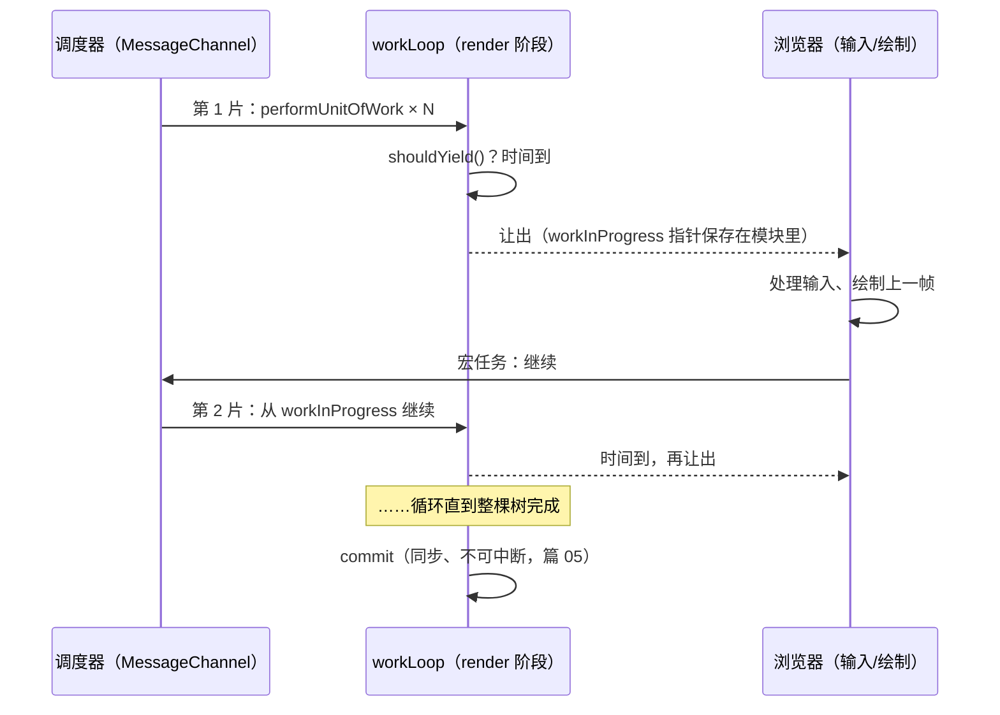
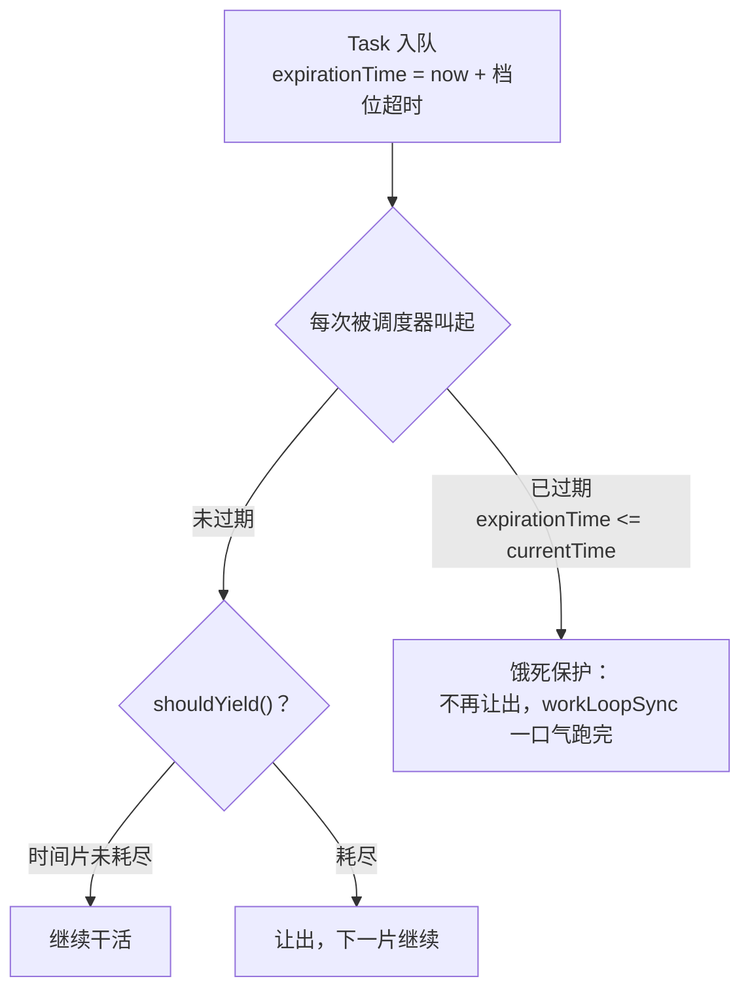

# 09 - 调度器与时间切片

> 对应大纲篇 09（应用层 · 精讲） | 预计时间：90 分钟
> 面试可答：时间切片 = 每帧切片内干活，`shouldYield` 到期就让出主线程，用宏任务（MessageChannel）排下一片；长任务不再阻塞输入。
> 前置：[08 - 记忆化与状态管理 Hooks](./08-记忆化与状态管理Hooks.md)（hooks 全家桶与微任务级 batching）；技术栈规范见 [agents.md §5.6](../../../../../agents.md)

---

## 1. 本篇定位

一句话：**把 workLoop 从「一口气跑完的同步循环」升级为「真调度器驱动的时间切片循环」——v3 里程碑，可中断渲染从结构可能变成运行时事实。**

篇 03 就埋了伏笔：链表化让「做完一个单元看一眼该不该让路」在结构上成立，但 workLoopSync 一直是同步的；篇 06 的更新调度也只是一个微任务闸门。本篇补上调度这块拼图：

| 产出                                       | 位置                     | 说明                                                     |
| ------------------------------------------ | ------------------------ | -------------------------------------------------------- |
| 最小调度器（task queue + 时间片 + 饿死保护） | `src/scheduler/index.ts` | 本篇新建，对照 `packages/scheduler`                       |
| workLoop 升级为切片循环 + 调度器接管        | `src/fiber/workLoop.ts`  | 篇 06 的微任务 batching 收拢进调度器排班                  |
| passive flush 从微任务迁到调度器            | `src/hooks/index.ts`     | 兑现篇 07 的预告：「真实 React 由 Scheduler 排到 commit 之后」 |

> ⚠️ **「最新形态」约定**：本篇 §4 展示的 workLoop 是篇 10/11 接线后的最新形态（含 lane 标记与 Suspense 捕获）——本篇的主角只有「调度接管 + 切片循环 + 饿死保护」，lane 与 Suspense 的行在对应篇目逐段展开。lane 位运算模型见 [10 - 优先级与并发更新](./10-优先级与并发更新.md)。

---

## 2. 从长任务到时间切片

同步 workLoop 的死穴在篇 01 就画过：树有多大，这一帧就有多长。5000 节点的 diff 是一个不可分割的 Long Task，期间按键、滚动、动画全部排队。

时间切片的解法分两半：

1. **干活时看表**：每完成一个 unitOfWork（beginWork 或 completeWork 的一次迭代），检查一次时间片——已占用时长超过阈值就让出主线程
2. **让出后会回来**：把「剩余工作」交给一个宏任务，浏览器处理完输入/绘制后，宏任务带着 workInProgress 指针继续干活



三个关键认知：

- **切片只切 render 阶段**：commit 操作真实 DOM，不可中断（篇 01 的物理边界）——所以真正必须快的是「每一片结束前的 yield 判定」，而不是把 commit 也切碎
- **遍历状态只剩一个指针**：`workInProgress` 是模块级变量，让出/恢复不需要保存调用栈——这就是篇 03 链表化的全部回报
- **中断期间屏幕是完整的旧树**：workInProgress 树在内存里慢慢搭，双缓存保证用户永远看不到半成品

> 💡 真实源码的切片阈值是 `frameYieldMs`（默认 5ms）——不是对齐 16.7ms 的帧长。Scheduler 的注释原话：它**有意不对齐帧边界**（"It does not attempt to align with frame boundaries, since most tasks don't need to be frame aligned"），需要帧对齐的任务应该用 requestAnimationFrame。5ms 让一帧里能塞下多个切片，输入延迟的上界因此更小。

---

## 3. 最小调度器：task queue + 时间片 + 饿死保护

`src/scheduler/index.ts` 全量落地（下文分段展示，拼起来即完整文件；真实源码对照 `packages/scheduler/src/forks/Scheduler.js`）：

第 1 段——优先级档位与 Task 类型。教学版取 4 个档位（数值与 `SchedulerPriorities.js` 对齐）；每档一个超时时间，**过期任务不再让出**（§6 饿死保护）：

```ts
// 最小调度器：task queue（最小堆按过期时间排序）+ MessageChannel 宏任务循环
// + shouldYield 时间片检查 + 过期任务强制执行（饿死保护）
// 真实源码对照：packages/scheduler/src/forks/Scheduler.js
// 教学版省略：timerQueue（delay 延迟任务）/ continuation 返回值 /
// runWithPriority / requestPaint / profiling 钩子

// 优先级档位（数值与 SchedulerPriorities.js 对齐，教学版取用到的子集）
export const ImmediatePriority = 1
export const UserBlockingPriority = 2
export const NormalPriority = 3
export const LowPriority = 4

export type PriorityLevel =
  | typeof ImmediatePriority
  | typeof UserBlockingPriority
  | typeof NormalPriority
  | typeof LowPriority

// 各档位的超时时间：过期后调度器不再让出（饿死保护）。
// 真实源码在 SchedulerFeatureFlags.js 里按档位配置 timeout
const priorityTimeout: Record<PriorityLevel, number> = {
  [ImmediatePriority]: -1,
  [UserBlockingPriority]: 250,
  [NormalPriority]: 5000,
  [LowPriority]: 10000
}

// 时间片长度（真实源码 frameYieldMs，Scheduler 每片让出前最多占这么久）
const frameInterval = 5

export type Task = {
  id: number
  // 返回 true 表示任务未完成，调度器让出后下一片继续调用；
  // 真实源码返回 continuation 回调（等价语义，教学版收敛为布尔值）
  callback: ((didTimeout: boolean) => boolean) | null
  priorityLevel: PriorityLevel
  // 过期时刻 = 入队时刻 + 档位超时：到期后任务强制执行、不再让出
  expirationTime: number
  // 最小堆排序键。教学版立即执行的任务与 expirationTime 相同
  // （真实源码延迟任务按 startTime 排序进 timerQueue，教学版省略）
  sortIndex: number
}

const getCurrentTime = (): number => performance.now()
```

第 2 段——task queue 是**最小堆**（`SchedulerMinHeap.js` 同构，按 `sortIndex` 排序）：到期最早的任务排最前；不同优先级的任务靠超时时间自然分层（高优先级超时短 → sortIndex 小 → 先被执行）：

```ts
// ─── task queue：最小堆（SchedulerMinHeap.js 同构，按 sortIndex 排序） ───
const taskQueue: Task[] = []

const push = (task: Task): void => {
  taskQueue.push(task)
  let index = taskQueue.length - 1
  while (index > 0) {
    const parentIndex = (index - 1) >> 1
    const parent = taskQueue[parentIndex]
    if (parent === undefined || parent.sortIndex <= task.sortIndex) {
      break
    }
    taskQueue[index] = parent
    index = parentIndex
  }
  taskQueue[index] = task
}

const pop = (): Task | null => {
  const first = taskQueue[0]
  const last = taskQueue.pop()
  if (first === undefined || first === last) {
    // 空堆，或弹出的就是唯一元素
    return first ?? null
  }
  if (last !== undefined) {
    // 尾元素补到堆顶，向下换位
    taskQueue[0] = last
    let index = 0
    for (;;) {
      const leftIndex = index * 2 + 1
      const left = taskQueue[leftIndex]
      if (left === undefined) {
        break
      }
      const rightIndex = leftIndex + 1
      const right = taskQueue[rightIndex]
      const smaller = right !== undefined && right.sortIndex < left.sortIndex
      const smallerIndex = smaller ? rightIndex : leftIndex
      const smallerTask = smaller ? right : left
      if (
        smallerTask === undefined ||
        last.sortIndex <= smallerTask.sortIndex
      ) {
        break
      }
      taskQueue[index] = smallerTask
      index = smallerIndex
    }
    taskQueue[index] = last
  }
  return first
}

const peek = (): Task | null => {
  return taskQueue[0] ?? null
}
```

第 3 段——调度器工作循环。**饿死保护的判定与真实源码逐字对应**：`expirationTime > currentTime && shouldYield()` 才让出——任务一旦过期，循环一口气跑完：

```ts
// ─── 调度器工作循环：饿死保护与让出判定 ──────────────────────
let taskIdCounter = 1
let isMessageLoopRunning = false
// 本片起点：shouldYield 以它测量已占用时长
let startTime = -1

// shouldYield：时间片检查。真实源码 shouldYieldToHost（导出名为
// unstable_shouldYield），ReactFiberWorkLoop 内的本地 shouldYield 即它
export const shouldYield = (): boolean => {
  return getCurrentTime() - startTime >= frameInterval
}

// 调度器工作循环（真实源码同名函数）。核心判定与真实源码逐字对应：
// `expirationTime > currentTime && shouldYield()` —— 任务已过期就不再让出，
// 一口气跑完（饿死保护：低优先级任务排队过久后强制立即执行）
const workLoop = (currentTime: number): boolean => {
  let currentTask = peek()
  while (currentTask !== null) {
    if (currentTask.expirationTime > currentTime && shouldYield()) {
      // 时间片耗尽且任务未过期：让出主线程，下一片继续
      break
    }
    const callback = currentTask.callback
    if (typeof callback === 'function') {
      const didTimeout = currentTask.expirationTime <= currentTime
      const hasMoreWork = callback(didTimeout)
      if (hasMoreWork) {
        // 任务未完成：保留队列原位，让出主线程排下一片
        break
      }
      currentTask.callback = null
    }
    pop()
    currentTask = peek()
  }
  return currentTask !== null
}

const performWorkUntilDeadline = (): void => {
  if (isMessageLoopRunning) {
    const currentTime = getCurrentTime()
    startTime = currentTime
    let hasMoreWork = true
    try {
      hasMoreWork = workLoop(currentTime)
    } finally {
      if (hasMoreWork) {
        // 还有余活：把下一片排到当前宏任务之后（真实源码同款收尾）
        schedulePerformWorkUntilDeadline()
      } else {
        isMessageLoopRunning = false
      }
    }
  }
}

// MessageChannel 宏任务优先：嵌套 setTimeout(0) 五层后被浏览器钳到 4ms，
// 消息任务没有这个节流，切片间隙更顺滑（真实源码同款选择，注释原话
// "We prefer MessageChannel because of the 4ms setTimeout clamping"）
const channel = new MessageChannel()
const port = channel.port2
channel.port1.onmessage = performWorkUntilDeadline

const schedulePerformWorkUntilDeadline = (): void => {
  port.postMessage(null)
}

const requestHostCallback = (): void => {
  if (!isMessageLoopRunning) {
    isMessageLoopRunning = true
    schedulePerformWorkUntilDeadline()
  }
}
```

第 4 段——对外的 `scheduleCallback`（真实源码 `unstable_scheduleCallback` 教学版）：

```ts
// unstable_scheduleCallback 的教学版：入队 + 排宏任务，返回任务句柄
export const scheduleCallback = (
  priorityLevel: PriorityLevel,
  callback: (didTimeout: boolean) => boolean
): Task => {
  const currentTime = getCurrentTime()
  const task: Task = {
    id: taskIdCounter++,
    callback,
    priorityLevel,
    expirationTime: currentTime + priorityTimeout[priorityLevel],
    sortIndex: currentTime + priorityTimeout[priorityLevel]
  }
  push(task)
  requestHostCallback()
  return task
}

// unstable_cancelCallback 同款：置空回调（堆无法随机删除，执行时跳过）
export const cancelCallback = (task: Task): void => {
  task.callback = null
}
```

回调契约注意一点：`callback` 返回 `true` 表示「活没干完」，任务**保留在堆里原位**，下一片继续调用同一个回调；返回 `false` 才弹出。真实源码的等价物是「返回 continuation 回调则立即让出」——语义相同，教学版收敛为布尔值。

---

## 4. workLoop 升级：调度器接管渲染

`src/fiber/workLoop.ts` 全量落地（完整源码，与仓库文件逐字一致）：

```ts
// workLoop 与渲染入口：切片循环 / 调度器接管 / Suspense 捕获 / createRoot
// 真实源码对照：packages/react-reconciler/src/ReactFiberWorkLoop.js
import type { Fiber, FiberRoot, ReactRoot } from './index'
import { createHostRootFiber, createWorkInProgress } from './index'
import { beginWork, completeWork } from './beginWork'
import { commitMutation } from '../commit'
import { flushLayoutEffects, schedulePassiveEffects } from '../hooks'
import { handleSuspenseThrow } from '../suspense'
import { scheduleCallback, shouldYield } from '../scheduler'
import {
  DefaultLane,
  NoLanes,
  getNextLanes,
  lanesToSchedulerPriority,
  mergeLanes,
  removeLanes
} from '../scheduler/lanes'
import type { Lanes } from '../scheduler/lanes'
import type { ReactElement } from '../jsx'

let workInProgress: Fiber | null = null
let workInProgressRoot: FiberRoot | null = null
// 本次渲染要处理的 lane 集（真实源码 workInProgressRootRenderLanes）
let workInProgressRootRenderLanes: Lanes = NoLanes
// 本次渲染是否因 Transition 挂起被放弃（屏幕保持旧 UI，等 resolve 重试）
let renderDidSuspend = false
// 调度排班闸门：篇 06 闸的是微任务，篇 09 起闸的是调度器任务
let isRenderScheduled = false
let scheduledRoot: FiberRoot | null = null

// hooks 消费更新队列时需要知道本次渲染的 lane 集
export const getRenderLanes = (): Lanes => workInProgressRootRenderLanes

// suspense 挂起时需要根引用（promise resolve 后的调度目标）
export const getWorkInProgressRoot = (): FiberRoot | null => workInProgressRoot

// performUnitOfWork：一个可中断的「工作单元」。
// beginWork 向下（返回 child）；到叶子后 completeWork 沿 sibling 向右、
// 向 return 向上回溯——用循环替代了 v0 递归的调用栈
export const performUnitOfWork = (fiber: Fiber): Fiber | null => {
  const next = beginWork(fiber)
  if (next !== null) {
    return next
  }
  let current: Fiber | null = fiber
  while (current !== null) {
    completeWork(current)
    if (current.sibling !== null) {
      return current.sibling
    }
    current = current.return
  }
  return null
}

// 单步执行：promise 上抛在这里被最近的 Suspense 边界接住（篇 11）。
// 返回下一个工作单元；Transition 挂起放弃渲染时返回 null 并置 renderDidSuspend
const stepUnitOfWork = (fiber: Fiber): Fiber | null => {
  try {
    return performUnitOfWork(fiber)
  } catch (thrownValue) {
    const next = handleSuspenseThrow(fiber, thrownValue)
    if (next === null) {
      // Transition 防闪：放弃本次渲染现场——旧 UI 保持，等 promise resolve
      renderDidSuspend = true
      return null
    }
    // 回到边界重新 begin：本次渲染改出 fallback
    return next
  }
}

// 同步循环：任务过期（饿死保护触发）时不再让出，一口气跑完（真实源码
// workLoopSync，performConcurrentWorkOnRoot 在 didTimeout 分支调用）
const workLoopSync = (): void => {
  while (workInProgress !== null) {
    workInProgress = stepUnitOfWork(workInProgress)
  }
}

// 切片循环：每完成一个工作单元检查一次时间片。真实源码
// workLoopConcurrentByScheduler 同款条件：
// while (workInProgress !== null && !shouldYield())
const workLoopConcurrent = (): void => {
  while (workInProgress !== null && !shouldYield()) {
    workInProgress = stepUnitOfWork(workInProgress)
  }
}

// 更新调度入口（篇 06 排班闸门 + 篇 10 lane 标记）：dispatch 入队后从这里触发
export const scheduleRootRender = (root: FiberRoot, lane: Lanes): void => {
  root.pendingLanes = mergeLanes(root.pendingLanes, lane)
  ensureRootIsScheduled(root)
}

// ensureRootIsScheduled：真实源码同名函数。已有排班时不重复排——
// 高优先级更新到达后，下一次切片会从 pendingLanes 重取最高 lane，
// 进行中的低优先级渲染现场被丢弃重启（插队）
const ensureRootIsScheduled = (root: FiberRoot): void => {
  if (isRenderScheduled) {
    return
  }
  isRenderScheduled = true
  scheduledRoot = root
  const priority = lanesToSchedulerPriority(getNextLanes(root))
  scheduleCallback(priority, performConcurrentWorkOnRoot)
}

// 调度器任务本体：每次被调用都取 pendingLanes 的最高优先级 lane 渲染。
// 返回 true 表示渲染未完成（时间片让出，任务留在队列下一片继续）
const performConcurrentWorkOnRoot = (didTimeout: boolean): boolean => {
  const root = scheduledRoot
  if (root === null) {
    return false
  }
  const lanes = getNextLanes(root)
  if (lanes === NoLanes) {
    isRenderScheduled = false
    scheduledRoot = null
    return false
  }
  renderRoot(root, lanes, didTimeout)
  if (renderDidSuspend) {
    // Transition 挂起：lane 出账，promise resolve 后以 RetryLane 重新排班
    renderDidSuspend = false
    root.pendingLanes = removeLanes(
      root.pendingLanes,
      workInProgressRootRenderLanes
    )
    isRenderScheduled = false
    scheduledRoot = null
    return false
  }
  if (workInProgress !== null) {
    // 时间片耗尽：任务留在队列，下一片继续
    return true
  }
  commitRoot()
  isRenderScheduled = false
  scheduledRoot = null
  if (root.pendingLanes !== NoLanes) {
    // 提交后还有低优先级 lane：续排（真实源码 markRootFinished 后的再调度）
    ensureRootIsScheduled(root)
  }
  return false
}

const renderRoot = (
  root: FiberRoot,
  lanes: Lanes,
  didTimeout: boolean
): void => {
  // 高优先级插队：渲染目标 lane 变了 → 丢弃现场重新开始
  // （真实源码 renderRootConcurrent 里 lanes 不一致走 prepareFreshStack）
  if (workInProgressRoot !== root || workInProgressRootRenderLanes !== lanes) {
    workInProgressRoot = root
    workInProgressRootRenderLanes = lanes
    workInProgress = createWorkInProgress(
      root.current,
      root.current.pendingProps
    )
  }
  renderDidSuspend = false
  if (didTimeout) {
    workLoopSync()
  } else {
    workLoopConcurrent()
  }
}

// commitRoot 入口骨架：只负责「调 mutation + 交换双缓存 + 收尾 effects」，
// 具体 DOM 操作在 src/commit。真实源码里这一层串联三大子阶段
const commitRoot = (): void => {
  const root = workInProgressRoot
  const finishedWork = root !== null ? root.current.alternate : null
  if (root === null || finishedWork === null) {
    return
  }
  commitMutation(finishedWork, root)
  // 双缓存交换：workInProgress 树转正为 current 树。
  // 真实源码这一行在 mutation 之后、layout 之前执行
  root.current = finishedWork
  // layout effects：同步执行——DOM 已更新、浏览器尚未绘制（篇 07）
  flushLayoutEffects()
  // passive effects：异步 flush（篇 09 起由调度器接管）
  schedulePassiveEffects()
  // 本次渲染消费的 lane 出账（真实源码 markRootFinished 同位置）
  root.pendingLanes = removeLanes(
    root.pendingLanes,
    workInProgressRootRenderLanes
  )
  workInProgressRoot = null
  workInProgress = null
}

// createRoot(container).render(element)：与 react-dom/client 同款 API
export const createRoot = (container: Element): ReactRoot => {
  const root: FiberRoot = {
    containerInfo: container,
    current: createHostRootFiber(),
    pendingLanes: NoLanes
  }
  root.current.stateNode = root
  return {
    render(element: ReactElement): void {
      // 要渲染的 element 挂在 HostRoot 的 pendingProps.children 上
      // （真实 React 走 updateContainer → 更新队列，简化为直接赋值）
      root.current.pendingProps = { children: element }
      // 首挂载也走调度器（DefaultLane）——篇 09 起 render 不再同步执行
      scheduleRootRender(root, DefaultLane)
    }
  }
}
```

与篇 06 版本的四点差异，逐一对号：

| 变化                             | 篇 06 版                             | 本篇版                                                                       |
| -------------------------------- | ------------------------------------ | ---------------------------------------------------------------------------- |
| 更新调度入口                     | 微任务 + `isRenderScheduled` 闸门    | `scheduleRootRender` → `ensureRootIsScheduled` 排**调度器任务**，闸门照用     |
| 渲染循环                         | `workLoopSync` 一口气跑完            | `workLoopConcurrent` 每单元检查 `shouldYield`；`workLoopSync` 留给饿死保护    |
| 中断恢复                         | 不存在（同步）                       | `performConcurrentWorkOnRoot` 返回 `true`，任务留堆，下一片继续               |
| passive flush                    | `queueMicrotask`                     | `scheduleCallback(NormalPriority, …)`（`src/hooks/index.ts` 内，§5）          |

两处结构要点：

- **`performConcurrentWorkOnRoot` 返回值就是调度器的 `hasMoreWork`**：渲染没做完 → `true` → 任务留在堆里；做完 → `false` → 弹出。「渲染任务」和「调度器任务」在这里接合
- **`renderRoot` 的 lane 检查是插队的机关**（篇 10 展开）：每次被调度器叫起都重新取 `getNextLanes(root)`，目标 lane 变了就丢弃现场重新开始——真实源码 `renderRootConcurrent` 里 lanes 不一致走 `prepareFreshStack`，同一个意思

---

## 5. passive flush 迁移：兑现篇 07 的预告

`src/hooks/index.ts` 的 `schedulePassiveEffects`，从微任务换成调度器任务：

```ts
// passive flush：真实 React 由 Scheduler 排到 commit 之后异步执行
// （ReactFiberWorkLoop.js 实核：scheduleCallback(NormalSchedulerPriority,
// flushPassiveEffects)）——篇 09 起挂到真调度器，可被高优先级任务插队
let passiveTask: Task | null = null
export const schedulePassiveEffects = (): void => {
  if (passiveTask !== null) {
    return
  }
  passiveTask = scheduleCallback(NormalPriority, () => {
    passiveTask = null
    flushEffectList(pendingPassiveEffects)
    return false
  })
}
```

变化只有「排到哪个队列」：微任务 → Normal 优先级的调度器任务。收益有两个：effect flush 会给用户输入让路（微任务不会——它在同一宏任务收尾前必然执行）；effect flush 与下一次渲染任务在同一个优先级体系里排队，次序可预期。这与真实源码 `ReactFiberWorkLoop.js` 中 commitRoot 末尾的 `scheduleCallback(NormalSchedulerPriority, flushPassiveEffects)` 对齐（19.x main 实核）。

---

## 6. 饿死保护：过期任务强制立即执行

时间切片有一个天然风险：**如果源源不断的高优先级切片插队，排队的低优先级任务可能永远轮不上**——任务饿死。调度的答案是把「优先级」翻译成「最后期限」：



实现落点有两处，配合成闭环：

1. **调度器层**（§3 第 3 段）：`expirationTime > currentTime && shouldYield()` 才让出——过期任务在堆里获得「豁免权」。真实源码 `Scheduler.js` 的 workLoop 同款判定
2. **渲染层**（§4）：调度器把 `didTimeout` 传给回调，`renderRoot` 据此选 `workLoopSync`——一次性跑完整棵树，中间零让出

`didTimeout` 的语义值得背下来：**「我这个任务已经等得太久，这一次执行允许我破坏时间片约定」**。它把「饿死」从一个无限拖延变成了「最多拖延档位超时（Low = 10s）」的有界延迟。

真实 React 还有一层渲染侧的镜像：`ReactFiberLane.js` 的 `markStarvedLanesAsExpired` 把等待过久的 lane 标进 `root.expiredLanes`（`computeExpirationTime` 按档位配置过期时长，Idle 档永不过期）——教学版把过期收敛在调度器层，渲染侧的 lane 过期在篇 10 对照。

---

## 7. 源码对照：mini vs Scheduler.js

| mini-react                          | 真实源码（19.x main，均已实核）                                       | 差距说明                                                                      |
| ----------------------------------- | --------------------------------------------------------------------- | ----------------------------------------------------------------------------- |
| `taskQueue` 最小堆                  | `Scheduler.js` + `SchedulerMinHeap.js` 的 `push/pop/peek`             | 真实版还有 `timerQueue`（delay 延迟任务 + `requestHostTimeout`）              |
| `shouldYield`                       | `shouldYieldToHost`（导出名为 `unstable_shouldYield`）                | 真实版多 `needsPaint` 检查（`enableRequestPaint`）；阈值同为 `frameYieldMs`   |
| `workLoop` 的 `expirationTime > currentTime && shouldYield()` | 同款判定（`Scheduler.js` 的 `workLoop`）                      | 完全同构                                                                      |
| `didTimeout` → `workLoopSync`       | `ReactFiberWorkLoop.js` 的 `performConcurrentWorkOnRoot` didTimeout 分支 | 真实版过期时还会重取 expired lanes                                            |
| `scheduleCallback`                  | `unstable_scheduleCallback`                                           | 真实版处理 `options.delay`、返回 continuation 回调                            |
| `ensureRootIsScheduled` + 单任务    | `ReactFiberWorkLoop.js` 同名函数 + Scheduler 任务池                   | 真实版可能同时存在多个 root 任务并做取消/重排；教学版单任务 + lane 重取       |
| lane 出账                           | `markRootFinished`                                                    | 篇 10 展开                                                                    |

阅读建议：`Scheduler.js` 从 `function workLoop` 读起（不到 60 行，是整个并发 React 的心脏），再读 `shouldYieldToHost`（不到 15 行）——这两段是面试白板题的原文出处。

---

## 8. 练习：渲染 5000 节点列表，对比同步版与切片版的 Long Task

**要求**：在临时入口（`playground/mini.html` + `mini-main.tsx`，前几篇约定不变）用 mini-react 渲染一个 5000 节点的列表（如 2500 个 `<li>`，每个含一个 `<span>` 和文本）。先按当前 `src/` 跑一遍（切片版）；再把 `src/fiber/workLoop.ts` 里 `workLoopConcurrent` 的 `&& !shouldYield()` 临时删掉（变回同步版）跑一遍。两次都录 Performance 面板，对比 Long Task 的数量与输入响应。

**提示**：Performance 面板勾选 Screenshots，录制「点击渲染按钮 → 等待完成」全过程，重点看主线程轨道上的长任务条与任务间的空隙。切片版应看到多个 ≤5ms 级的小任务（每个切片之间浏览器有机会处理输入/绘制）；同步版是一个几百毫秒的 Long Task。想再验证让出粒度，可在 `workLoopConcurrent` 循环体里 `console.log(performance.now())`，观察每次打印间隔被 `shouldYield` 卡在 5ms 附近。另外注意 `createRoot().render()` 现在是**异步**的——首屏完成要等一个宏任务之后，断言 DOM 前先 `setTimeout` 一下。

**预期效果**：两张 Performance 截图能对比出「1 个 Long Task vs N 个短切片」；能指着 `shouldYield` 与 `expirationTime > currentTime` 两个判定说出「谁负责切、谁负责不饿死」；能解释为什么 commit 段在两种版本里都是一个不可分割的任务（篇 01 的物理边界）。

---

## 9. 面试问答

**Q1：什么是时间切片？React 是怎么实现的？**

> 时间切片把大的 render 计算切成多个 ≤5ms 的小段：每完成一个 fiber 工作单元检查一次 `shouldYield`，时间片耗尽就让出主线程，剩余工作通过宏任务（MessageChannel）继续。它依赖两个前提：fiber 链表让遍历状态只剩一个指针（可暂停可恢复），双缓存让中断期间屏幕始终显示完整的旧树。切片只作用于 render 阶段，commit 仍然同步不可中断。 _（追问见 Q1-1）_
>
> **Q1-1：切片的粒度是什么？为什么不对每个节点都检查？**
> 粒度是一个 fiber 的处理单元（performUnitOfWork 的一次调用，含它的 beginWork 与向上 completeWalk）。检查本身有成本（performance.now 约几十纳秒到微秒级），按单元检查在「响应性」与「检查开销」间取平衡；更细粒度收益递减，更粗粒度会拉长单片的输入延迟上界。真实源码正是在 workLoopConcurrentByScheduler 的循环条件里做这个检查。

**Q2：shouldYield 是怎么实现的？为什么不用 requestAnimationFrame 判断帧边界？**

> 就一行：`performance.now() - startTime >= frameInterval`——本切片起点到现在超过 5ms 就让出，其中 startTime 在每次调度器接管时刷新。不用 rAF 对齐帧边界是 Scheduler 有意的设计：大多数任务不需要帧对齐，对齐反而把切片下限绑死在帧长上（16.7ms），而 5ms 让一帧里能塞多个切片、让输入更早被处理；需要与帧同步的视觉任务应该自己用 rAF。 _（追问见 Q2-1）_
>
> **Q2-1：5ms 这个数字哪来的？改大有影响吗？**
> 来自 Scheduler 的 feature flag（frameYieldMs，默认 5，可用 unstable_forceFrameRate 间接调整）。它不是「一帧的 1/3」这类玄学，而是「单片最长阻塞」的工程取值：太小则调度开销占比升高，太大则输入延迟上界变长。面试可答「默认 5ms、可配置、设计上不对齐帧边界」即可站住。

**Q3：为什么用 MessageChannel 而不是 setTimeout(fn, 0)？**

> 浏览器对嵌套 setTimeout 有 4ms 的最小间隔钳制：嵌套超过 5 层后，每次 setTimeout(0) 都要等 4ms——时间切片一秒最多只能排 250 片，切片间隙被无谓拉长。MessageChannel 的 postMessage 是宏任务但没有这个节流，下一片能立刻排上。Scheduler 源码注释原话是 "We prefer MessageChannel because of the 4ms setTimeout clamping"；Node 环境则优先 setImmediate（语义同、且不阻止进程退出）。 _（追问见 Q3-1）_
>
> **Q3-1：低优先级任务一直被插队怎么办？**
> 每个任务入队时就带上了过期时间（入队时刻 + 档位超时，Low 是 10s）。调度器每次取任务时先判过期：任务已过期就不再让出、一口气跑完（didTimeout 传入渲染层后连 render 循环都切换成同步 workLoopSync）。所以饿死不是「永远不会执行」，而是「最多推迟一个档位超时」——这是用时间换响应性的有界让步。

---

## 10. 本篇自检

- [ ] 能默写 workLoopConcurrent 的循环条件，并说出它与 Scheduler.js workLoop 判定的对应关系
- [ ] 能画出「切片 → 让出 → 宏任务 → 继续」的时序，并指出 workInProgress 指针在其中的角色
- [ ] MessageChannel vs setTimeout 的 4ms 钳制能讲清出处与影响
- [ ] 饿死保护的两层实现（调度器过期豁免 + didTimeout → workLoopSync）能脱稿对上
- [ ] Performance 面板对比过同步版与切片版的 Long Task，两张图在手
- [ ] 知道 passive flush 已从微任务迁到调度器，且能说出收益（给输入让路、与渲染任务同队列排序）

---

## 11. 参考资料

- [Scheduler.js（facebook/react main）](https://github.com/facebook/react/blob/main/packages/scheduler/src/forks/Scheduler.js) —— workLoop / shouldYieldToHost（导出 unstable_shouldYield）/ MessageChannel 选择
- [SchedulerMinHeap.js（facebook/react main）](https://github.com/facebook/react/blob/main/packages/scheduler/src/SchedulerMinHeap.js) —— task queue 的最小堆实现
- [SchedulerPriorities.js（facebook/react main）](https://github.com/facebook/react/blob/main/packages/scheduler/src/SchedulerPriorities.js) —— 优先级档位数值
- [ReactFiberWorkLoop.js（facebook/react main）](https://github.com/facebook/react/blob/main/packages/react-reconciler/src/ReactFiberWorkLoop.js) —— performConcurrentWorkOnRoot / workLoopConcurrentByScheduler / 本地 shouldYield
- [React 官方文档 · useTransition](https://react.dev/reference/react/useTransition) —— 篇 10 的官方 API 入口
- [React 19.3 发布公告（2026-09-09，本系列版本断言基准）](https://react.dev/blog/2026/09/09/react-19-3)
- 上一篇：[08 - 记忆化与状态管理 Hooks](./08-记忆化与状态管理Hooks.md) ｜ 下一篇：[10 - 优先级与并发更新](./10-优先级与并发更新.md)
