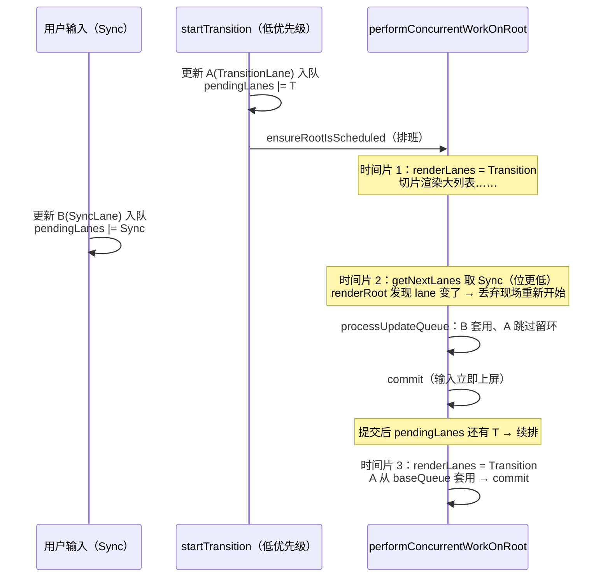
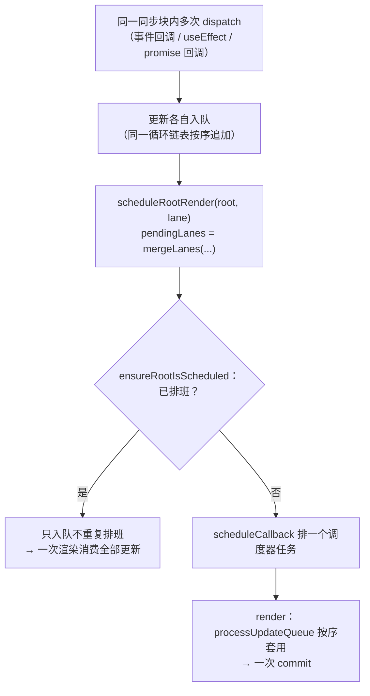

# 10 - 优先级与并发更新

> 对应大纲篇 10（应用层 · 精讲） | 预计时间：90 分钟
> 面试可答：lane 是位掩码优先级，高低优先级更新可插队且低优先级不丢；useTransition 把更新标为低优先级，让输入响应不被大计算阻塞。
> 前置：[09 - 调度器与时间切片](./09-调度器与时间切片.md)（调度器接管与切片循环）；工具库对照见 [React Hooks 系列](../../hooks/readme.md)

---

## 1. 本篇定位

一句话：**给每个更新打上 lane 位优先级，让「高优先级插队、低优先级保序重放」在渲染层闭环——v4 并发模型的地基，useTransition/useDeferredValue 都是它的直接受益者。**

篇 09 的调度器已经能切片，但所有更新还是「一视同仁」：输入框和 5000 行列表的重算排在同一档。本篇补上优先级维度：

| 产出                                               | 位置                     | 说明                                                       |
| -------------------------------------------------- | ------------------------ | ---------------------------------------------------------- |
| lane 简化版（位掩码档位 + 判定/轮转工具）          | `src/scheduler/lanes.ts` | 本篇新建，对照 `ReactFiberLane.js`                         |
| 更新带 lane 入队 + 按优先级消费                    | `src/hooks/index.ts`     | `Update.lane` + `processUpdateQueue`（baseQueue 保序重放） |
| 插队 → 恢复的渲染闭环                              | `src/fiber/workLoop.ts`  | 篇 09 已落地全文，本篇讲机制（§5）                         |
| bailout 与待处理更新的衔接                         | `src/fiber/beginWork.ts` | memo 放行检查加入 lane 位                                  |
| useTransition / useDeferredValue / startTransition | `src/hooks/index.ts`     | 建立在 lane 标记上的官方 API 对应物                        |

---

## 2. lane 简化版：位掩码优先级

真实 React 的优先级模型叫 **lane**：31 个二进制位（`ReactFiberLane.js` 实核 `TotalLanes = 31`），位越低优先级越高。lane 不只是一个「档位枚举」，它是**位集合**——一个 fiber 可以同时挂着「有一个同步更新 + 一个 transition 更新」，一个渲染可以同时处理多个 lane（`renderLanes`）。

`src/scheduler/lanes.ts` 全量落地（完整源码，与仓库文件逐字一致）：

```ts
// lane 简化版：位掩码优先级档位
// 真实源码对照：packages/react-reconciler/src/ReactFiberLane.js
// （TotalLanes = 31 位；教学版 8 位、4 档——位越低优先级越高）
import type { PriorityLevel } from './index'
import { LowPriority, NormalPriority, UserBlockingPriority } from './index'

export const NoLanes = 0b00000000
export const SyncLane = 0b00000001
export const InputContinuousLane = 0b00000010
export const DefaultLane = 0b00000100
export const TransitionLane1 = 0b00001000
export const TransitionLane2 = 0b00010000
export const TransitionLanes = TransitionLane1 | TransitionLane2
// 重试档（篇 11）：Suspense resolve 后的重渲染走这里，可被更高优先级插队
export const RetryLane = 0b00100000

export type Lanes = number
export type Lane = number

// 判定 lanes 是否包含目标位（真实源码同名函数）
export const includesSomeLane = (a: Lanes, b: Lanes): boolean => {
  return (a & b) !== NoLanes
}

// 判定 subset 是否为 set 的子集——processUpdateQueue 消费更新时用它：
// NoLanes(0) 是任何集合的子集，所以「已消费」的更新重放时必被套用
export const isSubsetOfLanes = (set: Lanes, subset: Lanes): boolean => {
  return (set & subset) === subset
}

export const mergeLanes = (a: Lanes, b: Lanes): Lanes => {
  return a | b
}

export const removeLanes = (set: Lanes, subset: Lanes): Lanes => {
  return set & ~subset
}

// 取最高优先级的 lane：位值最小 = 优先级最高。真实源码同名函数经
// pickArbitraryLaneIndex / clz32 实现，教学版用位技巧 lanes & -lanes
export const getHighestPriorityLane = (lanes: Lanes): Lane => {
  return lanes & -lanes
}

// 对照 ReactFiberLane.js 的 getNextLanes：取根上待处理的最高优先级 lane。
// 真实版返回「同优先级组」的 lane 集合，教学版返回单个 lane
export const getNextLanes = (root: { pendingLanes: Lanes }): Lanes => {
  return getHighestPriorityLane(root.pendingLanes)
}

// Transition 档位轮转：并发 transition 各占一位（19 main 无单一轮转函数，
// 已拆为 claimNextTransitionUpdateLane / claimNextTransitionDeferredLane，
// 教学版合并为单池 2 位轮转）
const transitionLanePool = [TransitionLane1, TransitionLane2]
let nextTransitionLaneIndex = 0
export const claimNextTransitionLane = (): Lane => {
  const lane = transitionLanePool[nextTransitionLaneIndex] ?? TransitionLane1
  nextTransitionLaneIndex =
    (nextTransitionLaneIndex + 1) % transitionLanePool.length
  return lane
}

// lane → 调度器优先级档位（真实源码 lanesToEventPriority 的教学化映射）
export const lanesToSchedulerPriority = (lanes: Lanes): PriorityLevel => {
  if (includesSomeLane(lanes, SyncLane | InputContinuousLane)) {
    return UserBlockingPriority
  }
  if (includesSomeLane(lanes, DefaultLane)) {
    return NormalPriority
  }
  // Transition / Retry：低优先级档——可中断渲染的主力
  return LowPriority
}
```

教学版与真实模型的档位对照：

| mini lane             | 真实源码 lane（实核 `ReactFiberLane.js`）                                             | 谁在用                             |
| --------------------- | ------------------------------------------------------------------------------------- | ---------------------------------- |
| `SyncLane = 0b1`      | `SyncLane`                                                                            | `useState` 的默认 dispatch         |
| `InputContinuousLane` | `InputContinuousLane`                                                                 | 连续输入类事件（教学版未分派）     |
| `DefaultLane`         | `DefaultLane`                                                                         | 首挂载（`createRoot().render()`）  |
| `TransitionLane1/2`   | TransitionUpdate / TransitionDeferred 两池轮转（claim 已拆为 update/deferred 两函数） | `startTransition` 标记的更新       |
| `RetryLane`           | `RetryLane1~4`                                                                        | Suspense resolve 后的重试（篇 11） |
| ——                    | `IdleLane` / `OffscreenLane` 等                                                       | 差距清单（篇 12/13）               |

两个设计点：

- **`isSubsetOfLanes` 是消费判定的核心**：真实源码用它决定「这个更新能不能在本次渲染套用」。它的微妙之处是 `NoLanes(0)` 是任何集合的子集——这不是边角，而是 §4 保序重放的机关
- **lane 位出账走 root**：`root.pendingLanes` 汇总所有待处理档位（真实源码 `markRootUpdated` 同款），渲染取最高档（`getNextLanes`），commit 后用 `removeLanes` 出账（真实源码 `markRootFinished` 同位置）

---

## 3. 更新入队带优先级

`src/hooks/index.ts` 的类型升级——`Update` 增加 `lane`，`UpdateQueue` 增加 `baseState`/`baseQueue`（真实源码把这两个字段挂在 hook 上随克隆携带，教学版收拢进共享的 queue 对象，中断恢复语义等价且更简单）：

```ts
// update 的循环链表节点：last 指向队尾，last.next 即队首（真实源码同款结构）。
// lane（篇 10）：更新优先级，dispatch 入队时必带档位
type Update = {
  action: unknown
  lane: Lanes
  next: Update | null
}

// 更新队列（篇 10 升级）：last 是 dispatch 入队的 pending 环；
// baseState 是消费基线，baseQueue 是已消费未提交 / 等待重放的环。
// 三者都挂在共享 queue 上（真实源码的 baseState/baseQueue 挂在 hook 上随
// 克隆携带，教学版收拢进 queue——中断恢复语义等价且更简单）
type UpdateQueue = {
  last: Update | null
  baseState: unknown
  baseQueue: Update | null
}
```

dispatch 侧（`createDispatch`）：入队时**必带档位**——Transition 标记期间的更新走低优先级 lane，其余默认 `SyncLane`；然后沿 return 向上找根、调度渲染。`markUpdateFromFiberToRoot` 顺带把 lane 记到触发更新的 fiber 上（`current.lanes`）——这是 §6 memo bailout 放行检查的依据：

```ts
// ─── 更新入队与调度（篇 06 / 篇 10） ─────────────────────────
// dispatch 工厂：带 lane 入队 → 从所在 fiber 向上找到 HostRoot → 调度重渲
// （reducer 的套用不在入队时做——下一轮渲染消费队列时才逐个执行，真实源码同款惰性）
const createDispatch = (
  fiber: Fiber | null,
  queue: UpdateQueue
): InternalDispatch => {
  return (action) => {
    // 篇 10：更新必带优先级——Transition 标记期间的更新走低优先级档
    const lane =
      currentTransitionLane !== NoLanes ? currentTransitionLane : SyncLane
    const update: Update = { action, lane, next: null }
    const last = queue.last
    if (last === null) {
      update.next = update
    } else {
      update.next = last.next
      last.next = update
    }
    queue.last = update
    const root = markUpdateFromFiberToRoot(fiber, lane)
    if (root !== null) {
      scheduleRootRender(root, lane)
    }
  }
}

// 从触发更新的 fiber 沿 return 向上找 HostRoot（stateNode 持有 FiberRoot），
// 并把 lane 记到触发更新的 fiber 上——memo bailout 放行检查的依据之一
const markUpdateFromFiberToRoot = (
  fiber: Fiber | null,
  lane: Lanes
): FiberRoot | null => {
  if (fiber !== null) {
    fiber.lanes = fiber.lanes | lane
  }
  let node = fiber
  while (node !== null) {
    if (node.tag === HostRoot && node.stateNode !== null) {
      return node.stateNode as FiberRoot
    }
    node = node.return
  }
  return null
}
```

> 💡 上一篇的 `scheduleRootRender(root, lane)` 在这里接上了 lane：`root.pendingLanes |= lane` 之后 `ensureRootIsScheduled`——**同一份 pendingLanes，调度器看它取最高档（篇 09），渲染看它定 renderLanes（本篇）**。

---

## 4. processUpdateQueue：lane 过滤 + 保序重放

渲染时怎么「只消费优先级够的更新」？这是本篇最精妙的一段——**不能直接跳过高优先级之外的更新**：跳过的更新必须留着，等后续能处理它的渲染再消费，而且重放顺序不能乱。`src/hooks/index.ts`：

```ts
// mount / update 两条路径共用的核心：
// mount 时只建 hook + 空 queue（reducer 在下一轮消费队列时才需要）；
// update 时先消费 update 队列（按 lane 过滤、保序重放），再基于新 state 建 dispatch
const mountStateImpl = (initialState: unknown): [unknown, InternalDispatch] => {
  const hook = mountWorkInProgressHook()
  hook.memoizedState = initialState
  hook.queue = { last: null, baseState: initialState, baseQueue: null }
  return [initialState, createDispatch(currentlyRenderingFiber, hook.queue)]
}

// 按本次渲染的 renderLanes 消费更新队列（main 无此同名符号：消费循环
// 内联于 updateReducerImpl；同名函数在 ReactFiberClassUpdateQueue.js，
// 类组件专用）——lane 够的更新套用；不够的克隆留环，等后续能处理它的
// 渲染再消费。一旦发生跳过，其后的更新无论优先级全部克隆留环——保证
// 重放时按入队顺序完整重演（真实源码同款语义：套用的克隆 lane 置
// NoLanes，0 是任何 renderLanes 的子集，重放必命中）
const processUpdateQueue = <S, A>(
  hook: Hook,
  reducer: (state: S, action: A) => S,
  renderLanes: Lanes
): void => {
  const queue = hook.queue as UpdateQueue
  // 1. pending 环并入 baseQueue 环（真实源码同名步骤）
  const lastPending = queue.last
  if (lastPending !== null) {
    const lastBase = queue.baseQueue
    if (lastBase === null) {
      queue.baseQueue = lastPending
    } else {
      // 两个环拼接：base 环尾接 pending 环头，pending 环尾接 base 环头
      // （真实源码 updateReducerImpl 的拼接同款；拼接后队尾是 pending 尾）
      const firstBase = lastBase.next
      const firstPending = lastPending.next
      lastBase.next = firstPending
      lastPending.next = firstBase
      queue.baseQueue = lastPending
    }
    queue.last = null
  }
  // 2. 沿 baseQueue 环消费
  let newState = queue.baseState as S
  let newLastBase: Update | null = null
  let didSkip = false
  const lastBase = queue.baseQueue
  if (lastBase !== null) {
    // 环上 head 恒非空（?? 兜底仅为类型收窄）
    const first: Update = lastBase.next ?? lastBase
    let update: Update = first
    do {
      // 环上 next 恒非空（?? first 仅兜底类型）
      const next = update.next ?? first
      if (isSubsetOfLanes(renderLanes, update.lane)) {
        newState = reducer(newState, update.action as A)
        if (newLastBase !== null) {
          // 跳过之后才套用的更新：克隆留环且 lane 置空——已提交的结果
          // 不允许被重放丢掉（真实源码同款 NoLane 克隆）
          const clone: Update = {
            action: update.action,
            lane: NoLanes,
            next: null
          }
          clone.next = newLastBase.next
          newLastBase.next = clone
          newLastBase = clone
        }
      } else {
        // 优先级不足：克隆留环，等下一次能处理它的渲染
        const clone: Update = {
          action: update.action,
          lane: update.lane,
          next: null
        }
        if (newLastBase === null) {
          clone.next = clone
        } else {
          clone.next = newLastBase.next
          newLastBase.next = clone
        }
        newLastBase = clone
        if (!didSkip) {
          // 首次跳过：基线停在跳过前——下一轮从这里重放（真实源码同款语义）
          queue.baseState = newState
          didSkip = true
        }
      }
      update = next
    } while (update !== first)
  }
  queue.baseQueue = newLastBase
  if (!didSkip) {
    queue.baseState = newState
  }
  hook.memoizedState = newState
}

const updateReducerImpl = <S, A>(
  reducer: (state: S, action: A) => S
): [S, Dispatch<A>] => {
  const hook = updateWorkInProgressHook()
  processUpdateQueue(hook, reducer, getRenderLanes())
  const queue = hook.queue as UpdateQueue
  const dispatch = createDispatch(currentlyRenderingFiber, queue)
  return [hook.memoizedState as S, dispatch as Dispatch<A>]
}
```

用一次「插队」推演整段逻辑。同一个 hook 的队列先后收到两个更新：`A(lane=Transition)`、`B(lane=Sync)`：

```mermaid
flowchart TB
    subgraph 渲染 1（Sync 高优先级）
        A1["pending 环: A(T) → B(S)"] --> A2["A(T)：lane 不够 → 克隆留环<br/>baseState 停在旧值"]
        A2 --> A3["B(S)：套用 → 新状态 = 旧值+B"]
        A3 --> A4["提交：输入框立即更新<br/>baseQueue = [A(T)]"]
    end
    subgraph 渲染 2（Transition 恢复）
        B1["baseQueue: A(T)"] --> B2["A(T)：lane 够 → 套用"]
        B2 --> B3["无跳过 → baseState 前进到最终值<br/>baseQueue 清空"]
    end
    A4 --> B1
```

三条语义各答一个面试追问：

| 语义                                                 | 为什么必须这样                                                                                                                             |
| ---------------------------------------------------- | ------------------------------------------------------------------------------------------------------------------------------------------ |
| 跳过的更新克隆留环                                   | 高优先级更新不能吞掉低优先级更新——**低优先级不丢**                                                                                         |
| 跳过后，其后套用的更新也克隆留环且 lane 置 `NoLanes` | 重放必须从「跳过前的基线」按序重演，已套用的不能凭空消失；`NoLanes(0)` 是任何 renderLanes 的子集，重放时必命中（`isSubsetOfLanes` 的机关） |
| 首次跳过时 `baseState` 停在跳过前                    | 重放的起点必须是「所有未消费更新之前」的状态，否则跳过的更新会被双重套用或漏套                                                             |

> ⚠️ **简化声明**：真实源码把 baseState/baseQueue 挂在 hook 上、随链表克隆逐渲染携带，并配合 `markSkippedUpdateLanes`/`newLanes` 做更多重排；教学版收拢进共享 queue，同一 hook 上混排多档优先级更新的重放边界场景没有完全对齐——教学演示（跨 hook 的优先级差、Transition 中断重放）语义一致。

---

## 5. 插队 → 恢复：可中断渲染闭环

更新有了优先级，篇 09 的调度接管就活了。完整闭环走一遍（代码都是篇 09 §4 的 workLoop 全量块，这里讲机制）：



三个关键点各对应一段代码：

1. **插队**：每次任务被叫起，`performConcurrentWorkOnRoot` 都重新 `getNextLanes(root)` 取最高优先级；`renderRoot` 发现目标 lane 与进行中的渲染不一致就 `createWorkInProgress` 重开（真实源码 `renderRootConcurrent` lanes 不一致走 `prepareFreshStack`）。低优先级的半成品现场直接丢弃——双缓存保证屏幕不受影响
2. **不丢**：被跳过的更新在 `processUpdateQueue` 里留环（§4），提交后 `pendingLanes` 还有余量就 `ensureRootIsScheduled` 续排
3. **顺序**：恢复渲染时跳过的更新连同其后已套用的克隆一起重放，最终状态与「一次性全量渲染」一致

> 💡 面试高频追问「可中断渲染中断了什么」的标准答案在这一节：中断的是**渲染现场**（workInProgress 树 + hooks 链表克隆），不是**更新本身**——更新在队列/基线里，最多被跳过，永不丢失。

---

## 6. bailout 衔接：lane 与 memo 的配合

memo 的 bailout（篇 08）会整棵复用旧子树——如果复用时把子树里待处理的更新也吞了，优先级系统就漏更新。`src/fiber/beginWork.ts` 的放行检查因此多了一条 lane 判定：

```ts
// memo 放行检查之二（篇 10）：本 fiber 有无待处理更新（lane 位）。
// 真实源码按 renderLanes 精确匹配（checkScheduledUpdateOrContext）；
// 教学版保守处理：有任何待处理 lane 就放行重渲
const hasScheduledUpdate = (current: Fiber): boolean => {
  return current.lanes !== NoLanes
}
```

它在 `beginFunctionComponent` 的 memo 分支中与 props/context 检查并列：`!hasScheduledUpdate(current) && !hasPropsChanged(...) && !hasContextChanged(...)` 三条都过才允许 bailout。子树下沉判定同样扩展（`bailoutOnAlreadyFinishedWork`）：

```ts
// 子树有无待处理更新（篇 10）：dispatch 时 lane 记在触发更新的 fiber 上
// （current.lanes），渲染消费后随克隆体清零——检查是精确的
const subtreeHasLanes = (start: Fiber): boolean => {
  if (start.lanes !== NoLanes) {
    return true
  }
  if (start.child !== null && subtreeHasLanes(start.child)) {
    return true
  }
  return start.sibling !== null && subtreeHasLanes(start.sibling)
}
```

bailout 的岔路从「context 变更 → 深入」变成「context 变更 **或** 子树有待处理 lane → 只克隆一层、让循环深入；否则整棵克隆」。这套检查之所以精确，依赖 §3 的两个约定：lane 只记在触发更新的 fiber 的 `current.lanes` 上，而 `createWorkInProgress` 复用骨架时把克隆体的 `wip.lanes` 清零（lane 已并入 renderLanes 消费）——所以 current 树上的 lane 位恒等于「尚未消费的更新」。

---

## 7. useTransition 与 useDeferredValue

两个官方 API 都是 lane 标记的薄壳（`src/hooks/index.ts` 并发段全量）：

```ts
// ─── 并发更新 Hooks（篇 10） ────────────────────────────────
// Transition 标记：callback 执行期间 dispatch 的更新都打到 transition lane。
// 真实源码 packages/react/src/ReactStartTransition.js 用 Transition 对象
// 传递 lane，教学版用模块级变量（嵌套 transition 后到者覆盖，教学范围外）
let currentTransitionLane: Lanes = NoLanes

export const startTransition = (callback: () => void): void => {
  currentTransitionLane = claimNextTransitionLane()
  try {
    callback()
  } finally {
    currentTransitionLane = NoLanes
  }
}

// useTransition：isPending 状态 + 低优先级标记。
// true 用同步 lane 上屏（立即显示 pending 态）；false 与业务更新同 lane，
// 随 transition 渲染一起生效——中断重放时 isPending 不会提前变 false
export const useTransition = (): [boolean, (callback: () => void) => void] => {
  const [isPending, setPending] = useState(false)
  const start = (callback: () => void): void => {
    setPending(true)
    startTransition(() => {
      callback()
      setPending(false)
    })
  }
  return [isPending, start]
}

// useDeferredValue 派生实现：值没追上时本渲染先返回旧值，
// 新值以 transition lane 补渲（真实源码同样返回旧值 + 低优先级重排）
export const useDeferredValue = <T>(value: T): T => {
  const [deferredValue, setValue] = useState(value)
  if (isUpdatingHooks && !Object.is(deferredValue, value)) {
    startTransition(() => {
      setValue(value)
    })
  }
  return deferredValue
}
```

两个 API 的实现要点：

| API                | 机制                                                                                                                                                                      |
| ------------------ | ------------------------------------------------------------------------------------------------------------------------------------------------------------------------- |
| `startTransition`  | scope 期间 `createDispatch` 取到的 lane 从 `SyncLane` 换成轮转的 `TransitionLane`——§3 的唯一改动点就是它                                                                  |
| `useTransition`    | `isPending` 是普通的 useState：`true` 走同步 lane 立即上屏；`false` 与业务更新**同一个 transition lane**，transition 渲染完成时一起生效——被插队打断重放时不会提前变 false |
| `useDeferredValue` | 返回旧值 + 把「追上新值」的更新标为 transition lane 低优先级补渲——渲染期 dispatch 是安全的（更新入队、下一轮消费）                                                        |

---

## 8. 自动 batching 全貌：微任务收拢 → 调度器排班

篇 06 讲过自动 batching 的最小实现（多次 setState 只 render 一次），篇 09 又把微任务换成了调度器。现在把全貌拼上：



与篇 06 版本的语义对比：

| 维度             | 篇 06（微任务版）        | 本篇（调度器版）                                |
| ---------------- | ------------------------ | ----------------------------------------------- |
| 合并时机         | `isRenderScheduled` 闸门 | 同一个闸门（`ensureRootIsScheduled` 内）        |
| 合并范围         | 同一次宏任务内的更新     | 同上——调度器任务本身就是宏任务                  |
| 多档优先级       | 无概念                   | pendingLanes 合并，渲染按最高档分批消费         |
| await 之后的更新 | 同批次（同一微任务链）   | 各自排班；若渲染已在进行则 lane 重取/重启（§5） |

一句话：**batching 的「闸门」没变，变的是闸门后面排的班**——从「一个微任务」变成「一个带优先级的调度器任务」，因此合并与插队两个语义可以同时成立。

---

## 9. 源码对照：mini vs ReactFiberLane / ReactFiberHooks

| mini-react                                                            | 真实源码（19.x main，均已实核）                                                                                            | 差距说明                                                                       |
| --------------------------------------------------------------------- | -------------------------------------------------------------------------------------------------------------------------- | ------------------------------------------------------------------------------ |
| 8 位 4 档 lane                                                        | `ReactFiberLane.js` 的 `TotalLanes = 31`、Sync/InputContinuous/Default/Transition（update/deferred 两池）/Retry×4/…        | 真实版含 hydration、gesture、offscreen 等专档；机制同构                        |
| `getHighestPriorityLane`（`lanes & -lanes`）                          | `pickArbitraryLaneIndex` + `clz32` 系列函数                                                                                | 真实版按「优先级组」返回集合，教学版返回单个 lane                              |
| `isSubsetOfLanes` / `includesSomeLane` / `mergeLanes` / `removeLanes` | 同名函数（`ReactFiberLane.js`）                                                                                            | 完全同构                                                                       |
| `processUpdateQueue`                                                  | 非同名：消费循环内联于 `updateReducerImpl`（`ReactFiberHooks.js`）；同名函数在 `ReactFiberClassUpdateQueue.js`，类组件专用 | 真实版有 eagerState 急切计算、entangled async action、optimistic revertLane    |
| 跳过更新克隆留环 + NoLane 克隆                                        | 同款语义（skip 分支克隆原 lane；跳过后套用的克隆 `lane: NoLane`）                                                          | 完全同构（本篇 §4 的核心）                                                     |
| `root.pendingLanes` + `getNextLanes`                                  | `markRootUpdated` / `getNextLanes`（`ReactFiberLane.js`）                                                                  | 真实版还有 expirationTimes 数组与 `markStarvedLanesAsExpired`（篇 09 §6 提过） |
| `startTransition` 模块级 lane                                         | `packages/react/src/ReactStartTransition.js` 的 Transition 对象                                                            | 真实版支持嵌套/并行 transition（多 lane 并存），教学版单变量覆盖               |

阅读路线：先读 `ReactFiberLane.js` 的 lane 常量定义区（位掩码排布一览无余），再进 `ReactFiberHooks.js` 搜 `function updateReducerImpl`——对照本篇 §4 的消费循环逐行看 skip 分支与 NoLane 克隆，那是「低优先级不丢」的全部秘密。

---

## 10. 练习：useTransition「输入框 + 大列表过滤」对比开启前后

**要求**：在临时入口（`playground/mini.html`，同前几篇约定）用 mini-react 写「输入框 + 10000 条数据的过滤列表」两个版本：A 版直接 `setState`（同步）；B 版把列表过滤放进 `useTransition` 的回调（input 的受控值保持同步 setState）。用 Performance 面板录制「连续输入 4 个字符」的过程，对比两次录制里主线程被列表重算占用的时长与输入框回显的延迟；B 版额外断言 `isPending` 为 true 的窗口内输入没有被阻塞。

**提示**：官方对照组可以直接看 `playground/main.tsx`（本篇已把它升级为 5000 条待办 + useTransition 过滤 + Suspense 加载的完整版，用官方 react 渲染，行为基准）。想放大差异，让每个列表项渲染成「li > span > 文本」三层结构并给文本做一次 `includes` 匹配——10000 项的重算会明显超过一个时间片。对照篇 09 练习：这次观察的重点不是 Long Task 数量（切片已解决），而是**同一时长内输入事件有没有被插进渲染间隙**。

**预期效果**：A 版输入框回显明显卡顿（每次按键等一次全量重算），B 版回显即时、列表稍后跟上且 `isPending` 指示器先亮后灭；能指着代码说出三条实现链——`startTransition` 换 lane（§7）→ `processUpdateQueue` 跳过留环（§4）→ 提交后续排恢复（§5）；能用 §4 的推演表讲一次「B 套用、A 留环」的完整过程。

---

## 11. 面试问答

**Q1：lane 优先级模型是什么？为什么用位掩码？**

> lane 是 31 位二进制位掩码，位越低优先级越高：SyncLane 在最低位，往上依次是连续输入、默认、Transition（10 位轮转）、Retry 等档位。用位掩码是因为优先级天然需要「集合」语义——一个 fiber 可以同时挂多个档位的待处理更新，一次渲染可以同时处理多个 lane：合并是按位或、判定是按位与、扣除是按位与非，全部 O(1)。相比枚举档位，位掩码让「多优先级并存」成为一等公民。 _（追问见 Q1-1）_
>
> **Q1-1：为什么正好 31 位？**
> JS 位运算是 32 位有符号整数，最高位是符号位，可用位就是 31 个。这也是为什么 lane 相关代码到处是 `clz32` 与按位技巧——React 把这 31 位当成稀缺资源按优先级从低到高分配，Idle 档占最高位。

**Q2：高优先级更新插队之后，被中断的低优先级更新怎么恢复？会丢吗？**

> 不会丢，分两层保证。渲染层：中断只是丢弃 workInProgress 现场（双缓存保证屏幕还是旧树），提交后 `pendingLanes` 里剩下的 lane 会被 `ensureRootIsScheduled` 续排。数据层：`processUpdateQueue` 消费队列时，优先级不够的更新按原 lane 克隆进 baseQueue 留环，基线 baseState 停在跳过前；恢复渲染从基线按入队顺序重放——跳过之后才套用的更新也克隆留环且 lane 置 0（0 是任何 renderLanes 的子集，重放必命中），保证已生效的结果不回退。 _（追问见 Q2-1）_
>
> **Q2-1：重放会不会把已经提交的高优先级结果又改回去？**
> 不会，靠的就是那条 NoLane 克隆规则：高优先级渲染里「跳过之后才套用」的更新已被提交，重放时它们以 lane=0 的身份必被重新套用，从同一个基线出发的完整重演最终状态与全量渲染一致。真正的边界情况是「同一 hook 上混排多档更新」的重放排序，真实 React 用 baseQueue 严格保序解决，教学版声明为范围外（篇 12 差距清单收录）。

**Q3：React 18 的自动 batching 原理是什么？和自己实现的微任务合并有什么差距？**

> 18 起，任何上下文里连续多次 setState 都合并为一次渲染：更新先入队，调度入口发现「已排班」就只入队不重复排，渲染时一次性消费整个队列。18 之前只有 React 合成事件内的批量（legacy 模式的批处理变量），promise/setTimeout 里的 setState 各渲各的。与「微任务合并」的简化版相比，真实实现的合并发生在 lane + ensureRootIsScheduled 的调度体系里：合并的单位是 pendingLanes 位集，消费按优先级分批，且能与插队、过期恢复、Suspense 重试共存——batching 只是调度体系的一个自然结果，而不是独立机制。 _（追问见 Q3-1）_
>
> **Q3-1：为什么 await 之后的 setState 也能合并？**
> 因为合并的判定不是「在哪个调用栈里」，而是「渲染任务排上了没有」：await 前后排的更新如果在同一个宏任务里（微任务先于下一个宏任务执行），就会命中同一个排班闸门；跨宏任务的更新则各自排班、按优先级处理。mini-react 的 `ensureRootIsScheduled` 闸门与这个语义一致。

---

## 12. 本篇自检

- [ ] lane 位掩码表能默写（Sync/Default/Transition/Retry 四档与「位越低优先级越高」）
- [ ] `processUpdateQueue` 的三条语义（留环 / NoLane 克隆 / 基线停跳过前）能配着推演表讲
- [ ] 能画出「插队 → 恢复」的完整时序，指出 `renderRoot` lane 检查与 `pendingLanes` 续排的落点
- [ ] memo bailout 的 lane 放行检查（`hasScheduledUpdate` / `subtreeHasLanes`）能说出精确性来源
- [ ] useTransition 的 `isPending` 为什么不提前变 false 能解释（false 与业务更新同 lane）
- [ ] 练习对比过 A/B 两版的输入延迟，官方对照组（playground）行为一致

---

## 13. 参考资料

- [ReactFiberLane.js（facebook/react main）](https://github.com/facebook/react/blob/main/packages/react-reconciler/src/ReactFiberLane.js) —— TotalLanes = 31、lane 常量排布、getNextLanes / markRootUpdated / isSubsetOfLanes
- [ReactFiberHooks.js（facebook/react main）](https://github.com/facebook/react/blob/main/packages/react-reconciler/src/ReactFiberHooks.js) —— updateReducerImpl 的内联消费循环与 baseQueue 保序重放（无独立 processUpdateQueue 符号）
- [React 官方文档 · useTransition](https://react.dev/reference/react/useTransition) ｜ [useDeferredValue](https://react.dev/reference/react/useDeferredValue) —— 本篇两个 API 的官方参考
- [React 官方文档 · Automatic Batching（React 18 升级指南）](https://react.dev/blog/2022/03/29/react-v18#new-feature-automatic-batching)
- 本仓库前置：[React Hooks 系列](../../hooks/readme.md) —— useDebounce 等工具库的对照（useDeferredValue 是它的调度层替代方案）
- 上一篇：[09 - 调度器与时间切片](./09-调度器与时间切片.md) ｜ 下一篇：[11 - Suspense 与并发闭环](./11-Suspense与并发闭环.md)
