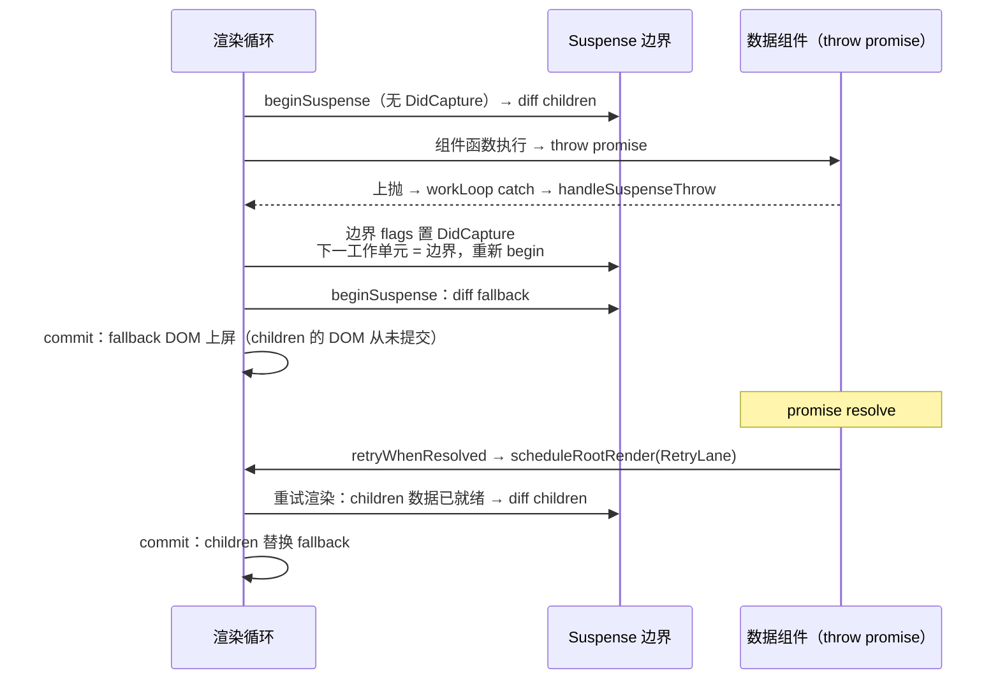
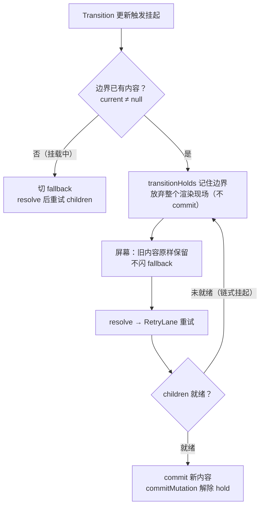

# 11 - Suspense 与并发闭环

> 对应大纲篇 11（应用层 · 精讲） | 预计时间：90 分钟
> 面试可答：Suspense = 组件 throw promise → 父边界捕获 → 展示 fallback → promise resolve 后以低优先级重新调度渲染，两阶段提交保证不闪 fallback。
> 前置：[10 - 优先级与并发更新](./10-优先级与并发更新.md)（lane 与 Transition）；本篇是并发主线（09~11）的收官篇

---

## 1. 本篇定位

一句话：**实现 Suspense 简化版——throw promise 的捕获边界、fallback 切换、resolve 后低优先级重试，以及 Transition 防闪——把调度、优先级、副作用串成完整的并发闭环。**

| 产出                                        | 位置                     | 说明                                                          |
| ------------------------------------------- | ------------------------ | ------------------------------------------------------------- |
| Suspense 边界（捕获 → fallback → 重试）      | `src/suspense/index.ts`  | 本篇新建，对照 `ReactFiberThrow.js`                            |
| beginWork 的 Suspense 分支                   | `src/fiber/beginWork.ts` | `<Suspense>` 的 type 识别与 fallback/children 切换             |
| workLoop 的 catch 接线                       | `src/fiber/workLoop.ts`  | promise 上抛在渲染循环被边界接住（篇 09 全量块已含）           |
| Transition 防闪 + 提交后解除保持             | `src/commit/index.ts`    | 挂起中「保持旧 UI」与提交成功后的 hold 清理                    |

完成本篇，mini-react 的 v4 里程碑（优先级与并发，含 Suspense）交付。

---

## 2. throw promise：Suspense 的全部机制就是「抛」与「接」

先立数据形态。`<Suspense fallback={…}>{children}</Suspense>` 的编译产物里，`type` 就是一个带 `$$typeof` 的对象——与 memo/Provider 同款。`src/jsx/index.ts` 扩展（本篇接线段）：

```ts
// 元素协议符号：memo / context / provider / suspense 的身份标识（篇 06~11 接入）。
// 符号值与真实源码 ReactSymbols.js 同款
export const REACT_MEMO_TYPE = Symbol.for('react.memo')
export const REACT_CONTEXT_TYPE = Symbol.for('react.context')
export const REACT_PROVIDER_TYPE = Symbol.for('react.provider')
export const REACT_SUSPENSE_TYPE = Symbol.for('react.suspense')
```

```ts
// Suspense 边界元素的 type 形态（篇 11）：<Suspense> 的编译产物 type 就是
// 这个对象，beginWork 按 $$typeof 识别后进入边界渲染逻辑
export type SuspenseType = {
  $$typeof: typeof REACT_SUSPENSE_TYPE
}

// 非宿主元素形态合集（单行声明：保证 .ts 与文档 md 内嵌块的 oxfmt 结果一致）
export type NonHostElement =
  | ComponentType
  | MemoType
  | ProviderType<unknown>
  | SuspenseType
```

数据获取方的约定：**数据没好就 throw 一个 promise**。渲染子组件时这个 promise 会沿调用栈一路抛到渲染循环——`src/suspense/index.ts` 全量落地（完整源码，与仓库文件逐字一致）：

```ts
// Suspense 边界：throw promise 捕获 → fallback → resolve 后低优先级重试
// 真实源码对照：packages/react-reconciler/src/ReactFiberThrow.js（throwException）
import type { Fiber, FiberRoot } from '../fiber'
import type { ElementType, SuspenseType } from '../jsx'
import { REACT_SUSPENSE_TYPE } from '../jsx'
import {
  RetryLane,
  TransitionLanes,
  includesSomeLane
} from '../scheduler/lanes'
import {
  getRenderLanes,
  getWorkInProgressRoot,
  scheduleRootRender
} from '../fiber/workLoop'

// <Suspense> 的元素 type：beginWork 按 $$typeof 识别（与 memo/Provider 同款）
export const Suspense: SuspenseType = { $$typeof: REACT_SUSPENSE_TYPE }

// 「本次渲染捕获了 promise」标记：数值对齐 ReactFiberFlags.js 的 DidCapture。
// 真实源码还有 ShouldCapture（边界自身 beginWork 期间挂起），教学版只走
// 子树挂起路径，统一用 DidCapture
export const DidCapture = 0b10000000

const isThenable = (value: unknown): value is Promise<unknown> => {
  return (
    typeof value === 'object' &&
    value !== null &&
    typeof (value as Promise<unknown>).then === 'function'
  )
}

export const isSuspenseType = (
  type: ElementType | null
): type is SuspenseType => {
  return (
    typeof type === 'object' &&
    type !== null &&
    type.$$typeof === REACT_SUSPENSE_TYPE
  )
}

// Transition 挂起的边界集合：resolve 前保持旧 UI（防闪 fallback）。
// 挂在「current 树的边界 fiber」上——它跨渲染稳定；渲染提交成功后解除
const transitionHolds = new WeakSet<Fiber>()

// Suspense 边界提交成功：解除防闪保持（commitMutation 遍历时调用）
export const releaseSuspenseHold = (currentBoundary: Fiber): void => {
  transitionHolds.delete(currentBoundary)
}

// 从抛出点沿 return 向上找最近的 Suspense 边界
// （真实源码 throwException 内的 do-while 向上遍历同款）
export const findNearestSuspenseBoundary = (fiber: Fiber): Fiber | null => {
  let node: Fiber | null = fiber.return
  while (node !== null) {
    if (isSuspenseType(node.type)) {
      return node
    }
    node = node.return
  }
  return null
}

// promise 落定后以 RetryLane 重新调度渲染（篇 10 优先级系统的 Retry 档）。
// 真实源码把 retryLane 标到边界 fiber 的 lanes 上再 ensureRootIsScheduled；
// 教学版从根重渲，简化但闭环等价
const retryWhenResolved = (
  promise: Promise<unknown>,
  root: FiberRoot
): void => {
  const retry = (): FiberRoot => {
    scheduleRootRender(root, RetryLane)
    return root
  }
  promise.then(retry)
}

// 挂起处理：决定「切 fallback 继续渲染」还是「放弃渲染保持旧 UI」。
// 返回下一个工作单元（边界 fiber，重新 begin 后改出 fallback）；
// 返回 null 表示放弃整个渲染现场（workLoop 据此中止本次渲染）
export const suspendBoundary = (
  boundary: Fiber,
  promise: Promise<unknown>
): Fiber | null => {
  const root = getWorkInProgressRoot()
  if (root === null) {
    // 渲染不在进行中（理论不可达：挂起只发生在渲染阶段）
    return null
  }
  const lanes = getRenderLanes()
  const current = boundary.alternate
  if (current !== null && transitionHolds.has(current)) {
    // 重试仍挂起（多资源链式加载）：继续 hold，等最后一个 resolve
    retryWhenResolved(promise, root)
    return null
  }
  if (current !== null && includesSomeLane(lanes, TransitionLanes)) {
    // Transition 防闪 fallback：更新的是「已有内容」——保持旧 UI，
    // 丢弃本次渲染现场（不提交任何东西），resolve 后重试
    transitionHolds.add(current)
    retryWhenResolved(promise, root)
    return null
  }
  // 挂载中的边界（或非 Transition 更新）：立即切 fallback，
  // promise resolve 后以 RetryLane 重试 children
  boundary.flags |= DidCapture
  retryWhenResolved(promise, root)
  return boundary
}

// workLoop 的 catch 入口：非 promise 的异常原样上抛；
// 没有边界可接也原样上抛（真实源码 throwException 同款分流）
export const handleSuspenseThrow = (
  sourceFiber: Fiber,
  thrownValue: unknown
): Fiber | null => {
  if (!isThenable(thrownValue)) {
    throw thrownValue
  }
  const boundary = findNearestSuspenseBoundary(sourceFiber)
  if (boundary === null) {
    throw thrownValue
  }
  return suspendBoundary(boundary, thrownValue)
}
```

`handleSuspenseThrow` 是 workLoop catch 的唯一入口，三条分流值得背下来：

| 抛出的东西             | 有边界可接？ | 处理                                     |
| ---------------------- | ------------ | ---------------------------------------- |
| promise                | ✅           | 进入 `suspendBoundary`（§3/§5 两条路径） |
| promise                | ❌           | 原样上抛（没有边界兜底的挂起 = 崩溃）    |
| 其他异常（真错误）     | ——           | 原样上抛（error boundary 不在本系列范围） |

---

## 3. fallback 与 children：DidCapture 驱动的边界渲染

边界 fiber 的 beginWork 分支（`src/fiber/beginWork.ts`，`beginFunctionComponent` 里 type 识别后进入）：

```ts
// Suspense 边界（篇 11）：<Suspense> 的 type 是 Suspense 对象，fiber 复用
// FunctionComponent 标签。DidCapture 表示本次渲染捕获了 promise——
// 改出 fallback；正常路径渲染 children（真实源码 updateSuspenseComponent）
const beginSuspense = (workInProgress: Fiber): Fiber | null => {
  const props = workInProgress.pendingProps as Props
  if ((workInProgress.flags & DidCapture) !== 0) {
    workInProgress.flags &= ~DidCapture
    reconcileChildren(workInProgress, props.fallback)
  } else {
    reconcileChildren(workInProgress, props.children)
  }
  workInProgress.memoizedProps = workInProgress.pendingProps
  return workInProgress.child
}
```

完整链路一张图（挂载路径）：



三个设计点：

- **fallback 的切换走的是普通 diff**：边界 fiber 复用 FunctionComponent 标签（没有自己的 stateNode），fallback/children 都是普通 element——首次挂起时 children 的 DOM 尚未创建（render 阶段只标记），fallback diff 出 Placement，commit 自然上屏；重试时 children 替换 fallback 走 ChildDeletion + Placement。**不需要为 Suspense 写任何特殊的 DOM 提交逻辑**——篇 05 的 commit 完全复用
- **`DidCapture` 用完即清**：重试渲染会从 current 重新克隆边界 fiber（flags 归零），如果那时数据还没好，会再次 throw → 再次置位——天然支持「多资源链式挂起」
- **resolve 后走 `RetryLane`**：这就是篇 10 优先级系统的 Retry 档——重试是低优先级渲染，期间任何用户输入（SyncLane）都能插队，`getNextLanes` 保证输入永远先被处理

---

## 4. workLoop 的 catch：渲染循环的接入点

篇 09 的 workLoop 全量块里有一段当时按下不表的 `stepUnitOfWork`——本篇引爆（`src/fiber/workLoop.ts`）：

```ts
// 单步执行：promise 上抛在这里被最近的 Suspense 边界接住（篇 11）。
// 返回下一个工作单元；Transition 挂起放弃渲染时返回 null 并置 renderDidSuspend
const stepUnitOfWork = (fiber: Fiber): Fiber | null => {
  try {
    return performUnitOfWork(fiber)
  } catch (thrownValue) {
    const next = handleSuspenseThrow(fiber, thrownValue)
    if (next === null) {
      // Transition 防闪：放弃本次渲染现场——旧 UI 保持，等 promise resolve
      renderDidSuspend = true
      return null
    }
    // 回到边界重新 begin：本次渲染改出 fallback
    return next
  }
}
```

接入方式极其克制：try/catch 包住 `performUnitOfWork` 的**一次调用**。组件函数 throw 的 promise 在这里被截获，返回值决定下一步：

- 返回边界 fiber → `workInProgress` 指回边界，下一次迭代重新 begin 它（改出 fallback）——渲染**继续**，本次 commit 照常发生
- 返回 null（Transition 路径，§5）→ 置 `renderDidSuspend`，切片循环因 `workInProgress === null` 退出，`performConcurrentWorkOnRoot` 看到挂起标记后**不 commit**、把现场出账——渲染**放弃**

---

## 5. Transition + Suspense：防闪 fallback 的实现

「更新已有内容」时挂起，直接切 fallback 会造成内容闪烁（旧内容消失 → fallback → 新内容）。Transition 的语义是「**保持旧 UI 等 new UI**」。实现就是 `suspendBoundary` 的第二条路径：



三个实现细节：

- **hold 记在 current 树的边界 fiber 上**（`WeakSet<Fiber>`）：渲染可以中断、重启、丢弃，current 树的 fiber 跨渲染稳定，是唯一可靠的记忆载体
- **「放弃渲染现场」= 什么都不提交**：`renderDidSuspend` 让 `performConcurrentWorkOnRoot` 走 lane 出账分支而不是 `commitRoot`——旧 UI 之所以能保持，不是因为「复制了旧内容」，而是因为**这次渲染的任何成果都没碰 DOM**（两阶段提交的红利，篇 05）
- **提交成功后解除 hold**（`src/commit/index.ts`，本篇接线段）：

```ts
    // 函数组件：把本次渲染待执行的 effect 分拣进 layout / passive 两个队列
    // （layout 由 commitRoot 同步 flush，passive 由调度器异步 flush——篇 07/09）
    if (fiber.tag === FunctionComponent) {
      collectFiberEffects(fiber)
      // Suspense 边界提交成功：解除 Transition 挂起的防闪保持（篇 11）
      if (isSuspenseType(fiber.type) && fiber.alternate !== null) {
        releaseSuspenseHold(fiber.alternate)
      }
    }
```

> 💡 为什么防闪不做成「fallback 延迟 N ms 再显示」（所谓 loading delay）？延迟只是把闪烁往后挪，且延迟期内容易出现「假死感」；Transition 是**语义级**的答案——明确告诉渲染器「这次更新可以等」，渲染器据此决定提交策略。两者的组合（Transition + Suspense 的 `fallback`）才是真实 React 处理慢网络的完整方案。

---

## 6. React 19 的一提：sibling pre-warming

真实 React 19 对 Suspense 有一处值得知道的改进：**sibling pre-warming（兄弟预热）**。当边界内某个子树挂起、显示 fallback 时，React 会**继续渲染同一 Suspense 边界内未挂起的兄弟子树**并完成提交——而不是让整个边界的所有兄弟一起陪等。在「侧边栏就绪、主内容慢」这类布局里，就绪的部分先上屏。它建立在 19 的 updateQueue 重构（`ReactFiberConcurrentUpdates.js` 的并发更新队列）之上，mini-react 不实现——面试能说出「19 的边界内兄弟不再被一个挂起连坐」即可，深入入口见篇 13 的源码地图。

---

## 7. 源码对照：mini vs ReactFiberThrow

| mini-react                     | 真实源码（19.x main，均已实核）                                                 | 差距说明                                                                    |
| ------------------------------ | -------------------------------------------------------------------------------- | ---------------------------------------------------------------------------- |
| `handleSuspenseThrow` 三分流   | `ReactFiberThrow.js` 的 `throwException`                                        | 真实版还处理 lazy 组件、错误边界（createClassErrorBoundary 路径）、lane 标记 |
| 沿 return 找边界               | `throwException` 内的 do-while 向上遍历                                         | 同款                                                                        |
| `DidCapture` 置位边界          | `markSuspenseBoundaryShouldCapture`（`suspenseBoundary.flags \|= DidCapture`）   | 真实版边界由 wrapper + Offscreen 两个 fiber 组成，教学版单 fiber 同构        |
| 重试走 `RetryLane`             | retryLane 标到边界 fiber 的 lanes（`claimRetryLane`）                            | 教学版从根重渲，真实版重渲从边界开始                                        |
| 防闪 hold                      | Offscreen 树 + `SuspenseState`（真实版把旧子树保存在 Offscreen fiber 里）        | 教学版「不提交即保持」，语义等价、成本更低                                  |
| `beginSuspense` 双分支         | `ReactFiberBeginWork.js` 的 `updateSuspenseComponent`                           | 真实版区分 hydration、dehydrated fallback、活动 Offscreen 等十余种情况       |

阅读路线：`ReactFiberThrow.js` 只有几百行，先搜 `function throwException` 看 promise 分支（`isThenable` 判定与向上找边界），再对照 `markSuspenseBoundaryShouldCapture`——「抛与接」的真实形态和本篇一一对应。

---

## 8. 练习：Suspense + 模拟异步加载「快/慢网络」两种表现

**要求**：在临时入口（`playground/mini.html`，同前几篇约定）用 mini-react 写一个 `<Suspense fallback={加载占位}>` 包裹的资料卡组件：数据用「可配置延迟的 promise」模拟（快网络 0ms、慢网络 2000ms，各配一个按钮触发重载）。断言三种表现：快网络几乎看不到 fallback；慢网络先出 fallback、resolve 后内容上屏；内容**已存在**时用 `startTransition` 触发慢网络重载，屏幕保持旧内容、不闪 fallback（可 `console.log` 记录 fallback 出现/消失的时间点辅助断言）。

**提示**：官方对照组直接看 `playground/main.tsx`——本篇已把它升级出「快网络/慢网络」双按钮 + Suspense 的完整版（官方 react 渲染），两侧行为应一致。数据组件的写法就是「数据没好就 throw promise」：`if (!resolved) throw promise; return <div>{data}</div>`——注意 promise 要**缓存复用**（模块级变量存 promise 与结果），否则重试渲染会再次 throw 一个从未 resolve 的新 promise。想验证防闪，重点观察 Transition 版的 fallback 是否从未出现在 DOM 里（在 `beginSuspense` 的 fallback 分支加日志最直观）。

**预期效果**：三种表现全部符合预期且与官方 React 版一致；能指着 `suspendBoundary` 的两条路径说出「为什么挂载要立即切 fallback、更新要 hold 旧 UI」；能从 `commitMutation` 的 hold 清理讲出「重试成功后防闪保持如何解除」；能说清「两阶段提交为什么是防闪的物理基础」——放弃的渲染从未进过 mutation，DOM 自然无痕。

---

## 9. 面试问答

**Q1：Suspense 的实现原理是什么？**

> 数据组件在数据未就绪时 throw 一个 promise；渲染循环捕获后沿 fiber 的 return 链向上找最近的 Suspense 边界，给边界置 DidCapture 标记；边界重新渲染时改出 fallback 并提交；promise resolve 后以低优先级（RetryLane）重新调度渲染，此时数据就绪、children 正常渲染并替换 fallback。对 commit 来说 fallback 和 children 都只是普通的 flags 差异——Suspense 没有为提交阶段增加任何新机制，全部工作发生在 render 阶段的捕获与重调度。 _（追问见 Q1-1）_
>
> **Q1-1：为什么 Suspense 挂起不会把屏幕搞出半成品？**
> 挂起发生在 render 阶段（只操作内存里的 fiber 树），此刻 current 树与 DOM 完好；切 fallback 的那次提交是完整的两阶段提交，重试同理。「放弃渲染」的路径则什么都不提交——两阶段架构（render 可中断可丢弃、commit 原子）是 Suspense 各种表现不闪不裂的物理基础。

**Q2：Transition 和 Suspense 怎么协作防闪 fallback？什么时候 fallback 仍然会出现？**

> 更新已有内容时（边界 current 非空）走 Transition 挂起，渲染器把边界记入防闪保持并**放弃整个渲染现场**——不提交任何东西，旧 UI 原样保留，直到 resolve 后以 RetryLane 重试成功才提交新内容并解除保持。fallback 仍然会出现的情况：边界**首次挂载**（current 为空，没有旧 UI 可保持，立即切 fallback 是唯一合理表现），以及非 Transition 上下文里的普通更新挂起。一句话：防闪的本质是「有旧内容且这次更新愿意等」。 _（追问见 Q2-1）_
>
> **Q2-1：多个资源链式挂起怎么办？比如重试后第二个组件又 throw 了？**
> 边界的防闪保持必须等**所有**资源就绪才解除：重试渲染中若仍有组件 throw，挂起处理走「继续 hold」分支、再次放弃现场并重新等待，已 resolve 的资源结果被缓存（promise 复用），最后一个 resolve 后一次提交。mini-react 用 WeakSet 记 hold + 重试仍挂起分支实现了这个闭环；真实 React 的粒度更细（每个 Offscreen 子树独立挂起与预热，即 19 的 sibling pre-warming）。

**Q3：Suspense 和 error boundary 有什么区别？边界外没有 Suspense 会怎样？**

> 两者都是「子树出问题 → 向上找边界」的捕获模型，但捕获物与恢复方式不同：Suspense 捕获的是 promise（可预期的等待），恢复方式是 fallback + resolve 后重试，重试**不卸载**已有状态；error boundary 捕获的是渲染错误（异常），恢复方式是渲染降级 UI，出错的子树被卸载重建。本系列的 throw 分流里两者泾渭分明：isThenable 为真走 Suspense 路径，否则原样上抛。边界外没有 Suspense 时 promise 会一路抛到渲染入口，渲染失败——真实 React 直接报错，这也是「throw 的必须是可接住的」这一约束的含义：用 Suspense 就必须画好边界。 _（追问见 Q3-1）_
>
> **Q3-1：为什么 Suspense 选择「throw」这么「歪」的机制，而不是像 Vue 的 Suspense 那样注册异步依赖？**
> throw 是 JS 里唯一能从任意调用深度**同步打断**组件渲染的手段——数据组件可能在 hooks 里、memo 里、嵌套很深的辅助函数里发现数据没好，promise 作为 throw 值天然携带「好了叫我」的恢复信息，配合 fiber 的 return 链就能找到边界。注册式 API 则要求每个异步读取点显式传递上下文。这是「组件是纯函数、渲染可中断」架构下的自然选择。

---

## 10. 本篇自检

- [ ] 能画出「throw → catch → DidCapture → fallback → RetryLane 重试」的完整时序
- [ ] beginSuspense 的双分支（DidCapture / 正常）与「DidCapture 用完即清」能脱稿讲
- [ ] 防闪的三要素（current 非空 + Transition + hold 到提交成功）能配代码说出落点
- [ ] 「放弃渲染现场 = 什么都不提交」与两阶段提交的关系能讲清
- [ ] 快/慢网络两版练习与官方对照组行为一致
- [ ] sibling pre-warming 一句话能答（19：边界内兄弟不再被挂起连坐）

---

## 11. 参考资料

- [ReactFiberThrow.js（facebook/react main）](https://github.com/facebook/react/blob/main/packages/react-reconciler/src/ReactFiberThrow.js) —— throwException / markSuspenseBoundaryShouldCapture / DidCapture
- [ReactFiberFlags.js（facebook/react main）](https://github.com/facebook/react/blob/main/packages/react-reconciler/src/ReactFiberFlags.js) —— DidCapture 等位标记定义
- [React 官方文档 · Suspense](https://react.dev/reference/react/Suspense) —— 本篇 API 的官方参考
- [React 官方文档 · 与 Suspense 搭配使用](https://react.dev/reference/react/use#suspense) —— `use()` 与数据读取的演进方向（篇 13 索引）
- [React 19.3 发布公告（2026-09-09，本系列版本断言基准）](https://react.dev/blog/2026/09/09/react-19-3)
- 上一篇：[10 - 优先级与并发更新](./10-优先级与并发更新.md) ｜ 下一篇：12 - 测试与性能验证（写作中，发布后回链）
