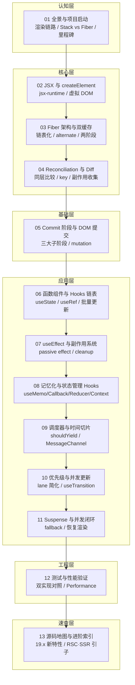

# 《手写 React 核心库》学习大纲（mini-react）

> **主题定级**：架构/学科类 —— Fiber 架构、调度模型、Hooks 机制需要心智模型与原理拆解，规格 13 篇；主线核心精讲（含 React 19 真实源码对照），SSR/RSC/DevTools 等非主线内容一律引子化。
>
> **版本基线**：React 19.3（2026-09-09 发布，对照 [React Blog](https://react.dev/blog/2026/09/09/react-19-3)）；源码对照路径以 `facebook/react` 19.x 分支为准，写作时逐篇核对。
>
> **参考路线**：主线节奏参照经典 [Build Your Own React（Didact）](https://pomb.us/build-your-own-react/)，但每个关键节点对照真实源码升级命名与设计，不停留在 didact 简化版。

---

## 1. 定位

| 项目     | 内容                                                                                                                                                    |
| -------- | ------------------------------------------------------------------------------------------------------------------------------------------------------- |
| 目标读者 | 资深前端/全栈，有 React 日常使用经验（本仓库 [hooks 系列](../hooks/readme.md) 先修或等价水平）                                                          |
| 前置要求 | React 使用经验（JSX/组件/Hooks）；TypeScript strict 基础；闭包、链表、树遍历等数据结构；Bun + Vite 工程基础                                             |
| 学习目标 | 从零手写一个支持 JSX、函数组件、全套核心 Hooks、Reconciliation、并发调度（时间切片/优先级）、Suspense 与 Transition 的 mini-react，并通过双实现对照测试 |
| 面试目标 | 能白板级回答：Fiber 架构与双缓存、可中断渲染、Diff 策略、Hooks 链表与调用规则、批量更新、并发特性原理；能画出从 setState 到屏幕更新的完整链路           |

**规格声明**（写作与审查共用契约）：

- 深度档：**精讲**（01~11，全要素 + 源码对照）、**速过**（12，速查形态 + 一段式练习）、**引子**（13，链接索引为主）
- 对比板块全系列 2 处：篇 01（渲染模型对比）、篇 12（mini-react vs 真实 React 差距清单）
- 实现语言 TypeScript（strict），技术栈遵循 [agents.md §5.6](../../../../agents.md)（Bun + Vite + oxlint + oxfmt）

---

## 2. 学习路径图



---

## 3. 篇目规划

| 序号 | 篇名                        | 层     | 深度档 | 一句话定位                                                                       | 核心知识点                                                                                                                                                                     | 前置 |
| ---- | --------------------------- | ------ | ------ | -------------------------------------------------------------------------------- | ------------------------------------------------------------------------------------------------------------------------------------------------------------------------------ | ---- |
| 01   | 全景与项目启动              | 认知层 | 精讲   | 建立「从 JSX 到屏幕」的全景图，划定 mini-react 边界并搭好工程                    | 渲染完整链路；Stack vs Fiber 重写动机；mini-react 功能边界与里程碑；Bun+TS+Vite 脚手架                                                                                         | 无   |
| 02   | JSX 与 createElement        | 核心层 | 精讲   | 看透 JSX 编译产物，实现第一版递归渲染（后续被 Fiber 重构的起点）                 | automatic runtime（jsx-runtime）编译产物；手写 createElement；虚拟 DOM 结构；递归 render v1                                                                                    | 01   |
| 03   | Fiber 架构与双缓存树        | 核心层 | 精讲   | 把递归渲染重构为可中断的 Fiber 循环，建立整套体系的核心数据结构                  | Fiber 节点字段设计（child/sibling/return/alternate）；双缓存 current/workInProgress；performUnitOfWork + workLoop 雏形；render/commit 两阶段划分                               | 02   |
| 04   | Reconciliation 与 Diff 算法 | 核心层 | 精讲   | 实现同层比较与节点复用，理解 key 与副作用收集                                    | reconcileChildren；三大 Diff 策略（同层、type 判断、key）；flags（Placement/Update/Deletion）；deletions 数组                                                                  | 03   |
| 05   | Commit 阶段与 DOM 提交      | 基础层 | 精讲   | 把 flags 真正落到 DOM，打通「更新 → 屏幕」的完整闭环                             | commitRoot；mutation 阶段；函数组件 Fiber 无 stateNode 的处理；真实源码三大子阶段（beforeMutation/mutation/layout）对照                                                        | 04   |
| 06   | 函数组件与 Hooks 链表       | 应用层 | 精讲   | 实现函数组件渲染与 useState/useRef，解释 Hooks 全部调用规则的由来                | 函数组件 Fiber；hooks 链表（memoizedState 按序索引）；useState 与触发更新；批量更新 batching；useRef 跨渲染持久化                                                              | 05   |
| 07   | useEffect 与副作用系统      | 应用层 | 精讲   | 实现 useEffect/useLayoutEffect，掌握副作用调度与清理时机                         | 依赖数组比较；passive effect 异步调度；cleanup 时机；与 useLayoutEffect 同步执行的差异；StrictMode 双执行                                                                      | 06   |
| 08   | 记忆化与状态管理 Hooks      | 应用层 | 精讲   | 补齐 useMemo/useCallback/useReducer/useContext，覆盖性能优化与全局状态两大面试区 | useMemo/useCallback 缓存本质；useReducer 与 update 队列；Context 依赖收集（vs 旧版递归查找）；React.memo 配合原理                                                              | 07   |
| 09   | 调度器与时间切片            | 应用层 | 精讲   | 把 workLoop 升级为真调度器，实现时间切片与可中断渲染                             | shouldYield 时间切片；MessageChannel 宏任务调度；饿死超时；对照 Scheduler 包的任务队列模型                                                                                     | 08   |
| 10   | 优先级与并发更新            | 应用层 | 精讲   | 引入优先级模型，实现 lane 简化版与 useTransition/useDeferredValue                | lane 位运算优先级（对照 ReactFiberLane）；更新按优先级插入与跳过；可中断恢复；useTransition/useDeferredValue 实现；自动 batching 全貌                                          | 09   |
| 11   | Suspense 与并发闭环         | 应用层 | 精讲   | 实现 Suspense 简化版，把调度、优先级、副作用串成并发闭环                         | Suspense fallback 与恢复渲染；捕获 promise 再调度；与 Transition 协作；React 19 Suspense 改进（sibling pre-warming）一提                                                       | 10   |
| 12   | 测试与性能验证              | 工程层 | 速过   | 用同一测试用例双实现对照，验证 mini-react 行为与时间切片效果                     | 双实现对照测试（react vs mini-react 跑同一用例）；Performance 面板验证切片；常见 bug 排查清单（无限循环/状态丢失/effect 双跑）；差距清单                                       | 11   |
| 13   | 源码地图与进阶索引          | 速查层 | 引子   | 给出 mini-react → 真实源码的阅读地图，索引 19.x 新特性与 RSC/SSR 方向            | packages 目录职责地图；ReactFiberWorkLoop/ReactFiberHooks/ReactChildFiber 阅读顺序；Actions/useActionState/useOptimistic/Activity/View Transitions 索引；RSC·SSR·Compiler 延伸 | 12   |

> 💡 **层级裁剪说明**：本主题对六层模型做了裁剪映射——基础层在此指「渲染落地的底线闭环」（commit）；09~11 的调度/并发/Suspense 原理密度等同核心层，归入应用层取「按框架能力域逐个击破」之意。层级标签不影响学习顺序，依赖链即阅读顺序。

> **⭐ 最小学习路径**（赶时间 5 篇，覆盖 Fiber/Diff/Commit/Hooks 高频原理）：**01 → 03 → 04 → 05 → 06**（02 的 JSX 基础较轻，可按速过节奏后补）
> 并发类追问（时间切片 / lane 优先级）需再补 **09 → 10**；「能动手改造/调试 React 项目」再补 **02、07、12**。

---

## 4. 各篇要点与练习

### 01 全景与项目启动（精讲）

**面试可答**：React 渲染 = render 阶段（算差异，可中断）+ commit 阶段（同步落 DOM）；Fiber 重写是为了可中断与优先级。

- 从 `<App/>` 到像素：JSX → element 树 → Fiber 树 → DOM 的全链路图
- ⚖️ **对比板块 1**：Stack Reconciler（递归不可中断）vs Fiber（链表 + 循环）vs 细粒度响应式（Vue/Solid 一句定位），说明 React 选型权衡
- mini-react 里程碑图：v0 递归渲染 → v1 Fiber → v2 Hooks → v3 调度 → v4 优先级与并发（含 Suspense）
- 脚手架：Bun + TS strict + Vite + oxlint/oxfmt，目录 `jsx/ fiber/ reconcile/ commit/ hooks/ scheduler/`
- **练习**：跑通脚手架，用官方 react 渲染同一 Demo 作为「对照组基准」

### 02 JSX 与 createElement（精讲）

**面试可答**：JSX 是语法糖，编译产物是描述 UI 的对象树；虚拟 DOM 是「用对象描述 UI、diff 后最小化操作真实 DOM」。

- Vite 下 automatic runtime 产物：`jsx(type, props, key)`；手写 createElement 与其等价
- children 的多种形态（单元素/数组/文本/表达式）
- 递归 render v1：element 树直接生成 DOM（明知会被 03 重构，作为演进起点）
- 源码对照：`packages/react/src/jsx/ReactJSXElement.js`
- **练习**：不装任何依赖，手写 createElement + 递归 render 渲染一个嵌套页面

### 03 Fiber 架构与双缓存树（精讲）

**面试可答**：Fiber 是链表化的虚拟 DOM 节点 + 工作单元；双缓存让「正在构建的树」和「正在显示的树」互不干扰。

- 递归为什么不可中断 → 链表化后「做完一个单元看一眼该不该让路」
- Fiber 字段设计：type/key/stateNode/pendingProps/memoizedState/alternate/flags
- 双缓存：current 树与 workInProgress 树，alternate 互指，commit 后交换
- performUnitOfWork：beginWork（向下）→ completeUnitOfWork（向右向上）循环
- 源码对照：`packages/react-reconciler/src/ReactFiber.js`、`ReactFiberBeginWork.js`
- **练习**：把 02 的递归 render 重构为 fiber workLoop（此时仍同步执行）

### 04 Reconciliation 与 Diff 算法（精讲）

**面试可答**：Diff 三大策略——同层比较、type 不同即重建、key 标识同级复用；O(n) 的来源。

- reconcileChildren：新旧 children（单个/数组/文本）的复用判定
- flags 标记副作用：Placement / Update / Deletion；deletions 数组收集待删节点
- key 的正确用法与 index 作 key 的失效场景（用实现层解释，不讲烂梗）
- 源码对照：`packages/react-reconciler/src/ReactChildFiber.js`
- **练习**：实现带 key 的列表 diff，构造「移动/插入/删除」三种用例验证复用

### 05 Commit 阶段与 DOM 提交（精讲）

**面试可答**：commit 同步执行分三段——beforeMutation 读快照、mutation 改 DOM、layout 跑 useLayoutEffect；render 可中断但 commit 不可。

- commitRoot：按 flags 分派 DOM 操作；父先子后 vs effect 列表顺序的坑
- HostComponent vs FunctionComponent 的 commit 分支（函数组件此时只是占位）
- 真实源码对照：`ReactFiberWorkLoop.js` 的 commitRootImpl 三大子阶段 + passive effects 分离（此处只对照结构，07 才用到 passive）
- **练习**：提交一个完整计数器页面；手动打断 render 验证「界面不出半成品」

### 06 函数组件与 Hooks 链表（精讲）

**面试可答**：Hooks 存在 Fiber 的 memoizedState 链表上，按调用顺序索引——这就是「不能放条件/循环里」的根本原因。

- 函数组件渲染：fiber 无 stateNode，调用函数取 children
- hooks 链表：hook 对象（memoizedState/queue/next）；mount 与 update 两条路径
- useState：dispatch 更新 → 入队 → 根节点调度 re-render；函数式更新与闭包陷阱的实现层解释
- 批量更新：一次事件里多次 setState 只 render 一次（自动 batching）
- useRef：跨渲染持久化的最小样本（理解「变量存在 fiber 上」）
- 源码对照：`packages/react-reconciler/src/ReactFiberHooks.js`
- **练习**：实现 useState + useRef；写一个能复现「闭包旧值」再修复的用例

### 07 useEffect 与副作用系统（精讲）

**面试可答**：useEffect 在 commit 后异步（passive）执行，useLayoutEffect 在 layout 阶段同步执行——时机差异是「会不会闪烁」的根源。

- 依赖比较：浅比较 + Object.is；deps 变化时先跑 cleanup 再跑 effect
- passive effect 队列：commit 完成后由调度器异步 flush（为 09 调度器埋点）
- 与 useLayoutEffect 对照实现：同一同步管道、不同调度时机
- StrictMode 双执行（mount → unmount → mount）在实现层为什么成立
- 源码对照：`ReactFiberHooks.js` 的 pushEffect / flushPassiveEffects
- **练习**：实现 useEffect/useLayoutEffect；做一个「布局测量防闪烁」用例对比两者

### 08 记忆化与状态管理 Hooks（精讲）

**面试可答**：useMemo/useCallback 缓存的是 fiber 链表节点上的旧值，依赖不变直接复用；Context 更新走 fiber.dependencies 登记 + propagateContextChange 树上标记，不是精确依赖收集、也不是全树暴力重渲。

- useMemo/useCallback：本质是「带依赖的缓存 hook」，一个存值一个存函数
- useReducer：update 队列与循环 dispatch；useState 是它的特例（收拢 06 的实现）
- useContext：读 context 时在 fiber.dependencies 登记依赖；value 变更走 propagateContextChange 树上标记（eager context propagation，React 18 起）——mini-react 先实现简化版，成文时明确区分自研简化与真实模型，勿写成 Vue 式精确收集
- React.memo 为什么必须配合稳定引用——用自己实现的 useCallback 验证
- **练习**：用自研 Hooks 重写 [hooks 系列](../hooks/readme.md) 工具库中的 useToggle/useDebounce/useFetch

### 09 调度器与时间切片（精讲）

**面试可答**：时间切片 = 每帧切片内干活，`shouldYield` 到期就让出主线程，用宏任务（MessageChannel）排下一片；长任务不再阻塞输入。

- workLoop 升级：每完成一个 unitOfWork 检查 `deadline → shouldYield`
- MessageChannel vs setTimeout：为什么宏任务优先、嵌套 setTimeout 被 4ms 节流的坑
- 饿死保护：过期任务强制立即执行（expiredWork 思路）
- 源码对照：`packages/scheduler/src/forks/Scheduler.js` 的 task queue 与 `shouldYieldToHost`（导出为 `unstable_shouldYield`；ReactFiberWorkLoop 内的本地 `shouldYield` 即包装它，在 workLoop 循环中调用）
- **练习**：渲染 5000 节点列表，Performance 面板对比 v1（同步）与 v2（切片）的 Long Task

### 10 优先级与并发更新（精讲）

**面试可答**：lane 是位掩码优先级，高低优先级更新可插队且低优先级不丢；useTransition 把更新标为低优先级，让输入响应不被大计算阻塞。

- lane 简化版：位掩码定义优先级档位；对照 `ReactFiberLane.js` 真实模型
- 更新入队带优先级；高优先级插队 → 低优先级恢复继续（可中断渲染闭环）
- useTransition：isPending 状态 + 低优先级标记；useDeferredValue 的派生实现
- 自动 batching 全貌：微任务级合并（React 18+ 行为）在自己实现中的位置
- 官方 API 参考：[useTransition](https://react.dev/reference/react/useTransition) / [useDeferredValue](https://react.dev/reference/react/useDeferredValue)
- **练习**：实现 useTransition，构造「输入框 + 大列表过滤」用例，对比开启前后输入延迟

### 11 Suspense 与并发闭环（精讲）

**面试可答**：Suspense = 组件 throw promise → 父边界捕获 → 展示 fallback → promise resolve 后以低优先级重新调度渲染，两阶段提交保证不闪 fallback。

- 简化实现：throw promise 的捕获边界；fallback 与 children 的切换
- resolve 后重新调度：与 10 的优先级系统衔接
- Transition + Suspense 协作：更新已有内容时「保持旧 UI 等 new UI」（useTransition 防闪 fallback）
- React 19 改进一提：sibling pre-warming（了解即可）
- 官方 API 参考：[Suspense](https://react.dev/reference/react/Suspense)
- **练习**：实现 Suspense + 模拟异步数据加载，构造「快速网络/慢速网络」两种表现

### 12 测试与性能验证（速过）

**速查形态**：本篇以清单和脚本为主，练习一段式。

- ⚖️ **对比板块 2**：mini-react vs 真实 React 19 差距清单（简化了什么：无 SSR/选择性 hydrate/完整 lane/Offscreen…；真实源码在哪补）
- 双实现对照测试：同一用例分别在 react 与 mini-react 下断言 DOM 结果一致（bun test）
- Performance 验证模板：Long Task / 切片间隔 / INP 观感
- 常见 bug 排查清单：无限循环、hook 顺序错乱、状态丢失、effect 双跑、白屏半成品
- **练习**：给 mini-react 补 5 个回归测试用例并全部通过

### 13 源码地图与进阶索引（引子）

**本档核心产物 = 链接索引**，每项一句话 + 官方链接，随用随查。

- 真实源码阅读地图：`react → shared → scheduler → react-reconciler → react-dom-bindings` 推荐阅读顺序与入口函数
- React 19.x 新特性索引：Actions / useActionState / useOptimistic / `use()` / Activity / View Transitions / React Compiler（[React Blog](https://react.dev/blog)）
- 延伸方向（不在本系列展开）：RSC、SSR 与流式渲染、选择性 Hydration、React DevTools 协议
- 全系列面试题汇总表（含追问链）

---

## 5. 练习递进线

| 阶段   | 篇目  | 练习难度线                                                                       |
| ------ | ----- | -------------------------------------------------------------------------------- |
| 打地基 | 01~02 | 跑脚手架 → 手写 createElement + 递归渲染（基础操作）                             |
| 建框架 | 03~05 | 递归改 fiber 循环 → 列表 diff → 完整提交闭环（组合应用，每篇一次重构）           |
| 装心脏 | 06~08 | hooks 链表 → 副作用系统 → 用自研 Hooks 重写 hooks 工具库（对照旧知识，实战整合） |
| 上并发 | 09~11 | 万级节点切片 → 优先级插队 → Suspense 闭环（性能与并发综合）                      |
| 交付   | 12    | 双实现对照测试全绿（验收）                                                       |

> 💡 每篇练习都直接写进 `src/` 对应模块，最终 `src/` 就是完整的 mini-react 项目——代码即作业，作业即交付物。

---

## 6. 面试覆盖图

| 高频面试点                                                        | 覆盖篇目 |
| ----------------------------------------------------------------- | -------- |
| JSX 本质 / 为什么需要虚拟 DOM                                     | 02       |
| Fiber 是什么 / 为什么可中断 / 双缓存机制                          | 03、09   |
| Diff 三大策略 / key 的作用与失效场景                              | 04       |
| render 与 commit 两阶段 / commit 三子阶段                         | 05       |
| Hooks 调用顺序限制的根本原因 / 链表存储                           | 06       |
| useEffect 执行时机 / cleanup / 闭包陷阱 / 与 useLayoutEffect 区别 | 07       |
| useMemo vs useCallback / Context 更新原理 / React.memo 配合       | 08       |
| 时间切片 / shouldYield / MessageChannel 调度                      | 09       |
| lane 优先级模型 / 并发更新 / 自动 batching                        | 10       |
| Suspense 原理 / Transition 防闪 fallback                          | 11       |
| 性能问题排查方法论（长任务/重渲染）                               | 12       |

---

## 7. 最终交付物：mini-react 项目

```
src/front/react/mini-react/
├── readme.md          # 本大纲
├── doc/               # 13 篇文档
│   ├── 01-全景与项目启动.md
│   ├── 02-JSX与createElement.md
│   ├── 03-Fiber架构与双缓存树.md
│   ├── 04-Reconciliation与Diff算法.md
│   ├── 05-Commit阶段与DOM提交.md
│   ├── 06-函数组件与Hooks链表.md
│   ├── 07-useEffect与副作用系统.md
│   ├── 08-记忆化与状态管理Hooks.md
│   ├── 09-调度器与时间切片.md
│   ├── 10-优先级与并发更新.md
│   ├── 11-Suspense与并发闭环.md
│   ├── 12-测试与性能验证.md
│   └── 13-源码地图与进阶索引.md
└── src/               # mini-react 源码，随篇递增
    ├── jsx/           # jsx-runtime / createElement        （篇 02）
    ├── fiber/         # fiber 结构 + beginWork/completeWork（篇 03）
    ├── reconcile/     # diff 与 flags                     （篇 04）
    ├── commit/        # 提交阶段                          （篇 05）
    ├── hooks/         # 全套 hooks 实现                   （篇 06~08）
    ├── scheduler/     # 调度器 + 优先级                   （篇 09~10）
    ├── suspense/      # Suspense 边界                    （篇 11）
    ├── __tests__/     # 双实现对照测试                    （篇 12）
    └── index.ts       # 统一导出 createRoot + 全套 API
```

**验收场景**：一个带输入过滤 + 大列表 + 异步加载的 Demo 页面，`import react` 与 `import mini-react` 仅换 import 即可运行，行为一致。

---

## 8. 总时间线（每天 1~2 小时）

| 时间段      | 内容  | 里程碑                                           |
| ----------- | ----- | ------------------------------------------------ |
| 第 1 周     | 01~05 | 渲染管线打通：v1 Fiber 版渲染器（同步）          |
| 第 2 周     | 06~08 | Hooks 全家桶：v2 可写真实业务组件                |
| 第 3 周     | 09~11 | v3 时间切片 + v4 优先级与并发（含 Suspense）     |
| 第 4 周收尾 | 12~13 | 对照测试全绿 + 源码地图（v4 验收交付，无新功能） |

---

## 9. 完成标准

- ✅ `src/` 交付完整 mini-react，双实现对照测试全绿
- ✅ 能白板画出：双缓存树、hooks 链表、lane 优先级插入、commit 三子阶段
- ✅ 「面试覆盖图」中每一行都能脱稿回答，且能用自己写的源码佐证
- ✅ 能说清 mini-react 与真实 React 19 的差距清单（篇 12 对比板块 2）

---

## 参考资料

- [React 官方文档](https://react.dev/learn) ｜ [React Blog（版本断言以官方为准）](https://react.dev/blog)
- [facebook/react 仓库](https://github.com/facebook/react)（19.x：`packages/react-reconciler`、`packages/scheduler`、`packages/react-dom-bindings`）
- [Build Your Own React（Didact）](https://pomb.us/build-your-own-react/) —— 主线节奏参照
- 本仓库前置：[React Hooks 系列](../hooks/readme.md)
