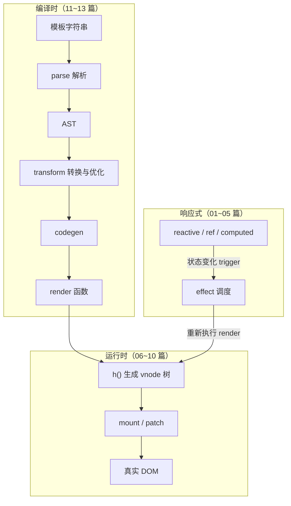

# 00 - 全景与架构

> 对应大纲模块 00（认知层 · 精讲） | 预计时间：1 天
> 面试可答：Vue 3 用 monorepo 把「响应式 / 渲染 / 编译」拆成三个平台无关的内核模块，这套解耦正是它能做编译时优化的前提。

---

## 学习目标

- 装下 Vue 3 的模块地图：`@vue/reactivity`、`@vue/runtime-core`、`@vue/runtime-dom`、`@vue/compiler-core` 各管什么、边界在哪
- 讲清一段模板从字符串到页面的完整数据流（编译时 → 运行时 → 响应式闭环）
- 能对比 Vue 2 / Vue 3 / React 三种渲染模型的本质差异
- 搭好 mini-vue 工程：Bun + TypeScript strict + Vitest，冒烟测试全绿

---

## 模块地图：vuejs/core 的 monorepo 拆分

| 包 | 职责 | mini-vue 对应 |
| --- | --- | --- |
| `@vue/reactivity` | Proxy 响应式：effect / track / trigger / ref / computed | `src/reactivity` |
| `@vue/runtime-core` | 平台无关渲染器：vnode / renderer / component / scheduler | `src/runtime-core` |
| `@vue/runtime-dom` | 浏览器平台层：nodeOps（增删改查 DOM）/ patchProp（属性打补丁） | `src/runtime-dom` |
| `@vue/compiler-core` | 平台无关编译器：parse / transform / codegen | `src/compiler-core` |
| `@vue/compiler-dom` / `compiler-sfc` | 指令、SFC 处理等浏览器特化 | 不实现 |
| `@vue/shared` | 工具函数 | 按需内联到各模块 |

三条组装关系，就是 mini-vue 的三件套依据：

1. `runtime-dom = runtime-core + 平台实现`——core 只定义 `createRenderer(options)`，DOM 怎么创建、属性怎么打补丁由 dom 层注入（06/07 篇落地）
2. `compiler 产物交给 runtime 执行`——模板编译成 render 函数，render 调 `h()` 产 vnode，renderer 消费 vnode（11/12 篇合体）
3. `reactivity 是独立数据层`——不依赖 DOM，可以单独用在 Node 工具里；runtime 通过 effect 把「状态变化」接到「重新渲染」（01~04 篇主线）

### 模板到页面的完整数据流



面试时能徒手画出这张图，架构题就过关了。

| mini-vue 模块 | vuejs/core 对应路径 |
| --- | --- |
| `src/reactivity` | [packages/reactivity](https://github.com/vuejs/core/tree/main/packages/reactivity) |
| `src/runtime-core` / `runtime-dom` | [packages/runtime-core](https://github.com/vuejs/core/tree/main/packages/runtime-core) / [packages/runtime-dom](https://github.com/vuejs/core/tree/main/packages/runtime-dom) |
| `src/compiler-core` | [packages/compiler-core](https://github.com/vuejs/core/tree/main/packages/compiler-core) |

> 本篇只需浏览目录结构与各包 README，不读实现；版本断言以仓库 [Releases](https://github.com/vuejs/core/releases) 页为准。

---

## 三种渲染模型对比（对比板块 #1）

| 维度 | Vue 2 | Vue 3 | React |
| --- | --- | --- | --- |
| 数据侦测 | Object.defineProperty 递归劫持 | Proxy 惰性代理 | 无依赖收集，setState 驱动 |
| 更新粒度 | 组件级，vnode diff 兜底 | 组件级 + 编译时标记精确到节点 | 组件级整体重渲染 |
| 编译时 | 模板 → render，无优化 | patchFlag / block tree / 静态提升 | JSX 自由，编译期帮助有限 |
| diff | 双端 diff | 快速 diff + 最长递增子序列 | fiber 可中断 reconciler |
| 数据心智 | 可变数据 + 依赖收集 | 可变数据 + 依赖收集 | 不可变数据 + 重渲染 |

一句话结论：**Vue 系靠「可变数据 + 依赖收集」做精准更新，React 靠「不可变数据 + 整体重渲染」靠 reconcile 兜底**；Vue 3 相对 Vue 2 的代差主要来自编译时——模板静态可分析，才能生成 patchFlag 把更新精确到节点。

---

## mini-vue 边界（实现 / 不实现）

| 实现 | 不实现（14 篇讲差异） |
| --- | --- |
| reactive / effect / ref / computed / watch / scheduler | Transition / Suspense / KeepAlive / Teleport |
| vnode / h / 元素与组件 mount + patch | 指令系统（v-model 等编译糖） |
| 快速 diff + 最长递增子序列 | SSR / hydration / CustomRenderer |
| parse / transform / codegen | Options API 兼容层 |

---

## 工程初始化

### 1. 初始化项目

在 `src/front/vue/mini-vue/` 下（大纲、doc/ 已就位）：

```bash
bun init -y
bun add -d typescript vitest happy-dom oxlint oxfmt
```

> Vitest 需要 Node 运行，`bun run test` 会正常拉起 vitest CLI；happy-dom 为 06 篇之后的 DOM 相关测试预备，现在装好省得回头。

### 2. 配置文件

`package.json` 的 scripts 部分：

```json
{
  "name": "mini-vue",
  "private": true,
  "type": "module",
  "scripts": {
    "test": "vitest run",
    "test:watch": "vitest",
    "lint": "oxlint src",
    "format": "oxfmt src"
  }
}
```

`tsconfig.json`（strict 全开）：

```json
{
  "compilerOptions": {
    "target": "ESNext",
    "module": "ESNext",
    "moduleResolution": "bundler",
    "strict": true,
    "noUnusedLocals": true,
    "skipLibCheck": true,
    "noEmit": true
  },
  "include": ["src"]
}
```

`vitest.config.ts`：

```ts
import { defineConfig } from 'vitest/config'

export default defineConfig({
  test: {
    environment: 'happy-dom',
    include: ['src/**/__tests__/**/*.spec.ts'],
  },
})
```

lint/format 配置从仓库 agents.md §5.6 指到的参考文件复制（`.oxlintrc.json` / `.oxfmtrc.jsonc`）。

### 3. 目录约定

```text
src/
├── reactivity/          # 01~05 篇
│   ├── __tests__/
│   └── index.ts
├── runtime-core/        # 06~10 篇
├── runtime-dom/         # 06/07 篇平台层
├── compiler-core/       # 11~13 篇
└── index.ts             # 三件套统一出口
```

测试文件与源码并列放在各模块 `__tests__/` 下，一个功能一个 spec，篇与篇的测试文件不混用。

---

## 测试先行

00 篇不写业务代码，只交一个「工具链可运转」的冒烟测试：

```ts
// src/__tests__/scaffold.spec.ts
import { describe, expect, it } from 'vitest'

describe('工程底座', () => {
  it('Vitest 可运行，TS strict 下类型收窄正常', () => {
    const sum = (a: number, b: number): number => a + b
    expect(sum(1, 2)).toBe(3)
  })
})
```

```bash
bun run test
# ✓ src/__tests__/scaffold.spec.ts (1 test) 1ms
```

---

## 常见踩坑点

- ❌ 忘记 `"type": "module"`——后续 vitest.config.ts 以 ESM 加载会报语法错误
- ❌ tsconfig 不开 `strict`——后面 Proxy 泛型、effect 类型推导会悄悄放过一堆 `any` 污染
- ❌ 把测试写进 `src/` 顶层而非模块 `__tests__/`——篇数多了之后测试归属混乱，且不符合 include 规则
- ⚠️ `bun init` 生成的默认 package.json 带 `"module"` 字段与 index.ts，保留 `type`、删掉无用的入口即可

---

## 面试高频问题

1. Vue 3 相比 Vue 2 在架构上有哪些变化？
2. Vue 为什么把 reactivity 拆成独立包？monorepo 拆分带来什么？
3. Vue 和 React 的渲染模型有什么本质区别？

---

## 面试回答模板

> **问：Vue 3 相比 Vue 2 在架构上有哪些变化？**
>
> **答：** 四个层面。① 源码用 TS 重写，类型推导成为 API 设计的一部分；② monorepo 拆成 reactivity / runtime-core / runtime-dom / compiler-core 四个平台无关内核，tree-shaking 友好、reactivity 可独立复用；③ 响应式从 defineProperty 换成 Proxy，支持新增删除属性和数组索引；④ 引入编译时优化——patchFlag、静态提升、block tree，把「运行时 diff」的很大一部分工作提前到编译期完成。

> **问：Vue 为什么把 reactivity 拆成独立包？**
>
> **答：** 因为响应式本质是「依赖收集 + 触发」的通用数据机制，不依赖任何 DOM/平台 API。独立之后有三个收益：可在非 UI 场景复用（Node 脚本、状态库）；runtime 只依赖它的接口而非实现，后续响应式重写（3.5 的 version counting）不影响渲染器；测试收敛在纯数据层，不需要 DOM 环境。

> **问：Vue 和 React 的渲染模型有什么本质区别？**
>
> **答：** Vue 是「可变数据 + 依赖收集」：组件内的响应式依赖在渲染时被精确收集，改哪个值就通知哪个组件（外加编译时 patchFlag 精确到节点）。React 是「不可变数据 + 整体重渲染」：setState 后组件函数重新执行，靠 reconcile（fiber 可中断）对比出新 DOM 操作。所以 Vue 的优化点在「让通知更精准」，React 的优化点在「让重渲染更便宜」（memo、useMemo）。

---

## 练习

**要求**：不看文档，默画「模板 → 页面」数据流的 Mermaid 图（编译时/运行时/响应式三个区块 + 闭环箭头）；再把工程建起来跑通冒烟测试。

**提示**：先想清楚三个问题——模板编译的产物是什么？render 函数被谁消费？状态变了谁负责重新执行 render？

**预期效果**：图画得出三段闭环；`bun run test` 全绿；能对着图说出 06 篇（h/vnode）、09 篇（组件更新）、12 篇（codegen 接入）各自会落在这张图的哪个位置。

---

## 本篇完成标准

- [ ] 冒烟测试全绿，目录结构与本文一致
- [ ] 能默画完整数据流图，并指出 mini-vue 三件套各自落在哪个区块
- [ ] 能脱稿回答三道面试题
