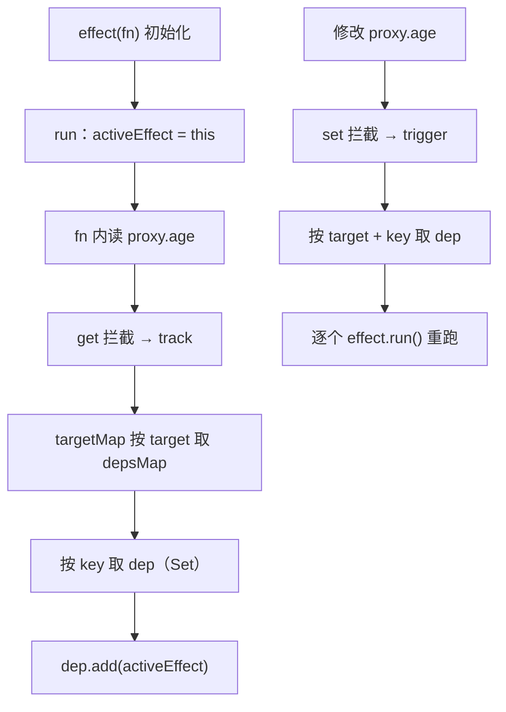

# 01 - effect 与响应式起步

> 对应大纲模块 01（核心层 · 精讲） | 预计时间：2 天
> 面试可答：Proxy 拦截读写，get 里 track 把当前 effect 存进依赖（WeakMap → Map → Set 三级结构），set 里 trigger 重新执行依赖——这就是 Vue 3 响应式的最小闭环。

---

## 学习目标

- 说清「响应式」的本质：副作用（effect）对数据的依赖被自动收集，数据变化时自动重新执行
- 从零实现 `reactive` + `effect` + `track` + `trigger`，跑通最小闭环
- 理解 targetMap 三级结构（WeakMap → Map → Set）每一层为什么存在
- 能答「Vue 2 defineProperty 与 Vue 3 Proxy 的差异」并落到实现细节上

---

## 测试先行

本篇所有实现都为让下面的测试变绿。先把测试写进 `src/reactivity/__tests__/effect.spec.ts`：

```ts
// src/reactivity/__tests__/effect.spec.ts
import { describe, expect, it } from 'vitest'
import { effect, reactive } from '../index'

describe('effect 与响应式起步', () => {
  it('响应式数据变化时，effect 重新执行', () => {
    const user = reactive({ age: 10 })
    let nextAge: number | undefined
    effect(() => {
      nextAge = user.age + 1
    })
    expect(nextAge).toBe(11)

    user.age++
    expect(nextAge).toBe(12)
  })

  it('effect 返回 runner，可手动执行并拿到返回值', () => {
    let foo = 10
    const runner = effect(() => {
      foo++
      return foo
    })
    expect(foo).toBe(11) // 初始化执行了一次

    const r = runner()
    expect(foo).toBe(12)
    expect(r).toBe(12) // runner 返回 fn 的返回值
  })

  it('只依赖被读取的 key：未收集的属性变化不触发', () => {
    const obj = reactive({ a: 1, b: 2 })
    let dummy: number | undefined
    effect(() => {
      dummy = obj.a
    })

    obj.b = 99 // b 没被依赖，不应触发
    expect(dummy).toBe(1)

    obj.a = 10
    expect(dummy).toBe(10)
  })

  it('同一 key 的多个 effect 都会被触发（Set 去重）', () => {
    const obj = reactive({ num: 0 })
    let dummy1: number | undefined
    let dummy2: number | undefined
    effect(() => {
      dummy1 = obj.num * 2
    })
    effect(() => {
      dummy2 = obj.num * 10
    })

    obj.num = 1
    expect(dummy1).toBe(2)
    expect(dummy2).toBe(10)
  })
})
```

---

## 实现拆解

### 第 1 步：reactive——用 Proxy 拦截读写

```ts
// src/reactivity/reactive.ts（01 版本）
import { track, trigger } from './effect'

export function reactive<T extends object>(raw: T): T {
  return new Proxy(raw, {
    get(target, key) {
      // 谁在读？读的哪个 key？—— 记下来（track）
      track(target, key)
      return Reflect.get(target, key)
    },
    set(target, key, value) {
      const res = Reflect.set(target, key, value)
      // 值变了 —— 通知读过这个 key 的 effect（trigger）
      trigger(target, key)
      return res
    },
  })
}
```

两个关键取舍：

- **惰性代理**：`reactive(raw)` 不递归遍历 raw，访问到哪层才代理哪层。Vue 2 的 defineProperty 必须初始化时递归全量劫持，大对象首屏开销大——这是 Proxy 的第一个优势
- **`Reflect.get/set` 而不是 `target[key]`**：01 阶段看似等价，但遇到 getter 内 `this` 指向、原型链继承时会出 bug，02 篇专门拆

### 第 2 步：effect——把「副作用」变成可追踪的单元

```ts
// src/reactivity/effect.ts（01 版本）
let activeEffect: ReactiveEffect | undefined

/**
 * 依赖存储的三级结构：
 * WeakMap<target, Map<key, Set<effect>>>
 */
const targetMap = new WeakMap<object, Map<PropertyKey, Set<ReactiveEffect>>>()

export class ReactiveEffect<T = any> {
  private _fn: () => T

  constructor(fn: () => T) {
    this._fn = fn
  }

  run(): T {
    activeEffect = this
    return this._fn()
  }
}

export function track(target: object, key: PropertyKey) {
  // 不在 effect 里发生的读取（如事件回调里读状态）不收集
  if (!activeEffect) return

  let depsMap = targetMap.get(target)
  if (!depsMap) {
    targetMap.set(target, (depsMap = new Map()))
  }
  let dep = depsMap.get(key)
  if (!dep) {
    depsMap.set(key, (dep = new Set()))
  }
  dep.add(activeEffect)
}

export function trigger(target: object, key: PropertyKey) {
  const depsMap = targetMap.get(target)
  if (!depsMap) return
  const dep = depsMap.get(key)
  dep?.forEach((effect) => effect.run())
}

export type ReactiveEffectRunner<T = any> = (() => T) & {
  effect: ReactiveEffect
}

export function effect<T = any>(fn: () => T): ReactiveEffectRunner<T> {
  const _effect = new ReactiveEffect(fn)
  _effect.run() // 初始化：执行一次，期间完成依赖收集
  const runner = _effect.run.bind(_effect) as ReactiveEffectRunner<T>
  runner.effect = _effect
  return runner
}
```

### 第 3 步：统一出口

```ts
// src/reactivity/index.ts
export { reactive } from './reactive'
export { effect } from './effect'
```

### 闭环全流程



### 三级结构每一层为什么存在

| 层 | 类型 | 为什么 |
| --- | --- | --- |
| 第 1 层 | `WeakMap` | key 是被代理的原始对象。用 WeakMap，对象没有其他引用时整份依赖可被 GC；且 WeakMap 不可遍历，业务代码摸不到内部结构 |
| 第 2 层 | `Map` | 同一个对象的不同属性依赖彼此独立——改 `age` 不该惊动只依赖 `name` 的 effect |
| 第 3 层 | `Set` | 同一属性可能被多个 effect 读取，Set 天然去重（同一个 effect 读两次也只存一份） |

---

## 对照源码

vuejs/core（3.5 稳定线）对应实现：

| 教学版 | vuejs/core | 说明 |
| --- | --- | --- |
| `reactive()` 直接 new Proxy | `packages/reactivity/src/reactive.ts` 的 `createReactiveObject` | 真实版处理重复代理、已代理检测（`ReactiveFlags`）、只代理对象/数组/Map/Set |
| get/set 简单拦读写 | `packages/reactivity/src/baseHandlers.ts` | 真实版 get 有 `ReactiveFlags` 短路、数组方法特殊处理、浅层/只读分支；04 篇会用到 IS_REACTIVE |
| `dep = Set<ReactiveEffect>` | `packages/reactivity/src/dep.ts` | **最大差异**：3.5 起内部结构重写为「双向链表 + version counting」，把 02 篇 cleanup 的全量清理变成版本号比对，内存省约 56%——教学版采用 3.4 之前的经典 Set 模型，原理等价，演进见 14 篇引子 |
| trigger 直接 `run()` | `packages/reactivity/src/effect.ts` 的 `triggerEffects` | 真实版会判断 `effect.scheduler`、递归保护（`allowRecurse`）——03 篇讲 scheduler |

> 对照入口：[vuejs/core/packages/reactivity](https://github.com/vuejs/core/tree/main/packages/reactivity)

---

## 常见踩坑点

- ❌ `track` 里不判 `activeEffect` 就入 Map——事件回调、异步任务里的读取全部被当成依赖，trigger 时凭空重跑
- ❌ 测试里写 `let dummy: number` 然后在 effect 闭包里赋值——TS strict 会报 TS2454「使用前未赋值」，声明要带 `| undefined`
- ❌ dep 用数组存——同一 effect 读同一属性两次（如 `sum + sum`）会重复收集，更新时执行两遍
- ❌ effect 内同步修改自己依赖的状态（`effect(() => obj.num++)`）——trigger 同步 `run()` 造成无限递归。教学版先在测试里规避，真实实现靠调度器 + 递归保护，03 篇收编
- ❌ 用 `Map<object, ...>` 替代 WeakMap——对象销毁后依赖永不清除，长期运行内存泄漏

---

## 面试高频问题

1. 讲一下 Vue 3 响应式原理（全流程）
2. Vue 2 的 defineProperty 和 Vue 3 的 Proxy 差在哪？
3. 依赖为什么用 WeakMap + Map + Set 三级结构？

---

## 面试回答模板

> **问：讲一下 Vue 3 响应式原理。**
>
> **答：** 核心是「依赖收集 + 触发更新」的闭环。`reactive` 用 Proxy 包住对象，effect 执行前把自己设为全局 activeEffect；fn 内读到响应式属性时走 get 拦截，track 把 activeEffect 存进 `WeakMap<target, Map<key, Set<effect>>>` 的对应 dep；修改属性走 set 拦截，trigger 取出 dep 逐个重新执行。组件层面，组件的渲染函数本身就是一个 effect——所以改状态能触发重渲。3.5 之后依赖内部结构升级为 version counting，但这条闭环流程没变。

> **问：Vue 2 的 defineProperty 和 Vue 3 的 Proxy 差在哪？**
>
> **答：** defineProperty 只能劫持「已知属性」的读写，所以 Vue 2 要初始化时递归全量劫持、新增/删除属性监听不到（补 `$set/$delete`）、数组靠重写七个原型方法、索引赋值监听不到。Proxy 劫持的是整个对象，13 种拦截器可选，天然支持新增删除（02 篇会实现 deleteProperty/ownKeys），惰性代理不用初始化递归。代价是 Proxy 不能被 polyfill，这也是 Vue 3 放弃 IE11 的直接原因。

> **问：为什么用 WeakMap 做第一级？**
>
> **答：** 三个理由：① key 是原始对象，WeakMap 弱引用，对象别处没有引用时整份依赖表随 GC 释放，避免泄漏；② WeakMap 的 key 不可遍历，外部代码无法窥探/篡改框架内部的依赖关系；③ 以对象身份做 key 的映射本来就是 WeakMap 的语义。

---

## 练习

**要求**：用自研 `reactive` + `effect` 做一个双通道计数器：`count1`、`count2` 两个状态，`double1 = count1 * 2`、`double2 = count2 * 2` 分别在两个 effect 里计算；改 `count1` 时只有 `double1` 更新。最后用 runner 手动再触发一次 `double1` 的 effect。

**提示**：两个 effect 各自只读各自的 key，注意观察 track 进了哪个 dep；runner 是 `effect()` 的返回值。

**预期效果**：改 `count1` 只更新 `double1`，`double2` 的 effect 不重跑（可加计数器验证）；`runner()` 调用后计数器 +1 且拿到 fn 返回值。能对着结果说出「哪些读取进了哪个 dep、为什么」。

---

## 本篇完成标准

- [ ] 四条测试全绿
- [ ] 能默画 targetMap 三级结构与 track/trigger 时序图
- [ ] 能不翻文档说出「惰性代理、Set 去重、WeakMap GC」三个设计取舍
- [ ] 面试三问可脱稿作答
