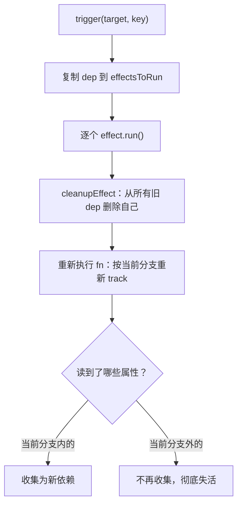

# 02 - 依赖收集进阶

> 对应大纲模块 02（核心层 · 精讲） | 预计时间：2 天
> 面试可答：receiver 让 getter 内 this 指向代理而非原始对象；「先清后收」的 cleanup 解决分支切换的残留依赖；effectStack 让嵌套 effect 时 activeEffect 指向最内层。

---

## 学习目标

- 修掉 01 版本的四个正确性缺陷：receiver 缺失、分支切换残留依赖、嵌套 effect 串扰、嵌套对象读取返回原始引用
- 补上「对象形状」的依赖：for-in / Object.keys / in 走 `ownKeys` 拦截，统一收集到 `ITERATE_KEY`
- 理解数组 index / length 在 Proxy 下的联动路径
- 这篇的 `deps 反向记录` 与 `effectStack` 是 04 篇 computed / watch / stop 的地基

---

## 测试先行

在 `src/reactivity/__tests__/effect.spec.ts` 追加一组 describe（01 的四条测试保持全绿）：

```ts
// src/reactivity/__tests__/effect.spec.ts（追加）
import { describe, expect, it } from 'vitest'
import { effect, reactive } from '../index'

describe('依赖收集进阶', () => {
  it('getter 内的 this 应指向代理（receiver）', () => {
    const obj = reactive({
      foo: 1,
      get bar() {
        return this.foo // this 若是原始对象，这次读取不会被 track
      },
    })
    let dummy: number | undefined
    effect(() => {
      dummy = obj.bar
    })
    expect(dummy).toBe(1)

    obj.foo++ // 修复 receiver 前：这里不会触发重跑，dummy 停在 1
    expect(dummy).toBe(2)
  })

  it('分支切换：失效的依赖不再触发（cleanup）', () => {
    const obj = reactive({ ok: true, text: 'hello' })
    let runCount = 0
    let dummy: string | undefined
    effect(() => {
      runCount++
      dummy = obj.ok ? obj.text : 'else'
    })
    expect(dummy).toBe('hello')
    expect(runCount).toBe(1)

    obj.ok = false
    expect(dummy).toBe('else')
    expect(runCount).toBe(2)

    obj.text = 'world' // ok 已为 false，text 不再是依赖
    expect(runCount).toBe(2)
    expect(dummy).toBe('else')
  })

  it('嵌套 effect：内层变化只触发内层（effectStack）', () => {
    const obj = reactive({ a: 1, b: 2 })
    let outerRun = 0
    let innerRun = 0
    let inner: number | undefined
    effect(() => {
      outerRun++
      void obj.a
      effect(() => {
        innerRun++
        inner = obj.b
      })
    })
    expect(innerRun).toBe(1)

    obj.b++
    expect(innerRun).toBe(2)
    expect(inner).toBe(3)
    expect(outerRun).toBe(1) // 修复栈之前：外层会被误触发
  })

  it('for-in / Object.keys 收集 ITERATE_KEY：新增属性触发', () => {
    const obj = reactive<Record<string, number>>({ a: 1 })
    let dummy: string[] | undefined
    effect(() => {
      dummy = Object.keys(obj) // 走 ownKeys 拦截
    })
    expect(dummy).toEqual(['a'])

    obj.b = 2 // 新增属性 → ITERATE_KEY 触发
    expect(dummy).toEqual(['a', 'b'])
  })

  it('嵌套对象：读取返回稳定代理，深层可响应', () => {
    const state = reactive({ nested: { count: 1 } })
    expect(state.nested).toBe(state.nested) // reactiveMap 保证身份稳定

    let dummy: number | undefined
    effect(() => {
      dummy = state.nested.count
    })
    expect(dummy).toBe(1)

    state.nested.count = 2
    expect(dummy).toBe(2)
  })

  it('数组 index / length 联动', () => {
    const arr = reactive([1, 2, 3])
    let dummy: number | undefined
    effect(() => {
      dummy = arr.length
    })
    expect(dummy).toBe(3)

    arr.push(4) // 内部：set('3') + set('length')
    expect(dummy).toBe(4)
  })
})
```

---

## 实现拆解

### 缺陷 1：Reflect 缺 receiver——getter 的 this 指向错了

01 版 `Reflect.get(target, key)` 把 getter 的 this 绑定在**原始对象**上。`obj.bar` 的 getter 内 `this.foo` 走的是原始对象的读取，Proxy 的 get 拦截根本没发生 → `foo` 没被收集 → 改 `foo` 不触发。

修法：get/set 都把第三参 `receiver`（本次 Proxy 调用的代理对象）透传给 Reflect。顺带落一个本篇就会用到的公共工具文件（04 篇还会扩充它）：

```ts
// src/reactivity/utils.ts
export const isObject = (value: unknown): value is Record<PropertyKey, any> =>
  typeof value === 'object' && value !== null
```

```ts
// src/reactivity/reactive.ts（02 完整版）
import { ITERATE_KEY, track, trigger } from './effect'
import { isObject } from './utils'

/** 原始对象 → 代理 的缓存：同一个 raw 永远返回同一个代理（身份稳定） */
const reactiveMap = new WeakMap<object, object>()

export function reactive<T extends object>(raw: T): T {
  const existing = reactiveMap.get(raw)
  if (existing) {
    return existing as T
  }
  const proxy = new Proxy(raw, {
    get(target, key, receiver) {
      // receiver 透传：getter 内 this 指向代理 → 内部读取再次进入拦截 → 正确收集
      track(target, key)
      const res = Reflect.get(target, key, receiver)
      // 惰性深层代理：嵌套对象读取时才转 reactive，深层数据才可响应
      if (isObject(res)) {
        return reactive(res)
      }
      return res
    },
    set(target, key, value, receiver) {
      // 区分「新增」和「修改」：新增影响对象形状，要连带 ITERATE_KEY
      const hadKey = Object.prototype.hasOwnProperty.call(target, key)
      const res = Reflect.set(target, key, value, receiver)
      trigger(target, key, hadKey ? 'set' : 'add')
      return res
    },
    deleteProperty(target, key) {
      const hadKey = Object.prototype.hasOwnProperty.call(target, key)
      const res = Reflect.deleteProperty(target, key)
      if (hadKey) {
        trigger(target, key, 'delete')
      }
      return res
    },
    ownKeys(target) {
      // for-in / Object.keys / Object.entries 都走这里
      track(target, ITERATE_KEY)
      return Reflect.ownKeys(target)
    },
  })
  reactiveMap.set(raw, proxy)
  return proxy as T
}
```

### 缺陷 2：嵌套对象返回原始引用——惰性深层代理

01 版 get 拦截对嵌套对象直接返回原始引用：`state.nested` 拿到的是裸对象，对它赋值根本不经过任何 Proxy，整棵子树失活。修法（已并入上面完整版）：

- **惰性深层代理**：get 里发现返回值是对象就包一层 `reactive(res)`——延续 01 的惰性思路，读到哪层代理到哪层
- **reactiveMap 缓存**：`WeakMap<raw, proxy>` 保证同一个原始对象永远对应同一个代理，否则 `state.nested !== state.nested`（每次读取都生成新代理），比较、去重、依赖收集全部错乱

上面测试里 `expect(state.nested).toBe(state.nested)` 验证的就是这个身份稳定性。

### 缺陷 3：分支切换的残留依赖——cleanup

`dummy = obj.ok ? obj.text : 'else'`：`ok = true` 时依赖 `ok` 和 `text`；切到 `ok = false` 后，`text` 已经读不到了，但它仍挂在 dep 里——之后每次改 `text` 都白白触发。这就是「分支切换」。

修法：**先清后收**。每次 effect 执行前，把它从所有 dep 里删掉，执行过程中按当前分支重新收集。前提是 effect 要反向记录「我被哪些 dep 收集过」：

```ts
// src/reactivity/effect.ts（02 完整版）
let activeEffect: ReactiveEffect | undefined
const effectStack: ReactiveEffect[] = []

const targetMap = new WeakMap<object, Map<PropertyKey, Set<ReactiveEffect>>>()

/** 对象「形状」的依赖 key：for-in / Object.keys / in / 新增删除属性 */
export const ITERATE_KEY = Symbol('iterate')

export type EffectRunType = 'add' | 'delete' | 'set'

export class ReactiveEffect<T = any> {
  private _fn: () => T
  /** 反向记录：我被哪些 dep 收集了——cleanup 的依据 */
  deps: Set<Set<ReactiveEffect>> = new Set()
  /** 存活标记：stop 之后 run 不再收集（04 篇 watch stop 依赖它） */
  active = true

  constructor(fn: () => T) {
    this._fn = fn
  }

  run(): T {
    if (!this.active) {
      return this._fn() // 已停止：只执行，不收集
    }
    // 1. 先清后收 —— 分支切换正确性的来源
    cleanupEffect(this)
    // 2. 栈结构 —— 嵌套时 activeEffect 永远指向最内层
    effectStack.push(this)
    activeEffect = this
    try {
      return this._fn()
    } finally {
      effectStack.pop()
      activeEffect = effectStack[effectStack.length - 1]
    }
  }
}

function cleanupEffect(effect: ReactiveEffect) {
  effect.deps.forEach((dep) => dep.delete(effect))
  effect.deps.clear()
}

export function track(target: object, key: PropertyKey) {
  if (!activeEffect) return

  let depsMap = targetMap.get(target)
  if (!depsMap) {
    targetMap.set(target, (depsMap = new Map()))
  }
  let dep = depsMap.get(key)
  if (!dep) {
    depsMap.set(key, (dep = new Set()))
  }
  dep.add(activeEffect)
  // 反向收集：effect 记住这个 dep，供 cleanup
  activeEffect.deps.add(dep)
}

export function trigger(target: object, key: PropertyKey, type?: EffectRunType) {
  const depsMap = targetMap.get(target)
  if (!depsMap) return

  // 复制一份再执行：遍历期间 cleanup 会修改 dep 本身，直接遍历原 Set 会错乱
  const effectsToRun = new Set<ReactiveEffect>()

  const addRunners = (k: PropertyKey) => {
    depsMap.get(k)?.forEach((effect) => effectsToRun.add(effect))
  }

  // 新增/删除属性 → 改变了对象形状 → 依赖「形状」的 effect（for-in 等）也要跑
  if (type === 'add' || type === 'delete') {
    addRunners(ITERATE_KEY)
  }
  addRunners(key)

  effectsToRun.forEach((effect) => effect.run())
}

export type ReactiveEffectRunner<T = any> = (() => T) & {
  effect: ReactiveEffect
}

export function effect<T = any>(fn: () => T): ReactiveEffectRunner<T> {
  const _effect = new ReactiveEffect(fn)
  _effect.run()
  const runner = _effect.run.bind(_effect) as ReactiveEffectRunner<T>
  runner.effect = _effect
  return runner
}
```

### 缺陷 4：嵌套 effect——全局变量需要栈

`activeEffect` 是模块级单例：内层 effect 执行完把它留在内层，外层后续读取全被记到内层头上，外层更新时 trigger 的也是内层。

修法：`run()` 用栈——进函数 push、`finally` 里 pop 并把 `activeEffect` 恢复成栈顶。上面 effect.ts 完整版已包含。

### cleanup + trigger 的执行时序



### 数组 index / length 为什么能联动

`arr.push(4)` 内部发生两件事：`set('3', 4)`（新增索引 → add）和 `set('length', 4)`（修改 → set）。effect 里读过 `arr.length`，所以 `length` 的 dep 里有它，`set('length')` 的 trigger 直接命中。数组的高阶联动（length 改动连带索引超界重触发）vuejs/core 有额外处理，见下方对照源码。

---

## 对照源码

vuejs/core（3.5 稳定线）对应实现：

| 本篇实现 | vuejs/core | 说明 |
| --- | --- | --- |
| `Reflect.get(target, key, receiver)` | `packages/reactivity/src/baseHandlers.ts` | 真实版 get 还先短路 `ReactiveFlags`（04 篇用 IS_REACTIVE）、区分浅层/只读 |
| `hadKey = hasOwnProperty` | 同上 `MutableReactiveHandler.set` | 真实版（v3.5.43）三目：数组整数索引 `Number(key) < target.length`、普通对象 `hasOwn(target, key)` |
| 同值赋值不短路 | `set` 中 `else if (hasChanged(value, oldValue))` 才 trigger SET | 教学版每次 set 都 trigger，同值赋值会空触发一次重跑（后续 03 篇的批处理可兜底合并）——属教学简化 |
| 先清后收的 `cleanupEffect` | 3.4 之前 `packages/reactivity/src/effect.ts` 的 `cleanupEffect` | **关键差异**：3.5 重写为 `dep.ts` 里的「双向链表 + version counting」（3.4 先行重写的是 computed），依赖清理从每次 O(n) 删除变成版本号比对，大依赖集性能与内存大幅优化（官方口径 -56%）——教学版是经典模型，机制等价 |
| `ITERATE_KEY` | `packages/reactivity/src/dep.ts` 导出的 `ITERATE_KEY` | 语义一致；真实版 `ownKeys`：数组 track 到 `'length'`、对象 track `ITERATE_KEY`（v3.5.43 `baseHandlers.ts`） |
| effectStack 恢复 activeEffect | `packages/reactivity/src/effect.ts` 的 `run()` | 真实版用 `recordEffectScope` 顺带记录 EffectScope（05 篇速查里提） |

> 对照入口：[vuejs/core/packages/reactivity](https://github.com/vuejs/core/tree/main/packages/reactivity)（`ITERATE_KEY` 所在 dep.ts 现状见[官方覆盖率站源码视图](https://coverage.vuejs.org/reactivity/src/dep.ts.html)）

---

## 常见踩坑点

- ❌ cleanup 后忘了重新收集——只删不加，第二次更新直接丢（顺序必须是：先 cleanup，再执行 fn）
- ❌ 直接遍历 dep 执行 run——run 内部 cleanup 会增删同一个 Set，V8 的 Set 迭代器会把遍历期间新加的元素也跑出来，轻则重复执行重则死循环。先复制再遍历
- ❌ `effectStack.push` 后用 try/finally 之外的方式恢复——fn 抛异常时栈就断了，必须 finally
- ❌ `hadKey` 判断用 `hasOwnProperty` 直接查——对象有原型链时，继承属性会被误判成 add；教学版数据都是平铺自有的。真实版（v3.5.43 `baseHandlers.ts`）：数组整数索引用 `Number(key) < target.length`，普通对象用 `hasOwn(target, key)`（shared 里 hasOwnProperty.call 的封装）
- ❌ get 里嵌套对象直接返回原始引用——深层属性读写绕过 Proxy，整棵子树失活；读取时惰性转 reactive，并用 reactiveMap 缓存保证 `state.nested` 恒等
- ❌ cleanup 让「依赖了又删、删了又加」的 effect 每次更新都做一次全量收集——这正是 3.5 换 version counting 的动机，14 篇展开

---

## 面试高频问题

1. 为什么 Proxy 的 get 里必须把 receiver 透传给 Reflect？
2. 什么是分支切换？Vue 怎么保证失效依赖不再触发？
3. 嵌套 effect 时 activeEffect 为什么会错？怎么解决？

---

## 面试回答模板

> **问：为什么 get 里必须传 receiver？**
>
> **答：** Reflect.get 的第三个参数 receiver 决定 getter 内 this 的指向。不传时 getter 的 this 是原始对象，getter 内部对其他响应式属性的读取绕过了 Proxy 拦截——这些属性既不会被收集，改了也不会触发。传 receiver（即代理本身）后，内部读取会重新进入 get 拦截，形成正确的嵌套收集。set 里同理，setter 场景下不传 receiver 还可能把赋值打到原型上。

> **问：什么是分支切换？怎么解决？**
>
> **答：** `ok ? a : b` 这类三元表达式，依赖集合随分支变化。切分支后，旧分支的属性读不到了但依赖还挂在 dep 里，后续修改会白白触发更新。Vue 的解法是「先清后收」：effect 反向记录所有收集自己的 dep（effect.deps），每次执行前先把自己从全部 dep 里删除并清空记录，再按当前分支重新收集。这样没被重新收集的依赖自然失活。3.5 之后这套 O(n) 清理换成了 version counting 的版本比对，思路相同、成本更低。

> **问：嵌套 effect 为什么会出问题？**
>
> **答：** activeEffect 是模块级单例，嵌套时内层 effect 执行完没有恢复，后续读取会收集到内层 effect 头上，外层的更新也误触发内层。解决是用 effectStack：run 时 push 并置 activeEffect，finally 里 pop 并恢复为新的栈顶——保证任意时刻 activeEffect 都指向真正在执行的最内层 effect。computed 的内部 effect 就是嵌套收集的典型场景，没有栈实现就做不出来。

---

## 练习

**要求**：实现一个迷你购物车状态 `reactive<Record<string, number>>`（商品名 → 数量）。effect A 统计商品种类数（`Object.keys(items).length`），effect B 只依赖 `items.apple` 的数量。依次做两件事：① `items.apple++`；② `items.banana = 3`。记录两个 effect 各自的触发情况。

**提示**：改已有 key 只触发 key 依赖；新增 key 触发 ITERATE_KEY 依赖（走 ownKeys）以及 add 分支。可以给两个 effect 各加一个计数器。

**预期效果**：①只有 B 触发（A 不读 apple）；②只有 A 触发（B 不依赖形状）。如果两个都触发了，检查 ownKeys 是否漏 track、set 是否漏区分 add/set。

---

## 本篇完成标准

- [ ] 01 + 02 共十条测试全绿
- [ ] 能说清「先清后收」的完整时序，以及为什么遍历前要复制 dep
- [ ] 能脱稿答三道面试题，receiver 一题能举 getter 例子
- [ ] 理解 deps 反向记录在 04 篇的两个去向：computed 的脏标记通知、watch 的 stop
