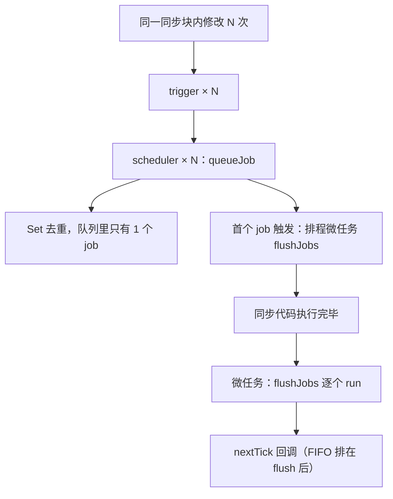

# 03 - 调度器与异步更新

> 对应大纲模块 03（核心层 · 精讲） | 预计时间：2 天
> 面试可答：trigger 时若 effect 配置了 scheduler 就交给 scheduler 调度而不是直接重跑；把 job 放进 Set 去重、用微任务 flush，就是 Vue「同一 tick 批量更新」与 nextTick 的原理。

---

## 学习目标

- 给 effect 加 `scheduler` 选项：trigger 时「怎么更新」与「更新什么」分离
- 实现 `queueJob` + 微任务 flush：同一 tick 内 N 次状态修改只重跑一次 effect
- 实现 `nextTick`，讲清它为什么是微任务、为什么排在 flush 之后
- 理解这一篇是 04 篇 computed（惰性通知）与 09 篇组件异步更新的直接地基

---

## 测试先行

新建 `src/reactivity/__tests__/scheduler.spec.ts`：

```ts
// src/reactivity/__tests__/scheduler.spec.ts
import { describe, expect, it, vi } from 'vitest'
import { effect, nextTick, queueJob, reactive } from '../index'
import type { ReactiveEffect } from '../effect'

describe('scheduler 选项', () => {
  it('trigger 时若配置 scheduler 则不直接 run', () => {
    const obj = reactive({ foo: 1 })
    let dummy: number | undefined
    const scheduler = vi.fn((effect: ReactiveEffect) => {
      effect.run() // 调度权在用户手里
    })

    effect(() => {
      dummy = obj.foo
    }, { scheduler })

    expect(dummy).toBe(1) // 初始化不受影响，正常执行
    obj.foo++
    expect(scheduler).toHaveBeenCalledTimes(1) // 更新走的是 scheduler
    expect(dummy).toBe(2)
  })

  it('不配置 scheduler 时行为与之前一致', () => {
    const obj = reactive({ foo: 1 })
    let dummy: number | undefined
    effect(() => {
      dummy = obj.foo
    })
    obj.foo++
    expect(dummy).toBe(2)
  })
})

describe('queueJob 批量更新', () => {
  it('同一 tick 多次修改，只批处理一次', async () => {
    const obj = reactive({ foo: 1 })
    let calls = 0
    let dummy: number | undefined

    effect(
      () => {
        calls++
        dummy = obj.foo
      },
      { scheduler: (e) => queueJob(e) },
    )
    expect(calls).toBe(1) // 初始化

    obj.foo++
    obj.foo++
    obj.foo++
    await nextTick()

    expect(calls).toBe(2) // 三次修改合并成一次重跑
    expect(dummy).toBe(4)
  })

  it('不同 effect 各自入队，互不吞并', async () => {
    const obj = reactive({ a: 1, b: 2 })
    let callsA = 0
    let callsB = 0

    effect(() => {
      callsA++
      void obj.a
    }, { scheduler: (e) => queueJob(e) })
    effect(() => {
      callsB++
      void obj.b
    }, { scheduler: (e) => queueJob(e) })

    obj.a = 10
    obj.b = 20
    await nextTick()

    expect(callsA).toBe(2)
    expect(callsB).toBe(2)
  })
})

describe('nextTick', () => {
  it('nextTick 回调排在 flush 之后', async () => {
    const order: string[] = []
    const obj = reactive({ foo: 1 })

    effect(
      () => {
        void obj.foo
      },
      {
        scheduler: (e) => {
          queueJob(e)
          order.push('queued')
        },
      },
    )

    obj.foo++
    nextTick(() => order.push('tick'))
    await nextTick()

    expect(order).toEqual(['queued', 'tick'])
  })

  it('不传回调时返回 Promise，可 await', async () => {
    const obj = reactive({ foo: 1 })
    let dummy: number | undefined
    effect(
      () => {
        dummy = obj.foo
      },
      { scheduler: (e) => queueJob(e) },
    )
    expect(dummy).toBe(1)

    obj.foo++
    await nextTick()
    expect(dummy).toBe(2)
  })
})
```

---

## 实现拆解

### 第 1 步：effect 加 scheduler 选项

`trigger` 拿到 dep 之后，「逐个 run」只是默认策略。把「怎么跑」抽成可注入的钩子，这就是 scheduler：

```ts
// src/reactivity/effect.ts（03 版本：在上篇基础上只改下面三处）

// ① 新增类型与选项
export type EffectScheduler = (effect: ReactiveEffect) => any

export interface ReactiveEffectOptions {
  scheduler?: EffectScheduler
}

export class ReactiveEffect<T = any> {
  private _fn: () => T
  /** 调度钩子：trigger 时优先于 run 调用 */
  scheduler?: EffectScheduler
  deps: Set<Set<ReactiveEffect>> = new Set()
  active = true

  constructor(fn: () => T, scheduler?: EffectScheduler) {
    this._fn = fn
    this.scheduler = scheduler
  }

  // run() 与 02 版本一致（先清后收 + 栈），此处省略
}

// ② effect() 入口透传选项
export function effect<T = any>(
  fn: () => T,
  options?: ReactiveEffectOptions,
): ReactiveEffectRunner<T> {
  const _effect = new ReactiveEffect(fn, options?.scheduler)
  _effect.run()
  const runner = _effect.run.bind(_effect) as ReactiveEffectRunner<T>
  runner.effect = _effect
  return runner
}

// ③ trigger 的执行策略改为「scheduler 优先」
export function trigger(target: object, key: PropertyKey, type?: EffectRunType) {
  const depsMap = targetMap.get(target)
  if (!depsMap) return

  const effectsToRun = new Set<ReactiveEffect>()

  const addRunners = (k: PropertyKey) => {
    depsMap.get(k)?.forEach((effect) => effectsToRun.add(effect))
  }
  if (type === 'add' || type === 'delete') {
    addRunners(ITERATE_KEY)
  }
  addRunners(key)

  effectsToRun.forEach((effect) => {
    if (effect.scheduler) {
      effect.scheduler(effect) // 把调度权交出去
    } else {
      effect.run() // 默认：同步重跑
    }
  })
}
```

一句话理解：**scheduler 是「更新时机与方式」的插槽**。默认插槽行为是同步重跑；watch 用它实现「变化后回调」，computed 用它实现「打脏标记」，组件用它实现「排队到微任务统一重渲」——后两篇逐个兑现。

### 第 2 步：queueJob——Set 去重 + 微任务 flush

```ts
// src/reactivity/scheduler.ts
import type { ReactiveEffect } from './effect'

/** 待执行的 effect 队列：Set 天然去重，同一 effect 入队 N 次也只跑一次 */
const queue = new Set<ReactiveEffect>()
let isFlushing = false

export function queueJob(effect: ReactiveEffect) {
  queue.add(effect)
  // 只有「空闲 → 首个任务」这一次真正排程微任务
  if (!isFlushing) {
    isFlushing = true
    Promise.resolve().then(flushJobs)
  }
}

function flushJobs() {
  // Set.forEach 的语义：遍历期间新增的元素也会被遍历到
  // —— flush 过程中 trigger 出的新 job 会在本轮一并消化
  queue.forEach((effect) => effect.run())
  queue.clear()
  isFlushing = false
}

export function nextTick(fn?: () => void): Promise<void> {
  return fn ? Promise.resolve().then(fn) : Promise.resolve()
}
```

三个设计点：

1. **去重靠 Set**：同一 effect 被三个不同属性触发三次，Set 里始终只有一个实例
2. **`isFlushing` 门闩**：批量更新期间再 trigger，job 进队但不重复排程微任务——「一个 tick 一次 flush」
3. **nextTick 排在 flush 之后**：`queueJob` 先注册了 `flushJobs` 这个微任务，之后调用 `nextTick(cb)` 注册的微任务天然排在它后面——不需要额外同步手段，微任务 FIFO 就是顺序保证

### 批量更新时序



### 第 3 步：出口补齐

```ts
// src/reactivity/index.ts
export { reactive } from './reactive'
export { effect } from './effect'
export { nextTick, queueJob } from './scheduler'
```

### 组件更新队列雏形（09 篇预告）

组件的更新函数本身是一个 effect，渲染时给它挂 `scheduler: (e) => queueJob(e)`。于是：一个事件回调里改了 10 个组件用到的状态 → 10 次 trigger → 10 个组件 effect 入队去重 → 下一个微任务统一重渲，且每个组件只重渲一次。09 篇会把这个雏形接进 `patchComponent`。

---

## 对照源码

vuejs/core（3.5 稳定线）对应实现：

| 教学版 | vuejs/core | 说明 |
| --- | --- | --- |
| `scheduler(effect)` 钩子 | `packages/reactivity/src/effect.ts`，`triggerEffects` 中同样「scheduler 优先」 | 语义一致；真实版 scheduler 支持任意参数（`(...args: any[])`） |
| `Set<ReactiveEffect>` 队列 | `packages/runtime-core/src/scheduler.ts` 的 `queueJob(job)` | **关键差异**：真实队列存的是带 `uid` 的 Job 函数，入队时按 id 有序插入，保证「父组件先于子组件更新」；教学版用 effect 实例去重，无优先级概念 |
| `forEach` 一轮消化新增 job | `flushJobs` 用 `for (flushIndex = 0; flushIndex < queue.length; flushIndex++)` 活队列循环 | flush 期间入队的 job 实时拉长 queue、本轮消化；`finally` 清空队列并按需续排下一轮 flush，异常走 `callWithErrorHandling` 兜底 |
| `nextTick = Promise.then` | 同文件 `nextTick`（基于 `currentFlushPromise.then`） | 语义一致：真实版 nextTick 挂在 flush promise 之后，天然「flush 后执行」 |
| 递归无保护 | `allowRecurse` 标记 | 真实版默认禁止 effect 在 flush 中自我重入（防止「重跑中又改自己依赖」的死循环），特殊场景（组件强制更新等）显式开 allowRecurse |

> 对照入口：[vuejs/core/packages/runtime-core/src/scheduler.ts](https://github.com/vuejs/core/blob/main/packages/runtime-core/src/scheduler.ts)、[packages/reactivity](https://github.com/vuejs/core/tree/main/packages/reactivity)

> 另注：3.5 起 `@vue/reactivity` 内部也带了一套轻量批处理（`batch` / `batchedSub` / `batchDepth`，见 dep.ts / effect.ts），`@vue/runtime-core` 的 scheduler 仍然负责组件级排队与父子顺序，两层各管一段。

---

## 常见踩坑点

- ❌ flush 排程写在 `queue.add` 之外且不加门闩——每个 job 都排一个微任务，「批」就退化成了「异步逐个」
- ❌ `isFlushing` 在 forEach 前就复位——flush 期间新产生的 trigger 会再排一个微任务，产生两轮 flush，父子组件顺序错乱
- ❌ 用数组 + `indexOf` 去重——每次 O(n) 查找；Set 的 add 是 O(1) 且天然幂等
- ❌ 期待 `nextTick` 回调里拿到「旧状态对应的 DOM」——flush 已经跑完，回调看到的是更新后的结果；这正是它的用途（等更新完再量尺寸）
- ⚠️ 同步递归死循环（effect 内改自己依赖）教学版仍未防护，flush 后的 effect.run 在队列里重复入队同样会无限跑——真实实现的 `allowRecurse` 是必备防线，理解它的存在即可，mini-vue 不实现

---

## 面试高频问题

1. nextTick 的实现原理？为什么用微任务？
2. Vue 的「异步批量更新」是怎么实现的？
3. scheduler 有什么用？哪些 API 建立在它之上？

---

## 面试回答模板

> **问：nextTick 的实现原理？为什么用微任务？**
>
> **答：** nextTick 就是 `Promise.resolve().then(fn)` 的薄封装。Vue 修改状态后不立刻更新 DOM，而是把组件更新 job 排进队列、用微任务 flush；nextTick 注册的微任务排在这个 flush 之后，所以回调里拿到的一定是「本轮状态对应的最新 DOM」。用微任务而不是 setTimeout（宏任务）：微任务在当前同步代码结束后立刻执行，本次事件循环内就能完成「改状态 → 更新 DOM → 回调」，时序确定且延迟最小；宏任务要等下一轮事件循环，中间可能插入渲染，既慢又可能闪屏。

> **问：异步批量更新怎么实现的？**
>
> **答：** 三个机制叠加：① 组件的更新 effect 挂了 scheduler，trigger 时不直接重跑而是 queueJob 入队；② 队列用 Set（真实版按组件 uid 有序插入），同一组件同一 tick 内被触发多次也只保留一个 job；③ isFlushing 门闩保证一次同步执行只排一个微任务，flush 期间新产生的 job 在同一轮消化。结果是：一个回调里改 N 个状态，DOM 只在下一个微任务里更新一次。

> **问：scheduler 有什么用？**
>
> **答：** 它把「依赖变化了」和「怎么响应变化」解耦：trigger 只负责通知，scheduler 决定执行策略。建立在它之上的有：computed——变化时不重算，只把脏标记置 true 并通知订阅者（04 篇）；watch——变化时执行用户回调（04 篇）；组件更新——变化时入队到微任务批量重渲（09 篇）。它也是用户级 API：`effect(fn, { scheduler })` 可自定义任何调度行为。

---

## 练习

**要求**：用自研 `queueJob` + `nextTick` 实现一个批量日志收集器：提供 `log(msg)` 往 `reactive` 数组里 push，另一个 effect（挂 scheduler 入队）负责「汇总当前日志条数」；在同一同步块里连续 `log` 5 次，汇总 effect 只重跑一次；再用 nextTick 在汇总完成后打印最终条数。

**提示**：log 的 push 会触发 length 与 ITERATE_KEY 两类依赖（02 篇的知识）；汇总 effect 只需读 `logs.length`。

**预期效果**：5 次 log 对应汇总 effect 只多执行 1 次（计数器验证）；nextTick 打印 5。能说出「为什么 nextTick 打印的不是 0 也不是中间值」。

---

## 本篇完成标准

- [ ] 01/02 全部测试 + 本篇六条测试全绿
- [ ] 能画出「trigger → scheduler → Set 去重 → 微任务 flush → nextTick」时序图
- [ ] 能脱稿答三道面试题，且说清「scheduler 是 computed / watch / 组件更新的公共地基」
