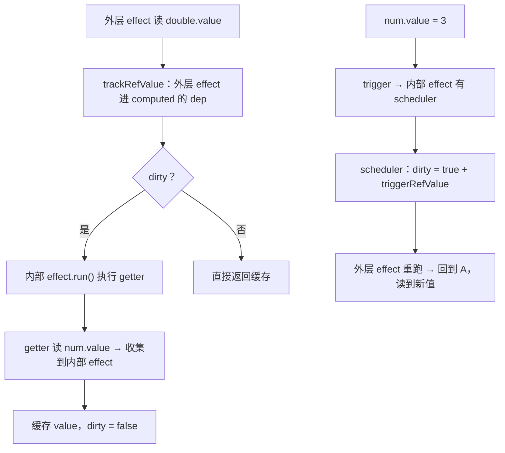

# 04 - ref、computed 与 watch

> 对应大纲模块 04（核心层 · 精讲） | 预计时间：2 天
> 面试可答：ref 解决「基本类型无法代理」与「解构丢响应式」；computed 用脏标记实现惰性与缓存、靠 scheduler 维持响应式链路；watch 本质是「effect + scheduler + 新旧值回调」。

---

## 学习目标

- 实现 `ref`：value 拦截、对象值内部转 reactive、相同值短路（Object.is）
- 实现 `computed`：dirty 惰性求值 + 缓存 + 「computed 又被别人依赖」的响应式链路
- 实现 `watch`：ref / reactive / getter 三种 source、immediate、deep、stop
- 体会 02 篇的栈恢复与 deps 反向记录、03 篇的 scheduler 在这里如何全部用上

---

## 测试先行

三个 spec 文件，按依赖顺序实现。

```ts
// src/reactivity/__tests__/ref.spec.ts
import { describe, expect, it } from 'vitest'
import { effect, isRef, proxyRefs, ref, unref } from '../index'

describe('ref', () => {
  it('基础：value 读写响应', () => {
    const num = ref(1)
    let dummy: number | undefined
    effect(() => {
      dummy = num.value
    })
    expect(dummy).toBe(1)

    num.value = 2
    expect(dummy).toBe(2)
  })

  it('相同值不触发（Object.is 比较）', () => {
    const num = ref(1)
    let calls = 0
    effect(() => {
      calls++
      void num.value
    })
    expect(calls).toBe(1)

    num.value = 1
    expect(calls).toBe(1)
  })

  it('对象值：内部转 reactive，深层可响应', () => {
    const state = ref({ age: 1 })
    let dummy: number | undefined
    effect(() => {
      dummy = state.value.age
    })

    state.value.age = 2 // 走内部 reactive 的拦截
    expect(dummy).toBe(2)

    state.value = { age: 3 } // 整体替换走 ref 自己的 set
    expect(dummy).toBe(3)
  })

  it('isRef / unref', () => {
    const num = ref(1)
    expect(isRef(num)).toBe(true)
    expect(isRef({ value: 1 })).toBe(false)
    expect(unref(num)).toBe(1)
    expect(unref(5)).toBe(5)
  })

  it('proxyRefs：读取解包、赋值反向包装', () => {
    const user = {
      age: ref(18),
      name: 'tom',
    }
    const p = proxyRefs(user)

    expect(p.age).toBe(18) // 读取时自动解包
    p.age = 20 // 赋值时写回 ref.value
    expect(user.age.value).toBe(20)

    p.name = 'jerry' // 非 ref 属性正常读写
    expect(p.name).toBe('jerry')
  })
})
```

```ts
// src/reactivity/__tests__/computed.spec.ts
import { describe, expect, it } from 'vitest'
import { computed, effect, ref } from '../index'

describe('computed', () => {
  it('惰性：创建时不执行 getter，读取时才算', () => {
    let calls = 0
    const c = computed(() => {
      calls++
      return 1
    })
    expect(calls).toBe(0)

    void c.value
    expect(calls).toBe(1)
  })

  it('缓存：依赖不变，多次读取只算一次', () => {
    const num = ref(1)
    let calls = 0
    const double = computed(() => {
      calls++
      return num.value * 2
    })
    void double.value
    void double.value
    void double.value
    expect(calls).toBe(1)
  })

  it('依赖变化 → 脏标记 → 下次读取重算', () => {
    const num = ref(1)
    const double = computed(() => num.value * 2)
    expect(double.value).toBe(2)

    num.value = 2
    expect(double.value).toBe(4) // 读取时才重算
  })

  it('computed 可被其他 effect 依赖（响应式链路）', () => {
    const num = ref(1)
    const double = computed(() => num.value * 2)
    let dummy: number | undefined
    effect(() => {
      dummy = double.value
    })
    expect(dummy).toBe(2)

    num.value = 3
    expect(dummy).toBe(6) // ref 变 → computed 打脏并通知 → effect 重跑读到新值
  })
})
```

```ts
// src/reactivity/__tests__/watch.spec.ts
import { describe, expect, it, vi } from 'vitest'
import { reactive, ref, watch } from '../index'

describe('watch', () => {
  it('getter source：回调拿到新旧值', () => {
    const num = ref(1)
    const cb = vi.fn()
    watch(() => num.value, cb)

    num.value = 2
    expect(cb).toHaveBeenCalledTimes(1)
    expect(cb).toHaveBeenCalledWith(2, 1)
  })

  it('ref source：直接传 ref', () => {
    const num = ref(1)
    const cb = vi.fn()
    watch(num, cb)

    num.value = 2
    expect(cb).toHaveBeenCalledWith(2, 1)
  })

  it('reactive source：自动 deep', () => {
    const state = reactive({ nested: { count: 1 } })
    const cb = vi.fn()
    watch(state, cb)

    state.nested.count = 2
    expect(cb).toHaveBeenCalledTimes(1)
  })

  it('immediate：立即执行一次', () => {
    const num = ref(1)
    const cb = vi.fn()
    watch(() => num.value, cb, { immediate: true })

    expect(cb).toHaveBeenCalledTimes(1)
    expect(cb).toHaveBeenCalledWith(1, undefined)
  })

  it('值未变化不回调', () => {
    const num = ref(1)
    const cb = vi.fn()
    watch(() => num.value, cb)

    num.value = 1
    expect(cb).not.toHaveBeenCalled()
  })

  it('stop：停止后不再触发', () => {
    const num = ref(1)
    const cb = vi.fn()
    const stop = watch(() => num.value, cb)

    num.value = 2
    expect(cb).toHaveBeenCalledTimes(1)

    stop()
    num.value = 3
    expect(cb).toHaveBeenCalledTimes(1)
  })
})
```

---

## 实现拆解

### 第 0 步：公共工具（isObject 已在 02 篇入座，这里补全）

```ts
// src/reactivity/utils.ts
export const isObject = (value: unknown): value is Record<PropertyKey, any> =>
  typeof value === 'object' && value !== null

export const isFunction = (value: unknown): value is (...args: any[]) => any =>
  typeof value === 'function'

export const hasChanged = (a: unknown, b: unknown) => !Object.is(a, b)
```

### 第 1 步：ref——给基本类型一个「可代理的壳」

Proxy 只能包对象，`ref(1)` 的 1 没法被拦截。ref 的思路：**把值塞进 `.value` 属性，用 class 的 getter/setter 拦截**：

```ts
// src/reactivity/ref.ts
import { activeEffect, type ReactiveEffect } from './effect'
import { reactive } from './reactive'
import { hasChanged, isObject } from './utils'

export interface Ref<T = any> {
  value: T
  readonly __v_isRef: true
}

class RefImpl<T> implements Ref<T> {
  private _rawValue: T // 原始值：用于变化比对
  private _value: T // 内部值：对象会被转成 reactive
  dep: Set<ReactiveEffect> = new Set() // 依赖我的 effect 集合
  readonly __v_isRef: true = true

  constructor(value: T) {
    this._rawValue = value
    this._value = isObject(value) ? reactive(value) : value
  }

  get value(): T {
    trackRefValue(this.dep) // 收集：与 track 同理，只是 key 恒为 value
    return this._value
  }

  set value(newVal: T) {
    if (hasChanged(newVal, this._rawValue)) {
      this._rawValue = newVal
      this._value = isObject(newVal) ? reactive(newVal) : newVal
      triggerRefValue(this.dep) // scheduler 优先：为 computed 链路留的路
    }
  }
}

/** 把 activeEffect 收进指定 dep——ref 与 computed 共用 */
export function trackRefValue(dep: Set<ReactiveEffect>) {
  if (activeEffect) {
    dep.add(activeEffect)
    activeEffect.deps.add(dep) // 反向记录：stop/cleanup 才能从 ref 依赖中摘除
  }
}

/** 逐个触发 dep 里的 effect——scheduler 优先，默认重跑 */
export function triggerRefValue(dep: Set<ReactiveEffect>) {
  // 复制一份再遍历：effect.run() 的 cleanup 会从 dep 删除并重新收集自己，
  // 直接遍历原 Set 会把遍历期间新增的元素也访问到 → 无限递归（02 篇原则在 ref 路径同样适用）
  const effectsToRun = new Set(dep)
  effectsToRun.forEach((effect) => {
    if (effect.scheduler) effect.scheduler(effect)
    else effect.run()
  })
}

export function ref<T>(value: T): Ref<T> {
  return new RefImpl(value)
}

export function isRef(value: unknown): value is Ref {
  return !!(value && (value as Ref).__v_isRef)
}

export function unref<T>(value: T | Ref<T>): T {
  return isRef(value) ? value.value : (value as T)
}

type UnwrapRef<T> = T extends Ref<infer V> ? V : T

/** 组件 setup 返回值挂到实例上时的解包层（08 篇用到） */
export function proxyRefs<T extends object>(objectWithRefs: T) {
  return new Proxy(objectWithRefs, {
    get(target, key, receiver) {
      return unref(Reflect.get(target, key, receiver))
    },
    set(target, key, value, receiver) {
      const existing = Reflect.get(target, key, receiver)
      // 旧值是 ref、新值不是：写进 ref.value（保留响应性），而不是覆盖属性
      if (isRef(existing) && !isRef(value)) {
        existing.value = value
        return true
      }
      return Reflect.set(target, key, value, receiver)
    },
  }) as { [K in keyof T]: UnwrapRef<T[K]> }
}
```

两个设计点：

- **`_rawValue` 与 `_value` 分离**：存对象时 `_value` 是 reactive 代理、`_rawValue` 是原始对象。比对用 raw（避免代理与原始值比较恒不等），返回用代理（深层可响应）
- **为什么需要 ref**：① 基本类型无法被 Proxy 包住；② reactive 对象解构/展开后属性变成裸值，响应性丢失——ref 让「值本身」带着响应性到处传

### 第 2 步：computed——惰性 + 缓存 + 链路

computed 内部藏着一个 effect，但它的更新策略由 scheduler 接管：**变化时不重算，只打脏标记 + 通知订阅者**。收集与触发复用第 1 步 ref.ts 里已定义的 `trackRefValue` / `triggerRefValue`：

```ts
// src/reactivity/computed.ts（最终完整版）
import { ReactiveEffect } from './effect'
import { trackRefValue, triggerRefValue } from './ref'

export interface ComputedRef<T = any> {
  readonly value: T
  readonly __v_isRef: true
}

export function computed<T>(getter: () => T): ComputedRef<T> {
  let dirty = true
  let value: T
  const dep = new Set<ReactiveEffect>()

  const effectInstance = new ReactiveEffect(getter, () => {
    // 依赖变化：不重算（惰性），只打脏 + 通知订阅我的 effect
    if (!dirty) {
      dirty = true
      triggerRefValue(dep)
    }
  })

  const computedRef = {
    __v_isRef: true,
    get value(): T {
      trackRefValue(dep) // 外层 effect 收集 computed
      if (dirty) {
        value = effectInstance.run() // 内部 effect 执行 getter（栈恢复保证外层 activeEffect 不被破坏）
        dirty = false
      }
      return value
    },
  }

  return computedRef as ComputedRef<T>
}
```

> `activeEffect` 需要在 effect.ts 里导出（02 版本它还是模块内私有变量，加一个 `export` 即可）。

**响应式链路全图**：



三问三答吃透它：

- 为什么惰性？——没人读就不算，浪费归零
- 为什么缓存？——`dirty` 为 false 时直接吐 `value`，多次读取一次计算
- 为什么链路通？——外层 effect 收集了 computed（trackRefValue），computed 的内部 effect 被 scheduler 接管；ref 一变 → scheduler 打脏 + 通知 → 外层重跑时脏了就重算

### 第 3 步：watch——effect + scheduler + 新旧值

```ts
// src/reactivity/watch.ts
import { ReactiveEffect } from './effect'
import { isReactive } from './reactive'
import { isRef } from './ref'
import { hasChanged, isFunction, isObject } from './utils'

type WatchSource<T> = () => T
type WatchCallback<V, OV> = (newValue: V, oldValue: OV | undefined) => void

interface WatchOptions {
  immediate?: boolean
  deep?: boolean
}

export function watch<T>(
  source: WatchSource<T> | { value: T } | object,
  cb: WatchCallback<T, T | undefined>,
  options: WatchOptions = {},
) {
  let getter: () => any
  // reactive source 强制 deep：traverse 返回同一引用，hasChanged 恒 false，必须 deep 直通
  const isDeep = !!options.deep || isReactive(source)

  if (isReactive(source)) {
    // reactive 对象：deep 自动开启，遍历所有属性建立依赖
    getter = () => traverse(source)
  } else if (isRef(source)) {
    getter = () => source.value
  } else if (isFunction(source)) {
    getter = source
  } else {
    throw new TypeError('watch source 只支持 ref / reactive / getter 函数')
  }

  // getter 形式 + deep：把返回值也展开遍历
  if (options.deep && !isReactive(source)) {
    const baseGetter = getter
    getter = () => traverse(baseGetter())
  }

  let oldValue: T | undefined

  const job = () => {
    const newValue = effectInstance.run()
    if (isDeep || hasChanged(newValue, oldValue)) {
      cb(newValue, oldValue)
      oldValue = newValue
    }
  }

  const effectInstance = new ReactiveEffect(getter, job)

  if (options.immediate) {
    job() // oldValue 为 undefined
  } else {
    oldValue = effectInstance.run() // 先跑一次：建立依赖 + 记录初始值
  }

  // 停止函数：依赖 02 篇的 active 标记 + cleanup
  return () => effectInstance.stop()
}

/** 递归读取所有属性，让深层依赖都被 track；seen 防循环引用 */
function traverse(value: unknown, seen = new Set<unknown>()): unknown {
  if (!isObject(value) || seen.has(value)) return value
  seen.add(value)
  for (const key in value as object) {
    traverse((value as Record<PropertyKey, unknown>)[key], seen)
  }
  return value
}
```

三个要点：

- **deep 的本质**：不是什么「深度监听算法」，就是**遍历读一遍所有属性**，让它们全部进 dep。`JSON.parse(JSON.stringify(...))` 式的读取，代价也是深对象大时贵。reactive source 自动强制 deep（`isDeep`）：traverse 每次返回同一引用，靠 hasChanged 判断会永远不回调
- **job 里 run 一次拿新值**：effect.run() 返回 fn 结果（01 篇埋的伏笔），新旧值天然拿到
- **stop**：02 篇在 run() 里留的 `active` 守卫 + cleanupEffect 在这里收口——stop 后 dep 里没有自己，trigger 找不到，回调整体失活

### 第 4 步：effect.ts 增量与出口

```ts
// src/reactivity/effect.ts（04 增量：两处改动，其余同 03 版）
// ① activeEffect 加导出
export let activeEffect: ReactiveEffect | undefined

// ② ReactiveEffect 增加 stop（run() 的 !active 守卫 02 版已有）
stop() {
  if (this.active) {
    cleanupEffect(this)
    this.active = false
  }
}
```

```ts
// src/reactivity/reactive.ts（04 增量：ReactiveFlags）
export const ReactiveFlags = {
  IS_REACTIVE: '__v_isReactive',
} as const

// get 拦截器开头加一行短路（其余保持 02 完整版：receiver 透传、惰性深层代理）：
get(target, key, receiver) {
  if (key === ReactiveFlags.IS_REACTIVE) return true
  track(target, key)
  const res = Reflect.get(target, key, receiver)
  if (isObject(res)) return reactive(res) // 02 篇的惰性深层代理
  return res
}

export function isReactive(value: unknown): boolean {
  return !!(value && (value as Record<PropertyKey, unknown>)[ReactiveFlags.IS_REACTIVE])
}
```

```ts
// src/reactivity/index.ts（04 最终版）
export { reactive, isReactive, ReactiveFlags } from './reactive'
export { effect, ReactiveEffect, ITERATE_KEY, activeEffect } from './effect'
export type { ReactiveEffectOptions, ReactiveEffectRunner } from './effect'
export { ref, isRef, unref, proxyRefs } from './ref'
export type { Ref } from './ref'
export { computed } from './computed'
export type { ComputedRef } from './computed'
export { watch } from './watch'
export { nextTick, queueJob } from './scheduler'
```

---

## 对照源码

vuejs/core（3.5 稳定线）对应实现：

| 教学版 | vuejs/core | 说明 |
| --- | --- | --- |
| `RefImpl` class + dep Set | `packages/reactivity/src/ref.ts` | 结构几乎一致（`_value`/`_rawValue`、对象转 reactive、`__v_isRef`）；真实版收集/触发走 `dep.ts` 的 Dep 抽象，3.5 起为链表 + 版本计数 |
| `computed` dirty + scheduler | `packages/reactivity/src/computed.ts` | **关键差异**：教学版是 3.4 之前的经典模型；3.4 起重写为「版本计数比对」——内部 effect 不再靠 scheduler 打脏，而是比对 dep 的 version，惰性与缓存语义不变、中断恢复等边界更稳 |
| `proxyRefs` | `packages/runtime-core/src/ref.ts` | 一致，组件 setup 返回值挂在 instance 上时就包了这层（08 篇） |
| `watch` 同步 job | `packages/runtime-core/src/apiWatch.ts` | **关键差异**：真实版默认 `flush: 'pre'`——回调进 scheduler 队列、排在组件更新前；还支持数组 source、`onCleanup`、`deep` 用 depth 控制遍历深度、`watchEffect` 系列封装 |
| `isReactive` 短路 | `packages/reactivity/src/constants.ts` + `baseHandlers.ts` | 一致；真实版 ReactiveFlags 共 6 个（SKIP / IS_REACTIVE / IS_READONLY / IS_SHALLOW / RAW / IS_REF，v3.5.43 constants.ts 已核对） |

> 对照入口：[vuejs/core/packages/reactivity](https://github.com/vuejs/core/tree/main/packages/reactivity)（ref.ts / computed.ts）、[packages/runtime-core/src/apiWatch.ts](https://github.com/vuejs/core/blob/main/packages/runtime-core/src/apiWatch.ts)

---

## 常见踩坑点

- ❌ computed 的 getter 里读取自身——value getter 重入，无限循环；真实版直接报警告
- ❌ 02 篇没做栈恢复——`effectInstance.run()` 执行 getter 时把 activeEffect 换成内部 effect 且不还原，外层 effect 后续读取全部收集错，链路测试必挂
- ❌ 变化比对用 `!==`——NaN 不等于 NaN，会永远判定「变化了」；必须 `Object.is`（hasChanged）
- ❌ traverse 不带 seen 集合——循环引用（`obj.self = obj`）无限递归爆栈
- ❌ triggerRefValue 直接遍历 dep——effect.run() 的 cleanup 会从 dep 删除并重新收集自己，Set.forEach 会访问遍历期间新增的元素 → 外层 effect 无限重跑（实测死循环、测试进程挂起）；02 篇「先复制再遍历」在 ref 路径同样适用
- ❌ watch 的 reactive source 靠 `hasChanged` 判断——traverse 返回同一引用恒等，回调永不触发；必须 `isDeep = deep || isReactive(source)` 强制直通（教学实测踩过）
- ❌ proxyRefs 的 set 无脑 `Reflect.set`——ref 属性会被整个覆盖成裸值，响应性丢失；先判断「旧值是 ref 且新值不是」

---

## 面试高频问题

1. ref 和 reactive 的区别？为什么需要 ref？
2. computed 的缓存是怎么实现的？它凭什么能被其他 effect 依赖？
3. computed 和 watch 的区别与选用？
4. watch 的实现原理？deep 是怎么做的？

---

## 面试回答模板

> **问：ref 和 reactive 的区别？为什么需要 ref？**
>
> **答：** reactive 基于 Proxy，只能代理对象/数组/集合，对基本类型无能为力；且它是「属性的响应式」——解构或展开后属性变裸值，响应性丢失。ref 用 class 的 get/set value 拦截，把任意值（含基本类型）包进 `.value`，让「值本身」可追踪、可传递。约定：响应式对象用 reactive，单值与需要传递/解构的状态用 ref。ref 包对象时内部转 reactive，兼顾深层响应。ref 顶层属性在模板里会自动解包，靠的也是 proxyRefs 这层。

> **问：computed 的缓存怎么实现的？凭什么能被别的 effect 依赖？**
>
> **答：** 两个内部状态：dirty 脏标记和 value 缓存。读取时 dirty 为 false 直接吐缓存；依赖变化时，内部 effect 的 scheduler 不重算（惰性），只把 dirty 置回 true 并通知订阅者，等下次读取才真正重算。链路成立的关键是双依赖体系：外层 effect 读取 computed.value 时被 track 进 computed 自己的 dep；内部 effect 由 getter 里读到的响应式数据驱动——ref 一变触发内部 effect 的 scheduler，打脏 + triggerRefValue 通知外层重跑。另外内部 effect 能嵌套运行，靠的是 run() 的 effectStack 栈恢复。

> **问：computed 和 watch 怎么选？**
>
> **答：** computed 是「派生值」——产出数据、有缓存、惰性，适合模板里要用的衍生状态（总价、过滤后列表）；watch 是「副作用」——产出动作，值变化时执行回调（请求、DOM 操作、持久化）。经验法则：能用 computed 算出来的不 watch 回调里手写，避免中间态；watch 适合「变化后做一件事」而非「变化后得到一个值」。

> **问：watch 的实现原理？deep 怎么做？**
>
> **答：** watch = ReactiveEffect + scheduler + 新旧值管理。把 source 归一化成 getter（ref → 读 value；reactive → traverse；函数 → 直接用），创建内部 effect，scheduler 指向 job：job 里重跑 getter 拿新值，与旧值 Object.is 比较（或 deep 强制）后回调并滚动旧值。deep 没有黑魔法——traverse 递归读取所有属性（带 seen 防循环引用），把它们全部收集成依赖，任何深层变化都能命中；reactive source 默认开启。stop 则复用 effect 的 cleanup + active 标记，取消全部依赖收集。

---

## 练习

**要求**：用自研响应式 API 实现一个秒表模块：`running`（ref，是否计时）、`elapsed`（ref，秒数，定时器里自增）、`formatted`（computed，输出 `mm:ss`）、`watch(formatted)` 当分钟数进位时打一条日志；提供 `stop()` 一键暂停并取消日志监听。

**提示**：定时器回调里改 `elapsed` 不在 effect 内，不会误收集、但会正常 trigger；`formatted` 里用 `Math.floor` 与取余；watch 停止用返回的 stop 函数。

**预期效果**：改 `running` / `elapsed` 时 `formatted` 自动更新且有缓存（读 N 次只算到依赖变化为止）；分钟进位时日志恰好一条；`stop()` 后秒表停走（clearInterval）且日志不再出现。全链路只用 01~04 篇的自研 API，不 import vue。

---

## 本篇完成标准

- [ ] 01~03 全部测试 + 本篇 15 条测试全绿（00~04 累计 32 条，tsc --noEmit 零错误）
- [ ] 能画出 computed 响应式链路图，并指出 effectStack / scheduler / trackRefValue 各自的位置
- [ ] 能脱稿答四道面试题
- [ ] 至此 `src/reactivity` 收官：05 篇速过工具 API 后进入 runtime（06 篇 vnode 与 h）
