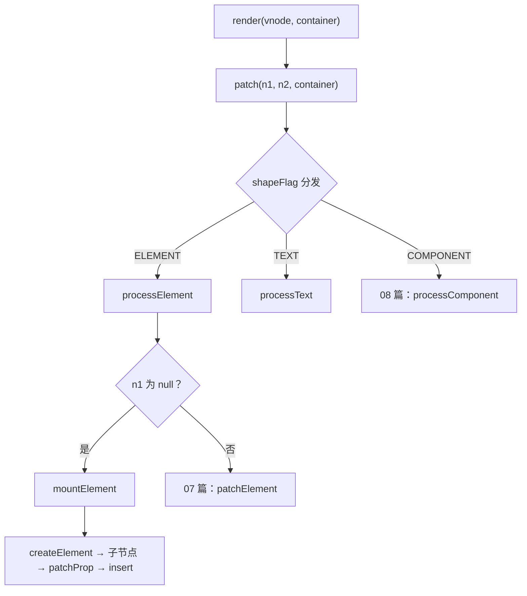

# 06 - vnode 与 h

> 对应大纲模块 06（核心层 · 精讲） | 预计时间：2 天
> 面试可答：vnode 是「用 JS 对象描述 DOM」的中间层；shapeFlag 用位运算在一个数字上叠加类型标记；createRenderer 通过注入平台实现（nodeOps/patchProp）把「渲染的算法」与「平台的操作」解耦。

---

## 学习目标

- 设计 vnode 数据结构与 `h()`：type / props / children / shapeFlag / key / el
- 理解 children 归一化：原始值 → Text vnode，单个 vnode → 数组
- 用位运算维护 shapeFlag，实现 `patch` 的类型分发
- 实现 `createRenderer` + runtime-dom 平台层（nodeOps），跑通「render → mount → DOM」

---

## 测试先行

新建 `src/runtime-core/__tests__/renderer.spec.ts`：

```ts
// src/runtime-core/__tests__/renderer.spec.ts
import { describe, expect, it } from 'vitest'
import { h, ShapeFlags, Text, type VNode } from '../index'
import { render } from '../../runtime-dom'

describe('vnode 与 h', () => {
  it('h 创建元素 vnode：shapeFlag 与字段', () => {
    const vnode = h('div', { id: 'app' }, 'hello')
    expect(vnode.type).toBe('div')
    expect(vnode.props).toEqual({ id: 'app' })
    expect(vnode.children).toBe('hello')
    expect(vnode.shapeFlag & ShapeFlags.ELEMENT).toBeTruthy()
    expect(vnode.shapeFlag & ShapeFlags.TEXT_CHILDREN).toBeTruthy()
    expect(vnode.el).toBeNull()
    expect(vnode.key).toBeNull()
  })

  it('位运算叠加：多个 flag 共存于一个数字', () => {
    const vnode = h('div', null, 'x')
    expect(vnode.shapeFlag).toBe(ShapeFlags.ELEMENT | ShapeFlags.TEXT_CHILDREN)
  })

  it('数组 children 归一化：原始值转 Text vnode', () => {
    const vnode = h('div', null, ['a', h('span'), 2])
    expect(vnode.shapeFlag & ShapeFlags.ARRAY_CHILDREN).toBeTruthy()
    const children = vnode.children as VNode[]
    expect(children[0].type).toBe(Text)
    expect(children[1].type).toBe('span')
    expect(children[2].children).toBe('2')
  })
})

describe('render 挂载与卸载', () => {
  it('mount：元素 + 文本 children + props', () => {
    const container = document.createElement('div')
    render(h('div', { id: 'app' }, 'hello'), container)
    expect(container.innerHTML).toBe('<div id="app">hello</div>')
  })

  it('mount：数组 children', () => {
    const container = document.createElement('div')
    render(h('ul', null, [h('li', null, 'a'), h('li', null, 'b')]), container)
    expect(container.querySelectorAll('li').length).toBe(2)
    expect(container.textContent).toBe('ab')
  })

  it('文本 vnode', () => {
    const container = document.createElement('div')
    render(h(Text, null, 'hi'), container)
    expect(container.textContent).toBe('hi')
  })

  it('render(null) 卸载', () => {
    const container = document.createElement('div')
    render(h('div', null, 'x'), container)
    expect(container.innerHTML).toBe('<div>x</div>')
    render(null, container)
    expect(container.innerHTML).toBe('')
  })
})
```

---

## 实现拆解

### 第 1 步：vnode.ts——UI 的 JS 描述层

```ts
// src/runtime-core/vnode.ts
export const Text = Symbol('Text')

export const ShapeFlags = {
  ELEMENT: 1, // 0b00001
  TEXT: 1 << 1, // 0b00010
  COMPONENT: 1 << 2, // 0b00100
  TEXT_CHILDREN: 1 << 3, // 0b01000
  ARRAY_CHILDREN: 1 << 4, // 0b10000
} as const

export interface VNode {
  type: any
  props: Record<string, any> | null
  children: any
  shapeFlag: number
  key: string | number | symbol | null
  el: any
  /** 组件 vnode 挂其内部实例（08~09 篇）；元素 vnode 为空 */
  component?: any
  __v_isVNode: true
}

export function isVNode(value: unknown): value is VNode {
  return !!(value && (value as VNode).__v_isVNode)
}

export function createVNode(
  type: any,
  props?: Record<string, any> | null,
  children?: any,
): VNode {
  const vnode: VNode = {
    type,
    props: props ?? null,
    children,
    key: (props && props.key) ?? null,
    el: null,
    shapeFlag: 0,
    __v_isVNode: true,
  }
  if (type === Text) {
    vnode.shapeFlag |= ShapeFlags.TEXT
  } else if (typeof type === 'string') {
    vnode.shapeFlag |= ShapeFlags.ELEMENT
  } else {
    vnode.shapeFlag |= ShapeFlags.COMPONENT // 对象类型 → 组件（08 篇）
  }

  // children 归一化：把「可能形态」收敛成两种
  if (typeof children === 'string') {
    vnode.shapeFlag |= ShapeFlags.TEXT_CHILDREN
  } else if (Array.isArray(children)) {
    vnode.shapeFlag |= ShapeFlags.ARRAY_CHILDREN
    normalizeChildren(children)
  } else if (isVNode(children)) {
    // 单个 vnode 子节点（常见于 slot 返回值）→ 包装为数组
    vnode.children = [children]
    vnode.shapeFlag |= ShapeFlags.ARRAY_CHILDREN
  }
  return vnode
}

function normalizeChildren(children: any[]) {
  for (let i = 0; i < children.length; i++) {
    if (!isVNode(children[i])) {
      children[i] = createVNode(Text, null, String(children[i]))
    }
  }
}

export const h = createVNode
```

三个设计点：

- **shapeFlag 位运算**：一个数字同时表达「我是什么」和「我的 children 是什么」，后续判断全部是 `flag & FLAG` 的位与，零字符串比较。位值与 vuejs/core 对齐（ELEMENT=1、TEXT_CHILDREN=8、ARRAY_CHILDREN=16）
- **children 归一化**：`['a', h('span'), 2]` 混合形态收敛为「全是 vnode 的数组」——patch 与 diff 从此只需要面对 vnode，10 篇 diff 的前提
- **`el: null`**：vnode 是纯描述，el 在 mount 时由渲染器回填——它是「vnode ↔ 真实 DOM」的唯一纽带，unmount/diff 全靠它

### 第 2 步：renderer.ts——渲染算法与平台解耦

`createRenderer` 只认「平台能力接口」，不认 DOM：

```ts
// src/runtime-core/renderer.ts（06 版本）
import { ShapeFlags, type VNode } from './vnode'

export interface HostImplementations {
  createElement(type: string): any
  createText(text: string): any
  setText(node: any, text: string): void
  setElementText(el: any, text: string): void
  insert(child: any, parent: any, anchor?: any): void
  remove(child: any): void
  patchProp(el: any, key: string, prevValue: any, nextValue: any): void
}

export function createRenderer(hostImpls: HostImplementations) {
  const {
    createElement,
    createText,
    setText,
    setElementText,
    insert,
    remove,
    patchProp,
  } = hostImpls

  function render(vnode: VNode | null, container: any) {
    if (vnode === null) {
      if (container._vnode) {
        unmount(container._vnode)
      }
      container._vnode = null
      return
    }
    patch(container._vnode ?? null, vnode, container)
    container._vnode = vnode
  }

  function patch(n1: VNode | null, n2: VNode, container: any) {
    if (n1 === n2) return
    const { shapeFlag } = n2
    if (shapeFlag & ShapeFlags.ELEMENT) {
      processElement(n1, n2, container)
    } else if (shapeFlag & ShapeFlags.TEXT) {
      processText(n1, n2, container)
    } else if (shapeFlag & ShapeFlags.COMPONENT) {
      // 08 篇实现组件
    }
  }

  function processText(n1: VNode | null, n2: VNode, container: any) {
    if (n1 === null) {
      n2.el = createText(n2.children as string)
      insert(n2.el, container)
    } else {
      const el = (n2.el = n1.el)
      if (n2.children !== n1.children) {
        setText(el, n2.children as string)
      }
    }
  }

  function processElement(n1: VNode | null, n2: VNode, container: any) {
    if (n1 === null) {
      mountElement(n2, container)
    } else {
      // 07 篇实现元素级 patch
    }
  }

  function mountElement(vnode: VNode, container: any) {
    const el = (vnode.el = createElement(vnode.type as string))
    const { children, shapeFlag, props } = vnode
    if (shapeFlag & ShapeFlags.TEXT_CHILDREN) {
      setElementText(el, children as string)
    } else if (shapeFlag & ShapeFlags.ARRAY_CHILDREN) {
      mountChildren(children as VNode[], el)
    }
    if (props) {
      for (const key in props) {
        patchProp(el, key, null, props[key])
      }
    }
    insert(el, container)
  }

  function mountChildren(children: VNode[], container: any) {
    children.forEach((child) => patch(null, child, container))
  }

  function unmount(vnode: VNode) {
    remove(vnode.el)
  }

  return { render }
}
```

约定两条语义，后续所有篇目都沿用：

- **n1 = null 表示挂载，n1 有值表示对比更新**——`patch` 是全系列唯一的入口动词
- **`container._vnode` 记住上次渲染的树**——render(null) 卸载、以及 07 篇的对比更新都依赖它



### 第 3 步：runtime-dom——平台层落地

```ts
// src/runtime-dom/nodeOps.ts
export const nodeOps = {
  createElement: (type: string) => document.createElement(type),
  createText: (text: string) => document.createTextNode(text),
  setText: (node: any, text: string) => {
    node.nodeValue = text
  },
  setElementText: (el: any, text: string) => {
    el.textContent = text
  },
  insert: (child: any, parent: any, anchor: any = null) => {
    parent.insertBefore(child, anchor)
  },
  remove: (child: any) => {
    const parent = child.parentNode
    if (parent) {
      parent.removeChild(child)
    }
  },
}
```

```ts
// src/runtime-dom/patchProp.ts（06 临时版：先让管线跑通，07 篇替换为四类处理）
export function patchProp(el: any, key: string, prevValue: any, nextValue: any) {
  if (nextValue == null) {
    el.removeAttribute(key)
  } else {
    el.setAttribute(key, nextValue)
  }
}
```

```ts
// src/runtime-dom/index.ts
import { createRenderer } from '../runtime-core'
import { nodeOps } from './nodeOps'
import { patchProp } from './patchProp'

export const renderer = createRenderer({ ...nodeOps, patchProp })
export const render = renderer.render
```

### 第 4 步：出口

```ts
// src/runtime-core/index.ts
export { h, createVNode, isVNode, ShapeFlags, Text, type VNode } from './vnode'
export { createRenderer } from './renderer'
export type { HostImplementations } from './renderer'
```

---

## 对照源码

vuejs/core（v3.5.43）对应实现：

| 本篇实现 | vuejs/core | 说明 |
| --- | --- | --- |
| `createVNode` / `h` | `packages/runtime-core/src/vnode.ts` | 真实版还做 `cloneIfMounted`、`normalizeVNode`、debug 信息，类型多 Fragment/Suspense/Teleport 等 |
| `ShapeFlags` 位值 | `packages/shared/src/shapeFlags.ts` | 位值对齐（ELEMENT=1、TEXT_CHILDREN=8、ARRAY_CHILDREN=16）；真实版另有 FUNCTIONAL、SLOTS_CHILDREN、TELEPORT 等 |
| `createRenderer(hostImpls)` | `packages/runtime-core/src/index.ts` 的 `createRenderer(options)` | 真实版 options 共 13 个可选 host 函数（多了 createComment / parentNode / nextSibling / querySelector / setScopeId / cloneNode 等），返回 `{ render, createApp }`；patchStyle/patchEvent 不在 options 里，由 runtime-dom 的 patchProp 内部调 modules——解耦思想一致 |
| `nodeOps` | `packages/runtime-dom/src/nodeOps.ts` | 结构一致；真实版 insert/remove 处理 SVG 与 parent 缺失等边界 |
| 临时版 `patchProp` | `packages/runtime-dom/src/patchProp.ts` → `patchAttr/patchDOMProp/patchEvent/patchStyle/patchClass` | 07 篇对齐 |

> 对照入口：[vuejs/core/packages/runtime-core](https://github.com/vuejs/core/tree/main/packages/runtime-core)、[packages/runtime-dom](https://github.com/vuejs/core/tree/main/packages/runtime-dom)

---

## 常见踩坑点

- ❌ children 归一化漏做——数组里的原始值被当 vnode 用，mount 时取 `.type` 直接炸；「patch 只面对 vnode」是 10 篇 diff 能写简洁的前提
- ❌ `render(null)` 后忘记清 `container._vnode`——下次 render 拿着已卸载的旧 vnode 做 patch，行为诡异
- ❌ `unmount` 直接 `child.remove()` 而不查 `parentNode`——child 尚未插入容器时 remove 会抛错；真实版同样先判 parent
- ❌ mount 时先 insert 再挂 children/props——顺序应为「建节点 → 填 children → 打 props → 插入容器」，否则会出现中间态 DOM
- ❌ `container._vnode` 存到模块级变量——多容器并存时互相串树

---

## 面试高频问题

1. 什么是虚拟 DOM？为什么需要它？
2. shapeFlag 为什么用位运算而不是字符串/布尔字段？
3. 什么是自定义渲染器？Vue 是怎么做到「渲染逻辑与平台解耦」的？

---

## 面试回答模板

> **问：什么是虚拟 DOM？为什么需要它？**
>
> **答：** vnode 是用普通 JS 对象对 UI 的描述（type/props/children），它插在「状态」和「真实 DOM」之间。价值有三层：① 声明式——开发者只描述「UI 应该长什么样」，由框架负责最小化 DOM 操作；② 跨平台——vnode 与平台无关，同一套 vnode 可以渲染到 DOM、Canvas 甚至自定义宿主；③ 编译友好——模板编译产物（render 函数）产出 vnode，才能进一步携带 patchFlag 等优化信息。代价是生成与 diff 的运行时开销，Vue 3 用编译时标记把这部分压到最低。

> **问：shapeFlag 为什么用位运算？**
>
> **答：** 一个 vnode 需要同时表达多个正交维度：「我是元素/文本/组件」+「我的 children 是文本/数组/插槽」。用布尔字段要 N 个属性，用字符串判断每次都是比较开销；位运算把所有标记叠进一个数字（`ELEMENT=1、TEXT_CHILDREN=8…`），赋值用 `|=`，判断用 `&`，一次位与就出结果，且序列化、传递、存储都是一个字段。这也是 vuejs/core 的真实做法。

> **问：什么是自定义渲染器？**
>
> **答：** `createRenderer(hostImpls)` 把渲染算法（patch/diff/组件机制）与平台操作（怎么建节点、怎么打属性）分离：核心只依赖 `createElement/insert/patchProp` 等接口。runtime-dom 注入 DOM 实现得到浏览器渲染器，换成 Canvas 实例就能画到画布上——Vue 官方的 `@vue/runtime-test`（测试用）与 custom renderer API 都是同一机制。本质是依赖倒置：算法依赖抽象，平台提供实现。

---

## 练习

**要求**：用自研 runtime 渲染一个「`ul > li × 3`（第二个 li 带嵌套 span）」的树并断言 DOM 结构；随后 `render(null)` 卸载再重新挂载一棵新树；最后画一遍 patch 分发流程图。

**提示**：混合 children（字符串与 vnode 混排）会走 normalizeChildren；卸载看 `container._vnode` 的 `el` 指向。

**预期效果**：DOM 结构与预期一致；卸载后 `innerHTML` 为空；重挂后新 el 与旧 el 不是同一节点。能对照源码说出「normalize 发生在 createVNode 而不是 mount 时」的原因（保证 vnode 一经创建即为合法形态）。

---

## 本篇完成标准

- [ ] 七条测试全绿
- [ ] 能默画 patch 分发流程图，说出 HostImplementations 七个函数各自的职责
- [ ] 能答三道面试题，「自定义渲染器」能举出 runtime-dom 以外的宿主例子
