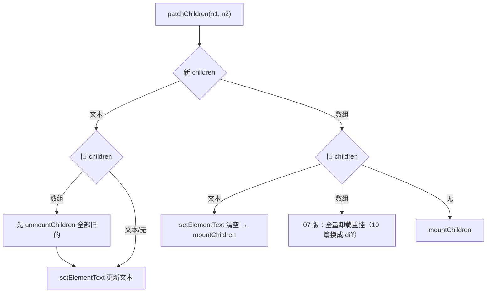

# 07 - 元素 mount 与 patch

> 对应大纲模块 07（核心层 · 精讲） | 预计时间：2 天
> 面试可答：同类型 vnode 复用 el，先 diff props 再 diff children；children 按新旧「文本/数组」四象限组合走不同分支；事件/class/style/属性在平台层 patchProp 各有各的打法。

---

## 学习目标

- 实现 `patchElement`：复用 el，props 的新增/修改/删除三分支
- 实现 `patchProp` 四类处理（事件 / class / style / 属性），替换 06 的临时 setAttribute 版
- 实现 `patchChildren`：新旧「文本/数组」四象限组合
- 处理「类型变了 → 卸旧挂新」的兜底，理解 key 在本篇的过滤规则

---

## 测试先行

新建 `src/runtime-core/__tests__/element.spec.ts`：

```ts
// src/runtime-core/__tests__/element.spec.ts
import { describe, expect, it } from 'vitest'
import { h } from '../index'
import { render } from '../../runtime-dom'

describe('元素 patch', () => {
  it('props 更新：id 变化', () => {
    const container = document.createElement('div')
    render(h('div', { id: 'a' }, 'x'), container)
    render(h('div', { id: 'b' }, 'x'), container)
    expect(container.innerHTML).toBe('<div id="b">x</div>')
  })

  it('props 删除', () => {
    const container = document.createElement('div')
    render(h('div', { id: 'a' }, 'x'), container)
    render(h('div', null, 'x'), container)
    expect(container.innerHTML).toBe('<div>x</div>')
  })

  it('事件更新：旧监听被移除', () => {
    const container = document.createElement('div')
    const calls: string[] = []
    render(h('button', { onClick: () => calls.push('old') }, 'btn'), container)
    render(h('button', { onClick: () => calls.push('new') }, 'btn'), container)
    container.querySelector('button')!.click()
    expect(calls).toEqual(['new'])
  })

  it('class / style 更新', () => {
    const container = document.createElement('div')
    render(h('div', { class: 'a', style: { color: 'red' } }, 'x'), container)
    render(h('div', { class: 'b', style: { color: 'blue' } }, 'x'), container)
    const el = container.querySelector('div') as HTMLElement
    expect(el.className).toBe('b')
    expect(el.style.color).toBe('blue')
  })

  it('TEXT_CHILDREN 更新', () => {
    const container = document.createElement('div')
    render(h('div', null, 'a'), container)
    render(h('div', null, 'b'), container)
    expect(container.textContent).toBe('b')
  })

  it('ARRAY_CHILDREN 更新', () => {
    const container = document.createElement('div')
    render(h('ul', null, [h('li', null, '1'), h('li', null, '2')]), container)
    render(h('ul', null, [h('li', null, '3')]), container)
    expect(container.querySelectorAll('li').length).toBe(1)
    expect(container.textContent).toBe('3')
  })

  it('数组 children → 文本 children 切换', () => {
    const container = document.createElement('div')
    render(h('div', null, [h('span', null, 's')]), container)
    render(h('div', null, 'text'), container)
    expect(container.textContent).toBe('text')
    expect(container.querySelector('span')).toBeNull()
  })

  it('类型变了：卸旧挂新', () => {
    const container = document.createElement('div')
    render(h('div', null, 'a'), container)
    render(h('span', null, 'b'), container)
    expect(container.innerHTML).toBe('<span>b</span>')
  })

  it('key 不进 DOM 属性', () => {
    const container = document.createElement('div')
    render(h('div', { key: 'k', id: 'x' }, 'a'), container)
    expect(container.innerHTML).toBe('<div id="x">a</div>')
  })
})
```

---

## 实现拆解

### 第 1 步：patch 的类型兜底

```ts
// src/runtime-core/renderer.ts（07 增量 ①）
function patch(n1: VNode | null, n2: VNode, container: any) {
  if (n1 === n2) return
  // 类型变了：旧 vnode 无法复用 el，卸载后按挂载处理
  if (n1 && n1.type !== n2.type) {
    unmount(n1)
    n1 = null
  }
  const { shapeFlag } = n2
  // ...分发逻辑与 06 一致，processElement 的 else 分支改为 patchElement
}
```

### 第 2 步：patchElement——复用 el，对比 props 与 children

```ts
// src/runtime-core/renderer.ts（07 增量 ②）
function patchElement(n1: VNode, n2: VNode) {
  const el = (n2.el = n1.el) // 复用 DOM 节点，这是「同类型才 patch」的意义
  const oldProps = n1.props ?? {}
  const newProps = n2.props ?? {}

  for (const key in newProps) {
    if (newProps[key] !== oldProps[key]) {
      patchProp(el, key, oldProps[key], newProps[key])
    }
  }
  // 新 props 里没有的旧 key：删除
  for (const key in oldProps) {
    if (!(key in newProps)) {
      patchProp(el, key, oldProps[key], null)
    }
  }

  patchChildren(n1, n2, el)
}

function unmountChildren(children: VNode[]) {
  children.forEach((child) => unmount(child))
}
```

### 第 3 步：patchChildren——新旧四象限

新旧 children 各有「文本 / 数组」两种形态，组合成四种更新路径：



```ts
// src/runtime-core/renderer.ts（07 增量 ③）
function patchChildren(n1: VNode, n2: VNode, container: any) {
  const prevShapeFlag = n1.shapeFlag
  const { shapeFlag } = n2
  const c1 = n1.children as VNode[]
  const c2 = n2.children

  if (shapeFlag & ShapeFlags.TEXT_CHILDREN) {
    // 新的是文本
    if (prevShapeFlag & ShapeFlags.ARRAY_CHILDREN) {
      unmountChildren(c1)
    }
    if (c1 !== c2) {
      setElementText(container, c2 as string)
    }
  } else {
    // 新的是数组
    if (prevShapeFlag & ShapeFlags.TEXT_CHILDREN) {
      setElementText(container, '')
      mountChildren(c2 as VNode[], container)
    } else if (prevShapeFlag & ShapeFlags.ARRAY_CHILDREN) {
      // 07 版：全量卸载重挂，够用但浪费——10 篇换成快速 diff
      unmountChildren(c1)
      mountChildren(c2 as VNode[], container)
    } else {
      // 旧 children 为空
      mountChildren(c2 as VNode[], container)
    }
  }
}
```

`processElement` 与 `mountChildren` 均已在前文出现，本篇无需再改（06 留的 `processElement` else 分支由本篇 `patchElement` 补齐）。

### 第 4 步：patchProp 四类处理（平台层）

```ts
// src/runtime-dom/patchProp.ts（07 完整版，替换 06 临时版）
const isOn = (key: string) => /^on[A-Z]/.test(key)

export function patchProp(el: any, key: string, prevValue: any, nextValue: any) {
  if (key === 'key') return // vnode 的 key 只用于 diff，不是 DOM 属性
  if (isOn(key)) {
    // 事件：onClick → click
    const event = key.slice(2).toLowerCase()
    if (prevValue) {
      el.removeEventListener(event, prevValue)
    }
    if (nextValue) {
      el.addEventListener(event, nextValue)
    }
  } else if (key === 'class') {
    el.className = nextValue ?? ''
  } else if (key === 'style') {
    if (typeof nextValue === 'object') {
      for (const k in nextValue) {
        ;(el.style as any)[k] = nextValue[k]
      }
    } else {
      el.setAttribute('style', nextValue ?? '')
    }
  } else if (nextValue == null) {
    el.removeAttribute(key)
  } else {
    el.setAttribute(key, nextValue)
  }
}
```

四类的取舍：

| 类别 | 打法 | 为什么 |
| --- | --- | --- |
| 事件 `onXxx` | removeEventListener + addEventListener | 必须操作监听器，setAttribute 挂的是字符串 |
| `class` | `el.className` 直接赋值 | 整体替换即可，无需 diff 类名 |
| `style` | 对象 → 逐 key 写 `el.style`；字符串 → setAttribute | style 是复合属性，只能按子项操作 |
| 普通属性 | setAttribute / removeAttribute | 通用兜底，值 `null` 即删除 |

---

## 对照源码

vuejs/core（v3.5.43）对应实现：

| 本篇实现 | vuejs/core | 说明 |
| --- | --- | --- |
| `patchElement` 遍历新旧 props | `packages/runtime-core/src/renderer.ts` 的 `patchElement` | 真实版用 `propsToUpdate` 数组 + full diff 开关（`optimized` 路径依赖 patchFlag 只更新标记过的 props） |
| 事件 remove + add | `packages/runtime-dom/src/modules/events.ts` 的 `patchEvent` | **关键差异**：真实版用「invoker 缓存」——同一个 invoker 函数反复使用、只换 `invoker.value`，免去每次 remove/add 与函数比较 |
| `class` 用 className | `packages/runtime-dom/src/modules/class.ts` | 真实版支持数组/嵌套对象语法后归一化为字符串 |
| style 逐 key 覆盖 | `packages/runtime-dom/src/modules/style.ts` 的 `patchStyle` | **关键差异**：真实版对比新旧 style 对象，把「旧有新无」的 key 置空删除；教学版只覆盖、不删除旧 key |
| 类型变了卸旧挂新 | renderer.ts `patch` 开头的 `unmount(n1)` | 一致；真实版在卸载前还会处理占位符/过渡等 |

> 对照入口：[vuejs/core/packages/runtime-core/src/renderer.ts](https://github.com/vuejs/core/blob/main/packages/runtime-core/src/renderer.ts)、[packages/runtime-dom/src/modules](https://github.com/vuejs/core/tree/main/packages/runtime-dom/src/modules)

---

## 常见踩坑点

- ❌ 只遍历新 props 更新——旧 props 里被删掉的 key 永远残留在 DOM 上
- ❌ 事件更新先 add 后 remove——新的监听会被旧的 remove 步骤误删（教学版先 remove 旧再 add 新）
- ❌ 忘记过滤 `key`——`setAttribute('key', 'k')` 把内部标识漏到 DOM 属性上
- ❌ 用 `innerHTML` 断言 style/class 的序列化结果——不同 DOM 实现序列化格式有差异（分号、属性顺序），测试请断言 `el.className` / `el.style.color`
- ❌ `patchChildren` 的文本分支漏「旧为数组先卸载」——旧 DOM 子节点会残留在新文本旁边
- ⚠️ 教学版 style 不删除旧 key、事件走 remove/add——真实版分别是 patchStyle diff 与 invoker 缓存，语义对齐实现不同

---

## 面试高频问题

1. 讲一下 Vue 的 patch 流程（同类型 vnode 复用 el 的前提）
2. 新旧 children 的更新怎么分类处理？
3. Vue 对事件监听更新做了什么优化？（追问：invoker 缓存）

---

## 面试回答模板

> **问：讲一下 patch 流程。**
>
> **答：** patch(n1, n2) 先做两个判断：引用相同直接返回；type 或 key 不同则卸载旧的按挂载处理（`n1 = null`）。同类型才进入对比：元素 vnode 复用 n1 的真实 el（这是虚拟 DOM「最小操作」的基础），然后分两步——先 diff props（新增/修改交给 patchProp，旧有新无的删除），再 diff children。children 按新旧「文本/数组」四象限走不同分支，文本与文本比内容，数组与数组走 diff 算法（10 篇），文本与数组互相切换则先清后建。组件 vnode 则进入组件更新流程（09 篇）。

> **问：新旧 children 的更新怎么分类？**
>
> **答：** 按新旧各自是「文本还是数组」组合出四种情况。新文本：旧是数组先逐个卸载，再 `textContent` 整体赋值。新数组：旧是文本先清空文本再逐个挂载；旧也是数组走 diff 算法对比复用；旧为空直接挂载。分类的价值是每种情况都能选最省事的操作——文本永远整体替换最便宜，数组才需要精细 diff。

> **问：事件监听更新有什么优化？**
>
> **答：** 朴素做法是 removeEventListener 旧的 + addEventListener 新的，每次更新都动两次监听器。Vue 的 patchEvent 用 invoker 缓存：第一次挂一个固定 invoker（内部保存 `invoker.value` 指向真正的回调），之后更新只改 `invoker.value = 新回调`，监听器本身不动。既省了 DOM 操作，也规避了「新旧回调是同一个函数引用时无法删除」的边界。

---

## 练习

**要求**：给本篇测试补一组「混合更新」用例——一次 render 切换同时包含 props 修改、props 删除、children 从数组切文本，并断言最终 DOM；再把 `patchChildren` 的四象限手工推演一遍写成注释贴在用例上方。

**提示**：一次 patch 内 props 与 children 的更新顺序是先 props 后 children（patchElement 内的调用顺序）；思考若反过来会有什么问题（临时 DOM 状态被 children 覆盖）。

**预期效果**：混合更新后 DOM 与目标 vnode 完全一致；能对着注释说清每个象限为什么走这个分支；说出「07 版数组对数组的全量卸载重挂」在什么列表规模下会成为瓶颈（引出 10 篇）。

---

## 本篇完成标准

- [ ] 九条测试全绿（06 + 07 共十六绿）
- [ ] 能默画 patchChildren 四象限决策图
- [ ] 能答三道面试题，invoker 缓存能画出「固定 invoker + 可变 value」结构
