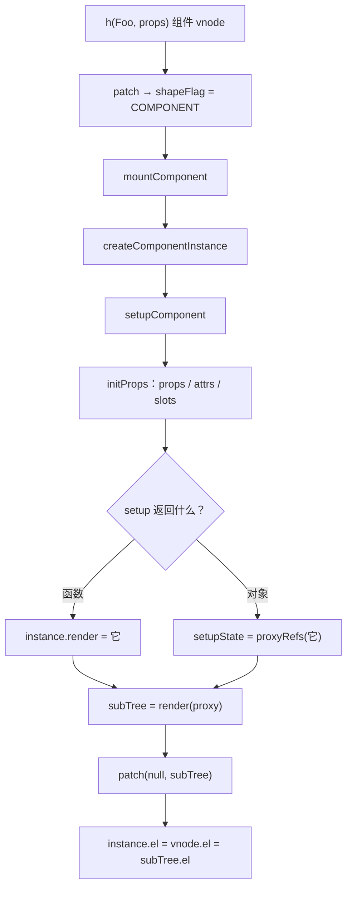

# 08 - 组件化·上

> 对应大纲模块 08（核心层 · 精讲） | 预计时间：2 天
> 面试可答：组件 vnode 触发 createInstance → setupComponent → render 出 subTree → 递归 patch；setup 返回函数即渲染函数、返回对象经 proxyRefs 后由 instance proxy 暴露；slots 就是「父组件存函数、子组件调用取 vnode」。

---

## 学习目标

- 把「组件」实现为渲染器的一种 vnode 类型：mountComponent 全流程
- 实现 instance：props/attrs 分离、slots、setupState、instance proxy
- 实现 `emit`（onXxx 约定）与 `$attrs` 手动透传
- 讲清组件初始化的完整时序，为 09 篇的「组件更新」打好地基

---

## 测试先行

新建 `src/runtime-core/__tests__/component.spec.ts`：

```ts
// src/runtime-core/__tests__/component.spec.ts
import { describe, expect, it, vi } from 'vitest'
import { h } from '../index'
import { render } from '../../runtime-dom'

describe('组件挂载', () => {
  it('setup 返回渲染函数', () => {
    const container = document.createElement('div')
    const Foo = {
      props: ['foo'],
      setup(props: any) {
        return () => h('div', null, `foo is ${props.foo}`)
      },
    }
    render(h(Foo, { foo: 'bar' }), container)
    expect(container.textContent).toBe('foo is bar')
  })

  it('setup 返回对象 + render(ctx)（instance proxy）', () => {
    const container = document.createElement('div')
    const Bar = {
      setup() {
        return { msg: 'hello' }
      },
      render(ctx: any) {
        return h('div', null, ctx.msg)
      },
    }
    render(h(Bar), container)
    expect(container.textContent).toBe('hello')
  })

  it('props 经 proxy 可读', () => {
    const container = document.createElement('div')
    const Baz = {
      props: ['count'],
      render(ctx: any) {
        return h('span', null, String(ctx.count))
      },
    }
    render(h(Baz, { count: 7 }), container)
    expect(container.textContent).toBe('7')
  })
})

describe('slots', () => {
  const Child = {
    render(ctx: any) {
      return h('div', { class: 'wrap' }, ctx.$slots.default())
    },
  }

  it('对象 children：具名插槽函数', () => {
    const container = document.createElement('div')
    render(
      h(Child, null, { default: () => h('p', null, 'slot content') }),
      container,
    )
    expect(container.querySelector('p')!.textContent).toBe('slot content')
  })

  it('数组 children：默认插槽', () => {
    const container = document.createElement('div')
    render(h(Child, null, [h('p', null, '1')]), container)
    expect(container.querySelector('p')!.textContent).toBe('1')
  })

  it('字符串 children：默认插槽', () => {
    const container = document.createElement('div')
    render(h(Child, null, 'plain text'), container)
    expect(container.textContent).toBe('plain text')
  })
})

describe('emit 与 attrs', () => {
  it('emit：触发父组件传入的 onXxx', () => {
    const container = document.createElement('div')
    const Inc = {
      setup(props: any, ctx: any) {
        return () => h('button', { onClick: () => ctx.emit('add', 1) }, 'inc')
      },
    }
    const onAdd = vi.fn()
    render(h(Inc, { onAdd }), container)
    container.querySelector('button')!.click()
    expect(onAdd).toHaveBeenCalledWith(1)
  })

  it('attrs：未声明的 props 收进 $attrs，可手动透传', () => {
    const container = document.createElement('div')
    const WithAttrs = {
      props: ['foo'],
      render(ctx: any) {
        return h('div', ctx.$attrs, 'a')
      },
    }
    render(h(WithAttrs, { foo: 1, class: 'pass-through', id: 'x' }), container)
    const el = container.querySelector('div') as HTMLElement
    expect(el.className).toBe('pass-through')
    expect(el.id).toBe('x')
  })
})
```

---

## 实现拆解

### 第 1 步：component.ts——组件的内部表示

```ts
// src/runtime-core/component.ts（08 版本）
import { proxyRefs } from '../reactivity'
import { ShapeFlags, type VNode } from './vnode'

export type ComponentPropsOption = string[] | Record<string, any>

export interface Component {
  props?: ComponentPropsOption
  setup?: (props: Record<string, any>, ctx: SetupContext) => any
  render: (ctx?: any) => any
}

export interface SetupContext {
  attrs: Record<string, any>
  slots: Record<string, (...args: any[]) => any>
  emit: (event: string, ...args: any[]) => void
}

export interface ComponentInternalInstance {
  type: Component
  vnode: VNode
  props: Record<string, any>
  attrs: Record<string, any>
  slots: Record<string, (...args: any[]) => any>
  setupState: Record<string, any> | null
  render: (ctx?: any) => any
  proxy: any
  el: any
  isMounted: boolean
  emit: (event: string, ...args: any[]) => void
}

export function createComponentInstance(vnode: VNode): ComponentInternalInstance {
  const instance: ComponentInternalInstance = {
    type: vnode.type as Component,
    vnode,
    props: {},
    attrs: {},
    slots: {},
    setupState: null,
    render: () => null,
    proxy: null,
    el: null,
    isMounted: false,
    emit: () => {},
  }
  instance.emit = createEmit(instance)
  return instance
}

const hasOwn = (obj: any, key: string) => Object.prototype.hasOwnProperty.call(obj, key)

function createEmit(instance: ComponentInternalInstance) {
  return (event: string, ...args: any[]) => {
    const cap = `on${event[0].toUpperCase()}${event.slice(1)}`
    // 未声明在 props 选项里的 onXxx 会落在 attrs，emit 需要两路都查（实测踩坑）
    const handler = instance.props[cap] ?? instance.attrs[cap]
    handler && handler(...args)
  }
}
```

### 第 2 步：props / attrs / slots 初始化

```ts
// src/runtime-core/component.ts（08 版本，接上）
export function initProps(instance: ComponentInternalInstance, vnode: VNode) {
  const declared: ComponentPropsOption = instance.type.props ?? []
  const declaredKeys = Array.isArray(declared) ? declared : Object.keys(declared)
  const props: Record<string, any> = {}
  const attrs: Record<string, any> = {}
  for (const key in vnode.props ?? {}) {
    const value = (vnode.props as Record<string, any>)[key]
    if (key === 'key') continue // vnode key 不进 props/attrs
    if (declaredKeys.includes(key)) {
      props[key] = value
    } else {
      attrs[key] = value
    }
  }
  instance.props = props
  instance.attrs = attrs
  // slots：数组/字符串 children → 默认插槽；对象 children → 具名插槽表
  const { children, shapeFlag } = vnode
  if (shapeFlag & ShapeFlags.ARRAY_CHILDREN || shapeFlag & ShapeFlags.TEXT_CHILDREN) {
    instance.slots = { default: () => children }
  } else if (children && typeof children === 'object') {
    instance.slots = children as Record<string, (...args: any[]) => any>
  } else {
    instance.slots = {}
  }
}
```

要点：**props 与 attrs 的分界线是组件自己的 `props` 选项**——声明了的进 props，没声明的进 attrs。这也是 `emit` 为什么可能要去 attrs 找 `onXxx`：父组件写 `onAdd` 但子组件没声明 `add` 时，它躺在 attrs 里。

### 第 3 步：setupComponent 与 instance proxy

```ts
// src/runtime-core/component.ts（08 版本，接上）
export function setupComponent(instance: ComponentInternalInstance) {
  initProps(instance, instance.vnode)
  const { setup, render } = instance.type
  instance.render = render
  if (setup) {
    const setupResult = setup(instance.props, {
      attrs: instance.attrs,
      slots: instance.slots,
      emit: instance.emit,
    })
    if (typeof setupResult === 'function') {
      // 返回函数 → 直接作为渲染函数
      instance.render = setupResult
    } else if (setupResult && typeof setupResult === 'object') {
      // 返回对象 → 挂为 setupState，经 proxy 暴露（04 篇 proxyRefs 解包 ref）
      instance.setupState = proxyRefs(setupResult)
    }
  }
  instance.proxy = createInstanceProxy(instance)
}

const publicPropertiesMap: Record<string, (i: ComponentInternalInstance) => any> = {
  $slots: (i) => i.slots,
  $attrs: (i) => i.attrs,
  $el: (i) => i.el,
}

function createInstanceProxy(instance: ComponentInternalInstance) {
  return new Proxy(instance, {
    get(target, key: string) {
      const { setupState, props } = target
      if (setupState && hasOwn(setupState, key)) {
        return setupState[key]
      }
      if (hasOwn(props, key)) {
        return props[key]
      }
      const getter = publicPropertiesMap[key]
      if (getter) {
        return getter(target)
      }
    },
  })
}
```

proxy 的查找顺序：**setupState → props → `$xxx` 保留字段**。渲染函数拿到的 `ctx` 就是这个 proxy——它同时统一了「setup 返回的对象」「props」「`$slots/$attrs/$el`」三套来源。

### 第 4 步：renderer 接入组件

```ts
// src/runtime-core/renderer.ts（08 增量）
// ① patch 的分发补上组件分支
function patch(n1: VNode | null, n2: VNode, container: any) {
  if (n1 === n2) return
  if (n1 && n1.type !== n2.type) {
    unmount(n1)
    n1 = null
  }
  const { shapeFlag } = n2
  if (shapeFlag & ShapeFlags.ELEMENT) {
    processElement(n1, n2, container)
  } else if (shapeFlag & ShapeFlags.TEXT) {
    processText(n1, n2, container)
  } else if (shapeFlag & ShapeFlags.COMPONENT) {
    processComponent(n1, n2, container) // ← 新增
  }
}

// ② 组件的挂载
function processComponent(n1: VNode | null, n2: VNode, container: any) {
  if (n1 === null) {
    mountComponent(n2, container)
  } else {
    // 09 篇实现组件更新
  }
}

function mountComponent(vnode: VNode, container: any) {
  const instance = createComponentInstance(vnode)
  setupComponent(instance)
  // 组件的「渲染函数」产出 subTree —— 组件的本质是 vnode 树的加工层
  const subTree = instance.render(instance.proxy)
  patch(null, subTree, container)
  // 组件 el 指向其根节点的 el（$el / 卸载都依赖它）
  instance.el = vnode.el = subTree.el
  instance.isMounted = true
}
```

组件初始化全时序：



`instance.render` 产出的 `subTree` 是普通 vnode 树——**组件不是一种新东西，而是「能产出 vnode 的 vnode」**，渲染器对它的处理最终完全回落到 06/07 的元素逻辑。

---

## 对照源码

vuejs/core（v3.5.43）对应实现：

| 本篇实现 | vuejs/core | 说明 |
| --- | --- | --- |
| `createComponentInstance` / `setupComponent` | `packages/runtime-core/src/component.ts` | 真实版还有渲染上下文合体、SFC scoped、devtools 标记等；教学版字段一一对应 |
| `initProps` 的 props/attrs 分离 | `packages/runtime-core/src/componentProps.ts` | 真实版支持 props 校验（类型/必填/validator）、默认值、大小写归一（camel/kebab） |
| `instance.proxy` | 同 `component.ts` 的 `PublicInstanceProxyHandlers` | 真实版还支持 `$data`、`$options`、`$nextTick`、has/set 拦截 |
| slots：children 函数表 | `packages/runtime-core/src/componentSlots.ts` | **关键差异**：真实版 slot 经 Fragment 渲染（支持多节点）、有稳定 slot 身份用于「slot 内容变化驱动子组件更新」；教学版子组件不响应 slot 变化 |
| `emit` | `packages/runtime-core/src/componentEmits.ts` | 真实版有 `emits` 选项声明、kebab-case 归一、v-model 的 `update:xxx` 支持 |

> 对照入口：[vuejs/core/packages/runtime-core/src/component.ts](https://github.com/vuejs/core/blob/main/packages/runtime-core/src/component.ts)

---

## 常见踩坑点

- ❌ `emit` 只查 props——未声明的 `onXxx` 落在 attrs 里，回调永远不触发（**实测踩坑**：本篇测试就是这么抓出来的）；要么双路查找，要么像真实版一样强制 `onXxx` 进 props
- ❌ setup 返回对象忘了过 `proxyRefs`——模板里写出 `.value`；模板语义要求自动解包
- ❌ slots 只处理函数对象形态——父组件直接给字符串/数组 children 时子组件拿不到默认插槽
- ❌ mountComponent 忘了 `instance.el = subTree.el`——`$el` 拿到 null，组件卸载也失效（unmount 靠 `vnode.el`）
- ❌ instance proxy 查找顺序搞反——props 覆盖 setupState 会造成同名属性静默遮蔽

---

## 面试高频问题

1. 组件初始化的完整流程？setup 的执行时机？
2. setup 的两种返回值分别怎么处理？为什么要 proxyRefs？
3. slots 的实现原理？attrs 和 props 的区别？

---

## 面试回答模板

> **问：讲一下组件初始化流程，setup 什么时候执行？**
>
> **答：** 挂载组件 vnode 时：createComponentInstance 创建内部实例 → setupComponent 先初始化 props/attrs/slots，然后同步调用 setup（此刻组件上下文齐备，所以组合式 API 都要在 setup 里同步注册）→ setup 的返回值二分：函数直接作为渲染函数，对象经 proxyRefs 挂为 setupState → 之后调用渲染函数产出 subTree → patch(null, subTree) 递归挂载真实 DOM → 把根节点的 el 回填给 instance 和组件 vnode。所以 setup 只执行一次，后续更新走的是渲染函数的重跑（09 篇），而不是重新 setup。

> **问：setup 的两种返回值怎么处理？**
>
> **答：** 返回函数：它就是渲染函数，闭包天然持有 setup 内的响应式状态。返回对象：作为 setupState，用 proxyRefs 包一层（04 篇的自动解包）——这样对象里的 ref 在渲染时读 `.msg` 就能拿到值而不是 ref 本身，符合模板语义。渲染函数通过 instance proxy 统一访问：查找顺序是 setupState → props → `$slots/$attrs/$el` 等保留字段，这就是「模板里既写状态又写 props 又能写 $attrs」的实现机制。

> **问：slots 怎么实现？attrs 和 props 什么区别？**
>
> **答：** slots 本质是「父组件把渲染函数传给子组件」：children 是对象时，每个属性就是槽函数；children 是数组/字符串时包成 default 槽。子组件渲染时调用 `$slots.default()` 取回 vnode——内容在父组件作用域求值，所以插槽里的响应式数据跟随父组件。props 与 attrs 的分界是子组件的 props 选项：声明了的进 props（组件契约），没声明的进 attrs（透传用），emit 的 onXxx 处理器两路都可能存在。

---

## 练习

**要求**：实现一个 `CountButton` 组件——props 接收 `step`，点击按钮 `emit('change', 新值)`；父组件传入 `onChange` 打印。再用 `props: ['tag']` + `$attrs` 实现一个「标签透传」组件：`h(Tag, { tag: 'section', class: 'box' })` 渲染出 `<section class="box">`。

**提示**：emit 的事件名不加 `on`；透传组件不要声明 `class`——让它自然落进 attrs。

**预期效果**：点击按钮父回调收到新值；透传组件的 class/id 正确落到根元素上。能说出「如果 CountButton 不声明 step，step 会出现在 $attrs 而不是 props 里」的分流时机（initProps 阶段）。

---

## 本篇完成标准

- [ ] 八条测试全绿（06~08 累计二十四绿）
- [ ] 能默画组件初始化时序图
- [ ] 能答三组面试题；能解释 emit 为什么可能查 attrs（用本篇实测踩坑举例）
