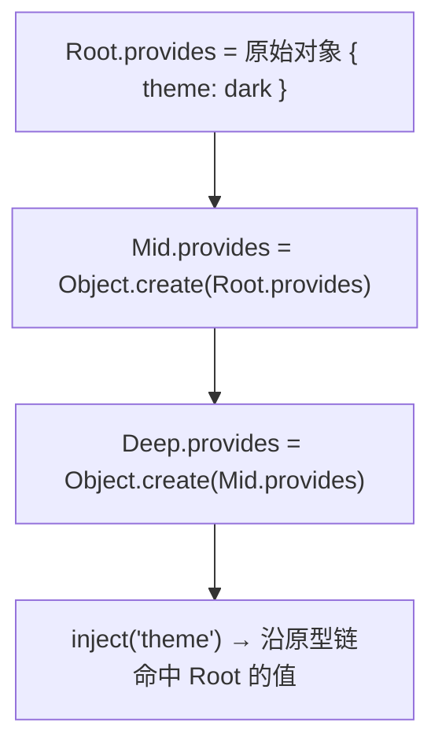
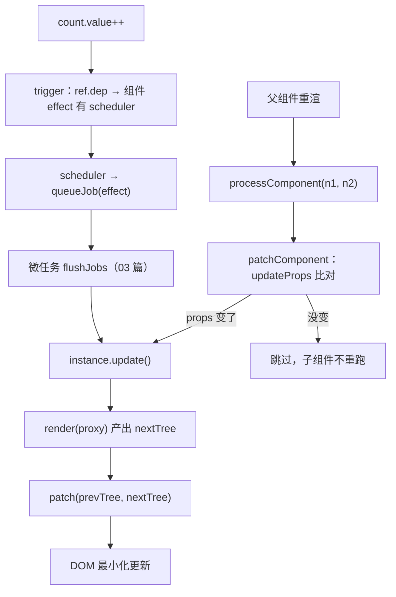

# 09 - 组件化·下

> 对应大纲模块 09（核心层 · 精讲） | 预计时间：2 天
> 面试可答：组件更新 = 组件自己的 effect + scheduler 接入 queueJob（03 篇的地基回收）；生命周期是「setup 时借 currentInstance 把钩子 push 进实例队列」；provide/inject 用 provides 的原型链实现跨层级查找。

---

## 学习目标

- 把 mountComponent 重构为「组件更新 effect」：mount/update 双分支，调度接入 03 篇的 queueJob
- 实现 patchComponent：父组件重渲时按 props 变化决定子组件是否重跑
- 实现 onMounted（hooks 队列 + currentInstance）与 provide/inject（原型链）
- 理解「子先父后」的 mounted 触发顺序为什么是天然成立的

---

## 测试先行

新建 `src/runtime-core/__tests__/componentUpdate.spec.ts`：

```ts
// src/runtime-core/__tests__/componentUpdate.spec.ts
import { describe, expect, it } from 'vitest'
import { h, onMounted, provide, inject } from '../index'
import { ref, nextTick } from '../../reactivity'
import { render } from '../../runtime-dom'

describe('生命周期', () => {
  it('onMounted：子先父后', () => {
    const container = document.createElement('div')
    const order: string[] = []
    const Child = {
      setup() {
        onMounted(() => order.push('child'))
        return () => h('div', null, 'c')
      },
    }
    const Parent = {
      setup() {
        onMounted(() => order.push('parent'))
        return () => h(Child)
      },
    }
    render(h(Parent), container)
    expect(order).toEqual(['child', 'parent'])
  })
})

describe('组件更新（调度）', () => {
  it('内部状态变化 → 调度重渲', async () => {
    const container = document.createElement('div')
    const Counter = {
      setup() {
        const count = ref(0)
        return () =>
          h('div', { onClick: () => count.value++ }, String(count.value))
      },
    }
    render(h(Counter), container)
    expect(container.textContent).toBe('0')

    ;(container.querySelector('div') as HTMLElement).click()
    await nextTick()
    expect(container.textContent).toBe('1')
  })
})

describe('provide / inject', () => {
  it('跨层级注入', () => {
    const container = document.createElement('div')
    const Deep = {
      setup() {
        const theme = inject('theme', 'light')
        return () => h('p', null, theme as string)
      },
    }
    const Mid = {
      setup() {
        return () => h(Deep)
      },
    }
    const Root = {
      setup() {
        provide('theme', 'dark')
        return () => h(Mid)
      },
    }
    render(h(Root), container)
    expect(container.textContent).toBe('dark')
  })

  it('无 provider 时用默认值', () => {
    const container = document.createElement('div')
    const Lone = {
      setup() {
        return () => h('b', null, inject('missing', 'fallback') as string)
      },
    }
    render(h(Lone), container)
    expect(container.textContent).toBe('fallback')
  })
})
```

---

## 实现拆解

### 第 1 步：lifecycle.ts——钩子队列与 currentInstance

```ts
// src/runtime-core/lifecycle.ts
import type { ComponentInternalInstance } from './component'

let currentInstance: ComponentInternalInstance | null = null

export function setCurrentInstance(instance: ComponentInternalInstance | null) {
  currentInstance = instance
}

export function unsetCurrentInstance() {
  currentInstance = null
}

export function getCurrentInstance(): ComponentInternalInstance | null {
  return currentInstance
}

/** mounted 钩子：setup 内调用，注册到当前实例，mount 完成后按「子先父后」触发 */
export function onMounted(hook: () => void) {
  const instance = currentInstance
  if (instance) {
    instance.m.push(hook)
  }
}
```

生命周期没有魔法：`onMounted` 只是「往当前实例的 `m` 队列 push 一个函数」。它要求在 setup 内调用——因为只有那一刻 `currentInstance` 指向本组件。

### 第 2 步：apiInject.ts——原型链实现跨层级注入

```ts
// src/runtime-core/apiInject.ts
import { getCurrentInstance } from './lifecycle'

export function provide<T>(key: string | symbol, value: T) {
  const instance = getCurrentInstance()
  if (instance) {
    instance.provides[key as any] = value
  }
}

export function inject<T>(key: string | symbol, defaultValue?: T): T | undefined {
  const instance = getCurrentInstance()
  if (!instance) return defaultValue
  // provides 以父组件的为原型，沿原型链即可跨层级查找
  const provides = instance.parent?.provides
  if (provides && (key as any) in provides) {
    return provides[key as any] as T
  }
  return defaultValue
}
```

`inject` 只查 `instance.parent.provides`，却能跨任意层级——因为每个组件的 `provides` 都以父组件的 `provides` 为**原型**，`in` 与取值都沿原型链走，这正是 02 篇 receiver 陷阱的反向应用：故意借用原型继承做作用域。



### 第 3 步：component.ts 增量

```ts
// src/runtime-core/component.ts（09 增量，相对 08 版本改/加以下部分）
import { setCurrentInstance, unsetCurrentInstance } from './lifecycle'

export interface ComponentInternalInstance {
  type: Component
  vnode: VNode
  parent: ComponentInternalInstance | null // ← 新增
  provides: Record<PropertyKey, any> // ← 新增
  props: Record<string, any>
  attrs: Record<string, any>
  slots: Record<string, (...args: any[]) => any>
  setupState: Record<string, any> | null
  render: (ctx?: any) => any
  proxy: any
  el: any
  subTree: VNode | null // ← 新增：当前渲染的子树，更新的对比基准
  isMounted: boolean
  m: (() => void)[] // ← 新增：mounted 钩子队列
  emit: (event: string, ...args: any[]) => void
  update: () => void // ← 新增：组件更新入口（由 effect 包装）
}

export function createComponentInstance(
  vnode: VNode,
  parent: ComponentInternalInstance | null, // ← 新增：patch 链路传下来的父实例
): ComponentInternalInstance {
  const instance: ComponentInternalInstance = {
    // ...与 08 版本相同的字段，另加：
    parent,
    provides: {},
    subTree: null,
    m: [],
    update: () => {},
  }
  // provide/inject：子组件的 provides 以父组件的为原型
  if (parent) {
    instance.provides = Object.create(parent.provides)
  }
  instance.emit = createEmit(instance)
  vnode.component = instance
  return instance
}

// setupComponent 内：setup 调用期间设置 currentInstance（供 onMounted/provide/inject 定位）
export function setupComponent(instance: ComponentInternalInstance) {
  initProps(instance, instance.vnode)
  const { setup, render } = instance.type
  instance.render = render
  if (setup) {
    setCurrentInstance(instance) // ← 新增
    let setupResult: any
    try {
      setupResult = setup(instance.props, {
        attrs: instance.attrs,
        slots: instance.slots,
        emit: instance.emit,
      })
    } finally {
      unsetCurrentInstance() // ← 新增：setup 抛异常也不能泄漏 currentInstance（02 篇 effectStack 同款原则）
    }
    if (typeof setupResult === 'function') {
      instance.render = setupResult
    } else if (setupResult && typeof setupResult === 'object') {
      instance.setupState = proxyRefs(setupResult)
    }
  }
  instance.proxy = createInstanceProxy(instance)
}

// ← 新增：父组件重渲时，重算子组件 props/attrs，返回是否变化
export function updateProps(instance: ComponentInternalInstance, vnode: VNode): boolean {
  const prevAll: Record<string, any> = { ...instance.attrs, ...instance.props }
  const prevKeys = Object.keys(prevAll)
  initProps(instance, vnode)
  const nextAll: Record<string, any> = { ...instance.attrs, ...instance.props }
  const nextKeys = Object.keys(nextAll)
  if (prevKeys.length !== nextKeys.length) return true
  return nextKeys.some((key) => prevAll[key] !== nextAll[key])
}
```

### 第 4 步：renderer.ts——把更新交给 effect 与调度器

```ts
// src/runtime-core/renderer.ts（09 增量）
import { effect, queueJob } from '../reactivity'

// ① patch 链路增加 parentComponent 参数（provide/inject 需要父实例）
function patch(
  n1: VNode | null,
  n2: VNode,
  container: any,
  parentComponent: ComponentInternalInstance | null = null,
) {
  // ...分发时把 parentComponent 传给 processElement/processComponent，
  //    mountChildren 也要往下传（数组 children 里可能还有组件）
}

// ② processComponent 补上更新分支
function processComponent(
  n1: VNode | null,
  n2: VNode,
  container: any,
  parentComponent: ComponentInternalInstance | null,
) {
  if (n1 === null) {
    mountComponent(n2, container, parentComponent)
  } else {
    patchComponent(n1, n2)
  }
}

// ③ mountComponent 从「直接渲染」升级为「组件更新 effect」
function mountComponent(
  vnode: VNode,
  container: any,
  parentComponent: ComponentInternalInstance | null,
) {
  const instance = createComponentInstance(vnode, parentComponent)
  setupComponent(instance)

  const componentUpdateFn = () => {
    if (!instance.isMounted) {
      // mount 分支
      const subTree = instance.render(instance.proxy)
      patch(null, subTree, container, instance)
      instance.el = vnode.el = subTree.el
      instance.subTree = subTree
      instance.isMounted = true
      instance.m.forEach((hook) => hook())
    } else {
      // update 分支
      const nextTree = instance.render(instance.proxy)
      const prevTree = instance.subTree!
      instance.subTree = nextTree
      instance.vnode.el = nextTree.el
      patch(prevTree, nextTree, container, instance)
    }
  }
  // 03 篇的地基在这里回收：状态变化 → scheduler → queueJob → 微任务批量重渲
  instance.update = effect(componentUpdateFn, {
    scheduler: (e) => queueJob(e),
  })
}

// ④ 父组件重渲命中同一子组件时：复用 instance，按 props 变化决定是否重跑
function patchComponent(n1: VNode, n2: VNode) {
  const instance = (n2.component = n1.component)!
  instance.vnode = n2
  const changed = updateProps(instance, n2)
  if (changed) {
    instance.update()
  }
}
```

组件更新的完整闭环：



**「子先父后」为什么天然成立**：mounted 钩子在各自 `componentUpdateFn` 的 mount 分支末尾同步触发，而父组件的 mount 分支要等 `patch(null, subTree)` 完全返回——此时子组件早已 mount 完毕、钩子已入队并触发。真实 Vue 用 post-flush 队列显式保证同一顺序，教学版的同步时序恰好等价。

### 第 5 步：出口增量

```ts
// src/runtime-core/index.ts（09 增量）
export {
  onMounted,
  getCurrentInstance,
  setCurrentInstance,
  unsetCurrentInstance,
} from './lifecycle'
export { provide, inject } from './apiInject'
```

> 注意：本篇只保留「内部状态变化 → 调度重渲」一条更新测试。`patchComponent` 的 props 比对两条测试（变化重渲 / 未变化不重渲）**依赖 10 篇 diff 的 vnode 复用语义**——本篇阶段数组对数组还是 07 的全量卸载重挂，子组件会被卸了重挂，测试必挂。它们随 10 篇落地（见 10 篇「patchComponent 复用语义」describe）。

---

## 对照源码

vuejs/core（v3.5.43）对应实现：

| 本篇实现 | vuejs/core | 说明 |
| --- | --- | --- |
| `componentUpdateFn` mount/update 双分支 | `packages/runtime-core/src/renderer.ts` 的 `setupRenderEffect` | 真实版还有 el 锚点维护、Suspense 分支、`beforeUnmount/unmounted` 与 `vnodeHook` 队列 |
| `instance.update = effect(fn, { scheduler })` | 同上（`update = effect(...)`） | 一致；真实版 `job.id` 是组件 uid，scheduler 里 `queueJob(job)` 靠 id 保证父先子后 |
| `onMounted` 注册与触发 | `packages/runtime-core/src/apiLifecycle.ts` | 真实版用 `injectHook` 统一注册（含 wrapped hook 与错误处理），mounted 走 `queuePostRenderEffect` |
| `provide/inject` 原型链 | `packages/runtime-core/src/apiInject.ts` | 一致（`Object.create(parent.provides)`）；真实版额外处理 `defaultValue` 为函数、readonly 视图 |
| `updateProps` 浅比较 | `packages/runtime-core/src/componentProps.ts` 的 `updateProps` | 真实版还处理 camel/kebab 归一、`onXxx` 强制进 props、emit 校验（`emits` 选项） |

> 对照入口：[vuejs/core/packages/runtime-core/src/renderer.ts](https://github.com/vuejs/core/blob/main/packages/runtime-core/src/renderer.ts)、[apiInject.ts](https://github.com/vuejs/core/blob/main/packages/runtime-core/src/apiInject.ts)

---

## 常见踩坑点

- ❌ setup 调用后忘记 `unsetCurrentInstance`——后续任何读取都拿到上一个组件的实例，钩子/注入串台；本质是 02 篇 effectStack 的同款问题
- ❌ `instance.provides = parent.provides`（直接引用）——父组件之后 provide 的任何东西都会同步进子组件，注入作用域被污染；必须 `Object.create(parent.provides)`
- ❌ `patchComponent` 不比对 props 无脑 `instance.update()`——父组件每次重渲都拉起全部子组件重跑（该行为的回归测试随 10 篇 diff 落地，见 10 篇「props 未变化不重渲」）
- ❌ update 分支忘记 `instance.vnode.el = nextTree.el`——子组件根节点在更新中类型变化时，`$el` 与父链路上的 el 引用失效
- ❌ 组件 effect 里手动 `run()` 调试——绕过 scheduler 的队列去重，一次状态变化触发多次 patch；观察更新请用 nextTick 等 flush

---

## 面试高频问题

1. 组件更新的完整流程？（组件为什么是一个 effect？）
2. 生命周期的实现原理？父子组件钩子的执行顺序？
3. provide/inject 怎么做到跨层级？
4. 父组件重渲，子组件一定重渲吗？

---

## 面试回答模板

> **问：组件更新的完整流程？为什么组件是一个 effect？**
>
> **答：** 挂载组件时不直接渲染，而是创建一个组件级 effect：它包装 componentUpdateFn（mount/update 双分支），并把 scheduler 设为 queueJob。渲染函数执行期间读到的响应式数据全部被收集为该 effect 的依赖；之后任何状态变化 → trigger → 命中 scheduler → job 入 Set 去重 → 微任务批量 flush → 重跑 render 产出新 subTree → patch(prevTree, nextTree) 最小化更新。组件是 effect 意味着「谁用了响应式数据，谁就自动订阅了它」，这正是 Vue 更新粒度是组件级的原因：更新不精确到 DOM 的部分交给元素级 patch（07 篇）与编译时标记（13 篇）。

> **问：生命周期的实现原理？父子钩子顺序？**
>
> **答：** 每个 onXxx API 都是「借 currentInstance 把回调 push 进实例的对应队列」：setup 执行期间框架设置 currentInstance，所以钩子必须在 setup 同步注册。mounted 在 mount 分支完成后遍历队列触发。顺序上子组件必然先于父组件完成 mount（父的钩子在 patch(subTree) 之后），所以「子先父后」；真实 Vue 再用 post-flush 队列保证多轮更新下同一顺序并把钩子推迟到 DOM 真正挂稳之后。

> **问：provide/inject 怎么实现跨层级？**
>
> **答：** 每个组件实例的 provides 以父组件的 provides 为原型（Object.create），provide 就是往自己的 provides 写值，inject 只查 parent.provides——读写都沿原型链，天然实现「就近覆盖 + 跨层级可达」。这是少数「故意利用原型继承」的设计；找父实例靠 patch 时沿组件链传递 parentComponent，配合 setup 期间的 currentInstance 定位。

> **问：父组件重渲，子组件一定重渲吗？**
>
> **答：** 不一定，两层判断：① patch 到组件 vnode 时走 patchComponent，updateProps 浅比较新旧 props/attrs，没变就跳过子组件（回归测试见 10 篇）；② 变了才调用子组件的 update。另一条独立通道是子组件自己内部状态变化——那不经过父组件，由子组件自己的 effect 直接驱动。所以 Vue 的更新策略是「组件级自动响应 + props 变化人工核对 + 元素级 patch 兜底」。

---

## 练习

**要求**：实现一个 `ThemeProvider` 组合式函数：`useTheme()` 内部 `inject('theme', () => 'light')`；用 `provide` + `inject` + `onMounted` 做三层组件（Root 提供主题、Middle 透传、Leaf 消费并打印挂载顺序）；再给 Leaf 加一个点击自增的内部状态，验证「Leaf 自更新不惊动 Middle」。

**提示**：inject 的默认值若写成函数，思考它该被调用吗（真实版默认值函数会被调用，教学版直接返回）——在注释里写明你的取舍；观察 Middle 是否重渲，可在其 render 里加计数器。

**预期效果**：Leaf 读到 dark、挂载顺序 Leaf 先于 Middle 先于 Root；点击 Leaf 只触发 Leaf 的 render 重跑，Middle 计数不变。能画出这条「自下而上隔离、自上而下传递」的双向图。

---

## 本篇完成标准

- [ ] 四条测试全绿（06~09 累计二十八绿；patchComponent 的两条比对测试随 10 篇落地）
- [ ] 能默画「状态变化 → 组件重渲」的调度闭环图，并指出 03 篇 scheduler 在哪一环
- [ ] 能答四组面试题；provide/inject 能画出原型链示意
