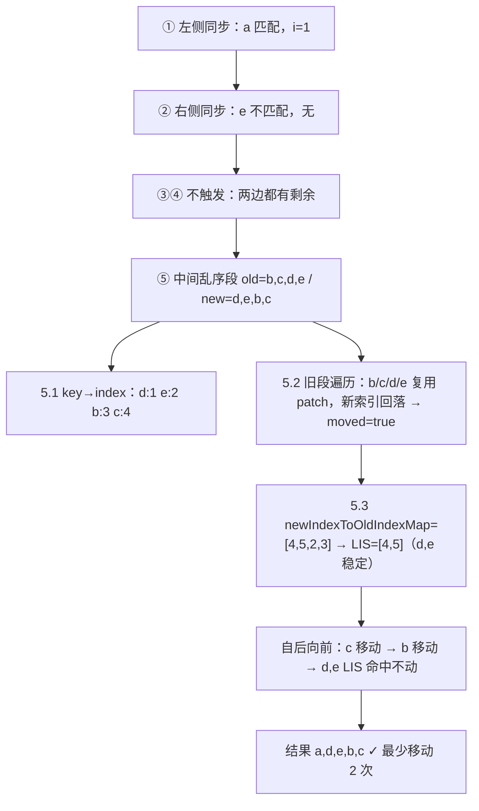

# 10 - diff 算法

> 对应大纲模块 10（核心层 · 精讲） | 预计时间：3 天
> 面试可答：Vue 3 快速 diff = 头尾双向预处理消化公共序列 → 中间乱序段建 key→index 映射 → 卸载消失的 → 用最长递增子序列找出「不需要动」的节点，只移动其余——全系列面试权重最高的实现。

---

## 学习目标

- 从 07 的「全量卸载重挂」升级为 `patchKeyedChildren` 五步算法
- 手写 `getSequence`（贪心 + 二分 + 前驱回溯的 LIS）
- 理解 anchor 锚点在「带插入位置」的挂载/移动中如何贯穿 patch 链路
- 能画全流程图、能答「key 的意义」「index 作 key 的问题」「Vue 2 双端 vs Vue 3 快速」

---

## 测试先行

新建 `src/runtime-core/__tests__/diff.spec.ts`：

```ts
// src/runtime-core/__tests__/diff.spec.ts
import { describe, expect, it, vi } from 'vitest'
import { getSequence, h, type VNode } from '../index'
import { nextTick, reactive } from '../../reactivity'
import { render } from '../../runtime-dom'

const mk = (text: string, key: string): VNode => h('li', { key }, text)

describe('最长递增子序列', () => {
  it('基础序列', () => {
    expect(getSequence([2, 3, 1, 5, 4])).toEqual([0, 1, 4])
    expect(getSequence([5, 3, 4, 9, 1])).toEqual([1, 2, 3])
    expect(getSequence([1, 2, 3])).toEqual([0, 1, 2])
  })

  it('0 表示待挂载，不参与 LIS', () => {
    expect(getSequence([0, 2, 0, 3])).toEqual([1, 3])
  })
})

describe('diff：数组子节点', () => {
  it('重排：DOM 节点按 key 复用', () => {
    const container = document.createElement('div')
    render(
      h('ul', null, [mk('a', 'a'), mk('b', 'b'), mk('c', 'c'), mk('d', 'd')]),
      container,
    )
    const old = container.querySelectorAll('li')
    const [a, b, c, d] = old

    render(
      h('ul', null, [mk('a', 'a'), mk('c', 'c'), mk('d', 'd'), mk('b', 'b')]),
      container,
    )
    const now = container.querySelectorAll('li')
    expect([now[0], now[1], now[2], now[3]]).toEqual([a, c, d, b])
    expect(container.textContent).toBe('acdb')
    void b
  })

  it('中间插入：锚点保证位置正确', () => {
    const container = document.createElement('div')
    render(h('ul', null, [mk('a', 'a'), mk('b', 'b')]), container)
    render(
      h('ul', null, [mk('a', 'a'), mk('m', 'm'), mk('b', 'b')]),
      container,
    )
    expect(container.textContent).toBe('amb')
  })

  it('删除：多余的卸载', () => {
    const container = document.createElement('div')
    render(
      h('ul', null, [mk('a', 'a'), mk('b', 'b'), mk('c', 'c'), mk('d', 'd')]),
      container,
    )
    render(h('ul', null, [mk('a', 'a'), mk('c', 'c')]), container)
    expect(container.textContent).toBe('ac')
    expect(container.querySelectorAll('li').length).toBe(2)
  })

  it('头尾同时变化', () => {
    const container = document.createElement('div')
    render(
      h('ul', null, [mk('a', 'a'), mk('b', 'b'), mk('c', 'c'), mk('d', 'd')]),
      container,
    )
    render(h('ul', null, [mk('d', 'd'), mk('c', 'c')]), container)
    expect(container.textContent).toBe('dc')
  })

  it('完全逆序：全部复用', () => {
    const container = document.createElement('div')
    render(h('ul', null, [mk('1', '1'), mk('2', '2'), mk('3', '3')]), container)
    const old = [...container.querySelectorAll('li')]
    render(h('ul', null, [mk('3', '3'), mk('2', '2'), mk('1', '1')]), container)
    const now = [...container.querySelectorAll('li')]
    expect(now).toEqual([old[2], old[1], old[0]])
    expect(container.textContent).toBe('321')
  })
})

describe('patchComponent 复用语义（依赖 diff 落地，自 09 迁移）', () => {
  it('父传 props 变化 → 子组件更新（走 patchComponent 而非卸载重挂）', async () => {
    const container = document.createElement('div')
    const state = reactive({ count: 0 })
    const Child = {
      props: ['count'],
      render(ctx: any) {
        return h('span', null, String(ctx.count))
      },
    }
    const Parent = {
      setup() {
        return () => h('div', null, [h(Child, { count: state.count })])
      },
    }
    render(h(Parent), container)
    expect(container.textContent).toBe('0')

    state.count = 1
    await nextTick()
    expect(container.textContent).toBe('1')
  })

  it('props 未变化不重渲', async () => {
    const container = document.createElement('div')
    const renderSpy = vi.fn(() => h('div', null, 'static'))
    const Child = { render: renderSpy }
    const state = reactive({ n: 0 })
    const Parent = {
      setup() {
        return () => h('div', null, [h(Child), String(state.n)])
      },
    }
    render(h(Parent), container)
    const callsAfterMount = renderSpy.mock.calls.length
    state.n = 1
    await nextTick()
    // 子组件 props 没变，不应重跑子的 render
    expect(renderSpy.mock.calls.length).toBe(callsAfterMount)
    expect(container.textContent).toContain('1')
  })
})
```

---

## 实现拆解

### 第 1 步：patch 链路带上 anchor

07 的挂载永远是「追加到末尾」，diff 的移动与中间插入却需要**指定插入位置**。anchor 从本篇起贯穿 patch → mountElement → insert：

```ts
// src/runtime-core/renderer.ts（10 增量 ①：签名与 mountElement）
function patch(
  n1: VNode | null,
  n2: VNode,
  container: any,
  anchor: any = null,
  parentComponent: ComponentInternalInstance | null = null,
) {
  // ...分发不变，anchor 透传给 processElement/processText/processComponent
}

function mountElement(
  vnode: VNode,
  container: any,
  anchor: any,
  parentComponent: ComponentInternalInstance | null,
) {
  const el = (vnode.el = createElement(vnode.type as string))
  // ...children/props 处理不变
  insert(el, container, anchor) // ← 06 版是 insert(el, container)
}
```

> **⚠️ 09 → 10 的调用点迁移（破坏性变更，必读）**：anchor 插在 parentComponent **之前**，09 的既有调用点要同步改位——
>
> - mount 分支：`patch(null, subTree, container)` → `patch(null, subTree, container, anchor, instance)`
> - update 分支：`patch(prevTree, nextTree, container, instance)` → `patch(prevTree, nextTree, container, null, instance)`
> - `mountChildren` 内部：`patch(null, child, container, parentComponent)` → `patch(null, child, container, null, parentComponent)`
>
> anchor 形参是 `any`，instance 错位传入 TS 不会报错——只会静默断掉 provide/inject 链与组件更新。这正是「照抄即错」的典型，改签名时把全部调用点过一遍。

### 第 2 步：patchChildren 换装

```ts
// src/runtime-core/renderer.ts（10 增量 ②）
// 07 版「数组对数组」的全量卸载重挂，替换为：
} else if (prevShapeFlag & ShapeFlags.ARRAY_CHILDREN) {
  patchKeyedChildren(c1, c2 as VNode[], container, parentComponent)
}
```

### 第 3 步：patchKeyedChildren 五步走

```ts
// src/runtime-core/renderer.ts（10 增量 ③，核心实现）
function patchKeyedChildren(
  c1: VNode[],
  c2: VNode[],
  container: any,
  parentComponent: ComponentInternalInstance | null,
) {
  let i = 0
  const l2 = c2.length
  let e1 = c1.length - 1
  let e2 = l2 - 1

  // 1. 左侧同步：从头开始，type+key 相同就 patch，指针右移
  while (i <= e1 && i <= e2 && isSameVNodeType(c1[i], c2[i])) {
    patch(c1[i], c2[i], container, null, parentComponent)
    i++
  }
  // 2. 右侧同步：从尾部开始，相同就 patch，指针左移
  while (i <= e1 && i <= e2 && isSameVNodeType(c1[e1], c2[e2])) {
    patch(c1[e1], c2[e2], container, null, parentComponent)
    e1--
    e2--
  }
  // 3. 旧的遍历完了：新的尾部是新增，自后向前带锚点挂载
  if (i > e1) {
    for (let k = e2; k >= i; k--) {
      const nextAnchor = k + 1 < l2 ? c2[k + 1].el : null
      patch(null, c2[k], container, nextAnchor, parentComponent)
    }
  }
  // 4. 新的遍历完了：旧的尾部是多余，卸载
  else if (i > e2) {
    while (i <= e1) {
      unmount(c1[i])
      i++
    }
  }
  // 5. 中间乱序段
  else {
    const s1 = i
    const s2 = i
    // 5.1 新中间段建 key（缺 key 用 type 兜底）→ index 映射
    const keyToNewIndexMap = new Map<string | number | symbol, number>()
    for (let j = s2; j <= e2; j++) {
      const child = c2[j]
      keyToNewIndexMap.set(child.key ?? (child.type as any), j)
    }
    // 5.2 遍历旧中间段：可复用 patch，消失的卸载；记录是否发生移动
    const toBePatched = e2 - s2 + 1
    const newIndexToOldIndexMap = new Array(toBePatched).fill(0)
    let moved = false
    let maxNewIndexSoFar = 0
    for (let j = s1; j <= e1; j++) {
      const prevChild = c1[j]
      const newIndex = keyToNewIndexMap.get(prevChild.key ?? (prevChild.type as any))
      if (newIndex === undefined) {
        unmount(prevChild)
      } else {
        newIndexToOldIndexMap[newIndex - s2] = j + 1 // +1：0 留给「待挂载」
        if (newIndex >= maxNewIndexSoFar) {
          maxNewIndexSoFar = newIndex
        } else {
          moved = true // 新索引回落 → 顺序被打乱
        }
        patch(prevChild, c2[newIndex], container, null, parentComponent)
      }
    }
    // 5.3 求最长递增子序列，自后向前：LIS 命中的不动，其余移动/挂载
    const increasingNewIndexSequence = moved ? getSequence(newIndexToOldIndexMap) : []
    let j = increasingNewIndexSequence.length - 1
    for (let k = toBePatched - 1; k >= 0; k--) {
      const nextIndex = s2 + k
      const nextChild = c2[nextIndex]
      const anchor = nextIndex + 1 < l2 ? c2[nextIndex + 1].el : null
      if (newIndexToOldIndexMap[k] === 0) {
        patch(null, nextChild, container, anchor, parentComponent) // 新挂载
      } else if (moved) {
        if (j < 0 || k !== increasingNewIndexSequence[j]) {
          insert(nextChild.el!, container, anchor) // 移动
        } else {
          j-- // LIS 命中，不需要动
        }
      }
    }
  }
}

function isSameVNodeType(n1: VNode, n2: VNode) {
  return n1.type === n2.type && n1.key === n2.key
}
```

五步全景（用例：`[a,b,c,d,e]` → `[a,d,e,b,c]`）：



三个容易忽略的细节：

- **`j + 1` 而不是 `j`**：新索引表用 0 表示「待挂载」，所以旧索引整体 +1 错开
- **step 3 自后向前挂载**：锚点 `c2[k+1].el` 要求右侧节点已就绪——倒序保证每一步的锚点都存在；正序挂 `[a, m1, m2, b]` 这类「多节点插中间」会全部追加到错误位置
- **step 5.3 先挂载后移动的判定顺序**：`newIndexToOldIndexMap[k] === 0` 的分支优先，否则 `moved` 为 false 时移动分支整体短路（序列没乱就不用动）

### 第 4 步：getSequence——最长递增子序列

O(n log n) 的经典套路：贪心维护「每个长度下最小结尾」，二分定位，前驱数组回溯：

```ts
// src/runtime-core/renderer.ts（10 增量 ④，模块级导出）
/** 最长递增子序列（返回索引数组）；0 表示待挂载节点，不参与 */
export function getSequence(arr: number[]): number[] {
  const p = arr.slice() // 前驱索引：回溯用
  const result: number[] = [] // 存索引：当前 LIS 的形态
  const len = arr.length
  for (let i = 0; i < len; i++) {
    if (arr[i] === 0) continue // 0 = 待挂载，不参与
    const j = result[result.length - 1]
    if (result.length === 0 || arr[j] < arr[i]) {
      p[i] = result.length === 0 ? -1 : j
      result.push(i)
      continue
    }
    // 二分：在 result 中找第一个 >= arr[i] 的位置
    let u = 0
    let v = result.length - 1
    while (u < v) {
      const c = (u + v) >> 1
      if (arr[result[c]] < arr[i]) u = c + 1
      else v = c
    }
    if (arr[result[u]] > arr[i]) {
      if (u > 0) p[i] = result[u - 1]
      result[u] = i // 替换为更小的结尾，给后续留机会
    }
  }
  // 回溯：从最后一个稳定节点沿前驱回填真实索引
  let u = result.length
  let v = result[u - 1]
  while (u-- > 0) {
    result[u] = v
    v = p[v]
  }
  return result
}
```

为什么 LIS 能锁定「不用动」的节点：`newIndexToOldIndexMap` 记录了旧节点在新序列中的落点，它的**递增子序列**意味着这些节点在新旧序列中的相对顺序一致——顺序没变就无须移动。LIS 取最长，移动次数自然最少。

### 第 5 步：出口增量

```ts
// src/runtime-core/index.ts（10 增量：getSequence 供测试与练习直接导入）
export { createRenderer, getSequence } from './renderer'
export type { HostImplementations } from './renderer'
```

---

## 对照源码

vuejs/core（v3.5.43）对应实现：

| 本篇实现 | vuejs/core | 说明 |
| --- | --- | --- |
| `patchKeyedChildren` 五步 | `packages/runtime-core/src/renderer.ts` | 流程一致；真实版还有 `patchUnkeyedChildren`（无 key 纯按 index patch）、`move` 静态提升、Fragment 边界 |
| step 3 挂载锚点 | 同上 `anchor = c2[i + 1].el` 类似处理 | 语义一致；真实版在 optimized 路径配合 patchFlag 有 cloneIfMounted 分支 |
| `getSequence` | 同文件 `getSequence` | 同为「贪心 + 二分 + 前驱回溯」；对 0 的处理以源码为准，教学版显式 continue（0 即待挂载） |
| 移动用 `hostInsert` | `hostInsert(vnode.el, container, anchor)` | 一致；真实版 `move()` 内部还会处理 Transition 的 `beforeEnter` 等过渡钩子 |

> 对照入口：[vuejs/core/packages/runtime-core/src/renderer.ts](https://github.com/vuejs/core/blob/main/packages/runtime-core/src/renderer.ts)

---

## 常见踩坑点

- ❌ step 3 正序挂载——`[a, m1, m2, b]` 场景下锚点尚未就绪，新节点全部追加到错误位置；自后向前才能保证每步锚点存在
- ❌ `newIndexToOldIndexMap` 直接存 `j`——与「0 = 待挂载」冲突（旧索引 0 会被误判为新节点）；必须 `j + 1`
- ❌ `moved` 判定漏掉 `maxNewIndexSoFar`——每个复用节点的新索引若非递增（`newIndex < maxNewIndexSoFar`）就置 true；漏了会导致需要移动的节点原地不动
- ❌ LIS 命中判断写成 `j--` 前置——倒序遍历时必须先比对 `k !== seq[j]` 再决定 `j--`，顺序反了会错杀稳定节点
- ❌ index 作 key 的教训——key 用数组下标时，删除头部元素会让所有 key 错位，diff 把每个节点都当成「变了内容的同 key 节点」原地更新，节点的内部状态（输入框文字、组件本地 ref）全部错位串号

---

## 面试高频问题

1. Vue 3 的 diff 算法全流程？每一步解决什么问题？
2. 为什么要用最长递增子序列？它怎么减少 DOM 移动？
3. key 的作用是什么？为什么不能用 index 当 key？
4. Vue 2 的双端 diff 和 Vue 3 的快速 diff 差在哪？

---

## 面试回答模板

> **问：Vue 3 diff 的全流程？**
>
> **答：** 同级比较，五步：① 头部预处理——从头开始 type+key 相同就 patch，指针右移；② 尾部预处理——从尾部同理左移；③ 旧的先耗尽 → 新的剩余部分是新增，自后向前带锚点挂载；④ 新的先耗尽 → 旧的剩余部分直接卸载；⑤ 中间乱序段：新段建 key→index 映射，遍历旧段——映射里没有的卸载、有的 patch 并记录 `newIndexToOldIndexMap`（新索引回落则置 moved），最后求该数组的 LIS 作为「不用动」的稳定集合，倒序遍历：待挂载的带锚点挂载、不在 LIS 里的移动。预处理让常见的前增/后删场景 O(n) 完成，LIS 保证乱序场景移动次数最少。

> **问：为什么用最长递增子序列？**
>
> **答：** 移动 DOM 节点的代价远高于改属性。newIndexToOldIndexMap 中数值递增的子序列 = 这些节点在新旧序列中相对顺序一致 = 完全不需要移动。LIS 是其中最长的一个，取它作为「锚定不动」的集合，移动的就是最少的其余节点。例如 `[a,b,c,d] → [a,c,d,b]`，LIS 命中 c、d，只有 b 移动一次。整体复杂度：预处理 O(n)，建映射 O(n)，LIS O(n log n)。

> **问：key 的作用？为什么不能用 index？**
>
> **答：** key 是 vnode 的身份标识，diff 靠 `type + key` 判断「是不是同一个节点」，决定复用 el 还是卸载重建。用 index 当 key：列表头部插入/删除时，所有节点的 key 整体错位——diff 认为每个位置都是「同 key 但内容变了」的节点，触发全量原地更新而不是复用移动；更严重的是带内部状态的组件（输入框内容、本组件 ref）会跟错位置，状态串号。正确姿势：用业务唯一标识（id）作 key，且同列表内稳定唯一。

> **问：Vue 2 双端 diff 和 Vue 3 快速 diff 差在哪？**
>
> **答：** Vue 2 维护新旧两个列表的头尾四个指针，每轮在「头头、尾尾、头尾、尾头」四种匹配里找可复用节点，找不到就查 key 映射——双端的优势是「反转序列」零移动。Vue 3 先做头部和尾部的双向预处理消化公共前后缀，中间乱序段才建 key 映射 + LIS 求最少移动。区别本质：Vue 2 逐轮匹配、借「双端」减少比较，Vue 3 预处理 + 数学（LIS）保证全局最少移动，且依赖编译时 patchFlag 在静态提升后的列表上做得更少。两者的共同前提都是 key 稳定。

---

## 练习

**要求**：实现「状态跟随 key」实验——`StateLi` 组件（setup 内 `ref(0)`，点击自增，渲染 `h('li', { key }, String(n.value))`），父组件渲染 `[a, b]` 两个实例（key 分别为 a/b），先点击 a 的节点计数到 3；随后把列表重排为 `[b, a]`；断言 a 的状态仍是 3、b 仍是 0（DOM 复用 + 状态不串号）。再把 key 换成 index 重复实验，观察状态错位。

**提示**：点击后要 `await nextTick()`；重排通过一个 reactive 的数组 + 父组件渲染函数驱动；index 作 key 的对照组只需把 `key` 换成 `String(idx)`。

**预期效果**：key 正确时 a/b 状态随 key 走；index 作 key 时点击状态错位（或更新次数异常）。能对着 `patchKeyedChildren` 源码指出错位发生在 5.2 的哪一步（type 相同 + key 相同 → 被 patch 成对方的内容）。

---

## 本篇完成标准

- [ ] 九条测试全绿（06~10 累计三十七绿；含自 09 迁移的 patchComponent 复用语义两条）
- [ ] 能默画五步流程图并配 `[a,b,c,d,e] → [a,d,e,b,c]` 的手工推演
- [ ] 能手写 getSequence 并解释 p / result 两个数组各自的作用
- [ ] 四组面试题可脱稿，key 一题能举状态串号实例
