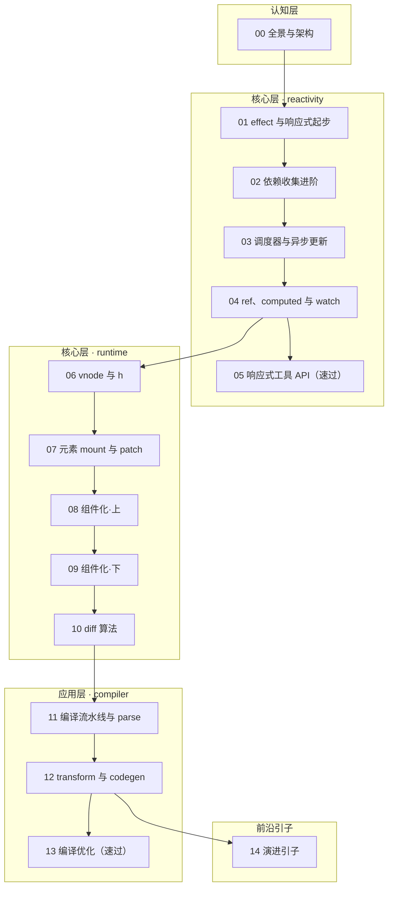

# mini-vue — 手写 Vue 3 核心原理

> 通过 TypeScript 从零实现一个 mini-vue（reactivity + runtime + compiler 三件套）。以「测试先行 → 手写实现 → 对照 vuejs/core 真源码」为每篇主线，验收标准是原理层面的「内核能写、面试能答」。

***

## 0. 规格声明（大纲即契约）

| 项目 | 结论 |
| --- | --- |
| 主题类型 | **架构/学科类**：框架内核，需要心智模型与源码级拆解 |
| 组织形态 | **实现主线**：每篇 Vitest 测试先行 → 分步实现 → 对照 vuejs/core 真源码（非伪代码，测试全绿为完成） |
| 篇数 / 深度档 | **15 篇** = 精讲 12 + 速过 2（05、13）+ 引子 1（14） |
| 最小学习路径 | **01 → 03 → 04 → 06 → 07 → 10**（赶时间 6 篇即可干活；响应式正确性补 02，组件化补 08/09） |
| 参考源码版本 | vuejs/core **v3.5.x 稳定线**（当前 latest v3.5.43）；3.6（alien-signals / Vapor Mode，截至 2026-09 仍为 RC）仅作 14 篇引子，不做实现依据 |
| 工程栈 | Bun + TypeScript strict + Vitest + oxlint/oxfmt（遵循 agents.md §5.6，lint/format 配置复制 §5.6 参考文件） |
| 对照参考实现 | [cuixiaorui/mini-vue](https://github.com/cuixiaorui/mini-vue)（教学向实现思路）、vuejs/core（源码事实标准） |

***

## 1. 定位

| 项目 | 内容 |
| --- | --- |
| 目标读者 | 资深前端/全栈（作者本人），已熟练掌握 TS、测试与工程化，无需基础科普 |
| 前置要求 | Vue 3 组合式 API 使用经验（reactive/ref/computed/watch、setup、生命周期）；不要求读过源码 |
| 学习目标 | 从零实现一个能跑的 mini-vue：Proxy 响应式（含 computed/watch/调度器）、元素与组件的 mount/patch、快速 diff、模板编译三段式，最终让一段模板字符串编译后在自研内核上渲染出可交互页面 |
| 面试目标 | 覆盖 §6 面试覆盖图全部 15 组高频原理题，能画图讲清「响应式全流程」「diff 全流程」「编译流水线」，并能答 Vue 3.5/3.6 演进方向 |

***

## 2. 学习路径图



> 05 与 13 为速过篇，可分别与 06、14 并行阅读，不阻塞主线。

***

## 3. 篇目规划

| 序号 | 篇名 | 层 | 深度档 | 一句话定位 | 核心知识点 | 预计 | 前置（硬/软） |
| --- | --- | --- | --- | --- | --- | --- | --- |
| 00 | 全景与架构 | 认知层 | 精讲 | 搞清 Vue 3 的模块拆分与 mini-vue 实现边界，搭好工程底座 | monorepo 拆分（reactivity / runtime-core / runtime-dom / compiler-core）、模板到页面的完整数据流、Vue 3 vs Vue 2 vs React 渲染模型对比、Bun + Vitest 工程初始化 | 1 天 | 无 |
| 01 | effect 与响应式起步 | 核心层 | 精讲 | 用 Proxy 实现最小可用响应式闭环 | effect 与 activeEffect、track/trigger、targetMap → depsMap → dep 三级结构、Proxy 拦截 get/set、Vue 2 defineProperty 的对比与缺陷 | 2 天 | 00（硬） |
| 02 | 依赖收集进阶 | 核心层 | 精讲 | 把依赖收集做「正确」：三大经典坑逐一击破 | Reflect + receiver（原型继承陷阱）、分支切换与 cleanup（重收集）、effectStack 与嵌套 effect、遍历收集与 ITERATE_KEY（数组 index / length 触发） | 2 天 | 01（硬） |
| 03 | 调度器与异步更新 | 核心层 | 精讲 | 让更新可控、可批、可延后 | effect 的 scheduler 选项、job 队列与去重、nextTick 与微任务批次、组件异步更新队列雏形 | 2 天 | 01（硬）+ 02（软） |
| 04 | ref、computed 与 watch | 核心层 | 精讲 | 补齐响应式 API 三大支柱（建立在 scheduler 之上） | ref 的 value 拦截与嵌套对象转换、proxyRefs 自动解包、computed 惰性求值（dirty + 缓存）、computed 的响应式链路、watch（immediate/deep/stop/新旧值） | 2 天 | 03（硬） |
| 05 | 响应式工具 API | 核心层 | 速过 | 其余响应式 API 一网打尽（速查随用随查） | shallowReactive/shallowRef、readonly、toRef/toRefs、isReactive/isRef/isProxy、markRaw、effectScope | 1 天 | 04（硬） |
| 06 | vnode 与 h | 核心层 | 精讲 | 定义 UI 描述层，打通 render 入口 | vnode 结构设计、h 函数、shapeFlag（枚举 + 位运算）、render 与 createRenderer 的职责分层、runtime-dom 平台层 nodeOps（createElement / insert / remove）随本篇落地、mount/unmount 分发入口 | 2 天 | 01（硬）+ 04（软） |
| 07 | 元素 mount 与 patch | 核心层 | 精讲 | 打通元素级「创建—对比—更新」 | mountElement、runtime-dom 平台层 patchProp 落地（class / style / 事件 / 属性四类）、patchElement、TEXT_CHILDREN 与 ARRAY_CHILDREN 两种子节点更新、unmount | 2 天 | 06（硬） |
| 08 | 组件化·上 | 核心层 | 精讲 | 把「组件」变成可渲染的抽象 | 组件 vnode 与 instance、props 传递与校验、attrs 透传（fallthrough）、setup 执行时机与返回渲染函数、instance proxy、slots、emit | 2 天 | 07（硬） |
| 09 | 组件化·下 | 核心层 | 精讲 | 组件的生命周期与上下文 | 生命周期 hooks 队列（onMounted 等）、provide/inject、组件级更新（scheduler 接入 componentUpdateFn）、patchComponent | 2 天 | 08（硬）+ 03（软） |
| 10 | diff 算法 | 核心层 | 精讲 | 数组子节点的高效对比（全系列面试权重最高的实现） | keyed vnode、简单 diff（理解 key 的意义）、Vue 3 快速 diff（头尾预处理、中间乱序段、最长递增子序列）、移动/新建/卸载三分支、key 用 index 的问题、Vue 2 双端 diff 对照 | 3 天 | 07（硬）+ 08/09（软） |
| 11 | 编译流水线与 parse | 应用层 | 精讲 | 打开编译时：模板如何变成 AST | 编译三段式全景（parse → transform → codegen）、baseParse 有限状态机、解析插值/元素/文本三态、栈结构维护父子关系、AST 节点类型 | 2 天 | 10（硬） |
| 12 | transform 与 codegen | 应用层 | 精讲 | AST 变换并生成 render 代码，让「运行时 + 编译时」合体 | transform 上下文设计、插入 js 属性辅助 codegen、codegen 生成 render 字符串、编译产物接入 mini-vue runtime、验证一段模板字符串端到端跑通 | 2 天 | 11（硬） |
| 13 | 编译优化 | 应用层 | 速过 | Vue 3 编译时优化为什么快（对照真实产物理解即可） | 静态提升 hoistStatic、patchFlag 标记、block tree 与 dynamicChildren、cacheHandler 事件缓存 | 1 天 | 12（硬） |
| 14 | 演进引子 | 前沿 | 引子 | 响应式与渲染的演进方向（随用随查，不作实现依据） | Vue 3.5 响应式重写（version counting，内存 -56%）、Vue 3.6 alien-signals 模型、Vapor Mode（编译期直出 DOM、无 VDOM diff，`<script setup vapor>` 按组件 opt-in）、mini-vue 未覆盖地图（Transition / Suspense / KeepAlive / SSR / 指令系统） | 0.5 天 | 13（软） |

> **总计**：约 27.5 天（每天 1~2 小时），约 4~5 周完成。

**最小学习路径**：`01 → 03 → 04 → 06 → 07 → 10` —— 响应式基础 + 渲染主线，足以支撑「内核能写」；面试口径按 §6 覆盖图核对：完整覆盖 8 组 + 半组响应式全流程（8.5/15 ≈ 57%），补 02/08/09 后 12/15 = 80%；时间允许时按全序推进。

***

## 4. 每篇结构与要素分配

精讲篇统一结构（与 front 单篇文档规范对齐）：

```markdown
# XX - 标题

> 对应大纲模块 X | 预计时间：X 天
> 面试可答：一句话总结

## 学习目标
## 测试先行（本篇 Vitest 用例清单——实现主线起点）
## 实现拆解（分步，代码完整可运行、非伪代码）
## 对照源码（vuejs/core 对应文件路径 + 与真实实现的差异说明）
## 常见踩坑点
## 面试高频问题
## 面试回答模板（> **问：** 格式）
## 练习（要求 + 提示 + 预期效果 三段式）
## 本篇完成标准（测试全绿 + 面试可答自测）
```

| 要素 | 精讲篇 | 速过篇（05、13） | 引子篇（14） |
| --- | --- | --- | --- |
| 一句话定位 / 元信息 / 知识点 | ✅ | ✅ | ✅ |
| 测试先行 + 实现拆解 + 对照源码 | ✅ | ❌（API 速查形态 + 示例） | ❌（链接索引） |
| 练习 | 三段式 | 一段式（要求+提示+预期合并） | 一句动手建议 |
| 面试问答 | ✅ | ❌ | ❌ |
| 对照源码路径指引 | ✅ | ✅（仅关键文件） | ✅（演进溯源链接） |

***

## 5. 练习递进线

| 阶段 | 篇目 | 练习形态 | 难度锚点 |
| --- | --- | --- | --- |
| 一：单点能力 | 01~05 | 用自研 reactivity 写计数器 / 跨组件状态联动小 demo | 会写 effect、懂收集与触发 |
| 二：组合应用 | 06~10 | 用 `h()` 手写 vnode 树（无编译器）渲染组件树、含 key 列表随机 reorder 不丢状态 | diff 下的状态保持 |
| 三：实战整合 | 11~13 | 模板字符串 → 编译产物 → mini-vue 渲染，在 playground（Vite）端到端跑通 TodoMVC（增删改查） | 三件套协同 |
| 峰值 | 10 | 手写最长递增子序列并嵌入快速 diff，用测试验证最小移动序列 | 全系列难度顶点 |

***

## 6. 面试覆盖图

| 高频面试点 | 覆盖篇目 |
| --- | --- |
| Vue 3 响应式原理全流程（Proxy / track / trigger） | 01、02 |
| Vue 2 defineProperty vs Vue 3 Proxy | 01 |
| 为什么需要 Reflect + receiver（继承场景陷阱） | 02 |
| nextTick 原理、为什么用微任务 | 03 |
| ref vs reactive、为什么需要 .value | 04 |
| computed 缓存原理与响应式链路 | 04 |
| watch 的实现原理（effect + scheduler） | 04 |
| 虚拟 DOM 是什么、优劣势 | 06 |
| patch 流程与子节点更新策略 | 07 |
| 组件初始化流程、setup 执行时机 | 08 |
| 生命周期执行顺序、父子组件钩子交错 | 09 |
| diff 算法（快速 diff、LIS、key、index 作 key 的问题、Vue 2 双端 vs Vue 3 快速） | 10 |
| 模板编译流程（AST → transform → codegen） | 11、12 |
| 静态提升 / patchFlag / block tree | 13 |
| Vue 3.5/3.6 响应式演进、Vapor Mode 是什么 | 14 |

***

## 7. 目录结构与工程约定

```
front/vue/mini-vue/
├── doc/                        # 15 篇教学文档（本大纲驱动）
│   ├── 00-全景与架构.md
│   ├── 01-effect与响应式起步.md
│   ├── 02-依赖收集进阶.md
│   ├── 03-调度器与异步更新.md
│   ├── 04-ref-computed与watch.md
│   ├── 05-响应式工具API.md
│   ├── 06-vnode与h.md
│   ├── 07-元素mount与patch.md
│   ├── 08-组件化上.md
│   ├── 09-组件化下.md
│   ├── 10-diff算法.md
│   ├── 11-编译流水线与parse.md
│   ├── 12-transform与codegen.md
│   ├── 13-编译优化.md
│   └── 14-演进引子.md
├── src/                        # mini-vue 实现（Bun + TS strict + Vitest + happy-dom）
│   ├── reactivity/
│   │   ├── __tests__/
│   │   ├── effect.ts
│   │   ├── ref.ts
│   │   ├── computed.ts
│   │   └── index.ts
│   ├── runtime-core/
│   │   ├── __tests__/
│   │   ├── vnode.ts
│   │   ├── renderer.ts
│   │   ├── component.ts
│   │   └── index.ts
│   ├── runtime-dom/            # nodeOps 与 patchProp 的平台实现
│   ├── compiler-core/
│   │   ├── __tests__/
│   │   ├── parse.ts
│   │   ├── transform.ts
│   │   ├── codegen.ts
│   │   └── index.ts
│   └── index.ts                # 三件套统一出口
├── playground/                 # 浏览器验证场（Vite dev server，阶段三端到端 TodoMVC）
└── readme.md                   # 本大纲
```

工程约定：包管理/运行时 Bun，测试 Vitest（+ happy-dom；选 Vitest 而非 bun test 系因 happy-dom 生态成熟、用例可与 cuixiaorui/mini-vue 对照迁移，agents.md §5.6 未硬性指定测试框架），lint/format 用 oxlint/oxfmt（配置照抄 agents.md §5.6 参考文件）；每篇的测试与实现同篇完成，禁止攒到最后。

***

## 8. 时间线（每天 1~2 小时）

| 时间段 | 篇目 | 积累成果 |
| --- | --- | --- |
| 第 1 天 | 00 | 工程底座 + 全局心智图 |
| 第 2~5 天 | 01、02 | 最小响应式 → 正确的依赖收集 |
| 第 6~9 天 | 03、04 | 调度器 → ref/computed/watch |
| 第 10 天 | 05 | 工具 API 速过 |
| 第 11~14 天 | 06、07 | vnode 体系 + 元素级更新 |
| 第 15~18 天 | 08、09 | 组件化完整闭环 |
| 第 19~21 天 | 10 | 快速 diff + LIS（难度峰值） |
| 第 22~25 天 | 11、12 | 编译器三段式 + 端到端合体 |
| 第 26 天 | 13 | 编译优化速过 |
| 第 27 天 | 14 | 演进引子 + 全系列复盘 |

***

## 9. 完成标准

- [ ] 能白板写出 Proxy 响应式核心（effect/track/trigger/cleanup/computed/scheduler）
- [ ] 能写出元素级 mount/patch 与 Vue 3 快速 diff（含 LIS）
- [ ] 能写出组件 instance / props / slots / 生命周期 / provide-inject
- [ ] 能写出 parse/transform/codegen，让一段模板字符串编译后在 mini-vue 上渲染交互页面
- [ ] 全部 Vitest 用例绿
- [ ] §6 面试覆盖图 15 组问题全部能画图讲清，含 Vue 3.5/3.6 演进

***

## 10. 参考资料

| 资源 | 说明 |
| --- | --- |
| [vuejs/core](https://github.com/vuejs/core) | 源码事实标准，各篇「对照源码」指引到 packages/reactivity、packages/runtime-core、packages/compiler-core |
| [Vue 3.5 发布公告](https://blog.vuejs.org/posts/vue-v3.5-release) | 响应式重写（version counting）官方说明 |
| [vuejs/core Releases](https://github.com/vuejs/core/releases) | 3.6 RC（Vapor Mode feature-complete）版本断言出处 |
| [cuixiaorui/mini-vue](https://github.com/cuixiaorui/mini-vue) | 教学向参考实现（实现思路借鉴，代码以本仓库自写为准） |
| [Vue.js 官方文档 · 深入响应式系统](https://cn.vuejs.org/guide/extras/reactivity-in-depth.html) | 官方原理阐述，写作时对照校准术语 |

> 版本断言（3.5.43 latest / 3.6 RC、Vapor 状态）核实于 2026-09-29，写作各篇时须重新核对 Releases 页。
