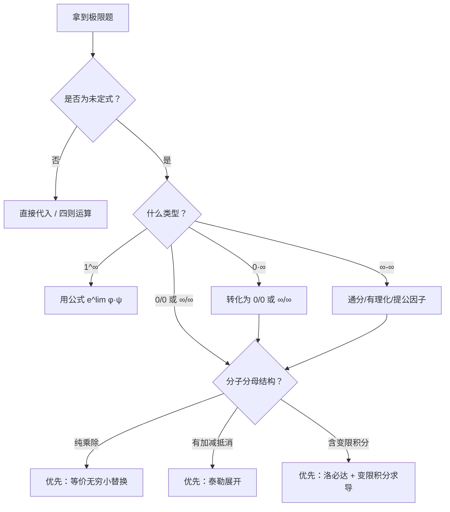
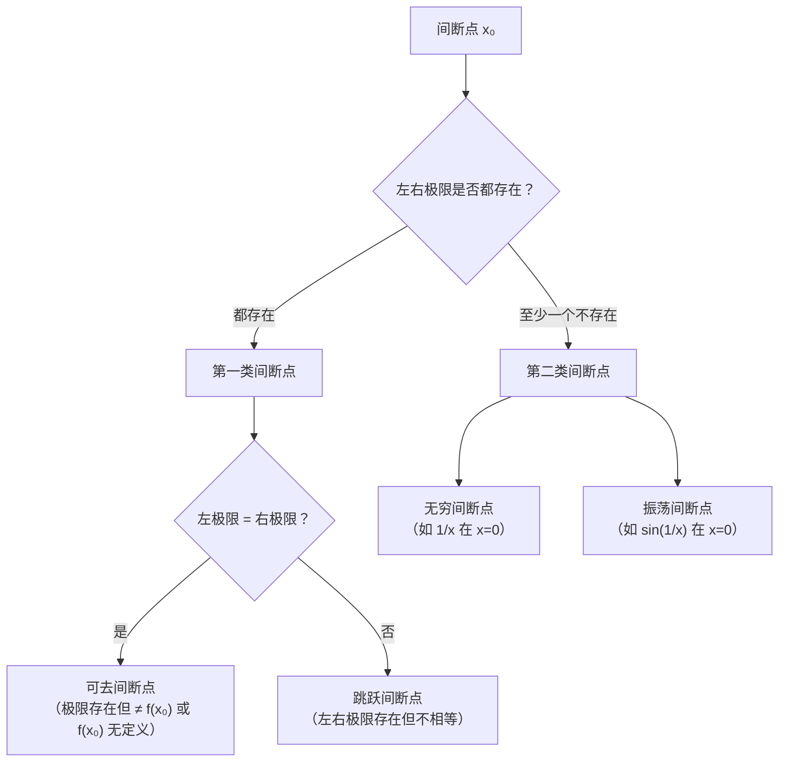
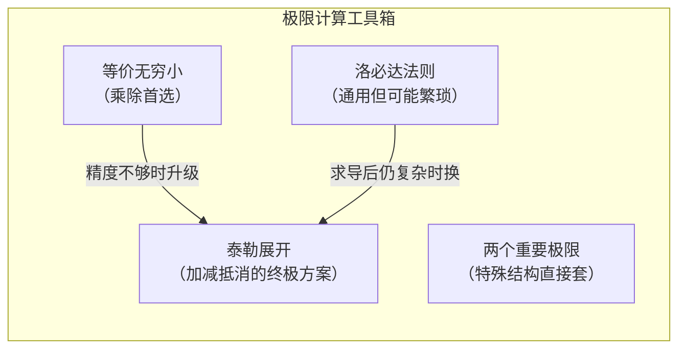

# 第 1 章：函数、极限、连续

> 本章是考研数学二的地基。极限计算贯穿整张试卷——求导是极限、积分是极限、级数（数一）是极限、连续性判断还是极限。一张数二试卷至少有 5-8 处直接涉及极限计算，而间接依赖极限思想的题目更多。可以说：**极限不过关，后面所有章节都建不起来。**

本章的学习目标不是"背定义"，而是**建立一套高效的极限计算工具箱**，并能在考场上 2 分钟内选出最优方法。

---

## 1.1 函数的概念与性质

### 为什么要先讲函数？

极限是对"函数在某点附近的行为"的描述，所以必须先明确"函数是什么"、"有哪些性质可以利用"。考试中，函数的奇偶性、周期性经常用来**简化极限和积分的计算**——比如奇函数在对称区间上的积分为零，这个结论的源头就是函数的奇偶性。

### 核心概念

**函数的三要素**：定义域、对应法则、值域。两个函数相同，当且仅当定义域相同且对应法则相同。

> 易错点： $f(x) = \frac{x^2 - 1}{x - 1}$ 与 $g(x) = x + 1$ 不是同一个函数，因为前者在 $x = 1$ 处无定义。

### 四大性质

**1. 奇偶性**

设 $f(x)$ 的定义域关于原点对称：

$$
f(-x) = f(x) \implies f \text{ 为偶函数（图像关于 } y \text{ 轴对称）}
$$

$$
f(-x) = -f(x) \implies f \text{ 为奇函数（图像关于原点对称）}
$$

**实用结论**（后续章节反复使用）：

- 奇函数 $\times$ 奇函数 $=$ 偶函数
- 奇函数 $\times$ 偶函数 $=$ 奇函数
- 偶函数 $\times$ 偶函数 $=$ 偶函数
- 奇函数在对称区间 $[-a, a]$ 上的定积分为 $0$

**2. 周期性**

若存在 $T > 0$ 使得 $f(x + T) = f(x)$ 对所有 $x$ 成立，则 $f$ 以 $T$ 为周期。

> 注意： $\sin x$ 的周期是 $2\pi$ ， $\sin 2x$ 的周期是 $\pi$ 。一般地， $\sin(\omega x)$ 的周期为 $\frac{2\pi}{\lvert\omega\rvert}$ 。

**3. 有界性**

若存在 $M > 0$ 使得 $\lvert f(x) \rvert \leq M$ 对定义域内所有 $x$ 成立，则 $f$ 有界。

> 有界性在极限中的用途：**有界量 $\times$ 无穷小 $=$ 无穷小**。这是求极限时的重要技巧。

**4. 单调性**

严格单调函数一定存在反函数（后面会用到）。单调有界数列必有极限——这是证明极限存在的重要工具。

### 典型例题

**例 1**：判断 $f(x) = x \cdot \sin x$ 的奇偶性。

**解**：定义域为 $\mathbb{R}$ ，关于原点对称。

$$
f(-x) = (-x) \cdot \sin(-x) = (-x) \cdot (-\sin x) = x \sin x = f(x)
$$

所以 $f(x) = x \sin x$ 是**偶函数**。

> 直觉： $x$ 是奇函数， $\sin x$ 是奇函数，奇 $\times$ 奇 $=$ 偶。

---

## 1.2 反函数、复合函数与初等函数

### 反函数

若 $y = f(x)$ 是严格单调的，则存在反函数 $x = f^{-1}(y)$ 。

**关键性质**：

$$
f(f^{-1}(x)) = x, \quad f^{-1}(f(x)) = x
$$

反函数的图像与原函数关于直线 $y = x$ 对称。

> 考试中反函数主要出现在：已知 $f(x)$ 的表达式，求 $f^{-1}(x)$ 的定义域或某点值。

### 复合函数

复合函数 $y = f(g(x))$ 的定义域要求： $g(x)$ 的值域（或其子集）落在 $f$ 的定义域内。

**分段函数的复合**是考试易错点。例如：

$$
f(x) = \begin{cases} x^2, & x \geq 0 \\ -x, & x < 0 \end{cases}
$$

求 $f(f(x))$ 时，需要分情况讨论 $f(x)$ 的正负，再代入外层。

### 初等函数

由基本初等函数（幂、指、对、三角、反三角）经过有限次四则运算和复合得到的函数，统称**初等函数**。

**核心事实**：初等函数在其定义域内连续。

> 这意味着：如果 $f(x)$ 是初等函数且 $x_0$ 在定义域内，则 $\lim_{x \to x_0} f(x) = f(x_0)$ ，直接代入即可。极限的"困难"只出现在定义域的边界点或使表达式无意义的点。

---

## 1.3 极限的定义与性质

### 直觉理解

$\lim_{x \to x_0} f(x) = A$ 的意思是：当 $x$ 无限接近 $x_0$ （但不等于 $x_0$ ）时， $f(x)$ 无限接近 $A$ 。

**注意**：极限值与 $f(x_0)$ 是否存在、等于多少**完全无关**。极限描述的是"趋近过程"，不是"到达"。

### $\varepsilon$-$\delta$ 语言（了解即可）

$$
\forall \varepsilon > 0,\ \exists \delta > 0,\ \text{当 } 0 < \lvert x - x_0 \rvert < \delta \text{ 时},\ \lvert f(x) - A \rvert < \varepsilon
$$

数二不要求用 $\varepsilon$-$\delta$ 语言证明极限，但需要理解其逻辑结构（"任意小"与"存在"的关系），因为后续中值定理的证明思想与此一脉相承。

### 极限的性质

设 $\lim_{x \to x_0} f(x) = A$ ，则：

1. **唯一性**：极限若存在则唯一
2. **局部有界性**：存在 $x_0$ 的某去心邻域， $f(x)$ 在其中有界
3. **局部保号性**：若 $A > 0$ ，则存在去心邻域使 $f(x) > 0$ 。反之，若在去心邻域内 $f(x) > 0$ ，只能推出 $A \geq 0$ （等号不能省，如 $f(x) = x^2 > 0$ （ $x \neq 0$ ）但 $\lim_{x \to 0} f(x) = 0$ ）

> 局部保号性是证明题的利器。例如：若 $f(x_0) > 0$ 且 $f$ 连续，则 $f$ 在 $x_0$ 附近都大于 $0$ 。

### 极限存在的充要条件

$$
\lim_{x \to x_0} f(x) = A \iff \lim_{x \to x_0^-} f(x) = \lim_{x \to x_0^+} f(x) = A
$$

**左极限 $=$ 右极限**，这是判断分段函数在分界点处极限是否存在的标准方法。

---

## 1.4 极限运算法则

### 四则运算

设 $\lim f(x) = A$ ， $\lim g(x) = B$ （均存在），则：

$$
\lim [f(x) \pm g(x)] = A \pm B
$$

$$
\lim [f(x) \cdot g(x)] = A \cdot B
$$

$$
\lim \frac{f(x)}{g(x)} = \frac{A}{B} \quad (B \neq 0)
$$

> **使用前提**：各部分的极限必须存在。如果 $\lim f(x)$ 不存在，不能拆开算。

### 复合运算

若 $\lim_{x \to x_0} g(x) = u_0$ ，且 $f(u)$ 在 $u_0$ 处连续，则：

$$
\lim_{x \to x_0} f(g(x)) = f\!\left(\lim_{x \to x_0} g(x)\right) = f(u_0)
$$

> 这就是"连续函数可以把极限号穿进去"的依据。

### 易错点

- $\lim \frac{f(x)}{g(x)}$ 中，若 $A = 0$ ， $B = 0$ ，则**不能**直接用商的法则，这是 $\frac{0}{0}$ 型未定式，需要其他方法（等价无穷小、洛必达、泰勒展开）。
- 拆项时注意： $\lim [f(x) - g(x)]$ 中若两项都趋于 $\infty$ ，不能直接拆（ $\infty - \infty$ 型未定式）。

---

## 1.5 两个重要极限

### 第一个重要极限

$$
\lim_{x \to 0} \frac{\sin x}{x} = 1
$$

**本质**：当 $x \to 0$ 时， $\sin x$ 与 $x$ 是等价无穷小。

**推广形式**：若 $\lim \varphi(x) = 0$ ，则

$$
\lim \frac{\sin \varphi(x)}{\varphi(x)} = 1
$$

**例 2**：求 $\lim_{x \to 0} \frac{\sin 3x}{\sin 5x}$ 。

**解**：

$$
\lim_{x \to 0} \frac{\sin 3x}{\sin 5x} = \lim_{x \to 0} \frac{\sin 3x}{3x} \cdot \frac{5x}{\sin 5x} \cdot \frac{3x}{5x} = 1 \cdot 1 \cdot \frac{3}{5} = \frac{3}{5}
$$

### 第二个重要极限

$$
\lim_{x \to \infty} \left(1 + \frac{1}{x}\right)^x = e
$$

等价形式（令 $t = \frac{1}{x}$ ）：

$$
\lim_{t \to 0} (1 + t)^{1/t} = e
$$

**推广**：若 $\lim \varphi(x) = 0$ ，则

$$
\lim [1 + \varphi(x)]^{1/\varphi(x)} = e
$$

**例 3**：求 $\lim_{x \to \infty} \left(\frac{x+1}{x-1}\right)^x$ 。

**解**：

$$
\left(\frac{x+1}{x-1}\right)^x = \left(1 + \frac{2}{x-1}\right)^x = \left[\left(1 + \frac{2}{x-1}\right)^{\frac{x-1}{2}}\right]^{\frac{2x}{x-1}}
$$

当 $x \to \infty$ 时，底数趋于 $e$ ，指数 $\frac{2x}{x-1} \to 2$ ，所以：

$$
\lim_{x \to \infty} \left(\frac{x+1}{x-1}\right)^x = e^2
$$

> **$1^\infty$ 型极限的通用公式**：若 $\lim \varphi(x) = 0$ ， $\lim \psi(x) = \infty$ ，且 $\lim \varphi(x) \cdot \psi(x) = A$ ，则
>
> $$
> \lim [1 + \varphi(x)]^{\psi(x)} = e^A
> $$

---

## 1.6 无穷小与无穷大

### 定义

- **无穷小**：若 $\lim_{x \to x_0} \alpha(x) = 0$ ，则称 $\alpha(x)$ 是 $x \to x_0$ 时的无穷小量。
- **无穷大**：若 $\lim_{x \to x_0} f(x) = \infty$ ，则称 $f(x)$ 是 $x \to x_0$ 时的无穷大量。

> 无穷小不是"很小的数"，而是"趋于零的变量"。 $0$ 是唯一的常数无穷小。

### 无穷小的比较

设 $\alpha(x)$ 、 $\beta(x)$ 都是 $x \to x_0$ 时的无穷小，且 $\beta(x) \neq 0$ ：

| $\lim \frac{\alpha(x)}{\beta(x)}$ 的值 | 关系 | 记号 |
|---|---|---|
| $0$ | $\alpha$ 是 $\beta$ 的高阶无穷小 | $\alpha = o(\beta)$ |
| $\infty$ | $\alpha$ 是 $\beta$ 的低阶无穷小 | — |
| $c \neq 0$ （常数） | $\alpha$ 与 $\beta$ 同阶 | $\alpha = O(\beta)$ |
| $1$ | $\alpha$ 与 $\beta$ 等价 | $\alpha \sim \beta$ |

> **为什么要比较？** 等价无穷小可以在乘除运算中互相替换，大幅简化极限计算。这是求极限的**第一选择**。

### 无穷小与无穷大的关系

在同一极限过程中：

- $f(x)$ 是无穷大 $\iff$ $\frac{1}{f(x)}$ 是无穷小
- $f(x)$ 是非零无穷小 $\implies$ $\frac{1}{f(x)}$ 是无穷大

---

## 1.7 等价无穷小替换

### 常用等价无穷小（ $x \to 0$ ）

这是必须**烂熟于心**的表：

| 等价关系 | 等价关系 |
|---|---|
| $\sin x \sim x$ | $\tan x \sim x$ |
| $\arcsin x \sim x$ | $\arctan x \sim x$ |
| $\ln(1+x) \sim x$ | $e^x - 1 \sim x$ |
| $a^x - 1 \sim x \ln a$ | $(1+x)^\alpha - 1 \sim \alpha x$ |
| $1 - \cos x \sim \dfrac{x^2}{2}$ | $x - \sin x \sim \dfrac{x^3}{6}$ |

### 使用规则

**核心原则：乘除可换，加减慎换。**

- 在**乘积或商**中，任何因子都可以用等价无穷小替换。
- 在**加减**中，一般不能直接替换（除非替换后不抵消为零）。

**例 4**：求 $\lim_{x \to 0} \frac{\tan x - \sin x}{x^3}$ 。

**错误做法**： $\tan x \sim x$ ， $\sin x \sim x$ ，所以分子 $\sim x - x = 0$ ？❌

**正确做法**：

$$
\tan x - \sin x = \frac{\sin x}{\cos x} - \sin x = \sin x \cdot \frac{1 - \cos x}{\cos x}
$$

当 $x \to 0$ 时： $\sin x \sim x$ ， $1 - \cos x \sim \frac{x^2}{2}$ ， $\cos x \to 1$ ，所以：

$$
\lim_{x \to 0} \frac{\tan x - \sin x}{x^3} = \lim_{x \to 0} \frac{x \cdot \frac{x^2}{2}}{x^3 \cdot 1} = \frac{1}{2}
$$

> **教训**：加减法中用等价无穷小，如果替换后最高阶项抵消了，就必须保留更高阶项（用泰勒展开）。

### 替换的推广

等价无穷小替换不限于 $x \to 0$ ，只要"整体趋于 $0$ "即可。例如 $x \to 1$ 时， $\ln x = \ln(1 + (x-1)) \sim x - 1$ 。

---

## 1.8 洛必达法则

### 定理

设 $f(x)$ 、 $g(x)$ 在 $x_0$ 的去心邻域内可导， $g'(x) \neq 0$ ，且：

$$
\lim_{x \to x_0} f(x) = \lim_{x \to x_0} g(x) = 0 \quad \text{（或两者都趋于 } \infty \text{）}
$$

若 $\lim_{x \to x_0} \frac{f'(x)}{g'(x)}$ 存在（或为 $\infty$ ），则：

$$
\lim_{x \to x_0} \frac{f(x)}{g(x)} = \lim_{x \to x_0} \frac{f'(x)}{g'(x)}
$$

### 适用类型与转化

洛必达法则直接适用于 $\frac{0}{0}$ 和 $\frac{\infty}{\infty}$ 。其他未定式需要先转化：

| 未定式类型 | 转化方法 |
|---|---|
| $0 \cdot \infty$ | 将 $0$ 的因子放到分母： $f \cdot g = \frac{f}{1/g}$ |
| $\infty - \infty$ | 通分、有理化、或提取公因子化为 $\frac{0}{0}$ |
| $0^0$ 、 $1^\infty$ 、 $\infty^0$ | 取对数： $f^g = e^{g \ln f}$ ，转化为 $0 \cdot \infty$ |

### 典型例题

**例 5**：求 $\lim_{x \to 0} \frac{e^x - 1 - x}{x^2}$ （ $\frac{0}{0}$ 型）。

**解**：用洛必达法则（对分子分母分别求导）：

$$
\lim_{x \to 0} \frac{e^x - 1 - x}{x^2} \xlongequal{\text{L'H}} \lim_{x \to 0} \frac{e^x - 1}{2x} \xlongequal{\text{L'H}} \lim_{x \to 0} \frac{e^x}{2} = \frac{1}{2}
$$

**例 6**：求 $\lim_{x \to 0^+} x \ln x$ （ $0 \cdot \infty$ 型）。

**解**：转化为 $\frac{\infty}{\infty}$ ：

$$
\lim_{x \to 0^+} x \ln x = \lim_{x \to 0^+} \frac{\ln x}{1/x} \xlongequal{\text{L'H}} \lim_{x \to 0^+} \frac{1/x}{-1/x^2} = \lim_{x \to 0^+} (-x) = 0
$$

### 易错点

1. **使用前必须验证**：确认是 $\frac{0}{0}$ 或 $\frac{\infty}{\infty}$ 型。不是未定式就不能用洛必达。
2. **洛必达可能失败**：若 $\lim \frac{f'(x)}{g'(x)}$ 不存在（且不为 $\infty$ ），不能断定原极限不存在，只是洛必达不适用。
3. **不要无脑反复洛必达**：如果求导后表达式越来越复杂，应该换方法（泰勒展开）。

---

## 1.9 极限计算的三大方法与选用策略

这是本章最核心的内容。考场上看到一道极限题，你需要在 10 秒内决定用哪种方法。

### 方法对比

| 方法 | 适用场景 | 优势 | 局限 |
|---|---|---|---|
| 等价无穷小替换 | 乘除结构中的无穷小因子 | 最快，一步到位 | 加减中受限 |
| 洛必达法则 | $\frac{0}{0}$ 、 $\frac{\infty}{\infty}$ 及其变体 | 通用性强 | 可能越算越复杂 |
| 泰勒展开 | 加减抵消、需要精确到某阶 | 最精确，一次解决 | 需要记住展开式 |

### 选用策略（决策流程）

### 泰勒展开求极限（核心方法）

当等价无穷小在加减法中"精度不够"时，泰勒展开是终极武器。

**常用麦克劳林展开**（ $x \to 0$ ，带佩亚诺余项）：

$$
e^x = 1 + x + \frac{x^2}{2!} + \frac{x^3}{3!} + o(x^3)
$$

$$
\sin x = x - \frac{x^3}{3!} + o(x^3)
$$

$$
\cos x = 1 - \frac{x^2}{2!} + \frac{x^4}{4!} + o(x^4)
$$

$$
\ln(1+x) = x - \frac{x^2}{2} + \frac{x^3}{3} + o(x^3)
$$

$$
(1+x)^\alpha = 1 + \alpha x + \frac{\alpha(\alpha-1)}{2} x^2 + o(x^2)
$$

**展开到几阶？** 原则：**分母是几阶，分子就展开到几阶**。

**例 7**：求 $\lim_{x \to 0} \frac{e^x - 1 - x - \frac{x^2}{2}}{x^3}$ 。

**解**：分母是 $x^3$ （三阶），分子展开到三阶：

$$
e^x = 1 + x + \frac{x^2}{2} + \frac{x^3}{6} + o(x^3)
$$

代入：

$$
e^x - 1 - x - \frac{x^2}{2} = \frac{x^3}{6} + o(x^3)
$$

所以：

$$
\lim_{x \to 0} \frac{\frac{x^3}{6} + o(x^3)}{x^3} = \frac{1}{6}
$$

**例 8**：求 $\lim_{x \to 0} \frac{\ln(1+x) - x}{x^2}$ 。

**解**：分母二阶，展开 $\ln(1+x)$ 到二阶：

$$
\ln(1+x) = x - \frac{x^2}{2} + o(x^2)
$$

$$
\ln(1+x) - x = -\frac{x^2}{2} + o(x^2)
$$

$$
\lim_{x \to 0} \frac{-\frac{x^2}{2} + o(x^2)}{x^2} = -\frac{1}{2}
$$

### 综合例题：三种方法对比

**例 9**：求 $\lim_{x \to 0} \frac{\sin x - x \cos x}{x^3}$ 。

**方法一（泰勒展开）**：

$$
\sin x = x - \frac{x^3}{6} + o(x^3), \quad \cos x = 1 - \frac{x^2}{2} + o(x^2)
$$

$$
x \cos x = x - \frac{x^3}{2} + o(x^3)
$$

$$
\sin x - x\cos x = \left(x - \frac{x^3}{6}\right) - \left(x - \frac{x^3}{2}\right) + o(x^3) = \frac{x^3}{3} + o(x^3)
$$

$$
\lim_{x \to 0} \frac{\sin x - x\cos x}{x^3} = \frac{1}{3}
$$

**方法二（洛必达）**：

$$
\xlongequal{\text{L'H}} \lim_{x \to 0} \frac{\cos x - \cos x + x\sin x}{3x^2} = \lim_{x \to 0} \frac{x \sin x}{3x^2} = \lim_{x \to 0} \frac{\sin x}{3x} = \frac{1}{3}
$$

> 本题洛必达一次后恰好能用等价无穷小，所以也很快。但如果第一次洛必达后仍然复杂，泰勒展开往往更直接。

---

## 1.10 函数的连续性与间断点

### 连续的定义

$f(x)$ 在 $x_0$ 处连续，需要**同时满足三个条件**：

1. $f(x_0)$ 有定义
2. $\lim_{x \to x_0} f(x)$ 存在
3. $\lim_{x \to x_0} f(x) = f(x_0)$

三个条件缺一不可。违反任何一个， $x_0$ 就是间断点。

### 间断点分类

### 典型例题

**例 10**：讨论 $f(x) = \frac{x^2 - 1}{x - 1}$ 在 $x = 1$ 处的连续性。

**解**： $f(1)$ 无定义（分母为零），但：

$$
\lim_{x \to 1} \frac{x^2 - 1}{x - 1} = \lim_{x \to 1} \frac{(x-1)(x+1)}{x-1} = \lim_{x \to 1} (x+1) = 2
$$

极限存在，但函数在该点无定义，所以 $x = 1$ 是**可去间断点**。若补充定义 $f(1) = 2$ ，则函数在 $x = 1$ 处连续。

**例 11**：讨论 $f(x) = \begin{cases} x + 1, & x < 0 \\ x - 1, & x \geq 0 \end{cases}$ 在 $x = 0$ 处的连续性。

**解**：

$$
\lim_{x \to 0^-} f(x) = \lim_{x \to 0^-} (x + 1) = 1
$$

$$
\lim_{x \to 0^+} f(x) = \lim_{x \to 0^+} (x - 1) = -1
$$

左右极限都存在但不相等，所以 $x = 0$ 是**跳跃间断点**。

### 易错点

- 判断间断点类型时，**先算左右极限**，不要凭直觉。
- $\frac{0}{0}$ 型往往暗示可去间断点（约分后极限存在）。
- 分段函数的分界点是间断点的"高发区"，必须逐一检验。

---

## 1.11 闭区间上连续函数的性质

### 三大定理

设 $f(x)$ 在闭区间 $[a, b]$ 上连续：

**1. 最值定理（Weierstrass 定理）**

$f(x)$ 在 $[a, b]$ 上必能取到最大值和最小值。

> 注意条件：必须是**闭区间** + **连续**。开区间或不连续都可能取不到最值。

**2. 介值定理**

若 $f(a) \neq f(b)$ ，则对 $f(a)$ 与 $f(b)$ 之间的任何值 $C$ ，必存在 $\xi \in (a, b)$ 使得 $f(\xi) = C$ 。

> 直觉：连续函数的图像是一条"不断裂"的曲线，从 $f(a)$ 到 $f(b)$ 必须经过中间所有值。

**3. 零点定理（介值定理的特例）**

若 $f(a) \cdot f(b) < 0$ （即两端异号），则必存在 $\xi \in (a, b)$ 使得 $f(\xi) = 0$ 。

### 考试中的应用

零点定理和介值定理主要用于**证明题**：证明方程在某区间内有根、证明存在某点使等式成立。

**例 12**：证明方程 $x^3 - 3x + 1 = 0$ 在 $(0, 1)$ 内至少有一个根。

**证明**：设 $f(x) = x^3 - 3x + 1$ ，则 $f$ 在 $[0, 1]$ 上连续（多项式函数）。

$$
f(0) = 1 > 0, \quad f(1) = 1 - 3 + 1 = -1 < 0
$$

由零点定理，存在 $\xi \in (0, 1)$ 使得 $f(\xi) = 0$ 。 $\blacksquare$

**例 13**（介值定理的进阶用法）：设 $f(x)$ 在 $[a, b]$ 上连续， $x_1, x_2 \in [a, b]$ 。证明存在 $\xi \in [a, b]$ 使得

$$
f(\xi) = \frac{f(x_1) + f(x_2)}{2}
$$

**证明**： $\frac{f(x_1) + f(x_2)}{2}$ 是 $f(x_1)$ 与 $f(x_2)$ 的算术平均值，必介于两者之间（或等于其中之一）。由介值定理，存在 $\xi$ 在 $x_1$ 与 $x_2$ 之间（从而在 $[a, b]$ 内），使得 $f(\xi) = \frac{f(x_1) + f(x_2)}{2}$ 。 $\blacksquare$

---

## 本章小结

### 核心方法体系

### 考试重点排序

1. **极限计算**（每年必考，选择/填空/大题都可能出现）
   - 等价无穷小替换：最快，优先尝试
   - 泰勒展开：加减型 $\frac{0}{0}$ 的标准解法
   - 洛必达法则：含变限积分时的首选
   - $1^\infty$ 型：套 $e^{\lim \varphi \cdot \psi}$ 公式

2. **间断点分类**（选择题高频）
   - 算左右极限 → 判断类型

3. **零点定理/介值定理**（证明题）
   - 构造辅助函数 + 验证端点异号

### 常见陷阱清单

| 陷阱 | 正确做法 |
|---|---|
| 加减法中直接替换等价无穷小 | 改用泰勒展开，保留到不抵消的阶 |
| 非未定式使用洛必达 | 先验证确实是 $\frac{0}{0}$ 或 $\frac{\infty}{\infty}$ |
| 忽略分段函数的左右极限 | 分界点必须分别求左右极限 |
| 极限存在 $\neq$ 函数连续 | 连续还要求极限值 $=$ 函数值 |
| 介值定理用于开区间或不连续函数 | 定理条件：闭区间 + 连续 |

### 一句话总结

> 极限计算是数二的"计算基本功"，等价无穷小和泰勒展开是两把最锋利的刀——前者快，后者准。考场上先判断结构，再选方法，切忌无脑洛必达。
